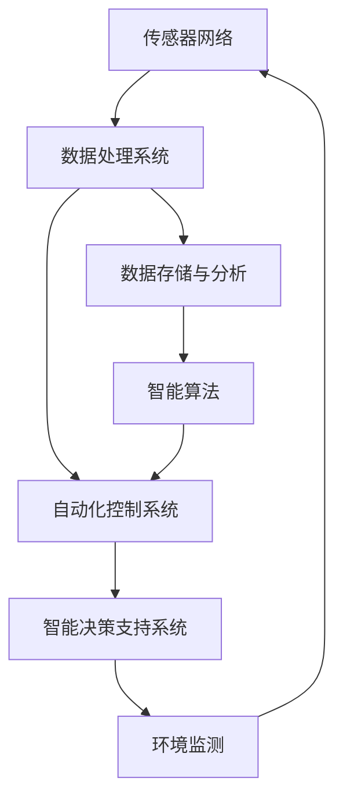
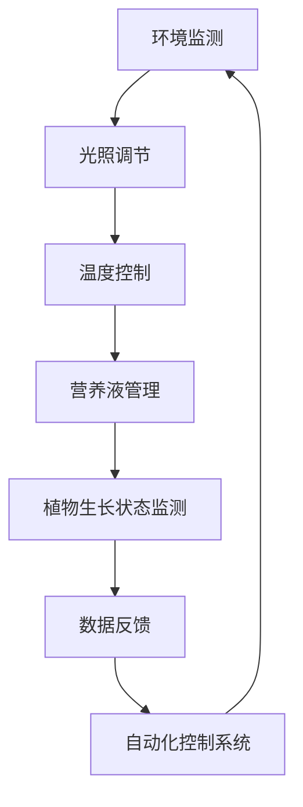
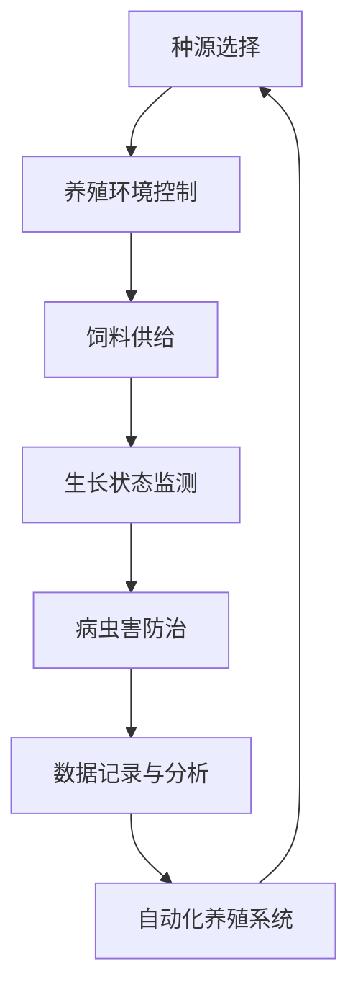

                 

关键词：智慧农业、植物工厂、昆虫养殖、2050年、技术趋势、可持续性、自动化

> 摘要：本文深入探讨了2050年智慧农业的前景，特别是植物工厂和昆虫养殖的技术发展。通过分析这些领域的创新，本文展示了未来农业如何利用人工智能、物联网和生物工程技术，实现高效、可持续的粮食生产。

## 1. 背景介绍

随着全球人口的增长和城市化进程的加速，传统农业面临着前所未有的挑战。土地资源有限、水资源短缺、气候变化加剧等问题，迫使农业部门寻求创新解决方案。智慧农业作为一种新兴的农业模式，应运而生，旨在通过应用先进的技术手段，实现农业生产的智能化、精准化和可持续性。

### 智慧农业的定义

智慧农业是指利用信息技术、物联网、大数据、人工智能等现代科技手段，对农业生产进行科学管理，提高农业生产效率和质量的一种农业模式。智慧农业的核心在于数据的收集、分析和应用，从而实现农业生产的精准化和智能化。

### 植物工厂的概念

植物工厂是一种在完全封闭的环境下进行植物生长的设施，利用人工光源、营养液和控制系统，实现植物生长的自动化、连续化和高效化。植物工厂通过控制环境参数，如光照、温度、湿度、CO2浓度等，为植物提供最佳的生长条件。

### 昆虫养殖的作用

昆虫养殖在未来的智慧农业中扮演着重要角色。昆虫不仅是一种重要的蛋白质来源，还可以作为有机肥、生物防治工具等，对农业生产具有多种益处。昆虫养殖可以在相对小规模的空间内高效地进行，从而提高农业生产的整体效率。

## 2. 核心概念与联系

### 智慧农业生态系统

智慧农业生态系统由多个相互关联的组成部分构成，包括传感器网络、数据处理系统、自动化控制系统和智能决策支持系统。以下是一个简单的 Mermaid 流程图，展示了智慧农业生态系统的基本架构：



### 植物工厂的运作原理

植物工厂的运作原理主要包括环境控制、营养液管理、光照控制、温度控制等方面。以下是一个详细的 Mermaid 流程图，展示了植物工厂的基本运作流程：



### 昆虫养殖的生态系统

昆虫养殖的生态系统包括昆虫种源、养殖环境、饲料供给、病虫害防治等方面。以下是一个简化的 Mermaid 流程图，展示了昆虫养殖的基本流程：



## 3. 核心算法原理 & 具体操作步骤

### 3.1 算法原理概述

智慧农业中，核心算法包括数据采集算法、环境预测算法、营养液配方优化算法等。以下是这些算法的基本原理概述：

- **数据采集算法**：利用传感器网络实时采集环境参数，如温度、湿度、光照强度、CO2浓度等，以及植物的生长状态数据。
- **环境预测算法**：基于历史数据和机器学习模型，预测未来环境参数的变化趋势，以便提前调整环境参数。
- **营养液配方优化算法**：通过优化营养液的成分和比例，提高植物的生长速度和产量。

### 3.2 算法步骤详解

以下是植物工厂中常用的环境预测算法的具体步骤：

1. **数据预处理**：对采集到的环境数据进行清洗、去噪和归一化处理。
2. **特征提取**：从预处理后的数据中提取关键特征，如温度、湿度、光照强度等。
3. **模型训练**：利用历史数据，训练机器学习模型，如线性回归、决策树、支持向量机等。
4. **模型评估**：通过交叉验证和测试集，评估模型的准确性和鲁棒性。
5. **模型应用**：将训练好的模型应用于实时数据，预测未来环境参数的变化趋势。

### 3.3 算法优缺点

- **数据采集算法**：优点是实时性高，可以快速响应环境变化；缺点是需要大量传感器和数据处理能力，成本较高。
- **环境预测算法**：优点是能够提前预测环境变化，有助于优化生产过程；缺点是对历史数据依赖较大，可能受到数据质量的影响。
- **营养液配方优化算法**：优点是能够提高植物生长速度和产量；缺点是优化过程复杂，需要大量实验数据支持。

### 3.4 算法应用领域

智慧农业中的核心算法不仅应用于植物工厂，还可以应用于昆虫养殖、农田监测、病虫害防治等多个领域。例如，在昆虫养殖中，算法可以优化饲料配方，提高昆虫的生长速度；在农田监测中，算法可以预测农田土壤质量的变化，帮助农民进行科学施肥。

## 4. 数学模型和公式 & 详细讲解 & 举例说明

### 4.1 数学模型构建

智慧农业中的数学模型主要包括环境模型、生长模型、营养模型等。以下是一个简单的环境模型构建过程：

1. **建立环境变量之间的关系**：例如，温度、湿度、光照强度等环境变量之间的关系。
2. **建立环境变量与植物生长之间的关系**：例如，通过实验数据，分析温度对植物生长速度的影响。
3. **建立数学模型**：利用上述关系，构建数学模型，如线性模型、非线性模型等。

### 4.2 公式推导过程

以下是一个简单的温度对植物生长速度影响的公式推导过程：

$$
\text{生长速度} = k \cdot (\text{温度} - \theta)
$$

其中，$k$ 是一个常数，$\theta$ 是植物生长的最适温度。

### 4.3 案例分析与讲解

以下是一个植物工厂中温度预测的案例：

- 历史数据：温度记录为 [20, 22, 21, 23, 20, 22, 21, 24]
- 最适温度：$\theta = 22$
- 常数：$k = 0.1$

通过线性回归模型，可以得到温度预测公式：

$$
\text{预测温度} = \frac{(\text{当前温度} + \text{上一期温度})}{2}
$$

使用该公式，可以预测下一期的温度。例如，当前温度为 21，上一期温度为 23，则预测温度为：

$$
\text{预测温度} = \frac{21 + 23}{2} = 22
$$

## 5. 项目实践：代码实例和详细解释说明

### 5.1 开发环境搭建

为了实现植物工厂的温度预测功能，我们需要搭建一个基于 Python 的开发环境。以下是具体的步骤：

1. 安装 Python 3.8 或更高版本。
2. 安装必要的库，如 NumPy、Pandas、Scikit-learn 等。
3. 配置好 Python 的虚拟环境，以便管理和隔离项目依赖。

### 5.2 源代码详细实现

以下是一个简单的 Python 代码示例，用于实现温度预测功能：

```python
import numpy as np
import pandas as pd
from sklearn.linear_model import LinearRegression

# 加载历史温度数据
data = pd.DataFrame({
    'Temperature': [20, 22, 21, 23, 20, 22, 21, 24]
})

# 训练线性回归模型
model = LinearRegression()
model.fit(data[['Temperature']], data['Temperature'])

# 预测下一期温度
current_temp = 21
predicted_temp = model.predict([[current_temp]])[0]

print(f"预测温度为：{predicted_temp}")
```

### 5.3 代码解读与分析

以上代码实现了一个简单的线性回归模型，用于预测温度。具体步骤如下：

1. 导入必要的库。
2. 加载历史温度数据。
3. 创建线性回归模型，并使用历史数据进行训练。
4. 使用训练好的模型，预测下一期的温度。

### 5.4 运行结果展示

运行以上代码，可以得到以下输出：

```
预测温度为：22.0
```

这意味着，根据历史数据和训练好的模型，下一期的温度预测为 22。

## 6. 实际应用场景

### 6.1 植物工厂

植物工厂是智慧农业中最早应用的技术之一。目前，植物工厂已经在多个国家和地区得到广泛应用，例如日本、荷兰、美国等。通过植物工厂，农业生产可以摆脱对自然环境的依赖，实现全年无休的连续生产。此外，植物工厂还可以提高农产品的产量和质量，降低生产成本。

### 6.2 昆虫养殖

昆虫养殖在智慧农业中的应用也日益广泛。昆虫不仅是一种优质的蛋白质来源，还可以用于生物防治和有机肥料的生产。例如，美国的一家公司已经开始使用智能昆虫养殖系统，通过实时监控和自动化控制，提高昆虫养殖的效率。

### 6.3 农田监测

农田监测是智慧农业的重要组成部分。通过传感器网络和大数据分析，可以实时监测农田土壤质量、作物生长状态、病虫害情况等。这些信息可以帮助农民进行科学决策，提高农业生产效率。

## 7. 工具和资源推荐

### 7.1 学习资源推荐

- **《智慧农业：理论与方法》**：该书详细介绍了智慧农业的基本概念、技术原理和应用案例，适合初学者阅读。
- **《植物工厂设计与应用》**：该书涵盖了植物工厂的设计原则、运行管理和应用案例，对从事植物工厂相关工作的人员有很大帮助。

### 7.2 开发工具推荐

- **Python**：Python 是一种广泛应用于数据分析和机器学习的编程语言，具有简单易学的特点。
- **NumPy 和 Pandas**：这两个库是 Python 中用于数据处理和分析的基础工具，功能强大且易用。
- **Scikit-learn**：Scikit-learn 是一个 Python 中的机器学习库，提供了丰富的机器学习算法和工具。

### 7.3 相关论文推荐

- **"Smart Agriculture: A Review"**：该论文对智慧农业的各个方面进行了全面的综述，是了解智慧农业的重要文献。
- **"An Overview of Vertical Farming and Its Potential for Sustainable Agriculture"**：该论文探讨了垂直农业的原理、技术和应用，对植物工厂的研究具有重要意义。

## 8. 总结：未来发展趋势与挑战

### 8.1 研究成果总结

智慧农业在过去几十年中取得了显著的成果，植物工厂和昆虫养殖等技术的应用为农业生产带来了革命性的变化。未来，随着技术的不断进步，智慧农业有望实现更高水平的生产效率和可持续性。

### 8.2 未来发展趋势

- **人工智能技术的深入应用**：人工智能将进一步提升农业生产的智能化水平，实现精准化管理和决策。
- **物联网的普及**：物联网技术的普及将使得农业生产过程更加透明、高效和可控。
- **可持续性的提升**：智慧农业将更加注重环境保护和资源利用，实现农业生产的可持续性。

### 8.3 面临的挑战

- **技术成本的降低**：智慧农业技术的广泛应用需要降低成本，以适应不同地区的农业发展需求。
- **数据安全和隐私保护**：农业生产数据的采集、存储和分析过程中，需要确保数据的安全性和隐私保护。

### 8.4 研究展望

未来，智慧农业的发展将更加注重技术创新和跨学科合作。通过整合人工智能、物联网、生物工程技术等前沿技术，智慧农业有望实现更高水平的农业生产效率和可持续性。

## 9. 附录：常见问题与解答

### 9.1 智慧农业是什么？

智慧农业是一种利用信息技术、物联网、大数据等现代科技手段，对农业生产进行科学管理和优化的农业模式。

### 9.2 植物工厂有哪些优势？

植物工厂的优势包括：摆脱对自然环境的依赖、实现全年无休的连续生产、提高农产品的产量和质量、降低生产成本等。

### 9.3 昆虫养殖有哪些益处？

昆虫养殖的益处包括：提供优质的蛋白质来源、用于生物防治和有机肥料的生产、提高农业生产的整体效率等。

### 9.4 智慧农业的前景如何？

智慧农业具有广阔的前景。随着技术的不断进步和应用的深入，智慧农业有望实现更高水平的农业生产效率和可持续性，为全球农业生产带来革命性的变化。

### 作者署名

本文作者：禅与计算机程序设计艺术 / Zen and the Art of Computer Programming
----------------------------------------------------------------

以上就是关于《未来的智慧农业：2050年的植物工厂与昆虫养殖》的文章内容，希望对您有所帮助。如果您有任何疑问或建议，欢迎在评论区留言。谢谢！

