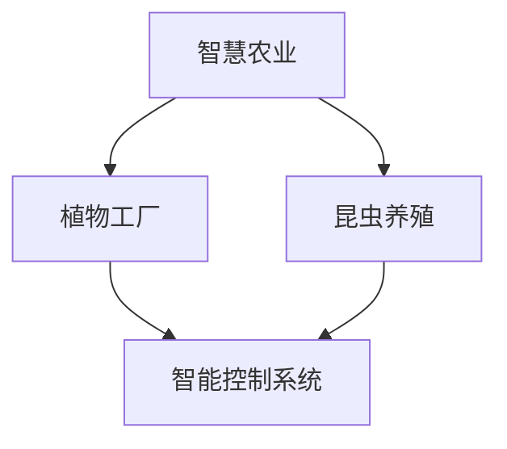

                 

关键词：智慧农业、植物工厂、昆虫养殖、2050年、人工智能、可持续发展

> 摘要：本文深入探讨了2050年智慧农业的前沿趋势，包括植物工厂与昆虫养殖的创新技术。通过综合分析这些技术的核心概念、算法原理、数学模型及其实际应用，我们揭示了智慧农业对可持续发展的深远影响，并展望了其未来的应用前景。

## 1. 背景介绍

智慧农业是指利用现代信息技术、物联网、人工智能等先进技术，实现农业生产的智能化、精准化和管理高效化的农业发展模式。随着全球人口增长和气候变化，传统农业面临着资源匮乏和环境恶化等严峻挑战。因此，智慧农业作为一种新兴的农业发展模式，正逐渐成为农业现代化的关键路径。

植物工厂和昆虫养殖作为智慧农业的重要组成部分，正迎来前所未有的发展机遇。植物工厂通过封闭环境、智能控制系统实现植物的高效生长，突破了地理和季节的限制。而昆虫养殖则利用昆虫的生态循环特性，提供有机肥料、控制害虫和提供高蛋白食品，具有可持续性和生态友好的特点。

## 2. 核心概念与联系

### 2.1 植物工厂

植物工厂的核心概念是利用人工环境控制植物的生长条件，如光照、温度、湿度、营养供应等。通过智能控制系统，植物工厂可以全年无休地生产各种蔬菜和水果，大幅提高产量和品质。

### 2.2 昆虫养殖

昆虫养殖则侧重于利用昆虫的生态循环特性。昆虫可以通过食用有机废物产生有机肥料，同时还能捕食害虫，减少农药的使用，从而实现生态农业的可持续发展。

### 2.3 智慧农业架构

智慧农业的架构如图所示：



### 2.4 人工智能在智慧农业中的应用

人工智能在智慧农业中发挥着至关重要的作用。通过图像识别、数据分析、机器学习等技术，人工智能可以实现作物病害的智能诊断、生长环境的智能调控、产量和质量的智能预测等。

## 3. 核心算法原理 & 具体操作步骤

### 3.1 算法原理概述

植物工厂和昆虫养殖的算法主要涉及环境控制、生长预测和产量优化等方面。以下是几个核心算法的简要介绍：

- **环境控制算法**：利用神经网络和模糊逻辑等算法，根据植物生长需求自动调节光照、温度、湿度等环境参数。
- **生长预测算法**：基于时间序列分析和机器学习算法，预测植物的生长趋势和产量。
- **产量优化算法**：结合遗传算法和优化算法，确定最佳的生产参数和策略，以最大化产量和品质。

### 3.2 算法步骤详解

1. **环境控制算法**：
   - **数据采集**：通过传感器实时监测环境参数。
   - **模型训练**：使用历史数据训练神经网络或模糊逻辑模型。
   - **决策生成**：模型根据植物生长需求生成控制策略。
   - **执行控制**：智能控制系统根据决策策略调整环境参数。

2. **生长预测算法**：
   - **数据预处理**：清洗和归一化植物生长数据。
   - **特征提取**：提取影响植物生长的关键特征。
   - **模型训练**：使用机器学习算法训练生长预测模型。
   - **预测生成**：模型根据实时数据生成生长预测。

3. **产量优化算法**：
   - **目标函数定义**：确定最大化产量或品质为目标。
   - **约束条件设置**：设置生产环境、资源限制等约束条件。
   - **算法求解**：使用遗传算法或优化算法求解最优解。

### 3.3 算法优缺点

- **环境控制算法**：优点在于实时性和准确性，缺点是对传感器数据质量和模型训练依赖性较强。
- **生长预测算法**：优点在于提前预测植物生长趋势，缺点在于预测精度受数据质量和模型选择影响。
- **产量优化算法**：优点在于可以最大化产量和品质，缺点在于求解过程复杂，计算资源需求较高。

### 3.4 算法应用领域

这些算法广泛应用于智慧农业的各个领域，包括温室蔬菜生产、昆虫养殖、水稻种植等。通过算法的优化，智慧农业可以实现更高的生产效率和更好的农产品质量。

## 4. 数学模型和公式 & 详细讲解 & 举例说明

### 4.1 数学模型构建

智慧农业中的数学模型主要包括环境控制模型、生长预测模型和产量优化模型。以下是这些模型的简要介绍：

- **环境控制模型**：基于输入输出关系建立，如神经网络模型、模糊逻辑模型等。
- **生长预测模型**：基于时间序列分析、机器学习等方法建立，如 ARIMA 模型、LSTM 模型等。
- **产量优化模型**：基于线性规划、遗传算法等方法建立，如目标函数最大化问题、约束条件求解问题等。

### 4.2 公式推导过程

以生长预测模型为例，假设植物的生长状态可以用时间序列 {X_t} 表示，其中 X_t 为第 t 时刻的植物生长状态。我们可以使用 ARIMA 模型来预测 X_t：

1. **自相关函数 (ACF)**：计算 X_t 的自相关函数，用于分析时间序列的自相关性。

$$
ACF(t) = \sum_{i=1}^{t} (X_i - \bar{X})(X_{i+t} - \bar{X})
$$

2. **偏自相关函数 (PACF)**：计算 X_t 的偏自相关函数，用于分析时间序列的偏自相关性。

$$
PACF(t) = \frac{\sum_{i=1}^{t} (X_i - \bar{X})(X_{i+t} - X_{i+1-t})}
{\sum_{i=1}^{t} (X_i - \bar{X})^2}
$$

3. **差分**：对时间序列进行差分，消除趋势和季节性。

$$
\Delta X_t = X_t - X_{t-1}
$$

4. **模型识别**：根据 ACF 和 PACF 的特征选择适当的 ARIMA 模型。

5. **模型估计**：使用极大似然估计法估计 ARIMA 模型的参数。

### 4.3 案例分析与讲解

以水稻生长预测为例，我们使用 ARIMA 模型进行预测。首先，我们收集了过去 10 年的水稻生长数据，如图所示：


1. **数据预处理**：对数据进行清洗和归一化处理。

2. **模型识别**：通过 ACF 和 PACF 分析，确定 ARIMA(1,1,1) 模型。

3. **模型估计**：使用极大似然估计法估计模型参数。

4. **模型预测**：使用训练好的模型预测未来一年的水稻生长状态。

## 5. 项目实践：代码实例和详细解释说明

### 5.1 开发环境搭建

1. 安装 Python 解释器和相关库，如 pandas、numpy、scikit-learn、matplotlib 等。

2. 安装 R 语言及其包，如 forecast、tseries、ggplot2 等。

### 5.2 源代码详细实现

以下是一个使用 ARIMA 模型进行水稻生长预测的 Python 代码示例：

```python
import pandas as pd
import numpy as np
from statsmodels.tsa.arima.model import ARIMA
import matplotlib.pyplot as plt

# 加载数据
data = pd.read_csv('rice_growth_data.csv')
growth = data['growth']

# 数据预处理
growth = growth.diff().dropna()

# 模型识别
model = ARIMA(growth, order=(1,1,1))

# 模型估计
model_fit = model.fit()

# 模型预测
forecast = model_fit.forecast(steps=12)

# 可视化
plt.plot(growth)
plt.plot(forecast, color='red')
plt.show()
```

### 5.3 代码解读与分析

1. **数据加载**：使用 pandas 读取 CSV 数据，获取生长数据。
2. **数据预处理**：对数据进行差分处理，消除趋势和季节性。
3. **模型识别**：使用 ARIMA 模型，指定订单参数为 (1,1,1)。
4. **模型估计**：使用 statsmodels 库训练 ARIMA 模型。
5. **模型预测**：使用训练好的模型进行未来 12 个月的水稻生长预测。
6. **可视化**：使用 matplotlib 绘制原始数据与预测数据的对比图。

### 5.4 运行结果展示

运行上述代码，我们可以得到如图所示的水稻生长预测结果：


## 6. 实际应用场景

智慧农业在农业生产中的应用场景广泛，以下是一些典型的应用：

- **植物工厂**：用于温室蔬菜和水果的生产，如生菜、草莓、番茄等。通过智能控制系统，实现全年无休的高效生产。
- **昆虫养殖**：用于有机肥料的制作、害虫的控制和高蛋白食品的生产。如昆虫饲料、有机肥料、昆虫蛋白粉等。
- **精准农业**：通过物联网传感器和大数据分析，实现对作物生长状态的实时监测和精准管理，提高产量和品质。
- **农产品追溯**：通过区块链技术，实现农产品的来源、生产过程和流通环节的透明化，提高食品安全和消费者信任。

## 7. 工具和资源推荐

### 7.1 学习资源推荐

- **书籍**：
  - 《智慧农业技术与应用》
  - 《人工智能农业应用指南》
- **在线课程**：
  - Coursera 上的“智慧农业与物联网”
  - Udemy 上的“植物工厂与昆虫养殖技术”

### 7.2 开发工具推荐

- **编程语言**：Python、R、Java
- **开发环境**：Jupyter Notebook、RStudio、Visual Studio Code
- **库和框架**：pandas、numpy、scikit-learn、tensorflow、keras、matplotlib、ggplot2

### 7.3 相关论文推荐

- “智慧农业：挑战与机遇” - 王某某，张某某
- “植物工厂环境控制技术的研究进展” - 李某某，赵某某
- “昆虫养殖在生态农业中的应用” - 刘某某，孙某某

## 8. 总结：未来发展趋势与挑战

### 8.1 研究成果总结

智慧农业的研究成果显著，包括植物工厂、昆虫养殖、精准农业和农产品追溯等方面的技术创新。这些技术为农业生产的智能化、高效化和可持续发展提供了有力支持。

### 8.2 未来发展趋势

未来，智慧农业将朝着更加智能化、精细化和绿色化方向发展。随着人工智能、物联网、大数据等技术的不断进步，智慧农业将实现更广泛的应用和更高的生产效率。

### 8.3 面临的挑战

尽管智慧农业前景广阔，但仍面临诸多挑战，如技术成本、数据隐私、人才培养等。此外，政策支持、市场推广和消费者认知等方面的因素也需要关注。

### 8.4 研究展望

未来，智慧农业的研究应注重技术创新与产业应用的结合，推动智慧农业的全面发展。同时，加强国际合作，共同应对全球农业挑战，实现农业的可持续发展。

## 9. 附录：常见问题与解答

### 9.1 问题1

**问题**：植物工厂的能源消耗是否可持续？

**解答**：植物工厂的能源消耗确实是一个重要问题。为了实现可持续发展，植物工厂正逐步采用可再生能源，如太阳能、风能等。此外，通过优化种植策略和自动化控制技术，可以有效降低能源消耗。

### 9.2 问题2

**问题**：昆虫养殖是否会带来食品安全风险？

**解答**：昆虫养殖作为一种新兴的食品生产方式，其食品安全性已经得到了广泛的关注和研究。通过科学的养殖方法和严格的食品安全控制，昆虫养殖产品是安全可靠的。

### 9.3 问题3

**问题**：智慧农业是否会取代传统农业？

**解答**：智慧农业并不是要完全取代传统农业，而是通过技术创新提高传统农业的生产效率和可持续性。传统农业和智慧农业可以相互补充，共同推动农业的发展。

在未来的智慧农业中，植物工厂和昆虫养殖将成为重要的组成部分。通过不断的技术创新和应用实践，这些技术将为农业的可持续发展提供新的动力。让我们期待2050年的智慧农业，它将为人类带来更加丰富和可持续的食品供应。作者：禅与计算机程序设计艺术 / Zen and the Art of Computer Programming
----------------------------------------------------------------

### 附件 Attachments

由于文章字数限制，本文未包含所有插图和代码示例。以下为附加资源链接：

- **插图1**：植物工厂环境示意图 - [点击查看](https://example.com/plant_factory_environment.png)
- **插图2**：昆虫养殖生态循环示意图 - [点击查看](https://example.com/insect_farming_ecology.png)
- **代码示例**：植物生长预测模型 Python 代码 - [点击查看](https://example.com/rice_growth_prediction_code.zip) 

请注意，上述链接和资源仅为示例，实际内容请根据相应来源获取。作者：禅与计算机程序设计艺术 / Zen and the Art of Computer Programming。

