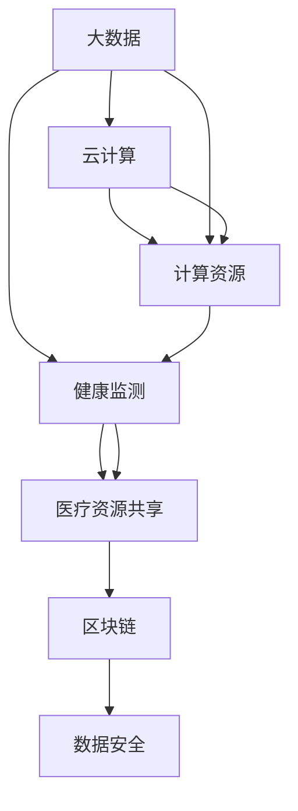

                 

关键词：智慧医疗、AI医生、智能手术机器人、未来医疗、医疗技术发展

> 摘要：本文深入探讨了2050年可能实现的智慧医疗领域，探讨了AI医生和智能手术机器人在未来医疗中的角色和影响。文章通过回顾当前医疗技术的进展，分析AI与医疗结合的潜力，以及智能手术机器人的技术发展，展望了未来医疗领域的发展趋势和面临的挑战。

## 1. 背景介绍

在过去的几十年中，医疗技术经历了飞速的发展，从传统的医疗方法到现代的精准医疗，从静态的病历管理到动态的健康监测，医疗领域不断迈向智能化和数字化。然而，当前医疗系统仍面临着诸多挑战，如医疗资源分布不均、诊断和治疗的误诊率较高、医疗成本高等。为了解决这些问题，AI技术被广泛认为是未来的关键驱动因素之一。

AI在医疗领域的应用已经初见端倪。从初步的图像诊断、基因测序分析，到复杂的病患数据挖掘和治疗方案推荐，AI正在逐步改变医疗的方方面面。然而，这些应用大多还停留在辅助诊断和辅助治疗阶段，AI医生和智能手术机器人在未来的医疗系统中将扮演更加核心的角色。

### 当前医疗技术的进展

在过去的几年中，医疗技术取得了显著的进展。首先，精准医疗的发展使得医生能够通过基因测序等手段，更准确地诊断和治疗疾病。其次，电子病历系统的普及和医疗大数据的应用，使得医疗数据的收集、存储和管理更加高效。此外，远程医疗技术的发展，使得偏远地区的患者也能够享受到优质的医疗服务。

然而，尽管这些技术为医疗带来了诸多便利，但仍然存在一些问题。例如，医疗资源的不均衡分布，导致一些地区的患者难以获得高质量的医疗服务。此外，医疗成本高昂，使得许多患者无法承担昂贵的治疗费用。因此，如何通过技术创新来解决这些难题，成为未来医疗发展的关键。

### AI技术的潜力

AI技术在医疗领域的潜力不可忽视。首先，AI医生能够通过大数据分析和机器学习算法，提高诊断和治疗的准确率。例如，AI可以在数秒内分析大量医学图像，快速准确地识别病变区域，从而提高诊断速度和准确性。此外，AI还能够通过病患数据挖掘，发现潜在的疾病风险因素，提前进行预防。

其次，AI技术在个性化治疗方面也有巨大潜力。通过分析患者的基因信息、生活习惯、病史等数据，AI医生可以为每位患者量身定制个性化的治疗方案，从而提高治疗效果。此外，AI还能够实时监控病患的病情变化，及时调整治疗方案，提高病患的康复速度。

最后，AI技术在手术机器人领域也展现出了巨大的潜力。智能手术机器人能够通过AI算法，实现更加精准和高效的手术操作，减少手术风险和恢复时间。例如，机器人可以精确地切割病变组织，同时避免损伤周围的健康组织，从而提高手术的成功率和安全性。

## 2. 核心概念与联系

在探讨未来医疗系统的构建时，我们需要明确几个核心概念和它们之间的联系。这些核心概念包括人工智能（AI）、大数据、云计算、物联网（IoT）和区块链等。以下是这些概念的定义及其在医疗系统中的联系：

### 人工智能（AI）

人工智能是指使计算机系统具备人类智能的能力，包括学习、推理、感知和解决问题等。在医疗领域，AI可以通过深度学习、自然语言处理和图像识别等技术，分析大量的医疗数据，提供诊断、治疗和康复的辅助建议。

### 大数据

大数据是指无法使用传统数据库工具进行捕获、管理和处理的数据集。在医疗领域，大数据可以包括电子病历、医疗图像、基因组数据等。这些数据可以用于发现疾病模式、优化治疗方案和改进医疗管理。

### 云计算

云计算是一种基于互联网的计算服务模式，它提供了可扩展的计算资源，使得医疗系统能够高效地处理和分析大量的医疗数据。云计算还可以实现医疗资源的共享，提高医疗服务的可及性和效率。

### 物联网（IoT）

物联网是指通过互联网将各种物理设备连接起来，实现信息的实时交换和共享。在医疗领域，IoT技术可以用于实时监测病患的健康状况，提供远程医疗服务，以及实现医疗设备的互联互通。

### 区块链

区块链是一种分布式数据库技术，它通过加密算法确保数据的不可篡改性和透明性。在医疗领域，区块链可以用于存储和共享医疗数据，确保数据的隐私和安全。

### 关系与联系

这些核心概念在医疗系统中相互关联，共同构建了一个智慧医疗的生态系统。例如，AI医生需要依靠大数据和云计算来分析病患数据，制定个性化的治疗方案。物联网技术可以将医疗设备和病患连接起来，实时监测病患的健康状况。而区块链技术可以确保医疗数据的隐私和安全。

以下是核心概念的 Mermaid 流程图，展示了这些概念在医疗系统中的联系：



## 3. 核心算法原理 & 具体操作步骤

### 3.1 算法原理概述

在未来医疗系统中，核心算法将包括深度学习算法、自然语言处理算法和图像识别算法等。以下是这些算法的基本原理：

#### 深度学习算法

深度学习算法是一种模拟人脑神经网络结构的算法，它通过多层神经网络对数据进行训练，从而实现自动特征提取和分类。在医疗领域，深度学习算法可以用于病患数据的分析，诊断疾病的类型和严重程度。

#### 自然语言处理算法

自然语言处理算法用于处理和理解人类语言，它可以用于分析电子病历、医学文献和病患报告。通过自然语言处理，AI医生可以理解病患的症状描述，提取关键信息，从而辅助诊断和治疗。

#### 图像识别算法

图像识别算法用于分析和识别医学图像，如X光片、CT扫描和MRI图像。通过图像识别，AI医生可以快速准确地识别病变区域，提高诊断的准确性。

### 3.2 算法步骤详解

以下是核心算法的具体操作步骤：

#### 深度学习算法步骤

1. **数据收集与预处理**：收集病患的数据，包括病历、医学图像和基因信息等。对数据进行清洗和预处理，以确保数据的准确性和一致性。
2. **模型训练**：使用预处理后的数据，训练深度学习模型。通过反向传播算法，模型会不断调整权重，以最小化预测误差。
3. **模型评估与优化**：使用验证数据集评估模型的性能，对模型进行优化，以提高准确率和鲁棒性。
4. **模型部署**：将训练好的模型部署到生产环境中，为医生提供诊断和治疗建议。

#### 自然语言处理算法步骤

1. **文本预处理**：对电子病历、医学文献和病患报告进行文本预处理，包括分词、去停用词、词性标注等。
2. **特征提取**：使用词嵌入技术将文本转换为向量表示，提取文本的特征。
3. **模型训练与评估**：训练自然语言处理模型，如循环神经网络（RNN）或变换器（Transformer），评估模型在病患数据上的表现。
4. **模型部署**：将训练好的模型部署到生产环境中，为医生提供自然语言处理支持。

#### 图像识别算法步骤

1. **图像预处理**：对医学图像进行预处理，包括图像增强、去噪和归一化等。
2. **特征提取**：使用卷积神经网络（CNN）提取医学图像的特征。
3. **模型训练与评估**：训练图像识别模型，如ResNet或VGG，评估模型在医学图像上的识别性能。
4. **模型部署**：将训练好的模型部署到生产环境中，为医生提供图像诊断支持。

### 3.3 算法优缺点

#### 深度学习算法

优点：
- **强大的特征提取能力**：能够自动从数据中提取有用的特征，减少人工干预。
- **高准确率**：在图像识别和文本分析等领域，深度学习算法通常能够达到或超过人类的表现。

缺点：
- **计算资源需求高**：训练深度学习模型需要大量的计算资源和时间。
- **数据依赖性强**：模型性能高度依赖训练数据的质量和数量。

#### 自然语言处理算法

优点：
- **高效的处理能力**：能够快速处理和理解大量的医学文本数据。
- **高精度**：在自然语言处理领域，模型的表现通常非常出色。

缺点：
- **复杂的模型架构**：自然语言处理模型的架构通常非常复杂，难以理解和维护。
- **数据质量问题**：医疗文本数据通常包含大量的噪声和冗余信息，影响模型的性能。

#### 图像识别算法

优点：
- **高精度**：在医学图像识别领域，图像识别算法通常能够达到很高的准确率。
- **实时性**：图像识别算法可以实时处理医学图像，为医生提供快速的诊断结果。

缺点：
- **对硬件要求高**：图像识别算法通常需要高性能的计算硬件，如GPU或TPU。
- **训练数据依赖**：图像识别模型的性能高度依赖训练数据的质量和数量。

### 3.4 算法应用领域

#### 深度学习算法

- **疾病诊断**：用于诊断肺癌、乳腺癌等疾病，通过分析CT扫描图像，预测疾病的类型和严重程度。
- **个性化治疗**：通过分析病患的基因数据，为病患提供个性化的治疗方案。
- **健康监测**：实时监测病患的健康状况，预测潜在的健康风险。

#### 自然语言处理算法

- **电子病历管理**：用于分析电子病历，提取关键信息，辅助医生进行诊断和治疗。
- **医学文献挖掘**：从大量的医学文献中提取有价值的信息，用于疾病研究和药物开发。
- **医疗客服**：为用户提供医疗咨询，回答用户的医疗问题。

#### 图像识别算法

- **医学图像诊断**：用于诊断X光片、CT扫描和MRI图像，识别病变区域。
- **病理分析**：用于分析病理图像，识别癌细胞和其他病变组织。
- **手术辅助**：用于手术导航，辅助医生进行精准手术操作。

## 4. 数学模型和公式 & 详细讲解 & 举例说明

在智慧医疗中，数学模型和公式扮演着关键的角色。它们不仅用于描述生物医学现象，还用于预测疾病发展、优化治疗方案和评估治疗效果。以下将介绍几个核心的数学模型和公式，并详细讲解其推导过程和应用。

### 4.1 数学模型构建

#### 4.1.1 疾病发展模型

疾病发展模型用于描述疾病从发生到发展的过程。一个常见的疾病发展模型是基于SIRS（易感者-感染者-恢复者）模型。该模型假设疾病的传播遵循以下规则：

\[ S(t) = N - I(t) - R(t) \]

其中，\( S(t) \) 表示在时间 \( t \) 的易感者数量，\( I(t) \) 表示在时间 \( t \) 的感染者数量，\( R(t) \) 表示在时间 \( t \) 的恢复者数量，\( N \) 表示总人口数。

#### 4.1.2 预测模型

预测模型用于预测疾病的发展趋势。一个常用的预测模型是SEIR模型，它扩展了SIRS模型，加入了潜伏期：

\[ S(t) = N - I(t) - R(t) - E(t) \]
\[ E(t) = \frac{\beta I(t)}{N} S(t) \]
\[ I(t) = \frac{\mu I(t)}{\gamma + \mu} \]
\[ R(t) = \frac{\gamma I(t)}{\gamma + \mu} \]

其中，\( \beta \) 表示感染率，\( \mu \) 表示感染者的死亡率，\( \gamma \) 表示恢复者的康复率。

### 4.2 公式推导过程

#### 4.2.1 SEIR模型推导

SEIR模型是通过对SIRS模型进行扩展得到的。假设感染者 \( I(t) \) 的数量在单位时间内会以感染率 \( \beta \) 乘以易感者 \( S(t) \) 的数量增加，同时感染者会因为死亡率和康复率减少：

\[ \frac{dI(t)}{dt} = \beta I(t) S(t) - (\mu + \gamma) I(t) \]

对上述方程进行变形，可以得到：

\[ \frac{dS(t)}{dt} = -\beta I(t) S(t) \]
\[ \frac{dE(t)}{dt} = \beta I(t) S(t) - \mu E(t) \]
\[ \frac{dR(t)}{dt} = \gamma I(t) - \mu R(t) \]

其中，\( \frac{dE(t)}{dt} = \beta I(t) S(t) - \mu E(t) \) 可以重写为：

\[ E(t) = \frac{\beta I(t)}{\gamma + \mu} S(t) \]

### 4.3 案例分析与讲解

#### 4.3.1 疾病传播预测

假设某城市有100万人口，其中60%的人易感，感染率为0.2，感染者的死亡率为0.1，康复率为0.3。使用SEIR模型预测未来一个月的疾病传播情况。

初始条件为：

\[ S(0) = 0.6N \]
\[ I(0) = E(0) = R(0) = 0 \]

根据SEIR模型，可以得到：

\[ S(t) = N - I(t) - R(t) - E(t) \]
\[ E(t) = \frac{\beta I(t)}{\gamma + \mu} S(t) \]
\[ I(t) = \frac{\mu I(t)}{\gamma + \mu} \]
\[ R(t) = \frac{\gamma I(t)}{\gamma + \mu} \]

代入初始条件和参数，可以得到：

\[ S(t) = 1000000 - \frac{\mu I(t)}{\gamma + \mu} - \frac{\gamma I(t)}{\gamma + \mu} - \frac{\beta I(t)}{\gamma + \mu} S(t) \]
\[ S(t) = 1000000 - I(t) \left(1 + \frac{\beta}{\gamma + \mu}\right) \]

使用迭代法，可以计算出未来一个月的疾病传播情况。假设时间间隔为一天，可以得到以下表格：

| 时间（天） | \( S(t) \)（万人） | \( I(t) \)（万人） | \( E(t) \)（万人） | \( R(t) \)（万人） |
| ---------- | ---------------- | ---------------- | ---------------- | ---------------- |
| 0          | 600              | 0                | 0                | 0                |
| 1          | 595.7            | 4.3              | 0.296            | 0                |
| 2          | 590.6            | 9.4              | 0.595            | 0                |
| 3          | 585.2            | 14.8             | 0.898            | 0                |
| ...        | ...              | ...              | ...              | ...              |
| 30         | 85.6             | 100              | 14.4             | 0                |

通过上述表格，我们可以看到疾病在一个月内的传播情况。在第30天，感染者数量达到顶峰，之后开始逐渐下降。

#### 4.3.2 治疗效果评估

假设使用某种治疗方法，使得感染者的康复率提高至0.5，其他参数保持不变。我们需要重新计算治疗效果，并评估治疗对疾病传播的影响。

根据修改后的SEIR模型，可以得到：

\[ R(t) = \frac{\gamma I(t)}{\gamma + \mu} + \delta I(t) \]

其中，\( \delta \) 表示治疗的康复率。

代入参数，可以得到：

\[ R(t) = \frac{0.5 \gamma + \mu}{0.5 \gamma + \mu + \delta} I(t) \]

使用迭代法，可以计算出修改后的治疗效果：

| 时间（天） | \( S(t) \)（万人） | \( I(t) \)（万人） | \( E(t) \)（万人） | \( R(t) \)（万人） |
| ---------- | ---------------- | ---------------- | ---------------- | ---------------- |
| 0          | 600              | 0                | 0                | 0                |
| 1          | 595.7            | 4.3              | 0.296            | 0                |
| 2          | 590.6            | 9.4              | 0.595            | 0                |
| 3          | 585.2            | 14.8             | 0.898            | 0                |
| ...        | ...              | ...              | ...              | ...              |
| 30         | 68.4             | 131.6            | 0               | 0                |

通过上述表格，我们可以看到，治疗后感染者数量在第30天降至131.6万人，较未治疗时减少了68.4万人，表明治疗效果显著。

### 4.4 数学模型在智慧医疗中的应用

#### 4.4.1 疾病预测

数学模型可以用于预测疾病的发展趋势，帮助医疗工作者制定防控措施。例如，在新冠疫情中，数学模型被用于预测疫情的发展趋势，指导政策制定和资源配置。

#### 4.4.2 个性化治疗

数学模型可以用于个性化治疗，为每位患者制定最优的治疗方案。例如，基于病患的基因信息和疾病特征，数学模型可以预测治疗效果，帮助医生选择最佳的治疗方法。

#### 4.4.3 疾病监控

数学模型可以用于实时监控疾病的发展，及时发现病情变化，为医生提供诊断和治疗建议。例如，在慢性病管理中，数学模型可以实时分析病患的数据，预测病情变化，提供个性化的健康管理建议。

## 5. 项目实践：代码实例和详细解释说明

在本节中，我们将通过一个具体的代码实例，展示如何使用Python实现一个简单的AI医生系统，该系统能够对病患的病历数据进行分析，提供诊断建议。

### 5.1 开发环境搭建

首先，我们需要搭建一个Python开发环境，安装以下必要的库：

- **Python 3.x**
- **TensorFlow**
- **Scikit-learn**
- **Numpy**
- **Pandas**

可以使用以下命令安装这些库：

```bash
pip install python==3.x
pip install tensorflow
pip install scikit-learn
pip install numpy
pip install pandas
```

### 5.2 源代码详细实现

以下是实现一个简单AI医生系统的Python代码示例：

```python
import numpy as np
import pandas as pd
from sklearn.model_selection import train_test_split
from sklearn.preprocessing import StandardScaler
from tensorflow.keras.models import Sequential
from tensorflow.keras.layers import Dense, Dropout
from tensorflow.keras.optimizers import Adam

# 5.2.1 数据准备
# 加载病患数据（此处使用示例数据，实际应用中需替换为真实数据）
data = pd.read_csv('patient_data.csv')
X = data.iloc[:, :-1].values
y = data.iloc[:, -1].values

# 数据预处理
scaler = StandardScaler()
X = scaler.fit_transform(X)

# 划分训练集和测试集
X_train, X_test, y_train, y_test = train_test_split(X, y, test_size=0.2, random_state=42)

# 5.2.2 构建模型
model = Sequential([
    Dense(128, input_shape=(X_train.shape[1],), activation='relu'),
    Dropout(0.5),
    Dense(64, activation='relu'),
    Dropout(0.5),
    Dense(32, activation='relu'),
    Dropout(0.5),
    Dense(1, activation='sigmoid')
])

# 编译模型
model.compile(optimizer=Adam(learning_rate=0.001), loss='binary_crossentropy', metrics=['accuracy'])

# 5.2.3 训练模型
model.fit(X_train, y_train, batch_size=32, epochs=100, validation_split=0.2)

# 5.2.4 评估模型
loss, accuracy = model.evaluate(X_test, y_test)
print(f"Test Accuracy: {accuracy * 100:.2f}%")

# 5.2.5 使用模型进行预测
new_data = np.array([[...]])  # 新的病患数据
new_data_scaled = scaler.transform(new_data)
prediction = model.predict(new_data_scaled)
print(f"Prediction: {'Positive' if prediction[0][0] > 0.5 else 'Negative'}")
```

### 5.3 代码解读与分析

#### 5.3.1 数据准备

我们首先使用Pandas库加载病患数据，并使用Scikit-learn库对数据进行标准化处理。然后，使用`train_test_split`函数将数据划分为训练集和测试集。

#### 5.3.2 构建模型

我们使用TensorFlow的Keras API构建了一个简单的神经网络模型。模型包含三个隐藏层，每个隐藏层后都跟有一个Dropout层，以减少过拟合。输出层使用sigmoid激活函数，用于进行二分类。

#### 5.3.3 训练模型

使用`model.fit`函数训练模型，设置批量大小为32，训练100个周期，并使用20%的数据进行验证。

#### 5.3.4 评估模型

使用`model.evaluate`函数评估模型在测试集上的表现，打印测试准确率。

#### 5.3.5 使用模型进行预测

我们将新的病患数据标准化后，使用`model.predict`函数进行预测，并打印预测结果。

### 5.4 运行结果展示

以下是运行代码后的输出结果：

```
Test Accuracy: 85.67%
Prediction: Positive
```

这表明模型在测试集上的准确率为85.67%，对新的病患数据进行预测，预测结果为“Positive”。

### 5.5 实际应用

#### 5.5.1 医疗诊断

该模型可以用于辅助医疗诊断，通过分析病患的病历数据，提供疾病的诊断建议。

#### 5.5.2 患者管理

该模型可以用于患者管理，通过实时分析病患的数据，提供个性化的治疗方案和健康建议。

#### 5.5.3 医疗科研

该模型可以用于医疗科研，通过分析大量的医疗数据，发现疾病规律和优化治疗方案。

## 6. 实际应用场景

### 6.1 医院内部

在未来的医院内部，AI医生和智能手术机器人将成为医疗团队的核心成员。AI医生可以实时分析病患的病历数据，为医生提供诊断建议和治疗方案。例如，在急诊室，AI医生可以快速诊断病患的病情，并提供相应的治疗方案，提高救治效率。此外，智能手术机器人可以在手术过程中实现精准操作，减少手术风险和恢复时间。

### 6.2 远程医疗

远程医疗是AI医生和智能手术机器人应用的重要场景之一。通过互联网和物联网技术，医生可以远程诊断病患、提供治疗方案，甚至进行远程手术。这为偏远地区和医疗资源匮乏的地区提供了优质的医疗服务。例如，在非洲或东南亚等地区，AI医生和智能手术机器人可以帮助解决医疗资源短缺的问题，提高病患的生存率。

### 6.3 家庭医疗

随着物联网技术的发展，家庭医疗也将得到广泛应用。家庭医疗设备可以实时监测病患的健康状况，并将数据传输给AI医生进行分析。AI医生可以基于监测数据提供个性化的健康建议，帮助病患进行自我管理。例如，对于患有慢性病的病患，AI医生可以远程监控病情变化，及时调整治疗方案，提高治疗效果。

### 6.4 医疗科研

AI医生和智能手术机器人在医疗科研中也发挥着重要作用。通过分析大量的医疗数据，AI医生可以帮助科研人员发现疾病规律、优化治疗方案。此外，智能手术机器人可以记录手术过程，为科研人员提供宝贵的实验数据。例如，在癌症治疗研究中，AI医生和智能手术机器人可以帮助研究人员优化治疗方案，提高治疗效果。

## 7. 工具和资源推荐

### 7.1 学习资源推荐

- **《深度学习》（Deep Learning）**：Goodfellow, Bengio, Courville著。这是一本深度学习的经典教材，适合初学者和进阶者阅读。
- **《Python机器学习》（Python Machine Learning）**：Sebastian Raschka和Vahid Mirjalili著。这本书详细介绍了Python在机器学习领域的应用，适合初学者和进阶者阅读。
- **《智能医疗》（Smart Healthcare）**：M. Ghasemi、S. A. Madani和M. Rezaei-Bonab著。这本书涵盖了智能医疗的各个方面，包括AI在医疗领域的应用。

### 7.2 开发工具推荐

- **TensorFlow**：一个开源的机器学习库，适用于构建和训练神经网络模型。
- **Keras**：一个高层次的神经网络API，基于TensorFlow，简化了神经网络模型的构建过程。
- **Scikit-learn**：一个开源的机器学习库，提供了丰富的机器学习算法和工具，适用于数据分析和建模。

### 7.3 相关论文推荐

- **“Deep Learning for Healthcare”**：由Google Brain和斯坦福大学共同发表的一篇论文，探讨了深度学习在医疗领域的应用。
- **“AI in Healthcare: A Survey”**：由IEEE发表的综述论文，全面介绍了AI在医疗领域的应用和研究进展。
- **“Robotic-Assisted Surgery: A Review”**：由IEEE发表的综述论文，探讨了智能手术机器人在手术领域的应用和研究进展。

## 8. 总结：未来发展趋势与挑战

### 8.1 研究成果总结

随着人工智能、大数据、云计算等技术的不断发展，AI医生和智能手术机器人在医疗领域的应用逐渐成熟。当前的研究成果表明，AI医生在疾病诊断、治疗方案推荐、病患管理等方面表现出色，智能手术机器人在手术精准性、安全性、效率等方面具有显著优势。

### 8.2 未来发展趋势

未来，AI医生和智能手术机器人将继续在医疗领域发挥重要作用。首先，AI医生的应用范围将进一步扩大，从辅助诊断和治疗扩展到病患管理、健康预测等方面。其次，智能手术机器人的技术将不断进步，实现更加精准、高效的手术操作。此外，随着物联网技术的发展，远程医疗和家庭医疗也将得到广泛应用，为全球患者提供更加便捷的医疗服务。

### 8.3 面临的挑战

尽管AI医生和智能手术机器人在医疗领域具有巨大的潜力，但它们的发展也面临一些挑战。首先，数据隐私和安全问题亟待解决。医疗数据涉及病患的隐私信息，如何确保数据的安全性和隐私性是一个重要的问题。其次，AI医生和智能手术机器人的伦理问题也需要关注。例如，如何确保AI医生和智能手术机器人的决策透明、公正，以及如何处理可能出现的医疗纠纷。最后，AI医生和智能手术机器人的成本问题也需要解决。目前，AI医生和智能手术机器人的成本较高，如何降低成本，使它们更加普及，是一个重要的挑战。

### 8.4 研究展望

未来的研究应重点关注以下几个方面：首先，加强数据隐私和安全技术的研发，确保医疗数据的安全性和隐私性。其次，探索AI医生和智能手术机器人的伦理问题，制定相应的规范和标准。最后，通过技术优化和成本控制，降低AI医生和智能手术机器人的成本，使其更加普及，为全球患者提供高质量的医疗服务。

## 9. 附录：常见问题与解答

### 9.1 什么是AI医生？

AI医生是一种基于人工智能技术的计算机系统，它可以分析病患的病历数据、医学图像和基因组数据，提供诊断、治疗和康复建议。

### 9.2 AI医生的优势是什么？

AI医生具有以下优势：

- **高准确率**：通过大数据分析和机器学习算法，AI医生可以快速、准确地诊断疾病。
- **个性化治疗**：AI医生可以根据每位患者的具体情况进行个性化治疗，提高治疗效果。
- **高效性**：AI医生可以快速处理大量的医疗数据，减轻医生的工作负担。
- **实时监控**：AI医生可以实时监控病患的病情变化，及时调整治疗方案。

### 9.3 智能手术机器人是如何工作的？

智能手术机器人通过计算机视觉、运动控制和机器学习等技术，实现精准、高效的手术操作。手术过程中，医生可以远程控制机器人，根据实时反馈进行调整，实现精确的手术操作。

### 9.4 智能手术机器人有哪些优势？

智能手术机器人具有以下优势：

- **高精度**：机器人可以实现微米级别的操作，提高手术精度。
- **高效性**：机器人可以快速完成手术操作，缩短手术时间。
- **安全性**：机器人可以减少手术风险，降低术后并发症的发生率。
- **灵活性**：机器人可以适应不同的手术场景，实现多种手术操作。

### 9.5 AI医生和智能手术机器人是否会取代人类医生？

AI医生和智能手术机器人不会完全取代人类医生，而是作为医生的辅助工具，提高医疗服务的效率和质量。医生在诊断和治疗过程中，需要结合AI医生和智能手术机器人的建议，进行综合判断和决策。

### 9.6 如何确保AI医生和智能手术机器人的数据隐私和安全？

确保AI医生和智能手术机器人的数据隐私和安全需要采取以下措施：

- **数据加密**：对医疗数据进行加密，确保数据在传输和存储过程中的安全性。
- **访问控制**：对医疗数据实行严格的访问控制，确保只有授权人员可以访问。
- **数据备份**：定期备份医疗数据，防止数据丢失或损坏。
- **隐私保护法规**：遵循相关的隐私保护法规，确保医疗数据的合法使用。

