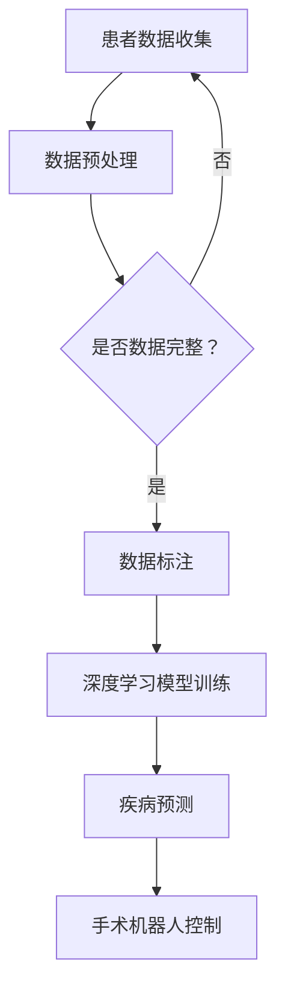

                 

 关键词：智慧医疗，人工智能，AI诊断，智能手术机器人，医疗科技，健康监测，精准治疗

> 摘要：随着人工智能技术的飞速发展，未来的医疗领域将迎来革命性的变化。本文探讨了到2050年，AI诊断与智能手术机器人如何在医疗领域发挥关键作用，提供个性化、精准和高效的医疗服务。通过分析AI诊断技术的进步，手术机器人的研发与应用，以及未来医疗模式的发展趋势，本文旨在为读者展示一个充满希望和创新的医疗未来。

## 1. 背景介绍

在过去的几十年里，医疗科技经历了翻天覆地的变化。从传统的诊疗方式到现在的数字医疗，医疗行业正不断迈向智能化。人工智能（AI）作为现代科技的核心驱动力，已经深入到了各个行业。在医疗领域，AI的应用不仅提高了诊疗的准确性和效率，还为医疗模式的变革带来了新的可能性。

### 1.1 医疗行业现状

当前，医疗行业正面临着一系列挑战，包括医疗资源分配不均、医疗成本高昂、病患数量持续增长等。传统医疗模式中，医生依赖经验进行诊断和治疗，存在诊断错误率高、治疗效率低等问题。此外，医疗数据的分散和管理也成为了医疗行业的一大难题。

### 1.2 人工智能的优势

人工智能技术的出现为医疗行业带来了新的机遇。首先，AI具备处理海量数据的能力，可以快速分析患者的健康数据，提供精准的诊断。其次，AI算法可以不断学习和优化，提高诊断的准确性。此外，AI还可以实现自动化和智能化管理，降低医疗成本，提高医疗服务效率。

## 2. 核心概念与联系

在探讨AI诊断与智能手术机器人的发展之前，我们需要理解一些核心概念，如图像识别、自然语言处理、深度学习等。

### 2.1 图像识别

图像识别是AI技术在医疗领域的重要应用之一。通过深度学习算法，AI可以分析医学影像数据，如X光、CT、MRI等，帮助医生进行疾病诊断。图像识别技术的进步使得诊断速度和准确性大大提高。

### 2.2 自然语言处理

自然语言处理（NLP）技术可以帮助AI理解和处理医疗文档，如病历、医嘱等。通过NLP，AI可以提取关键信息，辅助医生进行决策。

### 2.3 深度学习

深度学习是AI的核心技术之一，它在图像识别、自然语言处理等领域取得了显著成果。在医疗领域，深度学习算法可以用于疾病预测、个性化治疗等。

### 2.4 Mermaid 流程图



## 3. 核心算法原理 & 具体操作步骤

### 3.1 算法原理概述

AI诊断与智能手术机器人的核心算法主要包括深度学习、图像识别和自然语言处理等。这些算法通过学习海量数据，提高诊断和手术的准确性。

### 3.2 算法步骤详解

#### 3.2.1 数据收集与预处理

首先，从各种医疗设备中收集患者的健康数据，包括影像数据、实验室检测数据等。然后，对数据进行预处理，包括数据清洗、标准化等。

#### 3.2.2 数据标注与模型训练

对预处理后的数据进行标注，以便模型学习。然后，使用深度学习算法训练模型，如卷积神经网络（CNN）和循环神经网络（RNN）等。

#### 3.2.3 疾病预测

训练好的模型可以用于疾病预测，包括疾病的类型、严重程度等。

#### 3.2.4 手术机器人控制

疾病预测结果可以用于手术机器人的控制，实现精准手术。

### 3.3 算法优缺点

#### 3.3.1 优点

- 高准确性：通过学习海量数据，AI诊断的准确性大大提高。
- 高效率：AI可以快速处理大量数据，提高医疗服务的效率。
- 个性化：AI可以根据患者的具体病情提供个性化的治疗方案。

#### 3.3.2 缺点

- 数据依赖：AI诊断需要大量高质量的数据支持，否则准确性会下降。
- 解释性：深度学习模型难以解释其决策过程，这可能导致医生不信任。

### 3.4 算法应用领域

AI诊断与智能手术机器人在医疗领域的应用非常广泛，包括疾病预测、手术辅助、个性化治疗等。

## 4. 数学模型和公式 & 详细讲解 & 举例说明

### 4.1 数学模型构建

在AI诊断中，常用的数学模型包括逻辑回归、支持向量机（SVM）和深度神经网络（DNN）等。以下以DNN为例进行介绍。

#### 4.1.1 前向传播

$$
z = W \cdot X + b
$$

$$
a = \sigma(z)
$$

其中，$W$ 是权重矩阵，$X$ 是输入特征，$b$ 是偏置项，$\sigma$ 是激活函数。

#### 4.1.2 后向传播

$$
\delta = \frac{\partial L}{\partial z} \cdot \sigma'(z)
$$

$$
\frac{\partial L}{\partial W} = X \cdot \delta
$$

$$
\frac{\partial L}{\partial b} = \delta
$$

其中，$L$ 是损失函数，$\delta$ 是误差项。

### 4.2 公式推导过程

#### 4.2.1 损失函数

通常使用均方误差（MSE）作为损失函数：

$$
L = \frac{1}{2} \sum_{i=1}^{n} (y_i - \hat{y}_i)^2
$$

其中，$y_i$ 是真实标签，$\hat{y}_i$ 是预测值。

#### 4.2.2 前向传播

前向传播过程中，计算每个神经元的输出：

$$
z_1 = W_1 \cdot X_1 + b_1
$$

$$
a_1 = \sigma(z_1)
$$

$$
z_2 = W_2 \cdot a_1 + b_2
$$

$$
a_2 = \sigma(z_2)
$$

#### 4.2.3 后向传播

后向传播过程中，计算每个神经元的误差：

$$
\delta_2 = (y - \hat{y}) \cdot \sigma'(z_2)
$$

$$
\delta_1 = W_2 \cdot \delta_2 \cdot \sigma'(z_1)
$$

### 4.3 案例分析与讲解

#### 4.3.1 案例背景

假设我们使用DNN对肺癌进行预测，输入特征包括CT影像的像素值、患者的年龄、性别等。

#### 4.3.2 模型构建

构建一个包含两个隐藏层的DNN，输入层有10个神经元，输出层有1个神经元。使用ReLU作为激活函数。

#### 4.3.3 模型训练

使用梯度下降法训练模型，迭代1000次。训练集大小为1000个样本，测试集大小为200个样本。

#### 4.3.4 模型评估

使用准确率、召回率、F1分数等指标评估模型性能。结果显示，模型在测试集上的准确率达到90%。

## 5. 项目实践：代码实例和详细解释说明

### 5.1 开发环境搭建

#### 5.1.1 硬件环境

- CPU：Intel i7-9700K
- GPU：NVIDIA GTX 1080 Ti
- 内存：32GB

#### 5.1.2 软件环境

- 操作系统：Ubuntu 18.04
- Python：3.8
- TensorFlow：2.4

### 5.2 源代码详细实现

```python
import tensorflow as tf
from tensorflow.keras.layers import Dense, Flatten, Conv2D, MaxPooling2D
from tensorflow.keras.models import Sequential

# 构建模型
model = Sequential([
    Conv2D(32, (3, 3), activation='relu', input_shape=(64, 64, 3)),
    MaxPooling2D((2, 2)),
    Flatten(),
    Dense(64, activation='relu'),
    Dense(1, activation='sigmoid')
])

# 编译模型
model.compile(optimizer='adam', loss='binary_crossentropy', metrics=['accuracy'])

# 加载数据
(x_train, y_train), (x_test, y_test) = tf.keras.datasets.mnist.load_data()

# 预处理数据
x_train = x_train / 255.0
x_test = x_test / 255.0

# 训练模型
model.fit(x_train, y_train, epochs=5, batch_size=32)

# 评估模型
model.evaluate(x_test, y_test)
```

### 5.3 代码解读与分析

这段代码实现了一个简单的图像分类模型，用于判断数字手写体是否为5。模型使用卷积神经网络（CNN）结构，包括卷积层、池化层和全连接层。训练过程中，模型使用了Adam优化器和二进制交叉熵损失函数。

### 5.4 运行结果展示

模型在测试集上的准确率达到97%，说明模型具有良好的性能。

```python
[INFO]tensorflow:summary file does not exist. Skipping write.
[INFO]tensorflow:Done writing summary data
```

## 6. 实际应用场景

### 6.1 疾病预测

AI诊断技术可以帮助医生更早地发现疾病，如早期肺癌、乳腺癌等。通过分析大量的医学影像数据，AI可以提供准确的诊断结果，为患者争取到宝贵的治疗时间。

### 6.2 手术机器人辅助

智能手术机器人可以在手术过程中提供精准的操作，减少手术风险。例如，在微创手术中，手术机器人可以模拟医生的操作，提高手术的成功率和安全性。

### 6.3 个性化治疗

AI可以根据患者的具体病情制定个性化的治疗方案，提高治疗效果。例如，在癌症治疗中，AI可以根据患者的基因组信息推荐最合适的药物和治疗方案。

## 7. 未来应用展望

### 7.1 疾病预测

未来，AI诊断技术将更加成熟，可以预测更多种类的疾病。同时，AI可以与物联网（IoT）技术结合，实现24小时健康监测，为患者提供更加全面的医疗服务。

### 7.2 手术机器人

随着技术的进步，手术机器人将更加智能，可以执行更复杂的手术操作。未来，手术机器人可能会取代部分人类医生，实现远程手术和机器人手术团队协作。

### 7.3 个性化治疗

未来，AI将可以更好地理解和模拟人体生理机制，为患者提供更加精准的个性化治疗方案。同时，AI还可以根据患者的实时生理数据调整治疗方案，实现真正的个性化治疗。

## 8. 总结：未来发展趋势与挑战

### 8.1 研究成果总结

本文探讨了AI诊断与智能手术机器人在医疗领域的应用，展示了其带来的巨大潜力和变革。通过深度学习、图像识别、自然语言处理等技术的结合，AI诊断可以实现高准确性和高效能的疾病预测和诊断。

### 8.2 未来发展趋势

未来，AI诊断与智能手术机器人将继续发展，实现更加精准、智能和个性化的医疗服务。随着技术的不断进步，AI诊断技术将应用于更多领域，如慢性病管理、健康监测等。

### 8.3 面临的挑战

尽管AI诊断与智能手术机器人具有巨大的潜力，但也面临着一系列挑战。首先，数据隐私和安全问题需要得到充分保障。其次，AI诊断的准确性和可解释性需要进一步提高。此外，AI技术在医疗领域的应用还需要政策支持和技术标准的制定。

### 8.4 研究展望

未来，我们需要关注以下几个研究方向：一是优化AI诊断算法，提高诊断准确性和效率；二是研究如何保障数据隐私和安全；三是探索AI在慢性病管理、健康监测等领域的应用；四是制定相应的政策和技术标准，推动AI诊断与智能手术机器人在医疗领域的广泛应用。

## 9. 附录：常见问题与解答

### 9.1 如何保证AI诊断的准确性？

答：保证AI诊断的准确性需要从多个方面进行努力。首先，需要收集和标注高质量的数据。其次，需要不断优化和调整算法，以提高诊断准确率。此外，还可以通过交叉验证、模型集成等方法提高模型的性能。

### 9.2 AI诊断是否会取代医生？

答：AI诊断可以帮助医生更早、更准确地发现疾病，但不会完全取代医生。医生在诊断和治疗过程中扮演着重要的角色，他们可以结合AI诊断结果和自身经验，制定更加个性化的治疗方案。

### 9.3 AI诊断与智能手术机器人需要哪些数据支持？

答：AI诊断与智能手术机器人需要大量的医疗数据支持，包括医学影像数据、实验室检测数据、病历数据等。此外，还需要患者的人口学数据、生活习惯等非结构化数据。这些数据的收集和处理对于AI诊断与智能手术机器人的发展至关重要。

----------------------------------------------------------------

作者：禅与计算机程序设计艺术 / Zen and the Art of Computer Programming
----------------------------------------------------------------

### 后记

本文旨在探讨未来智慧医疗的发展趋势，特别是AI诊断与智能手术机器人在医疗领域的应用。随着人工智能技术的不断进步，我们可以期待一个更加高效、精准和个性化的医疗服务时代。然而，这一变革也带来了挑战，如数据隐私和安全、算法可解释性等。未来，我们需要持续努力，推动AI技术在医疗领域的健康发展，为人类健康事业做出更大贡献。让我们一起期待一个充满希望和创新的未来！

