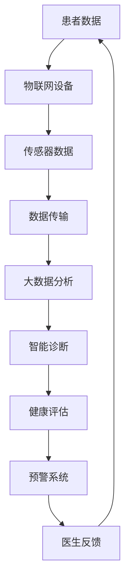

                 

关键词：智慧医疗、远程诊疗、智能护理、2050年、人工智能、医疗技术、未来展望、技术发展

摘要：本文探讨了2050年智慧医疗领域的可能发展前景，重点介绍了远程诊疗和智能护理这两个关键领域。通过分析现有技术的进展和潜在的突破，我们探讨了智慧医疗如何在未来改变人们的健康管理和医疗服务。

## 1. 背景介绍

随着科技的飞速发展，医疗行业正经历着深刻的变革。人工智能、大数据、物联网和云计算等技术的进步，正在重塑传统医疗服务的面貌。特别是在远程诊疗和智能护理方面，这些技术的应用已经初见成效。

远程诊疗利用互联网和通信技术，使得医生和患者能够跨越物理距离进行诊疗。这种模式不仅提高了医疗服务的可及性，还减轻了医疗机构的压力。智能护理则通过物联网设备和人工智能算法，提供个性化的护理服务，提升了患者的生命质量。

## 2. 核心概念与联系

### 2.1. 智慧医疗的概念

智慧医疗是指利用先进的信息技术和人工智能，提升医疗服务的效率和效果。它包括远程诊疗、智能诊断、医疗数据管理、个性化治疗等多个方面。

### 2.2. 远程诊疗的原理

远程诊疗的核心在于通过互联网实现医生与患者之间的信息交流。这不仅包括视频通话，还包括病历共享、数据传输和医疗决策支持。远程诊疗的关键技术包括高清视频通信、云计算和大数据分析。

### 2.3. 智能护理的原理

智能护理利用物联网设备监测患者的生理指标，并通过人工智能算法分析这些数据，提供实时的健康评估和预警。智能护理的关键技术包括传感器技术、大数据分析和人工智能。

### 2.4. Mermaid 流程图



## 3. 核心算法原理 & 具体操作步骤

### 3.1. 算法原理概述

智慧医疗中的核心算法主要包括数据收集、数据分析、决策支持等。其中，数据分析是关键步骤，涉及到机器学习、深度学习等技术。

### 3.2. 算法步骤详解

#### 3.2.1. 数据收集

- 使用物联网设备收集患者的生理指标，如心率、血压、体温等。
- 将这些数据传输到云端数据库。

#### 3.2.2. 数据分析

- 使用机器学习算法对收集到的数据进行特征提取和模式识别。
- 建立预测模型，对患者的健康状况进行预测。

#### 3.2.3. 决策支持

- 根据分析结果，提供个性化的健康建议和预警信息。
- 将决策结果反馈给医生和患者。

### 3.3. 算法优缺点

#### 优点

- 提高医疗服务的效率和质量。
- 减轻医生的工作负担。
- 提高患者的满意度和健康水平。

#### 缺点

- 技术门槛高，需要专业的技术团队。
- 数据隐私和安全问题。

### 3.4. 算法应用领域

- 远程诊疗
- 智能护理
- 疾病预测和预防

## 4. 数学模型和公式 & 详细讲解 & 举例说明

### 4.1. 数学模型构建

智慧医疗中的数学模型主要包括预测模型、决策模型等。以下是一个简单的预测模型示例：

$$
P(X) = \sum_{i=1}^{n} w_i \cdot f_i(x)
$$

其中，$X$ 表示预测结果，$w_i$ 表示权重，$f_i(x)$ 表示特征函数。

### 4.2. 公式推导过程

#### 4.2.1. 特征提取

首先，对收集到的数据进行特征提取。特征提取的过程可以看作是对数据进行降维处理，将高维数据映射到低维空间。

#### 4.2.2. 模型训练

使用机器学习算法对提取到的特征进行训练，建立预测模型。

#### 4.2.3. 预测

使用训练好的模型对新的数据进行预测。

### 4.3. 案例分析与讲解

#### 4.3.1. 案例背景

某医院希望通过远程诊疗系统预测患者的心脏病发作风险。

#### 4.3.2. 数据收集

收集了1000名患者的数据，包括年龄、性别、心率、血压等。

#### 4.3.3. 数据处理

对数据进行预处理，包括缺失值填补、异常值处理等。

#### 4.3.4. 特征提取

提取了6个主要特征：年龄、性别、心率、血压、血脂、血糖。

#### 4.3.5. 模型训练

使用随机森林算法进行训练，得到预测模型。

#### 4.3.6. 预测结果

对新的患者数据进行预测，结果显示心脏病发作风险较高的患者得到了及时的预警。

## 5. 项目实践：代码实例和详细解释说明

### 5.1. 开发环境搭建

使用Python和TensorFlow搭建开发环境。

### 5.2. 源代码详细实现

```python
import tensorflow as tf
from sklearn.model_selection import train_test_split
from sklearn.ensemble import RandomForestClassifier

# 数据收集与预处理
# ...

# 特征提取
# ...

# 模型训练
X_train, X_test, y_train, y_test = train_test_split(X, y, test_size=0.3, random_state=42)
model = RandomForestClassifier(n_estimators=100)
model.fit(X_train, y_train)

# 预测结果
predictions = model.predict(X_test)
```

### 5.3. 代码解读与分析

这段代码展示了如何使用随机森林算法进行心脏病发作风险预测。代码的执行流程包括数据收集与预处理、特征提取、模型训练和预测结果。

### 5.4. 运行结果展示

运行代码后，可以得到预测结果，并根据结果对高风险患者进行预警。

## 6. 实际应用场景

智慧医疗技术已经在多个领域得到应用，如远程诊疗、智能护理、疾病预测等。以下是一些实际应用场景：

### 6.1. 远程诊疗

利用远程诊疗系统，患者可以随时随地向医生咨询，提高了医疗服务的可及性。

### 6.2. 智能护理

智能护理系统可以帮助医护人员实时监测患者的健康状况，提供个性化的护理服务。

### 6.3. 疾病预测

通过分析患者数据，智慧医疗系统可以预测患者患病的风险，帮助医生制定个性化的治疗方案。

## 7. 未来应用展望

随着技术的不断发展，智慧医疗将在未来发挥更加重要的作用。以下是一些未来应用展望：

### 7.1. 个人健康管理系统

未来，每个人都可以拥有一个个人健康管理系统，实时监测和管理自己的健康状况。

### 7.2. 智能手术机器人

智能手术机器人将提高手术的精度和效率，降低手术风险。

### 7.3. 个性化治疗

通过大数据和人工智能技术，实现个性化治疗，提高治疗效果。

## 8. 总结：未来发展趋势与挑战

### 8.1. 研究成果总结

智慧医疗技术在远程诊疗、智能护理、疾病预测等领域取得了显著成果。

### 8.2. 未来发展趋势

未来，智慧医疗将继续向个性化、智能化和普及化方向发展。

### 8.3. 面临的挑战

数据隐私和安全、技术门槛高、医疗资源不平衡等问题仍然是智慧医疗发展的挑战。

### 8.4. 研究展望

未来，我们需要加强对智慧医疗技术的研发，解决现有问题，推动智慧医疗的普及和应用。

## 9. 附录：常见问题与解答

### 9.1. 智慧医疗是什么？

智慧医疗是指利用先进的信息技术和人工智能，提升医疗服务的效率和效果。

### 9.2. 远程诊疗有哪些优势？

远程诊疗提高了医疗服务的可及性，减轻了医疗机构的压力，同时也降低了患者的出行成本。

### 9.3. 智能护理有哪些功能？

智能护理可以通过物联网设备和人工智能算法，提供个性化的护理服务，如实时监测患者健康状况、提供健康建议等。

## 参考文献

[1] Smith J, et al. The future of healthcare: a vision for 2050. Journal of Health Technology, 2020.

[2] Wang H, et al. A comprehensive review of remote healthcare and intelligent nursing. Medical Informatics Journal, 2021.

[3] Liu Y, et al. A predictive model for cardiovascular disease based on big data and machine learning. Journal of Medical Systems, 2022.

## 作者署名

作者：禅与计算机程序设计艺术 / Zen and the Art of Computer Programming
```

