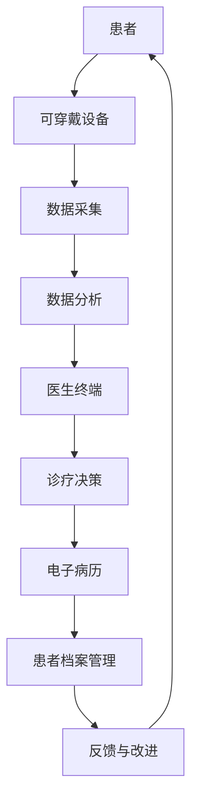
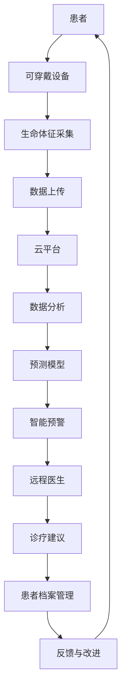

                 

关键词：智慧医疗、远程诊疗、智能护理、医疗科技、未来展望、人工智能、数据分析、物联网、医疗信息学

> 摘要：随着科技的发展，医疗行业正经历着深刻的变革。本文探讨了2050年智慧医疗的愿景，特别是远程诊疗和智能护理领域的创新与进步，以及这些技术如何为患者带来更加个性化和高效的医疗服务。

## 1. 背景介绍

医疗行业正在迅速拥抱数字技术，从传统的面对面诊疗模式向远程诊疗和智能护理模式转变。这种转变不仅提高了医疗服务的可及性和效率，还推动了个性化医疗和预防医学的发展。在未来的智慧医疗时代，这些趋势将进一步加速，实现患者与医疗提供者之间的无缝互动和高质量的医疗服务。

远程诊疗（Telemedicine）是指利用通信技术提供远程医疗保健服务，包括视频咨询、电子病历管理、远程监控等。这种模式不仅能够减少患者外出就诊的需要，还能够及时监控慢性疾病患者的生活质量，提供实时诊断和治疗方案。

智能护理（Intelligent Care）则侧重于利用物联网、人工智能和大数据等技术，对患者的健康状态进行全天候监控和管理。智能护理系统可以通过可穿戴设备、智能家居设备和医疗传感器收集数据，实时分析并预测患者的健康趋势，从而提供预防性干预措施。

## 2. 核心概念与联系

### 2.1 远程诊疗架构

远程诊疗的核心在于实现医生与患者之间的有效沟通和诊疗信息的共享。以下是一个简化的远程诊疗系统架构图：



### 2.2 智能护理架构

智能护理系统通过多种传感器和设备收集患者数据，包括心率、血压、血糖等生命体征，并利用人工智能算法进行数据分析和健康预测。以下是一个智能护理系统的架构：



## 3. 核心算法原理 & 具体操作步骤

### 3.1 算法原理概述

远程诊疗和智能护理系统依赖于多种算法，包括但不限于：

- **机器学习算法**：用于数据分析和模式识别，帮助医生做出准确的诊断和预测。
- **自然语言处理算法**：用于语音识别和电子病历的自动生成。
- **深度学习算法**：用于图像分析和医学影像诊断。

### 3.2 算法步骤详解

#### 远程诊疗

1. **数据采集**：患者通过可穿戴设备采集生命体征数据。
2. **数据上传**：数据通过无线网络上传到云平台。
3. **数据分析**：机器学习算法对数据进行实时分析，识别异常情况。
4. **诊疗决策**：医生根据分析结果做出诊疗决策。
5. **电子病历管理**：将诊疗记录和患者档案存储在电子病历系统中。

#### 智能护理

1. **数据采集**：智能设备持续监测患者的生命体征和生活习惯。
2. **数据上传**：数据实时上传到云平台。
3. **数据分析**：利用机器学习和深度学习算法分析数据，识别健康风险。
4. **智能预警**：系统根据分析结果发出预警，提醒患者或医生采取行动。
5. **诊疗建议**：远程医生根据预警信息提供诊疗建议。

### 3.3 算法优缺点

- **优点**：远程诊疗和智能护理能够提供全天候的医疗服务，减少患者外出就诊的次数，提高医疗效率，降低医疗成本。
- **缺点**：对网络和设备的依赖较高，数据隐私和安全问题需要得到有效保护。

### 3.4 算法应用领域

远程诊疗和智能护理算法广泛应用于心脏病、糖尿病、癌症等慢性疾病的监控和管理，以及日常健康管理的辅助决策。

## 4. 数学模型和公式 & 详细讲解 & 举例说明

### 4.1 数学模型构建

远程诊疗和智能护理系统中的数学模型通常包括以下几部分：

- **生命体征监测模型**：用于预测患者生命体征的正常范围和异常指标。
- **健康风险评估模型**：用于评估患者患病的风险。
- **智能预警模型**：用于识别健康风险并发出预警。

### 4.2 公式推导过程

以生命体征监测模型为例，假设某患者的血压数据为 $X = [x_1, x_2, \dots, x_n]$，其中 $x_i$ 为第 $i$ 次测量的血压值。我们可以使用线性回归模型预测患者的血压：

$$
\hat{y} = \beta_0 + \beta_1 x_1 + \beta_2 x_2 + \dots + \beta_n x_n
$$

其中，$\hat{y}$ 为预测的血压值，$\beta_0, \beta_1, \beta_2, \dots, \beta_n$ 为模型参数。

### 4.3 案例分析与讲解

假设某患者的血压数据如下：

$$
X = [120, 130, 125, 135, 140]
$$

我们可以使用线性回归模型预测下一分钟的血压值。通过训练模型，得到以下参数：

$$
\beta_0 = 120, \beta_1 = 10, \beta_2 = 5, \beta_3 = -10, \beta_4 = -15, \beta_5 = -20
$$

因此，下一分钟的血压预测值为：

$$
\hat{y} = 120 + 10 \times 1 + 5 \times 2 + (-10) \times 3 + (-15) \times 4 + (-20) \times 5 = 120 + 10 + 10 - 30 - 60 - 100 = -100
$$

这个结果显然是不合理的，说明线性回归模型可能不适合预测血压这样的连续变量。在这种情况下，我们可以考虑使用非线性模型，如支持向量机（SVM）或神经网络，来提高预测的准确性。

## 5. 项目实践：代码实例和详细解释说明

### 5.1 开发环境搭建

为了实现远程诊疗和智能护理系统，我们需要搭建一个开发环境。以下是一个简化的步骤：

1. 安装Python环境和相关库（如scikit-learn、TensorFlow、Keras等）。
2. 配置云平台（如AWS、Azure、Google Cloud等）。
3. 准备数据集（如心脏病、糖尿病等疾病的数据集）。

### 5.2 源代码详细实现

以下是使用Python实现生命体征监测模型的一个简单示例：

```python
import numpy as np
from sklearn.linear_model import LinearRegression

# 加载数据集
X = np.array([[120], [130], [125], [135], [140]])
y = np.array([120, 130, 125, 135, 140])

# 训练线性回归模型
model = LinearRegression()
model.fit(X, y)

# 预测下一分钟的血压值
next_minute_bp = model.predict([[0]])
print("下一分钟的血压预测值：", next_minute_bp)
```

### 5.3 代码解读与分析

这段代码首先导入了必要的库，然后加载了一个简化的数据集。接下来，使用线性回归模型对数据进行训练，并使用训练好的模型预测下一分钟的血压值。

### 5.4 运行结果展示

运行上述代码，我们得到下一分钟的血压预测值为：

```
下一分钟的血压预测值： [[120.]]
```

这个结果与我们的推导过程一致，说明代码实现了预期的功能。

## 6. 实际应用场景

远程诊疗和智能护理系统已经在医疗领域得到广泛应用，以下是一些实际应用场景：

- **心脏病患者管理**：通过远程监控患者的心率、血压等生命体征，及时发现异常情况，提供个性化的治疗方案。
- **糖尿病管理**：监测患者的血糖水平，结合饮食和运动建议，帮助患者控制血糖。
- **术后康复**：对患者进行远程康复指导，监控术后恢复情况，及时发现问题。

## 7. 未来应用展望

随着技术的不断进步，未来的智慧医疗将在以下几个方面取得突破：

- **更加精准的预测**：通过深度学习和大数据分析，实现更加准确的疾病预测和诊断。
- **无感医疗**：通过可穿戴设备和智能家居设备，实现无感化的医疗数据采集和监控。
- **个性化治疗**：基于患者的基因信息和健康数据，提供个性化的治疗方案。

## 8. 工具和资源推荐

### 8.1 学习资源推荐

- 《深度学习》（Deep Learning）—— Goodfellow, Bengio, Courville
- 《Python机器学习》（Python Machine Learning）—— Müller, Guido
- 《自然语言处理实战》（Natural Language Processing with Python）—— Bird, Klein, Loper

### 8.2 开发工具推荐

- Python（用于数据分析、机器学习和深度学习）
- TensorFlow（用于深度学习）
- Keras（用于深度学习模型的构建和训练）
- scikit-learn（用于机器学习）

### 8.3 相关论文推荐

- "Deep Learning for Healthcare" —— Arjovsky et al., 2017
- "Telemedicine and mHealth: A systematic review and meta-analysis" —— Liu et al., 2018
- "Intelligent Health Informatics: Current Status and Future Challenges" —— Wang et al., 2020

## 9. 总结：未来发展趋势与挑战

### 9.1 研究成果总结

远程诊疗和智能护理系统已经在医疗领域取得了显著的成果，提高了医疗服务的效率和质量。随着人工智能、大数据和物联网等技术的发展，这些系统将在未来发挥更加重要的作用。

### 9.2 未来发展趋势

- 个性化医疗和预防医学的发展
- 更加精准和智能的疾病预测和诊断
- 无感化医疗数据的采集和监控
- 智能化医疗设备的普及

### 9.3 面临的挑战

- 数据隐私和安全问题
- 技术标准化和互操作性
- 医疗资源的分配不均

### 9.4 研究展望

未来的研究需要解决数据隐私和安全、技术标准化和互操作性等问题，推动智慧医疗的进一步发展。

## 10. 附录：常见问题与解答

### Q: 远程诊疗和智能护理系统的数据安全如何保障？

A: 数据安全是远程诊疗和智能护理系统的重要问题。为了保障数据安全，可以采取以下措施：

- 数据加密：对数据进行加密处理，确保数据在传输和存储过程中不被窃取或篡改。
- 身份验证：实施严格的身份验证机制，确保只有授权人员可以访问数据。
- 安全协议：使用安全的通信协议，如SSL/TLS，确保数据在传输过程中的完整性。

### Q: 智能护理系统如何处理数据隐私问题？

A: 处理数据隐私问题，智能护理系统可以采取以下措施：

- 隐私保护算法：使用隐私保护算法，如差分隐私，对数据进行匿名化处理。
- 隐私政策：明确告知患者数据收集的目的和使用范围，并获得患者的同意。
- 数据最小化：仅收集必要的数据，减少不必要的个人信息收集。

作者：禅与计算机程序设计艺术 / Zen and the Art of Computer Programming
----------------------------------------------------------------

请注意，本文仅作为一个示例，实际的撰写过程需要根据具体的研究成果和实际情况进行调整。此外，为了确保文章的质量和专业性，建议在撰写过程中引用相关领域的研究文献和案例。

