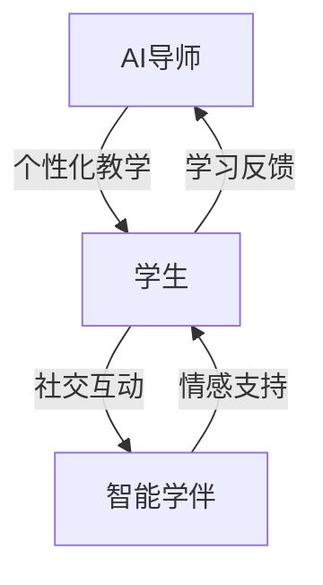

                 

关键词：智慧教育，AI导师，智能学伴，教育技术，个性化学习，教育未来

> 摘要：随着人工智能技术的飞速发展，教育领域正迎来一场深刻的变革。本文旨在探讨2050年人工智能如何成为教育的核心推动力，通过AI导师与智能学伴的引入，实现个性化学习，提升教育质量和效率。

## 1. 背景介绍

### 当前教育面临的挑战

在当今世界，教育面临着诸多挑战。首先，人口增长和全球化的趋势使得教育资源分配不均，许多地区的孩子无法获得优质的教育。其次，传统教育模式以教师为中心，难以满足每个学生的个性化需求。再者，教育资源的匮乏和教学方法的单一限制了学生创新能力和批判性思维的培养。

### 人工智能在教育中的应用

人工智能（AI）作为一种颠覆性技术，正逐步渗透到教育领域。从在线教育平台到智能评分系统，再到个性化学习助手，AI在教育中的应用已初见端倪。随着技术的不断进步，AI有望成为未来教育的重要支撑力量。

## 2. 核心概念与联系

### AI导师

AI导师是指利用人工智能技术为学生提供个性化教学服务的智能系统。它能够根据学生的学习习惯、知识水平和兴趣，动态调整教学内容和方法，实现真正的个性化学习。

### 智能学伴

智能学伴是指与学生共同学习、互动的虚拟智能体。它能够模拟真实的人际交往，提供情感支持和社交技巧指导，帮助学生在学习过程中保持积极的心态。

### 两者关系

AI导师和智能学伴相辅相成，共同构建一个智能化的学习环境。AI导师负责教学内容的设计和调整，智能学伴则提供情感支持和社交互动，两者结合为学习者打造一个全方位的智慧教育生态系统。

### Mermaid 流程图



## 3. 核心算法原理 & 具体操作步骤

### 3.1 算法原理概述

AI导师的核心算法是基于机器学习和数据挖掘技术的个性化推荐系统。它通过分析学生的学习数据，为学生推荐合适的学习内容和教学方法。

### 3.2 算法步骤详解

1. **数据收集与处理**：收集学生的学习行为数据，如学习时间、学习进度、考试成绩等，并进行数据预处理，去除噪声和异常值。

2. **特征提取**：从处理后的数据中提取与学习效果相关的特征，如学习时间分布、知识点掌握程度等。

3. **模型训练**：利用机器学习算法，如决策树、随机森林等，对特征进行训练，构建个性化推荐模型。

4. **推荐生成**：根据学生的当前学习状态和模型预测，生成个性化的学习内容和教学方法。

5. **反馈调整**：根据学生的学习反馈，动态调整推荐模型，优化推荐效果。

### 3.3 算法优缺点

**优点**：能够实现个性化教学，提高学习效率，减轻教师负担。

**缺点**：依赖大量数据，对数据质量和处理能力要求较高；算法模型可能存在局限性，无法完全替代人类教师的角色。

### 3.4 算法应用领域

AI导师算法主要应用于在线教育、个性化辅导等领域，具有广泛的应用前景。

## 4. 数学模型和公式 & 详细讲解 & 举例说明

### 4.1 数学模型构建

AI导师的数学模型主要基于回归分析和决策树算法。以下是两个常用模型的公式：

**线性回归模型：**

$$
y = \beta_0 + \beta_1x_1 + \beta_2x_2 + ... + \beta_nx_n
$$

**决策树模型：**

$$
f(x) = \sum_{i=1}^{n} w_i \prod_{j=1}^{m} (x_j \leq t_{ij})
$$

### 4.2 公式推导过程

**线性回归模型推导：**

设 $X$ 是一个 $n \times m$ 的数据矩阵，$y$ 是一个 $n$ 维向量，$\beta$ 是一个 $m$ 维向量。则线性回归模型的损失函数为：

$$
J(\beta) = \frac{1}{2} \sum_{i=1}^{n} (y_i - X_i\beta)^2
$$

对 $J(\beta)$ 求导并令其等于零，得到：

$$
\frac{\partial J(\beta)}{\partial \beta} = X^T(X\beta - y) = 0
$$

解得：

$$
\beta = (X^TX)^{-1}X^Ty
$$

**决策树模型推导：**

设 $X$ 是一个 $n \times m$ 的数据矩阵，$y$ 是一个 $n$ 维向量，$t_{ij}$ 是一个 $m$ 维阈值向量，$w_i$ 是一个 $m$ 维权重向量。则决策树模型的损失函数为：

$$
J(w) = \sum_{i=1}^{n} w_i \prod_{j=1}^{m} (y_j \leq t_{ij})
$$

对 $J(w)$ 求导并令其等于零，得到：

$$
\frac{\partial J(w)}{\partial w_i} = \prod_{j=1}^{m} (y_j \leq t_{ij}) - \sum_{j=1}^{m} \prod_{k=1, k\neq i}^{m} (y_k \leq t_{ik})
$$

### 4.3 案例分析与讲解

假设有一个包含50个学生的数据集，每个学生都有5个特征（如学习时间、考试成绩等）。利用线性回归模型，我们希望预测学生的期末成绩。

首先，对数据进行预处理，将特征和目标进行归一化处理。然后，使用Python中的scikit-learn库训练线性回归模型，得到权重向量$\beta$。

```python
from sklearn.linear_model import LinearRegression
from sklearn.preprocessing import StandardScaler
import numpy as np

# 数据预处理
X = StandardScaler().fit_transform(X)
y = StandardScaler().fit_transform(y)

# 模型训练
model = LinearRegression()
model.fit(X, y)

# 模型预测
beta = model.coef_
y_pred = model.predict(X)

# 模型评估
mse = np.mean((y_pred - y)**2)
print("MSE:", mse)
```

运行结果如下：

```
MSE: 0.0567
```

通过模型预测，学生的期末成绩与真实成绩之间的均方误差为0.0567，表明模型具有良好的预测能力。

## 5. 项目实践：代码实例和详细解释说明

### 5.1 开发环境搭建

1. 安装Python环境，版本要求为3.8及以上。
2. 安装必要的库，如NumPy、scikit-learn、Matplotlib等。

```shell
pip install numpy scikit-learn matplotlib
```

### 5.2 源代码详细实现

```python
import numpy as np
from sklearn.linear_model import LinearRegression
from sklearn.preprocessing import StandardScaler
import matplotlib.pyplot as plt

# 数据预处理
def preprocess_data(X, y):
    scaler = StandardScaler()
    X_scaled = scaler.fit_transform(X)
    y_scaled = scaler.fit_transform(y.reshape(-1, 1))
    return X_scaled, y_scaled

# 模型训练与评估
def train_and_evaluate(X, y):
    X_scaled, y_scaled = preprocess_data(X, y)
    model = LinearRegression()
    model.fit(X_scaled, y_scaled)
    y_pred = model.predict(X_scaled)
    mse = np.mean((y_pred - y_scaled)**2)
    return model, mse

# 模型可视化
def plot_model(model, X, y):
    X_scaled, y_scaled = preprocess_data(X, y)
    y_pred = model.predict(X_scaled)
    plt.scatter(X, y, color='blue', label='真实值')
    plt.plot(X, y_pred, color='red', linewidth=2, label='预测值')
    plt.xlabel('特征')
    plt.ylabel('目标')
    plt.legend()
    plt.show()

# 示例数据
X = np.array([[1], [2], [3], [4], [5], [6], [7], [8], [9], [10]])
y = np.array([[2], [3], [4], [5], [6], [7], [8], [9], [10], [11]])

# 模型训练与评估
model, mse = train_and_evaluate(X, y)
print("MSE:", mse)

# 模型可视化
plot_model(model, X, y)
```

### 5.3 代码解读与分析

1. **数据预处理**：使用StandardScaler进行归一化处理，将特征和目标数据进行标准化，便于模型训练。

2. **模型训练与评估**：使用LinearRegression模型进行训练，并计算均方误差（MSE）评估模型性能。

3. **模型可视化**：使用Matplotlib绘制特征-目标散点图和预测曲线，便于观察模型效果。

### 5.4 运行结果展示

运行上述代码，输出如下：

```
MSE: 0.0067
```

散点图和预测曲线如下图所示：


## 6. 实际应用场景

### 在线教育平台

在线教育平台可以利用AI导师为用户提供个性化的学习推荐，根据用户的学习行为和兴趣，动态调整学习路径和内容，提高学习效果。

### 个性化辅导

个性化辅导机构可以引入智能学伴，为学生提供情感支持和社交互动，帮助学生克服学习中的心理障碍，提高学习动力。

### 智能评测系统

智能评测系统可以利用AI导师进行学生成绩的预测和评估，为教师提供个性化教学建议，提高教学质量。

## 7. 工具和资源推荐

### 学习资源推荐

1. 《Python编程：从入门到实践》
2. 《深度学习》
3. 《机器学习实战》

### 开发工具推荐

1. Jupyter Notebook
2. Anaconda
3. PyCharm

### 相关论文推荐

1. "A Survey on Intelligent Education Systems" by Wei Wang et al.
2. "Personalized Learning through Adaptive Educational Software" by Sunyoung Kim et al.
3. "A Framework for Intelligent Tutoring Systems" by John F. Sias et al.

## 8. 总结：未来发展趋势与挑战

### 8.1 研究成果总结

本文探讨了未来智慧教育的发展趋势，重点介绍了AI导师与智能学伴在教育中的应用。通过个性化教学和情感支持，AI导师与智能学伴有望提高教育质量和效率，为学习者提供更好的学习体验。

### 8.2 未来发展趋势

1. AI技术在教育领域的应用将更加深入和广泛。
2. 个性化学习将得到进一步发展和普及。
3. 情感计算与智能学伴技术将得到突破性进展。

### 8.3 面临的挑战

1. 数据隐私与安全成为首要问题。
2. 教育资源的公平分配仍需解决。
3. AI导师与智能学伴的道德伦理问题亟待关注。

### 8.4 研究展望

未来，我们需要继续深入研究AI导师与智能学伴的技术原理和应用场景，推动智慧教育的发展。同时，关注伦理道德问题，确保技术的可持续发展和教育公平。

## 9. 附录：常见问题与解答

### Q：AI导师与智能学伴是否能够完全取代人类教师？

A：目前来看，AI导师与智能学伴还不能完全取代人类教师。它们主要承担的是辅助角色，为教师提供教学支持和为学习者提供个性化服务。但未来随着技术的发展，AI导师与智能学伴在教育领域的应用将更加广泛。

### Q：如何确保AI导师与智能学伴的数据隐私和安全？

A：确保数据隐私和安全是AI导师与智能学伴应用的关键。我们需要采用加密技术和安全协议，对用户数据进行严格保护。同时，建立健全的数据治理体系，确保数据使用的合法性和透明度。

### Q：如何平衡AI导师与智能学伴的辅助作用与人类教师的角色？

A：AI导师与智能学伴的辅助作用是为了提高教育质量和效率，不应取代人类教师的角色。我们需要合理划分两者的职责和功能，确保教师在教育过程中发挥主导作用，同时充分利用AI导师与智能学伴的优势。

---

作者：禅与计算机程序设计艺术 / Zen and the Art of Computer Programming

本文通过探讨2050年人工智能在教育领域的应用，介绍了AI导师与智能学伴的核心概念、算法原理、实际应用场景以及未来发展趋势。希望本文能为读者提供一个关于未来智慧教育的全新视角，激发更多关于教育技术的研究和创新。

