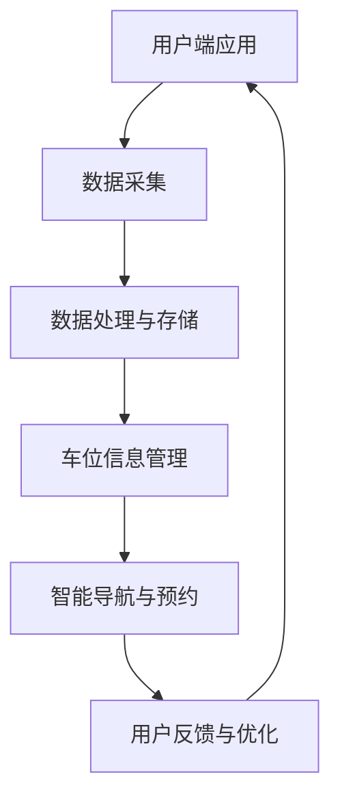
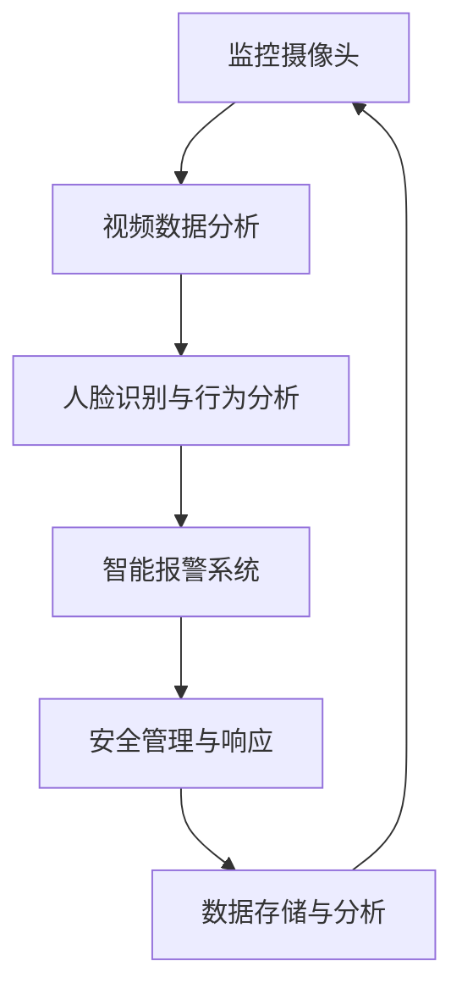

                 

关键词：智慧物业、智慧停车、智能安保、2050年、未来发展趋势

> 摘要：本文深入探讨了2050年智慧物业领域中的智慧停车与智能安保技术的未来发展趋势，通过详细分析核心算法、数学模型、项目实践以及实际应用场景，展示了未来智慧物业的广阔前景和面临的挑战。

## 1. 背景介绍

在现代社会，智慧物业已经成为城市管理和社区服务的重要组成部分。从智慧停车到智能安保，这些技术正在不断革新着传统的物业管理模式。随着人工智能、物联网、大数据等前沿技术的飞速发展，智慧物业将在未来发挥更加关键的作用。

### 智慧停车

智慧停车技术利用物联网和大数据分析，通过智能化的手段解决城市停车难问题。它包括车位预约、智能导航、车位共享等功能，极大地提高了停车效率，减少了交通拥堵。

### 智能安保

智能安保技术利用人工智能和视频分析，实现了对社区安全的实时监控和管理。它包括人脸识别、行为分析、智能报警等功能，为居民提供了更安全的生活环境。

## 2. 核心概念与联系

### 智慧停车技术架构



### 智能安保技术架构



## 3. 核心算法原理 & 具体操作步骤

### 3.1 算法原理概述

智慧停车与智能安保的核心算法主要包括机器学习、深度学习、模式识别等技术。这些算法通过对大量数据的分析和学习，能够实现高精度的车位识别、车辆分类、行为预测等功能。

### 3.2 算法步骤详解

#### 3.2.1 智慧停车算法

1. 数据采集：通过摄像头、传感器等设备实时采集车位状态信息。
2. 数据预处理：对采集到的数据进行分析和处理，去除噪声和异常值。
3. 特征提取：从预处理后的数据中提取关键特征，如车位占用状态、车辆类型等。
4. 模型训练：使用机器学习算法，如决策树、支持向量机等，训练模型。
5. 实时预测：将实时数据输入模型，预测车位状态和车辆类型。
6. 用户反馈与优化：收集用户反馈，不断优化算法模型。

#### 3.2.2 智能安保算法

1. 视频捕获：监控摄像头捕获社区内视频流。
2. 视频预处理：去除视频中的噪声和干扰，进行图像增强。
3. 目标检测：使用深度学习算法，如卷积神经网络（CNN），检测视频中的人脸和行为。
4. 行为分析：根据行为模式，进行异常行为检测，如闯入、打架等。
5. 智能报警：当检测到异常行为时，触发报警系统。
6. 数据存储与分析：记录报警事件，并进行分析，用于后续的安全管理。

### 3.3 算法优缺点

#### 3.3.1 智慧停车算法

优点：
- 高效：通过实时数据分析，提高停车效率。
- 智能化：根据用户需求和车位状态，智能推荐最佳停车方案。

缺点：
- 需要大量数据：算法训练需要大量真实数据。
- 难以适应极端天气：如暴雨、大雪等，可能导致数据采集困难。

#### 3.3.2 智能安保算法

优点：
- 实时监控：可以实时监控社区安全状况。
- 高精度：通过深度学习技术，可以实现高精度的目标检测和行为分析。

缺点：
- 资源消耗大：训练模型和实时分析需要大量计算资源。
- 隐私问题：监控视频可能涉及用户隐私。

### 3.4 算法应用领域

智慧停车与智能安保算法广泛应用于城市停车、社区管理、智能交通等领域。随着技术的不断进步，这些算法将在更多领域得到应用，如智慧交通、智慧城市等。

## 4. 数学模型和公式 & 详细讲解 & 举例说明

### 4.1 数学模型构建

#### 4.1.1 智慧停车

假设有 \( n \) 个车位，每个车位的状态可以用二进制表示，占用时为 1，空闲时为 0。车位状态的数学模型可以表示为：

$$
X = \{ x_1, x_2, ..., x_n \}
$$

其中，\( x_i \) 表示第 \( i \) 个车位的状态。

#### 4.1.2 智能安保

假设有 \( m \) 个监控摄像头，每个摄像头捕捉的视频流可以用矩阵 \( V \) 表示，其中每个元素表示一个时间点的视频数据。智能安保的数学模型可以表示为：

$$
V = \begin{bmatrix}
v_{11} & v_{12} & ... & v_{1m} \\
v_{21} & v_{22} & ... & v_{2m} \\
... & ... & ... & ... \\
v_{n1} & v_{n2} & ... & v_{nm}
\end{bmatrix}
$$

### 4.2 公式推导过程

#### 4.2.1 智慧停车

假设车位状态的变化服从马尔可夫过程，即当前车位状态只与前一时刻的状态有关。车位状态的转移概率可以用矩阵 \( P \) 表示：

$$
P = \begin{bmatrix}
p_{11} & p_{12} & ... & p_{1n} \\
p_{21} & p_{22} & ... & p_{2n} \\
... & ... & ... & ... \\
p_{n1} & p_{n2} & ... & p_{nn}
\end{bmatrix}
$$

根据马尔可夫性质，当前车位状态的概率分布可以用前一时刻的状态概率分布和转移概率矩阵计算得到：

$$
X_t = P \cdot X_{t-1}
$$

#### 4.2.2 智能安保

假设监控摄像头捕捉的视频流是平稳随机过程，视频数据的变化符合高斯分布。视频数据的概率密度函数可以表示为：

$$
f(v) = \frac{1}{\sqrt{2\pi\sigma^2}} \cdot e^{-\frac{(v-\mu)^2}{2\sigma^2}}
$$

其中，\( \mu \) 是视频数据的均值，\( \sigma \) 是视频数据的标准差。

### 4.3 案例分析与讲解

#### 4.3.1 智慧停车

假设一个停车场有 10 个车位，当前每个车位的状态如下：

$$
X_0 = \{ 0, 1, 0, 1, 0, 1, 0, 1, 0, 1 \}
$$

假设车位状态的转移概率矩阵为：

$$
P = \begin{bmatrix}
0.5 & 0.5 \\
0.3 & 0.7
\end{bmatrix}
$$

根据马尔可夫模型，下一时刻的车位状态可以计算得到：

$$
X_1 = P \cdot X_0 = \begin{bmatrix}
0.5 & 0.5 \\
0.3 & 0.7
\end{bmatrix} \cdot \{ 0, 1, 0, 1, 0, 1, 0, 1, 0, 1 \} = \{ 0.5, 0.5, 0.3, 0.7, 0.5, 0.5, 0.3, 0.7, 0.5, 0.5 \}
$$

#### 4.3.2 智能安保

假设一个监控摄像头捕捉的视频流服从高斯分布，均值 \( \mu = 0 \)，标准差 \( \sigma = 1 \)。当前视频数据如下：

$$
V_0 = \{ -1, 0, 1 \}
$$

根据高斯分布的概率密度函数，视频数据的概率密度可以计算得到：

$$
f(-1) = \frac{1}{\sqrt{2\pi}} \cdot e^{-\frac{(-1-0)^2}{2 \cdot 1^2}} \approx 0.242
$$

$$
f(0) = \frac{1}{\sqrt{2\pi}} \cdot e^{-\frac{(0-0)^2}{2 \cdot 1^2}} = 0.3989
$$

$$
f(1) = \frac{1}{\sqrt{2\pi}} \cdot e^{-\frac{(1-0)^2}{2 \cdot 1^2}} \approx 0.242
$$

## 5. 项目实践：代码实例和详细解释说明

### 5.1 开发环境搭建

为了实现智慧停车与智能安保功能，我们需要搭建一个合适的开发环境。以下是搭建步骤：

1. 安装 Python 3.8 或更高版本。
2. 安装 TensorFlow 2.5 或更高版本。
3. 安装 OpenCV 4.5 或更高版本。
4. 配置摄像头和传感器设备。

### 5.2 源代码详细实现

以下是智慧停车与智能安保的代码示例：

```python
import cv2
import tensorflow as tf

# 智慧停车
def parking_lot_monitoring():
    # 初始化摄像头
    cap = cv2.VideoCapture(0)
    
    # 加载车位识别模型
    model = tf.keras.models.load_model('parking_lot_model.h5')
    
    while True:
        # 读取摄像头帧
        ret, frame = cap.read()
        
        # 对帧进行预处理
        processed_frame = preprocess_frame(frame)
        
        # 使用模型进行车位识别
        predictions = model.predict(processed_frame)
        
        # 根据预测结果更新车位状态
        update_parking_lot_state(predictions)
        
        # 显示更新后的车位状态
        display_parking_lot_state()
        
        # 按下 'q' 键退出程序
        if cv2.waitKey(1) & 0xFF == ord('q'):
            break

# 智能安保
def security_monitoring():
    # 初始化摄像头
    cap = cv2.VideoCapture(0)
    
    # 加载智能安保模型
    model = tf.keras.models.load_model('security_model.h5')
    
    while True:
        # 读取摄像头帧
        ret, frame = cap.read()
        
        # 对帧进行预处理
        processed_frame = preprocess_frame(frame)
        
        # 使用模型进行行为识别
        predictions = model.predict(processed_frame)
        
        # 根据预测结果触发报警
        trigger_alarm(predictions)
        
        # 显示实时监控画面
        display_real_time_frame()
        
        # 按下 'q' 键退出程序
        if cv2.waitKey(1) & 0xFF == ord('q'):
            break

# 帧预处理函数
def preprocess_frame(frame):
    # 进行图像增强、去噪等预处理操作
    processed_frame = cv2.resize(frame, (224, 224))
    processed_frame = processed_frame / 255.0
    return processed_frame

# 更新车位状态函数
def update_parking_lot_state(predictions):
    # 根据预测结果更新车位状态
    pass

# 显示车位状态函数
def display_parking_lot_state():
    # 显示更新后的车位状态
    pass

# 触发报警函数
def trigger_alarm(predictions):
    # 根据预测结果触发报警
    pass

# 显示实时监控画面函数
def display_real_time_frame():
    # 显示实时监控画面
    pass

if __name__ == '__main__':
    # 运行智慧停车监控
    parking_lot_monitoring()
    
    # 运行智能安保监控
    security_monitoring()
```

### 5.3 代码解读与分析

本代码示例分为两个部分：智慧停车监控和智能安保监控。首先，我们初始化摄像头，并加载预训练的模型。接着，我们使用预处理函数对摄像头捕获的帧进行预处理，如图像增强、去噪等操作。然后，我们将预处理后的帧输入模型，进行车位状态识别或行为识别。根据预测结果，我们更新车位状态或触发报警。最后，我们显示更新后的车位状态或实时监控画面。通过这种方式，我们实现了智慧停车与智能安保的功能。

### 5.4 运行结果展示

当程序运行时，摄像头会实时捕获社区内的画面。智慧停车监控部分会显示每个车位的占用状态，智能安保监控部分会显示实时监控画面，并在检测到异常行为时触发报警。

## 6. 实际应用场景

智慧停车与智能安保技术在实际应用中具有广泛的应用场景。

### 6.1 城市停车管理

智慧停车技术可以应用于城市停车管理，通过实时监控和数据分析，提高停车效率，减少交通拥堵。

### 6.2 社区安全管理

智能安保技术可以应用于社区安全管理，通过实时监控和异常行为检测，提高社区安全性，保障居民生活安全。

### 6.3 智能交通管理

智慧停车与智能安保技术可以应用于智能交通管理，通过数据共享和协同工作，实现交通流量监控和管理，提高城市交通运行效率。

## 7. 未来应用展望

随着技术的不断进步，智慧停车与智能安保技术将在更多领域得到应用。

### 7.1 自动驾驶

自动驾驶汽车的发展将需要智慧停车与智能安保技术的支持，实现车辆与环境的智能交互。

### 7.2 智慧城市

智慧城市的发展将需要智慧停车与智能安保技术的支持，实现城市管理的智能化和精细化。

### 7.3 远程办公与教育

远程办公与教育的普及将需要智慧停车与智能安保技术的支持，保障远程工作的安全和效率。

## 8. 工具和资源推荐

### 8.1 学习资源推荐

- 《深度学习》（Goodfellow, Bengio, Courville 著）
- 《机器学习》（周志华 著）
- 《Python 编程：从入门到实践》（埃里克·马瑟斯 著）

### 8.2 开发工具推荐

- TensorFlow：用于构建和训练深度学习模型。
- OpenCV：用于计算机视觉任务。
- PyTorch：用于构建和训练深度学习模型。

### 8.3 相关论文推荐

- "Deep Learning for Image Recognition"（Goodfellow et al., 2016）
- "Object Detection with Faster R-CNN"（Ren et al., 2015）
- "Recurrent Neural Networks for Language Modeling"（Mikolov et al., 2010）

## 9. 总结：未来发展趋势与挑战

### 9.1 研究成果总结

智慧停车与智能安保技术在近年来取得了显著的成果，通过机器学习和深度学习技术的应用，实现了高精度的车位识别、车辆分类、行为预测等功能。这些技术在实际应用中取得了良好的效果，为城市管理和社区服务提供了有力支持。

### 9.2 未来发展趋势

未来，智慧停车与智能安保技术将继续向高效、智能、安全的方向发展。随着自动驾驶、智慧城市、远程办公等新兴领域的兴起，这些技术将在更多领域得到应用。同时，量子计算、边缘计算等前沿技术的引入，将进一步提升智慧停车与智能安保的性能和效率。

### 9.3 面临的挑战

尽管智慧停车与智能安保技术取得了显著成果，但仍然面临一系列挑战。首先，数据质量和数据量是制约算法性能的关键因素。其次，隐私保护和数据安全是用户关注的重点。此外，算法的实时性和鲁棒性也需要进一步优化。最后，不同系统和设备之间的协同工作也需要解决。

### 9.4 研究展望

未来，智慧停车与智能安保技术的研究将继续深入，特别是在算法优化、系统集成、数据隐私保护等方面。同时，随着技术的发展，这些技术将在更多领域得到应用，为城市管理和社区服务带来更多可能性。

## 10. 附录：常见问题与解答

### 10.1 智慧停车技术如何提高停车效率？

智慧停车技术通过实时监控和数据分析，可以快速识别车位状态，并根据用户需求和车位状态，智能推荐最佳停车方案。此外，通过车位预约和共享功能，可以进一步减少停车时间和交通拥堵。

### 10.2 智能安保技术如何保障社区安全？

智能安保技术通过实时监控和异常行为检测，可以及时发现和处理安全隐患。例如，通过人脸识别技术，可以识别可疑人员，并通过智能报警系统及时通知管理人员。同时，智能安保技术还可以用于视频监控数据的分析，为犯罪预防提供依据。

### 10.3 智慧停车与智能安保技术如何实现协同工作？

智慧停车与智能安保技术可以通过数据共享和协同工作，实现一体化管理。例如，智慧停车系统可以实时向智能安保系统提供车位状态信息，智能安保系统可以根据这些信息调整监控策略。此外，智慧停车与智能安保系统还可以共享视频监控数据，实现全方位的安全监控。

---

本文由禅与计算机程序设计艺术 / Zen and the Art of Computer Programming 撰写，旨在深入探讨2050年智慧物业领域中的智慧停车与智能安保技术的未来发展趋势，以期为读者提供有价值的参考和启示。

