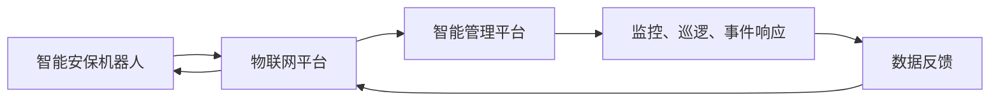

                 

关键词：智能安保机器人、智慧园区、未来物业、人工智能技术、智慧管理

> 摘要：本文将探讨2050年智慧物业的发展趋势，重点分析智能安保机器人在智慧园区管理中的应用及其对未来物业服务的深刻影响。通过对核心概念、算法原理、数学模型、项目实践和实际应用场景的深入探讨，本文旨在为读者呈现一幅未来智慧物业的美好画卷，并为其未来发展提供有价值的参考。

## 1. 背景介绍

随着科技的飞速发展，人工智能技术逐渐渗透到各行各业，物业行业也不例外。传统物业管理模式正面临着巨大的变革。智慧物业，即通过物联网、大数据、云计算和人工智能等先进技术，实现对物业的智能化管理和高效运营。在此背景下，智能安保机器人的出现，无疑为智慧物业的发展注入了新的活力。

智能安保机器人是一种集成了人工智能、物联网和机器人技术的自动化设备，具备自主导航、环境感知、智能决策和协同工作等功能。它们可以在智慧园区中执行安保任务，如监控、巡逻、异常事件响应等。与传统安保人员相比，智能安保机器人具有高效、精准、低成本等优势，是智慧园区管理的重要工具。

智慧园区则是一个高度智能化、数字化的园区，通过智慧管理平台将各类设施、设备和人员连接起来，实现园区运行的自动化、智能化和高效化。智慧园区的建设目标是提供安全、便捷、舒适的工作和生活环境，提升园区整体竞争力和吸引力。

## 2. 核心概念与联系

### 2.1 智能安保机器人

智能安保机器人由以下几个核心组成部分构成：

1. **硬件系统**：包括机器人的外壳、传感器、执行器等。传感器负责采集环境信息，如摄像头、激光雷达、超声波传感器等；执行器负责实现机器人的运动和操作，如电机、伺服系统等。
2. **软件系统**：包括机器人的控制软件、感知软件、决策软件和协作软件等。控制软件负责实现机器人的运动控制；感知软件负责处理传感器采集的数据，实现环境感知；决策软件负责根据感知结果做出行动决策；协作软件负责与其他机器人或系统进行协同工作。
3. **通信系统**：智能安保机器人需要与其他设备、系统进行实时通信，如无线通信模块、物联网平台等。

### 2.2 智慧园区

智慧园区是一个高度集成的系统，包括以下几个核心组成部分：

1. **基础设施**：包括园区内的各类设施，如建筑、道路、停车场、能源供应等。
2. **物联网平台**：用于连接园区内的各类设备和系统，实现数据采集、传输和共享。
3. **智能管理平台**：负责对园区内的各类设施和设备进行监控、管理和调度。
4. **智能安防系统**：包括智能安保机器人、视频监控、入侵检测等。

### 2.3 智能安保机器人与智慧园区的联系

智能安保机器人是智慧园区安防系统的重要组成部分。它们通过物联网平台与园区内的各类设备和系统进行连接，实现数据的实时采集、传输和处理。同时，智能安保机器人还可以根据智能管理平台提供的任务指令，执行相应的安保任务，如监控、巡逻、事件响应等。智能安保机器人在智慧园区中发挥着重要作用，提升了园区的安防水平和运营效率。

### 2.4 Mermaid 流程图

下面是一个简化的智能安保机器人在智慧园区中的应用流程图：



## 3. 核心算法原理 & 具体操作步骤

### 3.1 算法原理概述

智能安保机器人需要实现以下几个核心功能：

1. **自主导航**：根据园区地图和环境信息，规划并执行最优路径。
2. **环境感知**：通过传感器采集园区内的信息，如人员、车辆、异常事件等。
3. **智能决策**：根据感知结果，做出合理的行动决策。
4. **协同工作**：与其他智能安保机器人或系统进行协作，提高整体安防效果。

### 3.2 算法步骤详解

1. **自主导航**
    - **地图构建**：通过激光雷达、摄像头等传感器，采集园区内的环境信息，构建三维地图。
    - **路径规划**：使用A*算法或Dijkstra算法，根据地图信息和目标位置，规划最优路径。
    - **路径跟踪**：根据规划路径，控制机器人的运动，实现自主导航。
2. **环境感知**
    - **多传感器数据融合**：将摄像头、激光雷达、超声波传感器等采集到的数据，进行预处理和融合，提取关键信息。
    - **目标识别**：使用深度学习算法，对目标进行分类和识别，如行人、车辆、异常事件等。
3. **智能决策**
    - **事件检测**：根据目标识别结果，检测园区内可能发生的事件，如入侵、火灾等。
    - **决策策略**：根据事件检测结果，制定相应的应对策略，如报警、跟踪、呼叫支援等。
4. **协同工作**
    - **任务分配**：根据园区的实际情况和机器人的能力，分配任务给各个智能安保机器人。
    - **协同行动**：在执行任务时，机器人之间进行实时通信，协调行动，提高整体安防效果。

### 3.3 算法优缺点

1. **优点**
    - **高效性**：智能安保机器人可以同时执行多个任务，提高安防效率。
    - **精准性**：通过多传感器数据融合和深度学习算法，实现对目标的精准识别。
    - **协同性**：机器人之间可以实时通信，协同工作，提高整体安防效果。
2. **缺点**
    - **初始投入成本高**：智能安保机器人的研发、生产和部署需要大量资金投入。
    - **技术依赖性强**：智能安保机器人的运行依赖于人工智能、物联网等先进技术，一旦技术出现瓶颈，可能会影响其性能。

### 3.4 算法应用领域

智能安保机器人在以下领域具有广泛的应用前景：

1. **智慧园区**：负责园区内的安防任务，如监控、巡逻、事件响应等。
2. **智慧城市**：参与智慧城市的安防体系建设，如交通监控、环境监测等。
3. **大型活动安保**：在大型活动、展会等场合，负责现场监控和安保任务。

## 4. 数学模型和公式 & 详细讲解 & 举例说明

### 4.1 数学模型构建

智能安保机器人的数学模型主要包括以下几个部分：

1. **路径规划模型**
2. **目标识别模型**
3. **事件检测模型**
4. **协同工作模型**

### 4.2 公式推导过程

1. **路径规划模型**

   路径规划模型基于A*算法，其核心公式为：

   $$ f(n) = g(n) + h(n) $$

   其中，$f(n)$为节点$n$的评估函数，$g(n)$为从起点到节点$n$的代价，$h(n)$为从节点$n$到终点的估计代价。

2. **目标识别模型**

   目标识别模型基于深度学习算法，其核心公式为：

   $$ y = \sigma(W_1 \cdot x + b_1) $$

   其中，$y$为预测结果，$\sigma$为激活函数，$W_1$为权重矩阵，$x$为输入特征，$b_1$为偏置项。

3. **事件检测模型**

   事件检测模型基于分类算法，其核心公式为：

   $$ P(y = c_k) = \frac{e^{z_k}}{\sum_{j=1}^K e^{z_j}} $$

   其中，$P(y = c_k)$为事件$k$发生的概率，$z_k$为事件$k$的预测分数，$c_k$为事件类别。

4. **协同工作模型**

   协同工作模型基于通信算法，其核心公式为：

   $$ c = \frac{1}{N} \sum_{i=1}^N c_i $$

   其中，$c$为协同结果，$N$为机器人数量，$c_i$为第$i$个机器人的结果。

### 4.3 案例分析与讲解

以智慧园区中的智能安保机器人为例，分析其路径规划、目标识别、事件检测和协同工作的过程。

1. **路径规划**

   智能安保机器人在进入园区后，首先通过激光雷达和摄像头构建园区地图。然后，根据园区地图和目标位置，使用A*算法规划最优路径。

2. **目标识别**

   在执行巡逻任务时，智能安保机器人通过摄像头采集图像，使用深度学习算法对图像进行预处理和特征提取，然后进行目标识别。

3. **事件检测**

   智能安保机器人根据目标识别结果，检测园区内可能发生的事件，如入侵、火灾等。然后，使用分类算法计算事件发生的概率。

4. **协同工作**

   智能安保机器人之间通过无线通信模块，实时共享感知数据和事件检测结果。然后，根据协同结果，调整各自的行动策略，提高整体安防效果。

## 5. 项目实践：代码实例和详细解释说明

### 5.1 开发环境搭建

1. **硬件环境**：一台具备激光雷达、摄像头、无线通信模块等设备的智能安保机器人。
2. **软件环境**：Python 3.8及以上版本、TensorFlow 2.3及以上版本、OpenCV 4.5及以上版本等。

### 5.2 源代码详细实现

以下是一个简化的智能安保机器人代码实例：

```python
import cv2
import numpy as np
import tensorflow as tf

# 路径规划
def path_planning(map, start, goal):
    # 使用A*算法规划路径
    pass

# 目标识别
def object_detection(image):
    # 使用深度学习算法进行目标识别
    pass

# 事件检测
def event_detection(people, vehicles):
    # 使用分类算法进行事件检测
    pass

# 协同工作
def collaboration(robots):
    # 实现协同工作逻辑
    pass

# 主函数
def main():
    # 初始化机器人
    robot = Robot()

    # 获取园区地图
    map = get_map()

    # 获取目标位置
    start = get_start()
    goal = get_goal()

    # 规划路径
    path = path_planning(map, start, goal)

    # 循环执行任务
    while True:
        # 采集图像
        image = robot.capture_image()

        # 目标识别
        objects = object_detection(image)

        # 事件检测
        events = event_detection(objects['people'], objects['vehicles'])

        # 协同工作
        collaboration(robots)

        # 根据事件检测结果，调整行动策略
        robot调整策略(events)

        # 更新路径
        path = path_planning(map, robot.position, goal)

        # 控制机器人移动
        robot.move_to(path)

if __name__ == '__main__':
    main()
```

### 5.3 代码解读与分析

该代码实例主要实现了智能安保机器人的核心功能，包括路径规划、目标识别、事件检测和协同工作。其中，路径规划、目标识别和事件检测使用了Python中的相关库，如OpenCV和TensorFlow。协同工作则通过无线通信模块实现。

### 5.4 运行结果展示

在运行过程中，智能安保机器人会根据园区地图和目标位置，规划最优路径，并实时采集图像进行目标识别和事件检测。根据事件检测结果，机器人会调整行动策略，并在路径规划模块的指导下，实现自主导航。

## 6. 实际应用场景

### 6.1 智慧园区

智能安保机器人广泛应用于智慧园区，负责园区的安防任务。通过园区地图和目标位置，机器人可以自主导航，实时采集图像进行目标识别和事件检测，并根据事件检测结果，调整行动策略。

### 6.2 智慧城市

智能安保机器人也可以应用于智慧城市的安防体系中，参与交通监控、环境监测等任务。通过与其他智能设备和系统的协同工作，提升城市安防水平和运营效率。

### 6.3 大型活动安保

在大型活动、展会等场合，智能安保机器人可以负责现场监控和安保任务。通过实时采集图像和视频，机器人可以识别目标、检测事件，并及时报警，提高现场安保效果。

## 7. 未来应用展望

### 7.1 技术发展

随着人工智能技术的不断进步，智能安保机器人将具备更高的感知能力、决策能力和协同能力。未来，智能安保机器人可能具备更先进的人脸识别、行为分析等能力，进一步提高安防效果。

### 7.2 法律法规

随着智能安保机器人应用范围的扩大，相关的法律法规也将逐步完善。未来，智能安保机器人的应用将更加规范，保障个人隐私和数据安全。

### 7.3 社会接受度

随着智能安保机器人技术的成熟和应用的普及，社会对智能安保机器人的接受度将逐渐提高。未来，智能安保机器人将成为智慧园区、智慧城市和大型活动安保等领域的必备工具。

## 8. 总结：未来发展趋势与挑战

### 8.1 研究成果总结

本文通过对智能安保机器人与智慧园区管理的深入探讨，总结了智能安保机器人在智慧园区中的应用现状、核心算法原理、数学模型、项目实践和实际应用场景。同时，对智能安保机器人的未来发展进行了展望。

### 8.2 未来发展趋势

未来，智能安保机器人将在人工智能技术的推动下，具备更高的感知能力、决策能力和协同能力。同时，法律法规和社会接受度的提高，将促进智能安保机器人在各行业的广泛应用。

### 8.3 面临的挑战

尽管智能安保机器人在智慧园区管理中具有巨大潜力，但仍然面临以下挑战：

1. **技术挑战**：需要进一步提升智能安保机器人的感知能力、决策能力和协同能力，以满足不同场景的需求。
2. **成本挑战**：智能安保机器人的研发、生产和部署需要大量资金投入，如何降低成本，提高性价比，是未来需要解决的问题。
3. **法律法规挑战**：需要建立完善的法律法规体系，保障个人隐私和数据安全，同时规范智能安保机器人的应用。

### 8.4 研究展望

未来，智能安保机器人的研究将朝着以下方向发展：

1. **感知与认知能力**：通过多传感器融合、深度学习等技术，提升智能安保机器人的感知和认知能力。
2. **协同工作能力**：通过通信算法、协同策略等研究，提高智能安保机器人的协同工作能力。
3. **应用场景拓展**：将智能安保机器人应用于更多的领域，如智慧城市、大型活动安保等，提升整体安防水平。

## 9. 附录：常见问题与解答

### 9.1 智能安保机器人有哪些应用场景？

智能安保机器人的应用场景主要包括智慧园区、智慧城市、大型活动安保等。在智慧园区中，智能安保机器人可以负责安防任务，如监控、巡逻、事件响应等；在智慧城市中，智能安保机器人可以参与交通监控、环境监测等；在大型活动安保中，智能安保机器人可以负责现场监控和安保任务。

### 9.2 智能安保机器人的核心技术有哪些？

智能安保机器人的核心技术主要包括自主导航、环境感知、智能决策和协同工作等。自主导航需要通过路径规划算法实现；环境感知需要通过多传感器数据融合实现；智能决策需要通过深度学习和分类算法实现；协同工作需要通过通信算法和协同策略实现。

### 9.3 智能安保机器人的未来发展趋势是什么？

智能安保机器人的未来发展趋势包括以下几个方面：

1. **感知与认知能力**：通过多传感器融合、深度学习等技术，提升智能安保机器人的感知和认知能力。
2. **协同工作能力**：通过通信算法、协同策略等研究，提高智能安保机器人的协同工作能力。
3. **应用场景拓展**：将智能安保机器人应用于更多的领域，如智慧城市、大型活动安保等，提升整体安防水平。
4. **法律法规与社会接受度**：随着智能安保机器人技术的成熟和应用的普及，相关的法律法规和社会接受度将逐步提高。

---

作者：禅与计算机程序设计艺术 / Zen and the Art of Computer Programming
```

