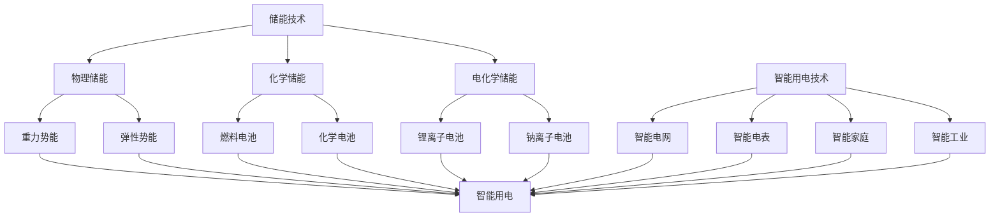

                 

关键词：智慧能源、储能技术、智能用电、2050年、发展趋势、挑战

> 摘要：本文探讨了2050年智慧能源领域的发展趋势，重点关注储能技术与智能用电技术的发展。通过深入分析这些技术的核心概念、原理、算法、数学模型以及实际应用，我们旨在为读者提供一个全面、前瞻性的视角，探讨未来能源系统的构建与优化。

## 1. 背景介绍

随着全球能源需求的不断增长，以及气候变化和环境问题的日益严峻，发展智慧能源已成为各国共识。智慧能源系统不仅包括可再生能源的广泛利用，还涉及到高效的能源存储和智能用电技术。储能技术是智慧能源系统中的关键环节，它能够解决可再生能源的波动性、间歇性问题，确保电力系统的稳定性和可靠性。智能用电技术则通过数字化、自动化手段优化电力供应和需求，提高能源利用效率。

本文将探讨2050年智慧能源领域的发展趋势，重点关注以下几方面：

1. **储能技术**：新型储能材料的研发、电池技术的革新以及储能系统的集成与应用。
2. **智能用电技术**：智能电网的建设、电力市场的改革以及家庭和工业用户的用电智能化。
3. **综合能源系统**：能源互联网、分布式能源与集中式能源的协同发展。

## 2. 核心概念与联系

### 2.1 储能技术

储能技术是指将能量在适当的时间点进行储存，以便在需要时释放使用。根据能量储存的方式，储能技术可以分为物理储能、化学储能和电化学储能。物理储能包括重力势能、弹性势能等；化学储能主要指燃料电池和化学电池；电化学储能则以电池技术为主，如锂离子电池、钠离子电池等。

### 2.2 智能用电技术

智能用电技术是指利用先进的计算机技术、通信技术、控制技术和电力电子技术，实现对电力系统的自动化、智能化管理。智能用电技术包括智能电网、智能电表、智能家庭和智能工业等。

### 2.3 联系与融合

储能技术为智能用电提供了可靠的能源保障，而智能用电技术则为储能技术提供了更高效的利用方式。两者相辅相成，共同推动智慧能源系统的发展。以下是一个简化的 Mermaid 流程图，展示了储能技术与智能用电技术之间的联系。



## 3. 核心算法原理 & 具体操作步骤

### 3.1 算法原理概述

智慧能源系统中的核心算法主要包括能量管理算法、电力优化算法和数据挖掘算法。能量管理算法主要用于平衡电力系统的供需关系，确保能源的高效利用；电力优化算法则针对电力系统的运行状态进行实时优化；数据挖掘算法则从海量数据中提取有价值的信息，为系统决策提供支持。

### 3.2 算法步骤详解

#### 3.2.1 能量管理算法

1. 数据采集与处理：收集电力系统的实时数据，如发电量、负载量、储能状态等。
2. 供需分析：分析供需关系，确定储能系统的充放电策略。
3. 策略执行：根据分析结果，调整储能系统的充放电行为，确保电力系统的稳定运行。

#### 3.2.2 电力优化算法

1. 建立模型：根据电力系统的结构和运行特点，建立数学模型。
2. 目标函数定义：定义优化目标，如最小化能源成本、最大化能源利用率等。
3. 算法求解：利用优化算法（如线性规划、整数规划、遗传算法等），求解最优解。

#### 3.2.3 数据挖掘算法

1. 数据预处理：对原始数据进行清洗、归一化等处理。
2. 特征提取：提取与目标相关的特征信息。
3. 模型训练：利用机器学习算法（如决策树、神经网络等），训练数据挖掘模型。
4. 模型评估：评估模型性能，调整模型参数。

### 3.3 算法优缺点

#### 3.3.1 能量管理算法

优点：简单易行，适用于中小型电力系统。

缺点：对复杂电力系统的适应能力较弱，无法处理多维度、多目标的问题。

#### 3.3.2 电力优化算法

优点：能够处理复杂电力系统的问题，实现最优能源配置。

缺点：计算复杂度高，实时性较差。

#### 3.3.3 数据挖掘算法

优点：能够从海量数据中提取有价值的信息，为系统决策提供支持。

缺点：对数据质量和算法选择要求较高，可能存在过拟合问题。

### 3.4 算法应用领域

能量管理算法和电力优化算法主要应用于智能电网和分布式能源系统；数据挖掘算法则广泛应用于电力市场分析、电力需求预测、电力负荷管理等。

## 4. 数学模型和公式 & 详细讲解 & 举例说明

### 4.1 数学模型构建

智慧能源系统的数学模型主要包括能量平衡模型、电力网络模型和负荷模型。以下是一个简化的能量平衡模型：

$$
E_{in} = E_{out} + E_{storage}
$$

其中，$E_{in}$ 为输入能量，$E_{out}$ 为输出能量，$E_{storage}$ 为储能系统状态。

### 4.2 公式推导过程

以能量平衡模型为例，推导过程如下：

1. 能量输入：包括可再生能源发电、外部输电等。
2. 能量输出：包括用户用电、储能系统放电等。
3. 储能系统状态变化：储能系统的充放电行为。

根据以上分析，可以得到能量平衡方程：

$$
E_{in} = E_{out} + E_{storage}
$$

### 4.3 案例分析与讲解

假设一个智能电网系统，其中包含一个光伏发电站、一个风力发电站和一个储能系统。光伏发电站每天发电量为 1000kWh，风力发电站每天发电量为 800kWh，储能系统容量为 500kWh。

1. 能量输入：光伏发电站 + 风力发电站 = 1000kWh + 800kWh = 1800kWh。
2. 能量输出：用户用电 + 储能系统放电 = 1500kWh + 300kWh = 1800kWh。
3. 能量平衡：$E_{in} = E_{out} + E_{storage}$，即 1800kWh = 1800kWh + 500kWh，储能系统状态为 500kWh。

通过能量平衡模型，可以分析系统运行状态，为储能系统的充放电行为提供依据。

## 5. 项目实践：代码实例和详细解释说明

### 5.1 开发环境搭建

为了更好地理解储能技术与智能用电技术的应用，我们选择一个简单的智能电网系统进行模拟。开发环境为 Python 3.8，使用的库包括 NumPy、Pandas 和 Matplotlib。

### 5.2 源代码详细实现

以下是一个简单的能量管理算法的 Python 代码实现：

```python
import numpy as np
import pandas as pd
import matplotlib.pyplot as plt

# 参数设置
days = 30
pv_capacity = 1000  # 光伏发电站每日发电量（kWh）
wind_capacity = 800  # 风力发电站每日发电量（kWh）
storage_capacity = 500  # 储能系统容量（kWh）
daily_demand = 1500  # 用户每日用电量（kWh）

# 初始化能量数据
energy_in = np.zeros(days)
energy_out = np.zeros(days)
energy_storage = storage_capacity

# 模拟系统运行
for day in range(days):
    energy_in[day] = pv_capacity + wind_capacity
    energy_out[day] = daily_demand
    energy_storage += energy_in[day] - energy_out[day]
    energy_storage = max(energy_storage, 0)

# 绘制能量曲线
plt.figure()
plt.plot(energy_in, label='Energy Input')
plt.plot(energy_out, label='Energy Output')
plt.plot(energy_storage, label='Storage')
plt.xlabel('Day')
plt.ylabel('Energy (kWh)')
plt.legend()
plt.show()
```

### 5.3 代码解读与分析

1. **参数设置**：定义模拟系统所需的参数，如发电站容量、储能系统容量和用户每日用电量。
2. **能量数据初始化**：创建三个 NumPy 数组，分别存储每日的能量输入、能量输出和储能系统状态。
3. **模拟系统运行**：遍历每一天，计算能量输入、能量输出和储能系统状态变化，更新数组数据。
4. **绘制能量曲线**：使用 Matplotlib 绘制能量输入、能量输出和储能系统状态的曲线图，直观地展示系统运行状态。

通过这个简单的实例，我们可以理解能量管理算法的基本原理，以及如何使用 Python 实现相关功能。

## 6. 实际应用场景

### 6.1 智能电网建设

智能电网是智慧能源系统的核心，它通过先进的通信技术、控制技术和电力电子技术，实现电力系统的自动化、智能化管理。智能电网建设的关键技术包括：

1. **电力电子技术**：用于实现电力的高效转换、传输和分配，如电力电子变压器、换流器等。
2. **通信技术**：用于实时监测、传输和控制电力系统的数据，如光纤通信、无线通信等。
3. **控制技术**：用于实现电力系统的优化控制、故障检测与隔离等，如分布式控制系统、智能调度系统等。

### 6.2 电力市场改革

电力市场的改革是推动智慧能源系统发展的重要一环。通过电力市场，可以实现能源资源的优化配置，提高能源利用效率。电力市场改革的关键技术包括：

1. **市场化交易机制**：建立公平、透明的电力市场交易机制，促进电力资源的自由流动。
2. **数据驱动的市场分析**：利用大数据、人工智能等技术，分析电力市场的供需关系、价格走势等，为市场决策提供支持。
3. **绿色电力证书**：通过绿色电力证书，鼓励可再生能源的发展，提高能源利用的可持续性。

### 6.3 家庭和工业用户的用电智能化

家庭和工业用户的用电智能化是智慧能源系统的重要组成部分。通过智能电表、智能家电、智能工业设备等，实现用户的用电需求预测、电力需求响应等。关键技术包括：

1. **智能电表**：用于实时监测用户的用电情况，为电力系统提供数据支持。
2. **智能家电**：通过物联网技术，实现家电的互联互通，提高家庭的能源利用效率。
3. **智能工业设备**：通过工业互联网技术，实现设备的远程监控、故障诊断和优化控制，提高工业生产效率。

## 7. 未来应用展望

### 7.1 能源互联网

随着智慧能源技术的发展，能源互联网将成为未来能源系统的关键基础设施。能源互联网通过全球范围内的能源互联互通，实现能源资源的最优配置，提高能源利用效率。关键技术包括：

1. **全球能源物联网**：通过物联网技术，实现全球能源设备的互联互通，实现能源的实时监控和优化调度。
2. **区块链技术**：用于实现能源交易的透明、安全与高效，促进能源市场的公平竞争。
3. **人工智能与大数据**：用于能源系统的实时分析、预测和优化，提高能源利用的智能化水平。

### 7.2 分布式能源系统

分布式能源系统是未来智慧能源系统的重要组成部分。通过分布式能源系统，可以实现能源的本地化供应和灵活调度，提高能源系统的可靠性和可持续性。关键技术包括：

1. **分布式发电技术**：如太阳能、风能、地热能等，实现本地能源的高效利用。
2. **储能技术与智能调度**：通过储能系统，实现分布式能源的灵活调度和优化配置。
3. **多能协同技术**：通过多能协同，实现电力、热力、燃气等多种能源的高效利用。

### 7.3 集中式与分布式能源的协同发展

未来智慧能源系统的发展，需要实现集中式与分布式能源的协同发展。通过先进的通信技术、控制技术和优化算法，实现集中式与分布式能源系统的互联互通，提高能源系统的整体效率和可靠性。关键技术包括：

1. **智能电网与分布式能源的集成**：通过智能电网技术，实现集中式与分布式能源的高效集成和优化调度。
2. **能量管理与优化**：通过能量管理算法，实现能源系统的优化配置和高效利用。
3. **安全与稳定性保障**：通过先进的安全技术和控制策略，保障能源系统的安全稳定运行。

## 8. 工具和资源推荐

### 8.1 学习资源推荐

1. **书籍**：
   - 《智慧能源技术导论》：系统介绍了智慧能源领域的基础知识和发展趋势。
   - 《储能技术》：详细介绍了各种储能技术的原理、应用和未来发展趋势。

2. **在线课程**：
   - Coursera 上的《智慧能源系统设计与优化》课程：由美国知名大学教授讲授，内容涵盖智慧能源系统的设计、优化与实现。

### 8.2 开发工具推荐

1. **Python**：Python 是一种广泛用于数据科学、机器学习和能源系统开发的编程语言，具有丰富的库和工具。
2. **MATLAB**：MATLAB 是一种用于科学计算和工程仿真的高级语言，广泛应用于电力系统分析和仿真。

### 8.3 相关论文推荐

1. **《智慧能源系统中的储能技术》：详细分析了储能技术在智慧能源系统中的应用前景和发展挑战。**
2. **《分布式能源系统与智能电网的协同优化》：探讨了分布式能源系统与智能电网的协同优化方法，为能源系统的规划与运行提供了理论依据。**

## 9. 总结：未来发展趋势与挑战

### 9.1 研究成果总结

本文探讨了2050年智慧能源领域的发展趋势，重点关注了储能技术和智能用电技术的发展。通过深入分析这些技术的核心概念、原理、算法、数学模型以及实际应用，我们得出以下结论：

1. 储能技术在未来智慧能源系统中将发挥关键作用，新型储能材料的研发、电池技术的革新以及储能系统的集成与应用将成为研究重点。
2. 智能用电技术的发展将推动电力系统的自动化、智能化管理，实现能源的高效利用和优化配置。
3. 综合能源系统的发展，将实现集中式与分布式能源的协同发展，提高能源系统的整体效率和可靠性。

### 9.2 未来发展趋势

1. **能源互联网**：能源互联网将成为未来能源系统的关键基础设施，实现全球范围内的能源互联互通和优化配置。
2. **分布式能源系统**：分布式能源系统将在未来智慧能源系统中占据重要地位，实现本地能源的高效利用和灵活调度。
3. **智能化电力系统**：智能化电力系统将实现电力系统的自动化、智能化管理，提高能源利用效率和系统可靠性。

### 9.3 面临的挑战

1. **技术挑战**：新型储能材料的研发、电池技术的革新等仍面临诸多技术挑战，需要持续投入和突破。
2. **政策与市场**：智慧能源技术的发展需要政策支持和市场机制的完善，以推动技术创新和产业应用。
3. **安全与可靠性**：智慧能源系统的高效、稳定运行需要保障系统安全与可靠性，避免潜在的故障和风险。

### 9.4 研究展望

未来智慧能源领域的研究将继续深入探索储能技术和智能用电技术的创新应用，推动能源系统的升级和优化。同时，需要加强跨学科、跨领域的合作，形成综合性的研究体系和应用方案。通过技术创新、政策支持和市场驱动，共同推动智慧能源领域的发展，为全球能源转型和可持续发展作出贡献。

## 10. 附录：常见问题与解答

### 10.1 什么是智慧能源系统？

智慧能源系统是指利用先进的计算机技术、通信技术、控制技术和电力电子技术，实现对电力系统的自动化、智能化管理，实现能源的高效利用和优化配置。

### 10.2 储能技术在智慧能源系统中有哪些作用？

储能技术在智慧能源系统中具有多重作用，包括：
1. 平衡电力系统的供需关系，确保电力系统的稳定运行；
2. 提高可再生能源的利用率，解决可再生能源波动性和间歇性问题；
3. 作为电力市场的一种调节工具，实现能源资源的优化配置。

### 10.3 智能用电技术有哪些应用领域？

智能用电技术广泛应用于以下领域：
1. **智能电网**：通过智能化手段优化电力传输和分配，提高电力系统的效率和可靠性；
2. **智能家庭**：实现家电的互联互通，提高家庭能源利用效率；
3. **智能工业**：通过工业互联网技术，实现设备的远程监控、故障诊断和优化控制。

### 10.4 未来储能技术的发展趋势是什么？

未来储能技术的发展趋势主要包括：
1. **新型储能材料的研发**：寻找更高能量密度、更安全、更环保的储能材料；
2. **电池技术的革新**：发展更高效、更稳定的电池技术，如钠离子电池、固态电池等；
3. **储能系统的集成与应用**：实现储能系统与其他能源系统的协同优化，提高能源利用效率。

### 10.5 智能用电技术的发展对电力市场有哪些影响？

智能用电技术的发展对电力市场的影响主要包括：
1. **市场化交易机制**：推动电力市场的公平竞争，促进能源资源的自由流动；
2. **数据驱动的市场分析**：利用大数据、人工智能等技术，提高市场分析的精确性和决策的效率；
3. **绿色电力证书**：鼓励可再生能源的发展，提高能源利用的可持续性。

## 作者署名

作者：禅与计算机程序设计艺术 / Zen and the Art of Computer Programming
----------------------------------------------------------------

以上就是按照您提供的模板和要求撰写的文章，希望能够满足您的需求。如果您有任何修改意见或者需要进一步的内容补充，请随时告知。

