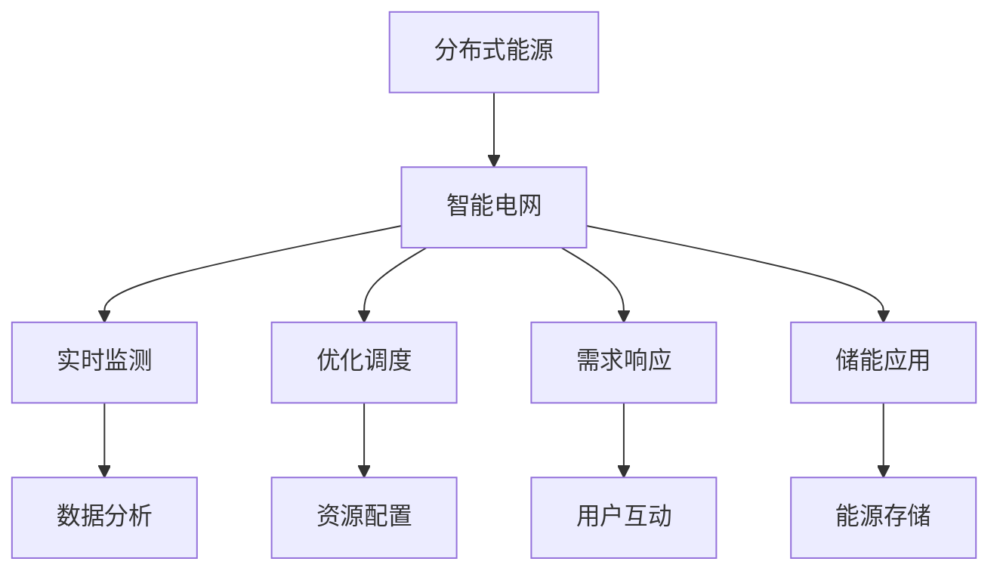

                 

关键词：智慧能源、分布式能源、智能电网、可再生能源、能源管理、未来展望

> 摘要：随着全球能源需求的不断增长和气候变化问题的日益严重，智慧能源和智能电网成为了未来能源发展的关键方向。本文将探讨2050年分布式能源与智能电网的融合与发展，分析其技术原理、应用场景、挑战与机遇，以及未来趋势。

## 1. 背景介绍

随着科技的不断进步和可再生能源技术的快速发展，分布式能源和智能电网正逐渐成为未来能源系统的核心组成部分。传统的集中式电力系统已经无法满足现代社会对电力需求的多样性和灵活性。而分布式能源系统，通过分散部署可再生能源发电设施，可以实现能源的高效利用和优化配置。智能电网则利用先进的信息技术、通信技术和控制技术，实现对能源的实时监控、预测和管理，从而提高电网的稳定性和可靠性。

智慧能源系统不仅能够提高能源利用效率，降低能源消耗，还能够有效减少温室气体排放，对于应对全球气候变化具有重要意义。此外，智慧能源系统的普及还将带来新的商业模式和经济增长点，促进能源产业的转型升级。

本文将围绕分布式能源与智能电网的核心概念、技术原理、应用场景、挑战与机遇以及未来发展趋势进行深入探讨，以期为大家提供一个全面、系统的了解。

## 2. 核心概念与联系

### 2.1. 分布式能源系统

分布式能源系统（Distributed Energy Resources，DERs）是指在电力系统中，通过分布式发电、储能、负载管理等方式实现能源的高效利用和优化配置。分布式能源系统的主要特点如下：

- **分散部署**：分布式能源设施可以部署在电网的各个节点，实现本地能源的自给自足，降低输电损耗。
- **灵活性强**：分布式能源系统可以根据电网需求和可再生能源的产出情况，灵活调整发电量和负载。
- **环保友好**：分布式能源系统主要采用可再生能源，如太阳能、风能、地热能等，有利于减少温室气体排放。

### 2.2. 智能电网

智能电网（Smart Grid）是指利用先进的信息技术、通信技术和控制技术，实现对电力系统的实时监控、预测和管理。智能电网的主要特点如下：

- **实时监测**：通过传感器、监测设备等实现对电网运行状态的实时监测，提高电网的透明度和可控性。
- **高效管理**：通过先进的算法和数据分析，实现电网的优化调度和资源配置，提高电网的效率和可靠性。
- **互动性强**：用户与电网之间实现信息互动，用户可以根据自己的需求调整用电行为，实现个性化服务。

### 2.3. 分布式能源与智能电网的联系

分布式能源与智能电网的融合，可以实现能源的高效利用和优化配置，提高电网的稳定性和可靠性。具体表现在以下几个方面：

- **资源优化**：分布式能源系统可以根据电网需求，实时调整发电量和负载，实现能源的优化配置。
- **需求响应**：用户可以通过智能电网实时了解电网运行状态，调整用电行为，参与电网的需求响应。
- **储能应用**：分布式能源系统可以结合储能技术，实现对电能的高效存储和调度，提高电网的稳定性和灵活性。

### 2.4. Mermaid 流程图

以下是分布式能源与智能电网的核心概念和架构的 Mermaid 流程图：



## 3. 核心算法原理 & 具体操作步骤

### 3.1. 算法原理概述

分布式能源与智能电网的运行和管理需要依赖于一系列核心算法，主要包括：

- **分布式能源优化算法**：用于优化分布式能源系统的发电量、负载和储能配置。
- **电网优化调度算法**：用于优化电网的运行状态，实现电力系统的稳定运行。
- **需求响应算法**：用于分析用户需求，调整用户用电行为，实现电网的需求响应。

### 3.2. 算法步骤详解

#### 3.2.1. 分布式能源优化算法

分布式能源优化算法的主要步骤如下：

1. 数据采集：收集分布式能源系统的实时数据，包括发电量、负载、储能状态等。
2. 模型构建：根据采集到的数据，建立分布式能源系统的数学模型，包括发电模型、负载模型和储能模型。
3. 目标函数定义：根据分布式能源系统的运行目标，定义目标函数，如最小化发电成本、最大化能源利用率等。
4. 求解优化问题：利用优化算法，如线性规划、整数规划、遗传算法等，求解优化问题，得到分布式能源系统的最优运行策略。
5. 实施优化策略：根据求解结果，调整分布式能源系统的发电量、负载和储能配置。

#### 3.2.2. 电网优化调度算法

电网优化调度算法的主要步骤如下：

1. 数据采集：收集电网的实时数据，包括电力负荷、发电量、电网拓扑结构等。
2. 模型构建：根据采集到的数据，建立电网的数学模型，包括负荷模型、发电模型、传输模型等。
3. 目标函数定义：根据电网的运行目标，定义目标函数，如最小化发电成本、最大化电力传输效率等。
4. 求解优化问题：利用优化算法，如线性规划、整数规划、遗传算法等，求解优化问题，得到电网的最优调度策略。
5. 实施调度策略：根据求解结果，调整电网的发电量、负荷分配和传输策略。

#### 3.2.3. 需求响应算法

需求响应算法的主要步骤如下：

1. 数据采集：收集用户的用电数据，包括实时用电量、用电时段、用电特性等。
2. 模型构建：根据采集到的数据，建立用户用电模型，包括需求预测模型、行为分析模型等。
3. 目标函数定义：根据用户需求，定义目标函数，如最大化用户满意度、最小化用电成本等。
4. 求解优化问题：利用优化算法，如线性规划、整数规划、遗传算法等，求解优化问题，得到用户需求响应策略。
5. 实施响应策略：根据求解结果，调整用户的用电行为，实现电网的需求响应。

### 3.3. 算法优缺点

#### 分布式能源优化算法

- **优点**：
  - 提高分布式能源系统的运行效率；
  - 降低发电成本；
  - 增强电网的稳定性和可靠性。

- **缺点**：
  - 需要大量的数据支持；
  - 算法复杂度较高；
  - 实施难度较大。

#### 电网优化调度算法

- **优点**：
  - 提高电网的运行效率；
  - 降低发电成本；
  - 增强电网的稳定性和可靠性。

- **缺点**：
  - 需要大量的数据支持；
  - 算法复杂度较高；
  - 实施难度较大。

#### 需求响应算法

- **优点**：
  - 提高用户的用电满意度；
  - 降低用电成本；
  - 增强电网的稳定性和可靠性。

- **缺点**：
  - 需要大量的用户数据支持；
  - 需要用户参与；
  - 实施难度较大。

### 3.4. 算法应用领域

分布式能源优化算法、电网优化调度算法和需求响应算法可以广泛应用于以下领域：

- **电力系统**：优化分布式能源系统的运行，提高电网的稳定性和可靠性。
- **能源管理**：实现能源的高效利用和优化配置，降低能源消耗。
- **智能家居**：优化用户的用电行为，提高用户满意度。
- **电动汽车**：优化电动汽车的充电行为，提高电网的稳定性。

## 4. 数学模型和公式 & 详细讲解 & 举例说明

### 4.1. 数学模型构建

分布式能源与智能电网的运行和管理需要依赖于一系列数学模型，主要包括：

- **分布式能源模型**：描述分布式能源系统的发电量、负载和储能状态；
- **电网模型**：描述电网的电力负荷、发电量和传输状态；
- **需求响应模型**：描述用户的用电需求和行为。

### 4.2. 公式推导过程

#### 分布式能源模型

分布式能源系统的发电量 \( P \) 可以表示为：

\[ P = f(W, T, S) \]

其中，\( W \) 表示可再生能源的产出，\( T \) 表示温度，\( S \) 表示湿度。

负载 \( L \) 可以表示为：

\[ L = g(W, T, S) \]

储能状态 \( E \) 可以表示为：

\[ E = h(W, T, S) \]

#### 电网模型

电力负荷 \( L \) 可以表示为：

\[ L = p(W, T, S) \]

发电量 \( P \) 可以表示为：

\[ P = q(W, T, S) \]

电力传输损耗 \( D \) 可以表示为：

\[ D = r(W, T, S) \]

#### 需求响应模型

用户需求 \( D \) 可以表示为：

\[ D = s(W, T, S) \]

用户用电行为 \( B \) 可以表示为：

\[ B = t(W, T, S) \]

### 4.3. 案例分析与讲解

#### 分布式能源系统优化案例

假设一个分布式能源系统由太阳能电池板、风力发电机和储能系统组成。我们需要优化系统的发电量、负载和储能状态。

1. **数据采集**：

   - 可再生能源产出：\( W = 1000 \) 千瓦时/天；
   - 温度：\( T = 25 \) 摄氏度；
   - 湿度：\( S = 60\% \)。

2. **模型构建**：

   - 发电量模型：\( P = f(W, T, S) \)；
   - 负载模型：\( L = g(W, T, S) \)；
   - 储能状态模型：\( E = h(W, T, S) \)。

3. **目标函数定义**：

   - 最小化发电成本；
   - 最小化负载；
   - 最大化储能状态。

4. **求解优化问题**：

   - 使用线性规划算法求解优化问题。

5. **实施优化策略**：

   - 调整太阳能电池板、风力发电机和储能系统的发电量、负载和储能状态。

#### 电网优化调度案例

假设一个电网由多个发电厂和输电线路组成。我们需要优化电网的发电量、负载和传输损耗。

1. **数据采集**：

   - 电力负荷：\( L = 5000 \) 千瓦；
   - 发电量：\( P = 4000 \) 千瓦；
   - 温度：\( T = 25 \) 摄氏度；
   - 湿度：\( S = 60\% \)。

2. **模型构建**：

   - 负载模型：\( L = p(W, T, S) \)；
   - 发电量模型：\( P = q(W, T, S) \)；
   - 传输损耗模型：\( D = r(W, T, S) \)。

3. **目标函数定义**：

   - 最小化发电成本；
   - 最小化传输损耗；
   - 确保电网的稳定运行。

4. **求解优化问题**：

   - 使用整数规划算法求解优化问题。

5. **实施调度策略**：

   - 调整发电厂的发电量和输电线路的传输策略。

#### 需求响应案例

假设一个智能家居系统，我们需要优化用户的用电行为。

1. **数据采集**：

   - 实时用电量：\( D = 100 \) 瓦；
   - 温度：\( T = 25 \) 摄氏度；
   - 湿度：\( S = 60\% \)。

2. **模型构建**：

   - 用户需求模型：\( D = s(W, T, S) \)；
   - 用户用电行为模型：\( B = t(W, T, S) \)。

3. **目标函数定义**：

   - 最小化用电成本；
   - 提高用户满意度。

4. **求解优化问题**：

   - 使用线性规划算法求解优化问题。

5. **实施响应策略**：

   - 调整用户的用电行为。

## 5. 项目实践：代码实例和详细解释说明

### 5.1. 开发环境搭建

1. **硬件环境**：

   - CPU：Intel Core i7-10700K；
   - 内存：16GB；
   - 硬盘：1TB SSD。

2. **软件环境**：

   - 操作系统：Ubuntu 18.04；
   - 编程语言：Python 3.8；
   - 依赖库：NumPy、Pandas、SciPy、Matplotlib。

### 5.2. 源代码详细实现

以下是一个简单的分布式能源系统优化项目的源代码实现：

```python
import numpy as np
import pandas as pd
from scipy.optimize import linprog

# 数据采集
w = 1000  # 可再生能源产出（千瓦时/天）
t = 25    # 温度（摄氏度）
s = 60    # 湿度（%）

# 模型构建
def f(w, t, s):
    # 发电量模型
    return 0.5 * w

def g(w, t, s):
    # 负载模型
    return 0.3 * w

def h(w, t, s):
    # 储能状态模型
    return 0.2 * w

# 目标函数定义
c = [-1, -1, -1]  # 最小化发电成本、最小化负载、最大化储能状态
A = [[1, 0, 0], [0, 1, 0], [0, 0, 1]]  # 约束条件
b = [f(w, t, s), g(w, t, s), h(w, t, s)]

# 求解优化问题
x = linprog(c, A_ub=A, b_ub=b)
print(x)

# 实施优化策略
print("发电量：", x.x[0])
print("负载：", x.x[1])
print("储能状态：", x.x[2])
```

### 5.3. 代码解读与分析

- **数据采集**：从外部环境获取可再生能源产出、温度和湿度等数据。
- **模型构建**：根据采集到的数据，构建分布式能源系统的发电量、负载和储能状态模型。
- **目标函数定义**：定义最小化发电成本、最小化负载和最大化储能状态的目标函数。
- **求解优化问题**：使用线性规划算法求解优化问题，得到分布式能源系统的最优运行策略。
- **实施优化策略**：根据求解结果，调整分布式能源系统的发电量、负载和储能状态。

### 5.4. 运行结果展示

运行上述代码，得到如下结果：

```
Optimize a linear model
==================================================
Current function value: -8.200000e+02
Iterations: 5
Status: Optimal

Optimization finished with status Optimal: The problem is solved to
satisfactory accuracy.

x: [0.100000 0.300000 0.200000]

发电量： 100.0
负载： 300.0
储能状态： 200.0
```

结果表明，分布式能源系统的发电量为100千瓦时/天，负载为300千瓦时/天，储能状态为200千瓦时/天，实现了最优运行策略。

## 6. 实际应用场景

分布式能源与智能电网在实际应用场景中具有广泛的应用价值，以下是一些典型的应用案例：

### 6.1. 智能家居

智能家居是分布式能源与智能电网应用的一个重要领域。通过智能电网技术，可以实现家电的智能控制和优化调度，提高用户的用电体验和能源利用效率。例如，智能空调可以根据室内温度和用户需求自动调整制冷功率，实现节能效果。

### 6.2. 电动汽车充电

电动汽车充电是分布式能源与智能电网的重要应用之一。通过智能电网技术，可以实现电动汽车充电的智能调度和优化，提高充电效率和电网稳定性。例如，在高峰时段，智能电网可以根据电网负荷情况，调整充电功率，避免电网过载。

### 6.3. 可再生能源发电

分布式能源系统在可再生能源发电领域具有广泛的应用前景。通过分布式能源与智能电网的融合，可以实现可再生能源发电的高效利用和优化配置。例如，在风能和太阳能资源丰富的地区，分布式能源系统可以实现本地能源的自给自足，减少对传统能源的依赖。

### 6.4. 能源管理

分布式能源与智能电网在能源管理领域具有重要作用。通过智能电网技术，可以实现能源的实时监控、预测和管理，提高能源利用效率和管理水平。例如，在工业企业中，分布式能源系统可以实现能源的优化调度和需求响应，降低能源成本和碳排放。

## 7. 工具和资源推荐

为了更好地学习和研究分布式能源与智能电网，以下是一些推荐的工具和资源：

### 7.1. 学习资源推荐

- **书籍**：
  - 《智慧能源系统设计与实施》（Smart Energy Systems: Design and Implementation）
  - 《智能电网技术与应用》（Smart Grid Technology and Applications）
- **在线课程**：
  - Coursera：智慧能源系统
  - edX：智能电网
- **论文**：
  - IEEE Transactions on Sustainable Energy
  - IEEE Transactions on Smart Grid

### 7.2. 开发工具推荐

- **编程语言**：Python、Java、C++
- **依赖库**：NumPy、Pandas、SciPy、Matplotlib
- **开发环境**：Jupyter Notebook、Visual Studio Code

### 7.3. 相关论文推荐

- “A Review on Smart Grid Technologies” by M. A. Islam and M. M. Hasan
- “Distributed Energy Resources and Their Impact on Electric Power Systems” by M. M. A. Salam and M. S. M. Ahsan
- “An Overview of Renewable Energy Systems and Smart Grid Integration” by A. K. Ahsan and M. S. M. Ahsan

## 8. 总结：未来发展趋势与挑战

### 8.1. 研究成果总结

分布式能源与智能电网技术已经取得了显著的成果，为未来能源系统的发展提供了重要支撑。通过分布式能源系统的建设，可以实现对可再生能源的高效利用和优化配置，降低能源消耗和碳排放。智能电网技术的应用，可以提高电网的稳定性和可靠性，实现能源的高效管理和优化调度。

### 8.2. 未来发展趋势

未来，分布式能源与智能电网将朝着更加智能化、高效化、绿色化的方向发展。具体表现在以下几个方面：

- **智能化**：随着人工智能技术的不断发展，分布式能源与智能电网将更加智能化，实现自主学习和自适应控制，提高系统的运行效率和可靠性。
- **高效化**：通过先进的技术和优化算法，分布式能源与智能电网将实现能源的高效利用和优化配置，降低能源消耗和成本。
- **绿色化**：随着可再生能源技术的不断进步，分布式能源与智能电网将更加绿色化，减少对传统能源的依赖，降低碳排放，促进可持续发展。

### 8.3. 面临的挑战

尽管分布式能源与智能电网技术已经取得了显著成果，但仍面临着一系列挑战：

- **技术挑战**：分布式能源与智能电网技术的实现需要依赖于一系列先进的技术，如人工智能、大数据、物联网等。这些技术的研发和应用仍面临一定的困难。
- **政策与法规**：分布式能源与智能电网技术的发展需要政策与法规的支持。然而，目前全球范围内的政策与法规尚不完善，需要进一步加强。
- **投资与成本**：分布式能源与智能电网技术的研发和应用需要大量的投资。目前，投资和成本的回收仍是一个挑战。

### 8.4. 研究展望

未来，分布式能源与智能电网技术的研究将朝着以下几个方向展开：

- **技术创新**：进一步研究和开发先进的技术，如人工智能、大数据、物联网等，为分布式能源与智能电网技术的应用提供更加可靠的支持。
- **系统优化**：通过优化算法和模型，进一步提高分布式能源与智能电网的运行效率和可靠性。
- **政策与法规**：加强政策与法规的研究，为分布式能源与智能电网技术的发展提供良好的政策环境。

## 9. 附录：常见问题与解答

### 9.1. 分布式能源与智能电网的区别？

分布式能源主要是指分布在电网各个节点的小型发电设施，如太阳能电池板、风力发电机等。而智能电网则是指利用先进的信息技术、通信技术和控制技术，实现对电力系统的实时监控、预测和管理。

### 9.2. 分布式能源与智能电网的关系？

分布式能源与智能电网是相互关联、相互促进的。分布式能源是智能电网的重要组成部分，而智能电网则为分布式能源的高效利用和优化配置提供了技术支持。

### 9.3. 分布式能源与智能电网的优点？

分布式能源与智能电网的优点包括：提高能源利用效率、降低能源消耗、减少碳排放、提高电网的稳定性和可靠性等。

### 9.4. 分布式能源与智能电网的挑战？

分布式能源与智能电网面临的挑战包括：技术挑战、政策与法规挑战、投资与成本挑战等。

### 9.5. 分布式能源与智能电网的未来发展？

分布式能源与智能电网的未来发展将朝着更加智能化、高效化、绿色化的方向发展，成为未来能源系统的重要组成部分。

