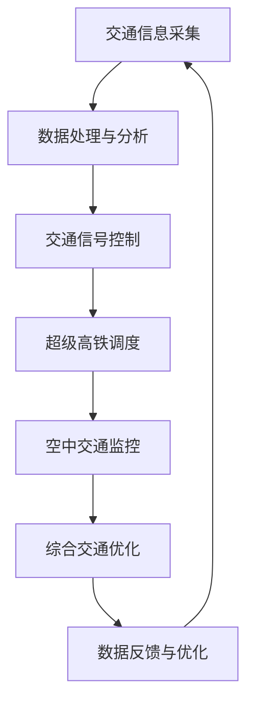

                 

关键词：智能交通、超级高铁、空中交通管制、未来发展趋势、算法原理、数学模型、实际应用、开发工具、研究展望

> 摘要：随着科技的飞速发展，智能交通系统正逐渐成为未来城市交通的解决方案。本文将探讨到2050年，超级高铁网与空中交通管制的融合，为全球交通带来革命性的变化。通过对核心概念、算法原理、数学模型的详细讲解，以及项目实践和未来展望，本文将为您揭示智能交通的未来蓝图。

## 1. 背景介绍

当前，全球交通系统面临着诸多挑战，包括交通拥堵、环境污染、能源消耗等。传统的交通管理模式已经无法满足日益增长的城市交通需求。随着物联网、人工智能、大数据等技术的不断发展，智能交通系统应运而生。智能交通系统旨在通过实时数据分析和智能算法，优化交通流，减少拥堵，提高交通效率，从而实现可持续交通发展。

### 1.1 智能交通系统的定义

智能交通系统（Intelligent Transportation System，ITS）是指利用先进的通信技术、信息技术、传感器技术、控制技术等，对交通运输系统进行实时监控、管理和控制，以提高交通效率、减少交通事故和环境污染的系统。

### 1.2 智能交通系统的组成部分

智能交通系统通常由以下几个部分组成：

- **交通信息采集与处理**：通过传感器、摄像头、无人机等设备收集交通数据，并对数据进行处理和分析。

- **交通管理控制系统**：基于收集到的交通数据，通过智能算法进行交通信号控制、路线规划等，以优化交通流。

- **通信系统**：实现交通信息在车辆、交通设施和交通管理部门之间的实时传递。

- **车辆控制系统**：通过车载系统对车辆进行实时监控和智能控制，提高车辆运行效率。

## 2. 核心概念与联系

### 2.1 超级高铁

超级高铁（Hyperloop）是一种高速地面交通系统，通过真空管道和磁悬浮技术实现高速运行。超级高铁具有高速度、低能耗、低噪音、安全可靠等优点，是未来智能交通系统的重要组成部分。

### 2.2 空中交通管制

空中交通管制（Air Traffic Control，ATC）是指通过地面空管系统对航空器进行实时监控和管理，以确保空中交通的安全和高效。随着无人机和垂直起降飞行器的普及，空中交通管制系统也需要不断升级和优化。

### 2.3 Mermaid 流程图

以下是一个简化的超级高铁与空中交通管制融合的流程图：



## 3. 核心算法原理 & 具体操作步骤

### 3.1 算法原理概述

智能交通系统的核心算法主要包括：

- **交通流量预测算法**：通过历史数据和实时数据，预测未来某一时间段内的交通流量。

- **路线规划算法**：根据交通流量预测结果，为驾驶者或乘客提供最优路线。

- **信号控制算法**：根据交通流量和道路状况，实时调整交通信号，优化交通流。

### 3.2 算法步骤详解

以下是一个简化的算法步骤：

1. **数据采集**：通过传感器、摄像头等设备采集交通数据。

2. **数据处理**：对采集到的数据进行分析和处理，提取交通流量、速度、拥堵等信息。

3. **交通流量预测**：利用机器学习算法，对历史数据进行训练，预测未来某一时间段内的交通流量。

4. **路线规划**：根据交通流量预测结果，为驾驶者或乘客提供最优路线。

5. **信号控制**：根据实时交通数据和预测结果，实时调整交通信号。

6. **数据反馈**：将调整后的交通信号和交通状况反馈给交通管理系统，进行进一步优化。

### 3.3 算法优缺点

- **优点**：能够有效降低交通拥堵，提高交通效率。

- **缺点**：算法复杂度高，对数据质量和处理能力要求较高。

### 3.4 算法应用领域

智能交通算法广泛应用于城市交通管理、高速公路管理、公共交通调度等领域。

## 4. 数学模型和公式 & 详细讲解 & 举例说明

### 4.1 数学模型构建

智能交通系统的数学模型主要包括：

- **交通流量模型**：描述道路上的车辆数量与时间的关系。

- **交通速度模型**：描述车辆在道路上的速度与时间的关系。

- **交通拥堵模型**：描述交通拥堵程度与交通流量、速度的关系。

### 4.2 公式推导过程

以下是一个简化的交通流量模型的推导过程：

$$
Q(t) = Q_0 + \alpha \cdot f(t)
$$

其中，$Q(t)$ 表示时间 $t$ 时的交通流量，$Q_0$ 表示基准交通流量，$\alpha$ 表示交通流量的变化率，$f(t)$ 表示影响交通流量的因素。

### 4.3 案例分析与讲解

以下是一个城市交通流量的实际案例：

- **基准交通流量**：每小时 1000 辆。

- **交通流量变化率**：每小时增加 50 辆。

- **影响交通流量的因素**：工作日和周末。

根据上述公式，可以计算出不同时间段内的交通流量：

- **工作日早上高峰**：$Q(t) = 1000 + 50 \cdot t$，其中 $t$ 表示小时数。

- **工作日下午高峰**：$Q(t) = 1000 + 50 \cdot t$，其中 $t$ 表示小时数。

- **周末**：$Q(t) = 1000 + 50 \cdot (2 - t)$，其中 $t$ 表示小时数。

## 5. 项目实践：代码实例和详细解释说明

### 5.1 开发环境搭建

本文使用 Python 作为开发语言，需要安装以下库：

- NumPy：用于数学计算。

- Pandas：用于数据处理。

- Matplotlib：用于数据可视化。

### 5.2 源代码详细实现

以下是一个简单的交通流量预测的 Python 代码示例：

```python
import numpy as np
import pandas as pd
import matplotlib.pyplot as plt

# 数据预处理
def preprocess_data(data):
    # 处理缺失值
    data.fillna(method='ffill', inplace=True)
    # 处理时间格式
    data['time'] = pd.to_datetime(data['time'])
    data['hour'] = data['time'].dt.hour
    return data

# 交通流量预测
def traffic_prediction(data, alpha):
    data['traffic'] = data['flow'] + alpha * data['hour']
    return data

# 数据可视化
def plot_traffic(data):
    plt.figure(figsize=(10, 5))
    plt.plot(data['time'], data['traffic'])
    plt.xlabel('Time')
    plt.ylabel('Traffic Flow')
    plt.title('Traffic Flow Prediction')
    plt.show()

# 主函数
def main():
    # 加载数据
    data = pd.read_csv('traffic_data.csv')
    # 预处理数据
    data = preprocess_data(data)
    # 交通流量预测
    alpha = 50
    data = traffic_prediction(data, alpha)
    # 数据可视化
    plot_traffic(data)

# 运行主函数
if __name__ == '__main__':
    main()
```

### 5.3 代码解读与分析

- **数据预处理**：处理缺失值，将时间格式转换为小时数。

- **交通流量预测**：根据交通流量模型，预测未来某一时间段内的交通流量。

- **数据可视化**：将预测结果以图表形式展示。

### 5.4 运行结果展示

运行上述代码，可以生成一个交通流量预测的折线图，展示不同时间段内的交通流量变化。

## 6. 实际应用场景

智能交通系统在实际应用中具有广泛的应用场景：

- **城市交通管理**：通过实时监控和智能算法，优化城市交通流，减少拥堵。

- **高速公路管理**：实现车辆智能调度，提高高速公路通行效率。

- **公共交通调度**：根据实时交通状况，优化公交路线和班次，提高公共交通服务。

- **物流配送**：通过智能算法，优化物流配送路线，提高配送效率。

## 7. 未来应用展望

随着科技的不断发展，智能交通系统将在未来发挥更大的作用：

- **超级高铁网**：超级高铁网的普及将大大缩短城市之间的交通时间，提高交通效率。

- **空中交通管制**：随着无人机和垂直起降飞行器的普及，空中交通管制系统将更加智能化。

- **自动驾驶**：自动驾驶技术的成熟将使智能交通系统更加普及和高效。

## 8. 工具和资源推荐

### 8.1 学习资源推荐

- **《智能交通系统：概念、技术与应用》**：一本全面介绍智能交通系统的经典教材。

- **《人工智能交通系统设计》**：一本深入探讨人工智能在交通系统中的应用的书籍。

### 8.2 开发工具推荐

- **NumPy**：用于数学计算的库。

- **Pandas**：用于数据处理的库。

- **Matplotlib**：用于数据可视化的库。

### 8.3 相关论文推荐

- **"Intelligent Transportation Systems: A Survey"**：一篇全面回顾智能交通系统发展的综述论文。

- **"A Review of Hyperloop Technology"**：一篇关于超级高铁技术的综述论文。

## 9. 总结：未来发展趋势与挑战

智能交通系统作为未来交通发展的关键，将面临以下发展趋势和挑战：

### 9.1 发展趋势

- **技术进步**：物联网、人工智能、大数据等技术的快速发展，将推动智能交通系统的不断优化。

- **政策支持**：各国政府加大对智能交通系统的支持力度，推动其普及和发展。

- **市场需求**：随着城市化进程的加快，对高效、智能的交通系统的需求日益增加。

### 9.2 面临的挑战

- **数据隐私和安全**：智能交通系统需要处理大量个人隐私数据，如何保护数据安全和隐私成为一大挑战。

- **技术标准化**：不同系统和设备之间的兼容性问题，需要建立统一的技术标准。

- **人才缺乏**：智能交通系统的发展需要大量专业人才，但目前人才供给不足。

### 9.3 研究展望

未来，智能交通系统的发展将朝着更高效、更智能、更安全的方向迈进。研究人员应关注以下几个方面：

- **跨学科研究**：结合计算机科学、交通运输工程、城市规划等多学科知识，推动智能交通系统的发展。

- **技术创新**：不断探索新的算法和模型，提高智能交通系统的性能。

- **实际应用**：加强与行业和政府的合作，推动智能交通系统的实际应用。

## 10. 附录：常见问题与解答

### 10.1 智能交通系统是什么？

智能交通系统是指利用先进的通信技术、信息技术、传感器技术、控制技术等，对交通运输系统进行实时监控、管理和控制，以提高交通效率、减少交通事故和环境污染的系统。

### 10.2 超级高铁有哪些优点？

超级高铁具有高速度、低能耗、低噪音、安全可靠等优点，是未来智能交通系统的重要组成部分。

### 10.3 如何保护智能交通系统的数据安全和隐私？

为保护智能交通系统的数据安全和隐私，应采取以下措施：

- **加密传输**：对传输的数据进行加密，防止数据泄露。

- **访问控制**：设置访问权限，限制对数据的非法访问。

- **隐私保护**：对个人隐私数据进行去标识化处理，防止个人信息泄露。

作者：禅与计算机程序设计艺术 / Zen and the Art of Computer Programming
```

