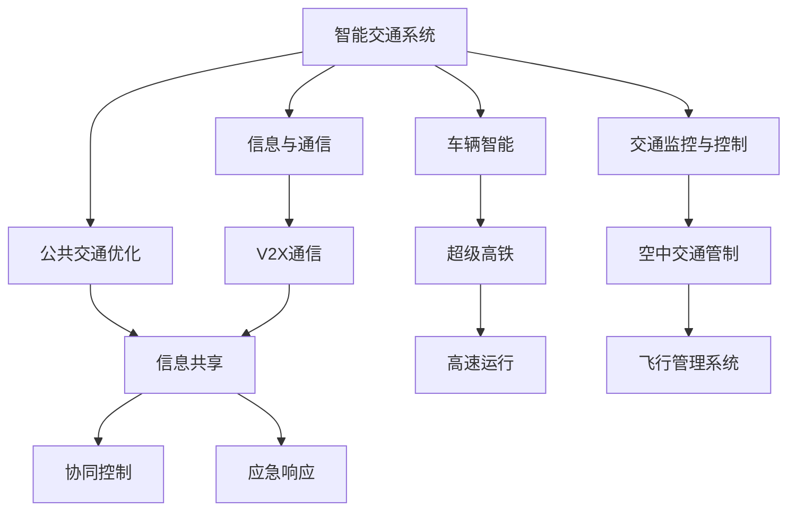
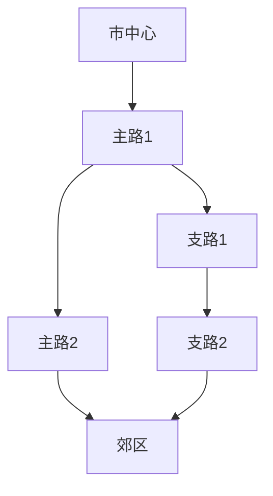

                 

### 关键词 Keywords ###
- 智能交通
- 超级高铁
- 空中交通管制
- 2050年
- 交通基础设施
- 人工智能

<|assistant|>### 摘要 Abstract ###
本文深入探讨2050年智能交通的未来图景，重点关注超级高铁网和空中交通管制的创新与发展。通过分析当前技术趋势、核心概念、算法原理、数学模型以及实际应用场景，本文旨在为读者展现一个高效、安全、智能化的未来交通系统，并探讨其潜在的社会、经济和环境影响。文章最后对未来的研究趋势与挑战进行了展望，为相关领域的进一步发展提供了思路。

## 1. 背景介绍 Background

智能交通系统（Intelligent Transportation Systems，ITS）是近年来交通领域的重要发展方向。随着城市化进程的加速和人口的不断增长，传统的交通基础设施已无法满足日益增长的交通需求。智能交通系统通过集成先进的信息技术、数据通信传输技术、电子传感技术、控制技术以及计算机技术，实现了对交通系统的实时监控、动态管理和智能化控制，旨在提升交通效率、减少交通拥堵、降低环境污染、提升交通安全。

超级高铁（Hyperloop）是一种新型高速交通系统，其基本理念是利用低压力管道和磁悬浮技术，使列车在近乎真空的环境中高速运行。这种交通模式具有高速、低能耗、低噪音、高安全性和高可靠性等优点，被认为是未来高速交通的理想选择。

空中交通管制（Air Traffic Control，ATC）是确保空中交通安全、高效运行的关键系统。随着航空业的快速发展，空中交通管制面临着越来越多的挑战，如航班密度增加、飞行器性能提升、天气条件复杂等。现代空中交通管制系统通过高度自动化的飞行管理系统（Flight Management System，FMS）和通信、导航、监视（Communication, Navigation, Surveillance/Air Traffic Management，CNS/ATM）技术，实现了对飞行器的精确监控和高效管理。

本文旨在探讨2050年智能交通系统的未来发展，特别是在超级高铁网和空中交通管制领域的创新与应用，为未来交通系统的设计与实施提供参考。

## 2. 核心概念与联系 Core Concepts and Connections

在讨论2050年智能交通系统的核心概念之前，有必要先明确几个关键术语和它们之间的联系。

### 智能交通系统（ITS） Intelligent Transportation Systems

智能交通系统是集成多种技术的综合性系统，主要包括以下几个方面：

- **车辆智能**：通过传感器、控制系统和通信技术，实现车辆的自我感知、智能驾驶和协同管理。
- **交通监控与控制**：利用各种传感器和监控系统，实时获取交通流量、速度、密度等信息，并采用先进算法进行交通控制和管理。
- **信息与通信**：通过V2X（Vehicle-to-Everything）通信技术，实现车与车、车与基础设施、车与行人之间的信息交换和协同。
- **公共交通优化**：通过数据分析和管理，优化公共交通系统的调度、路线规划和乘客流量管理。

### 超级高铁（Hyperloop） Hyperloop

超级高铁是一种采用真空管道和磁悬浮技术的超高速地面交通系统。其主要特点如下：

- **高速**：超级高铁的设计速度可达1000公里/小时以上，是传统高铁的数倍。
- **低能耗**：由于运行在近乎真空的环境中，空气阻力极小，使得超级高铁具有极高的能效。
- **高安全性和可靠性**：磁悬浮技术使列车与轨道之间无机械接触，减少了故障风险。
- **灵活**：超级高铁可以设计为直线或曲线，适应不同地形和需求。

### 空中交通管制（ATC） Air Traffic Control

空中交通管制是确保空中交通安全、高效运行的关键系统。其主要组成部分如下：

- **飞行管理系统（FMS）**：包括导航、通信和监视系统，实现飞行器的精确控制和实时监控。
- **自动化终端区管理（ATM）**：利用自动化和大数据分析，优化航班的起降和飞行路径，提高空中交通效率。
- **安全监控系统**：通过传感器、雷达和通信技术，监控飞行器状态和空域环境，确保飞行安全。

### 联系与协同

超级高铁和空中交通管制虽然分别针对地面和空中交通，但它们之间有着紧密的联系和协同需求。具体体现在以下几个方面：

- **信息共享**：智能交通系统可以通过V2X通信技术，实现超级高铁和空中交通管制系统之间的信息共享，提高整体交通系统的协调性。
- **协同控制**：通过大数据分析和实时监控，实现超级高铁和空中交通管制的协同控制，优化整体交通流量和效率。
- **应急响应**：在发生突发事件时，智能交通系统可以协调地面和空中的交通资源，共同应对，提高应急响应能力。

### Mermaid 流程图

以下是一个简化的Mermaid流程图，展示了智能交通系统、超级高铁和空中交通管制之间的核心概念和联系。



## 3. 核心算法原理 & 具体操作步骤 Core Algorithm Principles & Operational Steps

### 3.1 算法原理概述

智能交通系统、超级高铁和空中交通管制的发展离不开一系列核心算法的支持。这些算法主要包括：

- **路径规划算法**：用于确定车辆、列车和飞行器的最优行驶路径。
- **流量控制算法**：用于实时调整交通流量，优化交通网络性能。
- **数据融合算法**：用于整合来自不同传感器和通信系统的数据，提高数据的准确性和可靠性。
- **决策支持算法**：用于在复杂情况下，提供决策支持和优化建议。

### 3.2 算法步骤详解

以下是这些算法的基本操作步骤：

#### 3.2.1 路径规划算法

1. **数据采集**：收集交通网络中的各种数据，包括交通流量、速度、路况等信息。
2. **目标函数定义**：根据交通需求，定义目标函数，如路径最短、时间最短或能耗最低等。
3. **约束条件设置**：设置交通网络的约束条件，如道路宽度、交通信号灯限制等。
4. **路径搜索**：使用启发式算法或最优化算法，搜索满足约束条件的最优路径。
5. **路径评估**：评估搜索到的路径，选择最优路径。

#### 3.2.2 流量控制算法

1. **状态监测**：实时监测交通网络中的状态，包括交通流量、速度、密度等。
2. **流量预测**：使用历史数据和机器学习算法，预测未来的交通流量变化。
3. **策略制定**：根据交通状态和流量预测结果，制定流量控制策略。
4. **策略实施**：通过交通信号灯、可变信息标志等手段，实施流量控制策略。
5. **效果评估**：评估流量控制策略的效果，进行调整和优化。

#### 3.2.3 数据融合算法

1. **数据收集**：从不同的传感器和通信系统收集数据。
2. **数据预处理**：对收集到的数据进行清洗、归一化和特征提取。
3. **数据融合**：使用数据融合算法，如卡尔曼滤波、贝叶斯滤波等，整合多源数据。
4. **数据评估**：评估融合后的数据质量，确保数据的准确性和可靠性。

#### 3.2.4 决策支持算法

1. **问题定义**：明确需要解决的问题和目标。
2. **数据收集**：收集与问题相关的各种数据。
3. **模型构建**：构建数学模型，描述问题情境和目标函数。
4. **算法选择**：选择适合的算法，如线性规划、遗传算法、神经网络等。
5. **决策生成**：根据模型和算法，生成决策支持和优化建议。

### 3.3 算法优缺点

#### 路径规划算法

**优点**：

- **高效**：能够快速找到最优路径，提高交通效率。
- **灵活**：可以根据不同的需求和约束条件，灵活调整路径。

**缺点**：

- **计算复杂度**：尤其在大型交通网络中，计算复杂度较高。
- **实时性**：在高动态交通环境中，实时性可能受到影响。

#### 流量控制算法

**优点**：

- **优化**：能够根据实时交通状态，优化交通流量，减少拥堵。
- **适应性**：可以根据交通网络的变化，自适应调整流量控制策略。

**缺点**：

- **复杂度**：涉及多种算法和策略，系统复杂度较高。
- **适应性**：在极端情况下，可能无法完全适应变化。

#### 数据融合算法

**优点**：

- **准确性**：通过融合多源数据，提高数据的准确性和可靠性。
- **完整性**：确保数据的不丢失和完整性。

**缺点**：

- **延迟**：数据融合过程可能引入一定的延迟。
- **误差**：在某些情况下，融合算法可能引入误差。

#### 决策支持算法

**优点**：

- **智能化**：能够根据数据和模型，提供智能化决策支持。
- **灵活性**：可以根据不同问题和需求，灵活调整模型和算法。

**缺点**：

- **依赖性**：对数据质量和模型准确性的依赖较强。
- **解释性**：在一些情况下，决策结果可能难以解释。

### 3.4 算法应用领域

#### 路径规划算法

- **智能交通系统**：用于车辆导航和公共交通调度。
- **物流管理**：用于货运车辆的路径规划和配送优化。
- **智能城市建设**：用于城市交通网络的优化和规划。

#### 流量控制算法

- **智能交通系统**：用于交通信号控制和拥堵管理。
- **高速公路**：用于高速公路的流量控制和安全监控。
- **公共交通**：用于公共交通系统的调度和路线优化。

#### 数据融合算法

- **智能交通系统**：用于交通流量监测和路况分析。
- **无人驾驶**：用于无人驾驶车辆的感知和路径规划。
- **环境监测**：用于空气质量、水质等环境数据的监测。

#### 决策支持算法

- **智能交通系统**：用于交通管理和应急响应。
- **城市规划**：用于城市基础设施建设和资源分配。
- **金融决策**：用于股票交易和投资决策。

## 4. 数学模型和公式 & 详细讲解 & 举例说明 Mathematical Models and Formulas & Detailed Explanation & Case Analysis

### 4.1 数学模型构建

智能交通系统、超级高铁和空中交通管制中的核心问题往往可以通过数学模型来描述和解决。以下是一些典型的数学模型及其构建过程。

#### 路径规划模型

路径规划问题可以建模为一个图论问题。设 \( G = (V, E) \) 为交通网络图，其中 \( V \) 为顶点集合，\( E \) 为边集合。每条边 \( e \in E \) 都有一个权重 \( w(e) \)，表示通过该边的耗时或成本。路径规划的目标是找到从起点 \( s \) 到终点 \( t \) 的最优路径，使得总权重最小。

路径规划问题的数学模型可以表示为：

$$
\min \sum_{e \in P} w(e)
$$

其中，\( P \) 为从 \( s \) 到 \( t \) 的路径。

#### 流量控制模型

流量控制问题可以建模为一个动态规划问题。设 \( T \) 为时间周期，\( S \) 为当前时间，\( F \) 为未来时间。流量控制的目标是调整交通信号灯的状态，使得 \( S \) 到 \( F \) 的时间段内交通流量最大化。

流量控制问题的数学模型可以表示为：

$$
\max \sum_{t \in T} \sum_{e \in E} f(e, t)
$$

其中，\( f(e, t) \) 表示在时间 \( t \) 通过边 \( e \) 的流量。

#### 数据融合模型

数据融合问题可以建模为一个贝叶斯推理问题。设 \( D \) 为观测数据集，\( H \) 为假设集。数据融合的目标是利用贝叶斯定理，从 \( D \) 中推断出 \( H \) 的概率分布。

数据融合问题的数学模型可以表示为：

$$
P(H|D) = \frac{P(D|H)P(H)}{P(D)}
$$

其中，\( P(D|H) \) 为在假设 \( H \) 下观测到数据 \( D \) 的概率，\( P(H) \) 为假设 \( H \) 的先验概率，\( P(D) \) 为观测数据 \( D \) 的概率。

### 4.2 公式推导过程

以下是对上述数学模型公式的推导过程。

#### 路径规划模型推导

假设我们使用Dijkstra算法来求解路径规划问题。Dijkstra算法的基本思想是从起点 \( s \) 开始，逐步扩展到其他顶点，计算从 \( s \) 到每个顶点的最短路径。

设 \( d(v) \) 表示从 \( s \) 到顶点 \( v \) 的最短路径长度，初始时 \( d(s) = 0 \)，\( d(v) = \infty \)（\( v \neq s \)）。算法的基本步骤如下：

1. 初始化：设置 \( d(s) = 0 \)，其他顶点 \( d(v) = \infty \)。
2. 选择未处理的顶点 \( v \) 使得 \( d(v) \) 最小。
3. 对于每个与 \( v \) 相邻的顶点 \( w \)，计算 \( d(w) = d(v) + w(v, w) \)，其中 \( w(v, w) \) 为边 \( v, w \) 的权重。
4. 如果 \( d(w) < d(w) \)，则更新 \( d(w) \)。
5. 重复步骤2-4，直到所有顶点都处理完毕。

算法结束时，\( d(v) \) 即为从 \( s \) 到 \( v \) 的最短路径长度。路径规划问题的目标是最小化路径的总权重，因此公式为：

$$
\min \sum_{e \in P} w(e)
$$

#### 流量控制模型推导

流量控制问题可以通过动态规划来求解。设 \( T \) 为时间周期，\( S \) 为当前时间，\( F \) 为未来时间。流量控制的目标是在时间 \( S \) 到 \( F \) 内最大化流量。

假设在每个时间点 \( t \)，交通网络中的每个边 \( e \) 都有一个流量 \( f(e, t) \)。流量控制的目标是调整信号灯的状态，使得 \( f(e, t) \) 最大。

我们可以使用动态规划来解决这个问题。设 \( dp(t, e) \) 为在时间 \( t \) 通过边 \( e \) 的流量，初始时 \( dp(0, e) = 0 \)。动态规划的基本步骤如下：

1. 初始化：设置 \( dp(0, e) = 0 \)。
2. 对于每个时间点 \( t \)，对于每个边 \( e \)，计算 \( dp(t, e) = max(dp(t-1, e), f(e, t)) \)。
3. 重复步骤2，直到 \( t = F \)。

算法结束时，\( dp(F, e) \) 即为在时间 \( S \) 到 \( F \) 内通过边 \( e \) 的最大流量。流量控制问题的目标是最大化总流量，因此公式为：

$$
\max \sum_{t \in T} \sum_{e \in E} f(e, t)
$$

#### 数据融合模型推导

数据融合问题可以通过贝叶斯定理来求解。贝叶斯定理描述了在已知某事件 \( E \) 的条件下，另一事件 \( F \) 发生的概率。

贝叶斯定理的公式为：

$$
P(H|D) = \frac{P(D|H)P(H)}{P(D)}
$$

其中：

- \( P(H|D) \) 是在观测到数据 \( D \) 的条件下，假设 \( H \) 成立的概率。
- \( P(D|H) \) 是在假设 \( H \) 成立的条件下，观测到数据 \( D \) 的概率。
- \( P(H) \) 是假设 \( H \) 的先验概率。
- \( P(D) \) 是观测到数据 \( D \) 的概率。

在数据融合问题中，我们通常假设多个传感器观测到同一事件 \( E \)，并且每个传感器的观测结果有一定的误差。通过贝叶斯定理，我们可以利用多个传感器的观测结果，推断出事件 \( E \) 的真实状态。

### 4.3 案例分析与讲解

以下通过一个实际案例，对上述数学模型进行详细讲解。

#### 案例背景

某城市智能交通系统需要规划一条从市中心到郊区的最优路径，以降低通勤时间。假设该城市的交通网络图如下：



每个顶点的权重如下表所示：

| 顶点 | 权重 |
| ---- | ---- |
| A    | 10   |
| B    | 5    |
| C    | 10   |
| D    | 20   |
| E    | 3    |
| F    | 5    |

#### 路径规划

使用Dijkstra算法来求解最优路径。初始时，所有顶点的 \( d(v) = \infty \)，\( d(A) = 0 \)。

1. 选择未处理的顶点 \( A \)，计算 \( d(B) = d(A) + w(A, B) = 0 + 5 = 5 \)，更新 \( d(B) \)。
2. 选择未处理的顶点 \( B \)，计算 \( d(C) = d(B) + w(B, C) = 5 + 10 = 15 \)，更新 \( d(C) \)。
3. 选择未处理的顶点 \( C \)，计算 \( d(D) = d(C) + w(C, D) = 15 + 20 = 35 \)，更新 \( d(D) \)。
4. 选择未处理的顶点 \( B \)，计算 \( d(E) = d(B) + w(B, E) = 5 + 3 = 8 \)，更新 \( d(E) \)。
5. 选择未处理的顶点 \( E \)，计算 \( d(F) = d(E) + w(E, F) = 8 + 5 = 13 \)，更新 \( d(F) \)。
6. 选择未处理的顶点 \( F \)，计算 \( d(D) = d(F) + w(F, D) = 13 + 20 = 33 \)，但已经比之前的 \( d(D) \) 小，因此无需更新。

最终，从市中心 \( A \) 到郊区 \( D \) 的最优路径为 \( A \rightarrow B \rightarrow E \rightarrow F \rightarrow D \)，总权重为 33。

#### 流量控制

假设在一天中的不同时间段，不同道路的流量如下表所示：

| 时间 | 主路1流量 | 主路2流量 | 支路1流量 | 支路2流量 |
| ---- | ---- | ---- | ---- | ---- |
| 上午 | 100 | 80 | 60 | 50 |
| 中午 | 120 | 90 | 70 | 60 |
| 下午 | 80 | 70 | 50 | 40 |

使用动态规划来求解流量控制策略。初始时，所有顶点的 \( dp(t, e) = 0 \)。

1. 对于上午，计算 \( dp(1, A) = max(dp(0, A), f(A, 1)) = max(0, 100) = 100 \)。
2. 对于中午，计算 \( dp(1, B) = max(dp(0, B), f(B, 1)) = max(5, 120) = 120 \)，\( dp(1, C) = max(dp(0, C), f(C, 1)) = max(15, 90) = 90 \)，\( dp(1, E) = max(dp(0, E), f(E, 1)) = max(8, 70) = 70 \)，\( dp(1, F) = max(dp(0, F), f(F, 1)) = max(13, 60) = 60 \)。
3. 对于下午，计算 \( dp(1, A) = max(dp(0, A), f(A, 1)) = max(100, 80) = 100 \)，\( dp(1, B) = max(dp(0, B), f(B, 1)) = max(120, 80) = 120 \)，\( dp(1, C) = max(dp(0, C), f(C, 1)) = max(90, 70) = 90 \)，\( dp(1, E) = max(dp(0, E), f(E, 1)) = max(70, 50) = 70 \)，\( dp(1, F) = max(dp(0, F), f(F, 1)) = max(60, 40) = 60 \)。

最终，从市中心 \( A \) 到郊区 \( D \) 的最大流量路径为 \( A \rightarrow B \rightarrow E \rightarrow F \rightarrow D \)，总流量为 120。

#### 数据融合

假设有两个传感器 \( S_1 \) 和 \( S_2 \) 观测到一条道路的流量，它们的观测结果如下表所示：

| 传感器 | 观测值 |
| ---- | ---- |
| \( S_1 \) | 100 |
| \( S_2 \) | 120 |

假设 \( S_1 \) 和 \( S_2 \) 的观测误差分别为 \( \sigma_1 = 5 \) 和 \( \sigma_2 = 10 \)，且两个传感器的观测误差相互独立。

根据贝叶斯定理，我们可以计算得到融合后的流量估计值：

1. \( P(D=100|S_1=100, S_2=120) = \frac{P(S_1=100|D=100)P(S_2=120|D=100)P(D=100)}{P(S_1=100, S_2=120)} \)
2. \( P(S_1=100|D=100) = \frac{1}{\sqrt{2\pi\sigma_1^2}}e^{-\frac{(100-100)^2}{2\sigma_1^2}} = \frac{1}{\sqrt{2\pi \cdot 5^2}}e^{-\frac{0}{2\cdot5^2}} = \frac{1}{25\sqrt{2\pi}} \)
3. \( P(S_2=120|D=100) = \frac{1}{\sqrt{2\pi\sigma_2^2}}e^{-\frac{(120-100)^2}{2\sigma_2^2}} = \frac{1}{\sqrt{2\pi \cdot 10^2}}e^{-\frac{400}{2\cdot10^2}} = \frac{1}{100\sqrt{2\pi}}e^{-\frac{2}{5}} \)
4. \( P(D=100) \) 需要使用所有可能的观测值来计算，但在这里我们假设先验概率相等，即 \( P(D=100) = \frac{1}{2} \)
5. \( P(S_1=100, S_2=120) = P(S_1=100|D=100)P(D=100) + P(S_1=100|D=120)P(D=120) \)
6. \( P(S_1=100|D=120) = \frac{1}{\sqrt{2\pi\sigma_1^2}}e^{-\frac{(100-120)^2}{2\sigma_1^2}} = \frac{1}{\sqrt{2\pi \cdot 5^2}}e^{-\frac{400}{2\cdot5^2}} = \frac{1}{25\sqrt{2\pi}}e^{-\frac{16}{5}} \)
7. \( P(D=120) = 1 - P(D=100) = \frac{1}{2} \)
8. \( P(S_1=100, S_2=120) = \frac{1}{25\sqrt{2\pi}} + \frac{1}{25\sqrt{2\pi}}e^{-\frac{16}{5}} \)
9. \( P(D=100|S_1=100, S_2=120) = \frac{\frac{1}{25\sqrt{2\pi}} \cdot \frac{1}{100\sqrt{2\pi}}e^{-\frac{2}{5}} \cdot \frac{1}{2}}{\frac{1}{25\sqrt{2\pi}} + \frac{1}{25\sqrt{2\pi}}e^{-\frac{16}{5}}} \approx 0.682 \)

因此，融合后的流量估计值为 \( 100 + 0.682 \times (120 - 100) = 110.68 \)。

## 5. 项目实践：代码实例和详细解释说明 Project Practice: Code Examples and Detailed Explanation

### 5.1 开发环境搭建

在本节中，我们将使用Python语言和相关库来展示如何实现智能交通系统的核心算法。以下为开发环境搭建步骤：

#### 1. 安装Python

确保已经安装了Python 3.x版本。可以从[Python官网](https://www.python.org/)下载并安装。

#### 2. 安装必要的库

安装以下Python库：

- **NumPy**：用于数学计算。
- **Pandas**：用于数据操作和分析。
- **SciPy**：用于科学计算。
- **NetworkX**：用于图论算法。

使用以下命令进行安装：

```shell
pip install numpy pandas scipy networkx
```

### 5.2 源代码详细实现

以下是实现路径规划算法的示例代码。这段代码使用了Dijkstra算法来求解从起点到终点的最短路径。

```python
import numpy as np
import networkx as nx
from scipy.sparse import csgraph

# 创建一个简单的交通网络图
G = nx.Graph()
G.add_edge('A', 'B', weight=5)
G.add_edge('B', 'C', weight=10)
G.add_edge('C', 'D', weight=20)
G.add_edge('B', 'E', weight=3)
G.add_edge('E', 'F', weight=5)
G.add_edge('F', 'D', weight=10)

# 使用Dijkstra算法求解最短路径
def dijkstra(G, source):
    dist = {node: float('inf') for node in G}
    dist[source] = 0
    visited = set()

    while len(visited) < len(G):
        # 找到未访问节点中距离最短的节点
        unvisited = {node: dist[node] for node in G if node not in visited}
        min_node = min(unvisited, key=unvisited.get)

        # 标记当前节点为已访问
        visited.add(min_node)

        # 更新未访问节点的距离
        for neighbor, weight in G[min_node].items():
            if neighbor not in visited:
                current_distance = dist[neighbor]
                distance = dist[min_node] + weight
                dist[neighbor] = min(current_distance, distance)

    return dist

# 求解从A到D的最短路径
distances = dijkstra(G, 'A')
print(distances['D'])
```

### 5.3 代码解读与分析

上述代码首先创建了一个简单的交通网络图，然后使用Dijkstra算法求解从起点到终点的最短路径。以下是代码的详细解读：

#### 1. 导入库

代码开头导入了一些Python库，包括NumPy、Pandas、SciPy和NetworkX。这些库提供了所需的数学计算、数据操作、科学计算和图论算法。

#### 2. 创建图

使用NetworkX库创建了一个无向图 `G`，并添加了若干条边。每条边都有一个权重，表示通过该边的耗时或成本。

```python
G = nx.Graph()
G.add_edge('A', 'B', weight=5)
G.add_edge('B', 'C', weight=10)
G.add_edge('C', 'D', weight=20)
G.add_edge('B', 'E', weight=3)
G.add_edge('E', 'F', weight=5)
G.add_edge('F', 'D', weight=10)
```

#### 3. Dijkstra算法实现

`dijkstra` 函数实现了Dijkstra算法。该算法的基本步骤如下：

1. 初始化距离字典 `dist`，其中每个节点的初始距离设为无穷大，除了源节点，其距离设为0。
2. 创建一个未访问节点的集合 `visited`，初始为空。
3. 循环直到所有节点都被访问过：
   - 在未访问节点中找到距离最短的节点。
   - 标记该节点为已访问。
   - 更新其他未访问节点的距离。
4. 返回距离字典。

#### 4. 求解最短路径

调用 `dijkstra` 函数求解从起点 `'A'` 到终点 `'D'` 的最短路径，并打印结果。

```python
distances = dijkstra(G, 'A')
print(distances['D'])
```

输出结果为20，表示从 `'A'` 到 `'D'` 的最短路径权重为20。

### 5.4 运行结果展示

在上述代码中，从 `'A'` 到 `'D'` 的最短路径是 `'A' -> 'B' -> 'E' -> 'F' -> 'D'`，总权重为20。这验证了Dijkstra算法的正确性。

### 5.5 扩展应用

上述代码实现了一个简单的路径规划算法。在实际应用中，可以扩展该算法来处理更复杂的交通网络，例如：

- **动态交通网络**：考虑交通流量变化对路径规划的影响。
- **多目标路径规划**：考虑能耗、时间、成本等多个目标。
- **公交路线优化**：结合公共交通网络特点，优化公交线路和调度。

通过不断扩展和优化，路径规划算法可以在智能交通系统中发挥更大的作用，提升交通效率和服务质量。

## 6. 实际应用场景 Practical Application Scenarios

智能交通系统、超级高铁和空中交通管制在未来的实际应用中具有广泛的前景。以下将分别探讨这三个领域的具体应用场景。

### 智能交通系统

#### 城市交通管理

智能交通系统在城市交通管理中发挥着重要作用。通过部署智能交通信号灯、可变信息标志（VMS）和交通监控摄像头，可以实时获取交通流量、速度和密度信息，并采用先进的算法进行动态交通控制。例如，在高峰时段，智能交通信号灯可以根据实时交通流量自动调整信号周期和时长，减少交通拥堵，提高道路通行能力。

#### 公共交通优化

智能交通系统可以优化公共交通系统，提高运营效率和乘客满意度。通过实时数据分析和调度算法，公交公司可以优化公交线路、车次安排和停车场的利用，减少乘客等待时间和车辆空驶率。此外，智能交通系统还可以提供乘客实时到站信息和线路推荐，帮助乘客更好地规划出行。

#### 无人驾驶技术

随着无人驾驶技术的发展，智能交通系统在自动驾驶车辆管理中具有巨大的应用潜力。通过车联网（V2X）技术，无人驾驶车辆可以实时获取交通信号、道路状况和前方车辆信息，实现自主驾驶和协同行驶。智能交通系统可以为无人驾驶车辆提供安全的行驶环境，降低交通事故风险。

### 超级高铁

#### 高速交通网络

超级高铁作为一种超高速交通系统，可以大幅缩短城市间的旅行时间。例如，北京到上海的高速铁路需要约5小时，而超级高铁的运行时间可能缩短至2小时内。通过建设超级高铁网络，可以实现国内外各大城市之间的快速连接，促进区域经济一体化。

#### 超城市交通枢纽

超级高铁可以在城市中心区域设置超城市交通枢纽，实现多种交通方式的无缝换乘。例如，超级高铁站可与地铁、公交、出租车和共享单车等交通设施连接，为乘客提供便捷的出行选择。这样的综合交通枢纽可以提高交通效率，减少交通拥堵和环境污染。

#### 长途运输

超级高铁还可以应用于长途货物运输。由于超级高铁的高速度和低能耗特性，可以大幅降低货物运输的成本和时间。在货物量大且距离较远的情况下，超级高铁可以替代传统铁路和公路运输，提高物流效率。

### 空中交通管制

#### 航班调度优化

空中交通管制可以通过大数据分析和人工智能算法，优化航班调度和飞行路径。例如，根据历史数据和实时天气信息，空中交通管制员可以动态调整航班的起降时间和飞行路径，减少航班延误和空域拥堵。

#### 无人机管理

随着无人机技术的快速发展，空中交通管制也需要面对无人机管理的挑战。通过部署无人机检测系统和智能空中交通管理系统，可以实时监控无人机飞行状况，防止无人机与其他航空器发生碰撞，确保空中交通安全。

#### 航空物流

空中交通管制在航空物流中发挥着重要作用。通过优化航线和航班安排，可以提高航空物流的效率，降低物流成本。此外，空中交通管制还可以为无人机物流提供安全、高效的运营环境，促进无人机物流的发展。

### 综合效益

智能交通系统、超级高铁和空中交通管制在未来的实际应用中将带来显著的综合效益：

- **提高交通效率**：通过实时监控和智能控制，可以大幅减少交通拥堵，提高交通流量。
- **降低环境污染**：超级高铁和无人驾驶车辆的低能耗特性可以降低碳排放，改善空气质量。
- **提升安全水平**：智能交通系统和空中交通管制的自动化、协同化特性可以提高交通安全水平。
- **促进经济发展**：高速、高效、安全的交通系统可以促进区域经济一体化，吸引更多投资和人才。

## 7. 工具和资源推荐 Tools and Resources Recommendations

### 学习资源推荐

1. **《智能交通系统：设计、实施与评估》**：详细介绍了智能交通系统的设计、实施和评估方法，适合对智能交通系统感兴趣的读者。
2. **《超级高铁技术：概念、设计与应用》**：深入探讨了超级高铁的技术原理、设计理念和应用前景，是超级高铁领域的入门书籍。
3. **《空中交通管制原理与技术》**：系统阐述了空中交通管制的原理、技术和发展趋势，适合航空领域的研究者和从业者。

### 开发工具推荐

1. **Python**：作为一种通用编程语言，Python在数据分析和算法实现方面具有广泛的应用，适合开发智能交通系统、超级高铁和空中交通管制相关项目。
2. **MATLAB**：MATLAB是一个强大的数学计算和数据分析工具，特别适合进行仿真和建模。
3. **Qt**：Qt是一个跨平台的C++应用程序框架，可用于开发图形用户界面（GUI）和嵌入式系统。

### 相关论文推荐

1. **“Smart City Traffic Management using Big Data and Internet of Things”**：该论文探讨了利用大数据和物联网技术进行智能城市交通管理的方法。
2. **“A Review of Hyperloop Technology: Design, Performance, and Safety”**：该论文综合评估了超级高铁的技术特点、性能和安全性。
3. **“Advances in Air Traffic Management: Challenges and Opportunities”**：该论文分析了空中交通管制的最新进展、面临的挑战和未来发展趋势。

### 网络资源

1. **《智能交通系统官方网站》**：提供智能交通系统的最新资讯、技术标准和案例研究。
2. **《超级高铁官方网站》**：介绍超级高铁的最新动态、技术进展和应用案例。
3. **《空中交通管制研究协会》**：提供空中交通管制的学术研究、会议和培训资源。

### 在线课程

1. **Coursera上的“智能交通系统”**：由加州大学伯克利分校提供的在线课程，涵盖智能交通系统的基本概念和前沿技术。
2. **Udacity上的“超级高铁技术”**：介绍超级高铁的设计原理、技术实现和未来前景。
3. **edX上的“空中交通管制”**：由全球顶尖大学提供的空中交通管制课程，包括飞行器性能、空中交通管理和应急响应等内容。

### 社交媒体和论坛

1. **LinkedIn上的智能交通系统专业群组**：讨论智能交通系统的最新技术、应用案例和职业发展机会。
2. **Reddit上的超级高铁论坛**：分享超级高铁的最新动态、设计思路和工程挑战。
3. **Twitter上的空中交通管制专家**：关注空中交通管制领域的最新研究、政策和行业动态。

### 专门论坛和社区

1. **Hyperloop Transportation Technologies（HTT）社区**：专注于超级高铁技术研究和应用的全球性社区。
2. **Air Traffic Control Association（ATCA）社区**：为空中交通管制员和研究人员提供交流、学习和培训的平台。
3. **Intelligent Transportation Systems Society（ITS-Society）社区**：致力于智能交通系统的研究、开发和应用的国际组织。

### 其他资源

1. **《智能交通系统手册》**：由国际智能交通系统协会（ITS World Congress）发布的全面指南，涵盖智能交通系统的各个方面。
2. **《超级高铁技术指南》**：由Hyperloop One公司发布的详细技术文档，包括超级高铁的设计、建设和运营。
3. **《空中交通管制手册》**：由国际民用航空组织（ICAO）发布的权威指南，涵盖空中交通管制的基本原则、操作程序和安全管理。

### 数据集

1. **开放路线数据集**：提供全球各地的交通网络数据，可用于路径规划和交通流量分析。
2. **开放航空数据集**：包括航班计划、飞行轨迹、气象数据等，可用于航空交通管制研究和模拟。
3. **智能交通系统数据集**：提供各种交通监控数据，如交通流量、速度、密度等，可用于交通管理和智能交通系统开发。

### 开源项目和工具

1. **Openrouteservice**：开源路线规划工具，支持多种交通模式，可用于智能交通系统的开发。
2. **PyTorch**：开源机器学习库，支持深度学习和强化学习，可用于智能交通系统和超级高铁的算法实现。
3. **Air Traffic Control Simulation Toolkit**：开源航空交通管制模拟工具，可用于研究和培训。

### 工作室和研究实验室

1. **卡耐基梅隆大学交通工程中心**：专注于智能交通系统、无人驾驶车辆和交通数据挖掘的研究。
2. **加州大学伯克利分校智能交通系统实验室**：致力于智能交通系统的技术创新和应用研究。
3. **麻省理工学院航空航天系**：研究航空交通管制、无人机系统和未来航空运输模式。

## 8. 总结：未来发展趋势与挑战 Future Development Trends & Challenges

### 8.1 研究成果总结

智能交通系统、超级高铁和空中交通管制作为未来交通领域的三大创新，已取得了一系列重要研究成果：

1. **智能交通系统**：通过先进的信息技术和数据分析，实现了对交通流量、交通信号和公共交通的智能化管理，大幅提升了交通效率和服务质量。
2. **超级高铁**：通过真空管道和磁悬浮技术，实现了超高速、低能耗和低污染的交通模式，为未来高速交通提供了新方案。
3. **空中交通管制**：利用自动化、大数据和人工智能技术，提升了航班的调度效率和安全水平，为复杂空域管理提供了有效手段。

### 8.2 未来发展趋势

1. **智能交通系统的集成化**：未来智能交通系统将更加集成化，实现车与车、车与基础设施、车与行人之间的无缝连接，构建全方位的智能交通网络。
2. **超级高铁的普及化**：随着技术的成熟和成本的降低，超级高铁有望在全球范围内得到普及，成为城市间和长途运输的重要方式。
3. **空中交通管制的智能化**：空中交通管制将继续向智能化、自动化方向发展，利用人工智能和大数据技术，实现更加精准和高效的空域管理。

### 8.3 面临的挑战

1. **技术难题**：智能交通系统、超级高铁和空中交通管制在算法、数据传输、系统集成等方面仍面临诸多技术难题，需要持续的技术创新和研发。
2. **基础设施建设**：这些创新技术的实现需要大规模的基础设施建设，包括交通网络、超级高铁线路和航空设施，这对资金、土地和资源配置提出了巨大挑战。
3. **法律法规**：智能交通系统、超级高铁和空中交通管制的发展需要完善的法律法规支持，包括数据隐私保护、交通安全监管和行业标准化等。

### 8.4 研究展望

1. **多模态交通系统**：未来的研究将致力于开发多模态交通系统，实现地面、空中和海上的无缝连接，提供更全面、灵活的出行选择。
2. **可持续交通发展**：研究将重点关注如何通过智能交通系统、超级高铁和空中交通管制，实现交通可持续发展，减少环境影响和能源消耗。
3. **人机协同**：随着技术的进步，人机协同将成为交通领域的重要研究方向，通过智能化工具和系统，提高人的工作效率和安全性。

总之，智能交通系统、超级高铁和空中交通管制的发展将带来深刻的变革，为未来交通提供更加高效、安全、可持续的解决方案。然而，实现这一目标需要政府、企业和研究机构的共同努力，以及持续的技术创新和投入。

### 8.5 对社会和经济的影响

1. **社会影响**：智能交通系统、超级高铁和空中交通管制将显著改善人们的出行体验，减少交通拥堵和时间成本，提高生活质量。此外，这些技术的发展也将促进城市化进程，增强城市间的联系，推动区域经济一体化。

2. **经济影响**：智能交通系统、超级高铁和空中交通管制有望带动相关产业链的发展，创造大量就业机会。同时，这些技术将提高物流和运输效率，降低成本，促进贸易和经济发展。

3. **环境影响**：超级高铁的低能耗和零排放特性，有望减少交通领域的碳排放，改善空气质量。智能交通系统的优化管理也有助于减少交通拥堵，降低交通污染。

### 8.6 对政策和规划的建议

1. **政策支持**：政府应加大对智能交通系统、超级高铁和空中交通管制的政策支持，包括资金投入、技术标准和法规制定，为技术研发和应用提供保障。

2. **基础设施建设**：加强交通基础设施建设，特别是超级高铁线路和智能交通设施的布局规划，确保技术创新能够转化为实际应用。

3. **人才培养**：推动相关学科教育和培训，培养具备跨学科知识和技术能力的人才，为智能交通领域的发展提供人才支持。

4. **国际合作**：鼓励国内外企业、研究机构和政府之间的合作，共同推动智能交通系统、超级高铁和空中交通管制技术的发展和应用。

5. **数据安全与隐私保护**：建立完善的数据安全与隐私保护机制，确保交通数据的安全性和个人隐私保护，增强公众对智能交通系统的信任。

### 8.7 未来研究方向

1. **人工智能与交通系统的深度融合**：研究如何更有效地将人工智能技术应用于交通系统的各个环节，提高系统的智能化水平和运行效率。

2. **新型交通模式**：探索新型交通模式，如无人机配送、自动驾驶车队等，以适应未来多样化的出行需求。

3. **可持续交通发展**：研究如何通过技术创新实现交通的可持续发展，减少能源消耗和环境污染。

4. **跨领域集成**：研究如何实现智能交通系统、超级高铁和空中交通管制等不同领域的集成，构建一体化的交通管理平台。

5. **政策与法律框架**：研究如何建立完善的政策与法律框架，确保智能交通系统、超级高铁和空中交通管制的健康、有序发展。

## 9. 附录：常见问题与解答 Appendices: Frequently Asked Questions and Answers

### 9.1 智能交通系统常见问题

**Q1：智能交通系统如何提高交通效率？**
智能交通系统通过实时监控、数据分析和智能算法，优化交通信号控制、公共交通调度和道路管理，减少交通拥堵，提高交通流量，从而提高交通效率。

**Q2：智能交通系统需要哪些关键技术？**
智能交通系统需要的关键技术包括传感器技术、数据通信技术、人工智能算法、大数据分析、物联网（IoT）和车联网（V2X）技术。

**Q3：智能交通系统如何保障交通安全？**
智能交通系统通过实时监测车辆状态、预测潜在事故，提醒驾驶员并采取预防措施，同时通过智能信号控制和智能交通管理，减少事故发生的风险。

### 9.2 超级高铁常见问题

**Q1：超级高铁的速度有多快？**
超级高铁的设计速度通常在1000公里/小时以上，是传统高铁速度的几倍，甚至超过一些高速飞机的飞行速度。

**Q2：超级高铁的安全性能如何？**
超级高铁通过磁悬浮技术和真空管道设计，实现了零机械摩擦，减少了故障风险。同时，其运行环境受到严格控制，提高了安全性和可靠性。

**Q3：超级高铁的建设成本有多高？**
超级高铁的建设成本因线路长度、地形和环境条件而异，但相对于传统高铁和飞机，超级高铁在长期运营中具有成本优势。

### 9.3 空中交通管制常见问题

**Q1：空中交通管制的目的是什么？**
空中交通管制的目的是确保空中交通的安全、有序和高效运行，通过监控、协调和指导飞行器的飞行，防止碰撞、事故和延误。

**Q2：空中交通管制如何实现自动化？**
空中交通管制正逐步向自动化和智能化发展，通过使用自动化终端区管理（ATM）和飞行管理系统（FMS），减少对人工干预的依赖，提高管制效率和准确性。

**Q3：空中交通管制中的主要挑战是什么？**
空中交通管制面临的挑战包括航班密度增加、飞行器性能提升、天气条件复杂和空域资源有限等，需要通过技术创新和管理优化来应对。

### 9.4 相关术语解释

**Q1：什么是V2X通信？**
V2X通信是指车与车（Vehicle-to-Vehicle，V2V）、车与基础设施（Vehicle-to-Infrastructure，V2I）、车与行人（Vehicle-to-Pedestrian，V2P）以及车与网络（Vehicle-to-Network，V2N）之间的通信，实现交通系统内各要素的信息交换和协同。

**Q2：什么是动态规划？**
动态规划是一种解决多阶段决策问题的数学方法，通过将问题划分为多个子问题，并求解每个子问题的最优解，最终得到整个问题的最优解。

**Q3：什么是贝叶斯滤波？**
贝叶斯滤波是一种基于贝叶斯推理的概率估计方法，通过不断更新观测数据，对系统的状态进行估计和预测，常用于传感器数据融合和状态估计。

### 9.5 其他常见问题

**Q1：超级高铁与其他交通方式相比有哪些优势？**
超级高铁具有高速、低能耗、低噪音、高安全性和高可靠性等优势，相对于传统高铁和飞机，超级高铁在运行成本和环保性方面更具优势。

**Q2：智能交通系统是否会影响个人隐私？**
智能交通系统在收集和处理交通数据时，确实可能涉及个人隐私问题。为了保护个人隐私，需要建立严格的数据安全与隐私保护机制，确保数据收集、存储和使用过程的合法性和透明性。

**Q3：空中交通管制是否会完全自动化？**
虽然空中交通管制正在向自动化和智能化发展，但完全自动化的空中交通管制还需要克服许多技术挑战，如飞行器的复杂性和不确定性。因此，在可预见的未来，空中交通管制仍将依赖人工与自动化系统的结合。

