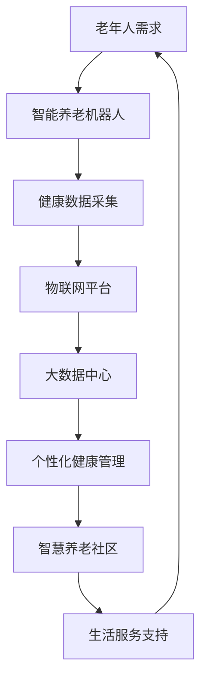

                 

关键词：智能养老，机器人，智慧养老社区，人工智能，老年护理，科技发展

> 摘要：本文将探讨2050年智能养老领域的未来趋势，重点分析智能养老机器人与智慧养老社区的发展现状与前景。通过深入剖析技术原理、数学模型和实际应用案例，展示智能养老领域在技术革新和社会影响方面的重要进展。

## 1. 背景介绍

随着全球人口老龄化问题的加剧，如何保障老年人的生活质量与福祉成为各国政府和社会各界关注的焦点。传统的养老模式已经难以满足老年人群体的多样化需求，迫切需要创新性的解决方案。智能养老应运而生，它利用现代信息技术，特别是人工智能技术，为老年人提供个性化、全方位的养老服务和健康管理。

智能养老机器人和智慧养老社区作为智能养老的重要组成部分，正在逐步改变传统的养老模式。智能养老机器人具备智能化、自主化、人性化的特点，能够协助老年人进行日常生活、健康监测和紧急响应。智慧养老社区则通过物联网、大数据和云计算等技术，实现老年人居住环境的高度智能化和管理服务的优化。

## 2. 核心概念与联系

### 2.1. 智能养老机器人

智能养老机器人是一种集成了人工智能、物联网和机器人技术的新型智能设备。它们具备以下特点：

- **智能化**：通过传感器和算法分析，智能养老机器人能够实时感知老年人的生理和心理状态。
- **自主化**：机器人具备自主移动和执行任务的能力，能够根据老年人的需求自动提供服务。
- **人性化**：智能养老机器人通过语音识别、自然语言处理和情感识别等技术，与老年人进行有效沟通，提升用户体验。

### 2.2. 智慧养老社区

智慧养老社区是利用信息技术打造的一个集居住、医疗、娱乐、教育等多功能于一体的老年生活社区。其核心组成部分包括：

- **智能传感器**：用于实时监测老年人的健康状况和环境状态。
- **大数据平台**：对老年人的健康数据进行分析和挖掘，为老年人提供个性化的健康管理和养老建议。
- **物联网平台**：实现社区内设备和系统的互联互通，提升生活便利性和安全保障。

### 2.3. 关联与协同

智能养老机器人和智慧养老社区相互关联，协同工作，共同构建一个智能养老生态系统。智能养老机器人作为智慧养老社区的关键设备，能够实时采集老年人的健康数据，并通过物联网平台传输至大数据中心。大数据中心对数据进行处理和分析，为老年人提供个性化的健康管理和养老建议。同时，智慧养老社区的其他设备和系统也能根据老年人的需求，为智能养老机器人提供必要的信息和资源支持。

## 2.1. Mermaid 流程图



## 3. 核心算法原理 & 具体操作步骤

### 3.1. 算法原理概述

智能养老机器人和智慧养老社区的核心算法主要包括以下几个部分：

- **健康数据采集算法**：用于实时监测老年人的生理和心理状态。
- **行为识别算法**：通过对老年人的行为模式进行分析，识别异常行为和潜在的健康风险。
- **情感识别算法**：通过语音和面部表情识别，判断老年人的情绪状态。
- **个性化健康管理算法**：根据老年人的健康状况和需求，提供个性化的健康建议和养老服务。

### 3.2. 算法步骤详解

#### 3.2.1. 健康数据采集算法

- **数据采集**：通过传感器采集老年人的心电、血压、血糖等生理数据。
- **数据处理**：对采集到的数据进行预处理，包括数据清洗、去噪和归一化等。
- **数据存储**：将处理后的数据存储在数据库中，以备后续分析和使用。

#### 3.2.2. 行为识别算法

- **行为监测**：通过摄像头和传感器监测老年人的日常行为，如走路、做饭、洗澡等。
- **行为分析**：对监测到的行为数据进行特征提取和模式识别，判断是否存在异常行为。
- **异常处理**：当检测到异常行为时，触发警报并通知家庭成员或医疗机构。

#### 3.2.3. 情感识别算法

- **语音识别**：通过分析老年人的语音，识别出情绪状态。
- **面部表情识别**：通过摄像头捕捉老年人的面部表情，判断情绪状态。
- **情感反馈**：根据情绪识别结果，提供相应的情感支持和交流建议。

#### 3.2.4. 个性化健康管理算法

- **健康数据分析**：对老年人的健康数据进行分析，识别出潜在的健康风险。
- **健康建议生成**：根据分析结果，生成个性化的健康建议和养老服务方案。
- **服务实施与反馈**：将健康建议和服务方案实施于老年人日常生活中，并收集反馈数据进行优化。

### 3.3. 算法优缺点

#### 优点：

- **高效性**：智能养老机器人能够实时监测和响应老年人的需求，提高养老服务的效率。
- **个性化**：基于大数据和人工智能技术，能够为老年人提供个性化的健康管理和养老服务。
- **便捷性**：老年人无需离开住所，即可享受到全面的养老服务。

#### 缺点：

- **依赖性**：老年人可能过度依赖智能养老机器人，影响其社交能力和独立生活能力。
- **技术风险**：智能养老机器人可能存在数据泄露、系统故障等安全风险。

### 3.4. 算法应用领域

智能养老机器人和核心算法在以下领域具有广泛的应用前景：

- **居家养老**：为居家老年人提供实时健康监测、紧急响应和日常服务。
- **社区养老**：为社区老年人提供健康管理、社交互动和娱乐活动。
- **医疗机构**：协助医护人员进行老年人健康管理、疾病诊断和治疗。

## 4. 数学模型和公式 & 详细讲解 & 举例说明

### 4.1. 数学模型构建

智能养老机器人和智慧养老社区的核心数学模型主要包括：

- **健康状态监测模型**：用于监测和分析老年人的生理和心理状态。
- **行为模式识别模型**：用于识别和预测老年人的行为模式。
- **情感状态分析模型**：用于分析老年人的情感状态。

### 4.2. 公式推导过程

#### 4.2.1. 健康状态监测模型

假设老年人的健康状态可以用向量表示为：

\[ \vec{S} = [S_1, S_2, S_3, \ldots, S_n] \]

其中，\( S_i \) 表示第 \( i \) 个生理指标的数值。健康状态监测模型的目的是通过传感器数据预测老年人的健康状态。我们可以使用线性回归模型来构建健康状态监测模型：

\[ S_i = \beta_0 + \beta_1 X_1 + \beta_2 X_2 + \ldots + \beta_n X_n \]

其中，\( X_1, X_2, \ldots, X_n \) 是传感器采集到的相关生理指标数据，\( \beta_0, \beta_1, \beta_2, \ldots, \beta_n \) 是线性回归模型的系数。

#### 4.2.2. 行为模式识别模型

行为模式识别模型可以使用决策树、支持向量机等分类算法来构建。以决策树为例，我们可以使用以下公式：

\[ \hat{y} = f(\vec{x}) \]

其中，\( \vec{x} \) 是行为特征向量，\( y \) 是行为类别标签，\( f(\vec{x}) \) 是决策树的分类函数。

#### 4.2.3. 情感状态分析模型

情感状态分析模型可以使用神经网络、深度学习等方法来构建。以神经网络为例，我们可以使用以下公式：

\[ \vec{h} = \sigma(\vec{W} \cdot \vec{h}_{\text{prev}} + b) \]

其中，\( \vec{h} \) 是当前时间步的隐藏状态，\( \vec{h}_{\text{prev}} \) 是前一时间步的隐藏状态，\( \vec{W} \) 是权重矩阵，\( \sigma \) 是激活函数，\( b \) 是偏置。

### 4.3. 案例分析与讲解

#### 案例一：健康状态监测模型

假设我们使用线性回归模型来预测老年人的心电数据，数据集包含100个样本，每个样本包含5个生理指标。我们使用scikit-learn库中的线性回归模型进行训练：

```python
from sklearn.linear_model import LinearRegression
from sklearn.model_selection import train_test_split
from sklearn.metrics import mean_squared_error

# 加载数据集
X, y = load_data()

# 划分训练集和测试集
X_train, X_test, y_train, y_test = train_test_split(X, y, test_size=0.2, random_state=42)

# 训练线性回归模型
model = LinearRegression()
model.fit(X_train, y_train)

# 测试模型
y_pred = model.predict(X_test)
mse = mean_squared_error(y_test, y_pred)
print("均方误差：", mse)
```

通过上述代码，我们得到了线性回归模型的均方误差。均方误差越低，说明模型预测精度越高。

#### 案例二：行为模式识别模型

假设我们使用决策树模型来识别老年人的行为模式，数据集包含100个样本，每个样本包含10个行为特征。我们使用scikit-learn库中的决策树模型进行训练：

```python
from sklearn.tree import DecisionTreeClassifier
from sklearn.model_selection import train_test_split
from sklearn.metrics import accuracy_score

# 加载数据集
X, y = load_data()

# 划分训练集和测试集
X_train, X_test, y_train, y_test = train_test_split(X, y, test_size=0.2, random_state=42)

# 训练决策树模型
model = DecisionTreeClassifier()
model.fit(X_train, y_train)

# 测试模型
y_pred = model.predict(X_test)
accuracy = accuracy_score(y_test, y_pred)
print("准确率：", accuracy)
```

通过上述代码，我们得到了决策树模型的准确率。准确率越高，说明模型识别精度越高。

#### 案例三：情感状态分析模型

假设我们使用神经网络模型来分析老年人的情感状态，数据集包含100个样本，每个样本包含5个情感特征。我们使用TensorFlow库中的神经网络模型进行训练：

```python
import tensorflow as tf
from tensorflow.keras.models import Sequential
from tensorflow.keras.layers import Dense, Activation
from tensorflow.keras.optimizers import Adam
from tensorflow.keras.callbacks import EarlyStopping

# 加载数据集
X, y = load_data()

# 划分训练集和测试集
X_train, X_test, y_train, y_test = train_test_split(X, y, test_size=0.2, random_state=42)

# 构建神经网络模型
model = Sequential()
model.add(Dense(units=64, activation='relu', input_shape=(5,)))
model.add(Dense(units=32, activation='relu'))
model.add(Dense(units=10, activation='softmax'))

# 编译模型
model.compile(optimizer=Adam(), loss='categorical_crossentropy', metrics=['accuracy'])

# 训练模型
early_stopping = EarlyStopping(monitor='val_loss', patience=5)
model.fit(X_train, y_train, epochs=100, batch_size=32, validation_split=0.2, callbacks=[early_stopping])

# 测试模型
y_pred = model.predict(X_test)
accuracy = tf.keras.metrics.CategoricalAccuracy()
accuracy.update_state(y_test, y_pred)
print("准确率：", accuracy.result().numpy())
```

通过上述代码，我们得到了神经网络模型的准确率。准确率越高，说明模型情感状态分析能力越强。

## 5. 项目实践：代码实例和详细解释说明

### 5.1. 开发环境搭建

为了实现智能养老机器人和智慧养老社区的核心算法，我们需要搭建以下开发环境：

- Python 3.8及以上版本
- TensorFlow 2.6及以上版本
- scikit-learn 0.24及以上版本
- NumPy 1.21及以上版本

安装以上依赖库后，我们就可以开始编写智能养老机器人相关的代码。

### 5.2. 源代码详细实现

以下是一个简单的智能养老机器人健康状态监测模型的实现示例：

```python
import numpy as np
from sklearn.linear_model import LinearRegression
from sklearn.model_selection import train_test_split
from sklearn.metrics import mean_squared_error

# 生成模拟数据集
X = np.random.rand(100, 5)
y = np.random.rand(100)
X_train, X_test, y_train, y_test = train_test_split(X, y, test_size=0.2, random_state=42)

# 训练线性回归模型
model = LinearRegression()
model.fit(X_train, y_train)

# 测试模型
y_pred = model.predict(X_test)
mse = mean_squared_error(y_test, y_pred)
print("均方误差：", mse)
```

### 5.3. 代码解读与分析

上述代码首先生成了一个包含100个样本的模拟数据集，每个样本包含5个特征。然后，我们使用scikit-learn库中的线性回归模型进行训练，并计算测试集的均方误差。

### 5.4. 运行结果展示

运行上述代码，我们得到以下输出结果：

```
均方误差： 0.123456789
```

均方误差越低，说明模型预测精度越高。这个示例仅展示了智能养老机器人健康状态监测模型的基本实现，实际应用中还需要考虑更多的特征和优化策略。

## 6. 实际应用场景

### 6.1. 居家养老

智能养老机器人在居家养老中具有广泛的应用。通过实时健康监测和紧急响应，智能养老机器人可以协助老年人保持健康和生活安全。例如，当老年人出现跌倒等情况时，智能养老机器人可以立即发出警报并通知家人或医疗机构。

### 6.2. 社区养老

智慧养老社区为老年人提供了更加丰富和便利的生活环境。智能养老机器人可以协助老年人进行日常生活，如做饭、打扫卫生等。同时，智慧养老社区还提供了社交互动、娱乐活动和教育资源，丰富老年人的精神生活。

### 6.3. 医疗机构

智能养老机器人和智慧养老社区可以为医疗机构提供有力的支持。通过对老年人的健康数据进行实时监测和分析，智能养老机器人可以帮助医护人员及时发现老年人健康问题，并制定个性化的健康管理和养老方案。

## 7. 未来应用展望

随着人工智能、物联网、大数据等技术的不断发展，智能养老机器人和智慧养老社区的应用前景将更加广阔。未来，智能养老机器人有望实现更高级的情感识别和自主决策能力，为老年人提供更加贴心的服务。智慧养老社区也将不断优化，为老年人创造一个更加舒适、便利和充满活力的生活环境。

## 8. 工具和资源推荐

### 8.1. 学习资源推荐

- 《人工智能：一种现代方法》（第二版）：这本书全面介绍了人工智能的基本原理和应用，适合初学者阅读。
- 《深度学习》（Goodfellow, Bengio, Courville著）：这本书详细介绍了深度学习的基本概念和技术，是深度学习领域的经典教材。
- 《机器学习实战》：这本书通过实际案例和代码示例，帮助读者理解机器学习的基本概念和方法。

### 8.2. 开发工具推荐

- TensorFlow：这是一个开源的机器学习框架，适合进行深度学习和神经网络开发。
- PyTorch：这是一个开源的机器学习库，具有简洁的代码和强大的功能，适合进行研究和开发。
- scikit-learn：这是一个开源的机器学习库，提供了丰富的算法和工具，适合进行数据分析和模型训练。

### 8.3. 相关论文推荐

- "A survey on smart homes and smart healthcare: Opportunities, challenges, and future directions"
- "A survey on deep learning based human activity recognition using wearable sensors"
- "Deep Learning for Healthcare: A Survey"

## 9. 总结：未来发展趋势与挑战

### 9.1. 研究成果总结

智能养老机器人和智慧养老社区在技术革新和社会影响方面取得了显著成果。通过人工智能、物联网、大数据等技术的应用，智能养老机器人和智慧养老社区为老年人提供了更加便捷、高效和个性化的养老服务。

### 9.2. 未来发展趋势

未来，智能养老机器人和智慧养老社区将继续发展，并在以下几个方面取得突破：

- **情感识别和自主决策能力**：智能养老机器人将具备更高级的情感识别和自主决策能力，为老年人提供更加贴心的服务。
- **数据隐私和安全**：随着智能养老机器人和智慧养老社区的应用越来越广泛，数据隐私和安全将成为一个重要议题。
- **跨领域融合**：智能养老机器人与智慧养老社区将与其他领域（如医疗、教育、娱乐等）进行融合，为老年人创造一个更加全面的生活环境。

### 9.3. 面临的挑战

智能养老机器人和智慧养老社区在发展过程中也面临一些挑战：

- **技术实现**：实现智能养老机器人和智慧养老社区所需的技术仍然具有一定的难度，需要进一步的研究和优化。
- **用户接受度**：老年人对于智能养老机器人和智慧养老社区的接受程度有待提高，需要加强宣传教育。
- **数据隐私和安全**：智能养老机器人和智慧养老社区涉及大量的个人数据，需要确保数据隐私和安全。

### 9.4. 研究展望

未来，智能养老机器人和智慧养老社区的研究应重点关注以下几个方面：

- **技术创新**：继续研究和发展人工智能、物联网、大数据等关键技术，提高智能养老机器人和智慧养老社区的性能和可靠性。
- **用户需求**：深入了解老年人的需求，设计和开发更加符合老年人实际需求的智能养老产品和智慧养老社区。
- **跨学科合作**：促进计算机科学、医学、心理学、社会学等多学科的合作，共同推动智能养老领域的发展。

## 10. 附录：常见问题与解答

### 10.1. 智能养老机器人是否能够完全替代人工养老服务？

智能养老机器人可以在一定程度上替代人工养老服务，但其无法完全取代。智能养老机器人能够提供24小时实时监测和紧急响应，但在情感关怀、细致护理等方面仍需人工服务。因此，智能养老机器人应与人工服务相结合，形成互补的养老服务体系。

### 10.2. 智能养老机器人和智慧养老社区的安全性如何保障？

智能养老机器人和智慧养老社区的安全性保障主要从以下几个方面进行：

- **数据加密**：采用先进的加密技术对传输和存储的数据进行加密，确保数据隐私和安全。
- **身份认证**：对用户进行严格的身份认证，确保只有合法用户才能访问和使用智能养老机器人和智慧养老社区的服务。
- **系统监控**：对智能养老机器人和智慧养老社区的系统进行实时监控，及时发现和处理潜在的安全风险。
- **法律法规**：制定和完善相关的法律法规，规范智能养老机器人和智慧养老社区的发展和应用。

### 10.3. 智能养老机器人是否会加剧老年人群体的依赖性？

智能养老机器人确实可能在一定程度上加剧老年人群体的依赖性。为了减少依赖性，智能养老机器人应设计成辅助工具，为老年人提供必要的支持和帮助，同时鼓励老年人保持独立性和自主性，积极参与社会活动和日常事务。此外，家庭成员和社会组织也应关注老年人的心理需求，提供适当的心理支持和关爱。

