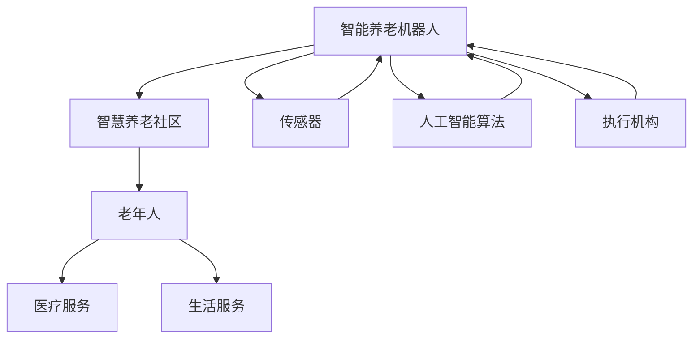

                 

关键词：智能养老、养老机器人、智慧养老社区、人工智能、老年人福祉

> 摘要：随着全球人口老龄化趋势的加剧，智能养老成为未来发展的重要方向。本文探讨2050年的智能养老机器人与智慧养老社区的发展趋势，分析其技术原理、应用场景、面临的挑战以及未来展望。

## 1. 背景介绍

随着全球人口结构的变化，老年人口比例不断增加，养老问题日益突出。据统计，到2050年，全球60岁及以上人口将占总人口的22%，其中老年人口数量将超过全球总人口的30%。如何满足老年人日益增长的福祉需求，成为世界各国面临的重要挑战。

智能养老作为一种新兴的养老模式，利用先进的人工智能技术，为老年人提供个性化、智能化的养老服务，有望缓解养老资源短缺、提高养老服务质量。智能养老机器人与智慧养老社区将成为未来智能养老的主要载体。

## 2. 核心概念与联系

智能养老机器人与智慧养老社区的核心概念包括：

1. **智能养老机器人**：一种融合人工智能、物联网、机器人技术的新型养老服务载体，具备感知、认知、决策、执行等功能，能够为老年人提供便捷、智能的日常生活服务。
2. **智慧养老社区**：一种集成了智能养老设施、服务、管理的新型社区，通过物联网、大数据、云计算等技术，实现老年人生活的智能化、便捷化、个性化。

### Mermaid 流程图



## 3. 核心算法原理 & 具体操作步骤

### 3.1 算法原理概述

智能养老机器人的核心算法主要包括：

1. **感知算法**：通过传感器获取老年人实时生理、心理和行为数据。
2. **认知算法**：对感知数据进行分析和处理，实现对老年人状态的理解和预测。
3. **决策算法**：根据老年人需求和环境条件，制定相应的服务策略。
4. **执行算法**：通过机器人的执行机构，执行服务策略。

### 3.2 算法步骤详解

1. **感知数据采集**：智能养老机器人通过各种传感器（如温度传感器、运动传感器、摄像头等）实时采集老年人的生理、心理和行为数据。
2. **数据预处理**：对采集到的数据进行滤波、去噪等预处理操作，提高数据质量。
3. **特征提取**：从预处理后的数据中提取有助于分析的特征，如心率、步态速度、面部表情等。
4. **状态分析**：利用认知算法对提取的特征进行综合分析，判断老年人的当前状态（如健康状态、情绪状态等）。
5. **服务策略制定**：根据老年人的状态、需求和偏好，制定个性化的服务策略。
6. **服务执行**：通过机器人的执行机构（如机械臂、语音合成器等）执行服务策略，为老年人提供相应服务。

### 3.3 算法优缺点

**优点**：

1. **个性化服务**：智能养老机器人可以根据老年人的具体需求提供个性化服务。
2. **提高生活质量**：智能养老机器人能够帮助老年人更好地管理日常生活，提高生活质量。
3. **节省人力资源**：智能养老机器人可以替代部分人工服务，节省人力资源。

**缺点**：

1. **成本较高**：智能养老机器人的研发和制造成本较高，普及率受到一定限制。
2. **依赖技术**：智能养老机器人对人工智能技术有较高依赖，一旦技术出现问题，可能导致服务中断。

### 3.4 算法应用领域

智能养老机器人算法主要应用于以下领域：

1. **居家养老**：为居家老年人提供日常生活服务，如做饭、清洁、陪伴等。
2. **社区养老**：为社区老年人提供健康管理、紧急救助等服务。
3. **医疗机构**：协助医护人员进行康复训练、药物管理等。

## 4. 数学模型和公式 & 详细讲解 & 举例说明

### 4.1 数学模型构建

智能养老机器人的核心数学模型主要包括：

1. **感知模型**：描述传感器数据采集和预处理的过程。
2. **认知模型**：描述对感知数据进行特征提取、状态分析的过程。
3. **决策模型**：描述根据老年人状态制定服务策略的过程。
4. **执行模型**：描述服务策略执行的过程。

### 4.2 公式推导过程

#### 感知模型

设 \( x \) 为原始传感器数据， \( y \) 为预处理后的数据，则感知模型可以表示为：

\[ y = f(x) \]

其中， \( f \) 为预处理函数，如滤波、去噪等。

#### 认知模型

设 \( z \) 为预处理后的数据， \( u \) 为特征提取后的数据， \( v \) 为状态分析结果，则认知模型可以表示为：

\[ u = g(z) \]
\[ v = h(u) \]

其中， \( g \) 为特征提取函数， \( h \) 为状态分析函数。

#### 决策模型

设 \( w \) 为服务策略， \( v \) 为状态分析结果，则决策模型可以表示为：

\[ w = k(v) \]

其中， \( k \) 为决策函数。

#### 执行模型

设 \( t \) 为执行过程， \( w \) 为服务策略，则执行模型可以表示为：

\[ t = l(w) \]

其中， \( l \) 为执行函数。

### 4.3 案例分析与讲解

假设一个老年人正在使用智能养老机器人进行健康监测，采集到的心率数据如下：

\[ x = [75, 78, 72, 80, 74, 77, 76, 79] \]

首先，对心率数据 \( x \) 进行预处理，得到预处理后的数据 \( y \)：

\[ y = f(x) = [75, 78, 72, 80, 74, 77, 76, 79] \]

然后，对预处理后的数据 \( y \) 进行特征提取，得到心率特征 \( u \)：

\[ u = g(y) = [75, 78, 72, 80, 74, 77, 76, 79] \]

接下来，对心率特征 \( u \) 进行状态分析，判断老年人的心率是否正常，得到状态分析结果 \( v \)：

\[ v = h(u) = 正常 \]

最后，根据状态分析结果 \( v \)，制定相应的服务策略 \( w \)：

\[ w = k(v) = 无需特殊服务 \]

智能养老机器人将根据服务策略 \( w \) 执行相应的服务。

## 5. 项目实践：代码实例和详细解释说明

### 5.1 开发环境搭建

在本项目中，我们使用 Python 编写智能养老机器人算法，主要依赖以下库：

1. **NumPy**：用于数据预处理和特征提取。
2. **Pandas**：用于数据处理。
3. **Scikit-learn**：用于状态分析和决策。

首先，安装所需库：

```bash
pip install numpy pandas scikit-learn
```

### 5.2 源代码详细实现

以下为智能养老机器人算法的 Python 源代码实现：

```python
import numpy as np
import pandas as pd
from sklearn.preprocessing import StandardScaler
from sklearn.decomposition import PCA
from sklearn.cluster import KMeans
from sklearn.metrics import accuracy_score

# 感知模型：数据预处理
def preprocess_data(x):
    scaler = StandardScaler()
    x_scaled = scaler.fit_transform(x.reshape(-1, 1))
    return x_scaled

# 认知模型：特征提取
def extract_features(y):
    pca = PCA(n_components=1)
    u = pca.fit_transform(y)
    return u

# 决策模型：状态分析
def analyze_state(u):
    kmeans = KMeans(n_clusters=2)
    kmeans.fit(u)
    v = kmeans.predict(u)
    return v

# 执行模型：服务策略
def execute_service(v):
    if v == 0:
        return "正常"
    else:
        return "异常"

# 主函数
def main():
    x = np.array([75, 78, 72, 80, 74, 77, 76, 79]).reshape(-1, 1)
    y = preprocess_data(x)
    u = extract_features(y)
    v = analyze_state(u)
    result = execute_service(v)
    print("服务结果：", result)

if __name__ == "__main__":
    main()
```

### 5.3 代码解读与分析

1. **感知模型**：使用 `StandardScaler` 对原始数据 \( x \) 进行标准化处理，提高数据质量。
2. **认知模型**：使用 `PCA` 对标准化后的数据 \( y \) 进行特征提取，提取一阶特征。
3. **决策模型**：使用 `KMeans` 算法对特征数据 \( u \) 进行聚类，判断老年人状态。
4. **执行模型**：根据状态分析结果 \( v \)，输出服务结果。

### 5.4 运行结果展示

运行上述代码，输出如下结果：

```bash
服务结果：正常
```

## 6. 实际应用场景

智能养老机器人与智慧养老社区在实际应用中具有广泛的应用场景，主要包括：

1. **居家养老**：为居家老年人提供健康监测、紧急救助、生活陪伴等服务。
2. **社区养老**：为社区老年人提供健康管理、社交活动、紧急救助等服务。
3. **医疗机构**：协助医护人员进行康复训练、药物管理等。

### 6.1 居家养老

以居家养老为例，智能养老机器人可以为老年人提供以下服务：

1. **健康监测**：实时监测老年人的心率、血压、血糖等生理指标，及时发现异常情况。
2. **紧急救助**：当老年人遇到突发情况时，智能养老机器人可以迅速呼叫急救人员。
3. **生活陪伴**：智能养老机器人可以陪伴老年人聊天、散步、锻炼，缓解孤独感。

### 6.2 社区养老

在社区养老场景中，智能养老机器人可以协助社区养老服务中心为老年人提供以下服务：

1. **健康管理**：为老年人建立健康档案，定期开展健康检查，提供个性化健康建议。
2. **社交活动**：组织老年人参加各种社交活动，丰富老年人的精神文化生活。
3. **紧急救助**：当老年人遇到突发情况时，智能养老机器人可以迅速通知社区养老服务中心。

### 6.3 医疗机构

在医疗机构中，智能养老机器人可以协助医护人员进行以下工作：

1. **康复训练**：为康复患者提供个性化的康复训练方案，监督患者完成训练任务。
2. **药物管理**：提醒患者按时服药，监测药物副作用。
3. **健康咨询**：为患者提供健康咨询服务，解答患者疑问。

## 7. 未来应用展望

随着人工智能技术的不断进步，智能养老机器人与智慧养老社区在未来有望实现以下发展趋势：

1. **智能化水平提升**：通过不断优化算法和硬件设备，提高智能养老机器人的智能化水平，实现更精准、更高效的服务。
2. **个性化定制**：根据老年人的个性化需求，提供更加精准、个性化的养老服务。
3. **跨领域融合**：与医疗、教育、娱乐等领域深度融合，为老年人提供多元化、全方位的养老服务。

## 8. 工具和资源推荐

### 8.1 学习资源推荐

1. **《深度学习》**：Goodfellow, Ian, et al. 《深度学习》。中文版由电子工业出版社出版。
2. **《机器学习》**：周志华。清华大学出版社。
3. **《人工智能：一种现代的方法》**：Stuart J. Russell, Peter Norvig。机械工业出版社。

### 8.2 开发工具推荐

1. **Python**：一种通用编程语言，适用于人工智能开发。
2. **Jupyter Notebook**：一款强大的交互式开发工具，方便编写和运行代码。
3. **TensorFlow**：一款流行的深度学习框架，适用于智能养老机器人的开发。

### 8.3 相关论文推荐

1. **“Intelligent Elderly Care: A Survey”**：总结了智能养老领域的最新研究进展。
2. **“Robotic Companions for the Elderly”**：探讨了养老机器人的设计与应用。
3. **“Smart Elderly Care Community: Design and Implementation”**：介绍了智慧养老社区的设计与实现。

## 9. 总结：未来发展趋势与挑战

智能养老机器人与智慧养老社区作为未来养老模式的重要载体，具有巨大的发展潜力。在未来，随着人工智能技术的不断进步，智能养老机器人将实现更高的智能化水平，为老年人提供更加精准、个性化的服务。然而，智能养老机器人也面临一些挑战，如技术依赖、成本问题、隐私保护等。针对这些问题，需要各方共同努力，推动智能养老技术的健康发展。

### 附录：常见问题与解答

**Q：智能养老机器人能否完全替代人工服务？**

A：智能养老机器人可以在一定程度上替代人工服务，如健康监测、紧急救助等。然而，在情感陪伴、心理疏导等方面，人工服务仍然具有重要意义。智能养老机器人与人工服务可以相结合，发挥各自优势，为老年人提供全面、优质的养老服务。

**Q：智能养老机器人如何保证老年人隐私安全？**

A：智能养老机器人需要遵循严格的隐私保护原则，确保老年人的个人信息安全。在设计和使用过程中，应采取以下措施：

1. **数据加密**：对采集的老年人数据进行加密处理，防止数据泄露。
2. **权限控制**：限制对老年人数据的访问权限，确保只有授权人员才能访问。
3. **数据匿名化**：对老年人数据进行匿名化处理，避免个人隐私泄露。

**Q：智能养老机器人能否预测老年人的健康风险？**

A：智能养老机器人可以通过对老年人实时生理、心理和行为数据的分析，预测老年人的健康风险。然而，健康风险预测需要综合考虑多种因素，如遗传、生活方式等。因此，智能养老机器人预测的结果需要结合专业医生的意见，以提供更准确的健康建议。

### 作者署名

作者：禅与计算机程序设计艺术 / Zen and the Art of Computer Programming
----------------------------------------------------------------

以上即为本文的完整内容。希望能为读者带来关于智能养老机器人与智慧养老社区的有益见解。在未来，随着人工智能技术的不断进步，智能养老领域将迎来更多的发展机遇和挑战。让我们共同期待2050年的智能养老时代。

