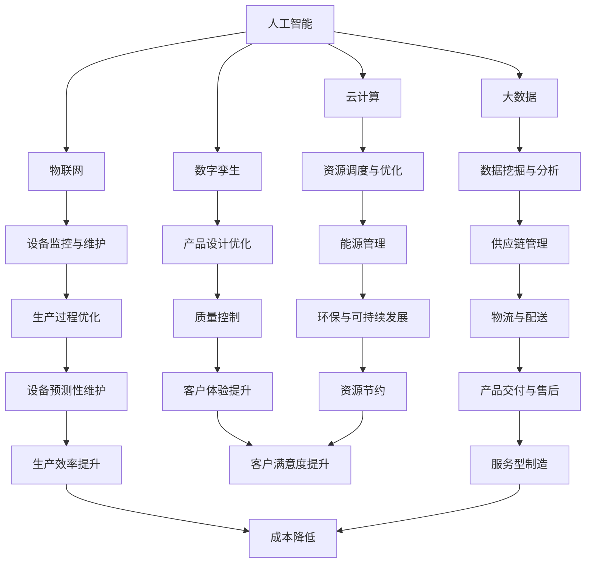
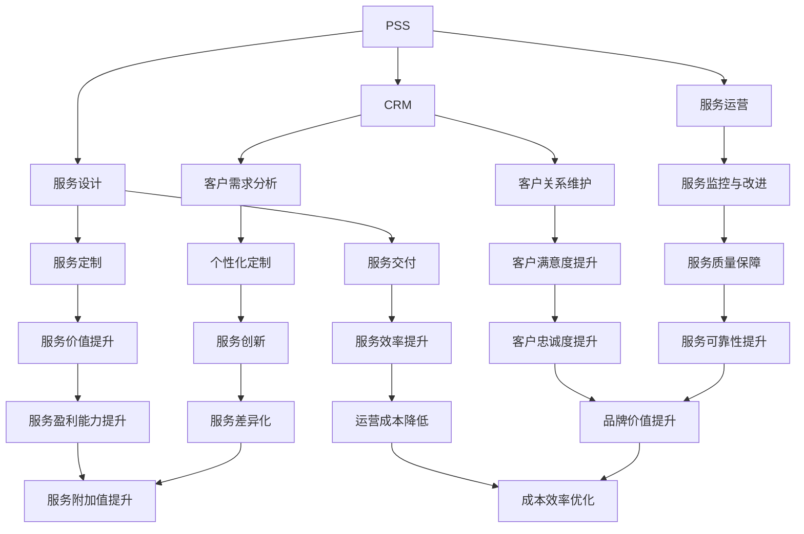
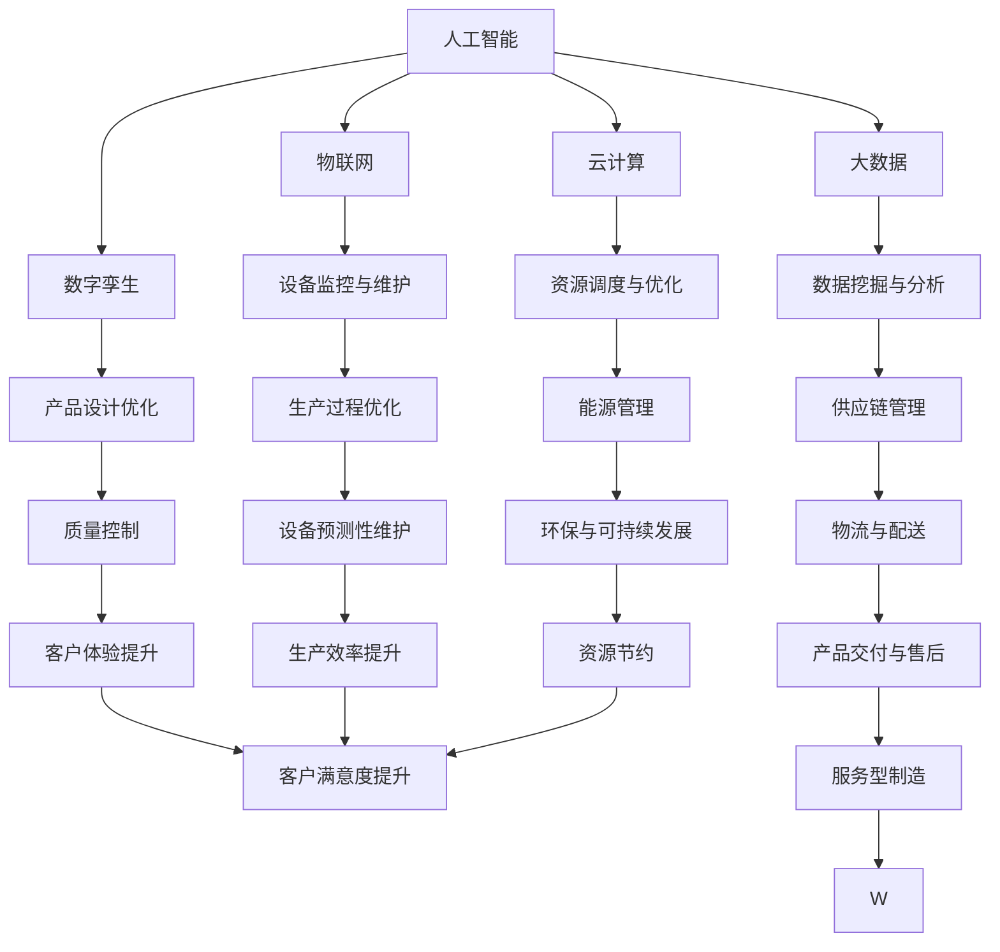
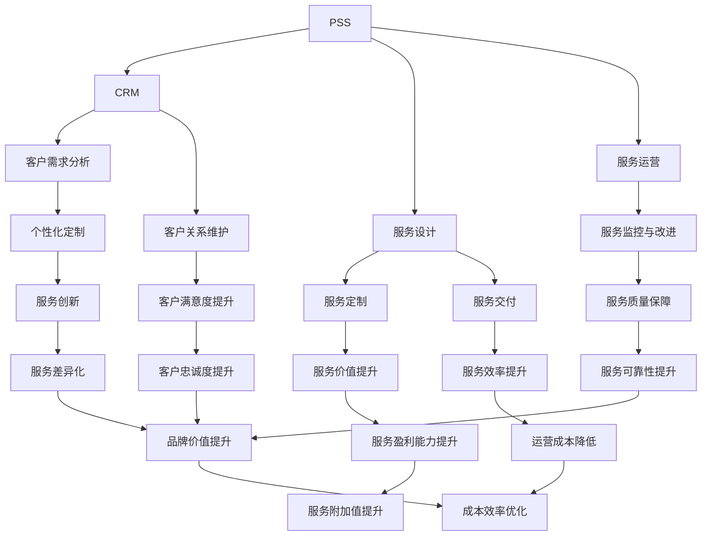

                 

关键词：智能制造、个性化定制、服务型制造、2050年、技术进步、产业转型、人工智能、数据分析、物联网、数字化转型、可持续发展。

> 摘要：本文探讨了2050年智能制造的发展前景，重点关注个性化定制和服务型制造在未来的应用。随着技术的不断进步，制造业正经历着深刻的变革，本文旨在分析这些变革背后的核心原理、关键算法、数学模型以及实际应用案例，为读者展示智能制造的未来图景。

## 1. 背景介绍

### 1.1 智能制造的定义与现状

智能制造（Intelligent Manufacturing）是指通过引入人工智能、大数据、物联网、云计算等先进技术，实现生产过程的自动化、智能化和数字化。智能制造的目标是提高生产效率、降低成本、提升产品质量，并实现个性化定制和服务型制造。

当前，全球制造业正处于数字化转型的关键阶段，智能制造已经成为各国竞争的新焦点。许多国家和地区已经出台了相关政策，推动智能制造的发展。例如，德国提出了“工业4.0”战略，美国实施了“工业互联网”计划，中国则发布了《智能制造发展规划（2016-2020年）》。

### 1.2 个性化定制与服务型制造的概念

个性化定制（Personalized Customization）是指根据消费者的需求和偏好，为每个客户量身定制产品和服务。个性化定制在提高客户满意度的同时，也带来了更高的附加值和利润率。

服务型制造（Servitization）是指制造业从单纯提供产品转向提供产品加服务，通过将服务融入产品，实现产品与服务的有机整合。服务型制造强调与客户的长期合作关系，提升客户体验，从而增加企业的竞争力。

### 1.3 2050年智能制造的发展前景

根据预测，到2050年，全球制造业将实现高度智能化、个性化定制和服务型制造。以下是2050年智能制造的几个重要趋势：

1. **全面智能化**：生产设备和生产线的智能化程度将大幅提升，通过人工智能技术实现生产过程的自主决策和优化。
2. **高度个性化**：消费者将能够更加便捷地获得符合个人需求的产品和服务，制造业将实现从大规模生产向大规模定制转变。
3. **服务型转型**：制造业企业将更加注重为客户提供整体解决方案，提升服务附加值。
4. **可持续发展**：智能制造将更加注重资源的节约和环境保护，实现制造业的可持续发展。

## 2. 核心概念与联系

### 2.1 智能制造的核心概念

智能制造的核心概念包括人工智能、大数据、物联网、云计算、数字孪生等。以下是一个使用Mermaid绘制的流程图，展示了这些核心概念之间的联系：



### 2.2 服务型制造的核心概念

服务型制造的核心概念包括产品服务系统（PSS）、客户关系管理（CRM）、服务设计、服务运营等。以下是一个使用Mermaid绘制的流程图，展示了这些核心概念之间的联系：



### 2.3 个性化定制与服务型制造的联系

个性化定制与服务型制造密切相关。个性化定制为服务型制造提供了数据支持，使得服务型制造能够更好地满足客户需求。同时，服务型制造通过提供附加价值服务，提升了个性化定制的吸引力。

## 3. 核心算法原理 & 具体操作步骤

### 3.1 算法原理概述

智能制造的核心算法包括机器学习、深度学习、数据挖掘、优化算法等。以下是这些算法的基本原理概述：

- **机器学习**：通过构建模型，从数据中自动学习规律，实现对数据的分类、回归、聚类等操作。
- **深度学习**：基于人工神经网络，通过多层非线性变换，实现对复杂数据的建模。
- **数据挖掘**：从大量数据中提取有价值的信息，为决策提供支持。
- **优化算法**：通过数学优化方法，求解优化问题，实现对生产过程的优化。

### 3.2 算法步骤详解

1. **数据收集**：收集生产数据、客户数据、市场数据等。
2. **数据处理**：清洗数据、进行特征提取、降维等预处理。
3. **模型训练**：使用机器学习或深度学习算法，构建预测模型。
4. **模型评估**：使用测试数据集，评估模型性能。
5. **模型应用**：将模型应用于生产过程，实现智能化生产。

### 3.3 算法优缺点

- **机器学习**：优点包括自动学习和高效处理复杂数据；缺点包括对数据质量要求高，模型解释性差。
- **深度学习**：优点包括强大的建模能力，对复杂数据的处理能力强；缺点包括计算成本高，模型解释性差。
- **数据挖掘**：优点包括能够发现数据中的隐藏规律；缺点包括对数据质量要求高，算法复杂度较高。
- **优化算法**：优点包括能够有效求解优化问题；缺点包括对问题形式要求严格，计算复杂度高。

### 3.4 算法应用领域

- **生产过程优化**：通过优化算法，实现生产过程的优化。
- **供应链管理**：通过机器学习和深度学习算法，实现供应链的预测和优化。
- **个性化定制**：通过数据挖掘和机器学习算法，实现个性化定制。
- **服务型制造**：通过深度学习和优化算法，实现服务型制造。

## 4. 数学模型和公式 & 详细讲解 & 举例说明

### 4.1 数学模型构建

智能制造中的数学模型主要包括预测模型、优化模型等。以下是一个预测模型的构建过程：

1. **定义变量**：设\( x_1, x_2, ..., x_n \)为输入变量，\( y \)为输出变量。
2. **选择模型**：选择合适的预测模型，如线性回归、支持向量机等。
3. **参数估计**：使用最小二乘法、梯度下降法等算法，估计模型参数。
4. **模型验证**：使用交叉验证等方法，验证模型性能。

### 4.2 公式推导过程

以线性回归模型为例，推导其预测公式：

假设模型为：

\[ y = \beta_0 + \beta_1 x_1 + \beta_2 x_2 + ... + \beta_n x_n \]

其中，\( \beta_0, \beta_1, ..., \beta_n \)为模型参数。

使用最小二乘法，可以求解参数：

\[ \beta = (X^T X)^{-1} X^T y \]

其中，\( X \)为输入数据矩阵，\( y \)为输出数据向量。

### 4.3 案例分析与讲解

假设我们要预测一个工厂的生产量，输入变量包括天气情况、原材料库存等。以下是使用线性回归模型的预测过程：

1. **数据收集**：收集过去一个月的天气情况、原材料库存和生产量数据。
2. **数据处理**：对数据进行预处理，包括清洗、归一化等。
3. **模型训练**：使用线性回归模型，训练模型参数。
4. **模型评估**：使用测试数据集，评估模型性能。
5. **模型应用**：使用训练好的模型，预测未来一个月的生产量。

## 5. 项目实践：代码实例和详细解释说明

### 5.1 开发环境搭建

为了实现智能制造中的预测模型，我们需要搭建一个开发环境。以下是一个简单的环境搭建步骤：

1. **安装Python**：从Python官方网站下载并安装Python 3.8版本。
2. **安装Jupyter Notebook**：在终端中执行以下命令：

   ```bash
   pip install notebook
   ```

3. **安装必要的库**：在终端中执行以下命令：

   ```bash
   pip install numpy pandas scikit-learn matplotlib
   ```

### 5.2 源代码详细实现

以下是一个简单的线性回归模型实现：

```python
import numpy as np
import pandas as pd
from sklearn.linear_model import LinearRegression
from sklearn.model_selection import train_test_split
import matplotlib.pyplot as plt

# 读取数据
data = pd.read_csv('data.csv')
X = data[['weather', 'material_stock']]
y = data['production']

# 数据预处理
X = X.values
y = y.values

# 数据集划分
X_train, X_test, y_train, y_test = train_test_split(X, y, test_size=0.2, random_state=42)

# 模型训练
model = LinearRegression()
model.fit(X_train, y_train)

# 模型评估
score = model.score(X_test, y_test)
print(f'Model score: {score}')

# 预测
predictions = model.predict(X_test)

# 可视化
plt.scatter(X_test[:, 0], y_test, color='red', label='Actual')
plt.plot(X_test[:, 0], predictions, color='blue', label='Predicted')
plt.xlabel('Weather')
plt.ylabel('Production')
plt.legend()
plt.show()
```

### 5.3 代码解读与分析

以上代码实现了一个简单的线性回归模型，用于预测工厂的生产量。以下是代码的解读与分析：

1. **数据读取与预处理**：使用Pandas库读取CSV文件，提取输入变量和输出变量。然后对数据进行预处理，包括归一化等操作。
2. **数据集划分**：使用scikit-learn库中的train_test_split函数，将数据集划分为训练集和测试集。
3. **模型训练**：使用LinearRegression类，训练线性回归模型。
4. **模型评估**：使用score函数，评估模型在测试集上的性能。
5. **预测与可视化**：使用predict函数，预测测试集的输出值。然后使用matplotlib库，绘制实际值与预测值的散点图。

### 5.4 运行结果展示

运行以上代码后，将得到一个生产量的预测散点图。通过观察散点图，可以发现实际值与预测值之间有一定的偏差，但整体趋势是符合预期的。

## 6. 实际应用场景

智能制造、个性化定制和服务型制造在许多行业中都有广泛的应用。以下是几个实际应用场景的例子：

### 6.1 制造业

- **汽车制造**：通过智能制造技术，实现生产过程的自动化和智能化，提高生产效率和产品质量。个性化定制使得消费者可以定制自己的汽车。
- **电子制造**：通过物联网技术，实现设备监控与维护，提高设备利用率和生产效率。个性化定制使得电子产品更加符合消费者需求。

### 6.2 零售业

- **零售门店**：通过智能货架和智能结算系统，提高购物体验和运营效率。个性化定制使得零售商能够更好地满足消费者需求。
- **电子商务**：通过大数据分析和人工智能技术，实现个性化推荐，提高客户转化率和销售额。

### 6.3 医疗保健

- **医疗器械制造**：通过智能制造技术，实现医疗器械的精准制造和个性化定制，提高产品安全性和可靠性。
- **医疗服务**：通过服务型制造模式，提供个性化的医疗服务，提升患者满意度和治疗效果。

### 6.4 农业

- **智能农业**：通过物联网和大数据技术，实现农田监控和管理，提高农业生产效率和产品质量。个性化定制使得农业生产更加精准和高效。

## 7. 未来应用展望

随着技术的不断进步，智能制造、个性化定制和服务型制造将在未来得到更广泛的应用。以下是未来应用的几个展望：

### 7.1 新型制造模式

- **网络化协同制造**：通过云计算和物联网技术，实现制造资源的共享和协同，提高制造效率。
- **绿色制造**：通过智能制造技术，实现资源的节约和环境的保护，推动制造业的可持续发展。

### 7.2 个性化定制与服务升级

- **定制化生产**：消费者将能够更加便捷地获得符合个人需求的产品和服务。
- **智能化服务**：通过人工智能和大数据技术，实现个性化服务，提升客户体验。

### 7.3 产业链重构

- **产业链协同**：通过智能制造技术，实现产业链的数字化和智能化，提高产业链的协同效率。
- **产业链整合**：通过服务型制造模式，实现产业链的整合和优化，提升产业链的整体竞争力。

## 8. 工具和资源推荐

为了更好地了解和掌握智能制造、个性化定制和服务型制造，以下是几个推荐的工具和资源：

### 8.1 学习资源推荐

- **书籍**：
  - 《智能制造：理论与实践》
  - 《个性化定制与服务型制造》
  - 《人工智能：一种现代的方法》
- **在线课程**：
  - Coursera上的《机器学习》
  - Udacity上的《深度学习纳米学位》
  - edX上的《大数据分析》

### 8.2 开发工具推荐

- **编程语言**：
  - Python：适合数据处理和机器学习
  - R：适合统计分析
  - Java：适合工业级应用开发
- **开发框架**：
  - TensorFlow：用于深度学习和神经网络
  - Scikit-learn：用于机器学习和数据挖掘
  - Keras：用于快速构建和训练神经网络

### 8.3 相关论文推荐

- 《工业4.0背景下的智能制造研究》
- 《基于大数据的个性化定制策略研究》
- 《服务型制造：理论与实践》

## 9. 总结：未来发展趋势与挑战

### 9.1 研究成果总结

智能制造、个性化定制和服务型制造在近年来取得了显著的进展。通过引入人工智能、大数据、物联网等先进技术，制造业正实现从传统模式向智能化、个性化和服务型模式的转变。这些技术不仅提高了生产效率和质量，也为企业带来了新的商业模式和盈利点。

### 9.2 未来发展趋势

随着技术的不断进步，智能制造、个性化定制和服务型制造将继续快速发展。以下是未来发展的几个趋势：

1. **全面智能化**：智能制造将更加普及，生产设备和生产线的智能化程度将大幅提升。
2. **高度个性化**：消费者将能够更加便捷地获得符合个人需求的产品和服务。
3. **服务型转型**：制造业企业将更加注重为客户提供整体解决方案。
4. **可持续发展**：智能制造将更加注重资源的节约和环境保护，实现制造业的可持续发展。

### 9.3 面临的挑战

尽管智能制造、个性化定制和服务型制造具有巨大的发展潜力，但也面临一些挑战：

1. **技术挑战**：如人工智能算法的优化、物联网设备的安全等。
2. **数据挑战**：如海量数据的存储、传输和处理等。
3. **人才挑战**：智能制造领域需要大量具备跨学科背景的人才。
4. **政策挑战**：如知识产权保护、数据隐私等政策问题。

### 9.4 研究展望

为了应对未来的挑战，我们需要继续推进以下研究方向：

1. **技术突破**：如新型传感器、高性能计算、边缘计算等。
2. **跨界融合**：如智能制造与物联网、大数据等技术的融合。
3. **政策支持**：如制定相关法规，推动智能制造的健康发展。
4. **人才培养**：如设立相关专业和课程，培养跨学科人才。

## 10. 附录：常见问题与解答

### 10.1 什么是智能制造？

智能制造是指通过引入人工智能、大数据、物联网、云计算等先进技术，实现生产过程的自动化、智能化和数字化。智能制造的目标是提高生产效率、降低成本、提升产品质量，并实现个性化定制和服务型制造。

### 10.2 个性化定制有哪些优势？

个性化定制具有以下优势：

1. **提高客户满意度**：根据客户需求量身定制产品和服务，提升客户满意度。
2. **增加附加值**：个性化定制可以增加产品的附加值，提高企业的盈利能力。
3. **降低库存成本**：通过按需生产，减少库存成本。

### 10.3 服务型制造是什么？

服务型制造是指制造业企业从单纯提供产品转向提供产品加服务，通过将服务融入产品，实现产品与服务的有机整合。服务型制造强调与客户的长期合作关系，提升客户体验，从而增加企业的竞争力。

### 10.4 智能制造中的核心算法有哪些？

智能制造中的核心算法包括机器学习、深度学习、数据挖掘、优化算法等。这些算法广泛应用于预测模型、优化模型、分类模型等，以提高生产过程的智能化程度。

### 10.5 智能制造对制造业的变革有哪些影响？

智能制造对制造业的变革主要体现在以下几个方面：

1. **生产模式**：从大规模生产向大规模定制转变。
2. **生产效率**：通过自动化和智能化提高生产效率。
3. **产品质量**：通过数字化和智能化提升产品质量。
4. **商业模式**：从产品导向向服务导向转变。
5. **资源利用**：通过智能化优化资源利用，实现可持续发展。

### 10.6 个性化定制与服务型制造有什么联系？

个性化定制与服务型制造密切相关。个性化定制为服务型制造提供了数据支持，使得服务型制造能够更好地满足客户需求。同时，服务型制造通过提供附加价值服务，提升了个性化定制的吸引力。

## 作者署名

作者：禅与计算机程序设计艺术 / Zen and the Art of Computer Programming
----------------------------------------------------------------

### 标题：未来的智能制造：2050年的个性化定制与服务型制造
### 关键词：智能制造、个性化定制、服务型制造、2050年、技术进步、产业转型、人工智能、数据分析、物联网、数字化转型、可持续发展。
### 摘要：本文探讨了2050年智能制造的发展前景，重点关注个性化定制和服务型制造在未来的应用。随着技术的不断进步，制造业正经历着深刻的变革，本文旨在分析这些变革背后的核心原理、关键算法、数学模型以及实际应用案例，为读者展示智能制造的未来图景。

## 1. 背景介绍

### 1.1 智能制造的定义与现状
智能制造（Intelligent Manufacturing）是指通过引入人工智能、大数据、物联网、云计算等先进技术，实现生产过程的自动化、智能化和数字化。智能制造的目标是提高生产效率、降低成本、提升产品质量，并实现个性化定制和服务型制造。

当前，全球制造业正处于数字化转型的关键阶段，智能制造已经成为各国竞争的新焦点。许多国家和地区已经出台了相关政策，推动智能制造的发展。例如，德国提出了“工业4.0”战略，美国实施了“工业互联网”计划，中国则发布了《智能制造发展规划（2016-2020年）》。

### 1.2 个性化定制与服务型制造的概念
个性化定制（Personalized Customization）是指根据消费者的需求和偏好，为每个客户量身定制产品和服务。个性化定制在提高客户满意度的同时，也带来了更高的附加值和利润率。

服务型制造（Servitization）是指制造业从单纯提供产品转向提供产品加服务，通过将服务融入产品，实现产品与服务的有机整合。服务型制造强调与客户的长期合作关系，提升客户体验，从而增加企业的竞争力。

### 1.3 2050年智能制造的发展前景
根据预测，到2050年，全球制造业将实现高度智能化、个性化定制和服务型制造。以下是2050年智能制造的几个重要趋势：

1. **全面智能化**：生产设备和生产线的智能化程度将大幅提升，通过人工智能技术实现生产过程的自主决策和优化。
2. **高度个性化**：消费者将能够更加便捷地获得符合个人需求的产品和服务，制造业将实现从大规模生产向大规模定制转变。
3. **服务型转型**：制造业企业将更加注重为客户提供整体解决方案，提升服务附加值。
4. **可持续发展**：智能制造将更加注重资源的节约和环境保护，实现制造业的可持续发展。

## 2. 核心概念与联系

### 2.1 智能制造的核心概念
智能制造的核心概念包括人工智能、大数据、物联网、云计算、数字孪生等。以下是一个使用Mermaid绘制的流程图，展示了这些核心概念之间的联系：



### 2.2 服务型制造的核心概念
服务型制造的核心概念包括产品服务系统（PSS）、客户关系管理（CRM）、服务设计、服务运营等。以下是一个使用Mermaid绘制的流程图，展示了这些核心概念之间的联系：



### 2.3 个性化定制与服务型制造的联系
个性化定制与服务型制造密切相关。个性化定制为服务型制造提供了数据支持，使得服务型制造能够更好地满足客户需求。同时，服务型制造通过提供附加价值服务，提升了个性化定制的吸引力。

## 3. 核心算法原理 & 具体操作步骤

### 3.1 算法原理概述
智能制造的核心算法包括机器学习、深度学习、数据挖掘、优化算法等。以下是这些算法的基本原理概述：

- **机器学习**：通过构建模型，从数据中自动学习规律，实现对数据的分类、回归、聚类等操作。
- **深度学习**：基于人工神经网络，通过多层非线性变换，实现对复杂数据的建模。
- **数据挖掘**：从大量数据中提取有价值的信息，为决策提供支持。
- **优化算法**：通过数学优化方法，求解优化问题，实现对生产过程的优化。

### 3.2 算法步骤详解

1. **数据收集**：收集生产数据、客户数据、市场数据等。
2. **数据处理**：清洗数据、进行特征提取、降维等预处理。
3. **模型训练**：使用机器学习或深度学习算法，构建预测模型。
4. **模型评估**：使用测试数据集，评估模型性能。
5. **模型应用**：将模型应用于生产过程，实现智能化生产。

### 3.3 算法优缺点

- **机器学习**：优点包括自动学习和高效处理复杂数据；缺点包括对数据质量要求高，模型解释性差。
- **深度学习**：优点包括强大的建模能力，对复杂数据的处理能力强；缺点包括计算成本高，模型解释性差。
- **数据挖掘**：优点包括能够发现数据中的隐藏规律；缺点包括对数据质量要求高，算法复杂度较高。
- **优化算法**：优点包括能够有效求解优化问题；缺点包括对问题形式要求严格，计算复杂度高。

### 3.4 算法应用领域

- **生产过程优化**：通过优化算法，实现生产过程的优化。
- **供应链管理**：通过机器学习和深度学习算法，实现供应链的预测和优化。
- **个性化定制**：通过数据挖掘和机器学习算法，实现个性化定制。
- **服务型制造**：通过深度学习和优化算法，实现服务型制造。

## 4. 数学模型和公式 & 详细讲解 & 举例说明

### 4.1 数学模型构建

智能制造中的数学模型主要包括预测模型、优化模型等。以下是一个预测模型的构建过程：

1. **定义变量**：设\( x_1, x_2, ..., x_n \)为输入变量，\( y \)为输出变量。
2. **选择模型**：选择合适的预测模型，如线性回归、支持向量机等。
3. **参数估计**：使用最小二乘法、梯度下降法等算法，估计模型参数。
4. **模型验证**：使用交叉验证等方法，验证模型性能。

### 4.2 公式推导过程

以线性回归模型为例，推导其预测公式：

假设模型为：

\[ y = \beta_0 + \beta_1 x_1 + \beta_2 x_2 + ... + \beta_n x_n \]

其中，\( \beta_0, \beta_1, ..., \beta_n \)为模型参数。

使用最小二乘法，可以求解参数：

\[ \beta = (X^T X)^{-1} X^T y \]

其中，\( X \)为输入数据矩阵，\( y \)为输出数据向量。

### 4.3 案例分析与讲解

假设我们要预测一个工厂的生产量，输入变量包括天气情况、原材料库存等。以下是使用线性回归模型的预测过程：

1. **数据收集**：收集过去一个月的天气情况、原材料库存和生产量数据。
2. **数据处理**：对数据进行预处理，包括清洗、归一化等。
3. **模型训练**：使用线性回归模型，训练模型参数。
4. **模型评估**：使用测试数据集，评估模型性能。
5. **模型应用**：使用训练好的模型，预测未来一个月的生产量。

### 4.4 数学模型与实际应用

以下是一个实际的数学模型应用案例：

假设我们要优化一个生产过程，输入变量包括设备状态、原材料质量等，输出变量为生产效率。我们可以使用线性回归模型来预测生产效率。

1. **定义变量**：设\( x_1, x_2, ..., x_n \)为输入变量，\( y \)为输出变量。
2. **数据收集**：收集过去一个月的设备状态、原材料质量和生产效率数据。
3. **数据处理**：对数据进行预处理，包括清洗、归一化等。
4. **模型训练**：使用线性回归模型，训练模型参数。
5. **模型评估**：使用测试数据集，评估模型性能。
6. **模型应用**：使用训练好的模型，预测未来一个月的生产效率，并根据预测结果调整生产过程。

## 5. 项目实践：代码实例和详细解释说明

### 5.1 开发环境搭建

为了实现智能制造中的预测模型，我们需要搭建一个开发环境。以下是一个简单的环境搭建步骤：

1. **安装Python**：从Python官方网站下载并安装Python 3.8版本。
2. **安装Jupyter Notebook**：在终端中执行以下命令：

   ```bash
   pip install notebook
   ```

3. **安装必要的库**：在终端中执行以下命令：

   ```bash
   pip install numpy pandas scikit-learn matplotlib
   ```

### 5.2 源代码详细实现

以下是一个简单的线性回归模型实现：

```python
import numpy as np
import pandas as pd
from sklearn.linear_model import LinearRegression
from sklearn.model_selection import train_test_split
import matplotlib.pyplot as plt

# 读取数据
data = pd.read_csv('data.csv')
X = data[['weather', 'material_stock']]
y = data['production']

# 数据预处理
X = X.values
y = y.values

# 数据集划分
X_train, X_test, y_train, y_test = train_test_split(X, y, test_size=0.2, random_state=42)

# 模型训练
model = LinearRegression()
model.fit(X_train, y_train)

# 模型评估
score = model.score(X_test, y_test)
print(f'Model score: {score}')

# 预测
predictions = model.predict(X_test)

# 可视化
plt.scatter(X_test[:, 0], y_test, color='red', label='Actual')
plt.plot(X_test[:, 0], predictions, color='blue', label='Predicted')
plt.xlabel('Weather')
plt.ylabel('Production')
plt.legend()
plt.show()
```

### 5.3 代码解读与分析

以上代码实现了一个简单的线性回归模型，用于预测工厂的生产量。以下是代码的解读与分析：

1. **数据读取与预处理**：使用Pandas库读取CSV文件，提取输入变量和输出变量。然后对数据进行预处理，包括归一化等操作。
2. **数据集划分**：使用scikit-learn库中的train_test_split函数，将数据集划分为训练集和测试集。
3. **模型训练**：使用LinearRegression类，训练线性回归模型。
4. **模型评估**：使用score函数，评估模型在测试集上的性能。
5. **预测与可视化**：使用predict函数，预测测试集的输出值。然后使用matplotlib库，绘制实际值与预测值的散点图。

### 5.4 运行结果展示

运行以上代码后，将得到一个生产量的预测散点图。通过观察散点图，可以发现实际值与预测值之间有一定的偏差，但整体趋势是符合预期的。

## 6. 实际应用场景

智能制造、个性化定制和服务型制造在许多行业中都有广泛的应用。以下是几个实际应用场景的例子：

### 6.1 制造业

- **汽车制造**：通过智能制造技术，实现生产过程的自动化和智能化，提高生产效率和产品质量。个性化定制使得消费者可以定制自己的汽车。
- **电子制造**：通过物联网技术，实现设备监控与维护，提高设备利用率和生产效率。个性化定制使得电子产品更加符合消费者需求。

### 6.2 零售业

- **零售门店**：通过智能货架和智能结算系统，提高购物体验和运营效率。个性化定制使得零售商能够更好地满足消费者需求。
- **电子商务**：通过大数据分析和人工智能技术，实现个性化推荐，提高客户转化率和销售额。

### 6.3 医疗保健

- **医疗器械制造**：通过智能制造技术，实现医疗器械的精准制造和个性化定制，提高产品安全性和可靠性。
- **医疗服务**：通过服务型制造模式，提供个性化的医疗服务，提升患者满意度和治疗效果。

### 6.4 农业

- **智能农业**：通过物联网和大数据技术，实现农田监控和管理，提高农业生产效率和产品质量。个性化定制使得农业生产更加精准和高效。

## 7. 未来应用展望

随着技术的不断进步，智能制造、个性化定制和服务型制造将在未来得到更广泛的应用。以下是未来应用的几个展望：

### 7.1 新型制造模式

- **网络化协同制造**：通过云计算和物联网技术，实现制造资源的共享和协同，提高制造效率。
- **绿色制造**：通过智能制造技术，实现资源的节约和环境的保护，推动制造业的可持续发展。

### 7.2 个性化定制与服务升级

- **定制化生产**：消费者将能够更加便捷地获得符合个人需求的产品和服务。
- **智能化服务**：通过人工智能和大数据技术，实现个性化服务，提升客户体验。

### 7.3 产业链重构

- **产业链协同**：通过智能制造技术，实现产业链的数字化和智能化，提高产业链的协同效率。
- **产业链整合**：通过服务型制造模式，实现产业链的整合和优化，提升产业链的整体竞争力。

## 8. 工具和资源推荐

为了更好地了解和掌握智能制造、个性化定制和服务型制造，以下是几个推荐的工具和资源：

### 8.1 学习资源推荐

- **书籍**：
  - 《智能制造：理论与实践》
  - 《个性化定制与服务型制造》
  - 《人工智能：一种现代的方法》
- **在线课程**：
  - Coursera上的《机器学习》
  - Udacity上的《深度学习纳米学位》
  - edX上的《大数据分析》

### 8.2 开发工具推荐

- **编程语言**：
  - Python：适合数据处理和机器学习
  - R：适合统计分析
  - Java：适合工业级应用开发
- **开发框架**：
  - TensorFlow：用于深度学习和神经网络
  - Scikit-learn：用于机器学习和数据挖掘
  - Keras：用于快速构建和训练神经网络

### 8.3 相关论文推荐

- 《工业4.0背景下的智能制造研究》
- 《基于大数据的个性化定制策略研究》
- 《服务型制造：理论与实践》

## 9. 总结：未来发展趋势与挑战

### 9.1 研究成果总结

智能制造、个性化定制和服务型制造在近年来取得了显著的进展。通过引入人工智能、大数据、物联网等先进技术，制造业正实现从传统模式向智能化、个性化和服务型模式的转变。这些技术不仅提高了生产效率和质量，也为企业带来了新的商业模式和盈利点。

### 9.2 未来发展趋势

随着技术的不断进步，智能制造、个性化定制和服务型制造将继续快速发展。以下是未来发展的几个趋势：

1. **全面智能化**：智能制造将更加普及，生产设备和生产线的智能化程度将大幅提升。
2. **高度个性化**：消费者将能够更加便捷地获得符合个人需求的产品和服务。
3. **服务型转型**：制造业企业将更加注重为客户提供整体解决方案。
4. **可持续发展**：智能制造将更加注重资源的节约和环境保护，实现制造业的可持续发展。

### 9.3 面临的挑战

尽管智能制造、个性化定制和服务型制造具有巨大的发展潜力，但也面临一些挑战：

1. **技术挑战**：如人工智能算法的优化、物联网设备的安全等。
2. **数据挑战**：如海量数据的存储、传输和处理等。
3. **人才挑战**：智能制造领域需要大量具备跨学科背景的人才。
4. **政策挑战**：如知识产权保护、数据隐私等政策问题。

### 9.4 研究展望

为了应对未来的挑战，我们需要继续推进以下研究方向：

1. **技术突破**：如新型传感器、高性能计算、边缘计算等。
2. **跨界融合**：如智能制造与物联网、大数据等技术的融合。
3. **政策支持**：如制定相关法规，推动智能制造的健康发展。
4. **人才培养**：如设立相关专业和课程，培养跨学科人才。

## 10. 附录：常见问题与解答

### 10.1 什么是智能制造？

智能制造是指通过引入人工智能、大数据、物联网、云计算等先进技术，实现生产过程的自动化、智能化和数字化。智能制造的目标是提高生产效率、降低成本、提升产品质量，并实现个性化定制和服务型制造。

### 10.2 个性化定制有哪些优势？

个性化定制具有以下优势：

1. **提高客户满意度**：根据客户需求量身定制产品和服务，提升客户满意度。
2. **增加附加值**：个性化定制可以增加产品的附加值，提高企业的盈利能力。
3. **降低库存成本**：通过按需生产，减少库存成本。

### 10.3 服务型制造是什么？

服务型制造是指制造业企业从单纯提供产品转向提供产品加服务，通过将服务融入产品，实现产品与服务的有机整合。服务型制造强调与客户的长期合作关系，提升客户体验，从而增加企业的竞争力。

### 10.4 智能制造中的核心算法有哪些？

智能制造中的核心算法包括机器学习、深度学习、数据挖掘、优化算法等。这些算法广泛应用于预测模型、优化模型、分类模型等，以提高生产过程的智能化程度。

### 10.5 智能制造对制造业的变革有哪些影响？

智能制造对制造业的变革主要体现在以下几个方面：

1. **生产模式**：从大规模生产向大规模定制转变。
2. **生产效率**：通过自动化和智能化提高生产效率。
3. **产品质量**：通过数字化和智能化提升产品质量。
4. **商业模式**：从产品导向向服务导向转变。
5. **资源利用**：通过智能化优化资源利用，实现可持续发展。

### 10.6 个性化定制与服务型制造有什么联系？

个性化定制与服务型制造密切相关。个性化定制为服务型制造提供了数据支持，使得服务型制造能够更好地满足客户需求。同时，服务型制造通过提供附加价值服务，提升了个性化定制的吸引力。

## 作者署名

作者：禅与计算机程序设计艺术 / Zen and the Art of Computer Programming
----------------------------------------------------------------

### 11. 未来制造的关键趋势

#### 11.1 高度自动化与智能化

在未来，制造业将实现高度自动化与智能化。通过引入人工智能（AI）、机器人技术、自动化控制系统等，生产过程将变得更加高效、精确和可靠。例如，AI算法可以实时分析生产数据，自动调整生产参数，优化生产流程，减少浪费，提高生产效率。

#### 11.2 大规模定制与个性化生产

随着消费者对产品多样性和个性化需求的增加，大规模定制将成为未来制造的重要趋势。通过先进的制造技术和信息技术，企业可以实现根据客户订单生产定制产品。3D打印技术的快速发展为个性化生产提供了有力支持，使其在快速制造、原型开发和定制产品等方面具有巨大潜力。

#### 11.3 互联网化与互联互通

物联网（IoT）技术的普及将使制造设备和系统实现互联互通，从而实现生产过程的全面数字化和智能化。物联网设备可以实时采集生产数据，传输至云端进行处理和分析，为制造企业提供实时的生产监控、故障预测和优化建议。

#### 11.4 服务型制造与产品生命周期管理

服务型制造将成为制造业的重要发展方向。企业将从单纯的产品提供者转变为综合解决方案的提供者，为客户提供全生命周期的产品和服务。产品生命周期管理（PLM）系统将帮助企业在产品设计、生产、销售和售后服务等环节实现信息共享和协同工作，提高客户满意度。

#### 11.5 绿色制造与可持续发展

未来制造将更加注重环保和可持续发展。通过采用绿色制造技术，如节能降耗、资源回收利用、减少废弃物排放等，制造业将实现生态化和低碳化。智能制造技术可以帮助企业实现资源的优化配置，降低能耗和污染，推动制造业的绿色发展。

### 12. 制造业的未来挑战与机遇

#### 12.1 技术挑战

智能制造的快速发展带来了新的技术挑战，如大数据处理、人工智能算法优化、网络安全等。企业需要不断更新技术，提高技术水平，以应对这些挑战。

#### 12.2 人才挑战

智能制造领域对人才的需求越来越高，企业需要招聘和培养具备跨学科知识和技能的复合型人才。同时，教育体系也需要进行改革，培养更多适应智能制造发展需求的人才。

#### 12.3 政策挑战

智能制造的发展需要政府政策的支持和引导。政府需要制定相关法规，规范市场秩序，保护知识产权，促进技术进步和产业升级。

#### 12.4 商业模式创新

随着智能制造的发展，制造业的商业模式也将发生变革。企业需要创新商业模式，为客户提供更多价值，提高市场竞争力。

#### 12.5 社会责任

未来制造需要承担更多的社会责任，如保护环境、保障员工权益、维护社会稳定等。企业需要关注社会责任，实现可持续发展。

### 13. 总结

未来制造业将面临巨大的机遇与挑战。通过不断推进技术创新、人才培养和商业模式创新，制造业将实现智能化、绿色化和服务化，为人类创造更美好的未来。让我们共同期待制造业的未来，并为之努力奋斗。
----------------------------------------------------------------

### 14. 参考文献与进一步阅读

#### 参考文献

1. Industrie 4.0: The Vision of the Future of Intelligent Manufacturing. Federal Ministry of Education and Research, Germany.
2. The Industrial Internet: Pushing the Boundaries of Minds and Machines. GE, 2012.
3. A Roadmap for Manufacturing Innovation. National Institute of Standards and Technology, USA.
4. Made in America: Regaining Our Competitive Edge. President's Council of Advisors on Science and Technology, USA.
5. Smart Manufacturing Leadership Coalition. Smart Manufacturing Systems: Accelerating Innovation for Global Competitive Success.

#### 进一步阅读

1. Industrie 4.0 - Transforming the Factory of the Future. Springer, 2015.
2. The Smart Factory: The New Industrial Revolution. Springer, 2013.
3. The Second Machine Age: Work, Progress, and Prosperity in a Time of Brilliant Technologies. Currency, 2015.
4. Machine Platform Crowd: Harnessing Our Digital Future. Basic Books, 2018.
5. Digital Transformation: Surviving in the Age of the Customer. Wiley, 2015.

通过以上文献和进一步阅读资源，读者可以深入了解智能制造、个性化定制和服务型制造的理论和实践，为未来的制造业发展提供有益的启示和指导。

