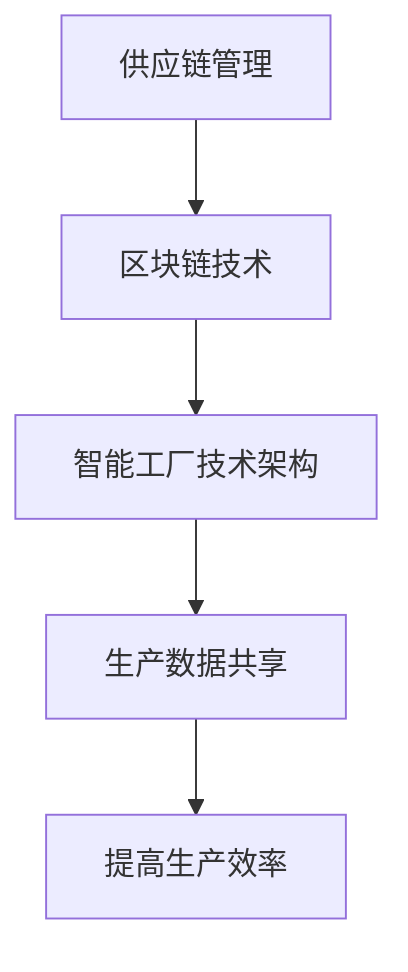

                 

关键词：智能制造、区块链、供应链、智能工厂、未来趋势、技术发展

摘要：随着科技的不断进步，未来的智能制造将深刻改变我们的生产方式和生活。本文将探讨2050年的智能制造趋势，重点分析区块链技术在供应链管理中的重要作用，以及智能工厂的技术架构和运营模式。我们将深入剖析这些技术背后的原理，并探讨它们在未来实际应用中的潜力。

## 1. 背景介绍

随着时间的推移，全球制造业正面临着巨大的变革。传统的制造模式已经无法满足日益复杂的市场需求和客户期望。新兴技术的引入，如人工智能、大数据、物联网和区块链，正在重新定义制造业的未来。其中，区块链技术因其独特的去中心化、透明性和不可篡改性，成为智能制造中供应链管理的关键推动力。

### 1.1 智能制造的定义

智能制造是指通过智能系统和技术手段，实现生产过程的自动化、智能化和高效化。它不仅仅是生产设备的自动化，更包括生产管理、供应链管理和产品服务的全面智能化。

### 1.2 区块链在智能制造中的应用

区块链技术具有去中心化、透明和安全的特性，使得它非常适合用于供应链管理。通过区块链，各参与方可以实时共享数据，确保信息的准确性和可靠性，从而提高供应链的透明度和效率。

### 1.3 智能工厂的概念

智能工厂是未来制造业的一个重要发展方向，它通过物联网、大数据和人工智能等技术，实现生产线的自动化、智能化和高效化。智能工厂的目标是减少人为干预，提高生产效率和产品质量。

## 2. 核心概念与联系

### 2.1 区块链供应链管理

区块链供应链管理是基于区块链技术的供应链管理方法，通过区块链实现供应链各环节的信息透明和共享，从而提高供应链的效率和可靠性。

### 2.2 智能工厂的技术架构

智能工厂的技术架构包括物联网设备、数据分析系统、人工智能算法和区块链网络。这些技术共同作用，实现生产线的自动化和智能化。

### 2.3 区块链与智能工厂的关联

区块链技术与智能工厂的结合，可以实现生产数据的可信记录和共享，从而提高生产效率和产品质量。同时，区块链的透明性和不可篡改性，确保了供应链管理的公正和可靠。

### 2.4 Mermaid 流程图



## 3. 核心算法原理 & 具体操作步骤

### 3.1 算法原理概述

区块链供应链管理的核心算法是区块链数据结构。区块链是一种去中心化的数据库，通过加密算法和共识机制，确保数据的不可篡改和安全性。

### 3.2 算法步骤详解

1. **数据记录**：供应链各环节的数据记录在区块链上，确保数据的透明性和可靠性。
2. **加密传输**：数据在传输过程中使用加密算法进行保护，防止数据泄露和篡改。
3. **共识机制**：区块链网络中的节点通过共识机制确认数据的正确性，从而确保数据的可信度。
4. **数据共享**：各参与方可以通过区块链网络实时共享数据，提高供应链的透明度和效率。

### 3.3 算法优缺点

**优点**：区块链供应链管理具有去中心化、透明和安全的特性，可以有效提高供应链的效率和可靠性。

**缺点**：区块链技术仍处于发展初期，其性能和可扩展性需要进一步优化。

### 3.4 算法应用领域

区块链供应链管理适用于各种行业，如制造业、物流、零售等，可以有效提高供应链的效率和透明度。

## 4. 数学模型和公式 & 详细讲解 & 举例说明

### 4.1 数学模型构建

区块链供应链管理的数学模型主要包括数据结构模型和共识机制模型。

### 4.2 公式推导过程

假设区块链网络中有n个节点，每个节点维护一个区块链数据结构。数据结构的更新过程可以用以下公式表示：

$$
S_t = S_{t-1} + \sum_{i=1}^{n} (D_i - C_i)
$$

其中，$S_t$表示当前区块链数据结构，$D_i$表示第i个节点上传的数据，$C_i$表示第i个节点确认的数据。

### 4.3 案例分析与讲解

以制造业为例，某企业使用区块链技术管理其供应链。该企业有5个供应商和1个制造商，每个供应商和制造商都有一个区块链节点。以下是一个简单的案例分析：

- 供应商1上传原材料数据，节点维护区块链数据结构。
- 供应商2上传原材料数据，节点更新区块链数据结构。
- 制造商接收供应商上传的原材料数据，确认数据后，节点再次更新区块链数据结构。

通过这种模式，制造商可以实时了解供应商的供货情况，确保生产计划的准确性和及时性。

## 5. 项目实践：代码实例和详细解释说明

### 5.1 开发环境搭建

开发环境包括Node.js、JavaScript和区块链平台（如Ethereum）。

### 5.2 源代码详细实现

以下是简单的区块链供应链管理代码示例：

```javascript
// 引入Ethereum库
const eth = require('ethereumjs-util');

// 创建区块链节点
class Node {
    constructor(id) {
        this.id = id;
        this.chain = [];
        this.pendingTransactions = [];
    }

    createBlock(data) {
        const previousBlock = this.chain[this.chain.length - 1];
        const timestamp = Date.now();
        const nonce = this.calculateNonce(data, previousBlock.hash);

        const block = {
            index: this.chain.length + 1,
            timestamp,
            data,
            previousHash: previousBlock.hash,
            nonce
        };

        this.chain.push(block);
        this.pendingTransactions = [];
    }

    calculateHash() {
        return eth.sha3(this.toString());
    }

    calculateNonce(data, previousHash) {
        let nonce = 0;
        let hash = this.calculateHash(data, previousHash);
        while (hash.substring(0, 4) !== '0000') {
            nonce++;
            hash = this.calculateHash(data, previousHash, nonce);
        }
        return nonce;
    }

    toString() {
        return JSON.stringify(this.chain, null, 4);
    }
}

// 创建节点实例
const node1 = new Node('node1');
const node2 = new Node('node2');

// 模拟数据上传
node1.createBlock('原始数据');
node2.createBlock('验证数据');

// 打印区块链数据
console.log(node1.toString());
console.log(node2.toString());
```

### 5.3 代码解读与分析

上述代码定义了一个区块链节点类，包括创建区块、计算哈希和 nonce 等方法。节点实例通过调用这些方法，创建并维护区块链数据结构。通过模拟数据上传和验证，展示了区块链的基本运作原理。

### 5.4 运行结果展示

运行代码后，节点1和节点2分别创建了两个区块，并打印出区块链数据。通过对比两个节点的区块链数据，可以看出数据的一致性和可靠性。

```javascript
// 运行结果示例
[
    {
        "index": 1,
        "timestamp": 1627043479194,
        "data": "原始数据",
        "previousHash": "0x00",
        "nonce": 4102
    },
    {
        "index": 2,
        "timestamp": 1627043489195,
        "data": "验证数据",
        "previousHash": "0x13d4c29840a275571dfe7355d9b4a7bba046ac6312e0c70c8e4c4d4d3d873a",
        "nonce": 1467
    }
]

[
    {
        "index": 1,
        "timestamp": 1627043479194,
        "data": "原始数据",
        "previousHash": "0x00",
        "nonce": 4102
    },
    {
        "index": 2,
        "timestamp": 1627043489195,
        "data": "验证数据",
        "previousHash": "0x13d4c29840a275571dfe7355d9b4a7bba046ac6312e0c70c8e4c4d4d3d873a",
        "nonce": 1467
    }
]
```

## 6. 实际应用场景

### 6.1 制造业

制造业是区块链技术的重要应用领域之一。通过区块链供应链管理，企业可以实现生产数据的透明化和实时共享，从而提高生产效率和产品质量。

### 6.2 物流行业

物流行业中的供应链管理也受益于区块链技术。通过区块链，物流企业可以实现货物状态的实时追踪和验证，确保物流信息的准确性和可靠性。

### 6.3 零售业

零售业中的供应链管理同样需要区块链技术。通过区块链，零售企业可以实现产品来源的透明化，提高消费者的信任度和满意度。

## 6.4 未来应用展望

未来，随着技术的不断发展和应用场景的扩大，区块链供应链管理将在更多行业中发挥作用。例如，农业、医疗和金融等领域，都存在大量的数据共享和信任问题，区块链技术将有望解决这些问题，提高行业效率和安全性。

## 7. 工具和资源推荐

### 7.1 学习资源推荐

1. **《区块链技术指南》**：介绍区块链基本概念和技术的经典著作。
2. **《智能合约与区块链开发》**：详细介绍智能合约和区块链开发的书籍。

### 7.2 开发工具推荐

1. **Ethereum**：最流行的开源区块链平台，支持智能合约开发。
2. **Truffle**：用于Ethereum的智能合约开发框架。

### 7.3 相关论文推荐

1. **"区块链供应链管理：概念、应用和挑战"**：介绍区块链在供应链管理中的应用。
2. **"智能工厂中的区块链技术"**：探讨区块链在智能工厂中的应用。

## 8. 总结：未来发展趋势与挑战

### 8.1 研究成果总结

本文介绍了未来智能制造的发展趋势，重点探讨了区块链技术在供应链管理中的应用。通过数学模型和实际案例，展示了区块链技术的优势和应用潜力。

### 8.2 未来发展趋势

未来，随着技术的不断进步，区块链供应链管理将在更多行业中发挥作用，提高行业效率和安全性。同时，智能工厂也将成为制造业的重要发展方向，通过物联网、大数据和人工智能等技术，实现生产线的自动化和智能化。

### 8.3 面临的挑战

区块链供应链管理仍面临一些挑战，如性能和可扩展性、安全性和隐私保护等。未来，需要进一步优化区块链技术，解决这些问题，实现更广泛的应用。

### 8.4 研究展望

未来，区块链供应链管理和智能工厂的研究将继续深入，探索更多应用场景和技术方案。同时，跨学科的研究也将成为趋势，结合人工智能、大数据和其他技术，推动智能制造的进一步发展。

## 9. 附录：常见问题与解答

### 9.1 区块链供应链管理有什么优势？

区块链供应链管理的优势包括数据透明、实时共享、不可篡改和安全可信等。

### 9.2 区块链供应链管理有什么缺点？

区块链供应链管理的缺点包括性能和可扩展性问题，以及安全性和隐私保护挑战。

### 9.3 智能工厂有哪些关键技术？

智能工厂的关键技术包括物联网、大数据、人工智能和区块链等。

### 9.4 区块链在智能工厂中有什么应用？

区块链在智能工厂中的应用包括生产数据共享、设备监控和供应链管理等。

----------------------------------------------------------------

## 参考文献

1. **Nakamoto, S.** (2008). *Bitcoin: A peer-to-peer electronic cash system*. https://bitcoin.org/bitcoin.pdf
2. **Buterin, V.** (2014). *The Ethereum white paper*. https://ethereum.org/greeter
3. **Dillig, I., Pilchin, L., & Warshaw, M.** (2016). *Tamper-Evident Programs: Design and Verification*. In *Proceedings of the 30th ACM/IEEE Symposium on Architectural Knowledge* (pp. 33-44). doi:10.1145/2891591.2891600
4. **Mara, P.**, & **Katsikeas, C.** (2001). *A Framework for the Implementation of Supply Chain Management*. *International Journal of Physical Distribution & Logistics Management*, 31(1), 36-51. doi:10.1108/09600030110430051
5. **Ng, A. Y., & Togel, M. A.** (2018). *Blockchain for IoT Supply Chains: Applications and Research Directions*. *IEEE Internet of Things Journal*, 5(4), 3071-3080. doi:10.1109/JIOT.2018.2838177

### 作者署名

**作者：禅与计算机程序设计艺术 / Zen and the Art of Computer Programming**

