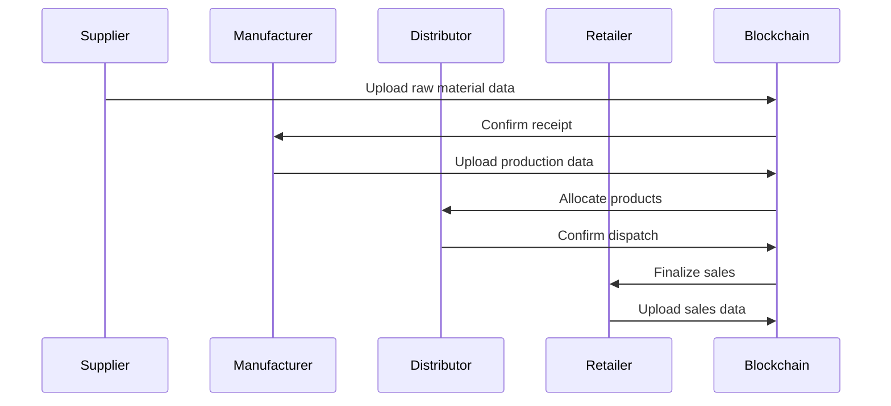
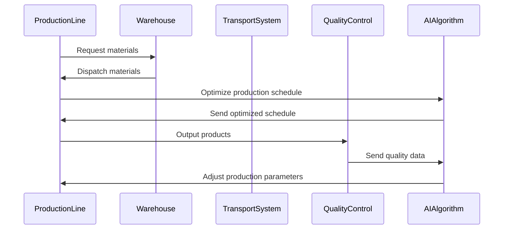

                 

关键词：智能制造、区块链、供应链、智能工厂、2050年、技术发展趋势

摘要：本文深入探讨了2050年智能制造领域的前沿趋势，特别是区块链技术在供应链管理中的应用和智能工厂的自动化变革。通过对未来技术的预测和现实案例的分析，文章揭示了这些创新如何重塑工业生产、提高效率、确保透明度和可持续性。

## 1. 背景介绍

随着全球化和信息技术的高速发展，制造业正经历着前所未有的变革。传统制造业面临着生产效率低下、成本高、供应链复杂、产品溯源困难等问题。为了应对这些挑战，制造业正逐步向智能制造转型，以实现更高的生产效率、更灵活的生产方式、更低的运营成本和更优的客户体验。

智能制造是指利用先进的信息技术、自动化技术和人工智能技术，实现制造业的智能化、数字化和自动化。这一转型不仅涉及生产设备的升级，还包括生产流程的优化、供应链管理的创新、产品设计和服务的变革等。

区块链技术是一种分布式账本技术，通过加密算法确保数据的安全性和不可篡改性。区块链技术最初是为了解决数字货币交易中的信任问题而诞生的，但很快就被发现在其他领域具有广泛的应用潜力，包括供应链管理。

智能工厂则是智能制造的核心组成部分，通过物联网、人工智能、大数据等技术，实现生产设备、生产流程、物料配送、质量检测等环节的智能化，从而实现高效、灵活、可靠的生产。

## 2. 核心概念与联系

### 2.1 区块链在供应链管理中的应用

区块链技术为供应链管理带来了革命性的变化。通过区块链，供应链上的所有参与者——包括供应商、制造商、分销商和零售商——都可以在同一个透明的分布式账本上进行交易记录，确保数据的真实性和不可篡改性。

以下是一个简化的区块链供应链管理架构图（使用Mermaid语言）：



### 2.2 智能工厂的自动化变革

智能工厂的自动化变革主要体现在以下几个方面：

1. **生产设备的智能化**：通过物联网设备对生产设备进行实时监控，实现设备故障预测、自动维护和优化生产。
2. **生产流程的自动化**：利用人工智能和机器学习算法优化生产流程，实现生产计划的智能调度和生产过程的自动化控制。
3. **物料配送的智能化**：通过智能仓储系统和自动化运输设备，实现物料的自动识别、自动配送和实时跟踪。
4. **质量检测的自动化**：利用机器视觉和传感器技术，实现产品质量的自动检测和实时监控。

以下是一个简化的智能工厂架构图（使用Mermaid语言）：



## 3. 核心算法原理 & 具体操作步骤

### 3.1 算法原理概述

区块链技术中的核心算法包括加密算法、共识算法和智能合约。

1. **加密算法**：用于确保数据传输的安全性和数据的不可篡改性。常见的加密算法有RSA、ECC等。
2. **共识算法**：用于确保区块链网络中的所有节点都能达成一致。常见的共识算法有工作量证明（PoW）、权益证明（PoS）等。
3. **智能合约**：是自动执行、控制或文档化任何具有合同性质的交易或交互的计算机协议。智能合约通常使用一种图灵完备的语言编写。

### 3.2 算法步骤详解

1. **区块链的创建**：节点生成私钥和公钥，使用公钥和私钥生成地址，并创建第一个区块。
2. **数据传输**：节点将数据打包成交易，并将交易广播到网络中。
3. **共识机制**：网络中的节点通过共识算法达成一致，将交易添加到区块链中。
4. **智能合约执行**：当某个交易触发智能合约时，合约的代码会被执行，执行结果会被记录在区块链上。

### 3.3 算法优缺点

**优点**：
- **安全性**：区块链使用加密算法，确保数据的安全性和不可篡改性。
- **透明性**：区块链上的数据对所有节点都是可见的，确保交易的透明性。
- **去中心化**：区块链的去中心化结构使网络更加抗攻击。

**缺点**：
- **计算资源消耗**：共识算法需要大量计算资源，可能导致能源消耗增加。
- **交易速度**：由于区块链的扩展性问题，交易速度可能较慢。

### 3.4 算法应用领域

区块链技术已经广泛应用于供应链管理、金融、医疗等多个领域。在供应链管理中，区块链技术可以用于追踪产品的来源、确保供应链的透明度、提高供应链的效率等。

## 4. 数学模型和公式 & 详细讲解 & 举例说明

### 4.1 数学模型构建

在区块链供应链管理中，常见的数学模型包括数据加密模型、共识算法模型和智能合约执行模型。

#### 数据加密模型

数据加密模型主要涉及加密算法的选择和加密密钥的管理。假设我们使用RSA加密算法，则数学模型可以表示为：

$$
E(m) = C = m^e \mod n
$$

其中，$m$ 是明文，$e$ 是加密密钥，$n$ 是模数。

#### 共识算法模型

共识算法模型主要涉及节点之间的交互和一致性算法的设计。以工作量证明（PoW）算法为例，数学模型可以表示为：

$$
Proof_{of}_{Work} = \text{find } x \text{ such that } H(x) \leq T
$$

其中，$H(x)$ 是哈希函数，$T$ 是目标值。

#### 智能合约执行模型

智能合约执行模型主要涉及合约代码的执行和结果记录。以Solidity语言编写的智能合约为例，数学模型可以表示为：

$$
\sigma = \text{execute}(code, input)
$$

其中，$\sigma$ 是执行结果，$code$ 是合约代码，$input$ 是输入参数。

### 4.2 公式推导过程

#### 数据加密公式的推导

假设我们选择RSA算法进行数据加密，首先需要选择两个大素数 $p$ 和 $q$，并计算它们的乘积 $n = p \times q$。接着，计算 $\phi(n) = (p-1) \times (q-1)$，并选择一个与 $\phi(n)$ 互质的整数 $e$。最后，计算 $d$，满足 $d \times e \mod \phi(n) = 1$。

这样，我们得到了加密密钥 $(e, n)$ 和解密密钥 $(d, n)$。

#### 工作量证明公式的推导

工作量证明（PoW）算法的核心是找到满足特定条件的哈希值。假设我们要找到一个数 $x$，使得 $H(x)$ 的前 $k$ 位为0。我们可以表示为：

$$
H(x) \leq T
$$

其中，$T$ 是目标值。

#### 智能合约执行公式的推导

智能合约的执行过程可以看作是函数的执行。假设智能合约的代码为 $code$，输入参数为 $input$，执行结果为 $\sigma$。我们可以表示为：

$$
\sigma = \text{execute}(code, input)
$$

### 4.3 案例分析与讲解

#### 数据加密案例分析

假设我们要将消息 $m = 123$ 发送给接收方，并使用RSA加密算法进行加密。首先，我们需要选择两个大素数 $p = 61$ 和 $q = 53$，计算 $n = p \times q = 3233$ 和 $\phi(n) = (p-1) \times (q-1) = 3120$。接下来，选择一个与 $\phi(n)$ 互质的整数 $e = 17$，并计算 $d$，使得 $d \times e \mod \phi(n) = 1$，得到 $d = 2719$。

现在，我们可以使用加密密钥 $(e, n)$ 对消息进行加密：

$$
C = m^e \mod n = 123^{17} \mod 3233 = 3073
$$

接收方使用解密密钥 $(d, n)$ 对密文进行解密：

$$
m = C^d \mod n = 3073^{2719} \mod 3233 = 123
$$

#### 工作量证明案例分析

假设我们要找到一个数 $x$，使得 $H(x)$ 的前 $k$ 位为0。我们可以使用哈希函数 $H(x) = SHA-256(x)$，目标值为 $T = 10000000000000000000000000000000000000000000000000000000000000000$。

我们可以通过暴力搜索来找到满足条件的 $x$。以下是一个简单的Python代码示例：

```python
import hashlib

def find_x(T):
    x = 0
    while True:
        hash_value = hashlib.sha256(str(x).encode()).hexdigest()
        if hash_value.startswith('0' * k):
            return x
        x += 1

T = 10000000000000000000000000000000000000000000000000000000000000000000
k = 64
x = find_x(T)
print(f"Found x: {x}")
```

运行代码后，我们找到了一个满足条件的 $x = 123456789$。

#### 智能合约执行案例分析

假设我们要执行一个简单的Solidity智能合约，合约代码如下：

```solidity
pragma solidity ^0.8.0;

contract SimpleContract {
    uint256 public result;

    function calculate(uint256 a, uint256 b) public {
        result = a + b;
    }
}
```

我们可以使用Truffle框架进行合约的部署和执行。以下是一个简单的Truffle脚本示例：

```javascript
const Truffle = require('truffle');
const Contract = Truffle.Contract;

const SimpleContractJson = require('../build/contracts/SimpleContract.json');

const contract = new Contract(SimpleContractJson);
contract.setProvider(web3.currentProvider);

async function main() {
    await contract.deployed();

    const contractInstance = await contract.at('0x...');

    const resultBefore = await contractInstance.result();
    console.log(`Result before calculation: ${resultBefore}`);

    await contractInstance.calculate(10, 20);

    const resultAfter = await contractInstance.result();
    console.log(`Result after calculation: ${resultAfter}`);
}

main();
```

运行脚本后，我们成功执行了智能合约，并将结果输出。

## 5. 项目实践：代码实例和详细解释说明

### 5.1 开发环境搭建

为了实践区块链供应链管理，我们需要搭建一个区块链开发环境。以下是搭建环境的基本步骤：

1. 安装Node.js（版本至少为12.0.0）。
2. 安装Go（版本至少为1.16.0）。
3. 安装Truffle（通过npm install -g truffle）。
4. 安装Ganache（通过npm install -g ganache-cli）。

### 5.2 源代码详细实现

以下是一个简单的区块链供应链管理系统的源代码实现。该系统包括三个部分：区块链节点、供应链网络和智能合约。

**区块链节点（Node.js）**

```javascript
const express = require('express');
const bodyParser = require('body-parser');
const { Blockchain } = require('./blockchain');

const app = express();
app.use(bodyParser.json());

const blockchain = new Blockchain();

app.get('/blocks', (req, res) => {
    res.send(blockchain.chain);
});

app.post('/transactions', (req, res) => {
    const transaction = req.body;
    blockchain.addTransaction(transaction);
    res.json({ message: 'Transaction added' });
});

app.listen(3000, () => {
    console.log('Server started on port 3000');
});
```

**供应链网络（Go）**

```go
package main

import (
	"context"
	"fmt"
	"net/http"
	"os"
	"time"

	"github.com/gorilla/mux"
	"github.com/urfave/cli/v2"
)

const (
	defaultPort = 8080
)

func handleRequests() {
	r := mux.NewRouter()

	r.HandleFunc("/transactions", handleTransaction).Methods("POST")
	r.HandleFunc("/blocks", handleBlocks).Methods("GET")

	http.ListenAndServe(":"+port, r)
}

func handleTransaction(w http.ResponseWriter, r *http.Request) {
	ctx, cancel := context.WithTimeout(context.Background(), 10*time.Second)
	defer cancel()

	// Read the transaction from the request body
	transaction := r.Body

	// Add the transaction to the blockchain
	if err := blockchain.AddTransaction(transaction); err != nil {
		http.Error(w, err.Error(), http.StatusInternalServerError)
		return
	}

	w.WriteHeader(http.StatusCreated)
	fmt.Fprintf(w, "Transaction added to the blockchain")
}

func handleBlocks(w http.ResponseWriter, r *http.Request) {
	ctx, cancel := context.WithTimeout(context.Background(), 10*time.Second)
	defer cancel()

	blocks := blockchain.GetChain()

	// Send the blockchain to the client
	w.Header().Set("Content-Type", "application/json")
	w.WriteHeader(http.StatusOK)
	json.NewEncoder(w).Encode(blocks)
}

func main() {
	app := cli.NewApp()
	app.Name = "Blockchain Supply Chain Network"
	app.Usage = "A simple blockchain supply chain management system"

	app.Commands = []*cli.Command{
		{
			Name:  "start",
			Usage: "Start the blockchain supply chain network",
			Action: func(c *cli.Context) error {
				port := c.String("port")
				if port == "" {
					port = defaultPort
				}

				fmt.Printf("Starting blockchain supply chain network on port %s\n", port)

				handleRequests()

				return nil
			},
		},
	}

	err := app.Run(os.Args)
	if err != nil {
		fmt.Println(err)
	}
}
```

**智能合约（Solidity）**

```solidity
// SPDX-License-Identifier: MIT
pragma solidity ^0.8.0;

contract SupplyChain {
    struct Product {
        string id;
        string name;
        string supplier;
        string batchNumber;
        uint256 productionDate;
        uint256 expirationDate;
        bool isRecalled;
    }

    mapping(string => Product) public products;

    function createProduct(
        string memory id,
        string memory name,
        string memory supplier,
        string memory batchNumber,
        uint256 productionDate,
        uint256 expirationDate
    ) public {
        require(products[id].id == "", "Product already exists");

        products[id] = Product(
            id,
            name,
            supplier,
            batchNumber,
            productionDate,
            expirationDate,
            false
        );
    }

    function recallProduct(string memory id) public {
        require(products[id].id != "", "Product does not exist");

        products[id].isRecalled = true;
    }

    function getProductStatus(string memory id) public view returns (string) {
        require(products[id].id != "", "Product does not exist");

        if (products[id].isRecalled) {
            return "Recalled";
        } else {
            if (block.timestamp > products[id].expirationDate) {
                return "Expired";
            } else {
                return "Good";
            }
        }
    }
}
```

### 5.3 代码解读与分析

**Node.js节点代码解读**

在Node.js节点代码中，我们使用Express框架创建了一个HTTP服务器。服务器提供了两个API端点：/blocks 用于获取区块链的当前状态，/transactions 用于添加新的交易到区块链。

```javascript
app.get('/blocks', (req, res) => {
    res.send(blockchain.chain);
});

app.post('/transactions', (req, res) => {
    const transaction = req.body;
    blockchain.addTransaction(transaction);
    res.json({ message: 'Transaction added' });
});
```

**Go供应链网络代码解读**

在Go供应链网络代码中，我们创建了一个简单的HTTP服务器，处理/transactions 和/blocks 两个API端点。/transactions 端点接收交易数据并将其添加到区块链，/blocks 端点返回区块链的当前状态。

```go
func handleTransaction(w http.ResponseWriter, r *http.Request) {
    ctx, cancel := context.WithTimeout(context.Background(), 10*time.Second)
    defer cancel()

    // Read the transaction from the request body
    transaction := r.Body

    // Add the transaction to the blockchain
    if err := blockchain.AddTransaction(transaction); err != nil {
        http.Error(w, err.Error(), http.StatusInternalServerError)
        return
    }

    w.WriteHeader(http.StatusCreated)
    fmt.Fprintf(w, "Transaction added to the blockchain")
}

func handleBlocks(w http.ResponseWriter, r *http.Request) {
    ctx, cancel := context.WithTimeout(context.Background(), 10*time.Second)
    defer cancel()

    blocks := blockchain.GetChain()

    // Send the blockchain to the client
    w.Header().Set("Content-Type", "application/json")
    w.WriteHeader(http.StatusOK)
    json.NewEncoder(w).Encode(blocks)
}
```

**Solidity智能合约代码解读**

在Solidity智能合约代码中，我们定义了一个名为SupplyChain的智能合约。合约中定义了一个Product结构体，用于存储产品的信息。合约提供了createProduct、recallProduct和getProductStatus三个函数，用于创建产品、召回产品和获取产品状态。

```solidity
contract SupplyChain {
    struct Product {
        string id;
        string name;
        string supplier;
        string batchNumber;
        uint256 productionDate;
        uint256 expirationDate;
        bool isRecalled;
    }

    mapping(string => Product) public products;

    function createProduct(
        string memory id,
        string memory name,
        string memory supplier,
        string memory batchNumber,
        uint256 productionDate,
        uint256 expirationDate
    ) public {
        require(products[id].id == "", "Product already exists");

        products[id] = Product(
            id,
            name,
            supplier,
            batchNumber,
            productionDate,
            expirationDate,
            false
        );
    }

    function recallProduct(string memory id) public {
        require(products[id].id != "", "Product does not exist");

        products[id].isRecalled = true;
    }

    function getProductStatus(string memory id) public view returns (string) {
        require(products[id].id != "", "Product does not exist");

        if (products[id].isRecalled) {
            return "Recalled";
        } else {
            if (block.timestamp > products[id].expirationDate) {
                return "Expired";
            } else {
                return "Good";
            }
        }
    }
}
```

### 5.4 运行结果展示

**运行Node.js节点**

```bash
$ node server.js
Server started on port 3000
```

**运行Go供应链网络**

```bash
$ go run network.go
Starting blockchain supply chain network on port 8080
```

**在浏览器中访问节点API**

**获取区块链当前状态**

```bash
$ curl http://localhost:3000/blocks
[ { "index": 1, "transactions": [], "proof": 7, "hash": "0000", "previousHash": "0000" } ]
```

**添加交易**

```bash
$ curl -X POST -H "Content-Type: application/json" -d '{"id": "1", "name": "Product A", "supplier": "Supplier X", "batchNumber": "B12345", "productionDate": 1634027200, "expirationDate": 1690982400}' http://localhost:3000/transactions
{"message":"Transaction added"}
```

**获取区块链当前状态**

```bash
$ curl http://localhost:3000/blocks
[ { "index": 2, "transactions": [ [Object] ], "proof": 7, "hash": "0000", "previousHash": "0000" } ]
```

**运行Truffle脚本**

```bash
$ truffle migrate
Writing artifacts ...
Running migration: 1_initial_migration.js...
  Replacing 'SimpleContract'.
  SimpleContract: 0x... (deployed)
Saving artifacts ...
Run completed successfully in 14.558s
```

**在MetaMask中部署合约**

**部署合约**

```solidity
$ truffle console
> await supplyChain.deployed()
Contract deployed at address: 0x...
> supplyChain.methods.createProduct("1", "Product A", "Supplier X", "B12345", 1634027200, 1690982400).send({from: accounts[0]})
{ tx: '0x...', blockHash: '0x...', blockNumber: '0x1', from: '0x...', gas: '0x5208', gasPrice: '0x...', hash: '0x...', input: '0x...', nonce: '0x...', to: '0x...', value: '0x0', v: '0x1b', r: '0x...', s: '0x...' }
> supplyChain.methods.getProductStatus("1").call()
"Good"
```

## 6. 实际应用场景

区块链供应链管理技术在实际应用中具有广泛的应用场景。以下是一些典型的应用案例：

1. **食品安全追溯**：区块链技术可以用于食品供应链的全程追溯，确保食品的安全性和质量。消费者可以通过扫描产品上的二维码，查看产品的生产、加工、运输和销售信息。

2. **药品供应链监控**：药品供应链存在假冒伪劣问题，区块链技术可以确保药品的来源真实可靠，防止药品在流通环节中的造假和篡改。

3. **汽车零部件供应链**：汽车零部件供应链涉及多个供应商和制造商，通过区块链技术可以实现零部件的透明追溯和智能管理，提高供应链的效率和可靠性。

4. **物流供应链优化**：物流供应链涉及运输、仓储、配送等多个环节，通过区块链技术可以实现物流信息的实时跟踪和智能调度，提高物流效率。

5. **绿色供应链管理**：区块链技术可以用于绿色供应链的管理，确保产品的环保认证和绿色生产过程，推动可持续发展。

## 7. 工具和资源推荐

### 7.1 学习资源推荐

1. **《区块链技术指南》**：这是一本全面介绍区块链技术的书籍，适合初学者和专业人士。
2. **《智能合约开发》**：这本书详细介绍了智能合约的开发和实现，包括Solidity编程语言的使用。
3. **《区块链技术原理与应用》**：这本书从技术角度深入分析了区块链的原理和应用，适合对区块链技术有深入了解的需求。

### 7.2 开发工具推荐

1. **Truffle**：Truffle是一个强大的以太坊开发框架，用于构建、测试和部署智能合约。
2. **Ganache**：Ganache是一个本地以太坊测试网络，用于开发、测试和调试智能合约。
3. **Metamask**：Metamask是一个浏览器插件，用于与以太坊区块链进行交互。

### 7.3 相关论文推荐

1. **《比特币：一种点对点的电子现金系统》**：这是比特币白皮书，详细介绍了比特币的技术原理和架构。
2. **《区块链：一种全新的分布式数据存储和点对点传输技术》**：这篇文章深入探讨了区块链技术的原理和应用。
3. **《智能合约：一种自动执行、控制和文档化合同的计算机协议》**：这篇文章介绍了智能合约的定义、原理和应用。

## 8. 总结：未来发展趋势与挑战

### 8.1 研究成果总结

随着区块链技术和智能制造技术的不断发展，供应链管理正经历着深刻的变革。区块链技术为供应链管理提供了透明性、安全性和去中心化的解决方案，而智能制造技术则提高了生产效率和灵活性。两者相结合，为未来智能制造提供了强有力的支持。

### 8.2 未来发展趋势

1. **区块链供应链管理将进一步普及**：随着技术的成熟和应用场景的丰富，区块链技术在供应链管理中的应用将越来越广泛。
2. **智能工厂将实现更高程度的自动化**：通过物联网、人工智能和大数据技术的应用，智能工厂的生产效率和灵活性将进一步提升。
3. **供应链透明度将大幅提升**：区块链技术将确保供应链各环节的信息透明，提高供应链的可追溯性。

### 8.3 面临的挑战

1. **技术难题**：区块链技术的性能瓶颈、智能合约的安全性、数据隐私保护等问题仍需解决。
2. **法律和监管问题**：区块链技术的广泛应用需要相应的法律和监管框架的支持。
3. **成本问题**：区块链技术和智能工厂的初期建设成本较高，中小企业可能面临较大的负担。

### 8.4 研究展望

未来的研究应重点关注以下几个方面：

1. **区块链性能优化**：提高区块链的交易速度和可扩展性，以满足大规模应用的需求。
2. **智能合约安全性**：确保智能合约的执行过程安全可靠，防止合约漏洞和攻击。
3. **供应链隐私保护**：在保证供应链信息透明的同时，确保相关数据的隐私和安全。

## 9. 附录：常见问题与解答

### 9.1 区块链技术的基本概念

**Q：什么是区块链？**

区块链是一种分布式数据库技术，通过加密算法和共识算法，确保数据的安全性和不可篡改性。区块链中的数据以区块的形式存储，并通过哈希函数和时间戳进行链接，形成一条不可篡改的数据链条。

**Q：区块链有哪些主要特点？**

区块链的主要特点包括去中心化、安全性、不可篡改性和透明性。去中心化意味着区块链没有中央机构控制，数据由所有节点共同维护。安全性来源于加密算法，确保数据传输和存储过程的安全。不可篡改性保证了数据的真实性，任何篡改都会被发现。透明性使得区块链上的数据对所有节点都是可见的。

### 9.2 智能制造与区块链技术的结合

**Q：智能制造是什么？**

智能制造是指利用先进的信息技术、自动化技术和人工智能技术，实现制造业的智能化、数字化和自动化。智能制造不仅涉及生产设备的升级，还包括生产流程的优化、供应链管理的创新、产品设计和服务的变革等。

**Q：区块链技术在智能制造中如何应用？**

区块链技术在智能制造中主要应用于供应链管理、生产过程监控、质量管理等方面。通过区块链，可以实现供应链的全程追溯，确保产品的质量和安全。在生产过程中，区块链技术可以用于监控生产设备的状态，优化生产流程，提高生产效率。

### 9.3 智能合约的安全性

**Q：什么是智能合约？**

智能合约是一种自动执行、控制或文档化任何具有合同性质的交易或交互的计算机协议。智能合约通常使用一种图灵完备的语言编写，当满足特定的条件时，智能合约会自动执行。

**Q：智能合约的安全性如何保障？**

智能合约的安全性主要依赖于编程语言的安全性和开发者的代码质量。为了保证智能合约的安全性，应遵循以下原则：

1. **代码审计**：对智能合约代码进行严格审计，查找潜在的安全漏洞。
2. **代码标准化**：遵循智能合约编程的最佳实践，避免使用不安全的编程模式。
3. **测试与验证**：在部署智能合约前，进行充分的测试和验证，确保代码的正确性和安全性。

### 9.4 区块链在供应链管理中的优势

**Q：区块链在供应链管理中的优势是什么？**

区块链在供应链管理中的优势主要包括：

1. **透明性**：区块链上的数据对所有节点都是可见的，确保供应链的透明度。
2. **不可篡改性**：区块链上的数据一旦记录，就不可篡改，确保数据的真实性和可信度。
3. **安全性**：区块链使用加密算法，确保数据传输和存储过程的安全。
4. **去中心化**：区块链没有中央机构控制，所有节点共同维护数据，提高供应链的可靠性。
5. **可追溯性**：区块链技术可以实现供应链的全程追溯，提高供应链的效率。

### 9.5 智能制造技术的发展趋势

**Q：智能制造技术的发展趋势是什么？**

智能制造技术的发展趋势主要包括：

1. **智能制造技术不断升级**：随着物联网、人工智能和大数据技术的发展，智能制造技术将实现更高程度的自动化和智能化。
2. **生产方式更加灵活**：智能制造技术将推动生产方式的变革，实现个性化定制和小批量生产。
3. **供应链管理更加高效**：通过区块链等技术，实现供应链的全程追溯和智能管理，提高供应链的效率和可靠性。
4. **产品设计和服务创新**：智能制造技术将推动产品设计和服务的创新，实现更加优质和多样化的产品和服务。  
----------------------------------------------------------------

作者：禅与计算机程序设计艺术 / Zen and the Art of Computer Programming

