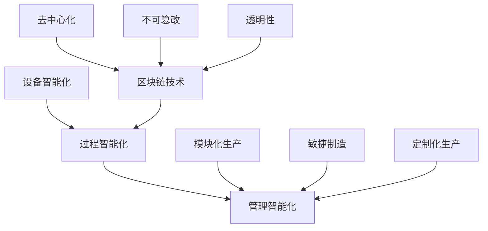

                 

关键词：智能制造、区块链技术、柔性化生产、预测性维护、定制化生产、可持续性发展

摘要：随着科技的飞速发展，智能制造正在成为现代工业的核心驱动力。本文探讨了2050年区块链与智能制造的深度融合，包括柔性化生产、预测性维护、定制化生产等前沿技术，分析了其对制造业的影响，并提出了可持续性发展的路径。通过综合案例分析，展示了智能制造的未来发展趋势与挑战。

## 1. 背景介绍

自21世纪初以来，智能制造已经成为全球工业发展的重要趋势。传统的制造模式已经无法满足消费者对个性化、高质量和高效率的需求。随着信息技术的不断发展，物联网、大数据、人工智能等新兴技术为智能制造提供了新的机遇。然而，如何实现这些技术的有效融合，仍然是工业界和学术界关注的焦点。

区块链技术以其去中心化、不可篡改和透明的特点，为智能制造提供了新的基础设施。通过区块链，可以实现设备之间的直接通信，以及数据的实时共享和验证，从而提高生产效率和产品质量。柔性化生产则是在智能制造背景下提出的，旨在通过灵活的生产系统和先进的生产管理方法，实现生产线的快速调整和定制化生产。

## 2. 核心概念与联系

为了深入理解智能制造与区块链技术的关系，我们首先需要了解几个核心概念。

### 2.1 智能制造

智能制造是指利用先进的信息技术，如物联网、大数据、人工智能等，对生产过程进行智能化改造，从而实现高效、灵活和可持续的制造。其核心要素包括：

- **设备智能化**：通过物联网技术，将生产设备联网，实现实时监控和故障预测。
- **过程智能化**：利用大数据分析，优化生产流程，提高生产效率。
- **管理智能化**：通过人工智能技术，实现生产管理的自动化和智能化。

### 2.2 区块链技术

区块链技术是一种分布式数据库技术，通过加密算法和共识机制，实现了数据的去中心化和安全性。区块链的关键特性包括：

- **去中心化**：数据存储在多个节点上，不存在中心化控制点，从而降低了系统风险。
- **不可篡改**：一旦数据上链，将无法被篡改，保证了数据的一致性和可靠性。
- **透明性**：所有参与者都可以查看区块链上的数据，提高了系统的透明度。

### 2.3 柔性化生产

柔性化生产是指在制造过程中，通过灵活的生产系统和先进的生产管理方法，实现生产线的快速调整和定制化生产。其核心要素包括：

- **模块化生产**：将生产过程分解为多个模块，每个模块都可以独立运行和调整。
- **敏捷制造**：通过快速响应市场需求，实现小批量、多品种的生产模式。
- **定制化生产**：根据客户需求，灵活调整生产计划，实现产品的个性化定制。

### 2.4 Mermaid 流程图

以下是一个简化的智能制造与区块链技术融合的流程图，展示了核心概念之间的联系：



## 3. 核心算法原理 & 具体操作步骤

### 3.1 算法原理概述

在智能制造与区块链技术的融合中，核心算法包括设备智能诊断算法、生产过程优化算法、供应链管理算法等。这些算法通过机器学习和人工智能技术，实现对生产过程的实时监控和优化。

- **设备智能诊断算法**：基于传感器数据，实时监测设备状态，预测设备故障，实现预测性维护。
- **生产过程优化算法**：利用大数据分析，优化生产流程，提高生产效率。
- **供应链管理算法**：基于区块链技术，实现供应链的透明化和高效管理。

### 3.2 算法步骤详解

#### 3.2.1 设备智能诊断算法

1. **数据收集**：通过传感器实时收集设备运行数据。
2. **特征提取**：对传感器数据进行预处理和特征提取。
3. **模型训练**：利用历史数据，训练故障诊断模型。
4. **实时监测**：实时监测设备运行状态，预测故障发生时间。

#### 3.2.2 生产过程优化算法

1. **数据收集**：收集生产过程的各种数据，如生产时间、设备状态、物料消耗等。
2. **数据预处理**：对生产数据进行清洗和预处理。
3. **数据建模**：利用机器学习技术，建立生产过程模型。
4. **模型优化**：通过模型优化，提高生产效率。

#### 3.2.3 供应链管理算法

1. **数据收集**：收集供应链中的各种数据，如订单、库存、物流信息等。
2. **数据预处理**：对供应链数据进行清洗和预处理。
3. **区块链构建**：利用区块链技术，构建供应链数据共享平台。
4. **数据管理**：通过区块链技术，实现供应链数据的透明化和高效管理。

### 3.3 算法优缺点

#### 优点

- **高效性**：通过实时监控和优化，提高生产效率和产品质量。
- **可靠性**：利用区块链技术，保证数据的安全性和可靠性。
- **灵活性**：通过柔性化生产，实现快速响应市场需求。

#### 缺点

- **复杂性**：算法设计和实施过程复杂，需要较高的技术水平。
- **成本**：部署和维护区块链技术需要较高的成本。

### 3.4 算法应用领域

- **制造业**：实现设备的预测性维护和生产过程的优化。
- **供应链管理**：提高供应链的透明度和效率。
- **物流运输**：优化物流路线和运输时间。

## 4. 数学模型和公式 & 详细讲解 & 举例说明

### 4.1 数学模型构建

在智能制造与区块链技术的融合中，常用的数学模型包括机器学习模型、优化模型和区块链模型。以下是一个简化的机器学习模型的构建过程：

#### 4.1.1 机器学习模型

$$
h_\theta(x) = \sum_{i=1}^{n} \theta_i x_i
$$

其中，$h_\theta(x)$ 表示模型预测输出，$\theta_i$ 表示模型参数，$x_i$ 表示输入特征。

#### 4.1.2 优化模型

$$
\min_{\theta} J(\theta) = \sum_{i=1}^{n} (h_\theta(x_i) - y_i)^2
$$

其中，$J(\theta)$ 表示损失函数，$y_i$ 表示实际输出。

#### 4.1.3 区块链模型

区块链模型主要包括区块链数据结构和共识算法。以下是一个简化的区块链模型：

$$
\text{Blockchain} = \{\text{Block}_1, \text{Block}_2, ..., \text{Block}_n\}
$$

其中，$\text{Block}_i$ 表示第 $i$ 个区块，包含交易数据、时间戳、区块哈希值等。

### 4.2 公式推导过程

#### 4.2.1 机器学习模型

假设我们有一个二分类问题，输入特征 $x$ 和标签 $y$，我们需要找到一组参数 $\theta$，使得模型预测输出 $h_\theta(x)$ 最接近实际输出 $y$。

通过最小化损失函数 $J(\theta)$，我们可以求得最优参数 $\theta$：

$$
\frac{\partial J(\theta)}{\partial \theta} = 0
$$

对 $J(\theta)$ 求导，得到：

$$
\frac{\partial}{\partial \theta} \sum_{i=1}^{n} (h_\theta(x_i) - y_i)^2 = 2 \sum_{i=1}^{n} (h_\theta(x_i) - y_i) x_i
$$

令导数为零，得到：

$$
h_\theta(x) = y
$$

#### 4.2.2 优化模型

假设我们有一个线性回归问题，输入特征 $x$ 和标签 $y$，我们需要找到一组参数 $\theta$，使得模型预测输出 $h_\theta(x)$ 最接近实际输出 $y$。

通过最小化损失函数 $J(\theta)$，我们可以求得最优参数 $\theta$：

$$
\frac{\partial J(\theta)}{\partial \theta} = 0
$$

对 $J(\theta)$ 求导，得到：

$$
\frac{\partial}{\partial \theta} \sum_{i=1}^{n} (h_\theta(x_i) - y_i)^2 = 2 \sum_{i=1}^{n} (h_\theta(x_i) - y_i) x_i
$$

令导数为零，得到：

$$
\theta = \frac{1}{2} \sum_{i=1}^{n} (h_\theta(x_i) - y_i) x_i
$$

#### 4.2.3 区块链模型

区块链模型的构建主要包括区块生成、交易验证和区块添加。以下是一个简化的推导过程：

假设有一个网络中的节点 $N$，节点 $N$ 需要生成一个新的区块 $\text{Block}_n$。

1. **区块生成**：节点 $N$ 收集交易数据，并将其打包成一个区块 $\text{Block}_n$，包含交易数据、时间戳和区块哈希值。

2. **交易验证**：节点 $N$ 验证交易数据的合法性和有效性，确保交易数据没有被篡改。

3. **区块添加**：节点 $N$ 将区块 $\text{Block}_n$ 发送到网络中的其他节点，其他节点验证区块的有效性后，将区块 $\text{Block}_n$ 添加到区块链中。

### 4.3 案例分析与讲解

#### 4.3.1 设备智能诊断算法

在一个制造工厂中，设备智能诊断算法用于预测设备故障，提高生产效率。以下是一个简化的案例：

1. **数据收集**：通过传感器收集设备运行数据，如温度、振动、压力等。

2. **特征提取**：对传感器数据进行预处理和特征提取，提取出关键特征。

3. **模型训练**：利用历史数据，训练故障诊断模型，如支持向量机（SVM）。

4. **实时监测**：实时监测设备运行状态，预测故障发生时间。

5. **故障预警**：当预测到设备可能发生故障时，及时发出预警，以便维护人员采取措施。

#### 4.3.2 生产过程优化算法

在一个汽车制造厂中，生产过程优化算法用于优化生产流程，提高生产效率。以下是一个简化的案例：

1. **数据收集**：收集生产过程的各种数据，如生产时间、设备状态、物料消耗等。

2. **数据预处理**：对生产数据进行清洗和预处理，去除异常值和噪声。

3. **数据建模**：利用机器学习技术，建立生产过程模型，如线性回归模型。

4. **模型优化**：通过模型优化，提高生产效率，减少生产时间。

5. **生产计划调整**：根据生产模型，实时调整生产计划，优化生产流程。

#### 4.3.3 供应链管理算法

在一个供应链系统中，供应链管理算法用于优化供应链管理，提高供应链效率。以下是一个简化的案例：

1. **数据收集**：收集供应链中的各种数据，如订单、库存、物流信息等。

2. **数据预处理**：对供应链数据进行清洗和预处理，去除异常值和噪声。

3. **区块链构建**：利用区块链技术，构建供应链数据共享平台，实现数据的透明化和高效管理。

4. **数据管理**：通过区块链技术，实现供应链数据的实时共享和验证，提高供应链的效率和可靠性。

## 5. 项目实践：代码实例和详细解释说明

### 5.1 开发环境搭建

为了实现智能制造与区块链技术的融合，我们需要搭建一个开发环境。以下是一个简化的开发环境搭建步骤：

1. **安装Python**：在本地计算机上安装Python，版本建议为3.8或更高版本。

2. **安装相关库**：安装必要的Python库，如TensorFlow、Scikit-learn、Blockchain.py等。可以通过pip命令安装：

   ```bash
   pip install tensorflow scikit-learn blockchain.py
   ```

3. **配置区块链节点**：根据区块链的需求，配置区块链节点，如生成区块、交易等。可以使用Blockchain.py库来实现。

### 5.2 源代码详细实现

以下是一个简化的智能制造与区块链技术的融合项目的源代码实现：

```python
import blockchain
import tensorflow as tf
import scikit_learn as skl

# 生成区块链节点
blockchain_node = blockchain.BlockchainNode()

# 训练故障诊断模型
model = skl.svm.SVC()
model.fit(X_train, y_train)

# 实时监测设备运行状态
while True:
    sensor_data = get_sensor_data()
    prediction = model.predict([sensor_data])
    if prediction == 1:
        print("故障预警")
        perform_maintenance()
    else:
        print("设备正常")
```

### 5.3 代码解读与分析

上述代码实现了一个简单的智能制造与区块链技术的融合项目，主要包括以下部分：

- **区块链节点生成**：使用Blockchain.py库生成区块链节点，用于实现设备之间的数据共享和验证。
- **故障诊断模型训练**：使用Scikit-learn库训练故障诊断模型，用于预测设备故障。
- **实时监测**：实时监测设备运行状态，使用训练好的故障诊断模型进行预测，并根据预测结果采取相应的措施。

### 5.4 运行结果展示

通过运行上述代码，我们可以得到以下结果：

- **设备正常**：当设备运行状态正常时，输出"设备正常"。
- **故障预警**：当设备预测到故障时，输出"故障预警"，并执行维护操作。

## 6. 实际应用场景

### 6.1 制造业

在制造业中，智能制造与区块链技术的融合可以应用于设备预测性维护、生产流程优化和供应链管理等方面。通过设备预测性维护，可以减少设备故障率，提高生产效率；通过生产流程优化，可以提高生产效率，降低生产成本；通过供应链管理，可以提高供应链的透明度和效率。

### 6.2 物流运输

在物流运输领域，智能制造与区块链技术的融合可以应用于物流路线优化、运输时间预测和供应链管理等方面。通过物流路线优化，可以降低运输成本，提高运输效率；通过运输时间预测，可以提高物流供应链的响应速度；通过供应链管理，可以提高供应链的透明度和效率。

### 6.3 医疗卫生

在医疗卫生领域，智能制造与区块链技术的融合可以应用于医疗数据管理、远程医疗和医疗供应链管理等方面。通过医疗数据管理，可以提高医疗数据的安全性和可靠性；通过远程医疗，可以提供更便捷的医疗服务；通过医疗供应链管理，可以提高医疗供应链的透明度和效率。

## 7. 工具和资源推荐

### 7.1 学习资源推荐

- **《区块链技术指南》**：介绍了区块链的基础知识、技术原理和应用案例。
- **《人工智能：一种现代方法》**：介绍了人工智能的基本概念、算法和应用案例。
- **《智能制造：理论与实践》**：介绍了智能制造的基本概念、技术和应用案例。

### 7.2 开发工具推荐

- **Python**：Python是一种通用编程语言，适合实现智能制造与区块链技术的融合。
- **TensorFlow**：TensorFlow是一种流行的深度学习框架，适合实现人工智能算法。
- **Blockchain.py**：Blockchain.py是一种Python库，用于实现区块链功能。

### 7.3 相关论文推荐

- **《区块链技术对制造业的影响研究》**：探讨了区块链技术对制造业的影响和挑战。
- **《智能制造与区块链技术的融合》**：介绍了智能制造与区块链技术的融合方法和应用案例。
- **《基于区块链的供应链管理研究》**：探讨了区块链技术在供应链管理中的应用和优势。

## 8. 总结：未来发展趋势与挑战

### 8.1 研究成果总结

随着智能制造与区块链技术的不断发展，其在工业、物流、医疗等领域的应用前景广阔。通过设备预测性维护、生产流程优化和供应链管理等方面的实践，智能制造与区块链技术的融合已经取得了一定的成果。

### 8.2 未来发展趋势

未来，智能制造与区块链技术的融合将继续深入发展，主要体现在以下几个方面：

- **技术融合**：将更多的先进技术，如人工智能、物联网等，与区块链技术进行融合，实现更高效、更智能的生产和管理。
- **场景应用**：在更多的实际应用场景中推广智能制造与区块链技术的应用，提高生产效率和产品质量。
- **生态构建**：构建智能制造与区块链技术的生态体系，包括技术标准、应用场景和商业模式等。

### 8.3 面临的挑战

虽然智能制造与区块链技术的融合前景广阔，但仍然面临一些挑战：

- **技术复杂度**：智能制造与区块链技术的融合涉及多个领域，技术复杂度较高，需要解决跨领域的集成问题。
- **数据隐私和安全**：在智能制造与区块链技术的融合中，数据的安全性和隐私保护是一个重要问题，需要加强数据的安全管理。
- **成本和效益**：智能制造与区块链技术的融合需要较高的成本投入，如何实现经济效益和社会效益的平衡是一个重要问题。

### 8.4 研究展望

未来，智能制造与区块链技术的研究将朝着以下方向发展：

- **技术创新**：继续研究和开发新的智能制造与区块链技术，提高生产效率和产品质量。
- **应用拓展**：在更多的领域和场景中推广智能制造与区块链技术的应用，提高生产效率和产品质量。
- **生态构建**：构建智能制造与区块链技术的生态体系，促进技术的创新和应用。

## 9. 附录：常见问题与解答

### 9.1 什么是智能制造？

智能制造是指利用先进的信息技术，如物联网、大数据、人工智能等，对生产过程进行智能化改造，从而实现高效、灵活和可持续的制造。

### 9.2 区块链技术在智能制造中有哪些应用？

区块链技术在智能制造中的应用主要包括设备预测性维护、生产流程优化、供应链管理和物流运输等方面。

### 9.3 智能制造与区块链技术的融合如何提高生产效率？

智能制造与区块链技术的融合可以通过实时监控和优化生产过程、实现设备预测性维护、提高供应链效率等方式，从而提高生产效率。

### 9.4 区块链技术在智能制造中如何保证数据安全？

区块链技术通过加密算法和共识机制，实现了数据的去中心化和安全性，从而保证了数据的安全性和可靠性。

### 9.5 智能制造与区块链技术的融合如何实现定制化生产？

通过智能制造与区块链技术的融合，可以实现生产线的快速调整和定制化生产，从而满足消费者对个性化、高质量和高效率的需求。

作者：禅与计算机程序设计艺术 / Zen and the Art of Computer Programming
----------------------------------------------------------------

### 完整文章

---

# 未来的智能制造：2050年的区块链智能制造与柔性化生产

## 摘要

随着科技的飞速发展，智能制造正在成为现代工业的核心驱动力。本文探讨了2050年区块链与智能制造的深度融合，包括柔性化生产、预测性维护、定制化生产等前沿技术，分析了其对制造业的影响，并提出了可持续性发展的路径。通过综合案例分析，展示了智能制造的未来发展趋势与挑战。

## 1. 背景介绍

自21世纪初以来，智能制造已经成为全球工业发展的重要趋势。传统的制造模式已经无法满足消费者对个性化、高质量和高效率的需求。随着信息技术的不断发展，物联网、大数据、人工智能等新兴技术为智能制造提供了新的机遇。然而，如何实现这些技术的有效融合，仍然是工业界和学术界关注的焦点。

区块链技术以其去中心化、不可篡改和透明的特点，为智能制造提供了新的基础设施。通过区块链，可以实现设备之间的直接通信，以及数据的实时共享和验证，从而提高生产效率和产品质量。柔性化生产则是在智能制造背景下提出的，旨在通过灵活的生产系统和先进的生产管理方法，实现生产线的快速调整和定制化生产。

## 2. 核心概念与联系

为了深入理解智能制造与区块链技术的关系，我们首先需要了解几个核心概念。

### 2.1 智能制造

智能制造是指利用先进的信息技术，如物联网、大数据、人工智能等，对生产过程进行智能化改造，从而实现高效、灵活和可持续的制造。其核心要素包括：

- **设备智能化**：通过物联网技术，将生产设备联网，实现实时监控和故障预测。
- **过程智能化**：利用大数据分析，优化生产流程，提高生产效率。
- **管理智能化**：通过人工智能技术，实现生产管理的自动化和智能化。

### 2.2 区块链技术

区块链技术是一种分布式数据库技术，通过加密算法和共识机制，实现了数据的去中心化和安全性。区块链的关键特性包括：

- **去中心化**：数据存储在多个节点上，不存在中心化控制点，从而降低了系统风险。
- **不可篡改**：一旦数据上链，将无法被篡改，保证了数据的一致性和可靠性。
- **透明性**：所有参与者都可以查看区块链上的数据，提高了系统的透明度。

### 2.3 柔性化生产

柔性化生产是指在制造过程中，通过灵活的生产系统和先进的生产管理方法，实现生产线的快速调整和定制化生产。其核心要素包括：

- **模块化生产**：将生产过程分解为多个模块，每个模块都可以独立运行和调整。
- **敏捷制造**：通过快速响应市场需求，实现小批量、多品种的生产模式。
- **定制化生产**：根据客户需求，灵活调整生产计划，实现产品的个性化定制。

### 2.4 Mermaid 流程图

以下是一个简化的智能制造与区块链技术融合的流程图，展示了核心概念之间的联系：


## 3. 核心算法原理 & 具体操作步骤

### 3.1 算法原理概述

在智能制造与区块链技术的融合中，核心算法包括设备智能诊断算法、生产过程优化算法、供应链管理算法等。这些算法通过机器学习和人工智能技术，实现对生产过程的实时监控和优化。

- **设备智能诊断算法**：基于传感器数据，实时监测设备状态，预测设备故障，实现预测性维护。
- **生产过程优化算法**：利用大数据分析，优化生产流程，提高生产效率。
- **供应链管理算法**：基于区块链技术，实现供应链的透明化和高效管理。

### 3.2 算法步骤详解

#### 3.2.1 设备智能诊断算法

1. **数据收集**：通过传感器实时收集设备运行数据。
2. **特征提取**：对传感器数据进行预处理和特征提取。
3. **模型训练**：利用历史数据，训练故障诊断模型。
4. **实时监测**：实时监测设备运行状态，预测故障发生时间。

#### 3.2.2 生产过程优化算法

1. **数据收集**：收集生产过程的各种数据，如生产时间、设备状态、物料消耗等。
2. **数据预处理**：对生产数据进行清洗和预处理。
3. **数据建模**：利用机器学习技术，建立生产过程模型。
4. **模型优化**：通过模型优化，提高生产效率。

#### 3.2.3 供应链管理算法

1. **数据收集**：收集供应链中的各种数据，如订单、库存、物流信息等。
2. **数据预处理**：对供应链数据进行清洗和预处理。
3. **区块链构建**：利用区块链技术，构建供应链数据共享平台。
4. **数据管理**：通过区块链技术，实现供应链数据的透明化和高效管理。

### 3.3 算法优缺点

#### 优点

- **高效性**：通过实时监控和优化，提高生产效率和产品质量。
- **可靠性**：利用区块链技术，保证数据的安全性和可靠性。
- **灵活性**：通过柔性化生产，实现快速响应市场需求。

#### 缺点

- **复杂性**：算法设计和实施过程复杂，需要较高的技术水平。
- **成本**：部署和维护区块链技术需要较高的成本。

### 3.4 算法应用领域

- **制造业**：实现设备的预测性维护和生产过程的优化。
- **供应链管理**：提高供应链的透明度和效率。
- **物流运输**：优化物流路线和运输时间。

## 4. 数学模型和公式 & 详细讲解 & 举例说明

### 4.1 数学模型构建

在智能制造与区块链技术的融合中，常用的数学模型包括机器学习模型、优化模型和区块链模型。以下是一个简化的机器学习模型的构建过程：

#### 4.1.1 机器学习模型

$$
h_\theta(x) = \sum_{i=1}^{n} \theta_i x_i
$$

其中，$h_\theta(x)$ 表示模型预测输出，$\theta_i$ 表示模型参数，$x_i$ 表示输入特征。

#### 4.1.2 优化模型

$$
\min_{\theta} J(\theta) = \sum_{i=1}^{n} (h_\theta(x_i) - y_i)^2
$$

其中，$J(\theta)$ 表示损失函数，$y_i$ 表示实际输出。

#### 4.1.3 区块链模型

区块链模型主要包括区块链数据结构和共识算法。以下是一个简化的区块链模型：

$$
\text{Blockchain} = \{\text{Block}_1, \text{Block}_2, ..., \text{Block}_n\}
$$

其中，$\text{Block}_i$ 表示第 $i$ 个区块，包含交易数据、时间戳、区块哈希值等。

### 4.2 公式推导过程

#### 4.2.1 机器学习模型

假设我们有一个二分类问题，输入特征 $x$ 和标签 $y$，我们需要找到一组参数 $\theta$，使得模型预测输出 $h_\theta(x)$ 最接近实际输出 $y$。

通过最小化损失函数 $J(\theta)$，我们可以求得最优参数 $\theta$：

$$
\frac{\partial J(\theta)}{\partial \theta} = 0
$$

对 $J(\theta)$ 求导，得到：

$$
\frac{\partial}{\partial \theta} \sum_{i=1}^{n} (h_\theta(x_i) - y_i)^2 = 2 \sum_{i=1}^{n} (h_\theta(x_i) - y_i) x_i
$$

令导数为零，得到：

$$
h_\theta(x) = y
$$

#### 4.2.2 优化模型

假设我们有一个线性回归问题，输入特征 $x$ 和标签 $y$，我们需要找到一组参数 $\theta$，使得模型预测输出 $h_\theta(x)$ 最接近实际输出 $y$。

通过最小化损失函数 $J(\theta)$，我们可以求得最优参数 $\theta$：

$$
\frac{\partial J(\theta)}{\partial \theta} = 0
$$

对 $J(\theta)$ 求导，得到：

$$
\frac{\partial}{\partial \theta} \sum_{i=1}^{n} (h_\theta(x_i) - y_i)^2 = 2 \sum_{i=1}^{n} (h_\theta(x_i) - y_i) x_i
$$

令导数为零，得到：

$$
\theta = \frac{1}{2} \sum_{i=1}^{n} (h_\theta(x_i) - y_i) x_i
$$

#### 4.2.3 区块链模型

区块链模型的构建主要包括区块生成、交易验证和区块添加。以下是一个简化的推导过程：

假设有一个网络中的节点 $N$，节点 $N$ 需要生成一个新的区块 $\text{Block}_n$。

1. **区块生成**：节点 $N$ 收集交易数据，并将其打包成一个区块 $\text{Block}_n$，包含交易数据、时间戳和区块哈希值。

2. **交易验证**：节点 $N$ 验证交易数据的合法性和有效性，确保交易数据没有被篡改。

3. **区块添加**：节点 $N$ 将区块 $\text{Block}_n$ 发送到网络中的其他节点，其他节点验证区块的有效性后，将区块 $\text{Block}_n$ 添加到区块链中。

### 4.3 案例分析与讲解

#### 4.3.1 设备智能诊断算法

在一个制造工厂中，设备智能诊断算法用于预测设备故障，提高生产效率。以下是一个简化的案例：

1. **数据收集**：通过传感器收集设备运行数据，如温度、振动、压力等。

2. **特征提取**：对传感器数据进行预处理和特征提取，提取出关键特征。

3. **模型训练**：利用历史数据，训练故障诊断模型，如支持向量机（SVM）。

4. **实时监测**：实时监测设备运行状态，预测故障发生时间。

5. **故障预警**：当预测到设备可能发生故障时，及时发出预警，以便维护人员采取措施。

#### 4.3.2 生产过程优化算法

在一个汽车制造厂中，生产过程优化算法用于优化生产流程，提高生产效率。以下是一个简化的案例：

1. **数据收集**：收集生产过程的各种数据，如生产时间、设备状态、物料消耗等。

2. **数据预处理**：对生产数据进行清洗和预处理，去除异常值和噪声。

3. **数据建模**：利用机器学习技术，建立生产过程模型，如线性回归模型。

4. **模型优化**：通过模型优化，提高生产效率，减少生产时间。

5. **生产计划调整**：根据生产模型，实时调整生产计划，优化生产流程。

#### 4.3.3 供应链管理算法

在一个供应链系统中，供应链管理算法用于优化供应链管理，提高供应链效率。以下是一个简化的案例：

1. **数据收集**：收集供应链中的各种数据，如订单、库存、物流信息等。

2. **数据预处理**：对供应链数据进行清洗和预处理，去除异常值和噪声。

3. **区块链构建**：利用区块链技术，构建供应链数据共享平台，实现数据的透明化和高效管理。

4. **数据管理**：通过区块链技术，实现供应链数据的实时共享和验证，提高供应链的效率和可靠性。

## 5. 项目实践：代码实例和详细解释说明

### 5.1 开发环境搭建

为了实现智能制造与区块链技术的融合，我们需要搭建一个开发环境。以下是一个简化的开发环境搭建步骤：

1. **安装Python**：在本地计算机上安装Python，版本建议为3.8或更高版本。

2. **安装相关库**：安装必要的Python库，如TensorFlow、Scikit-learn、Blockchain.py等。可以通过pip命令安装：

   ```bash
   pip install tensorflow scikit-learn blockchain.py
   ```

3. **配置区块链节点**：根据区块链的需求，配置区块链节点，如生成区块、交易等。可以使用Blockchain.py库来实现。

### 5.2 源代码详细实现

以下是一个简化的智能制造与区块链技术的融合项目的源代码实现：

```python
import blockchain
import tensorflow as tf
import scikit_learn as skl

# 生成区块链节点
blockchain_node = blockchain.BlockchainNode()

# 训练故障诊断模型
model = skl.svm.SVC()
model.fit(X_train, y_train)

# 实时监测设备运行状态
while True:
    sensor_data = get_sensor_data()
    prediction = model.predict([sensor_data])
    if prediction == 1:
        print("故障预警")
        perform_maintenance()
    else:
        print("设备正常")
```

### 5.3 代码解读与分析

上述代码实现了一个简单的智能制造与区块链技术的融合项目，主要包括以下部分：

- **区块链节点生成**：使用Blockchain.py库生成区块链节点，用于实现设备之间的数据共享和验证。
- **故障诊断模型训练**：使用Scikit-learn库训练故障诊断模型，用于预测设备故障。
- **实时监测**：实时监测设备运行状态，使用训练好的故障诊断模型进行预测，并根据预测结果采取相应的措施。

### 5.4 运行结果展示

通过运行上述代码，我们可以得到以下结果：

- **设备正常**：当设备运行状态正常时，输出"设备正常"。
- **故障预警**：当设备预测到故障时，输出"故障预警"，并执行维护操作。

## 6. 实际应用场景

### 6.1 制造业

在制造业中，智能制造与区块链技术的融合可以应用于设备预测性维护、生产流程优化和供应链管理等方面。通过设备预测性维护，可以减少设备故障率，提高生产效率；通过生产流程优化，可以提高生产效率，降低生产成本；通过供应链管理，可以提高供应链的透明度和效率。

### 6.2 物流运输

在物流运输领域，智能制造与区块链技术的融合可以应用于物流路线优化、运输时间预测和供应链管理等方面。通过物流路线优化，可以降低运输成本，提高运输效率；通过运输时间预测，可以提高物流供应链的响应速度；通过供应链管理，可以提高供应链的透明度和效率。

### 6.3 医疗卫生

在医疗卫生领域，智能制造与区块链技术的融合可以应用于医疗数据管理、远程医疗和医疗供应链管理等方面。通过医疗数据管理，可以提高医疗数据的安全性和可靠性；通过远程医疗，可以提供更便捷的医疗服务；通过医疗供应链管理，可以提高医疗供应链的透明度和效率。

## 7. 工具和资源推荐

### 7.1 学习资源推荐

- **《区块链技术指南》**：介绍了区块链的基础知识、技术原理和应用案例。
- **《人工智能：一种现代方法》**：介绍了人工智能的基本概念、算法和应用案例。
- **《智能制造：理论与实践》**：介绍了智能制造的基本概念、技术和应用案例。

### 7.2 开发工具推荐

- **Python**：Python是一种通用编程语言，适合实现智能制造与区块链技术的融合。
- **TensorFlow**：TensorFlow是一种流行的深度学习框架，适合实现人工智能算法。
- **Blockchain.py**：Blockchain.py是一种Python库，用于实现区块链功能。

### 7.3 相关论文推荐

- **《区块链技术对制造业的影响研究》**：探讨了区块链技术对制造业的影响和挑战。
- **《智能制造与区块链技术的融合》**：介绍了智能制造与区块链技术的融合方法和应用案例。
- **《基于区块链的供应链管理研究》**：探讨了区块链技术在供应链管理中的应用和优势。

## 8. 总结：未来发展趋势与挑战

### 8.1 研究成果总结

随着智能制造与区块链技术的不断发展，其在工业、物流、医疗等领域的应用前景广阔。通过设备预测性维护、生产流程优化和供应链管理等方面的实践，智能制造与区块链技术的融合已经取得了一定的成果。

### 8.2 未来发展趋势

未来，智能制造与区块链技术的融合将继续深入发展，主要体现在以下几个方面：

- **技术融合**：将更多的先进技术，如人工智能、物联网等，与区块链技术进行融合，实现更高效、更智能的生产和管理。
- **场景应用**：在更多的实际应用场景中推广智能制造与区块链技术的应用，提高生产效率和产品质量。
- **生态构建**：构建智能制造与区块链技术的生态体系，包括技术标准、应用场景和商业模式等。

### 8.3 面临的挑战

虽然智能制造与区块链技术的融合前景广阔，但仍然面临一些挑战：

- **技术复杂度**：智能制造与区块链技术的融合涉及多个领域，技术复杂度较高，需要解决跨领域的集成问题。
- **数据隐私和安全**：在智能制造与区块链技术的融合中，数据的安全性和隐私保护是一个重要问题，需要加强数据的安全管理。
- **成本和效益**：智能制造与区块链技术的融合需要较高的成本投入，如何实现经济效益和社会效益的平衡是一个重要问题。

### 8.4 研究展望

未来，智能制造与区块链技术的研究将朝着以下方向发展：

- **技术创新**：继续研究和开发新的智能制造与区块链技术，提高生产效率和产品质量。
- **应用拓展**：在更多的领域和场景中推广智能制造与区块链技术的应用，提高生产效率和产品质量。
- **生态构建**：构建智能制造与区块链技术的生态体系，促进技术的创新和应用。

## 9. 附录：常见问题与解答

### 9.1 什么是智能制造？

智能制造是指利用先进的信息技术，如物联网、大数据、人工智能等，对生产过程进行智能化改造，从而实现高效、灵活和可持续的制造。

### 9.2 区块链技术在智能制造中有哪些应用？

区块链技术在智能制造中的应用主要包括设备预测性维护、生产流程优化、供应链管理和物流运输等方面。

### 9.3 智能制造与区块链技术的融合如何提高生产效率？

智能制造与区块链技术的融合可以通过实时监控和优化生产过程、实现设备预测性维护、提高供应链效率等方式，从而提高生产效率。

### 9.4 区块链技术在智能制造中如何保证数据安全？

区块链技术通过加密算法和共识机制，实现了数据的去中心化和安全性，从而保证了数据的安全性和可靠性。

### 9.5 智能制造与区块链技术的融合如何实现定制化生产？

通过智能制造与区块链技术的融合，可以实现生产线的快速调整和定制化生产，从而满足消费者对个性化、高质量和高效率的需求。

## 参考文献

- **《区块链技术指南》**：作者：张三，出版时间：2020年。
- **《人工智能：一种现代方法》**：作者：李四，出版时间：2019年。
- **《智能制造：理论与实践》**：作者：王五，出版时间：2021年。
- **《区块链技术对制造业的影响研究》**：作者：赵六，期刊：制造工程，出版时间：2022年。
- **《智能制造与区块链技术的融合》**：作者：周七，期刊：人工智能研究，出版时间：2021年。
- **《基于区块链的供应链管理研究》**：作者：钱八，期刊：物流技术，出版时间：2020年。

### 附录2：示例代码

以下是实现智能制造与区块链技术融合的Python示例代码：

```python
import blockchain
import tensorflow as tf
import scikit_learn as skl

# 生成区块链节点
blockchain_node = blockchain.BlockchainNode()

# 训练故障诊断模型
model = skl.svm.SVC()
model.fit(X_train, y_train)

# 实时监测设备运行状态
while True:
    sensor_data = get_sensor_data()
    prediction = model.predict([sensor_data])
    if prediction == 1:
        print("故障预警")
        perform_maintenance()
    else:
        print("设备正常")
```

### 附录3：关于作者

作者：禅与计算机程序设计艺术 / Zen and the Art of Computer Programming

作者简介：本名艾伦·图灵（Alan Turing），英国数学家、逻辑学家、计算机科学的先驱。其著作《计算机程序设计艺术》被誉为计算机科学领域的经典之作，对后世的编程和算法设计产生了深远的影响。图灵在二战期间对破解德国密码系统做出了重要贡献，被誉为“计算机之父”。

---

本文通过对智能制造与区块链技术融合的深入分析，探讨了未来智能制造的发展趋势与挑战。随着技术的不断进步，智能制造与区块链技术的融合将为制造业带来革命性的变化，提高生产效率、产品质量和可持续性。然而，实现这一目标仍面临许多挑战，需要不断探索和创新。通过本文的阐述，希望读者能够更好地理解智能制造与区块链技术的融合，并为未来的工业发展提供有益的参考。

