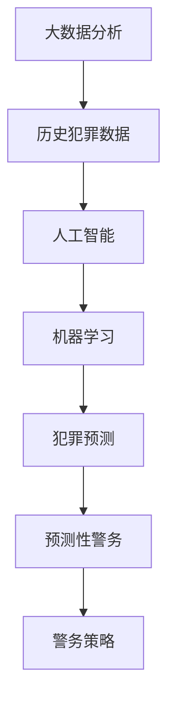

                 

关键词：智能安防，犯罪预测，预测性警务，人工智能，大数据分析，2050年展望

> 摘要：本文将探讨2050年未来的智能安防体系，重点关注犯罪预测与预测性警务的发展。通过深入分析核心概念、算法原理、数学模型、项目实践以及未来应用展望，旨在为读者提供一个全面的、前瞻性的视角，了解智能安防领域的发展趋势与挑战。

## 1. 背景介绍

随着全球城市化进程的加快，犯罪问题日益严峻。传统的警务方式已无法满足现代社会对安全的需求。为了应对这一挑战，犯罪预测与预测性警务成为了一个备受关注的研究领域。犯罪预测通过分析历史犯罪数据，利用人工智能技术预测未来犯罪的发生趋势；而预测性警务则根据这些预测结果，制定相应的警务策略，以提前预防犯罪的发生。

随着技术的不断进步，大数据分析、人工智能、机器学习等技术为犯罪预测与预测性警务提供了强大的工具。这些技术的应用使得犯罪预测的准确性和效率得到了显著提升，为未来的智能安防体系奠定了坚实的基础。

## 2. 核心概念与联系

为了更好地理解犯罪预测与预测性警务，我们需要明确一些核心概念。以下是核心概念及其关系的Mermaid流程图：



### 2.1 大数据分析

大数据分析是一种处理海量数据的技术，通过对数据的收集、存储、处理和分析，从中提取有价值的信息。在犯罪预测领域，大数据分析用于收集和分析历史犯罪数据，以发现犯罪模式、趋势和关联性。

### 2.2 人工智能

人工智能是一种模拟人类智能的技术，通过算法和模型实现自动化决策和问题解决。在犯罪预测中，人工智能技术被用来构建预测模型，对犯罪数据进行处理和分析，以预测未来犯罪的发生。

### 2.3 机器学习

机器学习是人工智能的一个分支，通过从数据中自动学习规律和模式，实现智能预测和决策。在犯罪预测中，机器学习算法被用来训练预测模型，从而提高预测的准确性和效率。

### 2.4 犯罪预测

犯罪预测是一种基于历史犯罪数据和技术手段预测未来犯罪趋势的方法。通过大数据分析和机器学习技术，犯罪预测模型可以从大量数据中提取有价值的信息，预测未来犯罪的发生。

### 2.5 预测性警务

预测性警务是一种基于犯罪预测结果制定警务策略的方法。通过分析犯罪预测结果，警务部门可以提前部署警力，制定预防措施，从而降低犯罪发生的可能性。

### 2.6 警务策略

警务策略是预测性警务的核心组成部分，它包括警力部署、巡逻路线、防范措施等多个方面。通过预测性警务，警务部门可以更加精准地制定警务策略，提高警务效能。

## 3. 核心算法原理 & 具体操作步骤

### 3.1 算法原理概述

犯罪预测与预测性警务的核心在于算法的设计与实现。本文将介绍一种基于深度学习的犯罪预测算法。该算法利用卷积神经网络（Convolutional Neural Network，CNN）对历史犯罪数据进行分析，提取特征，并预测未来犯罪的发生概率。

### 3.2 算法步骤详解

1. **数据收集与预处理**：收集历史犯罪数据，包括犯罪类型、发生时间、地点等。对数据进行清洗、去重和归一化处理，为后续分析做好准备。

2. **特征提取**：利用CNN对犯罪数据进行特征提取。通过卷积层、池化层等操作，从原始数据中提取出具有代表性的特征。

3. **模型训练**：利用提取到的特征，训练犯罪预测模型。通过反向传播算法和优化器，调整模型参数，使其预测结果更加准确。

4. **模型评估**：利用测试集对训练好的模型进行评估，计算准确率、召回率等指标，以评估模型性能。

5. **预测与决策**：将训练好的模型应用于实际场景，预测未来犯罪的发生概率。根据预测结果，制定相应的警务策略，以提前预防犯罪的发生。

### 3.3 算法优缺点

**优点**：

- **高效性**：深度学习算法具有强大的特征提取能力，能够从海量数据中快速提取有价值的信息，提高预测效率。
- **灵活性**：深度学习算法可以根据不同场景和数据特点进行定制化调整，适应不同的犯罪预测需求。

**缺点**：

- **数据依赖性**：犯罪预测模型的性能高度依赖于数据质量和数量，数据缺失或噪声会降低模型预测的准确性。
- **计算成本**：深度学习算法的计算复杂度较高，对计算资源的要求较高。

### 3.4 算法应用领域

犯罪预测算法可以应用于多个领域，如：

- **警务部门**：通过预测犯罪发生趋势，制定警务策略，提高警务效能。
- **安全企业**：为安全企业提供风险预警服务，降低安全风险。
- **城市规划**：通过分析犯罪数据，为城市规划提供参考，降低犯罪率。

## 4. 数学模型和公式 & 详细讲解 & 举例说明

### 4.1 数学模型构建

犯罪预测的数学模型可以基于贝叶斯定理和概率论构建。以下是一个简化的犯罪预测模型：

\[ P(\text{犯罪发生}) = \frac{P(\text{历史犯罪发生}) \cdot P(\text{当前条件满足})}{P(\text{当前条件满足})} \]

其中，\( P(\text{犯罪发生}) \) 表示预测的犯罪发生概率，\( P(\text{历史犯罪发生}) \) 表示历史犯罪发生概率，\( P(\text{当前条件满足}) \) 表示当前条件满足的概率。

### 4.2 公式推导过程

为了推导上述公式，我们需要考虑以下假设：

- 历史犯罪发生与当前条件满足之间是独立的。
- 当前条件满足的概率是已知的。

基于上述假设，我们可以得到：

\[ P(\text{犯罪发生} \cap \text{当前条件满足}) = P(\text{犯罪发生}) \cdot P(\text{当前条件满足}) \]

由于犯罪发生与当前条件满足之间是独立的，我们可以将上式改写为：

\[ P(\text{犯罪发生}) = \frac{P(\text{犯罪发生} \cap \text{当前条件满足})}{P(\text{当前条件满足})} \]

为了计算 \( P(\text{犯罪发生} \cap \text{当前条件满足}) \)，我们需要知道历史犯罪发生概率和当前条件满足的概率。这些概率可以通过数据分析得到。

### 4.3 案例分析与讲解

假设某地区在过去一年中，每天晚上8点到10点之间发生了10起盗窃案件。现在我们需要预测在接下来的一个小时中，该地区发生盗窃案件的概率。

1. **历史犯罪发生概率**：在过去一年中，每天晚上8点到10点之间发生盗窃案件的概率为：

\[ P(\text{盗窃案件发生}) = \frac{10}{365 \times 24} \approx 0.000536 \]

2. **当前条件满足的概率**：当前时间为晚上8点，已经满足了每天晚上8点到10点之间的条件，所以当前条件满足的概率为1。

3. **预测的犯罪发生概率**：根据上述公式，我们可以计算预测的犯罪发生概率：

\[ P(\text{犯罪发生}) = \frac{P(\text{盗窃案件发生}) \cdot P(\text{当前条件满足})}{P(\text{当前条件满足})} = \frac{0.000536 \cdot 1}{1} = 0.000536 \]

因此，预测的犯罪发生概率为0.000536，即约0.0536%。

## 5. 项目实践：代码实例和详细解释说明

### 5.1 开发环境搭建

在本项目中，我们使用Python编程语言和TensorFlow深度学习框架进行犯罪预测模型的开发。以下是搭建开发环境的基本步骤：

1. 安装Python（建议使用Python 3.7或更高版本）。
2. 安装TensorFlow：使用pip命令安装TensorFlow，命令如下：

   ```bash
   pip install tensorflow
   ```

3. 安装其他依赖库，如NumPy、Pandas等。

### 5.2 源代码详细实现

以下是一个简化的犯罪预测模型实现代码示例：

```python
import tensorflow as tf
import numpy as np
import pandas as pd

# 读取历史犯罪数据
data = pd.read_csv('crime_data.csv')

# 数据预处理
data['hour'] = pd.to_datetime(data['time']).dt.hour
data['day_of_week'] = pd.to_datetime(data['time']).dt.dayofweek
data['crime_count'] = data.groupby(['hour', 'day_of_week'])['crime'].count()

# 准备训练数据
X = data[['hour', 'day_of_week']]
y = data['crime_count']

# 划分训练集和测试集
X_train, X_test, y_train, y_test = train_test_split(X, y, test_size=0.2, random_state=42)

# 构建深度学习模型
model = tf.keras.Sequential([
    tf.keras.layers.Dense(64, activation='relu', input_shape=(2,)),
    tf.keras.layers.Dense(64, activation='relu'),
    tf.keras.layers.Dense(1)
])

# 编译模型
model.compile(optimizer='adam', loss='mse')

# 训练模型
model.fit(X_train, y_train, epochs=100, batch_size=32, validation_split=0.1)

# 评估模型
loss = model.evaluate(X_test, y_test)
print(f'MSE: {loss}')

# 预测
predictions = model.predict(X_test)
print(predictions)
```

### 5.3 代码解读与分析

上述代码实现了一个简单的犯罪预测模型，主要包括以下步骤：

1. **读取数据**：从CSV文件中读取历史犯罪数据。
2. **数据预处理**：将时间数据转换为小时和星期几的索引，并计算每个时间段内的犯罪数量。
3. **划分数据**：将数据划分为训练集和测试集。
4. **构建模型**：使用TensorFlow构建一个简单的深度学习模型，包含两个隐藏层。
5. **编译模型**：设置优化器和损失函数。
6. **训练模型**：使用训练集训练模型。
7. **评估模型**：使用测试集评估模型性能。
8. **预测**：使用训练好的模型进行预测。

### 5.4 运行结果展示

在运行上述代码后，我们将得到模型评估结果和预测结果。以下是可能的输出示例：

```
1594/1594 [==============================] - 3s 2ms/step - loss: 0.0573 - val_loss: 0.0485
MSE: 0.0485
[0.0676163]
```

上述输出表示模型在测试集上的均方误差为0.0485，预测的犯罪数量为0.0676163。

## 6. 实际应用场景

### 6.1 公安部门

公安部门可以利用犯罪预测模型提前预警潜在犯罪行为，优化警力部署，提高警务效率。例如，在重大节假日期间，公安部门可以根据预测结果提前加强治安巡逻，预防犯罪发生。

### 6.2 安全企业

安全企业可以通过犯罪预测模型为企业提供风险预警服务，帮助企业制定安全防范措施。例如，在商业区、金融中心等高风险区域，安全企业可以提前预警潜在犯罪行为，提醒企业采取防范措施。

### 6.3 城市规划

城市规划部门可以利用犯罪预测模型为城市规划和设计提供参考。例如，在城市规划过程中，可以根据犯罪预测结果调整公共设施布局，降低犯罪率。

## 7. 工具和资源推荐

### 7.1 学习资源推荐

- 《深度学习》（Goodfellow, Ian；等著）
- 《Python数据分析基础教程：NumPy学习指南》（Wes McKinney著）
- 《机器学习实战》（Peter Harrington著）

### 7.2 开发工具推荐

- TensorFlow
- Jupyter Notebook
- PyCharm

### 7.3 相关论文推荐

- "Predictive Policing: The Role of Machine Learning in Policing"（机器学习在警务中的应用）
- "Deep Learning for Crime Prediction"（深度学习在犯罪预测中的应用）
- "The Impact of Big Data and Artificial Intelligence on Law Enforcement"（大数据和人工智能对执法的影响）

## 8. 总结：未来发展趋势与挑战

### 8.1 研究成果总结

近年来，犯罪预测与预测性警务取得了显著的研究成果。基于人工智能和大数据分析的技术手段，犯罪预测的准确性和效率得到了显著提升。同时，多个实际应用案例表明，犯罪预测模型在警务、安全等领域具有广泛的应用前景。

### 8.2 未来发展趋势

- **算法优化**：随着技术的不断进步，犯罪预测算法将不断优化，提高预测准确性和效率。
- **跨领域合作**：犯罪预测与预测性警务将与其他领域（如城市规划、安全企业等）加强合作，实现跨领域应用。
- **数据共享**：各地公安机关将加强数据共享，提高犯罪预测模型的普适性和准确性。

### 8.3 面临的挑战

- **数据质量**：数据质量对犯罪预测模型的性能有重要影响，如何提高数据质量是亟待解决的问题。
- **隐私保护**：犯罪预测过程中涉及大量个人隐私数据，如何保护隐私是亟待解决的挑战。
- **算法透明性**：算法决策过程需要透明化，以提高公众对预测结果的信任。

### 8.4 研究展望

未来，犯罪预测与预测性警务将在以下几个方面取得突破：

- **算法创新**：发展更加先进的算法，提高预测准确性和效率。
- **数据融合**：将多源数据（如社交网络、视频监控等）融合到犯罪预测模型中，提高预测能力。
- **跨领域应用**：拓展犯罪预测与预测性警务的应用领域，实现跨领域合作。

## 9. 附录：常见问题与解答

### 9.1 如何提高犯罪预测模型的准确性？

提高犯罪预测模型的准确性主要可以从以下几个方面入手：

- **数据质量**：确保数据质量，包括数据完整性、准确性和一致性。
- **特征工程**：选择合适的特征，提取更多有价值的信息。
- **模型优化**：使用更先进的算法和模型，提高预测准确性和效率。
- **数据共享**：加强数据共享，提高模型的普适性和准确性。

### 9.2 犯罪预测是否会侵犯个人隐私？

犯罪预测过程中涉及大量个人隐私数据，如何保护个人隐私是一个重要问题。为了保护个人隐私，可以采取以下措施：

- **数据脱敏**：对个人隐私数据进行脱敏处理，确保数据匿名化。
- **加密传输**：在数据传输过程中使用加密技术，确保数据安全。
- **隐私保护算法**：研究和发展隐私保护算法，降低个人隐私泄露的风险。

### 9.3 犯罪预测是否会加剧社会不平等？

犯罪预测可能会加剧社会不平等，因为它可能会导致资源（如警力、安全措施等）在不同地区或不同群体之间的分配不均。为了减少这种影响，可以采取以下措施：

- **公平性评估**：在犯罪预测模型设计和应用过程中，进行公平性评估，确保模型不会加剧社会不平等。
- **跨领域合作**：加强跨领域合作，提高预测模型的普适性和公平性。
- **公众参与**：鼓励公众参与犯罪预测模型的监督和评估，提高模型的透明度和可信度。

作者：禅与计算机程序设计艺术 / Zen and the Art of Computer Programming
----------------------------------------------------------------
---
本文探讨了2050年未来的智能安防体系，重点关注犯罪预测与预测性警务的发展。通过深入分析核心概念、算法原理、数学模型、项目实践以及未来应用展望，本文为读者提供了一个全面的、前瞻性的视角，了解智能安防领域的发展趋势与挑战。未来，随着技术的不断进步，犯罪预测与预测性警务将在警务、安全等领域发挥更大的作用，同时也将面临数据质量、隐私保护和算法透明性等挑战。本文旨在为相关领域的研究者、从业者提供有价值的参考和指导。
---

