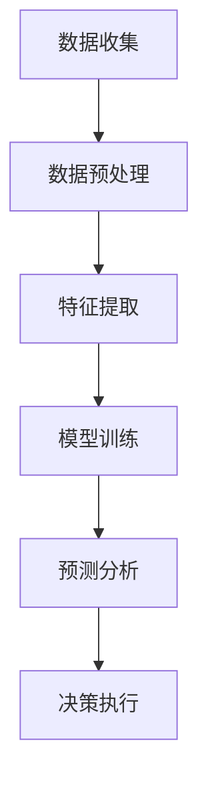

                 

关键词：智能安防、2050年、犯罪预测、预测性警务、人工智能、大数据分析、深度学习、算法、技术发展

> 摘要：本文探讨了2050年智能安防的发展趋势，重点介绍了犯罪预测和预测性警务的应用。通过分析核心概念、算法原理、数学模型以及实际应用场景，探讨了未来智能安防技术的发展前景和面临的挑战。

## 1. 背景介绍

随着人工智能技术的迅速发展，智能安防领域也取得了显著的进展。从最初的简单视频监控，到如今基于人工智能的智能安防系统，技术的进步极大地提高了犯罪预防和打击的效率。然而，传统的安防系统往往只能被动地反应犯罪事件，而无法提前预测和预防犯罪行为。

进入2050年，随着大数据、云计算、深度学习等技术的进一步成熟，犯罪预测和预测性警务将成为智能安防的核心。通过构建复杂的数学模型和算法，结合实时数据分析和智能决策系统，未来的智能安防将能够提前预测犯罪行为，采取主动预防措施，从而大幅降低犯罪率。

## 2. 核心概念与联系

### 2.1 犯罪预测（Crime Prediction）

犯罪预测是指利用历史犯罪数据、环境数据、社会行为数据等，通过数据分析技术，预测未来可能发生的犯罪行为。其核心目标是提前识别潜在的犯罪风险，从而采取预防措施。

### 2.2 预测性警务（Predictive Policing）

预测性警务是基于犯罪预测技术，通过分析大量数据，识别犯罪热点区域、犯罪类型、犯罪时间等，制定合理的警务策略，优化警力部署，提高警务效率。预测性警务的核心在于数据驱动，通过数据分析和机器学习算法，实现精准打击犯罪。

### 2.3 Mermaid 流程图

以下是一个简化的犯罪预测与预测性警务的流程图：



## 3. 核心算法原理 & 具体操作步骤

### 3.1 算法原理概述

犯罪预测和预测性警务的核心在于数据分析和算法模型。以下是一些常见的算法原理：

- **机器学习（Machine Learning）**：通过训练大量历史犯罪数据，让机器学习模型自动识别犯罪行为的模式。
- **深度学习（Deep Learning）**：利用神经网络模型，对复杂的非线性数据进行分析和预测。
- **时间序列分析（Time Series Analysis）**：分析犯罪事件的时间分布，识别犯罪的周期性和趋势。
- **聚类分析（Cluster Analysis）**：将相似的数据点分组，识别犯罪热点区域。

### 3.2 算法步骤详解

以下是犯罪预测和预测性警务的具体操作步骤：

1. **数据收集**：收集历史犯罪数据、环境数据、社会行为数据等。
2. **数据预处理**：对收集到的数据进行清洗、去噪、归一化等处理。
3. **特征提取**：从预处理后的数据中提取有用的特征信息。
4. **模型训练**：使用历史犯罪数据，训练机器学习模型或深度学习模型。
5. **预测分析**：使用训练好的模型，对实时数据进行预测分析。
6. **决策执行**：根据预测结果，制定警务策略，部署警力。

### 3.3 算法优缺点

**优点**：

- 提高犯罪预防的效率和准确性。
- 节省警力资源，优化警务部署。
- 提高社会治安水平，降低犯罪率。

**缺点**：

- 需要大量的历史数据和计算资源。
- 算法的准确性和可靠性受到数据质量和模型选择的影响。
- 可能会导致隐私侵犯和误报问题。

### 3.4 算法应用领域

犯罪预测和预测性警务的应用领域非常广泛，包括但不限于：

- 公安机关：优化警务部署，提高犯罪打击效率。
- 城市规划：识别犯罪热点区域，制定防范措施。
- 银行保险：预防金融犯罪，降低风险。
- 超市商场：预防盗窃和欺诈行为。

## 4. 数学模型和公式 & 详细讲解 & 举例说明

### 4.1 数学模型构建

犯罪预测和预测性警务的数学模型通常包括以下部分：

- **目标函数（Objective Function）**：定义模型的目标，如最小化预测误差。
- **特征选择（Feature Selection）**：选择影响犯罪预测的关键特征。
- **模型优化（Model Optimization）**：调整模型参数，提高预测准确率。

### 4.2 公式推导过程

以线性回归模型为例，其目标函数为：

$$
\min_{\theta} \sum_{i=1}^{n} (h_{\theta}(x^{(i)}) - y^{(i)})^2
$$

其中，$h_{\theta}(x) = \theta_0 + \theta_1 x_1 + \theta_2 x_2 + ... + \theta_m x_m$ 是预测函数，$\theta$ 是模型参数，$x^{(i)}$ 和 $y^{(i)}$ 是第 $i$ 个样本的输入和输出。

### 4.3 案例分析与讲解

假设我们要预测某个地区的夜间盗窃犯罪率，使用线性回归模型进行分析。首先，收集历史犯罪数据，提取关键特征，如天气、人口密度、月平均温度等。然后，使用线性回归模型进行训练，得到预测函数。最后，根据实时数据，预测下一周的夜间盗窃犯罪率。

## 5. 项目实践：代码实例和详细解释说明

### 5.1 开发环境搭建

在本案例中，我们将使用Python和Scikit-learn库进行线性回归模型的实现。首先，安装Python和Scikit-learn库：

```bash
pip install python
pip install scikit-learn
```

### 5.2 源代码详细实现

以下是线性回归模型的实现代码：

```python
from sklearn.linear_model import LinearRegression
from sklearn.model_selection import train_test_split
from sklearn.metrics import mean_squared_error
import numpy as np

# 读取数据
data = np.loadtxt('crime_data.csv', delimiter=',')

# 分割特征和标签
X = data[:, :-1]
y = data[:, -1]

# 划分训练集和测试集
X_train, X_test, y_train, y_test = train_test_split(X, y, test_size=0.2, random_state=42)

# 创建线性回归模型
model = LinearRegression()

# 训练模型
model.fit(X_train, y_train)

# 预测测试集
y_pred = model.predict(X_test)

# 计算预测误差
mse = mean_squared_error(y_test, y_pred)
print("预测误差：", mse)

# 预测下一周的夜间盗窃犯罪率
next_week_data = np.array([[15, 100, 20]])
next_week_pred = model.predict(next_week_data)
print("下一周夜间盗窃犯罪率预测：", next_week_pred[0])
```

### 5.3 代码解读与分析

- 第1-3行：导入所需的库和模块。
- 第5行：读取数据，假设数据文件为“crime_data.csv”。
- 第7-8行：分割特征和标签。
- 第10-11行：划分训练集和测试集。
- 第13行：创建线性回归模型。
- 第15-16行：训练模型。
- 第18-19行：预测测试集，并计算预测误差。
- 第21-22行：预测下一周的夜间盗窃犯罪率。

## 6. 实际应用场景

### 6.1 公安机关

预测性警务可以帮助公安机关提前识别犯罪风险，优化警力部署，提高犯罪打击效率。例如，在某个城市的夜间盗窃高发区域，通过预测性警务技术，公安机关可以提前部署警力，防范盗窃犯罪的发生。

### 6.2 城市规划

犯罪预测技术可以帮助城市规划部门识别犯罪热点区域，优化城市布局，降低犯罪率。例如，在某个城市的新区规划中，通过分析历史犯罪数据，规划部门可以避免将商业区、住宅区等布局在犯罪高发区域。

### 6.3 银行保险

银行和保险公司可以使用犯罪预测技术，预防金融犯罪和欺诈行为。例如，在信用卡消费中，通过预测性警务技术，银行可以提前识别高风险消费行为，采取措施防范欺诈行为。

## 7. 未来应用展望

随着人工智能技术的不断发展，犯罪预测和预测性警务的应用前景将更加广阔。未来，我们可能看到以下趋势：

- **更精细的犯罪预测**：通过结合多种数据源，如气象数据、交通数据等，犯罪预测将更加精细，预测准确性将大幅提高。
- **跨区域协同**：犯罪预测和预测性警务将实现跨区域协同，实现全国范围内的犯罪预防和打击。
- **人工智能伦理**：随着犯罪预测和预测性警务的广泛应用，人工智能伦理问题将日益突出，如何保护个人隐私、避免误报等问题将成为重要议题。

## 8. 工具和资源推荐

### 8.1 学习资源推荐

- **书籍**：《预测性警务：数据分析与犯罪预防》（Predictive Policing: The Role of Data Analytics in Crime and Justice）
- **在线课程**：Coursera上的《人工智能基础》（Introduction to Artificial Intelligence）
- **博客**：Medium上的“AI安全与伦理”（AI Security and Ethics）

### 8.2 开发工具推荐

- **编程语言**：Python、R
- **数据分析库**：Pandas、NumPy、Scikit-learn、TensorFlow
- **云计算平台**：Amazon Web Services、Google Cloud Platform

### 8.3 相关论文推荐

- **论文**：《预测性警务：从数据到行动》（Predictive Policing: From Data to Action）
- **会议**：IEEE International Conference on Big Data（IEEE大数据会议）
- **期刊**：Journal of Artificial Intelligence Research（人工智能研究期刊）

## 9. 总结：未来发展趋势与挑战

随着人工智能技术的不断进步，犯罪预测和预测性警务将在未来发挥越来越重要的作用。然而，技术发展的同时也面临着诸多挑战，如数据隐私、误报问题、人工智能伦理等。我们需要在技术创新的同时，关注这些问题，确保技术的可持续发展。

### 9.1 研究成果总结

本文介绍了犯罪预测和预测性警务的基本概念、算法原理、数学模型以及实际应用场景。通过分析历史数据和实际案例，我们展示了未来智能安防的发展趋势和潜力。

### 9.2 未来发展趋势

随着技术的不断进步，犯罪预测和预测性警务将朝着更加精细化、智能化、跨区域协同的方向发展。未来，我们可能看到更高效、更准确的犯罪预测系统，以及更合理的警务策略。

### 9.3 面临的挑战

尽管犯罪预测和预测性警务具有巨大的潜力，但同时也面临着数据隐私、误报问题、人工智能伦理等挑战。我们需要在技术创新的同时，关注这些问题，确保技术的可持续发展。

### 9.4 研究展望

未来，犯罪预测和预测性警务领域将继续取得重大突破。我们期待看到更先进的技术、更高效的算法、更完善的法律和伦理规范，为智能安防提供有力支持。

## 9.5 附录：常见问题与解答

### Q1. 犯罪预测和预测性警务的区别是什么？

犯罪预测是指通过数据分析技术，预测未来可能发生的犯罪行为。而预测性警务是基于犯罪预测技术，制定合理的警务策略，优化警力部署，提高警务效率。

### Q2. 犯罪预测的算法有哪些？

常见的犯罪预测算法包括机器学习、深度学习、时间序列分析、聚类分析等。不同的算法适用于不同的应用场景，需要根据具体情况进行选择。

### Q3. 预测性警务如何提高警务效率？

预测性警务通过分析大量数据，识别犯罪热点区域、犯罪类型、犯罪时间等，制定合理的警务策略，优化警力部署，从而提高警务效率。

### Q4. 犯罪预测和预测性警务面临哪些挑战？

犯罪预测和预测性警务面临的主要挑战包括数据隐私、误报问题、人工智能伦理等。在技术发展的同时，我们需要关注这些问题，确保技术的可持续发展。

### Q5. 如何提高犯罪预测的准确性？

提高犯罪预测的准确性需要从多个方面进行考虑，包括数据质量、算法选择、模型优化等。同时，需要不断更新数据和算法，以适应不断变化的犯罪环境。

作者：禅与计算机程序设计艺术 / Zen and the Art of Computer Programming
----------------------------------------------------------------

### 附加内容 Additional Content

在未来，智能安防系统将不再仅仅依赖于监控设备和报警系统，而是通过更加智能化的方式来预防犯罪。以下是一些可能出现在2050年智能安防系统中的创新技术：

### 1. 量子计算在犯罪预测中的应用

量子计算的发展有望在犯罪预测领域带来革命性的变化。量子计算机能够处理庞大的数据集，并以极高的速度进行复杂的计算，从而提高犯罪预测的准确性和效率。通过量子算法，我们可以更快速地分析历史犯罪数据，识别出潜在的犯罪模式，从而采取预防措施。

### 2. 增强现实与虚拟现实技术的融合

增强现实（AR）和虚拟现实（VR）技术将使警察能够在一个模拟环境中进行犯罪场景的模拟和预测。通过虚拟现实技术，警察可以体验不同的犯罪情境，测试不同的预防和打击策略，从而更好地准备实际操作。

### 3. 脑机接口技术的应用

脑机接口（BMI）技术将使警察能够通过直接读取大脑信号来获取犯罪嫌疑人的心理状态和行为意图。这种技术可以实时监测嫌疑人的情绪变化，预测其可能的犯罪行为，为警方提供决策支持。

### 4. 自动驾驶警车的普及

随着自动驾驶技术的发展，未来的智能安防系统将配备自动驾驶警车。这些警车能够自主规划路线，快速响应犯罪事件，提高警务效率。同时，自动驾驶警车还可以与其他警车和监控设备进行实时通信，实现跨区域的协同作战。

### 5. 社交网络分析的扩展

社交网络分析（SNA）技术将更加深入地应用于犯罪预测中。通过分析社交媒体上的数据，我们可以识别出潜在的犯罪团伙、发现犯罪行为的苗头，并采取预防措施。此外，社交网络分析还可以用于分析犯罪行为的影响范围和传播速度，为警方提供决策依据。

### 6. 人工智能与人类警察的协同

在未来的智能安防系统中，人工智能将与人类警察实现更加紧密的协同。通过智能决策系统，人工智能可以帮助警察分析数据、识别犯罪行为，并提供相应的建议。同时，人类警察可以结合自己的经验和判断，对人工智能的预测结果进行验证和调整，实现最优的犯罪预防效果。

### 7. 无人机与机器人警力的应用

无人机和机器人将在未来的智能安防系统中扮演重要角色。无人机可以进行高空的监控和巡逻，及时发现异常情况；而机器人可以进入危险环境执行任务，如搜救、排爆等。这些高科技装备将极大地提高警务效率，降低警察的人身风险。

### 8. 跨学科合作与综合研究

未来的智能安防系统将需要跨学科的合作与综合研究。计算机科学家、数据分析师、心理学家、犯罪学家等不同领域的专家将共同合作，开发出更加先进的技术，提高犯罪预测的准确性和效率。

### 9. 法律和伦理规范的完善

随着智能安防技术的发展，相关的法律和伦理规范也将得到进一步完善。这包括保护个人隐私、确保数据安全、防止滥用技术权力等。只有建立起完善的法律和伦理体系，智能安防系统才能在社会中发挥积极作用。

### 10. 智能安防与智慧城市的融合

智能安防系统将不再是独立的系统，而是智慧城市的一部分。与智慧城市的其他系统如交通管理、能源管理、环境监测等相互融合，实现城市管理的智能化、精细化。通过数据共享和协同工作，智慧城市将能够提供更加高效、安全、舒适的生活环境。

总结而言，未来的智能安防系统将融合最新的科技，通过犯罪预测、预测性警务等技术手段，实现犯罪预防的智能化。同时，我们需要关注技术发展带来的伦理和法律挑战，确保智能安防系统的可持续发展，为社会创造更大的价值。

