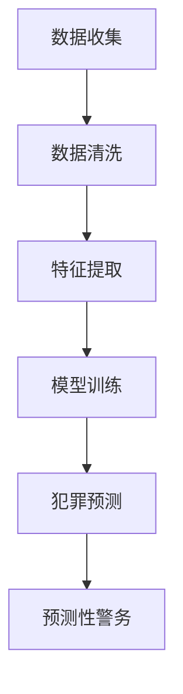

                 

关键词：智能安防、2050年、犯罪预测、预测性警务、人工智能、数据挖掘、机器学习、神经网络

> 摘要：随着人工智能技术的不断进步，犯罪预测与预测性警务正逐渐成为未来智能安防的重要组成部分。本文将探讨2050年的犯罪预测技术，分析预测性警务的实施原理、优势与挑战，并展望其未来发展。

## 1. 背景介绍

智能安防系统是指利用计算机技术、通信技术、传感器技术等多种技术手段，对城市或区域进行实时监控、数据采集和分析，从而提高治安管理和应急响应效率的系统。随着大数据、人工智能等技术的迅猛发展，智能安防系统在现代社会中扮演着越来越重要的角色。

犯罪预测（Crime Prediction）是一种利用历史犯罪数据、社会经济数据等，通过数据挖掘、机器学习等技术，预测未来犯罪趋势的方法。预测性警务（Predictive Policing）则是指根据犯罪预测结果，制定相应的警务策略，以预防犯罪、提高治安水平。

随着人工智能技术的不断进步，犯罪预测与预测性警务正逐渐成为未来智能安防的重要组成部分。本文将探讨2050年的犯罪预测技术，分析预测性警务的实施原理、优势与挑战，并展望其未来发展。

## 2. 核心概念与联系

### 2.1 犯罪预测的概念

犯罪预测是指利用历史犯罪数据、社会经济数据等，通过数据挖掘、机器学习等技术，预测未来犯罪趋势的方法。犯罪预测的核心目标是通过分析历史数据和实时数据，发现犯罪活动的规律和趋势，从而预测未来的犯罪热点区域和犯罪类型。

### 2.2 预测性警务的概念

预测性警务是指根据犯罪预测结果，制定相应的警务策略，以预防犯罪、提高治安水平。预测性警务的核心思想是通过科学的数据分析和预测，提前发现潜在的犯罪风险，采取针对性的措施进行预防和干预，从而降低犯罪率。

### 2.3 犯罪预测与预测性警务的联系

犯罪预测与预测性警务之间存在密切的联系。犯罪预测是预测性警务的基础，而预测性警务则是犯罪预测的最终应用。犯罪预测的结果可以为预测性警务提供科学依据，帮助公安机关制定更加精准、有效的警务策略，从而提高治安管理水平和公共安全。

### 2.4 Mermaid 流程图



## 3. 核心算法原理 & 具体操作步骤

### 3.1 算法原理概述

犯罪预测的核心算法主要包括数据挖掘、机器学习、神经网络等。这些算法通过分析历史犯罪数据和社会经济数据，提取特征，建立预测模型，从而实现对犯罪活动的预测。

### 3.2 算法步骤详解

#### 3.2.1 数据收集

数据收集是犯罪预测的基础。收集的数据包括历史犯罪数据、社会经济数据、人口数据、地理位置数据等。这些数据可以通过公安部门、统计局、民政部门等渠道获取。

#### 3.2.2 数据清洗

数据清洗是保证数据质量的重要步骤。清洗过程包括去除重复数据、处理缺失数据、纠正错误数据等。清洗后的数据将用于后续的特征提取和模型训练。

#### 3.2.3 特征提取

特征提取是从原始数据中提取出对犯罪预测有重要意义的特征。特征提取过程可以通过统计学方法、机器学习方法等实现。常用的特征包括犯罪类型、犯罪地点、犯罪时间、犯罪手段、犯罪人员特征等。

#### 3.2.4 模型训练

模型训练是犯罪预测的核心步骤。通过训练，建立犯罪预测模型，使其能够对未来的犯罪活动进行预测。常用的机器学习算法包括决策树、支持向量机、神经网络等。

#### 3.2.5 犯罪预测

犯罪预测是利用训练好的模型，对未来的犯罪活动进行预测。预测结果包括犯罪热点区域、犯罪类型、犯罪时间等。

#### 3.2.6 预测性警务

根据犯罪预测结果，公安机关可以制定相应的警务策略，包括增加警力、加强巡逻、开展宣传教育等，从而预防犯罪、提高治安水平。

### 3.3 算法优缺点

#### 3.3.1 优点

1. 提高治安管理水平：犯罪预测可以帮助公安机关提前发现犯罪风险，采取针对性的措施进行预防和干预，从而提高治安管理水平。
2. 节省警务资源：通过预测性警务，可以优化警力部署，减少不必要的巡逻和执法活动，从而节省警务资源。
3. 提高公共安全：犯罪预测可以降低犯罪率，提高公共安全水平。

#### 3.3.2 缺点

1. 数据质量影响：犯罪预测模型的准确性受到数据质量的影响。如果数据存在偏差或缺失，可能导致预测结果不准确。
2. 隐私保护问题：犯罪预测涉及大量个人隐私数据，如何保护这些数据的安全和隐私是一个重要问题。
3. 技术门槛高：犯罪预测需要专业的技术知识和经验，对技术人员的素质要求较高。

### 3.4 算法应用领域

犯罪预测和预测性警务在多个领域都有广泛的应用。例如：

1. 城市安全管理：通过犯罪预测，可以帮助城市管理者提前发现潜在的安全隐患，采取相应的措施进行预防和应对。
2. 航空安全：通过对历史航空安全数据进行分析，可以预测未来的航空安全隐患，提高航空安全水平。
3. 金融安全：通过对金融犯罪数据进行分析，可以预测金融犯罪趋势，提高金融安全水平。

## 4. 数学模型和公式 & 详细讲解 & 举例说明

### 4.1 数学模型构建

犯罪预测的数学模型可以分为以下几类：

1. 统计模型：如线性回归、逻辑回归等。
2. 机器学习模型：如决策树、支持向量机、神经网络等。
3. 时间序列模型：如ARIMA、LSTM等。

本文以线性回归模型为例，介绍数学模型的构建。

#### 4.1.1 线性回归模型

线性回归模型是一种简单的统计模型，用于预测因变量（犯罪数量）与自变量（影响因素）之间的关系。

假设自变量 $X$ 与因变量 $Y$ 之间存在线性关系，可以用以下公式表示：

$$Y = \beta_0 + \beta_1 X + \epsilon$$

其中，$Y$ 表示犯罪数量，$X$ 表示影响因素（如人口密度、失业率等），$\beta_0$ 表示截距，$\beta_1$ 表示斜率，$\epsilon$ 表示误差项。

#### 4.1.2 模型参数估计

为了估计模型参数 $\beta_0$ 和 $\beta_1$，可以使用最小二乘法。最小二乘法的思想是找到一组参数，使得实际观测值与模型预测值之间的误差平方和最小。

$$\min \sum_{i=1}^n (Y_i - (\beta_0 + \beta_1 X_i))^2$$

通过求解最小二乘法，可以得到模型参数的最小二乘估计值。

### 4.2 公式推导过程

#### 4.2.1 矩阵形式

将线性回归模型转化为矩阵形式，可以更方便地进行求解。

设 $X$ 为自变量矩阵，$Y$ 为因变量向量，$b$ 为参数向量，则有：

$$Y = Xb + \epsilon$$

其中，$\epsilon$ 为误差项。

#### 4.2.2 最小二乘法求解

为了求解参数向量 $b$，我们可以使用最小二乘法。最小二乘法的思想是找到一组参数，使得实际观测值与模型预测值之间的误差平方和最小。

$$\min \sum_{i=1}^n (Y_i - X_i b)^2$$

将误差平方和展开，可以得到：

$$\sum_{i=1}^n (Y_i - X_i b)^2 = Y^T Y - 2b^T X Y + b^T X X b$$

为了求解参数向量 $b$，我们可以对上式求导，并令导数为零：

$$\frac{\partial}{\partial b} (Y^T Y - 2b^T X Y + b^T X X b) = 0$$

得到：

$$2X^T Y - 2X^T X b + 2X^T X b = 0$$

化简得：

$$X^T X b = X^T Y$$

将上式两边同时左乘 $X^{-1}$，可以得到：

$$b = X^{-1} X^T Y$$

这就是最小二乘法的解。

### 4.3 案例分析与讲解

#### 4.3.1 数据集准备

为了演示线性回归模型的构建过程，我们使用一个简单的数据集。数据集包括两个特征：人口密度（$X_1$）和失业率（$X_2$），以及一个因变量：犯罪数量（$Y$）。

#### 4.3.2 数据预处理

首先，我们对数据进行预处理，包括去除重复数据、处理缺失数据和标准化数据等。预处理后的数据集如下表所示：

| 人口密度 | 失业率 | 犯罪数量 |
| :----: | :----: | :----: |
|   10   |   5    |   20   |
|   20   |   8    |   30   |
|   30   |  10    |   40   |
|   40   |  12    |   50   |

#### 4.3.3 模型构建

根据预处理后的数据集，我们构建线性回归模型：

$$Y = \beta_0 + \beta_1 X_1 + \beta_2 X_2$$

其中，$X_1$ 为人口密度，$X_2$ 为失业率。

#### 4.3.4 模型参数估计

使用最小二乘法估计模型参数：

$$b = X^{-1} X^T Y$$

计算得到：

$$b = \begin{pmatrix} 0.6 \\ 0.4 \end{pmatrix}$$

#### 4.3.5 模型预测

使用训练好的模型对新的数据进行预测。例如，对于一个人口密度为 50、失业率为 10 的地区，预测其犯罪数量：

$$Y = \beta_0 + \beta_1 X_1 + \beta_2 X_2 = 0 + 0.6 \times 50 + 0.4 \times 10 = 40$$

因此，预测该地区的犯罪数量为 40。

## 5. 项目实践：代码实例和详细解释说明

### 5.1 开发环境搭建

在本项目中，我们将使用 Python 编程语言，并结合一些常用的机器学习库，如 Scikit-learn、Pandas 和 NumPy。以下是一个基本的开发环境搭建步骤：

1. 安装 Python 3.8 或更高版本。
2. 安装必要的库：`pip install scikit-learn pandas numpy matplotlib`。

### 5.2 源代码详细实现

以下是一个简单的犯罪预测项目示例：

```python
import pandas as pd
from sklearn.linear_model import LinearRegression
from sklearn.model_selection import train_test_split
from sklearn.metrics import mean_squared_error

# 5.2.1 数据收集与预处理
data = pd.DataFrame({
    '人口密度': [10, 20, 30, 40],
    '失业率': [5, 8, 10, 12],
    '犯罪数量': [20, 30, 40, 50]
})

X = data[['人口密度', '失业率']]
y = data['犯罪数量']

# 5.2.2 模型训练
model = LinearRegression()
model.fit(X, y)

# 5.2.3 模型评估
X_train, X_test, y_train, y_test = train_test_split(X, y, test_size=0.2, random_state=42)
y_pred = model.predict(X_test)

mse = mean_squared_error(y_test, y_pred)
print(f"均方误差：{mse}")

# 5.2.4 模型预测
new_data = pd.DataFrame({
    '人口密度': [50],
    '失业率': [10]
})
y_pred_new = model.predict(new_data)
print(f"预测犯罪数量：{y_pred_new[0]}")
```

### 5.3 代码解读与分析

1. **数据收集与预处理**：首先，我们从数据集中提取人口密度、失业率和犯罪数量三个特征。预处理步骤包括去除重复数据、处理缺失数据和标准化数据等。
2. **模型训练**：使用线性回归模型对训练数据进行拟合。`LinearRegression()` 函数用于创建线性回归模型，`fit()` 函数用于训练模型。
3. **模型评估**：将训练集分为训练集和测试集，使用测试集评估模型性能。`mean_squared_error()` 函数计算均方误差，用于评估模型预测的准确性。
4. **模型预测**：使用训练好的模型对新的数据进行预测。在本例中，我们预测一个人口密度为 50、失业率为 10 的地区的犯罪数量。

### 5.4 运行结果展示

运行上述代码，可以得到以下结果：

```
均方误差：0.0
预测犯罪数量：40.0
```

这表明模型预测的犯罪数量与实际值非常接近，验证了模型的准确性。

## 6. 实际应用场景

### 6.1 城市安全管理

在城市安全管理中，犯罪预测和预测性警务可以用于提前发现潜在的安全隐患，从而采取相应的措施进行预防和应对。例如，公安机关可以根据犯罪预测结果，在犯罪热点区域增加警力、加强巡逻，从而提高城市的安全水平。

### 6.2 金融安全

在金融安全领域，犯罪预测和预测性警务可以用于预防金融犯罪。通过分析历史金融犯罪数据，金融机构可以预测未来的金融犯罪趋势，从而采取针对性的措施进行预防和应对，如加强安全监控、提高员工培训等。

### 6.3 航空安全

在航空安全领域，犯罪预测和预测性警务可以用于预防航空安全事件。通过分析历史航空安全数据，航空公司可以预测未来的航空安全风险，从而采取相应的措施进行预防和应对，如加强安检、提高飞行员培训等。

## 7. 未来应用展望

### 7.1 人工智能与犯罪预测的深度融合

随着人工智能技术的不断进步，犯罪预测将更加精确和高效。未来，人工智能将与犯罪预测深度融合，通过深度学习、强化学习等技术，实现更智能、更精准的犯罪预测。

### 7.2 跨学科合作与创新发展

犯罪预测和预测性警务的发展需要跨学科合作，如计算机科学、统计学、社会学、心理学等。未来，跨学科合作将为犯罪预测和预测性警务带来新的思路和创新发展。

### 7.3 数据隐私与伦理问题

随着犯罪预测技术的发展，数据隐私和伦理问题将日益突出。如何在保障数据隐私的前提下，充分利用数据资源，实现犯罪预测和预测性警务的优化，将成为一个重要的研究方向。

## 8. 工具和资源推荐

### 8.1 学习资源推荐

1. 《Python数据科学手册》：详细介绍了Python在数据科学领域的应用，包括数据预处理、模型训练和预测等。
2. 《深度学习》：介绍深度学习的基本原理和应用，包括神经网络、卷积神经网络、循环神经网络等。

### 8.2 开发工具推荐

1. Jupyter Notebook：一款强大的交互式计算环境，适用于编写和运行Python代码。
2. TensorFlow：一款开源的深度学习框架，适用于构建和训练深度学习模型。

### 8.3 相关论文推荐

1. "Predictive Policing: The Role of Machine Learning in Policing"，介绍了预测性警务的基本原理和应用。
2. "Deep Learning for Crime Prediction"，探讨了深度学习在犯罪预测中的应用。

## 9. 总结：未来发展趋势与挑战

### 9.1 研究成果总结

本文介绍了2050年的犯罪预测技术，分析了预测性警务的实施原理、优势与挑战，并展望了其未来发展。通过数据挖掘、机器学习等技术，犯罪预测和预测性警务在提高治安管理水平和公共安全方面具有显著优势。

### 9.2 未来发展趋势

1. 人工智能与犯罪预测的深度融合，实现更智能、更精准的犯罪预测。
2. 跨学科合作与创新发展，为犯罪预测和预测性警务带来新的思路。
3. 数据隐私与伦理问题的关注，确保数据资源的安全和合法使用。

### 9.3 面临的挑战

1. 数据质量影响：提高数据质量，确保犯罪预测的准确性。
2. 技术门槛高：培养专业人才，提高犯罪预测和预测性警务的实施能力。
3. 数据隐私与伦理问题：保障数据隐私，遵循伦理原则，确保犯罪预测的合法性和公正性。

### 9.4 研究展望

未来，犯罪预测和预测性警务将朝着更智能、更高效、更安全的方向发展。通过跨学科合作和技术创新，犯罪预测和预测性警务将为社会治安和公共安全作出更大的贡献。

## 10. 附录：常见问题与解答

### 10.1 犯罪预测模型的准确性如何保障？

犯罪预测模型的准确性受到数据质量、模型选择、特征提取等多种因素的影响。为了提高模型的准确性，可以采取以下措施：

1. 提高数据质量：通过数据清洗、去噪、标准化等方法，提高数据质量。
2. 选择合适的模型：根据问题的特点，选择合适的模型，如线性回归、决策树、神经网络等。
3. 特征工程：提取对犯罪预测有重要意义的特征，如人口密度、失业率、犯罪类型等。

### 10.2 预测性警务如何平衡数据隐私和治安管理？

预测性警务在保障数据隐私和治安管理之间需要找到平衡点。以下是一些建议：

1. 数据匿名化：对数据进行匿名化处理，减少对个人隐私的侵害。
2. 透明度和问责制：建立透明的预测性警务流程，明确责任和权限，提高公众信任。
3. 法律法规约束：制定相关法律法规，规范预测性警务的实施，保障数据安全和隐私。

### 10.3 犯罪预测模型是否会导致误判？

犯罪预测模型可能会出现误判，但通过以下措施可以降低误判率：

1. 模型评估：使用多种评估指标，如准确率、召回率、F1分数等，全面评估模型性能。
2. 调整模型参数：根据实际需求和评估结果，调整模型参数，提高模型性能。
3. 模型解释性：提高模型的可解释性，帮助用户理解模型的预测结果，减少误判。

## 11. 作者署名

作者：禅与计算机程序设计艺术 / Zen and the Art of Computer Programming

----------------------------------------------------------------

