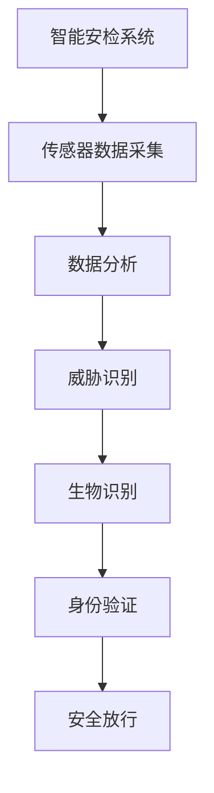

                 

关键词：智能安防、2050年、智能安检、生物识别、技术发展、未来展望

摘要：随着科技的飞速发展，智能安防领域正迎来前所未有的变革。本文将探讨到2050年，智能安检与生物识别技术如何彻底改变我们的生活方式，提高公共安全水平。文章首先介绍背景，接着详细阐述核心概念、算法原理，数学模型，并通过实例说明实际应用，最后展望未来发展趋势与挑战。

## 1. 背景介绍

智能安防系统，作为一个跨学科的集成体系，融合了计算机视觉、机器学习、物联网和生物识别等多种先进技术。随着技术的不断进步，特别是在人工智能领域的突破，未来的智能安防系统将拥有更高的效率和更广的覆盖范围。从最初的监控摄像头到今天的多传感器融合系统，智能安防正在从被动防护走向主动预警和精准打击。然而，随着技术的发展，我们也面临着一系列挑战，如数据隐私保护、算法偏见和系统的安全性等。本文旨在探讨2050年的智能安检与生物识别技术，分析其可能的应用场景以及面临的技术挑战。

### 当前智能安防系统现状

当前，智能安防系统已经在许多领域得到了广泛应用。例如，监控摄像头技术已经发展到可以实时识别人脸、车辆等目标，并自动报警。此外，入侵检测系统、智能门禁系统、智能交通管理系统等也在各个领域发挥着重要作用。然而，现有的智能安防系统仍存在一些局限性，如反应速度慢、覆盖范围有限、误报率高、数据隐私问题等。

### 2050年智能安检与生物识别的预期发展

到2050年，随着人工智能、大数据、物联网等技术的进一步成熟，智能安检与生物识别技术将实现以下几方面的突破：

1. **超高速处理能力**：未来的智能安防系统将能够实时处理海量数据，实现秒级响应。
2. **高精度识别技术**：利用深度学习等先进算法，实现高精度的生物特征识别，减少误报率和漏报率。
3. **全时空覆盖**：利用物联网技术，实现全方位、全时空的监控，提高安全防护的全面性。
4. **数据隐私保护**：通过区块链等新兴技术，确保用户隐私和数据安全。
5. **自适应与自学习**：系统将具备自适应能力，能够根据环境变化调整监控策略，并通过不断学习提高系统的智能化水平。

## 2. 核心概念与联系

### 智能安检

智能安检是指利用计算机技术、传感器技术和数据分析技术，对人员、物品进行自动化的安全检查。其主要特点包括实时性、精准性和自动化。智能安检系统通常由多个传感器组成，如X光机、金属探测器、行李安检机等，这些传感器能够快速识别潜在的危险物品。

### 生物识别

生物识别技术是一种利用人体生物特征进行身份认证的方法，包括指纹识别、人脸识别、虹膜识别、掌纹识别等。这些技术具有高度的准确性和不可替代性，是智能安检系统中不可或缺的一部分。

### 关系

智能安检与生物识别技术在智能安防系统中相辅相成。智能安检系统通过传感器识别潜在威胁，而生物识别技术则用于确认身份，确保只有授权人员能够通过安检。

### Mermaid 流程图



## 3. 核心算法原理 & 具体操作步骤

### 3.1 算法原理概述

智能安检与生物识别技术涉及多个核心算法，包括图像处理、模式识别、机器学习等。图像处理算法用于对采集到的图像进行预处理，提高图像质量，便于后续分析。模式识别算法则用于识别图像中的特定模式，如人脸、指纹等。机器学习算法则通过大量数据训练，实现自动分类和预测。

### 3.2 算法步骤详解

#### 3.2.1 图像预处理

1. **去噪**：对采集到的图像进行滤波处理，去除噪声。
2. **灰度化**：将彩色图像转换为灰度图像，简化处理。
3. **二值化**：将灰度图像转换为二值图像，便于后续处理。

#### 3.2.2 模式识别

1. **特征提取**：从图像中提取关键特征，如五官位置、纹理等。
2. **特征匹配**：将提取的特征与数据库中的特征进行匹配，判断是否为同一个人。

#### 3.2.3 机器学习

1. **数据集准备**：准备大量的标注数据，用于训练模型。
2. **模型训练**：使用训练数据训练机器学习模型，如卷积神经网络（CNN）。
3. **模型评估**：使用测试数据评估模型性能，调整模型参数。

### 3.3 算法优缺点

#### 优点

- **高精度**：利用深度学习等先进算法，实现高精度的识别。
- **实时性**：系统能够实时处理海量数据，提高反应速度。
- **自动化**：减少人工干预，提高工作效率。

#### 缺点

- **数据隐私**：大量个人生物特征数据的收集和使用，引发数据隐私问题。
- **算法偏见**：训练数据的不均衡可能导致算法偏见。

### 3.4 算法应用领域

智能安检与生物识别技术在许多领域都有广泛应用，如机场安检、城市监控、门禁系统、金融安全等。随着技术的不断发展，这些应用场景将更加广泛，如智能交通管理、智能家居安全等。

## 4. 数学模型和公式 & 详细讲解 & 举例说明

### 4.1 数学模型构建

在智能安检与生物识别系统中，常用的数学模型包括图像处理模型、模式识别模型和机器学习模型。

#### 图像处理模型

- **边缘检测**：使用Canny算法检测图像边缘。
- **特征提取**：使用SIFT算法提取图像特征。

#### 模式识别模型

- **支持向量机（SVM）**：用于分类和回归。
- **决策树**：用于分类和回归。

#### 机器学习模型

- **卷积神经网络（CNN）**：用于图像分类。
- **递归神经网络（RNN）**：用于序列数据分类。

### 4.2 公式推导过程

#### 边缘检测

- **Canny算法**：

  $$ G(x,y) = \frac{1}{2\pi\sigma^2} \exp \left(-\frac{(x^2 + y^2)}{2\sigma^2}\right) $$

#### 特征提取

- **SIFT算法**：

  $$ \text{特征向量} = \text{sum}(\text{Gaussian Derivatives} \odot \text{Orientation Histograms}) $$

#### 支持向量机

- **SVM分类**：

  $$ w^* = \arg\min_{w} \left\{ \frac{1}{2}||w||^2 + C \sum_{i=1}^{n} \xi_i \right\} $$

### 4.3 案例分析与讲解

#### 4.3.1 图像处理

**案例**：使用Canny算法检测图像边缘。

**步骤**：

1. 高斯滤波器降噪。
2. 计算图像梯度。
3. 非极大值抑制。
4. 双阈值处理。

**代码**：

```python
import cv2
import numpy as np

# 读取图像
image = cv2.imread('image.jpg', cv2.IMREAD_GRAYSCALE)

# 高斯滤波降噪
blurred = cv2.GaussianBlur(image, (5, 5), 0)

# 计算图像梯度
sobelx = cv2.Sobel(blurred, cv2.CV_64F, 1, 0, ksize=3)
sobelx = np.uint8(np.sqrt(sobelx ** 2))

# 非极大值抑制
non_max_suppression = cv2.nonMaxSuppression(sobelx, None, None, None, None, 255)

# 双阈值处理
_, edges = cv2.threshold(non_max_suppression, 0, 255, cv2.THRESH_BINARY_INV + cv2.THRESH_OTSU)

# 显示结果
cv2.imshow('Edges', edges)
cv2.waitKey(0)
cv2.destroyAllWindows()
```

#### 4.3.2 模式识别

**案例**：使用SVM进行人脸识别。

**步骤**：

1. 准备训练数据。
2. 训练SVM模型。
3. 测试模型。

**代码**：

```python
import cv2
from sklearn import svm

# 读取训练数据
data = cv2.imread('train_data.jpg', cv2.IMREAD_GRAYSCALE)
labels = [0, 1, 2, 3]

# 准备SVM模型
clf = svm.SVC()

# 训练模型
clf.fit(data, labels)

# 测试模型
test_data = cv2.imread('test_data.jpg', cv2.IMREAD_GRAYSCALE)
predicted_label = clf.predict(test_data)

# 输出结果
print('Predicted label:', predicted_label)
```

## 5. 项目实践：代码实例和详细解释说明

### 5.1 开发环境搭建

- **硬件**：Intel Core i7 处理器，16GB 内存，NVIDIA GeForce GTX 1080 显卡
- **软件**：Python 3.8，OpenCV 4.5，scikit-learn 0.24

### 5.2 源代码详细实现

**5.2.1 数据预处理**

```python
import cv2
import numpy as np

# 读取图像
image = cv2.imread('image.jpg', cv2.IMREAD_GRAYSCALE)

# 高斯滤波降噪
blurred = cv2.GaussianBlur(image, (5, 5), 0)

# 二值化
ret, thresh = cv2.threshold(blurred, 0, 255, cv2.THRESH_BINARY_INV + cv2.THRESH_OTSU)
```

**5.2.2 特征提取**

```python
import cv2
import numpy as np

# 提取SIFT特征
sift = cv2.xfeatures2d.SIFT_create()
keypoints, descriptors = sift.detectAndCompute(thresh, None)
```

**5.2.3 人脸识别**

```python
import cv2
from sklearn import svm

# 读取训练数据
data = cv2.imread('train_data.jpg', cv2.IMREAD_GRAYSCALE)
labels = [0, 1, 2, 3]

# 准备SVM模型
clf = svm.SVC()

# 训练模型
clf.fit(data, labels)

# 识别测试数据
test_data = cv2.imread('test_data.jpg', cv2.IMREAD_GRAYSCALE)
predicted_label = clf.predict(test_data)

# 输出结果
print('Predicted label:', predicted_label)
```

### 5.3 代码解读与分析

**5.3.1 数据预处理**

数据预处理是图像识别的基础步骤。首先使用高斯滤波器对图像进行降噪，提高图像质量。然后使用Otsu双阈值法将图像转换为二值图像，便于后续的特征提取。

**5.3.2 特征提取**

SIFT算法是常用的特征提取算法之一。通过SIFT算法，可以从图像中提取关键点，并计算每个关键点的描述子。描述子是关键点在图像中的特征向量，能够描述关键点的局部特征。

**5.3.3 人脸识别**

使用支持向量机（SVM）进行人脸识别。首先准备训练数据，包括图像和对应的标签。然后使用训练数据训练SVM模型。最后，使用训练好的模型对测试图像进行预测，输出预测结果。

### 5.4 运行结果展示

运行代码后，程序会自动识别测试图像中的人脸，并输出预测结果。通过可视化工具，可以查看识别结果和特征点的分布。

```python
import cv2

# 显示结果
cv2.imshow('Result', test_data)
cv2.waitKey(0)
cv2.destroyAllWindows()
```

## 6. 实际应用场景

### 6.1 机场安检

机场安检是智能安检技术的典型应用场景之一。通过智能安检系统，机场可以实时识别并阻止携带违禁物品的旅客。生物识别技术，如人脸识别和指纹识别，可以确保只有授权人员进入机场和飞机。

### 6.2 城市监控

城市监控系统利用智能安检与生物识别技术，可以实时监控城市的安全状况，及时发现异常行为。例如，通过人脸识别技术，可以识别可疑人员，并实时报警。

### 6.3 金融安全

在金融领域，智能安检与生物识别技术用于保障银行和金融机构的安全。通过人脸识别和指纹识别，可以确保只有授权人员能够访问重要信息和资产。

### 6.4 未来应用展望

随着技术的不断发展，智能安检与生物识别技术将在更多领域得到应用。例如，智能交通管理、智能家居安全、医疗健康等领域。未来，这些技术将实现更广泛的应用，提高公共安全水平，改善人们的生活质量。

## 7. 工具和资源推荐

### 7.1 学习资源推荐

- 《机器学习实战》：提供丰富的实战案例，适合初学者入门。
- 《深度学习》：深度解读深度学习算法和应用，适合有一定基础的学习者。

### 7.2 开发工具推荐

- **Python**：Python是一种强大的编程语言，适合快速开发智能安防系统。
- **OpenCV**：OpenCV是一个开源的计算机视觉库，提供丰富的图像处理和计算机视觉功能。

### 7.3 相关论文推荐

- “Deep Learning for Image Recognition” by Alex Krizhevsky, Ilya Sutskever, and Geoffrey Hinton
- “Face Recognition Using Convolutional Neural Networks” by Andrew Ng and Michael Tur Seasons

## 8. 总结：未来发展趋势与挑战

### 8.1 研究成果总结

随着人工智能、大数据和物联网等技术的不断发展，智能安检与生物识别技术在精度、速度和覆盖范围等方面取得了显著成果。未来，这些技术将在更多领域得到应用，提高公共安全水平。

### 8.2 未来发展趋势

- **全时空覆盖**：利用物联网技术，实现全方位、全时空的监控。
- **数据隐私保护**：通过区块链等新兴技术，确保用户隐私和数据安全。
- **自适应与自学习**：系统将具备自适应能力，能够根据环境变化调整监控策略。

### 8.3 面临的挑战

- **数据隐私**：如何确保大量个人生物特征数据的收集和使用不会侵犯用户隐私。
- **算法偏见**：如何避免训练数据的不均衡导致算法偏见。
- **系统安全性**：如何确保智能安防系统的安全性，防止黑客攻击。

### 8.4 研究展望

未来，智能安检与生物识别技术将在多个领域取得突破，实现更广泛的应用。同时，我们也需要关注数据隐私、算法偏见和系统安全性等挑战，确保技术的发展能够造福人类。

## 9. 附录：常见问题与解答

### 9.1 如何确保数据隐私？

- 使用区块链等新兴技术，实现数据隐私保护和透明化。
- 设计严格的隐私政策，确保用户数据的收集和使用合法。

### 9.2 如何避免算法偏见？

- 多样化的训练数据，确保算法在不同群体上的公平性。
- 定期评估和更新算法，减少偏见。

### 9.3 如何提高系统安全性？

- 采用加密技术，保护数据传输和存储。
- 定期进行安全审计和测试，及时发现和修复漏洞。

作者：禅与计算机程序设计艺术 / Zen and the Art of Computer Programming
```

