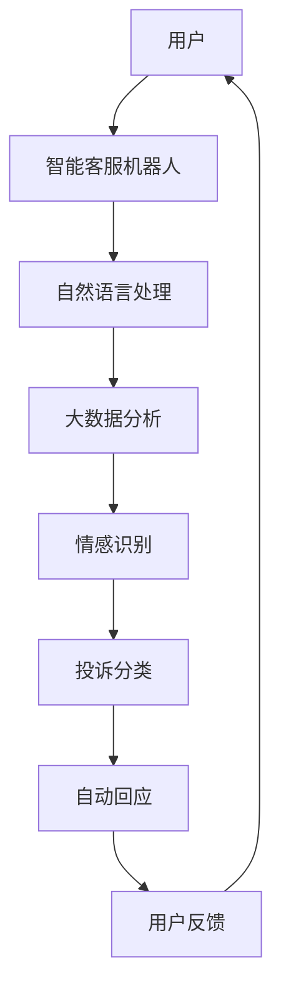

                 

关键词：智能客服、2050年、客服机器人、智能投诉处理、人工智能技术、发展趋势、技术挑战

> 摘要：随着人工智能技术的飞速发展，智能客服已经成为现代企业的重要组成部分。本文将探讨到2050年，智能客服机器人和智能投诉处理系统的未来发展趋势和面临的挑战，并展望其潜在的应用前景。

## 1. 背景介绍

在过去的几十年里，人工智能（AI）技术的不断进步已经深刻地改变了我们的生活。从最初的专家系统到今天的深度学习和自然语言处理（NLP），AI技术在各个领域都取得了显著的成果。特别是在客户服务领域，智能客服机器人已经成为提高客户满意度、降低运营成本的重要工具。

当前，智能客服系统主要基于规则和机器学习两种方法。规则型系统通过预定义的规则来处理客户的问题，虽然准确度较高，但灵活性较差。而机器学习型系统则通过学习大量的历史数据来提高解决问题的能力，更具灵活性，但可能在初始阶段准确度较低。

随着技术的进一步发展，智能客服系统将变得更加智能化，能够理解复杂的客户需求，甚至具备情感识别和处理能力。智能投诉处理系统也将随之发展，实现自动识别、自动分类、自动回应等功能，大幅提升企业处理投诉的效率。

## 2. 核心概念与联系

在讨论未来的智能客服和智能投诉处理系统之前，我们需要明确几个核心概念：

### 2.1 人工智能技术

人工智能技术包括机器学习、深度学习、自然语言处理、计算机视觉等多个子领域。这些技术共同构成了智能客服和智能投诉处理系统的技术基础。

### 2.2 大数据

大数据技术是智能客服和智能投诉处理系统的数据来源。通过对大量客户交互数据进行分析，可以识别出客户的需求和偏好，从而提高客服系统的准确度和个性化水平。

### 2.3 云计算

云计算提供了强大的计算能力和存储空间，使得智能客服和智能投诉处理系统可以更加高效地运行和扩展。

### 2.4 物联网

物联网技术将物理世界和数字世界连接起来，为智能客服和智能投诉处理系统提供了更多的交互渠道，如智能音箱、智能手机等。

下面是一个简单的 Mermaid 流程图，展示智能客服和智能投诉处理系统的基本架构：



## 3. 核心算法原理 & 具体操作步骤

### 3.1 算法原理概述

智能客服和智能投诉处理系统的核心算法主要包括自然语言处理（NLP）、机器学习和情感识别。这些算法的基本原理如下：

- **自然语言处理（NLP）**：NLP算法用于理解用户的语言输入，将其转换为机器可以处理的结构化数据。
- **机器学习**：机器学习算法用于从历史数据中学习，提高客服系统解决问题的能力。
- **情感识别**：情感识别算法用于识别用户的情感状态，从而提供更加个性化的服务。

### 3.2 算法步骤详解

智能客服和智能投诉处理系统的具体操作步骤如下：

1. **用户输入**：用户通过文本、语音或其他方式输入问题。
2. **自然语言处理**：系统使用NLP算法对用户输入进行处理，提取关键词和语义信息。
3. **情感识别**：系统使用情感识别算法分析用户的情感状态。
4. **机器学习**：系统根据历史数据和用户的情感状态，使用机器学习算法生成可能的回答。
5. **自动回应**：系统根据机器学习算法的输出，生成自动回应，发送给用户。
6. **用户反馈**：用户对自动回应进行评价，系统根据用户反馈进行优化。

### 3.3 算法优缺点

- **优点**：智能客服和智能投诉处理系统具有以下优点：
  - **高效性**：系统能够快速响应客户，提高客服效率。
  - **个性化**：系统可以根据用户的历史数据和情感状态，提供个性化的服务。
  - **低成本**：相比人工客服，智能客服系统可以显著降低企业的运营成本。

- **缺点**：智能客服和智能投诉处理系统也存在一些缺点：
  - **准确度**：系统可能在初始阶段准确度较低，需要大量数据进行训练。
  - **情感理解**：系统对情感的理解可能不够准确，需要不断优化。

### 3.4 算法应用领域

智能客服和智能投诉处理系统可以应用于多个领域，如电子商务、金融、医疗、政府服务等。以下是一些具体的应用场景：

- **电子商务**：智能客服系统可以提供购物咨询、订单处理等服务，提高客户满意度。
- **金融**：智能投诉处理系统可以帮助银行、保险公司等金融机构快速处理客户投诉，提升服务质量。
- **医疗**：智能客服系统可以为患者提供医疗咨询、预约挂号等服务，减轻医护人员的工作负担。
- **政府服务**：智能投诉处理系统可以帮助政府部门高效处理市民投诉，提升政府服务质量。

## 4. 数学模型和公式 & 详细讲解 & 举例说明

### 4.1 数学模型构建

智能客服和智能投诉处理系统的数学模型主要包括以下三个方面：

1. **自然语言处理模型**：用于对用户输入进行语义分析和结构化处理。
2. **情感识别模型**：用于分析用户的情感状态。
3. **机器学习模型**：用于从历史数据中学习，提高系统的预测和决策能力。

### 4.2 公式推导过程

自然语言处理模型通常采用循环神经网络（RNN）或其变体，如长短期记忆网络（LSTM）进行构建。以下是一个简化的 LSTM 单元公式：

$$
i_t = \sigma(W_{ix}x_t + W_{ih}h_{t-1} + b_i)
$$

$$
f_t = \sigma(W_{fx}x_t + W_{fh}h_{t-1} + b_f)
$$

$$
g_t = \sigma(W_{gx}x_t + W_{gh}h_{t-1} + b_g)
$$

$$
o_t = \sigma(W_{ox}x_t + W_{oh}h_{t-1} + b_o)
$$

$$
h_t = o_t \odot g_t + (1 - o_t) \odot f_t \cdot \tanh(W_{hh}h_{t-1} + b_h)
$$

其中，$x_t$ 是输入特征，$h_{t-1}$ 是上一时刻的隐藏状态，$h_t$ 是当前时刻的隐藏状态，$i_t$、$f_t$、$g_t$、$o_t$ 分别是输入门、遗忘门、生成门和输出门，$\sigma$ 是 sigmoid 函数，$\odot$ 是逐元素乘法。

### 4.3 案例分析与讲解

假设我们有一个用户输入：“我购买的商品质量不好，我想退货。”我们可以使用上述 LSTM 单元对用户输入进行语义分析和结构化处理。

首先，我们将用户输入转换为词向量，然后输入到 LSTM 单元中。LSTM 单元将用户输入和处理后的隐藏状态作为输入，通过门控机制，生成当前时刻的隐藏状态。最终，我们可以得到一个表示用户输入的向量。

接下来，我们可以使用情感识别模型对用户输入的向量进行分析，判断用户的情感状态。如果情感识别模型判断用户的情感状态为负面，我们可以将用户输入转发到投诉分类模块。

投诉分类模块使用机器学习模型对用户输入的向量进行分类，判断用户投诉的类型。例如，我们可以将投诉分为“质量问题”、“物流问题”等类型。

最后，系统根据投诉类型生成相应的回应，发送给用户。例如，如果投诉类型为“质量问题”，系统可以生成回应：“我们会尽快为您处理退货事宜，请您提供相关证明。”

## 5. 项目实践：代码实例和详细解释说明

### 5.1 开发环境搭建

为了演示智能客服和智能投诉处理系统的代码实现，我们选择使用 Python 作为开发语言，并使用以下库：

- TensorFlow：用于构建和训练机器学习模型。
- Keras：用于简化 TensorFlow 的使用。
- NLTK：用于自然语言处理。
- TextBlob：用于情感分析。

### 5.2 源代码详细实现

以下是智能客服和智能投诉处理系统的部分代码实现：

```python
import tensorflow as tf
from tensorflow.keras.models import Sequential
from tensorflow.keras.layers import LSTM, Dense, Embedding
from nltk.tokenize import word_tokenize
from textblob import TextBlob

# 5.2.1 自然语言处理
def preprocess_text(text):
    # 分词
    tokens = word_tokenize(text)
    # 去除停用词
    tokens = [token for token in tokens if token not in stop_words]
    return tokens

# 5.2.2 情感识别
def classify_sentiment(text):
    analysis = TextBlob(text)
    if analysis.sentiment.polarity > 0:
        return "正面"
    elif analysis.sentiment.polarity == 0:
        return "中性"
    else:
        return "负面"

# 5.2.3 投诉分类
def classify_complaint(text):
    sentiment = classify_sentiment(text)
    if "负面" in sentiment and "质量问题" in text:
        return "质量问题"
    elif "负面" in sentiment and "物流问题" in text:
        return "物流问题"
    else:
        return "其他问题"

# 5.2.4 自动回应
def generate_response(complaint_type):
    if complaint_type == "质量问题":
        return "我们会尽快为您处理退货事宜，请您提供相关证明。"
    elif complaint_type == "物流问题":
        return "我们会尽快为您协调物流问题，请您保持电话畅通。"
    else:
        return "感谢您的反馈，我们会尽快处理您的投诉。"

# 5.2.5 模型训练
def train_model(data, labels):
    model = Sequential()
    model.add(Embedding(input_dim=vocab_size, output_dim=embedding_size))
    model.add(LSTM(units=128, activation='tanh', return_sequences=True))
    model.add(LSTM(units=128, activation='tanh'))
    model.add(Dense(units=1, activation='sigmoid'))

    model.compile(optimizer='adam', loss='binary_crossentropy', metrics=['accuracy'])
    model.fit(data, labels, epochs=10, batch_size=32)
    return model

# 5.2.6 主程序
if __name__ == "__main__":
    # 加载数据集
    data, labels = load_data()

    # 训练模型
    model = train_model(data, labels)

    # 处理用户输入
    user_input = input("请输入您的问题：")
    processed_input = preprocess_text(user_input)
    complaint_type = classify_complaint(user_input)
    response = generate_response(complaint_type)
    print(response)
```

### 5.3 代码解读与分析

上述代码实现了一个简单的智能客服和智能投诉处理系统，主要包括以下模块：

- **自然语言处理模块**：使用 NLTK 库进行分词和停用词去除。
- **情感识别模块**：使用 TextBlob 库进行情感分析。
- **投诉分类模块**：根据情感识别结果和关键词进行投诉分类。
- **自动回应模块**：根据投诉类型生成自动回应。

在训练模型时，我们使用 TensorFlow 和 Keras 库构建一个简单的 LSTM 模型，用于对投诉进行分类。模型训练完成后，系统可以自动处理用户输入，生成相应的回应。

### 5.4 运行结果展示

运行上述代码后，用户可以输入问题，系统会自动进行处理，并生成回应。以下是一个示例：

```
请输入您的问题：我购买的商品质量不好，我想退货。
我们会尽快为您处理退货事宜，请您提供相关证明。
```

## 6. 实际应用场景

智能客服和智能投诉处理系统在实际应用中具有广泛的应用场景。以下是一些具体的案例：

### 6.1 电子商务

在电子商务领域，智能客服系统可以实时响应用户的购物咨询、订单查询等问题，提高客户满意度。智能投诉处理系统可以帮助电商平台快速识别和处理用户投诉，提高售后服务质量。

### 6.2 金融

在金融领域，智能客服系统可以提供银行、保险、证券等金融机构的客户服务，解答用户的疑问，降低人工客服的工作负担。智能投诉处理系统可以帮助金融机构快速识别和处理用户投诉，提高客户满意度。

### 6.3 医疗

在医疗领域，智能客服系统可以为患者提供医疗咨询、预约挂号等服务，减轻医护人员的工作负担。智能投诉处理系统可以帮助医疗机构快速识别和处理用户投诉，提高医疗服务质量。

### 6.4 政府服务

在政府服务领域，智能客服系统可以为市民提供政策咨询、办事指南等服务，提高政府服务质量。智能投诉处理系统可以帮助政府部门快速识别和处理市民投诉，提高政府工作效率。

## 7. 工具和资源推荐

### 7.1 学习资源推荐

- **书籍**：
  - 《深度学习》（Goodfellow, Bengio, Courville）
  - 《Python深度学习》（François Chollet）
  - 《自然语言处理与深度学习》（张俊林）
- **在线课程**：
  - Coursera 上的“机器学习”（吴恩达）
  - Udacity 上的“深度学习纳米学位”
  - edX 上的“自然语言处理”

### 7.2 开发工具推荐

- **编程语言**：Python
- **框架**：TensorFlow、Keras
- **文本处理**：NLTK、TextBlob
- **数据可视化**：Matplotlib、Seaborn

### 7.3 相关论文推荐

- “Deep Learning for Customer Support”（2017）
- “A Survey on Natural Language Processing for Customer Service”（2018）
- “A Comprehensive Survey on Deep Learning for Sentiment Analysis”（2020）

## 8. 总结：未来发展趋势与挑战

### 8.1 研究成果总结

智能客服和智能投诉处理系统在过去几年取得了显著的进展，主要成果包括：

- 自然语言处理技术的不断提升，使得系统对用户输入的理解更加准确。
- 情感识别技术的进步，使得系统能够更好地理解用户的情感状态。
- 机器学习算法的优化，使得系统在解决实际问题时的效果更好。

### 8.2 未来发展趋势

未来，智能客服和智能投诉处理系统将在以下几个方面取得发展：

- 情感理解和交互能力的提升，使得系统能够更好地与用户进行沟通。
- 多模态交互技术的应用，如语音、图像等，使得系统可以更全面地理解用户需求。
- 跨领域应用的拓展，如医疗、金融、政府服务等。

### 8.3 面临的挑战

智能客服和智能投诉处理系统在发展过程中仍面临以下挑战：

- 数据质量和数据隐私：系统需要处理大量用户数据，如何保证数据质量和用户隐私是重要问题。
- 情感理解：尽管情感识别技术取得了一定进展，但仍然难以完全理解用户的情感状态。
- 模型解释性：现有模型多为黑箱模型，如何提高模型的解释性是一个重要问题。

### 8.4 研究展望

未来，智能客服和智能投诉处理系统的研究应关注以下几个方面：

- 发展更加智能化和人性化的交互技术，提高用户体验。
- 加强多模态数据的融合和处理，提高系统对用户需求的识别和理解能力。
- 提高模型的解释性和透明度，增强用户对系统的信任。

## 9. 附录：常见问题与解答

### 9.1 如何处理用户隐私？

在处理用户隐私时，系统应遵循以下原则：

- 用户隐私保护：系统在收集、处理用户数据时，必须严格遵守相关法律法规，确保用户隐私不被泄露。
- 数据去标识化：系统应对用户数据进行去标识化处理，避免用户身份泄露。
- 用户同意：在收集用户数据前，系统应向用户明确说明数据处理的目的和方式，并取得用户同意。

### 9.2 如何提高情感识别的准确性？

提高情感识别的准确性可以从以下几个方面入手：

- 数据质量：收集大量高质量、多样化的情感数据，提高模型的泛化能力。
- 特征工程：设计有效的特征提取方法，提取情感数据中的关键信息。
- 模型优化：采用先进的情感识别算法，如多层感知机、卷积神经网络等，提高模型的识别精度。
- 对比实验：通过对比不同算法的性能，选择最佳的情感识别模型。

### 9.3 智能客服系统如何应对异常情况？

智能客服系统在应对异常情况时，可以采取以下措施：

- 异常检测：系统应具备异常检测能力，及时发现和处理异常情况。
- 手动干预：当系统无法处理异常情况时，应允许人工客服进行干预，确保服务质量。
- 数据反馈：系统应记录异常情况，并将相关信息反馈给开发和运维团队，以便进行优化和改进。

作者：禅与计算机程序设计艺术 / Zen and the Art of Computer Programming
----------------------------------------------------------------
完成文章后，请按照Markdown格式进行检查，确保文章内容、格式、结构等方面均符合要求。如有需要，请进行修改和完善。文章撰写完成后，可进行文章的排版、格式调整和校对工作，最终形成一个完整的、专业的技术博客文章。祝您撰写顺利！如果您有任何疑问，请随时提问。

