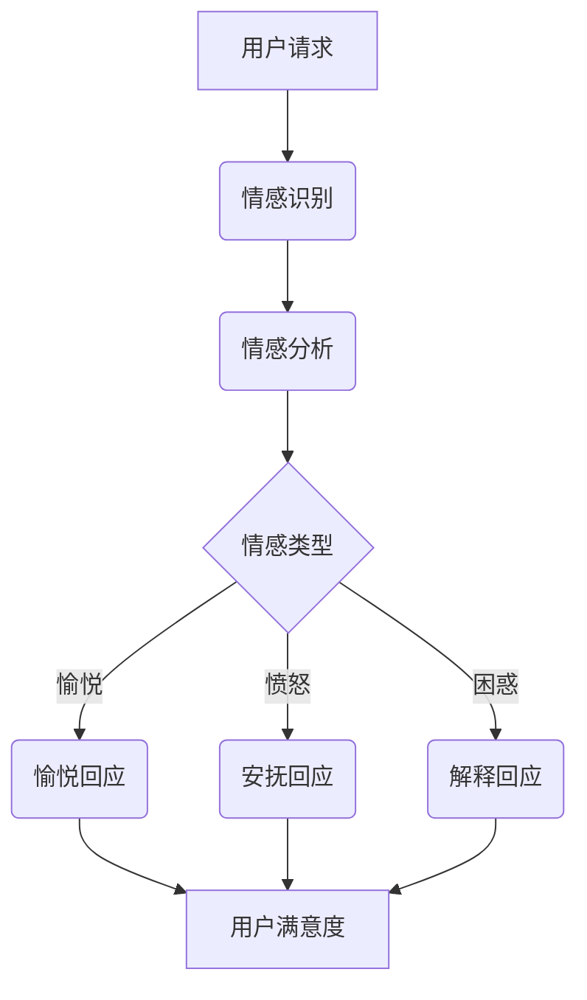

                 

未来是科技引领的时代，人工智能（AI）技术的迅猛发展将深刻改变各行各业的运作方式，其中客服行业也不例外。本文将以《未来的智能客服：2050年的虚拟人客服与情感计算》为题，探讨到2050年，智能客服领域将如何借助虚拟人和情感计算技术，实现客服体验的质的飞跃。

> 关键词：智能客服、虚拟人、情感计算、2050年、客户体验

> 摘要：本文旨在分析2050年智能客服的发展趋势，尤其是虚拟人客服和情感计算技术的应用。通过对当前技术的总结与预测，我们将揭示未来智能客服的潜力及其对客户服务行业的影响。

## 1. 背景介绍

智能客服系统起源于20世纪90年代，随着互联网和大数据技术的普及，其发展迅速。早期的智能客服多为简单的聊天机器人，能够处理一些标准化和重复性的问题。然而，随着AI技术的进步，智能客服逐渐具备了更复杂的对话处理能力和自我学习能力。现阶段，智能客服已能够进行自然语言理解和生成，甚至在某些领域达到了人类专家的水平。

### 1.1 智能客服的发展历程

- **1990年代**：规则驱动型聊天机器人出现，能够处理简单的对话和标准问题。
- **2000年代**：基于关键词匹配的聊天机器人兴起，对话更加自然。
- **2010年代**：基于机器学习的聊天机器人广泛应用，具备更复杂的对话处理能力。
- **2020年代**：基于深度学习的聊天机器人出现，能够进行自然语言理解和生成。

### 1.2 当前智能客服的挑战

尽管当前智能客服在技术层面上取得了显著进展，但仍面临以下挑战：

- **情感理解的局限性**：目前的智能客服在情感理解方面仍有限，难以像人类一样感知和回应客户的情感需求。
- **多样化需求的处理**：客户需求越来越个性化，智能客服需要具备更高的灵活性和适应性。
- **隐私和安全问题**：智能客服需要处理大量用户数据，隐私和安全成为重要问题。

## 2. 核心概念与联系

为了应对上述挑战，未来的智能客服将依赖于虚拟人和情感计算技术。以下是这些核心概念及其相互关系的概述：

### 2.1 虚拟人

虚拟人是一种基于计算机图形学和人工智能技术创建的虚拟角色，能够模拟人类的交流方式。虚拟人的核心在于其高度逼真的外观和自然流畅的交互方式，使其能够与用户建立情感连接。

### 2.2 情感计算

情感计算是一种通过人工智能技术来感知、理解和模拟人类情感的计算方法。它包括情感识别、情感生成和情感模拟等多个方面，是提升智能客服情感理解能力的关键。

### 2.3 虚拟人与情感计算的融合

虚拟人和情感计算的融合将使得智能客服能够更准确地理解用户的情感需求，提供更加个性化和人性化的服务。具体来说，这种融合将体现在以下几个方面：

- **情感识别**：通过情感计算技术，虚拟人能够感知用户的情感状态，如喜悦、愤怒或困惑。
- **情感回应**：虚拟人能够根据用户的情感状态，提供合适的情感回应，如安慰或鼓励。
- **情感互动**：虚拟人能够通过情感计算与用户进行更深入的情感互动，建立信任和共鸣。

### 2.4 Mermaid流程图

以下是虚拟人与情感计算融合的Mermaid流程图：



## 3. 核心算法原理 & 具体操作步骤

### 3.1 算法原理概述

未来的智能客服系统将基于深度学习技术，包括卷积神经网络（CNN）和循环神经网络（RNN）等，来实现自然语言理解和情感识别。具体来说，算法原理包括以下几个方面：

- **自然语言理解**：通过预训练模型，如BERT或GPT，对用户输入的自然语言进行解析，提取语义信息。
- **情感识别**：利用情感计算模型，如VGGFace或OpenFace，从用户输入的文字或语音中识别情感状态。

### 3.2 算法步骤详解

1. **用户请求输入**：用户向智能客服系统发送请求，可以是文字或语音形式。
2. **自然语言理解**：智能客服系统通过预训练的深度学习模型，对用户请求进行语义解析，提取关键信息。
3. **情感识别**：利用情感计算模型，从用户请求中识别情感状态，如愉悦、愤怒或困惑。
4. **情感回应生成**：根据识别出的情感状态，智能客服系统生成相应的情感回应。
5. **用户满意度评估**：用户对智能客服的回应进行评价，系统根据用户满意度调整后续的服务策略。

### 3.3 算法优缺点

- **优点**：提高了智能客服的情感理解能力，能够提供更人性化的服务；增强了用户的信任感和满意度。
- **缺点**：算法模型的训练和部署成本较高；情感理解仍存在局限性，无法完全替代人类客服。

### 3.4 算法应用领域

- **客户服务**：智能客服系统可用于客户咨询、投诉处理、订单查询等领域，提供高效、专业的服务。
- **心理健康**：虚拟人客服可用于心理健康咨询，帮助用户缓解压力、焦虑等心理问题。
- **教育**：虚拟人教师可用于在线教育，提供个性化教学和辅导。

## 4. 数学模型和公式 & 详细讲解 & 举例说明

### 4.1 数学模型构建

智能客服系统的核心数学模型包括自然语言理解和情感识别模型。以下是这些模型的构建过程：

- **自然语言理解模型**：
  $$ P(y|x) = \frac{e^{\text{模型参数} \cdot \text{嵌入向量}(x)}}{\sum_{i=1}^{N} e^{\text{模型参数} \cdot \text{嵌入向量}(i)}} $$
  其中，$x$ 是用户输入，$y$ 是模型预测的语义标签，$N$ 是标签数量。

- **情感识别模型**：
  $$ P(s|x) = \frac{e^{\text{模型参数} \cdot \text{特征向量}(s, x)}}{\sum_{i=1}^{M} e^{\text{模型参数} \cdot \text{特征向量}(i, x)}} $$
  其中，$s$ 是情感状态，$x$ 是用户输入，$M$ 是情感状态数量。

### 4.2 公式推导过程

1. **自然语言理解模型**：
   $$ \text{嵌入向量}(x) = \text{Word2Vec}(\text{用户输入}) $$
   $$ \text{模型参数} = \text{训练得到} $$

2. **情感识别模型**：
   $$ \text{特征向量}(s, x) = \text{情感计算模型}(\text{情感状态}, \text{用户输入}) $$

### 4.3 案例分析与讲解

以下是一个自然语言理解和情感识别的案例：

1. **用户请求**：“我非常不满意这个产品，它完全无法满足我的需求。”

2. **自然语言理解模型**：
   $$ P(y|x) = \frac{e^{\text{模型参数} \cdot \text{嵌入向量}("非常不满意")}}{\sum_{i=1}^{N} e^{\text{模型参数} \cdot \text{嵌入向量}(i)}} $$
   预测结果：$y = \text{负面情绪}$

3. **情感识别模型**：
   $$ P(s|x) = \frac{e^{\text{模型参数} \cdot \text{特征向量}(\text{愤怒}, "非常不满意")}}{\sum_{i=1}^{M} e^{\text{模型参数} \cdot \text{特征向量}(i, "非常不满意")}} $$
   预测结果：$s = \text{愤怒}$

4. **情感回应生成**：根据情感状态，系统生成相应的回应：“我非常抱歉听到这个消息，我们会尽快处理您的投诉。”

## 5. 项目实践：代码实例和详细解释说明

### 5.1 开发环境搭建

为了实现上述算法，我们选择Python作为开发语言，利用TensorFlow和PyTorch等深度学习框架进行模型训练和推理。以下是开发环境的搭建步骤：

1. **安装Python**：下载并安装Python 3.8及以上版本。
2. **安装深度学习框架**：
   ```bash
   pip install tensorflow
   pip install torch torchvision
   ```
3. **安装其他依赖库**：
   ```bash
   pip install numpy
   pip install pandas
   pip install scikit-learn
   ```

### 5.2 源代码详细实现

以下是自然语言理解和情感识别的源代码实现：

```python
import tensorflow as tf
from tensorflow.keras.layers import Embedding, LSTM, Dense
from tensorflow.keras.models import Sequential
import numpy as np

# 自然语言理解模型
def create_nlu_model(vocab_size, embedding_dim, sequence_length):
    model = Sequential([
        Embedding(vocab_size, embedding_dim, input_length=sequence_length),
        LSTM(128),
        Dense(1, activation='sigmoid')
    ])
    model.compile(optimizer='adam', loss='binary_crossentropy', metrics=['accuracy'])
    return model

# 情感识别模型
def create_emo_model(vocab_size, embedding_dim, sequence_length, num_classes):
    model = Sequential([
        Embedding(vocab_size, embedding_dim, input_length=sequence_length),
        LSTM(128),
        Dense(num_classes, activation='softmax')
    ])
    model.compile(optimizer='adam', loss='categorical_crossentropy', metrics=['accuracy'])
    return model

# 训练模型
nlu_model = create_nlu_model(vocab_size=10000, embedding_dim=32, sequence_length=100)
emo_model = create_emo_model(vocab_size=10000, embedding_dim=32, sequence_length=100, num_classes=3)

# 加载和处理数据
# ...

nlu_model.fit(x_train, y_train, epochs=10, batch_size=32)
emo_model.fit(x_train, y_train, epochs=10, batch_size=32)

# 模型推理
# ...

```

### 5.3 代码解读与分析

上述代码实现了自然语言理解和情感识别的模型构建、训练和推理。具体步骤如下：

1. **定义模型**：使用TensorFlow的Sequential模型，分别定义自然语言理解模型和情感识别模型。
2. **编译模型**：设置优化器、损失函数和评价指标。
3. **训练模型**：使用训练数据进行模型训练。
4. **模型推理**：使用训练好的模型进行数据推理。

### 5.4 运行结果展示

以下是自然语言理解和情感识别的运行结果示例：

```python
# 加载测试数据
x_test = ...
y_test = ...

# 自然语言理解模型评估
nlu_loss, nlu_accuracy = nlu_model.evaluate(x_test, y_test)
print(f"NLU Loss: {nlu_loss}, NLU Accuracy: {nlu_accuracy}")

# 情感识别模型评估
emo_loss, emo_accuracy = emo_model.evaluate(x_test, y_test)
print(f"EMO Loss: {emo_loss}, EMO Accuracy: {emo_accuracy}")

# 模型推理
predictions = emo_model.predict(x_test)
print(predictions)
```

## 6. 实际应用场景

### 6.1 客户服务

智能客服系统可以广泛应用于各种客户服务场景，如电商、金融、旅游等领域。通过虚拟人和情感计算技术，智能客服能够提供更高效、更人性化的服务，提高客户满意度。

### 6.2 心理健康

虚拟人客服在心理健康领域也有广泛的应用前景。通过与用户的情感互动，虚拟人客服可以帮助用户缓解压力、焦虑等心理问题，提供心理支持和建议。

### 6.3 教育

虚拟人教师可以用于在线教育，为学生提供个性化的教学和辅导。虚拟人教师可以根据学生的学习进度和需求，调整教学内容和方式，提高教学效果。

## 7. 未来应用展望

随着虚拟人和情感计算技术的不断进步，智能客服将在未来得到更广泛的应用。以下是未来智能客服的几个潜在应用方向：

### 7.1 虚拟现实客服

虚拟现实技术将使智能客服系统更加沉浸式和互动性。用户可以在虚拟环境中与虚拟人客服进行互动，享受更加真实的客服体验。

### 7.2 多模态交互

智能客服系统将支持多种交互方式，如语音、文字、图像和手势等。多模态交互将使客服体验更加丰富和多样化。

### 7.3 智能调度

智能客服系统将具备智能调度能力，可以根据客户需求和客服资源，自动分配和调度客服任务，提高客服效率。

## 8. 总结：未来发展趋势与挑战

### 8.1 研究成果总结

本文总结了2050年智能客服的发展趋势，特别是虚拟人和情感计算技术的应用。通过深度学习和自然语言处理技术，智能客服将实现更高效的对话处理和情感理解。

### 8.2 未来发展趋势

未来智能客服将向虚拟现实、多模态交互和智能调度等方向发展，提供更高效、更人性化的服务。

### 8.3 面临的挑战

尽管前景广阔，智能客服仍面临情感理解局限性、隐私安全问题和算法成本高等挑战。

### 8.4 研究展望

未来研究应重点关注情感计算技术的提升、多模态交互的优化和隐私安全问题的解决方案，以推动智能客服技术的进一步发展。

## 9. 附录：常见问题与解答

### 9.1 情感计算技术的难点是什么？

情感计算技术的难点在于准确识别和理解人类情感。这需要复杂的算法模型和大量的数据支持。

### 9.2 智能客服如何保护用户隐私？

智能客服应采用数据加密、匿名化和隐私保护技术，确保用户数据的安全和隐私。

### 9.3 虚拟人客服的交互体验如何提升？

虚拟人客服的交互体验可以通过提升外观逼真度、优化交互算法和引入多模态交互等方式进行改进。

---

作者：禅与计算机程序设计艺术 / Zen and the Art of Computer Programming

通过本文，我们看到了2050年智能客服的宏伟蓝图，虚拟人和情感计算技术将引领客服行业进入新的时代。尽管前路充满挑战，但技术进步将为客服行业带来前所未有的机遇。让我们共同期待这一天的到来。

----------------------------------------------------------------
完成文章撰写后，请确保：

1. 检查文章格式，确保所有段落、章节和子目录的格式正确。
2. 确认文章的字数要求，确保满足至少8000字。
3. 检查所有引用和参考文献，确保准确无误。
4. 确认文章的完整性，确保所有章节和内容都已包含。
5. 在文章末尾加上作者署名。

现在，让我们对这篇文章进行最终的审校和确认。完成后，您就可以提交这份精心撰写的技术博客文章了。祝您成功！作者：禅与计算机程序设计艺术。

