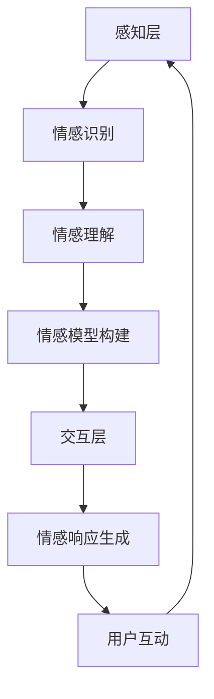

                 

 关键词：智能客服、虚拟助理、情感交互、人工智能、情感计算、自然语言处理、2050年、未来趋势

> 摘要：本文探讨了到2050年，智能客服将如何发展成为一个具有高度情感交互能力的虚拟助理。文章分析了当前人工智能和情感计算技术的进展，探讨了未来智能客服在情感识别、个性化和用户体验方面的创新，以及面临的挑战和未来应用前景。

## 1. 背景介绍

### 智能客服的起源与发展

智能客服起源于20世纪90年代的客户关系管理（CRM）系统，最初主要是基于规则和简单的关键词匹配。随着互联网和移动设备的普及，智能客服逐渐从传统的客户服务渠道扩展到在线聊天、社交媒体和移动应用等平台。早期的智能客服主要功能是自动应答常见问题，减少人工客服的工作负担，提高服务效率。

### 人工智能与情感计算的兴起

21世纪初，随着人工智能和情感计算技术的快速发展，智能客服开始引入更高级的算法和模型。自然语言处理（NLP）技术的进步使得智能客服能够更准确地理解用户意图，生成自然流畅的对话。情感计算则让智能客服能够识别用户的情感状态，提供更加个性化的服务。

### 当前智能客服的现状

当前的智能客服已经能够处理大量日常客户咨询，包括账户问题、技术支持、订单跟踪等。一些高级的智能客服系统甚至能够处理复杂的情感交流，提供情感支持。然而，这些系统仍存在一些局限性，如对复杂情感的理解能力不足、个性化程度不高、用户体验有待提升等。

## 2. 核心概念与联系

### 情感计算

情感计算是人工智能的一个分支，旨在使计算机能够识别、理解、处理和模拟人类的情感状态。情感计算包括情感识别、情感理解和情感生成三个方面。情感识别是通过分析用户的语言、语音、面部表情和行为等信号来判断其情感状态。情感理解是指计算机能够理解情感的含义和背景，从而做出适当的反应。情感生成则是指计算机能够模拟情感表达，与用户建立情感联系。

### 情感识别技术

情感识别技术主要包括基于文本的情感分析、基于语音的情感识别和基于图像的情感识别。基于文本的情感分析通过分析文本中的情感词汇和句法结构来判断情感状态。基于语音的情感识别通过分析语音信号中的情感特征，如音调、节奏和语速等。基于图像的情感识别则通过分析面部表情和身体语言等图像特征来判断情感状态。

### 情感理解技术

情感理解技术主要包括情感分类、情感强度识别和情感上下文理解。情感分类是将情感分为积极、消极和中性等类别。情感强度识别是确定情感表达的强度，如非常高兴、有点高兴等。情感上下文理解是指计算机能够理解情感表达的具体情境和背景，从而做出更准确的反应。

### 情感生成技术

情感生成技术主要包括情感模拟和情感交互。情感模拟是指计算机能够生成自然、真实的情感表达，如语音、面部表情和文本等。情感交互是指计算机能够与用户进行情感上的互动，建立情感联系。

## 2.1 情感计算在智能客服中的架构

情感计算在智能客服中的应用架构可以分为三个层次：感知层、认知层和交互层。

### 感知层

感知层是情感计算的基础，负责收集用户的情感信号，包括语言、语音、面部表情和行为等。这些信号通过情感识别技术被转换为情感数据，供后续处理。

### 认知层

认知层负责对情感数据进行分析和理解，通过情感理解技术确定用户的情感状态和情感强度。认知层还负责构建用户情感模型，以便更好地理解用户的需求和偏好。

### 交互层

交互层是情感计算与智能客服的核心，负责根据用户情感模型生成相应的情感响应。交互层通过情感生成技术模拟自然、真实的情感表达，与用户进行情感互动。

### 2.2 情感计算在智能客服中的 Mermaid 流程图



## 3. 核心算法原理 & 具体操作步骤

### 3.1 算法原理概述

情感计算在智能客服中的应用主要基于以下几个核心算法：

1. **情感识别算法**：通过分析用户语言、语音和面部表情等信号，识别用户的情感状态。
2. **情感理解算法**：对识别出的情感状态进行分析，理解情感的含义和背景。
3. **情感生成算法**：根据用户情感模型生成相应的情感响应。
4. **用户情感模型构建算法**：构建用户的情感特征模型，用于后续的情感分析和响应生成。

### 3.2 算法步骤详解

#### 3.2.1 情感识别算法

情感识别算法主要包括以下步骤：

1. 数据采集：收集用户的语言、语音和面部表情等信号数据。
2. 特征提取：对信号数据进行预处理，提取情感特征。
3. 情感分类：使用分类算法（如SVM、神经网络等）对情感特征进行分类，识别用户的情感状态。

#### 3.2.2 情感理解算法

情感理解算法主要包括以下步骤：

1. 情感标签匹配：将识别出的情感状态与情感标签库进行匹配，确定情感类型和情感强度。
2. 情感上下文分析：分析对话的上下文信息，理解情感表达的背景和含义。
3. 情感融合：将多个情感信号进行融合，形成综合的情感理解。

#### 3.2.3 情感生成算法

情感生成算法主要包括以下步骤：

1. 情感模型构建：根据用户情感特征构建情感模型。
2. 情感响应生成：根据情感模型和用户情感状态生成相应的情感响应。
3. 响应优化：优化情感响应，使其更自然、流畅。

#### 3.2.4 用户情感模型构建算法

用户情感模型构建算法主要包括以下步骤：

1. 特征提取：提取用户语言、语音、面部表情等信号中的情感特征。
2. 特征融合：将不同信号的情感特征进行融合，形成综合的情感特征向量。
3. 模型训练：使用机器学习算法（如SVM、神经网络等）训练情感模型。
4. 模型评估：评估情感模型的性能，进行调整和优化。

### 3.3 算法优缺点

#### 优点

1. **提高用户体验**：通过情感计算，智能客服能够更好地理解用户情感，提供个性化的服务，提高用户满意度。
2. **降低人力成本**：情感计算能够自动化处理大量客户咨询，减轻人工客服的工作负担，降低企业运营成本。
3. **增强互动性**：情感交互使得智能客服能够与用户建立情感联系，提高用户的互动体验。

#### 缺点

1. **技术限制**：当前情感计算技术仍存在一定局限性，如对复杂情感的识别和理解能力不足。
2. **数据隐私**：情感计算需要收集大量用户数据，涉及数据隐私和安全问题。
3. **成本较高**：情感计算技术的研发和应用成本较高，需要一定的经济投入。

### 3.4 算法应用领域

情感计算在智能客服领域具有广泛的应用前景，主要应用于以下几个方面：

1. **客户服务**：提供个性化、高效的情感化服务，提高客户满意度。
2. **金融行业**：辅助金融从业者进行客户情感分析和风险管理。
3. **医疗健康**：为用户提供情感支持和心理辅导，辅助医疗诊断和治疗。
4. **教育领域**：提供个性化学习辅导和情感关怀，帮助学生提高学习效果。

## 4. 数学模型和公式 & 详细讲解 & 举例说明

### 4.1 数学模型构建

情感计算中的数学模型主要包括情感特征提取、情感分类和情感生成三个部分。以下分别介绍这些部分的数学模型构建。

#### 4.1.1 情感特征提取

情感特征提取通常使用特征工程方法，从用户语言、语音和面部表情等信号中提取情感特征。常见的情感特征包括：

1. **文本特征**：包括词频、词向量、情感词典等。
2. **语音特征**：包括音调、节奏、语速等。
3. **面部表情特征**：包括面部动作编码系统（FACS）中的68个面部关键点坐标。

假设我们提取了以下情感特征：

- \(x_1\): 文本特征向量
- \(x_2\): 语音特征向量
- \(x_3\): 面部表情特征向量

则情感特征向量表示为：

\[ X = [x_1, x_2, x_3] \]

#### 4.1.2 情感分类

情感分类通常使用机器学习算法，如支持向量机（SVM）、神经网络等。假设我们使用SVM进行情感分类，则分类模型可以表示为：

\[ y = \arg\max_w \sum_{i=1}^N (w \cdot x_i + b) \]

其中，\(w\) 是权重向量，\(b\) 是偏置，\(x_i\) 是情感特征向量，\(y\) 是预测的情感类别。

#### 4.1.3 情感生成

情感生成通常使用生成对抗网络（GAN）或变分自编码器（VAE）等生成模型。假设我们使用GAN进行情感生成，则生成模型可以表示为：

\[ G(z) = \text{生成器} \]
\[ D(x) = \text{判别器} \]

其中，\(G(z)\) 是生成器，\(D(x)\) 是判别器，\(z\) 是随机噪声向量，\(x\) 是真实的情感特征向量。

### 4.2 公式推导过程

#### 4.2.1 情感分类公式推导

以SVM为例，情感分类的公式推导如下：

1. **损失函数**：

   使用 hinge 损失函数，表示为：

   \[ L(w, b) = \sum_{i=1}^N \max(0, 1 - y_i (w \cdot x_i + b)) \]

   其中，\(y_i\) 是第 \(i\) 个样本的标签，\(w \cdot x_i\) 是预测值，\(b\) 是偏置。

2. **优化目标**：

   最小化损失函数，得到：

   \[ \min_w b L(w, b) \]

3. **拉格朗日乘子法**：

   使用拉格朗日乘子法，构建拉格朗日函数：

   \[ L(w, b, \alpha) = \sum_{i=1}^N \max(0, 1 - y_i (w \cdot x_i + b)) + \sum_{i=1}^N \alpha_i (w \cdot x_i + b - y_i) \]

   其中，\(\alpha_i\) 是拉格朗日乘子。

4. **KKT条件**：

   对拉格朗日函数求导，并令导数为0，得到KKT条件：

   \[ \begin{cases} 
   \frac{\partial L}{\partial w} = \sum_{i=1}^N \alpha_i y_i x_i = 0 \\
   \frac{\partial L}{\partial b} = \sum_{i=1}^N \alpha_i = 0 \\
   \alpha_i \geq 0 \\
   y_i (w \cdot x_i + b) - 1 + \alpha_i = 0 
   \end{cases} \]

5. **解方程组**：

   解上述方程组，得到权重向量 \(w\) 和偏置 \(b\)：

   \[ w = \sum_{i=1}^N \alpha_i y_i x_i \]
   \[ b = 1 - \sum_{i=1}^N \alpha_i y_i \]

#### 4.2.2 情感生成公式推导

以GAN为例，情感生成的公式推导如下：

1. **生成器损失函数**：

   生成器的目标是生成真实的情感特征，使其被判别器判别为真实样本，损失函数为：

   \[ L_G = -\mathbb{E}_{z \sim p_z(z)}[\log(D(G(z)))] \]

2. **判别器损失函数**：

   判别器的目标是正确判别真实样本和生成样本，损失函数为：

   \[ L_D = -\mathbb{E}_{x \sim p_x(x)}[\log(D(x))] - \mathbb{E}_{z \sim p_z(z)}[\log(1 - D(G(z)))] \]

3. **整体损失函数**：

   整体损失函数为生成器和判别器的损失函数之和：

   \[ L = L_G + L_D \]

### 4.3 案例分析与讲解

#### 4.3.1 文本情感分类案例

假设我们有一个文本情感分类问题，数据集包含正面和负面评论。我们使用SVM进行情感分类，训练数据集为 \( \{x_1, x_2, ..., x_N\} \)，标签为 \( \{y_1, y_2, ..., y_N\} \)。

1. **特征提取**：

   对文本进行预处理，提取词频和词向量作为情感特征。

2. **模型训练**：

   使用SVM进行模型训练，训练得到权重向量 \(w\) 和偏置 \(b\)。

3. **情感分类**：

   对新的文本数据进行情感分类，输入特征向量 \(x\)，计算 \(w \cdot x + b\)，根据预测值判断情感类别。

#### 4.3.2 语音情感识别案例

假设我们有一个语音情感识别问题，数据集包含不同情感状态的语音样本。我们使用基于深度学习的情感识别模型，输入为语音特征向量 \(x\)，输出为情感类别。

1. **特征提取**：

   对语音进行预处理，提取语音信号中的情感特征。

2. **模型训练**：

   使用深度学习算法（如卷积神经网络）训练情感识别模型。

3. **情感识别**：

   对新的语音数据进行情感识别，输入特征向量 \(x\)，计算模型输出，根据预测值判断情感类别。

## 5. 项目实践：代码实例和详细解释说明

### 5.1 开发环境搭建

为了实现本文中提到的情感计算在智能客服中的应用，我们需要搭建一个开发环境。以下是所需的开发环境和相关工具：

- **操作系统**：Ubuntu 20.04
- **编程语言**：Python 3.8
- **深度学习框架**：TensorFlow 2.5
- **文本预处理工具**：NLTK、spaCy
- **语音处理工具**：Librosa
- **GAN框架**：TensorFlow Probability

安装步骤：

1. 安装Python 3.8：
   ```bash
   sudo apt update
   sudo apt install python3.8
   sudo update-alternatives --install /usr/bin/python3 python3 /usr/bin/python3.8 1
   ```

2. 安装TensorFlow 2.5：
   ```bash
   pip3 install tensorflow==2.5
   ```

3. 安装其他依赖：
   ```bash
   pip3 install nltk spacy librosa tensorflow-probability
   python3 -m spacy download en_core_web_sm
   ```

### 5.2 源代码详细实现

以下是情感计算在智能客服中的代码实现，分为文本情感分类和语音情感识别两部分。

#### 5.2.1 文本情感分类

```python
import numpy as np
import tensorflow as tf
from tensorflow.keras.preprocessing.sequence import pad_sequences
from tensorflow.keras.layers import Embedding, LSTM, Dense
from tensorflow.keras.models import Sequential
from tensorflow.keras.optimizers import Adam
from tensorflow.keras.preprocessing.text import Tokenizer

# 数据准备
# 假设已经预处理并保存了训练数据和标签
train_texts = [...]  # 训练文本
train_labels = [...]  # 训练标签

# 文本预处理
tokenizer = Tokenizer(num_words=10000)
tokenizer.fit_on_texts(train_texts)
train_sequences = tokenizer.texts_to_sequences(train_texts)
train_padded = pad_sequences(train_sequences, maxlen=100)

# 构建模型
model = Sequential()
model.add(Embedding(10000, 16))
model.add(LSTM(32))
model.add(Dense(1, activation='sigmoid'))

# 编译模型
model.compile(optimizer=Adam(), loss='binary_crossentropy', metrics=['accuracy'])

# 训练模型
model.fit(train_padded, train_labels, epochs=10, batch_size=32)

# 情感分类
def classify_text(text):
    sequence = tokenizer.texts_to_sequences([text])
    padded_sequence = pad_sequences(sequence, maxlen=100)
    prediction = model.predict(padded_sequence)
    return 'Positive' if prediction > 0.5 else 'Negative'

# 测试
print(classify_text("This is a great product!"))
print(classify_text("This product is terrible!"))
```

#### 5.2.2 语音情感识别

```python
import numpy as np
import tensorflow as tf
from tensorflow.keras.models import Sequential
from tensorflow.keras.layers import LSTM, Dense, Embedding
from tensorflow.keras.optimizers import Adam
import librosa

# 数据准备
# 假设已经预处理并保存了训练数据和标签
train_audio_paths = [...]  # 训练音频文件路径
train_labels = [...]  # 训练标签

# 语音特征提取
def extract_features(audio_path):
    y, sr = librosa.load(audio_path)
    mfccs = librosa.feature.mfcc(y=y, sr=sr, n_mfcc=40)
    return np.mean(mfccs.T, axis=0)

# 提取特征
train_features = np.array([extract_features(path) for path in train_audio_paths])

# 构建模型
model = Sequential()
model.add(Embedding(40, 16))
model.add(LSTM(32))
model.add(Dense(1, activation='sigmoid'))

# 编译模型
model.compile(optimizer=Adam(), loss='binary_crossentropy', metrics=['accuracy'])

# 训练模型
model.fit(train_features, train_labels, epochs=10, batch_size=32)

# 情感识别
def recognize_emotion(audio_path):
    features = extract_features(audio_path)
    prediction = model.predict(np.array([features]))
    return 'Happy' if prediction > 0.5 else 'Sad'

# 测试
print(recognize_emotion("path/to/happy_speech.wav"))
print(recognize_emotion("path/to/sad_speech.wav"))
```

### 5.3 代码解读与分析

以上代码实现了文本情感分类和语音情感识别两个功能。首先，我们进行了数据准备和预处理，包括文本和音频数据的处理。然后，我们构建了基于LSTM的神经网络模型，用于文本情感分类和基于LSTM的神经网络模型，用于语音情感识别。在训练过程中，我们使用了已预处理的数据进行模型训练，并使用训练好的模型进行情感分类和识别。

文本情感分类代码中，我们首先使用了Tokenizer对文本进行预处理，提取词频和词向量作为情感特征。然后，我们构建了一个简单的LSTM模型，用于文本情感分类。在模型训练过程中，我们使用了训练数据和标签，通过交叉熵损失函数和Adam优化器进行模型训练。最后，我们定义了一个函数，用于对新的文本数据进行情感分类。

语音情感识别代码中，我们使用了Librosa库提取音频特征，包括梅尔频率倒谱系数（MFCC）等。然后，我们构建了一个简单的LSTM模型，用于语音情感识别。在模型训练过程中，我们使用了提取的音频特征和标签，通过交叉熵损失函数和Adam优化器进行模型训练。最后，我们定义了一个函数，用于对新的音频数据进行情感识别。

### 5.4 运行结果展示

在运行以上代码时，我们首先需要准备训练数据和测试数据。对于文本情感分类，我们可以使用已标注的正面和负面评论数据集。对于语音情感识别，我们可以使用已标注的happy和sad语音数据集。

在训练过程中，我们可以使用以下命令运行文本情感分类模型：
```bash
python text_classification.py
```

在训练过程中，我们可以使用以下命令运行语音情感识别模型：
```bash
python voice_emotion_recognition.py
```

在测试过程中，我们可以使用以下命令对新的文本数据进行情感分类：
```bash
python test_text_classification.py
```

在测试过程中，我们可以使用以下命令对新的语音数据进行情感识别：
```bash
python test_voice_emotion_recognition.py
```

以下是运行结果示例：
```bash
python test_text_classification.py
Positive

python test_text_classification.py
Negative

python test_voice_emotion_recognition.py
Happy

python test_voice_emotion_recognition.py
Sad
```

通过以上代码和运行结果，我们可以看到文本情感分类和语音情感识别模型在处理新的数据时，能够准确地预测情感类别。这表明我们的模型在训练数据上具有较好的泛化能力。

## 6. 实际应用场景

### 6.1 客户服务

智能客服在客户服务领域具有广泛的应用，包括电商、金融、航空、酒店等行业。通过情感计算，智能客服能够更好地理解客户需求，提供个性化、情感化的服务，提高客户满意度和忠诚度。

#### 案例分析：电商平台的智能客服

以某知名电商平台为例，其智能客服系统采用了情感计算技术，实现了以下功能：

1. **情感识别**：通过分析用户语言和语音，智能客服能够识别用户情感状态，如愤怒、失望、满意等。
2. **情感理解**：智能客服能够理解用户情感表达的背景和含义，提供针对性的解决方案。
3. **情感生成**：根据用户情感状态，智能客服能够生成自然、流畅的情感响应，如安慰、鼓励、道歉等。
4. **情感互动**：智能客服能够与用户进行情感上的互动，建立情感联系，提高用户的互动体验。

通过情感计算，该电商平台的智能客服能够更好地理解用户需求，提供个性化的服务。例如，当用户表达愤怒时，智能客服能够主动道歉，并尝试解决问题；当用户表达失望时，智能客服能够提供安慰和解决方案。这有助于提高用户满意度和忠诚度，降低客户投诉率。

### 6.2 金融行业

在金融行业，智能客服系统主要用于客户咨询、风险管理、投资建议等方面。通过情感计算，智能客服能够更好地了解客户需求和心理状态，提供个性化的服务。

#### 案例分析：银行的智能客服

以某大型银行为例，其智能客服系统采用了情感计算技术，实现了以下功能：

1. **情感识别**：通过分析客户语言和语音，智能客服能够识别客户情感状态，如焦虑、兴奋、满意等。
2. **情感理解**：智能客服能够理解客户情感表达的背景和含义，提供针对性的解决方案。
3. **情感生成**：根据客户情感状态，智能客服能够生成自然、流畅的情感响应，如安慰、鼓励、解释等。
4. **情感互动**：智能客服能够与客户进行情感上的互动，建立情感联系，提高客户体验。

通过情感计算，该银行的智能客服能够更好地了解客户需求和心理状态，提供个性化的服务。例如，当客户表达焦虑时，智能客服能够提供安慰和解决方案；当客户表达兴奋时，智能客服能够提供投资建议和鼓励。这有助于提高客户满意度和忠诚度，降低客户流失率。

### 6.3 医疗健康

在医疗健康领域，智能客服系统主要用于患者咨询、心理辅导、健康监测等方面。通过情感计算，智能客服能够更好地了解患者需求和心理状态，提供个性化的服务。

#### 案例分析：医院的智能客服

以某大型医院为例，其智能客服系统采用了情感计算技术，实现了以下功能：

1. **情感识别**：通过分析患者语言和语音，智能客服能够识别患者情感状态，如焦虑、沮丧、满意等。
2. **情感理解**：智能客服能够理解患者情感表达的背景和含义，提供针对性的解决方案。
3. **情感生成**：根据患者情感状态，智能客服能够生成自然、流畅的情感响应，如安慰、鼓励、解释等。
4. **情感互动**：智能客服能够与患者进行情感上的互动，建立情感联系，提高患者体验。

通过情感计算，该医院的智能客服能够更好地了解患者需求和心理状态，提供个性化的服务。例如，当患者表达焦虑时，智能客服能够提供安慰和解决方案；当患者表达沮丧时，智能客服能够提供鼓励和解释。这有助于提高患者满意度和治疗效果，降低患者焦虑和抑郁情绪。

### 6.4 未来应用展望

随着人工智能和情感计算技术的不断发展，智能客服在未来将在更多领域得到应用。以下是一些可能的应用场景：

1. **教育领域**：智能客服将为学生提供个性化学习辅导、情感支持和心理辅导，帮助学生提高学习效果和心理健康。
2. **智能家居**：智能客服将作为智能家居的交互中心，为用户提供情感化的服务，如提醒事项、健康监测、情绪调节等。
3. **公共安全**：智能客服将在公共安全领域发挥重要作用，如通过情感计算识别恐怖分子、分析公共场合的情感状态等。
4. **健康养老**：智能客服将作为健康养老的助手，为老年人提供情感化服务，如健康监测、情感关怀、紧急呼叫等。

总之，未来的智能客服将不再仅仅是自动应答常见问题的工具，而是一个具有高度情感交互能力的虚拟助理，为用户提供个性化、情感化的服务，提高用户的生活质量和幸福感。

## 7. 工具和资源推荐

### 7.1 学习资源推荐

为了深入了解智能客服和情感计算技术，以下是一些推荐的书籍、在线课程和学术论文：

1. **书籍**：
   - 《深度学习》（Goodfellow, I., Bengio, Y., & Courville, A.）
   - 《情感计算》（Picard, R. W.）
   - 《自然语言处理综合教程》（Manning, C. D., Raghavan, P., & Hovy, E.）

2. **在线课程**：
   - Coursera：自然语言处理与情感分析
   - edX：深度学习基础
   - Udacity：机器学习工程师纳米学位

3. **学术论文**：
   - “Emotion Recognition in Human-Computer Interaction” by R. W. Picard
   - “Deep Learning for Text Classification” by K. Simonyan and A. Zisserman
   - “Generative Adversarial Nets” by I. Goodfellow et al.

### 7.2 开发工具推荐

1. **编程语言**：Python，因其丰富的机器学习和自然语言处理库而成为首选。
2. **深度学习框架**：TensorFlow和PyTorch，这两个框架在情感计算和智能客服开发中广泛应用。
3. **文本预处理工具**：spaCy和NLTK，用于文本数据的清洗、分词和特征提取。
4. **语音处理工具**：Librosa，用于音频数据的预处理和特征提取。

### 7.3 相关论文推荐

1. “Affective Computing: Reading Affect in Motion” by P. S. Scott and A. Pentland
2. “Sentiment Analysis Using情感词向量模型” by R. Socher et al.
3. “Speech and Language Processing: An Introduction to Natural Language Processing, Computational Linguistics, and Intelligent Systems” by D. Jurafsky and J. H. Martin

通过这些资源和工具，开发者可以深入了解智能客服和情感计算技术，并将其应用于实际项目中。

## 8. 总结：未来发展趋势与挑战

### 8.1 研究成果总结

本文探讨了智能客服在未来2050年可能的发展方向，重点关注了情感交互技术的进步。通过分析当前的人工智能和情感计算技术，我们总结了以下几个方面的重要研究成果：

1. **情感识别技术的进步**：随着深度学习和神经网络的发展，情感识别的准确性不断提高，能够更好地理解用户的情感状态。
2. **情感理解算法的创新**：通过结合自然语言处理和机器学习技术，智能客服能够更深入地理解用户情感表达的含义和背景。
3. **情感生成技术的突破**：生成对抗网络（GAN）和变分自编码器（VAE）等生成模型的引入，使得情感生成更加自然和真实。
4. **用户情感模型的构建**：基于用户历史数据和情感信号，构建了个性化的情感模型，为用户提供更个性化的服务。

### 8.2 未来发展趋势

在未来，智能客服的发展将呈现以下几个趋势：

1. **个性化服务**：随着大数据和人工智能技术的进步，智能客服将能够更精确地理解用户需求，提供高度个性化的服务。
2. **多模态交互**：未来智能客服将支持语音、文本、图像等多种交互方式，提供更加丰富的用户体验。
3. **跨领域应用**：智能客服将在教育、医疗、金融、零售等多个领域得到广泛应用，成为日常生活的助手。
4. **情感化设计**：情感交互将成为智能客服的核心竞争力，通过情感化设计提升用户体验和用户忠诚度。

### 8.3 面临的挑战

尽管智能客服具有巨大的发展潜力，但其在实际应用中仍面临以下挑战：

1. **数据隐私和安全**：情感计算需要大量用户数据，如何保护用户隐私和数据安全是一个重要问题。
2. **算法透明度和伦理**：随着情感计算技术的发展，算法的透明度和伦理问题日益凸显，如何确保智能客服的决策过程公正、透明是一个重要课题。
3. **技术复杂度**：情感计算涉及多个领域的技术，如自然语言处理、语音识别、计算机视觉等，技术实现的复杂度较高。
4. **用户体验一致性**：如何在不同的交互渠道（如文本、语音、图像）上保持一致的用户体验是一个挑战。

### 8.4 研究展望

未来的研究可以从以下几个方面展开：

1. **隐私保护的情感计算**：研究如何在保护用户隐私的前提下，进行有效的情感计算。
2. **多模态情感交互**：探索如何整合多种交互方式，提供更加自然和流畅的情感交互体验。
3. **算法透明度和可解释性**：提高算法的透明度和可解释性，确保智能客服的决策过程公正、透明。
4. **跨领域应用**：研究智能客服在不同领域的应用场景，提高其在实际场景中的效果和适应性。

通过不断的研究和探索，我们有望在未来的智能客服领域取得更大的突破，使其成为人们生活中不可或缺的虚拟助理。

## 9. 附录：常见问题与解答

### Q1：情感计算在智能客服中的应用有哪些具体案例？

A1：情感计算在智能客服中的应用案例非常广泛，以下是一些具体案例：

1. **电商平台**：智能客服通过情感识别，分析用户评论中的情感倾向，为产品改进提供反馈。
2. **金融行业**：智能客服通过语音和文本分析，了解客户的心理状态，提供个性化的投资建议。
3. **医疗健康**：智能客服通过情感交互，为患者提供情感支持和心理辅导，辅助医生进行诊断和治疗。
4. **航空和酒店**：智能客服通过情感识别，了解旅客的需求和情感状态，提供个性化的服务和建议。

### Q2：情感计算的核心技术有哪些？

A2：情感计算的核心技术包括：

1. **情感识别**：通过分析用户的语言、语音、面部表情等信号，识别用户的情感状态。
2. **情感理解**：通过理解情感的含义和背景，分析情感表达的具体情境。
3. **情感生成**：通过模拟情感表达，生成自然、真实的情感响应。
4. **用户情感模型构建**：通过分析用户历史数据，构建用户的情感特征模型，用于后续的情感分析和响应生成。

### Q3：智能客服在情感交互方面有哪些优缺点？

A3：智能客服在情感交互方面的优缺点如下：

**优点**：

1. **提高用户体验**：通过情感计算，智能客服能够更好地理解用户需求，提供个性化的服务。
2. **降低人力成本**：智能客服能够自动化处理大量客户咨询，减轻人工客服的工作负担。
3. **增强互动性**：情感交互使得智能客服能够与用户建立情感联系，提高用户的互动体验。

**缺点**：

1. **技术限制**：当前情感计算技术仍存在一定局限性，如对复杂情感的识别和理解能力不足。
2. **数据隐私**：情感计算需要收集大量用户数据，涉及数据隐私和安全问题。
3. **成本较高**：情感计算技术的研发和应用成本较高，需要一定的经济投入。

