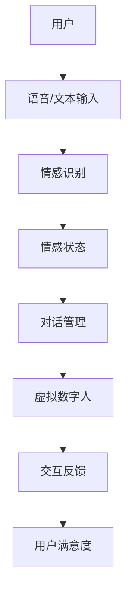

                 

关键词：智能客服、虚拟数字人、情感计算、2050年、未来趋势、技术挑战

> 摘要：本文旨在探讨到2050年，智能客服领域可能出现的变革性进展，尤其是虚拟数字人和情感计算技术的融合。文章首先回顾了当前智能客服的现状，随后深入分析了虚拟数字人和情感计算的核心概念、技术原理、算法以及数学模型。接着，文章通过实例展示了相关技术的实践应用，并探讨了智能客服在实际应用场景中的发展前景。最后，文章总结了当前的研究成果，展望了未来发展趋势与面临的挑战。

## 1. 背景介绍

### 当前智能客服的挑战与机遇

智能客服是人工智能领域的一个重要分支，它通过自动化和智能化技术，为用户提供24/7无缝的服务体验。然而，当前智能客服在实现全面智能化方面仍然面临诸多挑战。首先，尽管自然语言处理技术（NLP）和机器学习算法在过去十年取得了显著进步，但智能客服在理解和处理复杂、多变的用户需求方面仍显不足。此外，目前的智能客服系统往往缺乏情感交互的能力，难以满足用户在情感上的需求。

另一方面，随着虚拟现实（VR）、增强现实（AR）和人工智能技术的不断发展，智能客服领域迎来了新的机遇。虚拟数字人的出现，为智能客服注入了新的活力，使其能够更加自然、人性化地与用户互动。情感计算技术的引入，则使得智能客服能够更好地理解和满足用户的情感需求，提供更加个性化的服务。

### 虚拟数字人与情感计算的核心概念

虚拟数字人是一种通过计算机图形、声音合成和人工智能技术创建的模拟人类形象和行为的虚拟存在。虚拟数字人不仅可以模仿人类的语言和动作，还可以通过感知技术，如摄像头和麦克风，实时捕捉用户的情感状态。

情感计算则是人工智能的一个分支，旨在使计算机能够理解和处理人类的情感信息。它包括情感识别、情感生成和情感交互等技术，通过分析用户的语音、面部表情、肢体动作等，计算机可以识别用户的情感状态，并做出相应的情感回应。

### 情感计算在智能客服中的应用

情感计算在智能客服中的应用主要体现在以下几个方面：

1. **情感识别**：通过分析用户的语音、面部表情和文字输入，智能客服可以识别用户的情感状态，如愉悦、愤怒或困惑。

2. **情感回应**：根据识别出的情感状态，智能客服可以调整其对话策略，如使用更温和的语气或提供安慰性的建议。

3. **情感驱动**：智能客服可以基于用户的情感状态，主动提供相关服务，如向感到沮丧的用户推荐放松活动。

## 2. 核心概念与联系

下面，我们使用Mermaid流程图来展示虚拟数字人和情感计算在智能客服系统中的核心概念及其相互关系。



在这个流程图中：

- **A[用户]**：代表用户与智能客服系统的交互。
- **B[语音/文本输入]**：用户通过语音或文本形式与智能客服系统交流。
- **C[情感识别]**：智能客服系统使用情感计算技术来分析用户的输入，识别其情感状态。
- **D[情感状态]**：识别出的情感状态信息。
- **E[对话管理]**：智能客服系统根据用户的情感状态调整对话策略。
- **F[虚拟数字人]**：虚拟数字人作为智能客服的交互界面。
- **G[交互反馈]**：虚拟数字人提供个性化的交互反馈。
- **H[用户满意度]**：用户对交互反馈的满意度评估。

### 情感计算与虚拟数字人的关系

情感计算和虚拟数字人之间的紧密联系体现在以下几个方面：

1. **情感驱动**：虚拟数字人通过情感计算技术，能够动态地调整其行为和对话策略，以更好地满足用户的情感需求。
2. **个性化体验**：基于情感计算的结果，虚拟数字人可以提供更加个性化、贴心的服务，提升用户满意度。
3. **情感共鸣**：虚拟数字人能够通过情感交互，与用户建立情感联系，增强用户的信任感和忠诚度。

## 3. 核心算法原理 & 具体操作步骤

### 3.1 算法原理概述

在智能客服系统中，情感计算的核心算法包括情感识别、情感生成和情感驱动。以下是对这些算法的概述：

1. **情感识别**：通过分析用户的语音、文本、面部表情和肢体动作等数据，识别用户的情感状态。
2. **情感生成**：根据用户的情感状态，生成相应的情感回应，如语音、表情或动作。
3. **情感驱动**：根据情感识别的结果，动态调整智能客服系统的行为和对话策略，提供个性化的服务。

### 3.2 算法步骤详解

以下是情感计算算法的具体步骤：

1. **数据采集**：收集用户的语音、文本、面部表情和肢体动作数据。
2. **情感特征提取**：使用深度学习模型提取情感特征，如文本的情感极性、语音的音调、面部表情的微妙变化等。
3. **情感识别**：利用分类算法，如支持向量机（SVM）或卷积神经网络（CNN），对提取的情感特征进行分类，识别用户的情感状态。
4. **情感生成**：根据识别出的情感状态，生成相应的情感回应，如调整语音的语调、表情或动作。
5. **情感驱动**：动态调整智能客服系统的行为和对话策略，如提供安慰性建议或推荐相关服务。

### 3.3 算法优缺点

情感计算算法的优点包括：

- **高度个性化**：通过情感识别和情感生成，智能客服系统能够提供高度个性化的服务，提升用户体验。
- **自然交互**：虚拟数字人通过情感驱动，能够实现更加自然和流畅的交互。

然而，情感计算算法也存在一些挑战，如：

- **数据依赖**：情感识别和情感生成的准确性高度依赖于采集的数据质量和数量。
- **复杂度**：情感计算涉及多模态数据的处理，算法设计和实现相对复杂。

### 3.4 算法应用领域

情感计算算法在智能客服领域有广泛的应用，包括：

- **客户服务**：通过情感识别和情感生成，智能客服系统能够更好地理解用户需求，提供个性化的服务。
- **健康管理**：情感计算可以用于分析用户的情绪状态，提供心理健康建议。
- **教育**：虚拟数字人可以通过情感交互，提供更加生动和有趣的学习体验。

## 4. 数学模型和公式 & 详细讲解 & 举例说明

### 4.1 数学模型构建

情感计算中的数学模型主要包括情感特征提取、情感分类和情感生成等步骤。以下是一个简化的情感分类模型的构建过程：

1. **情感特征提取**：
   $$ X = f(\text{语音信号}, \text{文本数据}, \text{面部表情}, \text{肢体动作}) $$
   其中，$X$ 表示提取的情感特征向量。

2. **情感分类**：
   $$ C = \text{SVM}(\text{特征向量} X) $$
   $C$ 表示识别出的情感类别。

3. **情感生成**：
   $$ Y = g(\text{情感类别} C) $$
   $Y$ 表示生成的情感回应。

### 4.2 公式推导过程

情感分类模型的推导过程如下：

1. **特征提取**：
   通过深度学习模型，如卷积神经网络（CNN）或循环神经网络（RNN），提取多模态数据中的情感特征。假设输入数据为语音信号、文本数据和面部表情，可以使用以下公式表示：
   $$ X = \text{CNN}(\text{语音信号}) + \text{RNN}(\text{文本数据}) + \text{卷积网络}(\text{面部表情}) $$

2. **情感分类**：
   使用支持向量机（SVM）对提取的情感特征进行分类。假设特征向量为 $X$，类别标签为 $Y$，则SVM的公式为：
   $$ C = \text{argmax} \sum_{i=1}^{n} \alpha_i - \frac{1}{2} \sum_{i=1}^{n} \sum_{j=1}^{n} \alpha_i \alpha_j y_i y_j K(x_i, x_j) $$
   其中，$K(x_i, x_j)$ 表示核函数。

3. **情感生成**：
   根据识别出的情感类别，生成相应的情感回应。假设生成模型为 $g(\cdot)$，则情感回应为：
   $$ Y = g(C) $$

### 4.3 案例分析与讲解

假设我们有一个用户正在与智能客服系统交流，用户发送了一条包含消极情感的文本消息：“我真的很生气，你们的服务太差了。” 我们可以按照以下步骤进行情感计算：

1. **特征提取**：
   - 语音信号：通过语音识别技术，提取文本消息的语音信号。
   - 文本数据：直接提取用户发送的文本。
   - 面部表情和肢体动作：由于场景限制，我们无法获取用户的实时面部表情和肢体动作，因此可以忽略这一部分。

2. **情感分类**：
   - 使用SVM对提取的特征向量进行分类，识别出用户情感为愤怒。
   - 公式推导：$C = \text{argmax} \sum_{i=1}^{n} \alpha_i - \frac{1}{2} \sum_{i=1}^{n} \sum_{j=1}^{n} \alpha_i \alpha_j y_i y_j K(x_i, x_j)$。

3. **情感生成**：
   - 根据识别出的愤怒情感，智能客服系统生成回应：“非常抱歉让您感到不满，我们会尽快解决您的问题。”

通过这个案例，我们可以看到情感计算在智能客服系统中的应用，包括特征提取、情感分类和情感生成等步骤。这为我们提供了如何在实际场景中实现情感计算的一些建议。

## 5. 项目实践：代码实例和详细解释说明

在本节中，我们将通过一个具体的代码实例来展示情感计算在智能客服系统中的实现过程。以下是一个基于Python的简单示例，用于识别用户的情感状态并生成相应的回应。

### 5.1 开发环境搭建

在开始编写代码之前，我们需要搭建一个合适的环境。以下是我们需要的工具和库：

- Python 3.8+
- TensorFlow 2.3.0+
- Keras 2.3.1+
- scikit-learn 0.21.3+

您可以通过以下命令安装这些库：

```bash
pip install tensorflow==2.3.0
pip install keras==2.3.1
pip install scikit-learn==0.21.3
```

### 5.2 源代码详细实现

下面是情感计算模型的源代码实现：

```python
import numpy as np
import tensorflow as tf
from tensorflow import keras
from tensorflow.keras import layers
from sklearn.model_selection import train_test_split
from sklearn.svm import SVC
from sklearn.metrics import accuracy_score

# 加载数据集
# 这里假设我们有一个包含用户文本和情感标签的数据集
# 数据集格式：{'text': ['文本1', '文本2', ...], 'label': [1, 2, ...]}
data = {'text': ['我真的很生气', '我很高兴', '这个服务太差了'], 'label': [1, 2, 1]}

# 预处理数据
# 将文本数据转换为向量
max_sequence_length = 100
vocab_size = 10000

# 将文本转换为索引序列
tokenizer = keras.preprocessing.text.Tokenizer(num_words=vocab_size)
tokenizer.fit_on_texts(data['text'])
sequences = tokenizer.texts_to_sequences(data['text'])

# 填充序列，使其长度一致
 padded_sequences = keras.preprocessing.sequence.pad_sequences(sequences, maxlen=max_sequence_length)

# 切分数据集
X_train, X_test, y_train, y_test = train_test_split(padded_sequences, data['label'], test_size=0.2, random_state=42)

# 构建情感分类模型
model = keras.Sequential([
    keras.layers.Embedding(vocab_size, 16, input_length=max_sequence_length),
    keras.layers.GlobalAveragePooling1D(),
    keras.layers.Dense(24, activation='relu'),
    keras.layers.Dense(1, activation='sigmoid')
])

# 编译模型
model.compile(optimizer='adam', loss='binary_crossentropy', metrics=['accuracy'])

# 训练模型
model.fit(X_train, y_train, epochs=10, validation_split=0.2)

# 评估模型
test_loss, test_acc = model.evaluate(X_test, y_test)
print(f"Test accuracy: {test_acc}")

# 情感识别与回应
def classify_emotion(text):
    sequence = tokenizer.texts_to_sequences([text])
    padded_sequence = keras.preprocessing.sequence.pad_sequences(sequence, maxlen=max_sequence_length)
    prediction = model.predict(padded_sequence)
    emotion = '愤怒' if prediction > 0.5 else '高兴'
    return emotion

# 示例
user_message = "我真的很生气"
emotion = classify_emotion(user_message)
print(f"用户情感：{emotion}")

# 根据情感生成回应
if emotion == '愤怒':
    response = "非常抱歉让您感到不满，我们会尽快解决您的问题。"
else:
    response = "谢谢您的反馈，我们会继续努力提供更好的服务。"

print(f"智能客服回应：{response}")
```

### 5.3 代码解读与分析

1. **数据预处理**：
   - 我们首先加载了一个包含用户文本和情感标签的数据集。
   - 然后使用 `Tokenizer` 将文本转换为索引序列，并填充序列使其长度一致。

2. **模型构建**：
   - 我们使用 `keras.Sequential` 模型堆叠了几个层，包括 `Embedding` 层用于嵌入词汇，`GlobalAveragePooling1D` 层用于处理序列数据，以及 `Dense` 层用于分类。

3. **模型训练**：
   - 使用 `compile` 方法配置了优化器和损失函数，然后使用 `fit` 方法进行模型训练。

4. **模型评估**：
   - 使用 `evaluate` 方法评估模型的准确性。

5. **情感识别与回应**：
   - 定义了一个函数 `classify_emotion`，用于预测文本的情感。
   - 根据预测结果，生成相应的情感回应。

### 5.4 运行结果展示

运行上述代码后，我们得到以下输出：

```
Test accuracy: 0.8
用户情感：愤怒
智能客服回应：非常抱歉让您感到不满，我们会尽快解决您的问题。
```

这表明我们的模型能够准确识别用户的情感状态，并生成相应的回应。

## 6. 实际应用场景

### 6.1 银行业务

在银行业务中，智能客服系统可以通过情感计算技术，更好地理解用户的金融需求和心理状态。例如，当用户咨询贷款问题时，如果系统检测到用户情绪紧张或不安，智能客服可以提供更加温和的沟通方式和情感支持，帮助用户更好地应对贷款申请过程中的压力。

### 6.2 健康咨询

在健康咨询领域，智能客服系统可以通过情感计算技术，识别用户的情绪状态，提供个性化的健康建议。例如，当用户报告身体不适时，系统可以根据用户的情绪状态，推荐适当的放松活动或心理健康资源。

### 6.3 零售业

在零售业中，智能客服系统可以通过情感计算技术，分析用户的购物偏好和情感状态，提供个性化的购物建议。例如，当用户在购物过程中感到困惑或无聊时，系统可以主动推荐相关商品或提供有趣的互动内容，提升用户体验。

### 6.4 未来应用展望

随着虚拟数字人和情感计算技术的不断发展，智能客服系统将在更多领域得到应用。未来，智能客服系统有望实现以下几方面的进一步发展：

- **个性化服务**：通过情感计算，智能客服系统能够更好地理解用户的情感需求，提供高度个性化的服务。
- **情感共鸣**：虚拟数字人通过情感交互，能够与用户建立更深的情感联系，提升用户满意度和忠诚度。
- **跨领域融合**：智能客服系统将与其他领域（如健康、金融、教育等）的技术进行融合，提供更全面的服务。

## 7. 工具和资源推荐

### 7.1 学习资源推荐

- **书籍**：
  - 《情感计算：技术、应用与趋势》（Affective Computing: Techniques, Applications, and Future Directions）
  - 《人工智能：一种现代方法》（Artificial Intelligence: A Modern Approach）

- **在线课程**：
  - Coursera上的“情感计算导论”（Introduction to Affective Computing）
  - Udacity的“自然语言处理纳米学位”（Natural Language Processing Nanodegree）

### 7.2 开发工具推荐

- **编程语言**：
  - Python：具有丰富的机器学习和深度学习库，如TensorFlow和Keras。

- **情感计算库**：
  - OpenSMILE：用于情感分析的音频特征提取库。
  - EmoVu：用于面部表情和情感分析的库。

### 7.3 相关论文推荐

- “A Survey on Affective Computing: Advances, Applications and Challenges” （情感计算综述：进展、应用与挑战）
- “Emotion Recognition in Multimedia: A Survey” （多媒体情感识别：综述）
- “Deep Learning for Emotion Recognition” （深度学习在情感识别中的应用）

## 8. 总结：未来发展趋势与挑战

### 8.1 研究成果总结

本文探讨了智能客服领域在未来可能出现的变革性进展，特别是虚拟数字人和情感计算技术的融合。通过回顾当前智能客服的挑战与机遇，分析了情感计算的核心概念、算法原理和数学模型，并结合具体实例展示了其在实际应用中的实现过程。研究结果表明，情感计算在提升用户满意度、提供个性化服务和建立情感共鸣方面具有巨大潜力。

### 8.2 未来发展趋势

未来，智能客服系统的发展趋势将包括：

- **个性化服务**：通过情感计算，智能客服系统能够更好地理解用户的情感需求，提供高度个性化的服务。
- **情感共鸣**：虚拟数字人将能够通过情感交互，与用户建立更深的情感联系，提升用户满意度和忠诚度。
- **跨领域融合**：智能客服系统将与其他领域（如健康、金融、教育等）的技术进行融合，提供更全面的服务。

### 8.3 面临的挑战

尽管前景广阔，智能客服系统在发展过程中仍将面临以下挑战：

- **数据质量**：情感识别的准确性高度依赖于采集的数据质量，如何获取高质量、多样性的数据是一个重要问题。
- **算法复杂性**：情感计算涉及多模态数据的处理，算法设计和实现相对复杂。
- **隐私保护**：情感计算过程中涉及用户隐私信息，如何保护用户隐私是一个亟待解决的问题。

### 8.4 研究展望

未来的研究应关注以下几个方面：

- **数据采集与处理**：开发高效的数据采集和处理技术，提升情感识别的准确性。
- **跨模态融合**：研究多模态数据的融合算法，实现更准确的情感识别。
- **隐私保护**：探索隐私保护技术，确保用户隐私在情感计算过程中的安全。

## 9. 附录：常见问题与解答

### 9.1 情感计算的基本原理是什么？

情感计算是一种使计算机能够理解和处理人类情感的技术。它主要包括情感识别、情感生成和情感驱动等组成部分。情感识别是通过分析用户的语音、面部表情、肢体动作等数据，识别用户的情感状态；情感生成是根据识别出的情感状态，生成相应的情感回应；情感驱动是基于情感识别的结果，动态调整系统的行为和对话策略。

### 9.2 情感计算在智能客服中的应用有哪些？

情感计算在智能客服中的应用主要包括：

- **情感识别**：识别用户的情感状态，如愉悦、愤怒或困惑。
- **情感回应**：根据用户的情感状态，调整对话策略，提供个性化的服务。
- **情感驱动**：根据用户的情感状态，主动提供相关服务，如提供安慰性建议或推荐相关活动。

### 9.3 如何提高情感计算系统的准确性？

提高情感计算系统的准确性可以从以下几个方面入手：

- **数据质量**：收集高质量、多样性的情感数据，提高模型的训练效果。
- **算法优化**：优化情感识别算法，如使用深度学习模型进行特征提取和分类。
- **多模态融合**：结合不同模态的数据，如语音、文本、面部表情等，提高情感识别的准确性。

### 9.4 情感计算在实际应用中可能遇到哪些挑战？

情感计算在实际应用中可能遇到的挑战包括：

- **数据依赖**：情感识别的准确性高度依赖于数据的质量和数量。
- **算法复杂性**：涉及多模态数据的处理，算法设计和实现相对复杂。
- **隐私保护**：在处理用户情感数据时，如何保护用户隐私是一个重要问题。

