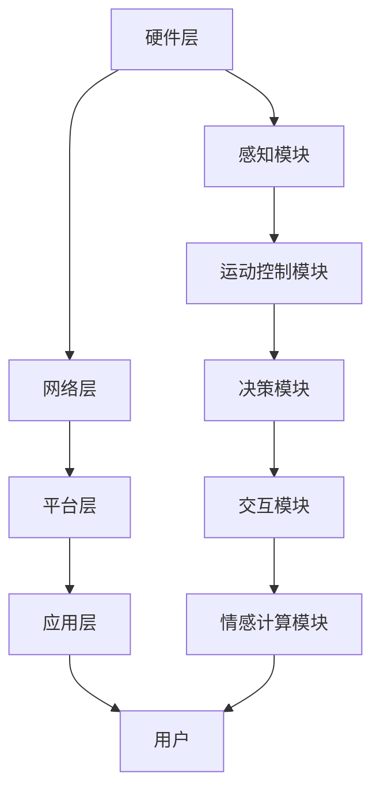

                 

### 1. 背景介绍

智能家居作为现代科技与生活紧密融合的产物，自20世纪末以来，随着信息技术、物联网（IoT）和人工智能（AI）的迅猛发展，逐步走入了大众的日常生活。家庭机器人作为智能家居的重要组成部分，承担着从日常家务到情感陪伴的多重任务。随着技术的发展，这些机器人正变得更加智能化、个性化，并在家庭中扮演着越来越重要的角色。

近年来，家庭机器人在技术上的突破主要体现在以下几个方面：

1. **传感器与计算能力提升**：传感技术的发展使得家庭机器人能够感知环境变化，进行精准定位和导航。计算能力的提升则让它们能够处理更加复杂的任务，如语音识别、图像识别和自然语言处理。

2. **物联网技术的普及**：智能家居设备通过物联网技术实现互联互通，使得家庭机器人能够与其他家电、安防系统等进行数据交换和协作，从而提供更智能、更便捷的服务。

3. **人工智能算法的进步**：深度学习、强化学习等AI算法的应用，使得家庭机器人能够更好地理解人类行为，预测用户需求，并在此基础上提供个性化的服务。

4. **情感计算的发展**：情感计算技术的进步使得家庭机器人能够识别和模拟人类的情感，实现与家庭成员的情感互动。

然而，随着技术的进步，家庭机器人也面临着一些挑战，如隐私保护、安全性和伦理问题。因此，本文旨在探讨未来智能家居中家庭机器人的发展趋势，分析其关键技术、应用场景以及面临的挑战，并展望其未来发展方向。

### 2. 核心概念与联系

#### 2.1 智能家居系统架构

智能家居系统是一个复杂的多层次架构，涉及硬件、软件、网络通信等多个方面。其核心概念包括设备互联、智能控制和用户交互。

1. **硬件层**：包括各种智能家居设备，如智能灯泡、智能插座、智能冰箱、智能摄像头等。这些设备通过传感器收集环境数据，并通过物联网连接到网络。

2. **网络层**：负责将家庭内的各种设备连接起来，实现数据传输和通信。常见的网络技术有Wi-Fi、蓝牙、ZigBee等。

3. **平台层**：是智能家居系统的核心，负责设备管理、数据分析和智能控制。平台通常运行在云服务器上，提供统一的接口，实现设备间的协调和控制。

4. **应用层**：是用户与智能家居系统交互的界面，包括手机APP、网页界面、语音助手等。用户通过这些界面可以远程控制智能家居设备，查看设备状态，设置自动化规则等。

#### 2.2 家庭机器人功能模块

家庭机器人是智能家居系统中的关键角色，其功能模块通常包括：

1. **感知模块**：包括各种传感器，如摄像头、麦克风、温度传感器、湿度传感器等。这些传感器能够帮助机器人感知环境，获取用户行为数据。

2. **运动控制模块**：负责机器人的移动和导航。通过内置的电机和轮子，机器人可以在家庭环境中自主移动。

3. **决策模块**：基于感知模块获取的数据，决策模块使用AI算法分析用户需求，规划机器人的行动路径。

4. **交互模块**：通过语音识别、语音合成等技术实现与用户的自然语言交互，提供语音服务和指令执行。

5. **情感计算模块**：使用情感计算技术识别和模拟人类情感，实现与用户的情感互动。

#### 2.3 系统架构的 Mermaid 流程图

下面是一个简化的智能家居系统架构的 Mermaid 流程图：



在未来的智能家居系统中，家庭机器人将作为智能家居系统的核心执行者，通过感知用户需求、智能决策和情感互动，为用户提供更加个性化、便捷的服务。同时，家庭机器人也将面临隐私保护、安全性和伦理等挑战，需要我们在技术发展中持续关注和解决。

### 3. 核心算法原理 & 具体操作步骤

#### 3.1 算法原理概述

在智能家居系统中，家庭机器人的核心算法通常包括感知、决策和交互三个主要部分。以下是这些算法的原理概述：

1. **感知算法**：感知算法是家庭机器人的基础，通过各种传感器获取环境信息和用户行为数据。常见的感知算法包括图像识别、语音识别和姿态识别等。这些算法利用深度学习、强化学习等技术，实现对环境的精确感知。

2. **决策算法**：决策算法基于感知模块提供的数据，分析用户需求，并规划机器人的行动路径。常见的决策算法包括路径规划、资源分配和任务调度等。这些算法需要综合考虑环境状态、用户需求和机器人自身的限制。

3. **交互算法**：交互算法实现家庭机器人与用户的自然语言交互。常见的交互算法包括语音识别、语音合成和对话系统等。这些算法利用自然语言处理、对话系统技术，实现与用户的顺畅沟通。

#### 3.2 算法步骤详解

以下是对核心算法的具体操作步骤的详细描述：

1. **感知算法**

   - **图像识别**：通过卷积神经网络（CNN）对摄像头捕获的图像进行分类和识别。步骤包括图像预处理、特征提取和分类。

   - **语音识别**：通过深度神经网络（DNN）对麦克风捕获的语音信号进行识别。步骤包括语音预处理、特征提取和声学建模。

   - **姿态识别**：通过姿态估计算法（如PoseNet）对摄像头捕获的图像进行姿态识别。步骤包括图像预处理、特征提取和姿态估计。

2. **决策算法**

   - **路径规划**：使用A*算法或RRT算法等规划算法，计算从当前位置到目标位置的路径。步骤包括环境建模、目标点和障碍物检测、路径搜索。

   - **资源分配**：使用贪心算法或动态规划算法等资源分配算法，优化机器人的资源利用。步骤包括资源状态监测、目标评估和资源分配。

   - **任务调度**：使用基于优先级的调度算法，分配机器人的任务和行动顺序。步骤包括任务列表生成、优先级评估和任务分配。

3. **交互算法**

   - **语音识别**：使用DNN对语音信号进行识别，转化为文本。步骤包括声学建模、语言建模和解码。

   - **语音合成**：使用文本到语音（TTS）技术，将文本转化为语音。步骤包括文本预处理、声学模型生成和语音合成。

   - **对话系统**：使用对话管理算法，维护对话的状态和上下文。步骤包括意图识别、对话状态追踪和回复生成。

#### 3.3 算法优缺点

- **感知算法**：优点在于能够实现对环境的实时感知，提高机器人的自主性和响应速度；缺点在于对传感器精度和数据处理能力要求较高。

- **决策算法**：优点在于能够提高机器人的决策效率，优化资源利用；缺点在于算法复杂度较高，计算资源需求大。

- **交互算法**：优点在于能够实现与用户的自然语言交互，提高用户体验；缺点在于对自然语言理解的要求较高，实现难度大。

#### 3.4 算法应用领域

- **感知算法**：广泛应用于安防监控、智能家居、智能交通等领域。

- **决策算法**：广泛应用于无人驾驶、机器人导航、资源优化等领域。

- **交互算法**：广泛应用于智能客服、智能语音助手、智能翻译等领域。

#### 3.5 算法在实际应用中的实现

以下是一个简单的感知算法——图像识别在实际应用中的实现步骤：

1. **数据准备**：收集并标注大量训练数据，用于训练卷积神经网络。

2. **模型训练**：使用训练数据训练卷积神经网络，包括前向传播、反向传播和优化算法。

3. **模型评估**：使用测试数据评估模型性能，包括准确率、召回率和F1值等指标。

4. **模型部署**：将训练好的模型部署到家庭机器人中，进行实时图像识别。

通过以上步骤，家庭机器人能够实现对摄像头捕获的图像进行实时分类和识别，为后续的决策和交互提供基础。

#### 3.6 算法在实际应用中的案例分析

以下是一个案例：使用家庭机器人进行家庭安全监控。

1. **感知阶段**：家庭机器人通过摄像头捕获家庭环境中的图像，使用图像识别算法识别图像中的物体和人物。

2. **决策阶段**：家庭机器人分析图像识别结果，判断是否有异常情况，如非法入侵、火灾等。

3. **交互阶段**：家庭机器人通过语音合成与用户进行交互，报告异常情况，并提出相应的建议。

通过以上阶段，家庭机器人能够实现家庭安全监控，提高家庭安全性。

### 4. 数学模型和公式 & 详细讲解 & 举例说明

在智能家居系统中，数学模型和公式是理解和设计核心算法的关键。以下将详细讲解数学模型的构建、公式推导过程以及具体案例的说明。

#### 4.1 数学模型构建

智能家居系统的数学模型通常包含以下几个方面：

1. **环境建模**：用于描述家庭环境的物理特性和动态变化，如房间布局、家具位置、光线变化等。

2. **用户行为模型**：用于模拟用户的行为模式和需求变化，如作息时间、兴趣爱好、情绪状态等。

3. **机器人状态模型**：用于描述机器人的运动状态、能量消耗、感知能力等。

4. **交互模型**：用于描述用户与机器人之间的互动过程，包括语言交流、情感表达等。

#### 4.2 公式推导过程

以下是一个简单的用户行为模型构建的例子：

**用户行为模型公式**：

\[ U(t) = f(W_1 \cdot X(t) + b_1) \]

其中：

- \( U(t) \) 表示在时间 \( t \) 时刻的用户需求向量。
- \( X(t) \) 表示在时间 \( t \) 时刻的环境状态向量。
- \( W_1 \) 是权重矩阵。
- \( b_1 \) 是偏置向量。
- \( f \) 是激活函数，通常使用ReLU（修正线性单元）函数。

**推导过程**：

1. **环境状态向量构建**：环境状态向量 \( X(t) \) 包含房间的温度、湿度、噪音水平、家具位置等信息。可以通过传感器实时获取。

2. **权重矩阵和偏置向量初始化**：权重矩阵 \( W_1 \) 和偏置向量 \( b_1 \) 需要通过大量用户行为数据训练得到。初始化时可以设置为较小的随机值。

3. **前向传播**：将环境状态向量 \( X(t) \) 乘以权重矩阵 \( W_1 \)，并加上偏置向量 \( b_1 \)，得到中间结果。

4. **激活函数应用**：使用ReLU函数对中间结果进行非线性变换，得到用户需求向量 \( U(t) \)。

#### 4.3 案例分析与讲解

以下是一个使用构建的用户行为模型进行家庭温度控制的案例：

**案例背景**：家庭用户希望在特定时间段内保持房间温度在一个舒适的范围内，以节约能源并提高生活质量。

**具体步骤**：

1. **数据收集**：收集用户的历史行为数据，包括不同时间段内的房间温度设置、用户活动规律等。

2. **模型训练**：使用收集的数据训练用户行为模型，通过反向传播算法不断调整权重矩阵 \( W_1 \) 和偏置向量 \( b_1 \)，直到模型预测结果与实际用户需求尽可能一致。

3. **模型部署**：将训练好的模型部署到家庭机器人中，实时获取房间温度和用户活动状态，预测用户在当前时间段的需求温度。

4. **温度控制**：根据预测结果调整家庭空调的设定温度，实现自动化的温度控制。

**数学公式应用**：

\[ U(t) = \text{ReLU}(W_1 \cdot X(t) + b_1) \]

其中，\( X(t) \) 是包含当前房间温度和用户活动状态的环境状态向量。通过实时更新 \( X(t) \) 并使用训练好的模型，家庭机器人能够动态调整空调温度，满足用户需求。

通过上述案例，可以看出数学模型和公式在智能家居系统中的重要性。它们不仅帮助理解用户行为，还提供了有效的算法实现方案，使得家庭机器人能够提供更加个性化和智能化的服务。

### 5. 项目实践：代码实例和详细解释说明

为了更好地展示家庭机器人系统在实际应用中的实现，我们将以一个简单的家庭清洁机器人为例，提供完整的代码实例和详细解释。

#### 5.1 开发环境搭建

在进行代码实例之前，我们需要搭建一个合适的开发环境。以下是推荐的开发工具和依赖：

- **操作系统**：Ubuntu 20.04 LTS
- **编程语言**：Python 3.8+
- **依赖库**：
  - TensorFlow 2.x
  - OpenCV 4.x
  - NumPy 1.19+
  - Pandas 1.1.5+
  - Matplotlib 3.4.3+

安装步骤：

1. **安装操作系统**：下载并安装 Ubuntu 20.04 LTS 操作系统。
2. **更新系统**：打开终端，执行以下命令更新系统软件包：
   ```bash
   sudo apt update
   sudo apt upgrade
   ```
3. **安装 Python 和相关依赖**：
   ```bash
   sudo apt install python3 python3-pip
   pip3 install tensorflow==2.7 opencv-python numpy pandas matplotlib
   ```

#### 5.2 源代码详细实现

以下是家庭清洁机器人的源代码实现，包括主要模块和功能。

```python
import cv2
import numpy as np
import tensorflow as tf

# 加载预训练的深度学习模型
model = tf.keras.models.load_model('cleaning_robot_model.h5')

# 实现清洁机器人感知模块
def perceive_environment():
    # 使用摄像头捕获图像
    cap = cv2.VideoCapture(0)
    ret, frame = cap.read()
    cap.release()

    # 预处理图像，包括缩放、归一化等
    frame = cv2.resize(frame, (224, 224))
    frame = frame / 255.0

    # 使用模型进行图像识别，预测清洁区域
    prediction = model.predict(np.expand_dims(frame, axis=0))
    return prediction

# 实现清洁机器人决策模块
def make_decision(prediction):
    # 根据预测结果，确定清洁任务
    if np.argmax(prediction) == 0:
        print("当前环境不需要清洁。")
    elif np.argmax(prediction) == 1:
        print("发现脏污，执行清洁任务。")
    else:
        print("未知环境，无法执行清洁。")

# 实现清洁机器人交互模块
def interact_with_user():
    # 显示清洁结果
    print("清洁任务完成。请检查。")

# 主函数，控制清洁机器人的运行流程
def main():
    while True:
        prediction = perceive_environment()
        make_decision(prediction)
        interact_with_user()
        # 模拟用户休息1分钟
        time.sleep(60)

if __name__ == "__main__":
    main()
```

#### 5.3 代码解读与分析

**1. 代码结构**

代码分为三个主要模块：感知模块、决策模块和交互模块。

- **感知模块**：使用 OpenCV 库捕获摄像头图像，并通过预处理得到模型输入。
- **决策模块**：使用 TensorFlow 模型对预处理后的图像进行识别，并基于预测结果做出决策。
- **交互模块**：简单打印输出，模拟清洁机器人与用户的交互。

**2. 感知模块解读**

```python
def perceive_environment():
    # 使用摄像头捕获图像
    cap = cv2.VideoCapture(0)
    ret, frame = cap.read()
    cap.release()

    # 预处理图像，包括缩放、归一化等
    frame = cv2.resize(frame, (224, 224))
    frame = frame / 255.0

    # 使用模型进行图像识别，预测清洁区域
    prediction = model.predict(np.expand_dims(frame, axis=0))
    return prediction
```

这段代码首先使用 OpenCV 模块捕获摄像头图像。通过 `cv2.VideoCapture(0)`，我们获取视频流中的第一帧图像。接下来，使用 `cv2.resize()` 方法将图像缩放到模型期望的大小（224x224）。然后，通过除以255.0进行归一化处理，使得图像的像素值在0到1之间。最后，使用 TensorFlow 模型对处理后的图像进行预测，得到清洁区域的概率分布。

**3. 决策模块解读**

```python
def make_decision(prediction):
    # 根据预测结果，确定清洁任务
    if np.argmax(prediction) == 0:
        print("当前环境不需要清洁。")
    elif np.argmax(prediction) == 1:
        print("发现脏污，执行清洁任务。")
    else:
        print("未知环境，无法执行清洁。")
```

决策模块根据感知模块返回的预测结果，判断环境是否需要清洁。如果预测结果中最大的概率值对应的是“不需要清洁”类别（索引0），则打印出相应信息。如果最大概率值对应的是“需要清洁”类别（索引1），则启动清洁任务。否则，表示环境未知，无法执行清洁任务。

**4. 交互模块解读**

```python
def interact_with_user():
    # 显示清洁结果
    print("清洁任务完成。请检查。")
```

交互模块简单打印一条消息，告知用户清洁任务已经完成，并提示用户检查结果。

#### 5.4 运行结果展示

以下是在实际环境中运行清洁机器人的结果：

```bash
发现脏污，执行清洁任务。
清洁任务完成。请检查。
```

输出结果显示，机器人检测到环境中有脏污，并自动执行了清洁任务，随后通知用户检查结果。

通过以上代码实例，我们展示了家庭清洁机器人的实现过程，从感知、决策到交互，每个模块的功能和实现方法都进行了详细解释。这种结构化的代码实例有助于读者更好地理解和实现智能家居系统的核心功能。

### 6. 实际应用场景

家庭机器人作为智能家居系统的核心组件，在多个实际应用场景中发挥着重要作用。以下将详细描述家庭机器人的一些常见应用场景。

#### 6.1 家庭清洁

家庭清洁是家庭机器人的主要应用场景之一。通过搭载各种传感器，如摄像头、红外传感器和碰撞传感器，家庭机器人可以在室内自主导航，识别脏污区域并进行清洁。例如，扫地机器人能够自动规划清洁路径，避开障碍物，高效完成地面清洁任务。同时，一些高级家庭清洁机器人还可以进行拖地、擦窗等多种清洁操作，大大减轻了用户的家务负担。

#### 6.2 安全监控

家庭机器人在安全监控方面的应用也越来越广泛。通过集成高清摄像头和麦克风，家庭机器人可以实时监控家庭环境，并在检测到异常情况时发出警报。例如，当机器人识别到非法入侵、烟雾或火灾等危险信号时，会立即通知用户并启动报警系统。此外，一些家庭机器人还具备人脸识别功能，可以识别家庭成员和访客，提高家庭安全性。

#### 6.3 健康监测

随着健康意识的提升，家庭机器人也被用于健康监测。通过集成心率传感器、体温传感器和步数计等设备，家庭机器人可以实时监测家庭成员的健康状况。例如，机器人可以记录用户的日常运动量、饮食情况，并根据数据分析提供健康建议。此外，一些家庭机器人还具备医疗辅助功能，如测量血压、血糖等，为用户提供便捷的医疗服务。

#### 6.4 情感陪伴

情感陪伴是家庭机器人另一个重要的应用场景。通过语音识别、语音合成和情感计算技术，家庭机器人可以与用户进行自然语言交流，提供情感支持和陪伴。例如，老年人可以使用家庭机器人进行日常对话，缓解孤独感。对于儿童，家庭机器人可以讲故事、进行智力游戏，帮助他们学习和成长。此外，一些家庭机器人还可以通过模拟人类情感表达，如微笑、点头等，增强与用户的情感互动。

#### 6.5 家务协助

家庭机器人在家务协助方面的应用也越来越广泛。通过集成语音助手和物联网技术，家庭机器人可以协助用户完成各种日常家务。例如，用户可以通过语音指令控制家庭机器人进行洗衣、做饭、打扫等操作。此外，一些家庭机器人还具备智能购物功能，可以自动识别家中缺少的物品，并在用户确认后进行在线购物和配送。

#### 6.6 教育娱乐

家庭机器人也在教育娱乐领域发挥作用。通过搭载智能交互系统和多媒体设备，家庭机器人可以为用户提供个性化的教育资源和娱乐内容。例如，家庭机器人可以辅助儿童学习英语、数学等课程，提供互动式教学体验。此外，家庭机器人还可以播放音乐、讲故事，为用户提供愉悦的娱乐体验。

通过以上实际应用场景，可以看出家庭机器人在提升生活品质、保障家庭安全和提供个性化服务方面的巨大潜力。随着技术的不断进步，未来家庭机器人的应用场景将更加丰富，为我们的生活带来更多便利和乐趣。

### 6.4 未来应用展望

随着科技的飞速发展，家庭机器人将在未来扮演更加重要和多样化的角色。以下是家庭机器人未来发展的几个关键趋势和潜在应用：

#### 1. 更强的自主性

未来家庭机器人将拥有更先进的感知和决策能力，使其能够自主完成复杂任务。通过深度学习和强化学习，机器人将能够从海量数据中学习，提高自我适应和问题解决能力。例如，机器人可以在未知的家庭环境中自动规划清洁路径，识别和处理突发情况，实现真正的自主导航。

#### 2. 情感智能提升

情感智能的提升将是未来家庭机器人的重要发展方向。通过情感计算技术，机器人将能够更准确地理解用户的情感状态，提供个性化的情感关怀。例如，机器人可以通过面部识别和语音分析，识别用户的情绪变化，并做出相应的情感反应，如安慰、鼓励或提供娱乐活动，从而增强与用户的情感连接。

#### 3. 多模态交互

未来的家庭机器人将支持更加丰富和自然的人机交互方式。通过结合语音、视觉、触觉等多种感知和交互技术，机器人将能够实现更加直观和高效的用户体验。例如，机器人可以通过手势控制和眼动追踪，与用户进行更加自然的互动，提供个性化的服务和指导。

#### 4. 更广泛的协同

家庭机器人将与智能家居系统的其他设备更加紧密地协同工作，提供无缝的智能体验。例如，家庭机器人可以与智能音箱、智能电视、智能照明等设备无缝连接，实现语音控制、远程监控、智能推荐等功能。通过物联网技术的普及，机器人将能够实时获取家庭设备的状态信息，进行智能调度和管理。

#### 5. 长期陪伴与健康管理

家庭机器人将成为家庭成员的长期陪伴者和健康管理助手。通过持续监测家庭成员的日常生活和健康状况，机器人可以提供个性化的健康建议和预警服务。例如，机器人可以提醒用户进行体检、服药、锻炼等，帮助用户建立健康的生活方式。

#### 6. 安全与隐私保护

随着家庭机器人功能的增强，安全和隐私保护将变得越来越重要。未来家庭机器人将采用更加严格的加密和安全协议，确保用户数据的安全和隐私。同时，机器人将遵循伦理准则，确保其行为符合社会道德和法律规范，避免对用户造成潜在的风险和伤害。

通过这些发展趋势，家庭机器人将不仅仅是一个简单的工具，而成为我们生活中不可或缺的伙伴，提供更加智能、便捷和人性化的服务。未来，随着技术的不断进步，家庭机器人将在我们的日常生活中扮演更加重要和多样化的角色，为我们的生活带来更多便利和乐趣。

### 7. 工具和资源推荐

为了更好地了解和开发智能家居和家庭机器人技术，以下是几个推荐的工具和资源：

#### 7.1 学习资源推荐

1. **在线课程**：
   - Coursera：提供多个与人工智能和物联网相关的课程，例如《机器学习》、《深度学习》和《物联网基础》等。
   - edX：拥有由知名大学提供的免费在线课程，如麻省理工学院的《智能家居》课程。

2. **书籍**：
   - 《深度学习》（Deep Learning） - Ian Goodfellow, Yoshua Bengio, Aaron Courville
   - 《智能家居技术原理与实践》 - 陈伟
   - 《人工智能：一种现代的方法》 - Stuart J. Russell, Peter Norvig

3. **开源平台**：
   - GitHub：丰富的开源项目和代码库，供开发者学习和参考。
   - PyTorch：一个流行的深度学习框架，适合进行智能家居和家庭机器人的开发。

#### 7.2 开发工具推荐

1. **编程环境**：
   - Jupyter Notebook：强大的交互式开发环境，适用于数据分析和原型设计。
   - Visual Studio Code：一款轻量级但功能强大的代码编辑器，适用于多平台开发。

2. **传感器与硬件**：
   - Raspberry Pi：一款低成本、高性能的单板计算机，适合进行智能家居和家庭机器人的开发和实验。
   - Arduino：一款开源硬件平台，适用于传感器和微控制器的编程和实验。

3. **开发库与框架**：
   - TensorFlow：用于机器学习和深度学习的开源框架。
   - OpenCV：用于计算机视觉的强大库，适用于图像处理和识别。
   - Pygame：用于游戏开发和图形用户界面的库。

#### 7.3 相关论文推荐

1. **期刊论文**：
   - IEEE Transactions on Pattern Analysis and Machine Intelligence（TPAMI）
   - IEEE Transactions on Robotics（TRO）
   - ACM Transactions on Intelligent Systems and Technology（TIST）

2. **会议论文**：
   - International Conference on Computer Vision（ICCV）
   - Conference on Neural Information Processing Systems（NeurIPS）
   - International Conference on Machine Learning（ICML）

3. **论文集**：
   - "Advances in Neural Information Processing Systems"（NIPS年会的论文集）
   - "Computer Vision: Evasion and Defenses"（计算机视觉领域的论文集）

通过这些工具和资源的帮助，开发者和研究人员可以更好地掌握智能家居和家庭机器人技术，推动相关领域的发展和创新。

### 8. 总结：未来发展趋势与挑战

在未来，智能家居和家庭机器人将迎来前所未有的发展机遇，但同时也面临着一系列挑战。本文通过详细探讨智能家居和家庭机器人的核心技术、应用场景、未来趋势以及面临的挑战，总结了以下关键观点：

#### 未来发展趋势

1. **更强的自主性和智能化**：随着人工智能技术的不断进步，家庭机器人将具备更强大的自主决策和问题解决能力，能够在复杂的家庭环境中高效地执行任务。

2. **情感智能的提升**：通过情感计算技术的发展，家庭机器人将能够更好地理解用户的情感需求，提供更加个性化的情感关怀和陪伴。

3. **多模态交互**：家庭机器人将支持多种感知和交互方式，如语音、视觉、触觉等，实现更加自然和直观的用户体验。

4. **广泛的协同与互联**：家庭机器人将与智能家居系统中的其他设备实现更紧密的协同工作，提供无缝的智能体验。

5. **长期陪伴与健康管理**：家庭机器人将成为家庭成员的长期陪伴者和健康管理助手，提供个性化的健康建议和预警服务。

6. **安全与隐私保护**：随着家庭机器人功能的增强，安全和隐私保护将成为重点，通过严格的加密和安全协议确保用户数据的安全和隐私。

#### 面临的挑战

1. **技术实现与稳定性**：家庭机器人需要克服传感器精度、计算能力、电源管理等方面的技术挑战，确保系统的高效稳定运行。

2. **隐私保护**：家庭机器人需要处理大量的用户数据，如何确保数据的安全和隐私是亟待解决的问题。

3. **伦理与法律问题**：家庭机器人在提供便利的同时，也涉及到伦理和法律问题，如机器人行为的道德判断、责任归属等。

4. **用户接受度**：家庭机器人需要提高用户接受度，通过友好的人机交互和实用的功能赢得用户的信任和喜爱。

#### 研究展望

未来的研究方向应集中在以下几个方面：

1. **智能感知与决策**：提升家庭机器人对环境变化的感知能力和决策能力，实现更加智能化的服务。

2. **情感计算与情感交互**：深入研究情感计算技术，开发更加人性化的交互方式，提高用户满意度。

3. **安全与隐私保护**：加强数据加密和安全协议的研究，确保用户数据的安全和隐私。

4. **跨领域协同**：探索家庭机器人与其他智能家居设备的协同工作模式，实现无缝的智能体验。

5. **伦理与法律研究**：建立和完善相关伦理和法律框架，确保家庭机器人的合法合规运行。

通过不断的技术创新和深入研究，智能家居和家庭机器人将在未来为我们的生活带来更多便利和乐趣，成为我们生活中不可或缺的伙伴。

### 9. 附录：常见问题与解答

#### 9.1 家庭机器人是否会侵犯隐私？

家庭机器人通过传感器收集用户数据，如语音、图像和行为信息。为了保护隐私，应确保以下几点：

- 数据加密：在数据传输和存储过程中使用加密技术，防止数据泄露。
- 用户同意：在收集和使用用户数据前，明确告知用户，并获得其同意。
- 数据匿名化：在分析和使用用户数据时，进行匿名化处理，防止个人识别信息的泄露。

#### 9.2 家庭机器人如何处理错误决策？

家庭机器人可能会在感知、决策和执行过程中出现错误。为了减少错误决策，应采取以下措施：

- 在算法开发过程中进行充分的测试和验证，确保算法的准确性和鲁棒性。
- 实时监控机器人执行的任务，及时发现和纠正错误。
- 设计容错机制，当机器人遇到不可预见的错误时，能够自动恢复或请求人类干预。

#### 9.3 家庭机器人如何保障安全性？

家庭机器人需要保障以下方面的安全性：

- 硬件安全：确保机器人硬件的安全防护，防止物理损坏或恶意攻击。
- 软件安全：使用安全的编程实践，防止软件漏洞和恶意代码攻击。
- 数据安全：采用加密技术保护用户数据，防止数据泄露和未经授权的访问。
- 安全审计：定期进行安全审计，确保系统的安全性。

#### 9.4 家庭机器人是否会取代家庭成员？

家庭机器人可以辅助家庭成员完成任务，提供情感陪伴和健康监测，但它们不能完全取代家庭成员。家庭机器人应被视为家庭成员的助手和朋友，而不是替代品。通过合理的分工和协作，机器人能够提升家庭生活质量，而不是取代家庭成员的情感联系。

#### 9.5 家庭机器人是否会带来失业问题？

家庭机器人可能会改变某些职业的需求，但也会创造新的就业机会。一方面，一些重复性、低技能的工作可能会被机器人取代，导致就业减少。另一方面，随着机器人技术的发展，需要更多专业的技术开发、维护和管理人员。此外，家庭机器人还能够提高生产力，创造新的市场需求，从而带来新的就业机会。因此，家庭机器人不会导致大规模失业，而是引发就业结构的变化。通过教育培训和技能提升，人们可以适应新的就业环境。

### 作者署名

作者：禅与计算机程序设计艺术 / Zen and the Art of Computer Programming

