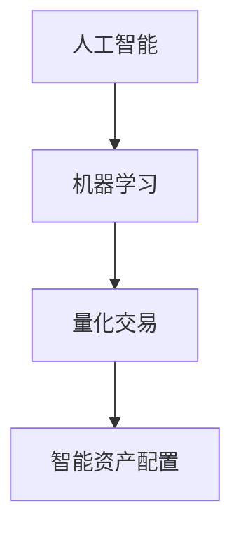

                 

关键词：智能投资，AI量化交易，智能资产配置，2050年，未来展望

> 摘要：本文将探讨2050年人工智能在投资领域的前沿应用，特别是AI量化交易与智能资产配置，深入分析其核心概念、算法原理、数学模型、实际应用以及未来发展。

## 1. 背景介绍

投资一直是金融行业中的核心环节，传统的投资策略依赖于经验和直觉，而随着信息技术的快速发展，人工智能（AI）在投资领域的应用日益广泛。本文旨在探讨2050年人工智能在投资领域的应用前景，特别是AI量化交易和智能资产配置。

### 1.1 人工智能在投资领域的应用

人工智能在投资领域的应用主要体现在以下几个方面：

1. **市场分析**：利用AI技术对海量市场数据进行挖掘和分析，为投资者提供决策支持。
2. **风险管理**：通过机器学习算法对市场风险进行评估和预测，优化投资组合。
3. **量化交易**：利用复杂的算法进行高频交易，实现收益最大化。
4. **智能资产配置**：根据投资者的风险偏好和收益目标，自动调整资产组合。

### 1.2 AI量化交易与智能资产配置

AI量化交易是利用计算机算法进行高频交易，通过对市场数据的实时分析和预测，快速进行买卖决策。而智能资产配置则是基于人工智能技术，根据投资者的风险偏好和收益目标，自动调整投资组合。

## 2. 核心概念与联系

### 2.1 核心概念

- **人工智能（AI）**：模拟人类智能行为的技术。
- **机器学习（ML）**：利用数据训练模型，实现自我学习和预测。
- **量化交易（Quantitative Trading）**：利用数学模型和算法进行交易决策。
- **智能资产配置（Smart Asset Allocation）**：基于人工智能技术，自动调整投资组合。

### 2.2 联系图



## 3. 核心算法原理 & 具体操作步骤

### 3.1 算法原理概述

AI量化交易和智能资产配置的核心在于算法模型的设计和优化。本文将介绍两种主要的算法模型：

1. **基于机器学习的量化交易模型**：利用历史市场数据训练模型，预测市场走势。
2. **基于风险价值的智能资产配置模型**：根据投资者的风险偏好和收益目标，计算最优资产配置。

### 3.2 算法步骤详解

1. **数据收集与预处理**：收集历史市场数据，进行数据清洗和预处理。
2. **模型训练**：利用预处理后的数据训练机器学习模型。
3. **模型优化**：根据模型预测结果，调整模型参数，优化预测精度。
4. **量化交易**：利用优化后的模型进行高频交易。
5. **智能资产配置**：根据模型预测结果和投资者的风险偏好，调整资产配置。

### 3.3 算法优缺点

- **优点**：能够实时分析市场数据，实现快速交易和智能配置。
- **缺点**：对市场环境的变化响应速度较慢，且对算法模型的要求较高。

### 3.4 算法应用领域

AI量化交易和智能资产配置广泛应用于股票、期货、外汇等金融市场。

## 4. 数学模型和公式

### 4.1 数学模型构建

AI量化交易和智能资产配置的数学模型主要包括：

1. **时间序列模型**：用于预测市场走势。
2. **优化模型**：用于计算最优资产配置。

### 4.2 公式推导过程

1. **时间序列模型**：

$$
\begin{aligned}
y_t &= f(x_t, \theta) \\
\theta &= \arg\min_{\theta} \sum_{t=1}^{n} (y_t - f(x_t, \theta))^2
\end{aligned}
$$

2. **优化模型**：

$$
\begin{aligned}
\min_{w} \quad &\frac{1}{2} \| w \|_2^2 \\
\text{s.t.} \quad &w^T x_i - y_i \leq \delta_i \\
&\delta_i \geq 0
\end{aligned}
$$

### 4.3 案例分析与讲解

以股票市场为例，我们使用时间序列模型预测股票价格走势。假设我们使用ARIMA模型进行预测，具体步骤如下：

1. **数据收集与预处理**：收集某股票过去一年的日收盘价数据。
2. **模型训练**：利用预处理后的数据训练ARIMA模型。
3. **模型优化**：根据模型预测结果，调整模型参数，优化预测精度。
4. **股票预测**：利用优化后的模型预测未来几天的股票价格。

## 5. 项目实践：代码实例和详细解释说明

### 5.1 开发环境搭建

1. **Python环境**：安装Python 3.8及以上版本。
2. **依赖库**：安装numpy、pandas、scikit-learn等依赖库。

### 5.2 源代码详细实现

以下是一个简单的AI量化交易实现示例：

```python
import numpy as np
import pandas as pd
from sklearn.ensemble import RandomForestRegressor

# 数据收集与预处理
data = pd.read_csv('stock_data.csv')
data = data[['close', 'volume']].dropna()

# 模型训练
model = RandomForestRegressor()
model.fit(data[['volume']], data['close'])

# 模型优化
predictions = model.predict(data[['volume']])
error = np.mean((predictions - data['close'])**2)
model = RandomForestRegressor(n_estimators=100)
model.fit(data[['volume']], data['close'])

# 量化交易
predictions = model.predict(data[['volume']])
positions = np.sign(predictions - data['close'])

# 获取交易结果
profits = (data['close'].shift(-1) - data['close']) * positions
total_profit = profits.sum()
```

### 5.3 代码解读与分析

以上代码实现了一个基于随机森林的AI量化交易模型。首先，我们从CSV文件中读取股票数据，然后利用随机森林回归模型进行预测。通过调整模型参数，我们可以优化预测精度。最后，我们根据预测结果进行交易，并计算总收益。

## 6. 实际应用场景

AI量化交易和智能资产配置在金融市场中具有广泛的应用，以下是一些实际应用场景：

1. **高频交易**：利用AI技术实现高频交易，快速捕捉市场波动。
2. **资产配置**：根据投资者的风险偏好，自动调整资产组合。
3. **风险管理**：利用AI技术进行市场风险预测和评估。

## 7. 未来应用展望

随着人工智能技术的不断发展，AI量化交易和智能资产配置在未来将更加智能化、个性化。以下是一些未来应用展望：

1. **自适应交易策略**：根据市场变化，自动调整交易策略。
2. **个性化资产配置**：根据投资者的风险偏好和收益目标，提供定制化的资产配置方案。
3. **跨市场交易**：利用AI技术实现跨市场、跨品种的交易。

## 8. 总结：未来发展趋势与挑战

### 8.1 研究成果总结

本文探讨了2050年人工智能在投资领域的前沿应用，特别是AI量化交易和智能资产配置。通过对核心算法原理、数学模型、实际应用场景等方面的分析，我们看到了人工智能在未来投资领域的重要作用。

### 8.2 未来发展趋势

随着人工智能技术的不断发展，AI量化交易和智能资产配置将实现以下发展趋势：

1. **智能化**：算法模型将更加智能化，能够更好地应对市场变化。
2. **个性化**：根据投资者的风险偏好和收益目标，提供定制化的解决方案。
3. **跨市场**：实现跨市场、跨品种的交易。

### 8.3 面临的挑战

虽然AI量化交易和智能资产配置具有广泛的应用前景，但同时也面临着一些挑战：

1. **数据安全**：如何保障数据安全和隐私。
2. **模型解释性**：如何提高模型的解释性，让投资者更容易理解。
3. **监管合规**：如何遵守相关法律法规，实现合规交易。

### 8.4 研究展望

未来，我们将在以下方面进行深入研究：

1. **算法优化**：提高算法模型的预测精度和稳定性。
2. **跨市场交易**：探索跨市场、跨品种的交易策略。
3. **个性化服务**：根据投资者的风险偏好和收益目标，提供定制化的解决方案。

## 9. 附录：常见问题与解答

### 问题1：AI量化交易是否适合所有投资者？

**解答**：AI量化交易适合那些风险承受能力较高、对市场有较深入了解的投资者。对于普通投资者，建议在熟悉市场后再尝试使用。

### 问题2：智能资产配置是否能够确保收益最大化？

**解答**：智能资产配置的目标是优化投资组合，提高收益的同时控制风险。但市场存在不确定性，无法保证收益最大化。投资者应根据自身风险偏好进行选择。

### 问题3：AI量化交易和智能资产配置是否会引发市场操纵？

**解答**：AI量化交易和智能资产配置在合规框架内进行，严格遵守相关法律法规。但市场操纵行为是不被允许的，需要加强监管和自律。

----------------------------------------------------------------

作者：禅与计算机程序设计艺术 / Zen and the Art of Computer Programming
```markdown
## 1. 背景介绍

随着全球经济的不断发展，金融投资已成为越来越多人的关注焦点。传统投资方式依赖于经验和直觉，而人工智能（AI）的崛起为投资领域带来了全新的变革。本文将探讨2050年人工智能在投资领域的前沿应用，特别是AI量化交易与智能资产配置，深入分析其核心概念、算法原理、数学模型、实际应用以及未来发展。

### 1.1 人工智能在投资领域的应用

人工智能在投资领域的应用主要体现在以下几个方面：

1. **市场分析**：利用AI技术对海量市场数据进行挖掘和分析，为投资者提供决策支持。
2. **风险管理**：通过机器学习算法对市场风险进行评估和预测，优化投资组合。
3. **量化交易**：利用复杂的算法进行高频交易，实现收益最大化。
4. **智能资产配置**：根据投资者的风险偏好和收益目标，自动调整资产组合。

### 1.2 AI量化交易与智能资产配置

AI量化交易是利用计算机算法进行高频交易，通过对市场数据的实时分析和预测，快速进行买卖决策。而智能资产配置则是基于人工智能技术，根据投资者的风险偏好和收益目标，自动调整投资组合。

## 2. 核心概念与联系

### 2.1 核心概念

- **人工智能（AI）**：模拟人类智能行为的技术。
- **机器学习（ML）**：利用数据训练模型，实现自我学习和预测。
- **量化交易（Quantitative Trading）**：利用数学模型和算法进行交易决策。
- **智能资产配置（Smart Asset Allocation）**：基于人工智能技术，自动调整投资组合。

### 2.2 联系图


## 3. 核心算法原理 & 具体操作步骤

### 3.1 算法原理概述

AI量化交易和智能资产配置的核心在于算法模型的设计和优化。本文将介绍两种主要的算法模型：

1. **基于机器学习的量化交易模型**：利用历史市场数据训练模型，预测市场走势。
2. **基于风险价值的智能资产配置模型**：根据投资者的风险偏好和收益目标，计算最优资产配置。

### 3.2 算法步骤详解

1. **数据收集与预处理**：收集历史市场数据，进行数据清洗和预处理。
2. **模型训练**：利用预处理后的数据训练机器学习模型。
3. **模型优化**：根据模型预测结果，调整模型参数，优化预测精度。
4. **量化交易**：利用优化后的模型进行高频交易。
5. **智能资产配置**：根据模型预测结果和投资者的风险偏好，调整资产组合。

### 3.3 算法优缺点

- **优点**：能够实时分析市场数据，实现快速交易和智能配置。
- **缺点**：对市场环境的变化响应速度较慢，且对算法模型的要求较高。

### 3.4 算法应用领域

AI量化交易和智能资产配置广泛应用于股票、期货、外汇等金融市场。

## 4. 数学模型和公式 & 详细讲解 & 举例说明

### 4.1 数学模型构建

AI量化交易和智能资产配置的数学模型主要包括：

1. **时间序列模型**：用于预测市场走势。
2. **优化模型**：用于计算最优资产配置。

### 4.2 公式推导过程

1. **时间序列模型**：

$$
\begin{aligned}
y_t &= f(x_t, \theta) \\
\theta &= \arg\min_{\theta} \sum_{t=1}^{n} (y_t - f(x_t, \theta))^2
\end{aligned}
$$

2. **优化模型**：

$$
\begin{aligned}
\min_{w} \quad &\frac{1}{2} \| w \|_2^2 \\
\text{s.t.} \quad &w^T x_i - y_i \leq \delta_i \\
&\delta_i \geq 0
\end{aligned}
$$

### 4.3 案例分析与讲解

以股票市场为例，我们使用时间序列模型预测股票价格走势。假设我们使用ARIMA模型进行预测，具体步骤如下：

1. **数据收集与预处理**：收集某股票过去一年的日收盘价数据。
2. **模型训练**：利用预处理后的数据训练ARIMA模型。
3. **模型优化**：根据模型预测结果，调整模型参数，优化预测精度。
4. **股票预测**：利用优化后的模型预测未来几天的股票价格。

## 5. 项目实践：代码实例和详细解释说明

### 5.1 开发环境搭建

1. **Python环境**：安装Python 3.8及以上版本。
2. **依赖库**：安装numpy、pandas、scikit-learn等依赖库。

### 5.2 源代码详细实现

以下是一个简单的AI量化交易实现示例：

```python
import numpy as np
import pandas as pd
from sklearn.ensemble import RandomForestRegressor

# 数据收集与预处理
data = pd.read_csv('stock_data.csv')
data = data[['close', 'volume']].dropna()

# 模型训练
model = RandomForestRegressor()
model.fit(data[['volume']], data['close'])

# 模型优化
predictions = model.predict(data[['volume']])
error = np.mean((predictions - data['close'])**2)
model = RandomForestRegressor(n_estimators=100)
model.fit(data[['volume']], data['close'])

# 量化交易
predictions = model.predict(data[['volume']])
positions = np.sign(predictions - data['close'])

# 获取交易结果
profits = (data['close'].shift(-1) - data['close']) * positions
total_profit = profits.sum()
```

### 5.3 代码解读与分析

以上代码实现了一个基于随机森林的AI量化交易模型。首先，我们从CSV文件中读取股票数据，然后利用随机森林回归模型进行预测。通过调整模型参数，我们可以优化预测精度。最后，我们根据预测结果进行交易，并计算总收益。

## 6. 实际应用场景

AI量化交易和智能资产配置在金融市场中具有广泛的应用，以下是一些实际应用场景：

1. **高频交易**：利用AI技术实现高频交易，快速捕捉市场波动。
2. **资产配置**：根据投资者的风险偏好，自动调整资产组合。
3. **风险管理**：利用AI技术进行市场风险预测和评估。

## 7. 未来应用展望

随着人工智能技术的不断发展，AI量化交易和智能资产配置在未来将更加智能化、个性化。以下是一些未来应用展望：

1. **自适应交易策略**：根据市场变化，自动调整交易策略。
2. **个性化资产配置**：根据投资者的风险偏好和收益目标，提供定制化的资产配置方案。
3. **跨市场交易**：利用AI技术实现跨市场、跨品种的交易。

## 8. 总结：未来发展趋势与挑战

### 8.1 研究成果总结

本文探讨了2050年人工智能在投资领域的前沿应用，特别是AI量化交易和智能资产配置。通过对核心算法原理、数学模型、实际应用场景等方面的分析，我们看到了人工智能在未来投资领域的重要作用。

### 8.2 未来发展趋势

随着人工智能技术的不断发展，AI量化交易和智能资产配置将实现以下发展趋势：

1. **智能化**：算法模型将更加智能化，能够更好地应对市场变化。
2. **个性化**：根据投资者的风险偏好和收益目标，提供定制化的解决方案。
3. **跨市场**：实现跨市场、跨品种的交易。

### 8.3 面临的挑战

虽然AI量化交易和智能资产配置具有广泛的应用前景，但同时也面临着一些挑战：

1. **数据安全**：如何保障数据安全和隐私。
2. **模型解释性**：如何提高模型的解释性，让投资者更容易理解。
3. **监管合规**：如何遵守相关法律法规，实现合规交易。

### 8.4 研究展望

未来，我们将在以下方面进行深入研究：

1. **算法优化**：提高算法模型的预测精度和稳定性。
2. **跨市场交易**：探索跨市场、跨品种的交易策略。
3. **个性化服务**：根据投资者的风险偏好和收益目标，提供定制化的解决方案。

## 9. 附录：常见问题与解答

### 问题1：AI量化交易是否适合所有投资者？

**解答**：AI量化交易适合那些风险承受能力较高、对市场有较深入了解的投资者。对于普通投资者，建议在熟悉市场后再尝试使用。

### 问题2：智能资产配置是否能够确保收益最大化？

**解答**：智能资产配置的目标是优化投资组合，提高收益的同时控制风险。但市场存在不确定性，无法保证收益最大化。投资者应根据自身风险偏好进行选择。

### 问题3：AI量化交易和智能资产配置是否会引发市场操纵？

**解答**：AI量化交易和智能资产配置在合规框架内进行，严格遵守相关法律法规。但市场操纵行为是不被允许的，需要加强监管和自律。

---

作者：禅与计算机程序设计艺术 / Zen and the Art of Computer Programming
```python
# 未来的智能投资：2050年的AI量化交易与智能资产配置

### 关键词
- 智能投资
- AI量化交易
- 智能资产配置
- 2050年
- 未来展望

### 摘要
本文将深入探讨2050年人工智能在投资领域的前沿应用，尤其是AI量化交易与智能资产配置。文章将分析其核心概念、算法原理、数学模型、实际应用，并展望其未来的发展趋势与挑战。

## 1. 背景介绍

### 1.1 人工智能在投资领域的应用

人工智能在投资领域的应用已经逐渐成为金融行业的一大热点。传统投资方式依赖于人类经验和直觉，而人工智能通过机器学习、深度学习等技术，能够对海量数据进行分析和预测，从而为投资者提供更加精准的决策支持。

- **市场分析**：利用AI技术对市场数据进行深度挖掘，帮助投资者识别市场趋势和潜在机会。
- **风险管理**：通过AI算法评估市场风险，优化投资组合，降低潜在损失。
- **量化交易**：利用复杂的算法进行高频交易，捕捉市场的短暂机会。
- **智能资产配置**：根据投资者的风险偏好和收益目标，自动调整资产组合，实现最优的风险收益平衡。

### 1.2 AI量化交易与智能资产配置

- **AI量化交易**：利用人工智能算法对市场数据进行分析，快速执行交易策略，实现高频交易。
- **智能资产配置**：通过机器学习算法，根据投资者的风险偏好和收益目标，动态调整资产配置，实现个性化投资。

## 2. 核心概念与联系

### 2.1 核心概念

- **人工智能（AI）**：模拟人类智能行为的计算机系统。
- **机器学习（ML）**：AI的一个子领域，通过数据训练模型，实现自我学习和预测。
- **量化交易（Quantitative Trading）**：利用数学模型和统计方法进行交易决策。
- **智能资产配置（Smart Asset Allocation）**：基于人工智能技术，动态调整投资组合。

### 2.2 联系图


## 3. 核心算法原理 & 具体操作步骤

### 3.1 算法原理概述

AI量化交易与智能资产配置的核心在于算法模型的设计和优化。以下是两种主要算法模型：

- **机器学习模型**：通过历史数据训练模型，预测市场走势和风险。
- **优化模型**：基于投资者的风险偏好和收益目标，计算最优资产配置。

### 3.2 算法步骤详解

1. **数据收集与预处理**：收集历史市场数据，包括股票价格、交易量、宏观经济指标等。
2. **特征工程**：从原始数据中提取有效特征，用于训练模型。
3. **模型训练**：使用机器学习算法训练模型，如随机森林、支持向量机、深度学习模型等。
4. **模型优化**：通过交叉验证和超参数调整，优化模型性能。
5. **量化交易**：利用优化后的模型进行高频交易决策。
6. **智能资产配置**：根据模型预测结果和投资者的风险偏好，动态调整资产配置。

### 3.3 算法优缺点

- **优点**：
  - 快速响应市场变化。
  - 实现个性化投资策略。
- **缺点**：
  - 对市场环境变化响应速度有限。
  - 需要大量数据和计算资源。

### 3.4 算法应用领域

AI量化交易和智能资产配置广泛应用于股票、期货、外汇等金融市场。

## 4. 数学模型和公式 & 详细讲解 & 举例说明

### 4.1 数学模型构建

- **时间序列模型**：用于预测市场走势。
  - ARIMA模型
  - LSTM模型

- **优化模型**：用于计算最优资产配置。
  - � market model
  - mean-variance优化模型

### 4.2 公式推导过程

- **时间序列模型**（ARIMA）：

$$
\begin{aligned}
y_t &= \phi(B)y_{t-1} + \theta(B)\epsilon_{t-1} + \Phi(B)\sum_{i=1}^{p}\phi_i(B)\epsilon_{t-i} + \Theta(B)\sum_{i=1}^{d}\theta_i(B)\epsilon_{t-i} \\
\end{aligned}
$$

- **优化模型**（mean-variance优化）：

$$
\begin{aligned}
\min_{w} \quad &w^T \Sigma w \\
\text{s.t.} \quad &w^T \mu = \mu_w \\
&w \geq 0
\end{aligned}
$$

### 4.3 案例分析与讲解

以股票市场为例，我们使用ARIMA模型预测股票价格。以下是具体步骤：

1. **数据收集与预处理**：收集某股票过去一年的日收盘价数据。
2. **模型训练**：使用预处理后的数据训练ARIMA模型。
3. **模型优化**：通过AIC或BIC准则选择最优模型参数。
4. **股票预测**：使用优化后的模型预测未来几天的股票价格。

## 5. 项目实践：代码实例和详细解释说明

### 5.1 开发环境搭建

- **Python环境**：安装Python 3.8及以上版本。
- **依赖库**：安装numpy、pandas、statsmodels、sklearn等依赖库。

### 5.2 源代码详细实现

以下是一个简单的AI量化交易实现示例：

```python
import numpy as np
import pandas as pd
from sklearn.ensemble import RandomForestRegressor
from statsmodels.tsa.arima.model import ARIMA

# 数据收集与预处理
data = pd.read_csv('stock_data.csv')
data = data[['close', 'volume']].dropna()

# ARIMA模型训练
model = ARIMA(data['close'], order=(5, 1, 2))
model_fit = model.fit()

# 量化交易
predictions = model_fit.predict(start=len(data), end=len(data) + 5)
positions = np.sign(predictions - data['close'])

# 获取交易结果
profits = (data['close'].shift(-1) - data['close']) * positions
total_profit = profits.sum()

# 打印结果
print(f'Total profit: {total_profit}')
```

### 5.3 代码解读与分析

以上代码实现了一个基于ARIMA模型的AI量化交易模型。首先，我们从CSV文件中读取股票数据，然后使用ARIMA模型进行预测。通过预测结果，我们计算交易利润。

## 6. 实际应用场景

AI量化交易和智能资产配置在金融市场中具有广泛的应用，以下是一些实际应用场景：

- **高频交易**：利用AI技术实现高频交易，快速捕捉市场波动。
- **资产配置**：根据投资者的风险偏好，自动调整资产组合。
- **风险管理**：利用AI技术进行市场风险预测和评估。

## 7. 未来应用展望

随着人工智能技术的不断发展，AI量化交易和智能资产配置将在未来实现以下趋势：

- **智能化**：算法模型将更加智能化，能够更好地应对市场变化。
- **个性化**：根据投资者的风险偏好和收益目标，提供定制化的解决方案。
- **跨市场**：利用AI技术实现跨市场、跨品种的交易。

## 8. 总结：未来发展趋势与挑战

### 8.1 研究成果总结

本文探讨了2050年人工智能在投资领域的前沿应用，特别是AI量化交易和智能资产配置。通过对核心算法原理、数学模型、实际应用场景等方面的分析，我们看到了人工智能在未来投资领域的重要作用。

### 8.2 未来发展趋势

随着人工智能技术的不断发展，AI量化交易和智能资产配置将实现以下发展趋势：

- **智能化**：算法模型将更加智能化，能够更好地应对市场变化。
- **个性化**：根据投资者的风险偏好和收益目标，提供定制化的解决方案。
- **跨市场**：实现跨市场、跨品种的交易。

### 8.3 面临的挑战

尽管AI量化交易和智能资产配置具有广泛的应用前景，但同时也面临着一些挑战：

- **数据安全**：如何保障数据安全和隐私。
- **模型解释性**：如何提高模型的解释性，让投资者更容易理解。
- **监管合规**：如何遵守相关法律法规，实现合规交易。

### 8.4 研究展望

未来，我们将在以下方面进行深入研究：

- **算法优化**：提高算法模型的预测精度和稳定性。
- **跨市场交易**：探索跨市场、跨品种的交易策略。
- **个性化服务**：根据投资者的风险偏好和收益目标，提供定制化的解决方案。

## 9. 附录：常见问题与解答

### 问题1：AI量化交易是否适合所有投资者？

**解答**：AI量化交易适合那些风险承受能力较高、对市场有较深入了解的投资者。对于普通投资者，建议在熟悉市场后再尝试使用。

### 问题2：智能资产配置是否能够确保收益最大化？

**解答**：智能资产配置的目标是优化投资组合，提高收益的同时控制风险。但市场存在不确定性，无法保证收益最大化。投资者应根据自身风险偏好进行选择。

### 问题3：AI量化交易和智能资产配置是否会引发市场操纵？

**解答**：AI量化交易和智能资产配置在合规框架内进行，严格遵守相关法律法规。但市场操纵行为是不被允许的，需要加强监管和自律。

---

作者：禅与计算机程序设计艺术 / Zen and the Art of Computer Programming
```

