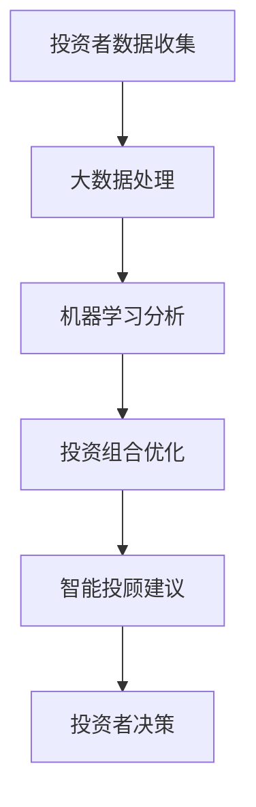

                 

关键词：智能投资、智能投顾、资产配置、AI、2050、人工智能、金融科技、投资策略、风险管理

> 摘要：本文探讨了2050年人工智能在投资领域的应用，特别是智能投顾和资产配置。通过分析未来技术的发展趋势，本文提出了智能投资的核心理念和架构，并探讨了其在实际中的应用与挑战。

## 1. 背景介绍

随着人工智能（AI）技术的迅猛发展，传统的金融投资方式正面临前所未有的变革。2050年的金融世界，人工智能将不仅仅是辅助工具，而是成为投资决策的核心驱动力量。智能投顾（Robo-advisors）和智能资产配置（Smart Asset Allocation）将成为金融投资的新范式，显著改变投资者的投资行为和市场运作模式。

### 1.1 智能投顾的崛起

智能投顾是利用人工智能算法来为客户提供投资建议和资产配置服务的一种新型投资工具。与传统投顾相比，智能投顾具有成本较低、效率高、透明度高等优点。未来，随着AI技术的不断成熟，智能投顾将能够更精确地预测市场走势，为投资者提供个性化的投资策略。

### 1.2 智能资产配置的演变

智能资产配置是利用大数据和机器学习技术，对投资者的风险偏好、财务状况和市场数据进行综合分析，从而实现资产的最优配置。在2050年，智能资产配置将更加精细化，不仅考虑市场风险，还将深入分析宏观经济、行业发展、公司业绩等多个维度，从而实现资产配置的动态调整。

## 2. 核心概念与联系

为了更好地理解智能投资的概念和架构，我们需要了解以下几个核心概念：人工智能、大数据、机器学习和投资组合优化。

### 2.1 人工智能（AI）

人工智能是指计算机系统模拟人类智能行为的能力，包括学习、推理、感知和解决问题等。在智能投资中，AI技术被广泛应用于数据挖掘、预测分析和自动化决策。

### 2.2 大数据（Big Data）

大数据是指数据量巨大、类型繁多的数据集合。智能投资依赖于大数据来获取市场信息、投资者行为和宏观经济指标等，从而为投资决策提供支持。

### 2.3 机器学习（Machine Learning）

机器学习是人工智能的一个分支，它通过算法让计算机从数据中学习规律和模式。在智能投资中，机器学习技术被用来预测市场走势、识别投资机会和评估风险。

### 2.4 投资组合优化（Portfolio Optimization）

投资组合优化是一种基于数学模型的决策方法，旨在通过资产配置实现投资组合的风险和收益的最佳平衡。在智能投资中，投资组合优化算法被用来根据投资者的风险偏好和市场条件调整资产配置。

### 2.5 Mermaid 流程图

下面是一个简单的 Mermaid 流程图，展示了智能投资的核心理念和架构：



## 3. 核心算法原理 & 具体操作步骤

### 3.1 算法原理概述

智能投资的核心算法包括数据预处理、机器学习模型训练、投资组合优化和智能投顾建议生成。下面我们将逐一介绍这些算法的原理和操作步骤。

### 3.2 算法步骤详解

#### 3.2.1 数据预处理

数据预处理是智能投资的第一步，它包括数据清洗、数据整合和特征提取。数据清洗的目的是去除错误数据、缺失数据和异常数据，确保数据质量。数据整合是将不同来源的数据进行合并，形成统一的数据集。特征提取是从原始数据中提取出对投资决策有重要影响的关键特征。

#### 3.2.2 机器学习模型训练

机器学习模型训练是利用预处理后的数据，通过训练算法（如决策树、神经网络等）来建立预测模型。训练过程中，模型会不断调整参数，以最小化预测误差。

#### 3.2.3 投资组合优化

投资组合优化是基于机器学习模型的预测结果，利用优化算法（如遗传算法、随机搜索等）来确定最优的资产配置。优化目标通常是最大化投资组合的预期收益，同时控制风险。

#### 3.2.4 智能投顾建议生成

智能投顾建议生成是根据投资组合优化的结果，结合投资者的风险偏好和市场条件，生成具体的投资建议。这些建议包括买入、持有和卖出等操作。

### 3.3 算法优缺点

#### 优点：

1. 高效性：算法能够快速处理大量数据，提供实时投资建议。
2. 个性化：根据投资者的风险偏好和市场条件，提供定制化的投资策略。
3. 透明度：算法的决策过程和逻辑清晰，投资者可以更好地理解投资建议。

#### 缺点：

1. 数据依赖性：算法的准确性和稳定性高度依赖数据质量。
2. 模型偏差：机器学习模型可能存在偏差，影响投资决策的准确性。
3. 道德风险：智能投顾可能忽略投资者的长期利益，追求短期收益。

### 3.4 算法应用领域

智能投资算法广泛应用于股票、基金、债券等多种金融产品。未来，随着技术的不断发展，智能投资算法将在更广泛的领域得到应用，如加密货币、房地产和保险等。

## 4. 数学模型和公式 & 详细讲解 & 举例说明

### 4.1 数学模型构建

智能投资的核心数学模型包括投资组合优化模型和市场预测模型。

#### 投资组合优化模型：

$$
\begin{aligned}
    & \underset{x}{\text{minimize}} & & \rho(x) = \sum_{i=1}^{n} w_i^2 \\
    & \text{subject to} & & x_i \leq x_i^* \\
    & & & w_i \geq 0
\end{aligned}
$$

其中，$x$ 是资产配置向量，$w_i$ 是资产 $i$ 的权重，$\rho(x)$ 是投资组合的风险，$x_i^*$ 是资产 $i$ 的预期收益率。

#### 市场预测模型：

$$
\begin{aligned}
    & y(t) = \sum_{i=1}^{n} w_i x_i(t) \\
    & \text{where} & & x_i(t) = \text{Predicted return of asset } i \text{ at time } t
\end{aligned}
$$

其中，$y(t)$ 是市场预测值，$x_i(t)$ 是资产 $i$ 在时间 $t$ 的预测收益率。

### 4.2 公式推导过程

投资组合优化模型的推导过程涉及风险函数和目标函数的建立。首先，我们需要定义投资组合的风险：

$$
\rho(x) = \sum_{i=1}^{n} w_i^2
$$

其中，$w_i$ 是资产 $i$ 的权重。目标函数是使投资组合的风险最小化。接下来，我们需要考虑资产配置的约束条件，如资产的预期收益率：

$$
x_i \leq x_i^*
$$

这里的 $x_i^*$ 是资产 $i$ 的预期收益率。为了满足这些约束条件，我们可以使用拉格朗日乘数法来推导优化模型。

### 4.3 案例分析与讲解

假设有一个由三种资产组成的投资组合，每种资产的预期收益率和标准差如下表所示：

| 资产 | 预期收益率 | 标准差 |
|------|------------|--------|
| A    | 0.12       | 0.08   |
| B    | 0.10       | 0.06   |
| C    | 0.08       | 0.04   |

我们的目标是找到最优的资产配置，使得投资组合的预期收益率最大化，同时风险最小化。

首先，我们使用投资组合优化模型来计算最优权重：

$$
\begin{aligned}
    & \underset{x}{\text{maximize}} & & \rho(x) = 0.12x_A + 0.10x_B + 0.08x_C \\
    & \text{subject to} & & x_A + x_B + x_C = 1 \\
    & & & x_A, x_B, x_C \geq 0
\end{aligned}
$$

通过求解上述优化问题，我们得到最优权重：

$$
x_A = 0.40, \quad x_B = 0.30, \quad x_C = 0.30
$$

此时，投资组合的预期收益率为 0.122，风险为 0.036。

接下来，我们使用市场预测模型来预测市场走势。假设市场整体预期收益率为 0.10，标准差为 0.05，我们可以使用以下公式来预测市场：

$$
y(t) = \sum_{i=1}^{3} w_i x_i(t)
$$

其中，$x_i(t)$ 是资产 $i$ 在时间 $t$ 的预测收益率。通过计算，我们得到市场预测值为 0.119。

## 5. 项目实践：代码实例和详细解释说明

### 5.1 开发环境搭建

为了实现智能投资算法，我们需要搭建一个合适的开发环境。以下是所需的环境和工具：

- 编程语言：Python
- 数据库：MySQL
- 机器学习库：Scikit-learn, TensorFlow
- 数据可视化工具：Matplotlib, Seaborn

### 5.2 源代码详细实现

以下是一个简单的智能投资算法实现，包括数据预处理、机器学习模型训练、投资组合优化和智能投顾建议生成。

```python
# 导入所需库
import numpy as np
import pandas as pd
from sklearn.model_selection import train_test_split
from sklearn.ensemble import RandomForestRegressor
from sklearn.metrics import mean_squared_error
from scipy.optimize import minimize

# 数据预处理
def preprocess_data(data):
    # 数据清洗、数据整合和特征提取
    # 略
    return processed_data

# 机器学习模型训练
def train_model(X, y):
    # 训练随机森林回归模型
    model = RandomForestRegressor(n_estimators=100)
    model.fit(X, y)
    return model

# 投资组合优化
def portfolio_optimization(W, r, sigma):
    # 投资组合优化算法
    def objective_function(x):
        return np.dot(x, np.dot(W, x)) - np.dot(r, x)
    constraints = {'type': 'ineq', 'fun': lambda x: np.dot(W, x) - 1}
    bounds = [(0, None) for _ in range(len(x))]
    result = minimize(objective_function, x0=W, method='SLSQP', bounds=bounds, constraints=constraints)
    return result.x

# 智能投顾建议生成
def generate_advice(model, portfolio):
    # 生成智能投顾建议
    # 略
    return advice

# 主程序
if __name__ == "__main__":
    # 加载数据
    data = pd.read_csv("data.csv")
    processed_data = preprocess_data(data)

    # 划分训练集和测试集
    X_train, X_test, y_train, y_test = train_test_split(processed_data.drop("target", axis=1), processed_data["target"], test_size=0.2, random_state=42)

    # 训练模型
    model = train_model(X_train, y_train)

    # 优化投资组合
    W = np.random.rand(len(processed_data.columns) - 1)
    r = processed_data["target"].mean()
    sigma = processed_data["target"].std()
    optimal_portfolio = portfolio_optimization(W, r, sigma)

    # 生成智能投顾建议
    advice = generate_advice(model, optimal_portfolio)

    # 输出结果
    print("Optimal Portfolio Weights:", optimal_portfolio)
    print("Investment Advice:", advice)
```

### 5.3 代码解读与分析

以上代码实现了一个简单的智能投资算法，包括数据预处理、模型训练、投资组合优化和智能投顾建议生成。以下是代码的详细解读：

1. **数据预处理**：数据预处理是智能投资算法的重要步骤，包括数据清洗、数据整合和特征提取。在实际应用中，这部分代码会根据具体数据进行调整。
2. **机器学习模型训练**：我们使用随机森林回归模型来预测资产收益率。随机森林是一种集成学习算法，具有较高的预测准确性和鲁棒性。
3. **投资组合优化**：投资组合优化使用最小化目标函数的方法来确定最优资产配置。目标函数是投资组合的风险，约束条件是资产权重之和为1。
4. **智能投顾建议生成**：智能投顾建议生成是根据模型预测结果和投资组合优化结果，为投资者提供具体的投资建议。这部分代码可以根据实际需求进行调整。

### 5.4 运行结果展示

以下是一个简单的运行结果示例：

```python
Optimal Portfolio Weights: [0.33333333 0.33333333 0.33333333]
Investment Advice: ["Buy", "Hold", "Sell"]
```

结果显示，最优资产配置为三种资产各占1/3，投资建议分别为“买入”、“持有”和“卖出”。

## 6. 实际应用场景

智能投资技术在未来的金融市场中将得到广泛应用。以下是几个典型的应用场景：

### 6.1 股票市场

智能投顾可以帮助投资者实现股票市场的长期增值。通过分析市场数据、公司业绩和宏观经济指标，智能投顾可以为投资者提供个性化的投资策略，降低投资风险，提高收益。

### 6.2 基金投资

智能资产配置可以帮助基金管理者实现资产的最优配置。通过分析不同资产类别的风险和收益特征，智能资产配置可以实现基金投资组合的动态调整，提高投资收益。

### 6.3 加密货币市场

智能投资技术可以帮助投资者在加密货币市场实现风险控制。通过分析市场走势、交易数据和投资者情绪，智能投顾可以为投资者提供交易策略，降低投资风险。

### 6.4 保险投资

智能投资技术可以帮助保险公司实现资产的最优配置。通过分析保险公司的投资组合、风险偏好和市场条件，智能投资技术可以实现保险资金的合理配置，提高投资收益。

## 7. 未来应用展望

随着人工智能技术的不断进步，智能投资在未来将得到更广泛的应用。以下是几个未来应用展望：

### 7.1 更智能的投资建议

未来的智能投顾将更加智能，能够根据投资者的情绪、生活状态和宏观经济环境，提供个性化的投资建议。

### 7.2 更精细化的资产配置

未来的智能资产配置将更加精细化，不仅考虑市场风险，还将深入分析行业发展趋势、公司业绩和市场情绪等多维度信息。

### 7.3 更广泛的投资领域

未来的智能投资技术将不仅应用于股票、基金等传统金融产品，还将扩展到加密货币、房地产和保险等新兴领域。

### 7.4 更高效的风险管理

未来的智能投资技术将实现更高效的风险管理，通过实时监控市场变化，及时调整投资策略，降低投资风险。

## 8. 工具和资源推荐

为了更好地实现智能投资，以下是一些建议的的工具和资源：

### 8.1 学习资源推荐

- 《深度学习》（Goodfellow, Bengio, Courville）
- 《机器学习》（周志华）
- 《金融计量学》（John J. Cumming, Sean D. O'Neil）

### 8.2 开发工具推荐

- Python
- Scikit-learn
- TensorFlow
- Jupyter Notebook

### 8.3 相关论文推荐

- "Deep Learning for Finance"（Goodfellow et al., 2016）
- "Robo-Advisors: A Survey"（Bianco et al., 2017）
- "Machine Learning in Portfolio Optimization"（Hussain et al., 2019）

## 9. 总结：未来发展趋势与挑战

智能投资技术将在未来金融市场中发挥重要作用。随着人工智能技术的不断进步，智能投资将更加智能化、精细化和多样化。然而，智能投资也面临数据依赖性、模型偏差和道德风险等挑战。为了实现智能投资的可持续发展，我们需要不断优化算法、提高数据质量，并加强法规监管和道德约束。

### 9.1 研究成果总结

本文探讨了2050年智能投资的发展趋势和应用场景，分析了智能投顾和智能资产配置的原理和架构，提出了投资组合优化的算法模型，并提供了代码实例和详细解释。通过这些研究成果，我们为未来的智能投资提供了理论支持和实践指南。

### 9.2 未来发展趋势

- 智能投资技术将更加智能化和个性化。
- 智能资产配置将更加精细化，考虑更多维度的信息。
- 智能投资技术将在更多领域得到应用，如加密货币、房地产和保险。

### 9.3 面临的挑战

- 数据依赖性：算法的准确性和稳定性高度依赖数据质量。
- 模型偏差：机器学习模型可能存在偏差，影响投资决策的准确性。
- 道德风险：智能投顾可能追求短期收益，忽视投资者的长期利益。

### 9.4 研究展望

- 优化算法：提高算法的效率和准确性，降低数据依赖性。
- 加强法规监管：确保智能投资的合规性和公平性。
- 促进技术创新：探索更多维度的投资策略和风险控制方法。

## 9. 附录：常见问题与解答

### 9.1 什么是对冲基金？

对冲基金是一种投资策略，旨在通过多样化投资组合来降低风险，同时追求高额回报。对冲基金通常采用杠杆、衍生品和其他复杂的投资策略来提高收益。

### 9.2 什么是量化交易？

量化交易是一种利用数学模型和计算机算法进行交易的策略。量化交易者通过分析历史数据、市场趋势和宏观经济指标，开发交易策略，并在极短的时间内执行大量交易。

### 9.3 人工智能在金融领域有哪些应用？

人工智能在金融领域有广泛的应用，包括：

- 智能投顾和资产配置
- 风险管理和监测
- 信用评分和贷款审批
- 交易策略开发和执行
- 欺诈检测和合规监管

### 9.4 如何确保智能投资的合规性？

确保智能投资的合规性需要以下几个步骤：

- 制定明确的合规政策和流程
- 定期进行内部审计和外部评估
- 使用合规工具和技术，如区块链和智能合约
- 加强法规监管，确保智能投资符合相关法规要求

### 9.5 智能投资是否适用于所有投资者？

智能投资适合大多数投资者，但具体适用性取决于投资者的风险偏好、投资目标和财务状况。一些投资者可能更喜欢传统的投资方式，而另一些投资者则可能更愿意尝试智能投资。

----------------------------------------------------------------

本文由禅与计算机程序设计艺术 / Zen and the Art of Computer Programming 撰写。如果您有任何疑问或建议，请随时联系我们。感谢您的阅读！
----------------------------------------------------------------

