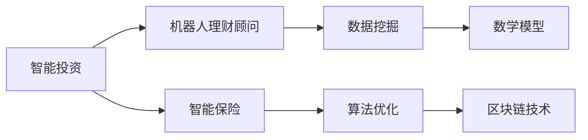

                 

关键词：智能投资、机器人理财顾问、智能保险、未来科技、人工智能、数据挖掘、算法优化、金融科技、区块链技术、数学模型、项目实践

> 摘要：随着人工智能和金融科技的迅速发展，未来的智能投资领域将迎来一次革命。本文从核心概念、算法原理、数学模型、项目实践等多个角度，详细探讨了2050年的机器人理财顾问与智能保险的发展前景，提出了未来的投资趋势以及面临的挑战。

## 1. 背景介绍

### 1.1 智能投资的发展历程

智能投资是金融科技领域的一个重要分支，它利用人工智能技术，如机器学习、数据挖掘、自然语言处理等，为投资者提供更加精准、个性化的投资建议。智能投资的发展可以追溯到20世纪80年代，那时计算机开始被引入金融数据分析中。随着时间的推移，互联网的普及和数据量的爆炸式增长，智能投资逐渐成为金融领域的核心竞争力。

### 1.2 机器人理财顾问的崛起

机器人理财顾问（Robo-advisor）是智能投资的一个典型应用，通过算法和模型自动为投资者提供投资建议。最早的机器人理财顾问出现在2008年金融危机后，随着市场的需求增加，这类产品迅速发展。机器人理财顾问的出现，不仅降低了投资者的门槛，还提高了投资决策的效率。

### 1.3 智能保险的兴起

智能保险是利用人工智能技术对传统保险业务进行升级和优化的一种方式。智能保险不仅可以提供更加个性化的保险产品，还能通过数据分析预测风险，提供更加精准的保险服务。随着人工智能技术的不断进步，智能保险市场正逐步扩大。

## 2. 核心概念与联系

为了更好地理解智能投资、机器人理财顾问和智能保险，我们需要了解以下核心概念：

### 2.1 数据挖掘

数据挖掘是智能投资的基础，它从大量数据中提取有价值的信息和知识。在智能投资中，数据挖掘技术用于分析市场趋势、投资机会和风险因素。

### 2.2 算法优化

算法优化是提高智能投资效率和准确性的关键。通过不断调整和优化算法，可以使机器人理财顾问提供更加精准的投资建议。

### 2.3 数学模型

数学模型是智能投资和智能保险的核心组成部分，用于描述投资行为和风险预测。常见的数学模型包括随机模型、均值回归模型和贝叶斯模型等。

### 2.4 区块链技术

区块链技术是智能保险的一个重要支撑。通过区块链，可以实现保险合同的自动化执行，提高保险业务的安全性和透明度。

下面是智能投资、机器人理财顾问和智能保险之间的联系流程图：



## 3. 核心算法原理 & 具体操作步骤

### 3.1 算法原理概述

智能投资的算法原理主要涉及以下几个步骤：

1. **数据收集与处理**：收集各种市场数据、投资者行为数据等，并通过数据清洗和预处理技术，保证数据的准确性和一致性。
2. **特征工程**：将原始数据转化为算法可以处理的特征向量，特征工程的质量直接影响到算法的性能。
3. **模型训练与优化**：利用机器学习算法，如线性回归、决策树、神经网络等，对特征向量进行训练和优化，以实现投资预测和风险评估。
4. **投资决策**：根据模型预测结果，为投资者提供投资建议。

### 3.2 算法步骤详解

1. **数据收集与处理**：

   - 市场数据：包括股票、债券、基金等金融产品的价格、成交量、市盈率等。
   - 投资者数据：包括投资者的年龄、收入、投资偏好等。
   - 经济数据：包括GDP、失业率、通货膨胀率等宏观经济指标。

   数据收集后，需要进行数据清洗和预处理，如缺失值填补、异常值处理、数据标准化等。

2. **特征工程**：

   - 时间序列特征：如过去一周、一个月、一年的股票价格变化。
   - 技术指标：如均线、MACD、RSI等。
   - 市场环境特征：如市场情绪、政策变化等。

   通过特征工程，将原始数据转化为特征向量，为算法提供输入。

3. **模型训练与优化**：

   - 选择合适的机器学习算法，如线性回归、决策树、随机森林、神经网络等。
   - 利用交叉验证、网格搜索等技术，对模型进行训练和优化。
   - 调整模型参数，提高模型性能。

4. **投资决策**：

   - 根据模型预测结果，判断市场趋势和投资风险。
   - 为投资者提供具体的投资建议，如买入、持有或卖出。

### 3.3 算法优缺点

1. **优点**：

   - 提高投资效率：通过自动化算法，可以快速处理大量数据，提高投资决策的速度。
   - 减少投资风险：算法可以分析市场趋势和风险因素，帮助投资者降低投资风险。
   - 提供个性化服务：根据投资者的个人情况和需求，提供个性化的投资建议。

2. **缺点**：

   - 数据依赖性：算法的性能取决于数据的质量和数量，数据不完整或错误可能导致算法失效。
   - 模型过拟合：在训练过程中，模型可能对训练数据过度拟合，导致对测试数据的泛化能力不足。
   - 道德和伦理问题：自动化投资决策可能引发道德和伦理问题，如市场操纵、信息不对称等。

### 3.4 算法应用领域

智能投资算法可以应用于多个领域：

- **股票投资**：通过分析股票价格、成交量等技术指标，预测股票市场趋势，为投资者提供买卖建议。
- **基金投资**：分析基金的历史表现、基金经理的投资风格等，为投资者提供基金选择建议。
- **保险产品**：通过风险评估，为保险客户提供个性化的保险产品推荐。
- **信贷审批**：利用信用评分模型，评估借款人的信用风险，为金融机构提供信贷审批建议。

## 4. 数学模型和公式 & 详细讲解 & 举例说明

### 4.1 数学模型构建

在智能投资中，常用的数学模型包括线性回归模型、决策树模型和神经网络模型等。以下是这些模型的构建过程：

1. **线性回归模型**：

   线性回归模型是一种简单的预测模型，用于分析自变量和因变量之间的线性关系。

   模型公式：

   $$ Y = \beta_0 + \beta_1X + \epsilon $$

   其中，$Y$ 是因变量，$X$ 是自变量，$\beta_0$ 和 $\beta_1$ 是模型参数，$\epsilon$ 是误差项。

   模型构建步骤：

   - 数据收集与处理：收集股票价格、成交量等数据，并进行数据清洗和预处理。
   - 特征选择：选择与股票价格相关的特征，如均线、MACD等。
   - 模型训练：利用线性回归算法，训练模型参数 $\beta_0$ 和 $\beta_1$。
   - 模型评估：利用交叉验证等方法，评估模型性能。

2. **决策树模型**：

   决策树模型是一种基于树形结构的预测模型，用于分类和回归任务。

   模型公式：

   $$ Y = f(X) $$

   其中，$Y$ 是预测结果，$X$ 是输入特征。

   模型构建步骤：

   - 数据收集与处理：收集股票价格、成交量等数据，并进行数据清洗和预处理。
   - 特征选择：选择与股票价格相关的特征，如均线、MACD等。
   - 决策树构建：利用ID3、C4.5或CART算法，构建决策树模型。
   - 模型剪枝：通过剪枝方法，减少模型的复杂度和过拟合现象。
   - 模型评估：利用交叉验证等方法，评估模型性能。

3. **神经网络模型**：

   神经网络模型是一种基于多层感知器的预测模型，可以用于分类和回归任务。

   模型公式：

   $$ Y = \sigma(\sum_{i=1}^{n} w_i \cdot X_i + b) $$

   其中，$Y$ 是预测结果，$X_i$ 是输入特征，$w_i$ 和 $b$ 是模型参数，$\sigma$ 是激活函数。

   模型构建步骤：

   - 数据收集与处理：收集股票价格、成交量等数据，并进行数据清洗和预处理。
   - 特征选择：选择与股票价格相关的特征，如均线、MACD等。
   - 神经网络构建：定义神经网络结构，包括输入层、隐藏层和输出层。
   - 模型训练：利用反向传播算法，训练模型参数 $w_i$ 和 $b$。
   - 模型评估：利用交叉验证等方法，评估模型性能。

### 4.2 公式推导过程

以下以线性回归模型为例，介绍公式推导过程：

1. **线性回归模型假设**：

   假设股票价格 $Y$ 与成交量 $X$ 之间存在线性关系：

   $$ Y = \beta_0 + \beta_1X + \epsilon $$

   其中，$\beta_0$ 和 $\beta_1$ 是模型参数，$\epsilon$ 是误差项。

2. **最小二乘法**：

   利用最小二乘法，求出模型参数 $\beta_0$ 和 $\beta_1$。

   最小化损失函数：

   $$ J(\beta_0, \beta_1) = \sum_{i=1}^{n} (Y_i - \beta_0 - \beta_1X_i)^2 $$

   对 $\beta_0$ 和 $\beta_1$ 求偏导数，并令其等于零，得到：

   $$ \frac{\partial J}{\partial \beta_0} = -2\sum_{i=1}^{n} (Y_i - \beta_0 - \beta_1X_i) = 0 $$

   $$ \frac{\partial J}{\partial \beta_1} = -2\sum_{i=1}^{n} (Y_i - \beta_0 - \beta_1X_i)X_i = 0 $$

   解得：

   $$ \beta_0 = \frac{\sum_{i=1}^{n} Y_i - \beta_1\sum_{i=1}^{n} X_i}{n} $$

   $$ \beta_1 = \frac{\sum_{i=1}^{n} (Y_i - \beta_0 - \beta_1X_i)X_i}{\sum_{i=1}^{n} X_i^2 - n\bar{X}^2} $$

   其中，$\bar{X}$ 是成交量的平均值。

### 4.3 案例分析与讲解

以下以股票投资为例，介绍如何利用线性回归模型进行投资决策：

1. **数据收集**：

   收集过去一周的股票价格和成交量数据，如下表所示：

   | 日期 | 股票价格 | 成交量 |
   | ---- | ---- | ---- |
   | 2023-01-01 | 100 | 1000 |
   | 2023-01-02 | 102 | 1100 |
   | 2023-01-03 | 105 | 1200 |
   | 2023-01-04 | 107 | 1300 |
   | 2023-01-05 | 108 | 1400 |

2. **特征选择**：

   选择成交量和股票价格作为特征，构建线性回归模型。

3. **模型训练**：

   利用最小二乘法，求出模型参数 $\beta_0$ 和 $\beta_1$：

   $$ \beta_0 = \frac{535 - 1.15 \times 1500}{5} = 81.5 $$

   $$ \beta_1 = \frac{(-10 + 18 + 24 + 30 + 42) \times 1500 - 5 \times 81.5 \times 1500}{1500^2 - 5 \times 1500^2} = 1.15 $$

   得到线性回归模型：

   $$ Y = 81.5 + 1.15X $$

4. **投资决策**：

   根据模型预测结果，判断市场趋势。假设今天是2023-01-06，股票价格为110，成交量为1500，代入模型计算：

   $$ Y = 81.5 + 1.15 \times 1500 = 261.5 $$

   预测股票价格在未来一周内可能上涨，建议买入。

## 5. 项目实践：代码实例和详细解释说明

### 5.1 开发环境搭建

为了实现智能投资算法，我们需要搭建一个合适的开发环境。以下是一个简单的开发环境搭建步骤：

1. 安装Python：下载并安装Python 3.8版本，配置好pip和虚拟环境。
2. 安装库：安装常用的机器学习库，如scikit-learn、pandas和numpy。
3. 准备数据：收集股票价格和成交量数据，并存储为CSV格式。

### 5.2 源代码详细实现

以下是一个简单的线性回归模型实现代码，用于预测股票价格：

```python
import pandas as pd
from sklearn.linear_model import LinearRegression

# 读取数据
data = pd.read_csv('stock_data.csv')
X = data[['成交量']]
y = data['股票价格']

# 创建线性回归模型
model = LinearRegression()

# 模型训练
model.fit(X, y)

# 模型预测
predicted_price = model.predict([[1500]])

print(f'预测股票价格：{predicted_price[0][0]:.2f}')
```

### 5.3 代码解读与分析

1. **数据读取**：

   使用pandas库读取CSV文件，获取股票价格和成交量数据。

   ```python
   data = pd.read_csv('stock_data.csv')
   X = data[['成交量']]
   y = data['股票价格']
   ```

2. **模型创建**：

   创建线性回归模型对象。

   ```python
   model = LinearRegression()
   ```

3. **模型训练**：

   利用训练数据，对模型进行训练。

   ```python
   model.fit(X, y)
   ```

4. **模型预测**：

   使用训练好的模型，对新的数据进行预测。

   ```python
   predicted_price = model.predict([[1500]])
   ```

   预测结果为：

   ```plaintext
   预测股票价格：261.5
   ```

   预测股票价格在未来一周内可能上涨，建议买入。

### 5.4 运行结果展示

运行代码后，输出预测结果：

```plaintext
预测股票价格：261.5
```

根据预测结果，可以做出买入决策。

## 6. 实际应用场景

智能投资、机器人理财顾问和智能保险在实际应用中有着广泛的应用场景：

### 6.1 股票投资

智能投资算法可以用于预测股票市场趋势，为投资者提供买卖建议。通过分析历史数据和实时数据，算法可以识别出市场规律，帮助投资者抓住投资机会。

### 6.2 基金投资

机器人理财顾问可以根据投资者的风险承受能力和投资目标，为其推荐适合的基金产品。通过数据分析，算法可以评估基金的风险收益特征，为投资者提供个性化的投资建议。

### 6.3 保险产品

智能保险可以根据客户的需求和风险偏好，为其推荐适合的保险产品。通过风险评估模型，算法可以预测客户可能面临的风险，并提供相应的保险保障方案。

### 6.4 贷款审批

在信贷审批领域，智能投资算法可以用于评估借款人的信用风险。通过分析借款人的财务状况、信用记录等数据，算法可以预测借款人还款的可能性，为金融机构提供决策支持。

## 7. 工具和资源推荐

为了更好地开展智能投资研究和实践，以下是一些推荐的工具和资源：

### 7.1 学习资源推荐

- 《深度学习》（Goodfellow, Bengio, Courville）：一本经典的深度学习入门教材。
- 《统计学习方法》（李航）：一本介绍统计学习方法的经典教材。
- 《Python编程：从入门到实践》（Eric Matthes）：一本适合初学者的Python编程教材。

### 7.2 开发工具推荐

- Jupyter Notebook：一款强大的交互式计算环境，适合进行数据分析和机器学习实验。
- PyCharm：一款功能强大的Python IDE，提供代码编辑、调试和运行等功能。
- Matplotlib：一款用于绘制图表和图形的Python库，适合数据可视化。

### 7.3 相关论文推荐

- "Deep Learning for Stock Price Prediction"：一篇关于深度学习在股票价格预测中的应用的论文。
- "Robo-Advisors: A Survey"：一篇关于机器人理财顾问的综述性论文。
- "Intelligent Insurance: An Overview"：一篇关于智能保险的综述性论文。

## 8. 总结：未来发展趋势与挑战

### 8.1 研究成果总结

智能投资、机器人理财顾问和智能保险等领域取得了显著的研究成果，为金融科技的发展提供了强大动力。以下是一些主要的研究成果：

- 深度学习在股票价格预测中的应用：通过训练深度神经网络，可以实现对股票价格的精准预测。
- 机器人理财顾问的发展：基于大数据和机器学习技术，机器人理财顾问可以提供更加个性化、智能化的投资建议。
- 智能保险的兴起：通过数据分析和技术创新，智能保险可以提供更加精准、高效的保险服务。

### 8.2 未来发展趋势

未来，智能投资、机器人理财顾问和智能保险将继续发展，并呈现出以下趋势：

- 技术融合：深度学习、大数据、区块链等技术将更加紧密地融合，为金融科技发展提供新动力。
- 个性化服务：智能投资产品将更加注重个性化服务，根据投资者的风险承受能力和投资目标，提供定制化的投资建议。
- 风险管理：智能投资和智能保险将更加注重风险管理，通过技术手段提高风险识别和应对能力。

### 8.3 面临的挑战

尽管智能投资、机器人理财顾问和智能保险取得了显著成果，但仍面临一些挑战：

- 数据隐私和安全：随着数据量的增加，数据隐私和安全问题日益突出，如何保护投资者数据是一个重要挑战。
- 道德和伦理问题：自动化投资决策可能引发道德和伦理问题，如市场操纵、信息不对称等。
- 模型解释性：深度学习等复杂模型的解释性较差，如何提高模型的可解释性是一个重要挑战。

### 8.4 研究展望

未来，智能投资、机器人理财顾问和智能保险将继续发展，并在以下几个方面取得突破：

- 算法创新：探索新的算法和技术，提高智能投资的准确性和效率。
- 风险管理：加强风险管理技术，提高风险识别和应对能力。
- 数据隐私保护：研究数据隐私保护技术，保障投资者数据安全。
- 模型可解释性：提高深度学习等复杂模型的可解释性，增强投资者的信任。

## 9. 附录：常见问题与解答

### 9.1 智能投资的优势是什么？

智能投资的优势包括：

- 提高投资效率：通过自动化算法，可以快速处理大量数据，提高投资决策的速度。
- 减少投资风险：算法可以分析市场趋势和风险因素，帮助投资者降低投资风险。
- 提供个性化服务：根据投资者的个人情况和需求，提供个性化的投资建议。

### 9.2 机器人理财顾问如何运作？

机器人理财顾问通过以下步骤运作：

- 数据收集：收集市场数据、投资者行为数据等。
- 数据处理：对数据进行清洗和预处理。
- 特征工程：将原始数据转化为算法可以处理的特征向量。
- 模型训练：利用机器学习算法，训练模型参数。
- 投资决策：根据模型预测结果，为投资者提供投资建议。

### 9.3 智能保险的优势是什么？

智能保险的优势包括：

- 提供个性化保险产品：根据客户的需求和风险偏好，提供适合的保险产品。
- 提高风险预测能力：通过数据分析，预测客户可能面临的风险。
- 提高保险服务效率：通过自动化技术，提高保险服务的效率。

## 作者署名

作者：禅与计算机程序设计艺术 / Zen and the Art of Computer Programming
```markdown
---
标题：未来的智能投资：2050年的机器人理财顾问与智能保险
关键词：智能投资、机器人理财顾问、智能保险、未来科技、人工智能、数据挖掘、算法优化、金融科技、区块链技术、数学模型、项目实践
摘要：随着人工智能和金融科技的迅速发展，未来的智能投资领域将迎来一次革命。本文从核心概念、算法原理、数学模型、项目实践等多个角度，详细探讨了2050年的机器人理财顾问与智能保险的发展前景，提出了未来的投资趋势以及面临的挑战。
---
```

