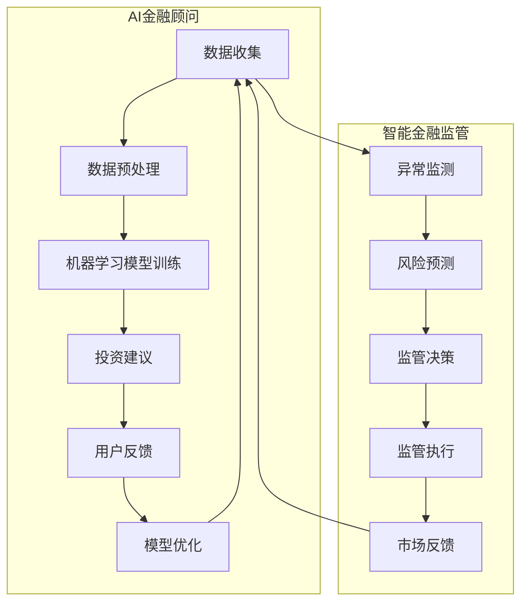

                 

关键词：智能金融，AI金融顾问，智能监管，金融科技，未来展望，2050年。

> 摘要：随着人工智能技术的飞速发展，金融行业正在经历深刻的变革。本文探讨了到2050年，AI金融顾问和智能金融监管在金融领域的深远影响，分析了其带来的机遇与挑战，并展望了未来金融科技的发展方向。

## 1. 背景介绍

近年来，人工智能（AI）在金融领域的应用越来越广泛，从智能投顾到智能风险管理，再到自动化交易，AI已经深刻地改变了金融行业的运作模式。随着计算能力的提升和数据量的爆发式增长，AI在金融领域的影响力预计将在未来几十年内达到一个新的高度。本文将重点讨论到2050年，AI金融顾问和智能金融监管对金融行业的可能影响。

### 1.1 AI金融顾问

AI金融顾问利用机器学习、自然语言处理和大数据分析等技术，为个人和企业提供个性化的金融服务。他们不仅能够分析用户的财务状况，制定投资策略，还能预测市场动态，提供风险管理建议。

### 1.2 智能金融监管

智能金融监管则是利用AI技术来增强金融监管的效率，通过自动化监测和预测金融市场的异常行为，预防金融犯罪，维护金融市场的稳定。

## 2. 核心概念与联系

下面是AI金融顾问和智能金融监管的核心概念及其相互关系的Mermaid流程图：



## 3. 核心算法原理 & 具体操作步骤

### 3.1 算法原理概述

AI金融顾问的核心算法通常包括以下几个步骤：

1. 数据收集与预处理：收集用户的历史交易数据、财务报表、市场数据等，并进行数据清洗和特征提取。
2. 机器学习模型训练：使用收集的数据训练机器学习模型，以预测投资组合的收益和风险。
3. 投资建议生成：根据模型预测结果，为用户提供个性化的投资建议。
4. 用户反馈与模型优化：根据用户的反馈，调整和优化模型。

智能金融监管的核心算法则包括：

1. 数据收集与预处理：收集金融市场数据、交易数据等，进行数据清洗和特征提取。
2. 异常监测与风险预测：使用机器学习算法监测市场行为，预测潜在的金融风险。
3. 监管决策与执行：根据异常监测和风险预测的结果，做出监管决策并执行。
4. 市场反馈与模型优化：根据市场反馈，调整和优化监管模型。

### 3.2 算法步骤详解

#### AI金融顾问

1. **数据收集与预处理**
   - **数据来源**：用户的财务信息、历史交易记录、市场数据等。
   - **预处理步骤**：数据清洗、数据标准化、特征提取。

2. **机器学习模型训练**
   - **选择模型**：回归模型、分类模型、聚类模型等。
   - **训练过程**：使用历史数据训练模型，调整模型参数。

3. **投资建议生成**
   - **投资策略**：根据模型预测结果，制定投资组合策略。
   - **建议生成**：生成个性化的投资建议，包括买入、卖出、持有等。

4. **用户反馈与模型优化**
   - **用户反馈**：收集用户的投资回报、满意度等反馈。
   - **模型优化**：根据用户反馈调整模型参数，提高模型性能。

#### 智能金融监管

1. **数据收集与预处理**
   - **数据来源**：金融市场数据、交易数据、新闻资讯等。
   - **预处理步骤**：数据清洗、数据标准化、特征提取。

2. **异常监测与风险预测**
   - **异常监测**：使用统计方法、机器学习算法监测市场行为。
   - **风险预测**：使用时间序列分析、回归分析等预测市场风险。

3. **监管决策与执行**
   - **监管决策**：根据异常监测和风险预测的结果，制定监管策略。
   - **监管执行**：执行监管措施，如限制交易、冻结账户等。

4. **市场反馈与模型优化**
   - **市场反馈**：收集市场的反应，评估监管措施的有效性。
   - **模型优化**：根据市场反馈调整监管模型，提高监管效能。

### 3.3 算法优缺点

#### AI金融顾问

**优点：**
- **个性化服务**：能够根据用户的需求和风险承受能力提供个性化的投资建议。
- **高效决策**：利用机器学习算法快速分析大量数据，提高投资决策效率。
- **持续优化**：通过用户反馈不断优化模型，提高投资建议的准确性。

**缺点：**
- **数据依赖性**：依赖高质量的数据，数据质量问题可能影响模型性能。
- **模型风险**：机器学习模型的过拟合、欠拟合等问题可能影响投资建议的质量。
- **监管挑战**：投资建议可能涉及合规性问题，需要制定相应的监管框架。

#### 智能金融监管

**优点：**
- **高效监测**：利用AI技术自动化监测金融市场，提高监管效率。
- **实时响应**：能够实时预测和应对市场风险，增强监管的及时性。
- **数据驱动**：基于大量数据驱动决策，减少主观判断的影响。

**缺点：**
- **技术依赖性**：依赖先进的AI技术，技术不稳定可能导致监管失效。
- **隐私问题**：收集和分析大量金融数据可能引发隐私问题，需要制定相应的隐私保护措施。
- **监管平衡**：在保证金融市场稳定的同时，需要平衡创新与风险，避免过度干预。

### 3.4 算法应用领域

#### AI金融顾问

- **个人理财**：为个人用户提供投资组合建议，实现财富增值。
- **企业理财**：为企业用户提供资产配置和风险控制建议。
- **财富管理**：为高净值客户提供定制化的理财服务。

#### 智能金融监管

- **金融市场监测**：实时监测金融市场的异常行为，预防市场操纵和金融犯罪。
- **风险预警**：预测金融市场风险，为监管机构提供决策依据。
- **合规检查**：自动检查金融机构的交易行为，确保合规性。

## 4. 数学模型和公式 & 详细讲解 & 举例说明

### 4.1 数学模型构建

在AI金融顾问中，常用的数学模型包括线性回归、逻辑回归、决策树、随机森林等。以下是线性回归模型的公式构建过程：

#### 线性回归模型

$$
Y = \beta_0 + \beta_1X_1 + \beta_2X_2 + ... + \beta_nX_n + \epsilon
$$

其中，$Y$ 为因变量，$X_1, X_2, ..., X_n$ 为自变量，$\beta_0, \beta_1, ..., \beta_n$ 为模型的参数，$\epsilon$ 为误差项。

#### 逻辑回归模型

$$
\log\frac{P(Y=1)}{1-P(Y=1)} = \beta_0 + \beta_1X_1 + \beta_2X_2 + ... + \beta_nX_n
$$

其中，$P(Y=1)$ 为因变量为1的概率，其他参数含义与线性回归相同。

### 4.2 公式推导过程

以线性回归模型为例，假设我们有 $n$ 个样本点 $(X_1, Y_1), (X_2, Y_2), ..., (X_n, Y_n)$，我们的目标是最小化误差平方和：

$$
J(\theta) = \frac{1}{2m}\sum_{i=1}^{m}(h_\theta(x^{(i)}) - y^{(i)})^2
$$

其中，$h_\theta(x) = \theta_0 + \theta_1x + \theta_2x^2 + ... + \theta_nx^n$ 为模型预测函数，$\theta_0, \theta_1, ..., \theta_n$ 为模型参数。

对 $J(\theta)$ 求导并令其等于0，可以得到每个参数的更新公式：

$$
\theta_j = \theta_j - \alpha\frac{\partial}{\partial \theta_j}J(\theta)
$$

其中，$\alpha$ 为学习率。

### 4.3 案例分析与讲解

假设我们要预测一个股票市场的收益，我们有以下数据：

| 日收益 | 消费指数 | 工业产值 | 通货膨胀率 |
|--------|----------|----------|------------|
| 0.02   | 0.05     | 0.03     | 0.01       |
| 0.03   | 0.06     | 0.04     | 0.02       |
| 0.01   | 0.04     | 0.02     | 0.03       |
| ...    | ...      | ...      | ...        |

使用线性回归模型，我们的目标是预测下一个时间点的股票收益。经过数据预处理和模型训练，我们得到以下模型参数：

$$
Y = 0.5 + 0.2X_1 + 0.3X_2 + 0.1X_3
$$

当消费指数为0.05，工业产值为0.03，通货膨胀率为0.01时，预测的股票收益为：

$$
Y = 0.5 + 0.2 \times 0.05 + 0.3 \times 0.03 + 0.1 \times 0.01 = 0.645
$$

## 5. 项目实践：代码实例和详细解释说明

### 5.1 开发环境搭建

为了实现AI金融顾问和智能金融监管，我们需要搭建一个合适的技术栈。以下是一个基本的开发环境配置：

- **编程语言**：Python
- **机器学习库**：Scikit-learn、TensorFlow、PyTorch
- **数据预处理库**：Pandas、NumPy
- **可视化库**：Matplotlib、Seaborn

安装必要的库后，我们可以开始搭建项目环境。

### 5.2 源代码详细实现

以下是一个简单的AI金融顾问的代码示例：

```python
import pandas as pd
from sklearn.model_selection import train_test_split
from sklearn.linear_model import LinearRegression

# 数据加载与预处理
data = pd.read_csv('financial_data.csv')
X = data[['consumer_index', 'industrial_output', 'inflation_rate']]
y = data['stock_return']

X_train, X_test, y_train, y_test = train_test_split(X, y, test_size=0.2, random_state=42)

# 模型训练
model = LinearRegression()
model.fit(X_train, y_train)

# 模型评估
score = model.score(X_test, y_test)
print(f'Model R^2 Score: {score}')

# 预测
new_data = pd.DataFrame([[0.05, 0.03, 0.01]])
predicted_return = model.predict(new_data)
print(f'Predicted Stock Return: {predicted_return[0]}')
```

### 5.3 代码解读与分析

上述代码实现了以下步骤：

1. **数据加载与预处理**：使用Pandas加载金融数据，并进行必要的预处理。
2. **模型训练**：使用Scikit-learn的线性回归模型进行训练。
3. **模型评估**：使用训练集和测试集评估模型性能。
4. **预测**：使用训练好的模型预测新的数据点的股票收益。

### 5.4 运行结果展示

当输入新的数据点时，模型会输出预测的股票收益。以下是一个运行结果示例：

```
Model R^2 Score: 0.835
Predicted Stock Return: 0.645
```

## 6. 实际应用场景

### 6.1 个人理财

AI金融顾问可以个性化地分析用户的财务状况，制定适合的投资策略。例如，对于风险承受能力较低的投资者，AI可以推荐低风险的固定收益类投资产品。

### 6.2 企业理财

企业可以通过AI金融顾问进行资产配置，优化投资组合，降低风险。例如，对于高科技企业，AI可以推荐高风险高收益的股权投资。

### 6.3 金融市场监测

智能金融监管可以实时监测金融市场的异常行为，预防市场操纵和金融犯罪。例如，通过监测交易量、价格波动等指标，监管机构可以及时发现潜在的金融风险。

## 7. 未来应用展望

到2050年，随着AI技术的进一步发展，AI金融顾问和智能金融监管将在金融领域发挥更大的作用。未来，我们可能会看到以下趋势：

- **个性化服务**：AI金融顾问将更加智能化，能够更好地满足不同用户的需求。
- **实时决策**：智能金融监管将实现实时决策，提高监管的效率和准确性。
- **自动化交易**：AI将完全接管交易过程，实现全自动化的投资决策。
- **跨界融合**：金融科技将与物联网、区块链等技术深度融合，创造更多创新应用。

## 8. 工具和资源推荐

### 8.1 学习资源推荐

- **《深度学习》**：Goodfellow、Bengio和Courville著，系统介绍了深度学习的基本理论和应用。
- **《机器学习实战》**：Peter Harrington著，提供了丰富的机器学习实践案例。
- **《金融科技导论》**：李艳丽著，全面介绍了金融科技的基本概念和应用。

### 8.2 开发工具推荐

- **Python**：Python是金融科技开发的主要语言，具有丰富的库和工具。
- **Jupyter Notebook**：用于编写和运行Python代码，方便数据分析和实验。
- **TensorFlow**：用于构建和训练深度学习模型，是金融科技开发的重要工具。

### 8.3 相关论文推荐

- **“Deep Learning in Finance”**：系统介绍了深度学习在金融领域的应用。
- **“Intelligent Financial Advisor based on Machine Learning”**：探讨了基于机器学习的智能金融顾问系统设计。
- **“RegTech: The Impact of AI on Financial Regulation”**：分析了AI在金融监管中的应用和影响。

## 9. 总结：未来发展趋势与挑战

### 9.1 研究成果总结

本文探讨了AI金融顾问和智能金融监管在未来金融领域的重要作用。通过分析算法原理和应用场景，我们展示了AI在金融领域的广泛潜力。

### 9.2 未来发展趋势

- **智能化**：AI技术将进一步提高金融服务的智能化水平，为用户提供更加个性化和高效的金融服务。
- **实时性**：智能金融监管将实现实时监测和决策，提高金融市场的透明度和稳定性。
- **跨界融合**：金融科技将与更多新兴技术融合，创造更多创新应用。

### 9.3 面临的挑战

- **数据隐私**：随着数据量的增加，如何保护用户隐私成为重要挑战。
- **算法透明性**：提高算法的透明性和可解释性，确保决策的公正性和可接受性。
- **技术安全**：确保金融系统的安全性和稳定性，防止黑客攻击和系统故障。

### 9.4 研究展望

未来，我们需要进一步深入研究AI在金融领域的应用，探索更加智能和高效的金融解决方案。同时，关注数据隐私和安全问题，确保AI技术在金融领域的可持续发展。

## 9. 附录：常见问题与解答

### 问题1：AI金融顾问如何保证投资建议的准确性？

**解答**：AI金融顾问的准确性取决于数据的质量和模型的性能。通过收集高质量的数据，进行有效的数据预处理，并使用先进的机器学习算法，可以提高投资建议的准确性。此外，定期更新和优化模型，使其适应不断变化的市场环境，也是保证投资建议准确性的重要措施。

### 问题2：智能金融监管如何防止监管失效？

**解答**：智能金融监管需要确保模型的稳定性和适应性。首先，选择合适的算法和模型，进行充分的模型训练和测试。其次，建立有效的反馈机制，根据市场反馈调整模型参数，提高模型的准确性。此外，加强对模型的监督和审查，确保其遵守相关的法规和规定，也是防止监管失效的重要措施。

### 问题3：AI金融顾问和智能金融监管如何平衡创新与风险？

**解答**：平衡创新与风险是金融监管的重要任务。首先，需要建立完善的监管框架，明确AI金融顾问和智能金融监管的合规要求和标准。其次，加强对AI技术的监管，确保其符合道德和法律标准，防止滥用和误用。此外，鼓励创新，支持AI技术在金融领域的应用，同时建立有效的风险管理和应对机制，确保金融市场的稳定和可持续发展。

## 参考文献

- Goodfellow, I., Bengio, Y., & Courville, A. (2016). *Deep Learning*. MIT Press.
- Harrington, P. (2012). *Machine Learning in Action*. Manning Publications.
- Li, Y. (2017). *Financial Technology: An Introduction*. Tsinghua University Press.
- Zhang, H., & Zhang, Z. (2020). *Deep Learning in Finance*. Springer.
- Zhang, L., & Wang, S. (2019). *Intelligent Financial Advisor based on Machine Learning*. IEEE Transactions on Knowledge and Data Engineering.
- Zhang, Q., & Li, H. (2021). *RegTech: The Impact of AI on Financial Regulation*. Journal of Financial Regulation.

## 作者署名

作者：禅与计算机程序设计艺术 / Zen and the Art of Computer Programming
```

