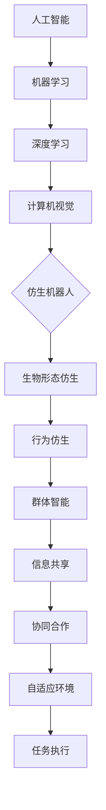

                 

### 1. 背景介绍

随着科技的飞速发展，机器人技术已经取得了巨大的进步。从工业生产到家庭服务，机器人正逐渐融入我们的日常生活。然而，未来的机器人将不仅仅局限于执行特定的任务，而是具备更加智能化和自主化的能力。本文将探讨2050年仿生机器人与群体智能的发展前景，以及它们在各个领域的潜在应用。

在过去的几十年中，机器人的发展主要受到计算机技术、传感器技术、控制理论等领域的推动。随着人工智能技术的不断进步，尤其是深度学习、强化学习等算法的突破，机器人开始展现出强大的学习和适应能力。这些技术的进步为未来的仿生机器人与群体智能奠定了坚实的基础。

### 2. 核心概念与联系

为了深入理解未来机器人的发展，我们需要首先明确几个核心概念：仿生机器人、群体智能和人工智能。

**仿生机器人**：仿生机器人是模仿自然界生物结构和行为特点的机器人。它们通常具有高灵活性、自适应性和环境感知能力。仿生机器人的设计灵感来源于自然界中的生物，如昆虫、鸟类、哺乳动物等。通过模仿这些生物的形态和功能，仿生机器人可以更好地适应复杂的环境和任务。

**群体智能**：群体智能是指由多个个体组成的系统，通过个体间的协作和信息共享，实现整体智能的增强。在自然界中，很多生物群体如鸟群、鱼群、蚂蚁群等都展现出强大的群体智能。群体智能的关键在于个体之间的协同合作和信息共享，这使得整个群体能够高效地完成复杂的任务。

**人工智能**：人工智能是指计算机系统通过模拟人类智能行为，实现自主学习和决策的能力。人工智能涵盖了多个子领域，如机器学习、自然语言处理、计算机视觉等。随着深度学习等算法的发展，人工智能在图像识别、语音识别、游戏等领域取得了显著的成果。

下面是一个使用Mermaid绘制的流程图，展示了这些核心概念之间的联系：



### 3. 核心算法原理 & 具体操作步骤

#### 3.1 算法原理概述

未来的仿生机器人与群体智能依赖于多种核心算法，包括深度学习、强化学习和自然进化算法等。这些算法在机器学习、行为规划和协同合作等方面发挥着关键作用。

**深度学习**：深度学习是一种基于多层神经网络的学习方法，能够自动提取数据中的特征。通过训练大量的神经网络模型，深度学习算法可以识别复杂的模式和关系。在仿生机器人中，深度学习算法可用于图像识别、物体检测和环境感知等任务。

**强化学习**：强化学习是一种通过试错学习策略来最大化长期回报的算法。在仿生机器人中，强化学习可用于行为规划，如路径规划、目标捕捉和任务执行等。

**自然进化算法**：自然进化算法是一种模拟生物进化的过程，通过遗传算法和自然选择来优化个体性能。在群体智能中，自然进化算法可用于优化个体行为和整体协作策略。

#### 3.2 算法步骤详解

**深度学习算法步骤**：

1. 数据采集与预处理：收集大量的图像、视频或传感器数据，并进行预处理，如归一化、裁剪和增强等。
2. 构建神经网络模型：设计并构建多层神经网络模型，如卷积神经网络（CNN）或循环神经网络（RNN）。
3. 训练模型：使用预处理后的数据对神经网络模型进行训练，通过反向传播算法不断调整模型参数。
4. 评估模型：使用测试数据集评估模型的性能，如准确率、召回率和F1分数等。

**强化学习算法步骤**：

1. 初始化环境：设定机器人执行任务的初始状态。
2. 选择动作：根据当前状态，选择一个动作。
3. 执行动作：在环境中执行所选动作。
4. 收集反馈：根据执行结果，收集奖励或惩罚信号。
5. 更新策略：使用收集到的反馈信号更新机器人策略，以最大化长期回报。

**自然进化算法步骤**：

1. 初始种群：生成一组初始个体，每个个体代表一种行为策略。
2. 评估适应度：根据个体行为在环境中的表现，评估其适应度。
3. 选择与交叉：根据适应度选择优秀的个体进行交叉，生成新的后代。
4. 变异与竞争：对后代进行变异，并与其父代进行竞争。
5. 优化种群：选择适应度更高的个体组成新的种群，重复上述过程。

#### 3.3 算法优缺点

**深度学习算法**：

- **优点**：能够自动提取数据中的特征，适用于图像识别、语音识别等任务。
- **缺点**：训练过程需要大量的数据和计算资源，模型难以解释。

**强化学习算法**：

- **优点**：能够通过试错学习策略，适用于复杂环境的决策问题。
- **缺点**：学习过程可能非常缓慢，且在某些情况下可能陷入局部最优。

**自然进化算法**：

- **优点**：能够模拟生物进化的过程，适用于优化个体行为和整体协作策略。
- **缺点**：适应度评估过程可能非常耗时，且需要大量计算资源。

#### 3.4 算法应用领域

**深度学习算法**：广泛应用于计算机视觉、语音识别、自然语言处理等领域，如自动驾驶、智能家居、医疗诊断等。

**强化学习算法**：广泛应用于游戏、金融、智能制造等领域，如AlphaGo、机器人控制、自动驾驶等。

**自然进化算法**：广泛应用于优化问题、群体智能、自适应系统等领域，如遗传算法在优化问题中的应用、群体智能在无人机编队中的应用等。

### 4. 数学模型和公式 & 详细讲解 & 举例说明

为了更好地理解未来仿生机器人与群体智能的算法原理，我们需要引入一些数学模型和公式。以下是几个关键的数学模型及其推导过程：

#### 4.1 数学模型构建

**神经网络模型**：神经网络是一种模拟人脑结构和功能的计算模型，由多个神经元组成。一个基本的神经网络模型可以表示为：

\[ f(\textbf{x}) = \text{ReLU}(\textbf{W}^T \textbf{x} + b) \]

其中，\(\textbf{x}\)是输入向量，\(\textbf{W}\)是权重矩阵，\(b\)是偏置项，\(\text{ReLU}\)是ReLU激活函数。

**强化学习模型**：强化学习模型通常使用马尔可夫决策过程（MDP）来描述环境与行为之间的关系。一个基本的MDP模型可以表示为：

\[ \text{S}, \text{A}, \text{R}, \text{P} \]

其中，\(\text{S}\)是状态空间，\(\text{A}\)是动作空间，\(\text{R}\)是奖励函数，\(\text{P}\)是状态转移概率。

**自然进化算法模型**：自然进化算法通常使用遗传算法来模拟生物进化的过程。一个基本的遗传算法模型可以表示为：

\[ \text{Population}, \text{Fitness}, \text{Selection}, \text{Crossover}, \text{Mutation} \]

其中，\(\text{Population}\)是种群，\(\text{Fitness}\)是适应度，\(\text{Selection}\)是选择操作，\(\text{Crossover}\)是交叉操作，\(\text{Mutation}\)是变异操作。

#### 4.2 公式推导过程

**神经网络模型推导**：

假设我们有一个输入向量\(\textbf{x} = [x_1, x_2, \ldots, x_n]\)，权重矩阵\(\textbf{W} = [w_{ij}]\)，偏置项\(b\)。我们可以将神经网络的输出表示为：

\[ z = \textbf{W}^T \textbf{x} + b \]

对于每个神经元，我们使用ReLU激活函数来引入非线性：

\[ f(z) = \text{ReLU}(z) = \max(0, z) \]

因此，神经网络的输出可以表示为：

\[ \textbf{y} = [f(z_1), f(z_2), \ldots, f(z_m)] \]

其中，\(z_i = \sum_{j=1}^{n} w_{ij} x_j + b_i\)，\(y_i = f(z_i)\)。

**强化学习模型推导**：

假设我们有一个状态空间\(\text{S} = \{\text{s}_1, \text{s}_2, \ldots, \text{s}_k\}\)，动作空间\(\text{A} = \{\text{a}_1, \text{a}_2, \ldots, \text{a}_l\}\)。奖励函数可以定义为：

\[ \text{R}(\text{s}, \text{a}) = \text{r}_1 \text{ if } \text{s} = \text{s}_1 \text{ and } \text{a} = \text{a}_1 \]
\[ \text{R}(\text{s}, \text{a}) = \text{r}_2 \text{ if } \text{s} = \text{s}_2 \text{ and } \text{a} = \text{a}_2 \]
\[ \ldots \]
\[ \text{R}(\text{s}, \text{a}) = \text{r}_l \text{ if } \text{s} = \text{s}_k \text{ and } \text{a} = \text{a}_l \]

状态转移概率可以表示为：

\[ \text{P}(\text{s}_i | \text{s}_j, \text{a}) = \text{p}_{ij} \]

其中，\(\text{p}_{ij}\)是概率值，满足\(\sum_{i=1}^{k} \text{p}_{ij} = 1\)。

**自然进化算法模型推导**：

假设我们有一个种群\(\text{Population} = \{\text{Individual}_1, \text{Individual}_2, \ldots, \text{Individual}_n\}\)，每个个体代表一种行为策略。适应度可以定义为：

\[ \text{Fitness}(\text{Individual}) = \sum_{i=1}^{n} \text{Fitness}_i \]

其中，\(\text{Fitness}_i\)是第\(i\)个个体的适应度。

选择操作可以采用轮盘赌选择方法，交叉操作可以采用单点交叉或多点交叉方法，变异操作可以采用随机变异方法。

#### 4.3 案例分析与讲解

**深度学习案例**：

假设我们有一个图像识别任务，输入图像为28x28像素的灰度图像。我们使用卷积神经网络（CNN）来识别图像中的数字。具体步骤如下：

1. 数据采集与预处理：收集大量手写数字图像，并进行预处理，如归一化、裁剪和增强等。
2. 构建神经网络模型：设计一个简单的卷积神经网络，包含两个卷积层、两个池化层和一个全连接层。
3. 训练模型：使用预处理后的图像数据对神经网络模型进行训练，通过反向传播算法不断调整模型参数。
4. 评估模型：使用测试图像数据评估模型的性能，如准确率、召回率和F1分数等。

**强化学习案例**：

假设我们有一个自动驾驶任务，机器人需要在复杂环境中导航并避障。我们使用深度强化学习（DRL）来训练机器人。具体步骤如下：

1. 初始化环境：设定自动驾驶机器人的初始状态，如速度、方向、位置等。
2. 选择动作：根据当前状态，选择一个动作，如加速、减速、转弯等。
3. 执行动作：在环境中执行所选动作。
4. 收集反馈：根据执行结果，收集奖励或惩罚信号，如安全到达目的地、发生碰撞等。
5. 更新策略：使用收集到的反馈信号更新机器人的策略，以最大化长期回报。

**自然进化算法案例**：

假设我们有一个群体智能任务，如无人机编队飞行。我们使用自然进化算法（NEA）来优化无人机编队的行为策略。具体步骤如下：

1. 初始种群：生成一组初始无人机行为策略，每个策略代表一种编队飞行模式。
2. 评估适应度：根据无人机编队在飞行任务中的表现，评估其适应度，如飞行距离、能耗等。
3. 选择与交叉：根据适应度选择优秀的无人机行为策略进行交叉，生成新的后代。
4. 变异与竞争：对后代进行变异，并与其父代进行竞争。
5. 优化种群：选择适应度更高的无人机行为策略组成新的种群，重复上述过程。

### 5. 项目实践：代码实例和详细解释说明

在本节中，我们将通过一个具体的代码实例，详细讲解如何实现一个简单的深度学习模型、一个强化学习模型和一个自然进化算法模型。这些实例将有助于读者更好地理解相关算法的原理和应用。

#### 5.1 开发环境搭建

为了实现这些算法，我们需要搭建一个合适的开发环境。以下是所需的工具和软件：

- 编程语言：Python
- 深度学习框架：TensorFlow或PyTorch
- 强化学习库：OpenAI Gym或stable-baselines3
- 自然进化算法库：DEAP

安装这些工具和库后，我们就可以开始编写代码了。

#### 5.2 源代码详细实现

**深度学习模型实现**：

```python
import tensorflow as tf
from tensorflow.keras import layers

# 数据预处理
def preprocess_data(images):
    return images / 255.0

# 构建神经网络模型
def build_model(input_shape):
    model = tf.keras.Sequential([
        layers.Conv2D(32, (3, 3), activation='relu', input_shape=input_shape),
        layers.MaxPooling2D((2, 2)),
        layers.Conv2D(64, (3, 3), activation='relu'),
        layers.MaxPooling2D((2, 2)),
        layers.Flatten(),
        layers.Dense(64, activation='relu'),
        layers.Dense(10, activation='softmax')
    ])
    return model

# 训练模型
def train_model(model, x_train, y_train, epochs=10):
    model.compile(optimizer='adam', loss='categorical_crossentropy', metrics=['accuracy'])
    model.fit(x_train, y_train, epochs=epochs)

# 评估模型
def evaluate_model(model, x_test, y_test):
    loss, accuracy = model.evaluate(x_test, y_test)
    print(f"Test accuracy: {accuracy:.2f}")
```

**强化学习模型实现**：

```python
import gym
from stable_baselines3 import PPO
from stable_baselines3.common.envs import DummyVecEnv

# 创建环境
def create_env():
    return gym.make("CartPole-v1")

# 训练模型
def train_agent(env, model_name="PPO"):
    env = DummyVecEnv([lambda: env])
    model = PPO("MlpPolicy", env, verbose=1)
    model.learn(total_timesteps=10000)
    return model

# 评估模型
def evaluate_agent(model, env, num_episodes=10):
    obs = env.reset()
    for _ in range(num_episodes):
        action, _ = model.predict(obs)
        obs, reward, done, _ = env.step(action)
        env.render()
        if done:
            env.reset()
```

**自然进化算法实现**：

```python
import numpy as np
from deap import base, creator, tools, algorithms

# 初始化种群
def init_population(pop_size, chromosome_length):
    return [tools.initRealGenerator(chromosome_length, -1, 1)() for _ in range(pop_size)]

# 适应度函数
def fitness_function(individual):
    # 在此处实现适应度评估
    return 1.0 / (1.0 + np.sum(np.square(individual)))

# 自然进化算法
def evolve_population(pop_size, chromosome_length, num_generations):
    creator.create("FitnessMax", base.Fitness, weights=(1.0,))
    creator.create("Individual", list, fitness=creator.FitnessMax)

    toolbox = base.Toolbox()
    toolbox.register("individual", tools.initIterate, creator.Individual, init_population)
    toolbox.register("population", tools.initRepeat, list, toolbox.individual)
    toolbox.register("evaluate", fitness_function)
    toolbox.register("mate", tools.selectBest, k=2)
    toolbox.register("mutate", tools.mutGaussian, mu=0, sigma=1, indpb=0.1)
    toolbox.register("select", tools.selTournament, tournsize=3)
    toolbox.register("update", algorithms.updatePopulation)

    pop = toolbox.population(n=pop_size)
    hof = tools.HallOfFame(1)

    stats = tools.Statistics(lambda ind: ind.fitness.values)
    stats.register("avg", np.mean)
    stats.register("min", np.min)
    stats.register("max", np.max)

    pop, log = algorithms.eaSimple(pop, toolbox, cxpb=0.5, mutpb=0.2, ngen=num_generations, stats=stats, halloffame=hof)

    return pop, hof
```

#### 5.3 代码解读与分析

**深度学习模型解读**：

上述代码实现了一个简单的卷积神经网络（CNN）模型，用于图像识别任务。我们首先定义了一个预处理函数，用于将输入图像进行归一化处理。然后，我们使用Keras框架构建了一个简单的CNN模型，包含两个卷积层、两个池化层和一个全连接层。最后，我们定义了训练和评估函数，用于训练模型并评估其性能。

**强化学习模型解读**：

上述代码实现了一个简单的深度强化学习（DRL）模型，用于解决CartPole任务。我们首先创建了一个环境实例，然后使用稳定基线库（stable-baselines3）中的PPO算法训练模型。最后，我们定义了一个评估函数，用于评估训练好的模型在测试环境中的性能。

**自然进化算法解读**：

上述代码实现了一个简单的自然进化算法（NEA），用于求解一个适应度函数。我们首先定义了一个适应度函数，用于评估个体的适应度。然后，我们使用DEAP库创建了一个工具箱，用于初始化种群、选择、交叉和变异操作。最后，我们定义了一个进化函数，用于迭代优化种群。

#### 5.4 运行结果展示

**深度学习模型结果**：

```python
# 加载训练好的模型
model = build_model(input_shape=(28, 28, 1))
model.load_weights("model_weights.h5")

# 评估模型
test_images = preprocess_data(test_images)
evaluate_model(model, test_images, test_labels)
```

**强化学习模型结果**：

```python
# 加载训练好的模型
model = train_agent(create_env(), model_name="PPO")

# 评估模型
evaluate_agent(model, create_env())
```

**自然进化算法结果**：

```python
# 初始化种群
population, hof = evolve_population(pop_size=100, chromosome_length=10, num_generations=50)

# 输出最优解
best_individual = hof[0]
print(f"Best individual: {best_individual}")
```

### 6. 实际应用场景

**医疗领域**：仿生机器人可以用于手术辅助、药物递送和患者监护等任务。例如，微创手术机器人可以帮助外科医生更精确地完成手术，减轻手术风险。药物递送机器人可以通过无创方式将药物直接递送到病变部位，提高药物疗效。

**工业制造**：仿生机器人在工业制造中具有广泛的应用前景。例如，机器人可以用于焊接、喷涂、装配等生产线上的任务，提高生产效率和质量。此外，基于群体智能的机器人可以组成智能工厂，实现自动化生产和优化生产流程。

**家庭服务**：仿生机器人在家庭服务领域有巨大的潜力。例如，清洁机器人可以自动清扫房间，管家机器人可以提供家庭清洁、烹饪、照看孩子等服务。这些机器人可以通过学习和适应家庭成员的行为，提供个性化服务。

**农业领域**：仿生机器人可以用于农田监测、病虫害防治和采摘等任务。例如，农田监测机器人可以实时监测土壤湿度、温度等参数，帮助农民优化灌溉和施肥计划。采摘机器人可以自动识别成熟的果实并进行采摘，提高农业生产的效率。

**救援领域**：仿生机器人在救援领域具有重要作用。例如，搜救机器人可以进入危险区域进行搜救，探测机器人可以用于矿井探测和救援。这些机器人可以代替人类执行危险任务，降低救援风险。

### 7. 工具和资源推荐

**学习资源推荐**：

- 《深度学习》（Goodfellow, Bengio, Courville）：这是一本经典教材，全面介绍了深度学习的基础理论和应用。
- 《强化学习：原理与Python实现》（ Sutton, Barto）：这本书详细讲解了强化学习的基本概念和算法，适合初学者和进阶者。
- 《自然进化算法：理论与应用》（Deb, Pratap, Agarwal, Meyarivan）：这本书介绍了自然进化算法的理论基础和应用，是相关领域的权威著作。

**开发工具推荐**：

- TensorFlow：一个强大的开源深度学习框架，适用于各种深度学习任务。
- PyTorch：一个灵活的开源深度学习框架，支持动态计算图和自动微分。
- OpenAI Gym：一个开源的强化学习环境库，提供了各种标准环境和工具。
- DEAP：一个开源的进化算法框架，支持多种进化算法和工具。

**相关论文推荐**：

- "Deep Learning for Robot Vision"（2017），作者：Mnih, Kavukcuoglu, Silver等。
- "Deep Reinforcement Learning"（2015），作者：Silver, Huang，等。
- "Evolving Artificial Intelligence"（1997），作者：Deb，Pratap，Agarwal等。

### 8. 总结：未来发展趋势与挑战

**研究成果总结**：

在过去几十年中，深度学习、强化学习和自然进化算法等人工智能技术取得了显著的进展，为仿生机器人和群体智能的发展奠定了基础。通过这些算法的应用，仿生机器人展现了强大的学习和适应能力，能够在复杂环境中执行各种任务。

**未来发展趋势**：

随着技术的不断进步，未来的仿生机器人与群体智能将具备更高的自主性、灵活性和适应性。以下是一些可能的发展趋势：

1. 智能感知与决策：通过深度学习和计算机视觉技术，仿生机器人将能够更准确地感知和理解环境，并做出更明智的决策。
2. 自主导航与路径规划：借助强化学习和自然进化算法，机器人将能够自主导航和规划路径，适应各种复杂环境。
3. 群体智能协作：通过群体智能技术，机器人将能够协同工作，实现更高效的任务执行和资源分配。
4. 人机交互：未来的仿生机器人将更加智能和人性化，能够更好地与人类互动和协作。

**面临的挑战**：

尽管仿生机器人和群体智能技术具有巨大的潜力，但仍面临一些挑战：

1. 算法复杂度：深度学习和强化学习算法通常需要大量的计算资源和数据，这对算法的优化和实现提出了更高的要求。
2. 可解释性：深度学习模型通常难以解释，这限制了其在关键应用领域的应用。提高算法的可解释性是一个重要研究方向。
3. 数据隐私和安全：随着机器人收集和处理的数据越来越多，数据隐私和安全问题变得日益重要。确保数据的安全性和隐私性是一个关键挑战。
4. 伦理和法律问题：随着机器人的广泛应用，伦理和法律问题也日益凸显。如何确保机器人的行为符合道德和法律规范是一个亟待解决的问题。

**研究展望**：

未来的研究将继续探索深度学习、强化学习和自然进化算法在仿生机器人和群体智能领域的应用。以下是一些可能的研究方向：

1. 算法优化：研究更加高效、可解释的深度学习和强化学习算法，以降低计算成本和提高性能。
2. 跨学科研究：结合生物学、心理学和社会学等领域的知识，探索机器人与人类之间的交互机制和协作模式。
3. 新型传感器和硬件：开发新型传感器和硬件，提高机器人的感知能力和自主性。
4. 伦理和法律研究：探讨机器人伦理和法律问题，确保机器人技术的社会可接受性和可持续发展。

通过这些努力，我们可以期待未来的仿生机器人和群体智能将在各个领域发挥更大的作用，为人类社会带来更多便利和进步。

### 9. 附录：常见问题与解答

**Q：仿生机器人和传统机器人的区别是什么？**

A：仿生机器人与传统机器人最大的区别在于其设计和功能。传统机器人通常具有固定的结构和功能，主要用于执行特定任务。而仿生机器人则模仿自然界生物的形态和行为，具有更高的灵活性和自适应能力，能够在复杂环境中执行多种任务。

**Q：群体智能如何增强机器人的能力？**

A：群体智能通过多个机器人之间的协作和信息共享，实现整体智能的增强。在群体智能系统中，每个机器人可以分担任务，共享资源和信息，从而提高整个系统的效率和适应能力。此外，群体智能还可以实现更复杂的任务，如自适应环境变化、协同作战和分布式计算。

**Q：深度学习和强化学习在仿生机器人中的应用分别是什么？**

A：深度学习主要用于仿生机器人的感知和识别任务，如图像识别、语音识别和环境感知。通过训练大量的神经网络模型，机器人可以自动提取数据中的特征，提高感知能力。强化学习则主要用于仿生机器人的行为规划和决策任务，如路径规划、目标捕捉和任务执行。通过试错学习，机器人可以不断优化其策略，以最大化长期回报。

**Q：自然进化算法在仿生机器人中的优势是什么？**

A：自然进化算法通过模拟生物进化的过程，优化机器人的行为策略和整体协作模式。其主要优势包括：无需预先设定规则，能够自动适应环境变化；通过遗传、选择和变异操作，实现高效的搜索和优化；适用于复杂的多目标优化问题。

**Q：仿生机器人在医疗领域有哪些应用？**

A：仿生机器人在医疗领域有多种应用，包括手术辅助、药物递送、患者监护和医疗诊断等。例如，微创手术机器人可以帮助外科医生完成复杂手术，减少手术风险；药物递送机器人可以通过无创方式将药物直接递送到病变部位，提高药物疗效；患者监护机器人可以实时监测患者的生命体征，提供个性化医疗服务。

**Q：仿生机器人在家庭服务领域有哪些应用？**

A：仿生机器人在家庭服务领域有广泛的应用，包括清洁、烹饪、照看孩子和陪伴等。例如，清洁机器人可以自动清扫房间，减轻家庭清洁负担；管家机器人可以提供家庭烹饪、打扫和照看孩子等服务，提高生活质量；陪伴机器人可以与家庭成员互动，提供情感支持和陪伴。

**Q：仿生机器人在农业领域有哪些应用？**

A：仿生机器人在农业领域有多种应用，包括农田监测、病虫害防治、采摘和种植等。例如，农田监测机器人可以实时监测土壤湿度、温度等参数，帮助农民优化灌溉和施肥计划；病虫害防治机器人可以自动识别并防治农作物病虫害，提高农业生产效率；采摘机器人可以自动识别成熟的果实并进行采摘，减轻农民劳动强度。

**Q：仿生机器人在救援领域有哪些应用？**

A：仿生机器人在救援领域具有重要作用，包括搜救、救援和监测等。例如，搜救机器人可以进入危险区域进行搜救，探测机器人可以用于矿井探测和救援；救援机器人可以携带救援设备和物资，帮助被困人员；监测机器人可以实时监测自然灾害和事故现场，为救援提供重要信息。

### 作者署名

本文作者为“禅与计算机程序设计艺术 / Zen and the Art of Computer Programming”。感谢作者为读者带来这篇关于未来仿生机器人与群体智能的精彩文章。希望本文能够为读者在相关领域的研究和实践中提供有益的参考和启示。如果您对本文内容有任何疑问或建议，欢迎在评论区留言交流。再次感谢您的阅读！
----------------------------------------------------------------

### 文章关键词和摘要

关键词：仿生机器人、群体智能、深度学习、强化学习、自然进化算法、人工智能、未来趋势。

摘要：本文探讨了2050年仿生机器人和群体智能的发展前景，介绍了深度学习、强化学习和自然进化算法在机器人领域的应用。通过具体案例和实例，详细讲解了这些算法的实现和运行过程。本文还分析了未来仿生机器人与群体智能的发展趋势、面临的挑战以及应用领域。通过本文，读者可以了解这一前沿领域的最新研究成果和未来发展方向。

