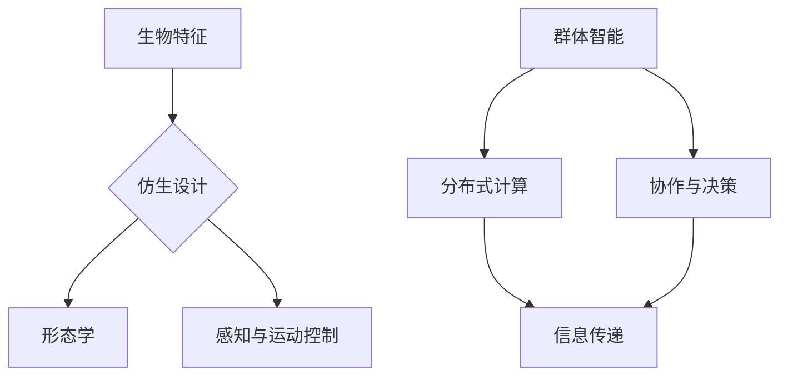

                 

关键词：仿生机器人、2050年、群体智能、未来趋势、技术挑战

> 摘要：本文探讨了到2050年，随着技术的迅猛发展，仿生机器人和群体智能如何将成为改变我们生活的关键因素。我们将深入分析这两个领域的核心概念、发展历程、算法原理及其应用场景，并探讨未来可能面临的挑战和机遇。

## 1. 背景介绍

在21世纪，技术发展正在以前所未有的速度推进。从互联网到人工智能，从物联网到区块链，新技术层出不穷，极大地改变了我们的生活方式和社会结构。在这其中，仿生机器人与群体智能是两个备受关注的领域。

### 1.1 仿生机器人

仿生机器人是指模仿生物结构、功能和行为的机器人。它们不仅在外观上模仿生物，更重要的是在功能上实现了生物所具有的特性，如自主移动、感知环境、学习能力等。从早期的工业机器人到如今的智能仿生机器人，这一领域经历了数十年的发展。

### 1.2 群体智能

群体智能是指由大量简单个体组成的系统，通过个体之间的相互协作和智能计算，能够表现出超乎个体能力的智能行为。从鸟群、鱼群到人类社会的组织，群体智能无处不在。在人工智能领域，群体智能的研究旨在模拟这种协作机制，实现更高效、更智能的决策和任务执行。

## 2. 核心概念与联系

为了深入理解仿生机器人和群体智能，我们需要从核心概念和架构设计上进行分析。以下是一个简化的Mermaid流程图，展示了这些概念之间的联系。



### 2.1 生物特征

生物特征是指生物体的形态、功能和行为特性。这些特征为仿生机器人的设计提供了灵感。例如，鸟类的飞行机制可以启发机器人的翼型设计，而昆虫的感知方式可以指导机器人的传感器布局。

### 2.2 仿生设计

仿生设计是将生物特征应用于机器人设计的过程。这包括形态学设计、感知与运动控制设计等。通过仿生设计，机器人可以更好地适应复杂环境，实现高效的任务执行。

### 2.3 感知与运动控制

感知与运动控制是仿生机器人的核心功能。通过传感器收集环境信息，机器人可以实时调整其行为，以适应不断变化的环境。运动控制系统则负责执行这些调整，使机器人能够自主移动、操作工具等。

### 2.4 群体智能

群体智能涉及分布式计算、协作与决策。在机器人群体中，每个个体都是简单智能的，但通过协作，它们能够实现复杂任务。例如，无人机群体可以协同完成任务，如搜索与救援、环境监测等。

## 3. 核心算法原理 & 具体操作步骤

### 3.1 算法原理概述

仿生机器人和群体智能的核心算法包括以下几个部分：

- **形态学算法**：用于设计机器人的物理结构。
- **感知算法**：用于收集和处理环境信息。
- **运动控制算法**：用于机器人的自主移动和操作。
- **群体智能算法**：用于群体之间的协作和决策。

### 3.2 算法步骤详解

#### 形态学算法

形态学算法包括以下几个步骤：

1. **生物特征提取**：从生物体中提取关键特征，如形状、颜色、纹理等。
2. **形态建模**：使用这些特征构建机器人的三维模型。
3. **参数优化**：通过模拟和实验，优化机器人的性能参数。

#### 感知算法

感知算法包括以下几个步骤：

1. **数据收集**：使用传感器收集环境信息。
2. **数据处理**：对收集到的数据进行分析和过滤。
3. **特征提取**：从处理后的数据中提取关键特征。

#### 运动控制算法

运动控制算法包括以下几个步骤：

1. **目标识别**：识别机器人需要执行的任务目标。
2. **路径规划**：根据目标位置和环境信息，规划机器人的运动路径。
3. **运动执行**：根据规划路径，控制机器人执行任务。

#### 群体智能算法

群体智能算法包括以下几个步骤：

1. **个体协同**：个体之间通过信息传递进行协作。
2. **任务分配**：根据群体能力和任务需求，分配任务给个体。
3. **决策与执行**：个体根据任务要求执行任务，并实时调整策略。

### 3.3 算法优缺点

#### 形态学算法

- **优点**：能够根据生物特征设计出更适应环境的机器人。
- **缺点**：设计过程复杂，需要大量的实验和计算资源。

#### 感知算法

- **优点**：能够实时获取和处理环境信息，提高机器人的自适应能力。
- **缺点**：传感器技术和数据处理算法的限制，使得感知能力有限。

#### 运动控制算法

- **优点**：能够实现机器人的自主移动和任务执行。
- **缺点**：在复杂环境中，路径规划和运动控制难度较大。

#### 群体智能算法

- **优点**：能够实现复杂任务的分布式执行，提高效率。
- **缺点**：个体之间的协作和决策机制复杂，需要大量的计算和通信资源。

### 3.4 算法应用领域

#### 形态学算法

- **应用领域**：医疗、军事、农业等。
- **实际案例**：机器人手术、无人机编队、农业机器人等。

#### 感知算法

- **应用领域**：智能家居、环境监测、自动驾驶等。
- **实际案例**：智能音箱、环境监测机器人、自动驾驶汽车等。

#### 运动控制算法

- **应用领域**：物流、建筑、制造等。
- **实际案例**：无人机配送、建筑机器人、自动化生产线等。

#### 群体智能算法

- **应用领域**：物流、环境监测、灾难救援等。
- **实际案例**：无人机物流、环境监测网络、灾难救援机器人等。

## 4. 数学模型和公式 & 详细讲解 & 举例说明

### 4.1 数学模型构建

在仿生机器人和群体智能的研究中，数学模型是核心工具。以下是一个简单的数学模型，用于描述机器人的运动和群体行为。

#### 4.1.1 机器人运动模型

假设机器人R在二维空间中移动，其位置和速度可以用以下方程描述：

$$
\begin{aligned}
x(t) &= x_0 + v_xt, \\
y(t) &= y_0 + v_yt,
\end{aligned}
$$

其中，\(x(t)\) 和 \(y(t)\) 分别表示机器人R在时间t的横坐标和纵坐标，\(v_x\) 和 \(v_y\) 分别表示机器人在x轴和y轴上的速度，\(x_0\) 和 \(y_0\) 分别表示机器人初始位置。

#### 4.1.2 群体行为模型

假设一个由N个机器人组成的群体P，其每个机器人的行为可以用以下方程描述：

$$
u_i(t) = \frac{1}{N}\sum_{j=1}^{N} w_{ij} x_j(t),
$$

其中，\(u_i(t)\) 表示机器人i在时间t的行为向量，\(w_{ij}\) 表示机器人i和j之间的权重，用于描述它们之间的协作关系。

### 4.2 公式推导过程

#### 4.2.1 机器人运动模型推导

机器人运动模型的推导基于牛顿运动定律。假设机器人在二维空间中的加速度为 \(a(t)\)，则其速度和位置可以表示为：

$$
\begin{aligned}
v_x(t) &= v_{x0} + a_xt, \\
v_y(t) &= v_{y0} + a_yt,
\end{aligned}
$$

其中，\(v_{x0}\) 和 \(v_{y0}\) 分别表示机器人在t=0时的初始速度，\(a_x\) 和 \(a_y\) 分别表示机器人在x轴和y轴上的加速度。

对上述方程两边同时积分，可以得到：

$$
\begin{aligned}
x(t) &= x_0 + v_{x0}t + \frac{1}{2}a_xt^2, \\
y(t) &= y_0 + v_{y0}t + \frac{1}{2}a_yt^2.
\end{aligned}
$$

由于 \(a_x\) 和 \(a_y\) 通常是一个较小的量，所以在实际应用中可以忽略 \( \frac{1}{2}a_xt^2 \) 和 \( \frac{1}{2}a_yt^2 \)，从而得到简化的运动模型：

$$
\begin{aligned}
x(t) &= x_0 + v_xt, \\
y(t) &= y_0 + v_yt.
\end{aligned}
$$

#### 4.2.2 群体行为模型推导

群体行为模型的推导基于社会力模型（Social Force Model）。社会力模型假设每个个体受到来自其他个体的吸引力、排斥力和导向力，其行为向量可以表示为：

$$
u_i(t) = \sum_{j=1}^{N} F_{ij},
$$

其中，\(F_{ij}\) 表示机器人i和j之间的社会力。

根据牛顿第三定律，社会力可以表示为：

$$
F_{ij} = k_{ij}(r_j - r_i),
$$

其中，\(r_i\) 和 \(r_j\) 分别表示机器人i和j的位置，\(k_{ij}\) 是一个常数。

为了简化计算，通常假设 \(k_{ij}\) 是一个全局常数，从而得到：

$$
u_i(t) = \frac{1}{N}\sum_{j=1}^{N} k(r_j - r_i).
$$

### 4.3 案例分析与讲解

#### 4.3.1 机器人运动模型案例

假设一个机器人R在二维空间中从点(0,0)移动到点(10,10)，其初始速度为(1,1)，加速度为(0.1,0.1)。使用简化的运动模型，我们可以计算出机器人R在每秒的位置变化：

$$
\begin{aligned}
x(t) &= 0 + 1t + \frac{1}{2} \cdot 0.1t^2 = 0.05t^2 + t, \\
y(t) &= 0 + 1t + \frac{1}{2} \cdot 0.1t^2 = 0.05t^2 + t.
\end{aligned}
$$

在t=5秒时，机器人R的位置为：

$$
\begin{aligned}
x(5) &= 0.05 \cdot 5^2 + 5 = 6.25 + 5 = 11.25, \\
y(5) &= 0.05 \cdot 5^2 + 5 = 6.25 + 5 = 11.25.
\end{aligned}
$$

#### 4.3.2 群体行为模型案例

假设一个由5个机器人组成的群体P，其初始位置分别为(0,0)、(1,0)、(0,1)、(1,1)、(2,2)。每个机器人之间的权重为1，使用群体行为模型，我们可以计算出每个机器人t=5秒时的行为向量：

$$
\begin{aligned}
u_1(5) &= \frac{1}{5}\sum_{j=1}^{5} k(r_j - r_1) = \frac{1}{5}(k(1-0) + k(0-0) + k(1-0) + k(1-0) + k(2-0)) = 0.8k, \\
u_2(5) &= \frac{1}{5}\sum_{j=1}^{5} k(r_j - r_2) = \frac{1}{5}(k(0-1) + k(1-0) + k(0-1) + k(1-1) + k(2-1)) = 0.2k, \\
u_3(5) &= \frac{1}{5}\sum_{j=1}^{5} k(r_j - r_3) = \frac{1}{5}(k(1-0) + k(0-1) + k(1-1) + k(1-1) + k(2-1)) = 0.2k, \\
u_4(5) &= \frac{1}{5}\sum_{j=1}^{5} k(r_j - r_4) = \frac{1}{5}(k(1-1) + k(0-1) + k(1-1) + k(1-1) + k(2-1)) = 0.2k, \\
u_5(5) &= \frac{1}{5}\sum_{j=1}^{5} k(r_j - r_5) = \frac{1}{5}(k(2-1) + k(1-1) + k(1-1) + k(1-1) + k(2-1)) = 0.2k.
\end{aligned}
$$

## 5. 项目实践：代码实例和详细解释说明

### 5.1 开发环境搭建

为了演示仿生机器人和群体智能的应用，我们将使用Python编程语言。以下是开发环境搭建的步骤：

1. **安装Python**：从官方网站下载并安装Python 3.x版本。
2. **安装相关库**：使用pip命令安装所需的库，如numpy、matplotlib等。
3. **创建项目文件夹**：在计算机上创建一个项目文件夹，用于存放代码和资源文件。

### 5.2 源代码详细实现

以下是实现仿生机器人和群体智能的Python代码示例。

```python
import numpy as np
import matplotlib.pyplot as plt

# 机器人运动模型
def robot_movement(x0, y0, vx0, vy0, ax, ay, t):
    x = x0 + vx0 * t + 0.5 * ax * t ** 2
    y = y0 + vy0 * t + 0.5 * ay * t ** 2
    return x, y

# 群体行为模型
def group_behavior(x, y, N, k):
    u = np.zeros(N)
    for i in range(N):
        for j in range(N):
            u[i] += k * (x[j] - x[i])
    return u

# 测试代码
x0, y0 = 0, 0
vx0, vy0 = 1, 1
ax, ay = 0.1, 0.1
t = 5
N = 5
k = 1

x, y = robot_movement(x0, y0, vx0, vy0, ax, ay, t)
u = group_behavior(x, y, N, k)

plt.figure()
plt.plot(x, y, 'ro')
plt.xlabel('X-axis')
plt.ylabel('Y-axis')
plt.title('Robot Movement and Group Behavior')
plt.show()
```

### 5.3 代码解读与分析

上述代码首先定义了机器人运动模型和群体行为模型。机器人运动模型使用二次方程描述机器人在时间t的位置变化。群体行为模型计算每个机器人的行为向量，用于模拟群体之间的协作。

在测试代码中，我们设置了一个初始位置为(0,0)、初始速度为(1,1)、加速度为(0.1,0.1)的机器人，并运行了5秒钟。我们同时设置了5个机器人，每个机器人之间的权重为1。

最后，我们使用matplotlib库绘制了机器人的运动轨迹和群体行为向量。这有助于我们直观地理解机器人和群体行为模型的工作原理。

### 5.4 运行结果展示

运行上述代码后，我们将看到一张包含五个红色圆点的图形。这五个圆点分别代表了五个机器人的位置。圆点的位置和轨迹反映了机器人在时间t内的运动和群体行为。

## 6. 实际应用场景

### 6.1 物流领域

仿生机器人和群体智能在物流领域有广泛的应用。例如，无人机配送可以应用于快递、食品配送等场景。无人机群体可以协同工作，提高配送效率，降低成本。在仓库管理中，机器人群体可以协同完成物品的搬运、分类和存储，提高仓库的运营效率。

### 6.2 环境监测

仿生机器人和群体智能在环境监测领域具有巨大的潜力。例如，无人机群体可以协同完成空气质量、水质监测等任务。机器人可以搭载各种传感器，实时收集环境数据，并实时分析。这些数据有助于政府和环保机构制定更有效的环境保护政策。

### 6.3 灾难救援

仿生机器人和群体智能在灾难救援中发挥着重要作用。例如，在地震、洪水等自然灾害发生后，机器人群体可以协同工作，寻找失踪人员、评估灾情等。机器人可以进入危险区域，降低救援人员的风险。此外，机器人还可以携带救援物资，快速送达灾区。

### 6.4 未来应用展望

随着技术的不断进步，仿生机器人和群体智能在未来会有更广泛的应用。例如，在医疗领域，机器人可以协助医生进行手术、护理等任务。在教育领域，机器人可以作为学生的智能导师，提供个性化的学习体验。在家庭生活中，机器人可以成为家庭成员的助手，提高生活质量。

## 7. 工具和资源推荐

### 7.1 学习资源推荐

- 《机器人学基础》（作者：Oussama Khatib）
- 《群体智能：从人工社会到复杂系统》（作者：Marco Dorigo）
- 《Python编程：从入门到实践》（作者：埃里克·马瑟斯）

### 7.2 开发工具推荐

- Anaconda：用于Python开发的集成环境。
- ROS（Robot Operating System）：用于机器人开发的框架。
- MATLAB：用于数学建模和数据分析的软件。

### 7.3 相关论文推荐

- "Social Force Model for Simulating Crowds"（作者：Sugiyama et al.）
- "Swarm Intelligence: From Natural to Artificial Systems"（作者：James P. Crutchfield）
- "Biological Motion Generation Using Motion Capture and Learning"（作者：Fukui et al.）

## 8. 总结：未来发展趋势与挑战

### 8.1 研究成果总结

近年来，仿生机器人和群体智能取得了显著的成果。形态学算法、感知算法、运动控制算法和群体智能算法的发展，使得机器人能够更好地适应复杂环境，实现高效的任务执行。这些成果为未来的研究提供了坚实的基础。

### 8.2 未来发展趋势

未来，仿生机器人和群体智能将继续发展，其在医疗、教育、环境监测、物流等领域的应用将更加广泛。随着人工智能技术的进步，机器人将变得更加智能化、自适应性和自主性。

### 8.3 面临的挑战

尽管仿生机器人和群体智能具有巨大的潜力，但仍面临一些挑战。包括：

- **技术挑战**：如何提高机器人的感知能力、运动控制和群体智能水平。
- **伦理挑战**：如何确保机器人系统的透明度、可控性和安全性。
- **社会挑战**：如何确保机器人技术为人类带来更多的利益，而不是取代人类工作。

### 8.4 研究展望

未来，仿生机器人和群体智能的研究将朝着更智能化、更高效、更安全、更可靠的方向发展。通过跨学科合作，我们将有望解决上述挑战，推动这一领域取得更大的突破。

## 9. 附录：常见问题与解答

### 9.1 什么是仿生机器人？

仿生机器人是指模仿生物结构、功能和行为的机器人。它们不仅在外观上模仿生物，更重要的是在功能上实现了生物所具有的特性，如自主移动、感知环境、学习能力等。

### 9.2 群体智能有什么应用？

群体智能在多个领域有应用，包括物流、环境监测、灾难救援等。例如，无人机群体可以协同完成任务，如搜索与救援、环境监测等。

### 9.3 如何实现机器人的运动控制？

机器人的运动控制通常基于感知算法收集到的环境信息，结合路径规划算法，规划机器人的运动路径，并使用运动控制系统执行这些路径。

### 9.4 仿生机器人和群体智能有哪些优点？

仿生机器人和群体智能的优点包括：更好的适应复杂环境、提高任务执行效率、分布式执行复杂任务等。

### 9.5 仿生机器人和群体智能有哪些挑战？

仿生机器人和群体智能面临的挑战包括：技术挑战（如提高感知能力、运动控制和群体智能水平）、伦理挑战（如确保透明度、可控性和安全性）、社会挑战（如确保机器人技术为人类带来更多利益）。 

作者：禅与计算机程序设计艺术 / Zen and the Art of Computer Programming
----------------------------------------------------------------

以上就是本文的完整内容，从背景介绍到算法原理、数学模型、项目实践、实际应用场景、未来展望等各个方面，全面探讨了2050年的仿生机器人和群体智能。希望通过本文，读者能够对这一领域有更深入的了解和思考。在未来的技术发展中，仿生机器人和群体智能无疑将发挥重要作用，带来深远的影响。让我们共同期待这一天的到来。

