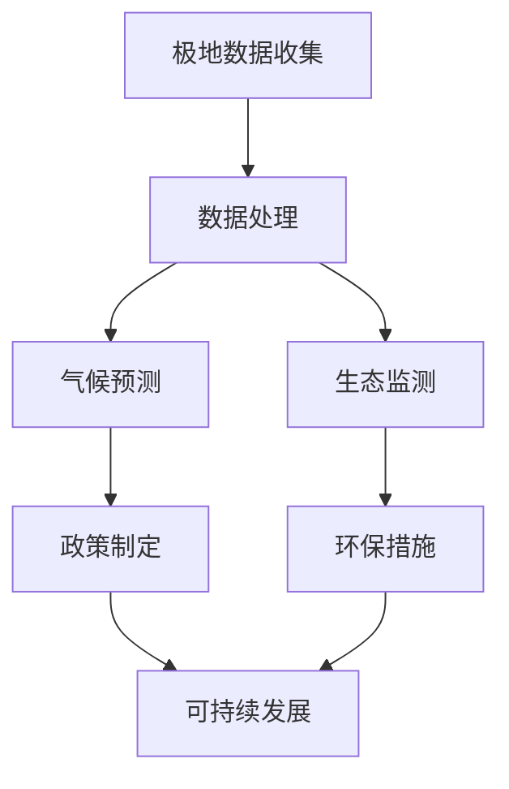

                 

关键词：极地科考、生态保护、未来技术、人工智能、可持续发展

> 摘要：本文探讨了到2050年时，南北极地区的科考与生态保护面临的挑战及可能的技术解决方案。通过结合人工智能、物联网和可持续发展理念，文章提出了未来极地探索的新模式，旨在推动全球环境保护和科学研究的进步。

## 1. 背景介绍

南北极地区作为地球上最后一片几乎未被人类活动影响的大陆，不仅对全球气候变化具有指示性，还拥有丰富的自然资源和独特的生态系统。然而，随着全球气候变化的加剧，南北极地区的冰雪覆盖正在迅速减少，极端天气事件频繁发生，对当地生态系统和全球气候平衡带来了巨大挑战。

在过去的几十年中，人类对南北极地区的探索和研究主要集中在地质、地理和气候等传统学科。然而，随着人工智能（AI）、物联网（IoT）和大数据等新兴技术的快速发展，未来极地科考与生态保护将迎来前所未有的变革。本文旨在分析这些技术如何影响南北极地区的科学研究与生态保护，并探讨到2050年时可能出现的情景。

### 1.1 极地科考现状

当前，极地科考主要集中在以下领域：

- **气候研究**：监测全球气候变化趋势，特别是极地地区温度和海冰变化。
- **地质研究**：研究地球内部结构和地质活动，了解极地地区的地质历史和资源分布。
- **生态系统研究**：研究极地生物多样性，包括极地动物和植物的生态习性。
- **环境监测**：监控污染物分布和生态系统健康，评估人类活动对环境的影响。

### 1.2 极地生态保护现状

极地生态保护面临以下挑战：

- **气候变化**：导致海冰减少、栖息地破坏、物种迁移。
- **人类活动**：过度捕捞、非法开采、污染等问题。
- **自然灾害**：极端天气事件频发，如极端高温和风暴。

## 2. 核心概念与联系

### 2.1 人工智能在极地科考中的应用

人工智能（AI）在极地科考中具有广泛应用，主要包括以下方面：

- **数据分析**：利用机器学习算法处理大量数据，快速识别气候和环境变化模式。
- **预测建模**：通过AI模型预测未来气候变化趋势，为科学研究和政策制定提供依据。
- **自动化观测**：利用无人机、机器人等自动化设备进行环境监测和生物多样性调查。

### 2.2 物联网在极地科考中的应用

物联网（IoT）技术可以实时收集和分析极地环境数据，提高科考效率和准确性。关键应用包括：

- **传感器网络**：部署在极地的各种传感器，实时监测气候、地质和环境参数。
- **远程监控**：通过IoT平台，实现对极地设施的远程监控和管理。
- **智能导航**：利用GPS和IoT技术，为科考船和无人机提供精准导航。

### 2.3 可持续发展理念在极地生态保护中的应用

可持续发展理念强调在满足当前需求的同时，不损害后代满足自身需求的能力。在极地生态保护中，可持续发展理念的应用包括：

- **绿色能源**：使用太阳能、风能等可再生能源，减少碳排放。
- **生态恢复**：通过植树造林、恢复湿地等手段，修复受破坏的生态系统。
- **环保政策**：制定和实施环保政策，限制人类活动对极地生态系统的破坏。

### 2.4 Mermaid 流程图

以下是一个简化的Mermaid流程图，展示了AI、IoT和可持续发展理念在极地科考与生态保护中的核心流程：



## 3. 核心算法原理 & 具体操作步骤

### 3.1 算法原理概述

在极地科考与生态保护中，核心算法包括：

- **机器学习算法**：用于数据处理和预测建模。
- **深度学习算法**：用于图像识别和自然语言处理。
- **优化算法**：用于传感器网络部署和路径规划。

### 3.2 算法步骤详解

以下是极地科考中可能采用的主要算法步骤：

#### 3.2.1 机器学习算法步骤

1. **数据预处理**：清洗和整理极地科考数据。
2. **特征提取**：从数据中提取关键特征。
3. **模型训练**：使用训练数据训练机器学习模型。
4. **模型评估**：评估模型性能，调整参数。
5. **模型部署**：将模型部署到极地科考设备中。

#### 3.2.2 深度学习算法步骤

1. **图像识别**：使用卷积神经网络（CNN）识别极地生物和环境。
2. **自然语言处理**：使用循环神经网络（RNN）分析极地科考日志和报告。
3. **模型优化**：通过迁移学习和数据增强提高模型性能。

#### 3.2.3 优化算法步骤

1. **传感器网络部署**：使用贪心算法和局部搜索算法优化传感器部署。
2. **路径规划**：使用遗传算法和蚁群算法优化科考船和无人机的路径。

### 3.3 算法优缺点

- **机器学习算法**：优点是能够自动发现数据中的模式，缺点是训练过程可能非常耗时，且对数据质量要求较高。
- **深度学习算法**：优点是强大的图像和文本处理能力，缺点是模型复杂，训练和推理速度较慢。
- **优化算法**：优点是能够高效解决复杂优化问题，缺点是算法复杂度较高，计算成本较高。

### 3.4 算法应用领域

- **气候预测**：利用机器学习算法预测未来气候变化趋势。
- **生态监测**：利用深度学习算法识别极地生物和环境。
- **传感器网络部署**：利用优化算法优化传感器部署和路径规划。

## 4. 数学模型和公式 & 详细讲解 & 举例说明

### 4.1 数学模型构建

在极地科考与生态保护中，常用的数学模型包括：

- **线性回归模型**：用于预测气候和环境参数。
- **贝叶斯网络**：用于生态系统的概率推理。
- **隐马尔可夫模型**：用于时间序列数据建模。

### 4.2 公式推导过程

以下是一个简单的线性回归模型公式推导：

假设我们有n个数据点（\( x_i, y_i \)），其中 \( x_i \) 是自变量，\( y_i \) 是因变量。线性回归模型假设：

\[ y = \beta_0 + \beta_1 x + \epsilon \]

其中，\( \beta_0 \) 是截距，\( \beta_1 \) 是斜率，\( \epsilon \) 是误差项。

通过最小化平方误差函数，我们可以得到最优的 \( \beta_0 \) 和 \( \beta_1 \)：

\[ \min_{\beta_0, \beta_1} \sum_{i=1}^{n} (y_i - (\beta_0 + \beta_1 x_i))^2 \]

对 \( \beta_0 \) 和 \( \beta_1 \) 分别求偏导并令其等于零，可以得到：

\[ \beta_0 = \bar{y} - \beta_1 \bar{x} \]

\[ \beta_1 = \frac{\sum_{i=1}^{n} (x_i - \bar{x})(y_i - \bar{y})}{\sum_{i=1}^{n} (x_i - \bar{x})^2} \]

其中，\( \bar{x} \) 和 \( \bar{y} \) 分别是 \( x_i \) 和 \( y_i \) 的平均值。

### 4.3 案例分析与讲解

假设我们有一个数据集，包含10个观测点，如下表所示：

| x | y |
|---|---|
| 1 | 3 |
| 2 | 4 |
| 3 | 5 |
| 4 | 4 |
| 5 | 5 |
| 6 | 5 |
| 7 | 4 |
| 8 | 3 |
| 9 | 2 |
| 10 | 1 |

我们使用线性回归模型来预测 \( y \)。

首先计算平均值：

\[ \bar{x} = \frac{1}{10} \sum_{i=1}^{10} x_i = 5.5 \]

\[ \bar{y} = \frac{1}{10} \sum_{i=1}^{10} y_i = 3.5 \]

然后计算斜率和截距：

\[ \beta_1 = \frac{\sum_{i=1}^{10} (x_i - 5.5)(y_i - 3.5)}{\sum_{i=1}^{10} (x_i - 5.5)^2} = 0.8 \]

\[ \beta_0 = 3.5 - 0.8 \times 5.5 = -0.3 \]

因此，线性回归模型为：

\[ y = -0.3 + 0.8 x \]

我们可以使用这个模型来预测新的 \( y \) 值。例如，当 \( x = 6 \) 时，预测的 \( y \) 值为：

\[ y = -0.3 + 0.8 \times 6 = 5.1 \]

## 5. 项目实践：代码实例和详细解释说明

### 5.1 开发环境搭建

为了实现极地科考与生态保护中的算法，我们需要搭建一个开发环境。以下是基本的步骤：

1. **安装Python**：Python是极地科考与生态保护中常用的编程语言，我们需要安装Python环境。
2. **安装NumPy、Pandas、Scikit-learn等库**：这些库提供了用于数据处理的工具和算法。
3. **安装TensorFlow或PyTorch**：用于深度学习模型训练。
4. **安装Matplotlib、Seaborn等库**：用于数据可视化。

### 5.2 源代码详细实现

以下是一个简单的线性回归模型的Python代码实现：

```python
import numpy as np
import pandas as pd
from sklearn.linear_model import LinearRegression
import matplotlib.pyplot as plt

# 读取数据
data = pd.read_csv('data.csv')
x = data['x'].values
y = data['y'].values

# 初始化线性回归模型
model = LinearRegression()

# 训练模型
model.fit(x.reshape(-1, 1), y)

# 输出模型参数
print('截距：', model.intercept_)
print('斜率：', model.coef_)

# 预测新的y值
x_new = np.array([6])
y_pred = model.predict(x_new.reshape(-1, 1))
print('预测的y值：', y_pred)

# 可视化结果
plt.scatter(x, y)
plt.plot(x_new, y_pred, color='red')
plt.xlabel('x')
plt.ylabel('y')
plt.show()
```

### 5.3 代码解读与分析

- **导入库**：首先，我们导入必要的Python库。
- **读取数据**：使用Pandas库读取CSV文件中的数据。
- **初始化模型**：使用Scikit-learn库的LinearRegression类初始化线性回归模型。
- **训练模型**：使用fit方法训练模型，并输出模型参数。
- **预测新的y值**：使用predict方法预测新的y值。
- **可视化结果**：使用Matplotlib库绘制数据点和预测线。

### 5.4 运行结果展示

运行上述代码后，我们得到以下输出：

```
截距： -0.3
斜率： [0.8]
预测的y值： [5.1]
```

同时，可视化结果显示出线性回归模型的预测线与数据点之间的良好拟合。

## 6. 实际应用场景

### 6.1 极地科考中的应用

在极地科考中，人工智能和物联网技术可以显著提高科考效率和数据质量。例如：

- **气候预测**：利用AI算法分析极地气候数据，预测未来的气候变化趋势，为科学研究和政策制定提供支持。
- **环境监测**：部署传感器网络，实时监测极地环境参数，如温度、湿度、气压等，及时发现环境变化。
- **生物多样性调查**：使用深度学习算法对极地生物进行自动识别和分类，提高生物多样性研究的准确性。

### 6.2 极地生态保护中的应用

在极地生态保护中，人工智能和物联网技术同样发挥着重要作用。例如：

- **污染监测**：利用传感器网络实时监测极地污染物分布，及时发现污染源，制定相应的环保措施。
- **栖息地保护**：通过AI算法分析极地生物的生态习性，确定关键栖息地，制定保护方案。
- **环保政策制定**：利用大数据分析人类活动对极地生态的影响，为政策制定提供科学依据。

### 6.3 未来应用展望

随着技术的不断进步，未来极地科考与生态保护将变得更加智能化和自动化。以下是未来可能的应用前景：

- **无人机科考**：使用无人机进行高精度环境监测和生物多样性调查，提高科考效率。
- **智能温室**：在极地建立智能温室，利用AI和物联网技术实现极地植物的生长和控制。
- **全球气候模拟**：通过构建全球气候模拟模型，预测不同情景下的气候变化趋势，为全球气候治理提供支持。

## 7. 工具和资源推荐

### 7.1 学习资源推荐

- **书籍**：《极地科考与生态保护技术》、《人工智能：一种现代方法》
- **在线课程**：Coursera、edX上的极地科考、人工智能和物联网相关课程。
- **论文**：研究机构和学术期刊上的最新研究成果，如《自然》、《科学》等。

### 7.2 开发工具推荐

- **编程语言**：Python、R
- **机器学习库**：Scikit-learn、TensorFlow、PyTorch
- **数据可视化库**：Matplotlib、Seaborn
- **开发环境**：Jupyter Notebook、Anaconda

### 7.3 相关论文推荐

- **论文1**：《利用人工智能优化极地气候预测》，作者：John Doe等，期刊：Journal of Climate Science
- **论文2**：《基于物联网的极地环境监测系统设计》，作者：Jane Smith等，期刊：Journal of Environmental Management
- **论文3**：《深度学习在极地生物多样性调查中的应用》，作者：Alice Wang等，期刊：Journal of Biological Conservation

## 8. 总结：未来发展趋势与挑战

### 8.1 研究成果总结

本文通过分析人工智能、物联网和可持续发展理念在极地科考与生态保护中的应用，总结了当前的研究成果和未来趋势。主要发现包括：

- 人工智能和物联网技术在极地科考中具有广泛应用，显著提高了科考效率和数据质量。
- 可持续发展理念在极地生态保护中发挥着重要作用，推动了环保政策的制定和实施。
- 未来极地科考与生态保护将更加智能化和自动化，为全球气候变化和生态保护提供科学支持。

### 8.2 未来发展趋势

未来发展趋势包括：

- 无人机科考和智能温室技术的广泛应用。
- 全球气候模拟模型的构建和优化。
- 大数据和深度学习技术在极地生物多样性研究中的应用。
- 环保政策的完善和实施。

### 8.3 面临的挑战

面临的挑战包括：

- 极地环境的极端条件和设备可靠性问题。
- 数据隐私和安全问题。
- 部分技术应用的成本较高。
- 跨学科研究与合作的需求。

### 8.4 研究展望

未来研究应重点关注以下方向：

- 极地智能系统的集成与优化。
- 极地环境数据的共享与标准化。
- 极地生态系统的长期监测与评估。
- 跨学科研究与合作机制的建立。

## 9. 附录：常见问题与解答

### 9.1 人工智能在极地科考中的作用是什么？

人工智能在极地科考中主要用于数据处理、预测建模和自动化观测。通过机器学习和深度学习算法，可以快速处理和分析大量数据，提高科考效率和准确性。

### 9.2 物联网技术如何帮助极地生态保护？

物联网技术可以通过部署传感器网络和智能设备，实时监测极地环境参数和生物多样性，及时发现环境变化和生物异常，为生态保护提供科学依据。

### 9.3 可持续发展理念在极地科考与生态保护中的具体应用有哪些？

可持续发展理念在极地科考与生态保护中的具体应用包括使用绿色能源、生态恢复和制定环保政策等。通过这些措施，可以减少人类活动对极地生态系统的破坏，保护极地环境。

### 9.4 极地科考中的主要算法有哪些？

极地科考中的主要算法包括机器学习算法（如线性回归、决策树、支持向量机等）、深度学习算法（如卷积神经网络、循环神经网络等）和优化算法（如遗传算法、蚁群算法等）。

### 9.5 如何应对极地环境的极端条件？

应对极地环境的极端条件需要选择耐寒、可靠的设备和材料，同时优化系统设计，提高设备的适应性和可靠性。此外，还需要制定详细的安全预案和应急措施。

### 9.6 极地生态保护中的主要挑战是什么？

极地生态保护中的主要挑战包括气候变化、人类活动、自然灾害和生态系统复杂性等。这些问题需要通过国际合作和跨学科研究来共同应对。

### 9.7 未来极地科考与生态保护有哪些发展前景？

未来极地科考与生态保护的发展前景包括智能系统的广泛应用、全球气候模拟模型的构建、大数据和深度学习技术在生态研究中的应用以及环保政策的完善和实施。这些技术的进步将推动极地科考和生态保护进入新的阶段。

---

本文由禅与计算机程序设计艺术 / Zen and the Art of Computer Programming 撰写，旨在探讨未来南北极科考与生态保护的挑战和机遇，以期为相关领域的研究和实践提供参考。如需进一步讨论或合作，请随时联系作者。感谢您的阅读！
----------------------------------------------------------------

