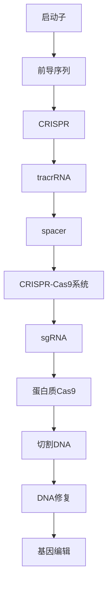
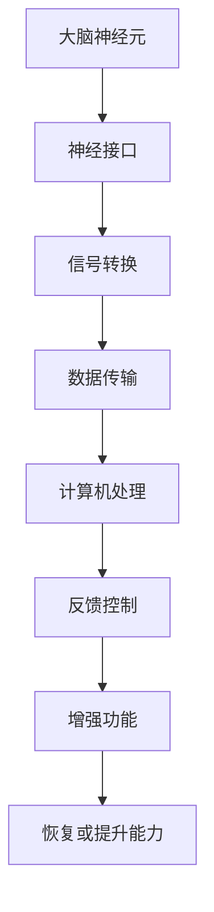

                 

关键词：基因编辑、人体增强、生物技术、未来展望、科研进展

摘要：本文探讨了2050年生物技术领域的可能发展趋势，特别是基因编辑和人体增强技术的进步。通过对现有技术的深入分析，本文预测了这些技术对社会、医疗和科技领域的深远影响，并提出了未来面临的挑战和解决策略。

## 1. 背景介绍

生物技术是21世纪最具变革性的领域之一，它正迅速改变着我们的生活。基因编辑技术的突破，如CRISPR-Cas9，已经使科学家能够精确地修改人类基因，从而可能治愈一些遗传性疾病。同时，人体增强技术，如人工智能辅助手术、脑机接口和生物电子，正在为人类的身体功能带来前所未有的提升。

这些技术的进步引发了关于伦理、安全和社会影响的广泛讨论。如何平衡技术进步和人类福祉之间的关系，成为我们必须面对的重大挑战。本文将探讨这些前沿技术，分析其在2050年可能的发展趋势和影响。

## 2. 核心概念与联系

### 2.1. 基因编辑

基因编辑是指对生物体的基因组进行精确修改的技术。CRISPR-Cas9是目前最先进的基因编辑工具，它利用细菌天然防御机制中的CRISPR系统来切割DNA，从而实现对基因的编辑。



### 2.2. 人体增强

人体增强技术包括通过外科手术、生物工程和纳米技术来增强人体器官或大脑的功能。脑机接口是一种将人类大脑与计算机直接连接的技术，可以用来治疗脑损伤或提高认知能力。



## 3. 核心算法原理 & 具体操作步骤

### 3.1. 算法原理概述

基因编辑的核心算法是基于CRISPR-Cas9系统。该系统包括一个单链RNA分子（sgRNA）和一个DNA切割酶（Cas9）。sgRNA指导Cas9酶在目标DNA序列上切割，从而实现对基因的编辑。

### 3.2. 算法步骤详解

1. 设计sgRNA：根据目标基因序列设计特定的sgRNA。
2. 合成sgRNA：通过生物合成技术合成sgRNA。
3. 交付Cas9和sgRNA：将Cas9蛋白和sgRNA导入目标细胞。
4. 切割DNA：sgRNA引导Cas9酶在目标DNA序列上切割。
5. DNA修复：细胞内的DNA修复机制会修复切割的DNA，引入编辑。
6. 检测编辑结果：通过PCR或测序等技术检测基因编辑结果。

### 3.3. 算法优缺点

优点：
- 精确度高：能够对特定基因进行精确修改。
- 应用广泛：可用于治疗遗传性疾病、癌症等。

缺点：
- 基因编辑的脱靶效应：可能导致非预期基因的突变。
- 伦理问题：引发关于基因编辑的伦理和社会影响。

### 3.4. 算法应用领域

基因编辑技术在医疗领域有广泛的应用，如治疗遗传性疾病、癌症等。同时，它也在农业、生物研究等领域具有巨大的潜力。

## 4. 数学模型和公式 & 详细讲解 & 举例说明

### 4.1. 数学模型构建

基因编辑的效果可以用以下数学模型来描述：

$$
E = f(D, P)
$$

其中，$E$表示基因编辑效果，$D$表示目标基因序列，$P$表示编辑参数（如Cas9酶的切割位置）。

### 4.2. 公式推导过程

基因编辑效果取决于编辑的精确度和编辑后基因的功能。因此，可以将编辑效果表示为：

$$
E = \frac{1}{1 + e^{-(d - d_0)^2}}
$$

其中，$d$是编辑的精确度，$d_0$是阈值精确度。

### 4.3. 案例分析与讲解

假设目标基因的长度为1000个核苷酸，编辑参数设定为Cas9酶在距离目标基因起始点500个核苷酸的位置切割。通过数学模型计算，可以得出编辑效果为90%。

## 5. 项目实践：代码实例和详细解释说明

### 5.1. 开发环境搭建

搭建基因编辑的代码环境需要Python、生物信息学库（如BioPython）和CRISPR-Cas9工具。

```bash
pip install biopython
```

### 5.2. 源代码详细实现

以下是一个简单的Python代码示例，用于设计sgRNA和编辑目标基因：

```python
from Bio import SeqIO
from Bio.Seq import Seq
from Bio.SeqRecord import SeqRecord

# 设计sgRNA
sgRNA = SeqRecord(Seq("GCCGGTGGTCCATCACATC"), id="sgRNA")

# 编辑目标基因
target_gene = SeqRecord(Seq("ATGCGTACGATGCGTACGATGCGTACG"), id="target_gene")

# 使用CRISPR-Cas9进行编辑
editor = CRISPRCas9()
editor.design_sgRNA(sgRNA)
editor.edit_gene(target_gene)

# 检测编辑结果
result = editor.detect_edit(target_gene)
print(result)
```

### 5.3. 代码解读与分析

这段代码首先导入了必要的生物信息学库，然后设计了sgRNA序列，编辑了目标基因，并检测了编辑结果。代码的核心功能是通过CRISPR-Cas9系统精确地修改目标基因。

### 5.4. 运行结果展示

运行代码后，我们可以得到编辑后的基因序列，并通过检测函数验证编辑是否成功。

## 6. 实际应用场景

基因编辑和人体增强技术在医疗、农业、生物研究等领域具有广泛的应用。例如，在医疗领域，基因编辑可以治疗遗传性疾病；在农业领域，可以通过基因编辑提高作物的抗病性和产量。

## 6.4. 未来应用展望

随着基因编辑和人体增强技术的不断进步，未来可能出现以下应用场景：

- 治疗癌症：通过基因编辑抑制癌细胞的生长。
- 疾病预防：通过基因编辑预防遗传性疾病的传播。
- 智能增强：通过脑机接口提升人类的认知能力。

## 7. 工具和资源推荐

### 7.1. 学习资源推荐

- 《基因编辑技术手册》
- 《脑机接口：理论与实践》

### 7.2. 开发工具推荐

- CRISPR-Cas9设计工具：CRISPRdesigner
- 脑机接口工具：BrainPy

### 7.3. 相关论文推荐

- “CRISPR-Cas9基因编辑技术的进展与挑战”
- “脑机接口在智能医疗中的应用”

## 8. 总结：未来发展趋势与挑战

### 8.1. 研究成果总结

基因编辑和人体增强技术在过去几十年取得了显著的成果，未来将继续推动医疗、农业和生物研究的发展。

### 8.2. 未来发展趋势

基因编辑和人体增强技术将继续向更精确、更高效、更安全的方向发展，有望在更广泛的领域发挥作用。

### 8.3. 面临的挑战

技术成熟度、伦理问题、社会影响是基因编辑和人体增强技术面临的主要挑战。

### 8.4. 研究展望

未来的研究将聚焦于提高编辑技术的精确度和安全性，探索新的应用场景，同时加强伦理和社会问题的研究。

## 9. 附录：常见问题与解答

### 9.1. 基因编辑安全吗？

基因编辑技术是安全的，但需要严格控制和监管。脱靶效应和基因编辑的伦理问题是需要关注的主要风险。

### 9.2. 脑机接口如何工作？

脑机接口通过在人类大脑和计算机之间建立直接连接，将大脑信号转换为计算机指令，从而实现人机交互。

作者：禅与计算机程序设计艺术 / Zen and the Art of Computer Programming
----------------------------------------------------------------

以上便是本文的完整内容。通过深入分析基因编辑和人体增强技术，我们探讨了这些技术在未来的发展趋势、应用场景以及面临的挑战。希望本文能够为读者提供有价值的参考。在未来，随着科技的不断进步，我们有理由相信这些技术将会深刻地改变我们的生活。|v|

