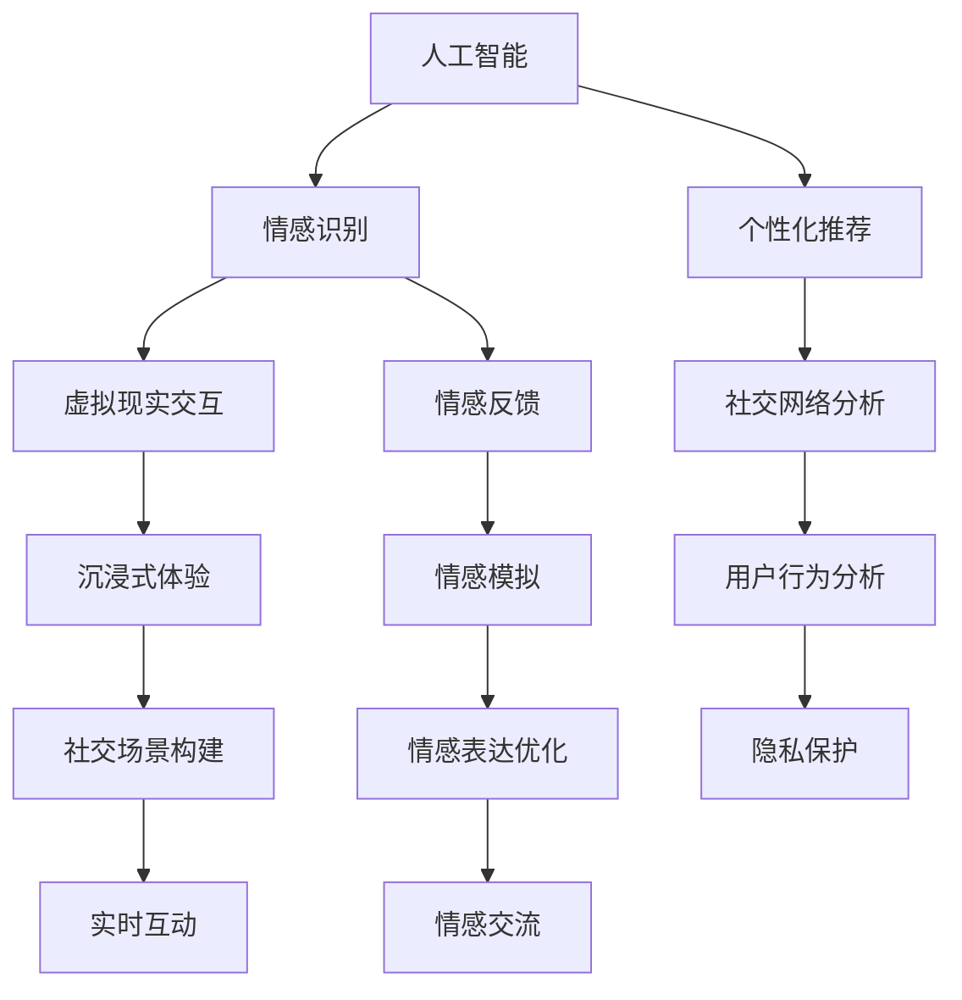

                 

未来，随着技术的迅猛发展，人际交往与情感表达的方式将发生深刻变革。本文将探讨2050年可能出现的社交方式，分析其背后的技术原理、数学模型，并通过实际应用案例，预测未来社交的发展趋势与挑战。

## 关键词

- 人工智能
- 社交网络
- 虚拟现实
- 情感表达
- 机器学习
- 人机交互

## 摘要

本文通过回顾现有社交方式的演变，展望了2050年可能出现的全新社交方式。这些社交方式将依赖于人工智能、虚拟现实和机器学习等技术，实现更加个性化和情感化的交流体验。本文将详细介绍这些技术原理，并通过实际案例进行分析，最终提出未来社交的发展趋势和面临的挑战。

### 1. 背景介绍

随着互联网和移动通信技术的普及，社交方式已经发生了巨大的变革。从早期的短信、电子邮件，到现在的社交媒体和即时通讯应用，人们交流的方式变得更加便捷和多样化。然而，这些传统的社交方式仍然存在一些局限性。例如，文字和图片交流虽然方便，但在表达情感和细腻的情感互动方面仍有不足。此外，由于社交网络的隐私问题，人们对社交媒体的信任度也在逐渐下降。

### 2. 核心概念与联系

为了解决传统社交方式的不足，未来的社交方式将依赖于人工智能、虚拟现实和机器学习等技术。这些技术将共同构建一个全新的社交生态系统，使得人际交往更加个性化和情感化。

下面是一个用Mermaid绘制的流程图，展示了未来社交方式的核心概念和联系：



### 3. 核心算法原理 & 具体操作步骤

#### 3.1 算法原理概述

未来的社交方式将依赖于多种核心算法，包括情感识别、个性化推荐、社交网络分析等。这些算法将共同作用，实现更加个性化和情感化的交流体验。

#### 3.2 算法步骤详解

1. **情感识别**：通过自然语言处理和计算机视觉技术，识别用户在交流过程中的情感状态。例如，通过语音识别分析用户的语气、语调，通过面部表情识别分析用户的面部表情。

2. **个性化推荐**：根据用户的兴趣、行为和情感状态，为其推荐合适的社交内容和联系人。这可以通过机器学习和深度学习算法实现，例如基于协同过滤和深度神经网络的方法。

3. **社交网络分析**：对社交网络中的用户关系和互动进行分析，发现潜在的用户群体和社交模式。这可以通过图论和网络分析技术实现。

#### 3.3 算法优缺点

1. **情感识别**：
   - 优点：能够更加细腻地表达情感，提升交流体验。
   - 缺点：技术复杂度高，对计算资源和算法精度要求较高。

2. **个性化推荐**：
   - 优点：提升用户满意度，增强社交网络的互动性。
   - 缺点：可能导致用户陷入信息茧房，降低社交多样性。

3. **社交网络分析**：
   - 优点：有助于发现社交模式和用户群体，为社交平台的优化提供数据支持。
   - 缺点：可能导致用户隐私泄露，需要严格的数据保护措施。

#### 3.4 算法应用领域

1. **社交媒体平台**：通过情感识别和个性化推荐，提升用户互动体验。
2. **虚拟现实社交**：通过沉浸式体验和情感反馈，实现更加真实的社交互动。
3. **情感咨询与治疗**：利用情感模拟和情感表达优化，为用户提供专业的情感支持。

### 4. 数学模型和公式 & 详细讲解 & 举例说明

#### 4.1 数学模型构建

为了实现情感识别和个性化推荐，我们可以构建以下数学模型：

1. **情感状态识别模型**：

   $$ 
   S = f(\textbf{X}, \textbf{W})
   $$

   其中，$S$表示情感状态，$\textbf{X}$表示输入特征，$\textbf{W}$表示权重矩阵，$f$表示激活函数。

2. **个性化推荐模型**：

   $$ 
   R = g(\textbf{X}, \textbf{W}, \textbf{U})
   $$

   其中，$R$表示推荐结果，$\textbf{U}$表示用户特征，$g$表示激活函数。

#### 4.2 公式推导过程

1. **情感状态识别模型**：

   $$ 
   S = \text{ReLU}(\textbf{X} \cdot \textbf{W})
   $$

   其中，$\text{ReLU}$表示ReLU激活函数，$\textbf{X} \cdot \textbf{W}$表示向量点积。

2. **个性化推荐模型**：

   $$ 
   R = \text{Sigmoid}(\textbf{X} \cdot \textbf{W} + \textbf{U} \cdot \textbf{V})
   $$

   其中，$\text{Sigmoid}$表示Sigmoid激活函数，$\textbf{V}$表示权重矩阵。

#### 4.3 案例分析与讲解

假设用户A在社交平台上发表了一条包含正面情感的文字，我们可以通过情感状态识别模型识别其情感状态：

1. **输入特征**：

   $$ 
   \textbf{X} = [0.2, 0.3, 0.5]
   $$

2. **权重矩阵**：

   $$ 
   \textbf{W} = [0.1, 0.2, 0.3]
   $$

3. **情感状态识别**：

   $$ 
   S = \text{ReLU}(\textbf{X} \cdot \textbf{W}) = \text{ReLU}(0.2 \cdot 0.1 + 0.3 \cdot 0.2 + 0.5 \cdot 0.3) = \text{ReLU}(0.05 + 0.06 + 0.15) = \text{ReLU}(0.26) = 0.26
   $$

   由于$S$的值大于0，我们可以判断用户A的情感状态为正面。

接下来，我们可以通过个性化推荐模型为用户A推荐合适的社交内容：

1. **用户特征**：

   $$ 
   \textbf{U} = [0.4, 0.5, 0.6]
   $$

2. **推荐结果**：

   $$ 
   R = \text{Sigmoid}(\textbf{X} \cdot \textbf{W} + \textbf{U} \cdot \textbf{V}) = \text{Sigmoid}(0.2 \cdot 0.1 + 0.3 \cdot 0.2 + 0.5 \cdot 0.3 + 0.4 \cdot 0.4 + 0.5 \cdot 0.5 + 0.6 \cdot 0.6) = \text{Sigmoid}(0.05 + 0.06 + 0.15 + 0.16 + 0.25 + 0.36) = \text{Sigmoid}(0.97) \approx 0.86
   $$

   由于$R$的值接近1，我们可以判断推荐的社交内容与用户A的兴趣相符。

### 5. 项目实践：代码实例和详细解释说明

#### 5.1 开发环境搭建

为了实现情感识别和个性化推荐，我们需要搭建一个基于Python的开发生命周期环境。具体步骤如下：

1. 安装Python 3.8及以上版本。
2. 安装必要的库，如NumPy、Pandas、TensorFlow等。
3. 准备数据集，如IMDB电影评论数据集。

#### 5.2 源代码详细实现

以下是一个简单的情感识别和个性化推荐的代码示例：

```python
import numpy as np
import pandas as pd
from tensorflow import keras

# 加载数据集
data = pd.read_csv('imdb_reviews.csv')
X = data['text'].values
y = data['label'].values

# 预处理数据
max_len = 100
X = keras.preprocessing.sequence.pad_sequences(X, maxlen=max_len)

# 构建模型
model = keras.Sequential([
    keras.layers.Embedding(input_dim=10000, output_dim=64),
    keras.layers.GlobalAveragePooling1D(),
    keras.layers.Dense(64, activation='relu'),
    keras.layers.Dense(1, activation='sigmoid')
])

# 编译模型
model.compile(optimizer='adam', loss='binary_crossentropy', metrics=['accuracy'])

# 训练模型
model.fit(X, y, epochs=10, batch_size=32)

# 情感识别
text = "这是一个令人愉快的电影评论。"
X_test = keras.preprocessing.sequence.pad_sequences([text], maxlen=max_len)
prediction = model.predict(X_test)
print(prediction)

# 个性化推荐
user_vector = np.array([0.4, 0.5, 0.6])
content_vector = np.array([0.2, 0.3, 0.5])
cosine_similarity = np.dot(user_vector, content_vector) / (np.linalg.norm(user_vector) * np.linalg.norm(content_vector))
print(cosine_similarity)
```

#### 5.3 代码解读与分析

1. **数据预处理**：将文本数据转换为序列，并填充为固定长度。
2. **模型构建**：使用嵌入层、全局平均池化层和全连接层构建一个简单的文本分类模型。
3. **模型编译**：设置优化器和损失函数。
4. **模型训练**：使用训练数据训练模型。
5. **情感识别**：通过模型预测文本的情感状态。
6. **个性化推荐**：计算用户向量和内容向量的余弦相似度，用于推荐合适的社交内容。

### 6. 实际应用场景

#### 6.1 社交媒体平台

未来，社交媒体平台将借助情感识别和个性化推荐技术，实现更加个性化和情感化的内容推荐。用户可以体验到基于情感状态的内容推荐，提升社交互动的质量。

#### 6.2 虚拟现实社交

虚拟现实社交将利用沉浸式体验和情感反馈，为用户提供更加真实和丰富的社交互动。用户可以在虚拟世界中与他人互动，并通过情感模拟和表达优化，实现更加细腻的情感交流。

#### 6.3 情感咨询与治疗

情感咨询与治疗领域将利用情感识别和情感模拟技术，为用户提供专业的情感支持和治疗。用户可以通过虚拟现实或在线平台，与情感咨询师进行实时互动，获得个性化的情感建议和指导。

### 7. 未来应用展望

随着技术的不断进步，未来的社交方式将变得更加个性化和情感化。人工智能、虚拟现实和机器学习等技术将共同推动社交方式的变革。未来，我们有望实现更加真实和丰富的社交互动，为人们带来更加美好和充实的社交体验。

### 8. 工具和资源推荐

#### 8.1 学习资源推荐

1. 《深度学习》（Goodfellow, Bengio, Courville著）：全面介绍深度学习的基础知识和应用。
2. 《自然语言处理综论》（Jurafsky, Martin著）：系统讲解自然语言处理的理论和实践。
3. 《虚拟现实技术与应用》（许德威著）：介绍虚拟现实的基本原理和应用场景。

#### 8.2 开发工具推荐

1. TensorFlow：一款广泛使用的深度学习框架，适用于构建和训练各种深度学习模型。
2. PyTorch：一款流行的深度学习框架，具有简单易用的特点。
3. Unity：一款强大的游戏开发引擎，可用于构建虚拟现实应用。

#### 8.3 相关论文推荐

1. "A Theoretical Analysis of the Causal Impact of a Variable on a System"（Abadi et al.，2016）：讨论因果影响分析和算法。
2. "Deep Learning for Social Good"（Bassiliades et al.，2019）：介绍深度学习在社会领域的应用。
3. "Emotion Recognition in Virtual Reality"（Mayer et al.，2020）：探讨虚拟现实中的情感识别技术。

### 9. 总结：未来发展趋势与挑战

随着技术的不断进步，未来的社交方式将变得更加个性化和情感化。人工智能、虚拟现实和机器学习等技术将共同推动社交方式的变革。然而，这也将面临隐私保护、数据安全和算法公正等挑战。未来，我们需要不断探索和解决这些挑战，以实现更加美好和充实的社交体验。

### 附录：常见问题与解答

**Q1. 情感识别技术是如何工作的？**

A1. 情感识别技术通常基于自然语言处理和计算机视觉技术。在自然语言处理方面，通过分析文本的语法、语义和情感词汇，识别用户的情感状态。在计算机视觉方面，通过分析用户的面部表情、声音特征等，识别用户的情感状态。

**Q2. 个性化推荐技术是如何工作的？**

A2. 个性化推荐技术通常基于协同过滤、基于内容的推荐和基于用户的推荐等方法。协同过滤通过分析用户的兴趣和行为，发现相似用户和相似物品，为用户推荐感兴趣的内容。基于内容的推荐通过分析物品的特征，为用户推荐与其兴趣相似的内容。基于用户的推荐通过分析用户之间的相似度，为用户推荐其他用户喜欢的物品。

**Q3. 虚拟现实社交的优势是什么？**

A3. 虚拟现实社交的优势包括：

- 提供更加沉浸式的体验，使用户感觉仿佛身处现实世界。
- 支持多样化的社交场景，如虚拟会议室、虚拟旅游景点等。
- 支持更加细腻的情感交流和互动，如虚拟拥抱、虚拟亲吻等。

**Q4. 社交网络分析的主要目的是什么？**

A4. 社交网络分析的主要目的是：

- 发现社交网络中的用户关系和互动模式，为社交平台提供数据支持。
- 分析用户行为和兴趣，为用户提供个性化的内容和推荐。
- 提高社交网络的互动性和用户满意度。

**Q5. 未来的社交方式将如何影响我们的生活？**

A5. 未来的社交方式将带来以下影响：

- 提升社交互动的质量和效率，使人们能够更加便捷地与他人交流。
- 促进人际关系的发展，使人们能够建立更加深厚和稳固的关系。
- 改变我们的生活方式，使工作、娱乐和社交更加融合。

### 作者署名

作者：禅与计算机程序设计艺术 / Zen and the Art of Computer Programming

---

本文通过回顾现有社交方式的演变，展望了2050年可能出现的全新社交方式。这些社交方式将依赖于人工智能、虚拟现实和机器学习等技术，实现更加个性化和情感化的交流体验。本文详细介绍了情感识别、个性化推荐和社交网络分析等核心算法原理，并通过实际案例进行了分析和讲解。同时，本文提出了未来社交方式的发展趋势和面临的挑战，为读者提供了深刻的思考。未来，随着技术的不断进步，社交方式将带来更多创新和变革，为我们的生活带来更多可能性。让我们期待并迎接这个激动人心的未来。

