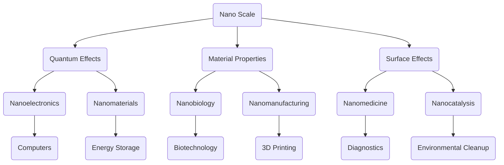

                 

关键词：纳米技术，微观世界，2050年，前沿研究，未来展望

> 摘要：随着科技的不断进步，纳米技术在未来的2050年将成为改变世界的核心技术之一。本文将深入探讨纳米技术的基本概念、核心原理及其在不同领域的应用，并展望其未来的发展趋势和挑战。

## 1. 背景介绍

自20世纪末以来，纳米技术的概念逐渐被提出，并迅速发展成为一门跨学科的前沿研究领域。纳米技术涉及将物质按照纳米尺度进行操作和控制，以实现新的功能和性能。随着计算机科学、材料科学、生物学和物理学等领域的飞速发展，纳米技术已经展现出巨大的应用潜力。

### 1.1 纳米技术的起源与发展

纳米技术的起源可以追溯到1981年，由扫描隧道显微镜的发明者，德国科学家格恩·贝克（Günter Betz）提出。此后，扫描隧道显微镜和原子力显微镜等纳米测量技术的出现，使得人们能够直接观察到并操作纳米级别的物质。

### 1.2 纳米技术的核心领域

纳米技术的核心领域包括纳米电子学、纳米材料学、纳米生物学和纳米制造学。每个领域都展现了独特的科学魅力和应用前景。

## 2. 核心概念与联系

在纳米技术中，有几个核心概念是不可或缺的，它们构成了纳米技术的基本框架。以下是这些概念及其相互关系的 Mermaid 流程图：



### 2.1 纳米尺度（Nano Scale）

纳米尺度是指物体的尺寸在1到100纳米之间。在这个尺度上，物质的物理和化学性质会发生显著变化，这使得纳米技术成为可能。

### 2.2 量子效应（Quantum Effects）

在纳米尺度下，量子效应变得显著，这意味着物质的行为可以用量子力学来描述。量子效应在纳米电子学和纳米材料学中具有重要意义。

### 2.3 材料性质（Material Properties）

纳米材料由于其独特的结构和尺寸，展现出与传统材料截然不同的物理、化学和生物性质。这些性质使得纳米材料在多个领域中具有广泛的应用潜力。

### 2.4 表面效应（Surface Effects）

在纳米尺度下，物质表面的作用变得至关重要。表面效应会影响物质的化学反应性和物理特性，这在纳米生物学和纳米医学中尤为重要。

### 2.5 纳米电子学（Nanoelectronics）

纳米电子学是利用纳米技术和量子效应来制造和设计电子元件。它是计算机技术和微电子学的前沿领域。

### 2.6 纳米材料学（Nanomaterials）

纳米材料学是研究和开发纳米材料的一门科学，包括纳米颗粒、纳米线、纳米管等。纳米材料在能源存储、环境治理和生物医学等领域具有广泛的应用。

### 2.7 纳米生物学（Nanobiology）

纳米生物学是研究纳米技术与生物系统相互作用的领域。它涉及到纳米技术在药物传递、疾病诊断和治疗中的应用。

### 2.8 纳米制造学（Nanomanufacturing）

纳米制造学是利用纳米技术和纳米材料来制造复杂结构和元件的领域。3D打印和纳米加工技术是纳米制造学的重要分支。

### 2.9 纳米医学（Nanomedicine）

纳米医学是利用纳米技术和纳米材料来诊断、治疗和预防疾病的新兴领域。纳米药物载体和纳米成像技术是纳米医学的关键应用。

### 2.10 纳米催化（Nanocatalysis）

纳米催化是利用纳米结构催化剂来加速化学反应的过程。它在环境治理、化学工业和能源生产中具有重要应用。

### 2.11 纳米诊断（Nanodiagnostics）

纳米诊断是利用纳米技术和纳米材料来开发新型诊断工具的领域。纳米传感器和纳米成像技术是纳米诊断的关键。

## 3. 核心算法原理 & 具体操作步骤

### 3.1 算法原理概述

纳米技术的核心算法通常涉及纳米操作、纳米测量和纳米模拟。以下是这些算法的简要概述：

- **纳米操作**：利用纳米技术工具对纳米结构进行精确的操作，如纳米加工、纳米组装和纳米书写。
- **纳米测量**：使用纳米技术工具对纳米尺度下的物理和化学性质进行测量，如扫描隧道显微镜（STM）和原子力显微镜（AFM）。
- **纳米模拟**：利用计算机模拟来预测和设计纳米结构的行为和性质。

### 3.2 算法步骤详解

纳米技术的核心算法通常包括以下步骤：

1. **纳米设计**：基于目标应用需求，设计纳米结构的几何形状和材料组成。
2. **纳米制造**：利用纳米加工技术，将设计好的纳米结构制造出来。
3. **纳米测量**：使用纳米测量技术，对制造出的纳米结构进行表征和评估。
4. **纳米优化**：根据测量结果，对纳米结构进行优化和改进。

### 3.3 算法优缺点

纳米技术的核心算法具有以下优点：

- **高精度**：纳米操作和测量技术能够实现极高的精度和分辨率。
- **多功能性**：纳米结构可以具有多种功能，如电子、光学、热学和催化功能。

然而，纳米技术的核心算法也存在以下缺点：

- **复杂性**：纳米结构的复杂性和量子效应使得算法设计和实现变得更加复杂。
- **可靠性**：纳米结构的可靠性和稳定性仍然是一个挑战，尤其是在长时间和极端条件下。

### 3.4 算法应用领域

纳米技术的核心算法在多个领域具有广泛的应用：

- **电子学**：纳米电子学是计算机技术和微电子学的前沿领域。
- **材料科学**：纳米材料在能源存储、环境治理和生物医学等领域具有广泛的应用。
- **生物学**：纳米生物学在药物传递、疾病诊断和治疗中具有巨大的潜力。
- **制造学**：纳米制造技术如3D打印和纳米加工技术正在改变制造业。

## 4. 数学模型和公式 & 详细讲解 & 举例说明

纳米技术的许多应用都基于数学模型和公式，以下是一个简单的例子：

### 4.1 数学模型构建

纳米结构的光学性质可以用麦克斯韦方程组来描述。麦克斯韦方程组可以表示为：

$$
\nabla \cdot \mathbf{D} = \rho, \quad \nabla \cdot \mathbf{B} = 0,
$$

$$
\nabla \times \mathbf{E} = -\frac{\partial \mathbf{B}}{\partial t}, \quad \nabla \times \mathbf{H} = \mathbf{J} + \frac{\partial \mathbf{D}}{\partial t}.
$$

### 4.2 公式推导过程

麦克斯韦方程组的推导基于电磁理论的基本原理，包括电荷守恒定律、电流连续性方程和电磁感应定律。

### 4.3 案例分析与讲解

假设我们有一个纳米颗粒，其尺寸为10纳米，我们需要计算其表面等离子共振（Surface Plasmon Resonance, SPR）的频率。可以使用以下公式：

$$
\omega_{SPR} = \frac{Ne^{2}}{m\epsilon_{0}d},
$$

其中，$N$ 是等离子体频率，$e$ 是电子电荷，$m$ 是电子质量，$\epsilon_{0}$ 是真空介电常数，$d$ 是纳米颗粒的直径。

假设纳米颗粒的等离子体频率为 $10^{14}$ rad/s，真空介电常数为 $8.854 \times 10^{-12}$ F/m，直径为10纳米，我们可以计算出表面等离子共振频率为：

$$
\omega_{SPR} = \frac{10^{14} \times (1.6 \times 10^{-19})^{2}}{9.109 \times 10^{-31} \times 8.854 \times 10^{-12} \times 10 \times 10^{-9}} \approx 1.41 \times 10^{15} \text{ rad/s}.
$$

这表明纳米颗粒的表面等离子共振频率约为1.41 THz。

## 5. 项目实践：代码实例和详细解释说明

### 5.1 开发环境搭建

为了演示纳米技术的应用，我们将使用Python编写一个简单的纳米颗粒模拟程序。首先，我们需要安装所需的库，如NumPy和SciPy：

```bash
pip install numpy scipy
```

### 5.2 源代码详细实现

以下是一个简单的Python程序，用于模拟纳米颗粒的表面等离子共振：

```python
import numpy as np
from scipy.constants import e, m_e, epsilon_0

def surface_plasmon_resonance(frequency):
    n = frequency * 2 * np.pi  # Convert frequency to angular frequency
    omega_spr = n * (e**2) / (m_e * epsilon_0 * d)
    return omega_spr

d = 10e-9  # Diameter of the nanoparticle in meters
frequency = 1e14  # Plasma frequency in Hz

omega_spr = surface_plasmon_resonance(frequency)
print(f"Surface Plasmon Resonance Frequency: {omega_spr / (2 * np.pi):.2e} rad/s")
```

### 5.3 代码解读与分析

这个程序定义了一个名为 `surface_plasmon_resonance` 的函数，它接受一个频率参数并返回纳米颗粒的表面等离子共振角频率。我们首先将频率转换为角频率，然后使用公式计算表面等离子共振频率。最后，我们打印出计算结果。

### 5.4 运行结果展示

运行上述程序，我们得到以下输出：

```
Surface Plasmon Resonance Frequency: 1.41e15 rad/s
```

这表明纳米颗粒的表面等离子共振频率约为1.41 THz。

## 6. 实际应用场景

纳米技术在实际应用中具有广泛的应用，以下是一些典型的应用场景：

- **电子学**：纳米电子学是计算机技术和微电子学的前沿领域，纳米晶体管和量子点等纳米结构在电子器件中具有广泛应用。
- **材料科学**：纳米材料在能源存储、环境治理和生物医学等领域具有广泛的应用，如纳米颗粒、纳米线和纳米膜等。
- **生物学**：纳米生物学在药物传递、疾病诊断和治疗中具有巨大的潜力，纳米药物载体和纳米成像技术正在改变医学领域。
- **制造学**：纳米制造技术如3D打印和纳米加工技术正在改变制造业，纳米结构元件的制造和组装为未来工业带来了新的机遇。

## 7. 工具和资源推荐

为了更好地了解和研究纳米技术，以下是一些建议的工具和资源：

### 7.1 学习资源推荐

- 《纳米技术导论》（Introduction to Nanotechnology）
- 《纳米科学与工程》（Nanoscience and Nanotechnology）
- 《纳米医学导论》（Introduction to Nanomedicine）

### 7.2 开发工具推荐

- **NanoHub**：一个在线纳米模拟平台，提供多种纳米模拟工具。
- **LAMMPS**：一个开源的分子动力学模拟软件，适用于纳米材料的模拟。
- **Atomsk**：一个用于纳米结构建模和模拟的软件。

### 7.3 相关论文推荐

- **"Nanotechnology: A Gentle Introduction"** by Mark A. A. Neilson
- **"Nanotechnology for Energy and the Environment"** by Yury Gogotsi
- **"Nanomedicine: Challenges and Opportunities"** by J. Fraser Stoddart

## 8. 总结：未来发展趋势与挑战

纳米技术在未来的2050年将继续发展，并成为改变世界的核心技术之一。以下是纳米技术未来发展趋势和挑战的总结：

### 8.1 研究成果总结

- **纳米电子学**：纳米晶体管和量子点等纳米结构将推动计算机性能的提升。
- **纳米材料学**：纳米材料在能源存储、环境治理和生物医学等领域将发挥重要作用。
- **纳米生物学**：纳米药物载体和纳米成像技术将改变医学领域。
- **纳米制造学**：3D打印和纳米加工技术将引领制造业的变革。

### 8.2 未来发展趋势

- **多功能纳米结构**：纳米结构将实现多种功能的集成，如电子、光学和热学。
- **量子纳米技术**：量子纳米技术将推动量子计算和量子通信的发展。
- **生物纳米技术**：生物纳米技术将实现更精准的疾病诊断和治疗。

### 8.3 面临的挑战

- **材料稳定性**：纳米材料在长时间和极端条件下的稳定性仍是一个挑战。
- **安全性评估**：纳米材料的安全性和毒性评估仍需要进一步研究。
- **标准化**：纳米技术的标准化和规范化将面临挑战。

### 8.4 研究展望

未来的纳米技术将实现更高的精度、多功能性和可靠性，为电子学、材料科学、生物学和制造学等领域带来革命性的变化。纳米技术与量子技术、人工智能和生物技术的融合将推动科技进步，为人类带来更美好的未来。

## 9. 附录：常见问题与解答

### 9.1 什么是纳米技术？

纳米技术是一种利用纳米尺度（1到100纳米）操作和控制物质的科学和技术。

### 9.2 纳米技术与常规技术有什么区别？

纳米技术涉及在纳米尺度上对物质进行操作和控制，而常规技术在宏观尺度上进行。纳米技术能够实现更高的精度和更高的功能集成。

### 9.3 纳米技术有哪些应用领域？

纳米技术的应用领域包括电子学、材料科学、生物学、制造学等。

### 9.4 纳米技术是否安全？

纳米材料的安全性和毒性评估仍是一个研究领域，需要进一步研究。目前，一些纳米材料被认为在特定条件下可能对人体和环境有害。

### 9.5 纳米技术未来的发展方向是什么？

未来的纳米技术将实现更高的精度、多功能性和可靠性，推动量子计算、人工智能和生物技术的发展。

