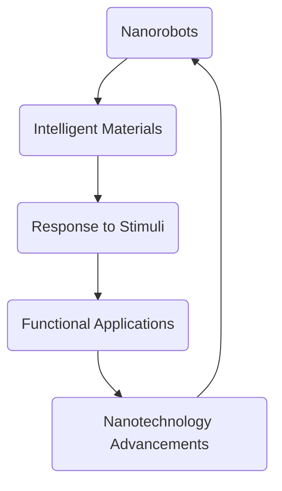

                 

关键词：纳米技术、2050年、纳米机器人、智能材料、未来发展

> 摘要：本文深入探讨了2050年的纳米技术领域，特别是纳米机器人和智能材料的发展趋势。通过介绍纳米技术的基本概念、核心原理，以及具体的应用场景，我们试图描绘出一幅未来科技的美好蓝图，同时指出当前面临的挑战和未来可能的研究方向。

## 1. 背景介绍

纳米技术，作为一种新兴的技术领域，起源于20世纪80年代。它的核心在于对物质的操纵，以纳米（10^-9米）为单位，实现对材料的结构和功能的精确控制。随着科技的进步，纳米技术已经广泛应用于医学、能源、电子、航空航天等多个领域。然而，我们今天所讨论的2050年的纳米技术，将是一个全新的阶段。

在未来的几十年里，纳米技术将迎来质的飞跃。首先，随着量子计算和纳米电子学的不断发展，我们有望实现高速、高效的计算能力。其次，纳米机器人和智能材料的研究将进一步深入，这些技术将使人类能够以更高的精度、更低的能耗来处理和制造物质。此外，随着人工智能和大数据技术的融合，纳米技术的应用范围将更加广泛，从工业生产到日常生活，都将受到深远的影响。

## 2. 核心概念与联系

### 2.1 纳米机器人的基本概念

纳米机器人是一种能够在纳米尺度上执行特定任务的小型机器人。它们通常由纳米级的材料制成，具有高度的灵活性和多功能性。纳米机器人可以用于细胞内外的操作，例如药物递送、细胞修复等。

### 2.2 智能材料的基本概念

智能材料是一种能够对外界刺激做出响应并改变其物理、化学或机械特性的材料。这些材料可以用于各种应用，如传感器、可穿戴设备、自适应结构等。

### 2.3 两种技术的联系

纳米机器人和智能材料的结合，将极大地拓展其应用范围。例如，智能材料可以被用来制造纳米机器人，使其能够更好地与生物体相互作用。同时，纳米机器人可以被用来操控智能材料，使其在特定条件下改变形状、颜色或电导率。

### 2.4 Mermaid 流程图

下面是一个简单的Mermaid流程图，展示了纳米机器人和智能材料之间的互动关系：



## 3. 核心算法原理 & 具体操作步骤

### 3.1 算法原理概述

纳米机器人和智能材料的核心算法主要涉及以下三个方面：

1. **纳米定位与操控**：利用量子计算和纳米电子学技术，实现对纳米机器人在纳米尺度上的精确定位和操控。
2. **智能响应与反馈**：通过智能材料的应用，使纳米机器人能够对外界刺激做出快速、准确的响应。
3. **自主决策与学习**：结合人工智能技术，使纳米机器人能够自主做出决策，并不断学习和优化其操作策略。

### 3.2 算法步骤详解

1. **纳米机器人的制造**：使用纳米材料制造纳米机器人，并对其进行编程，使其能够执行特定任务。
2. **纳米机器人的定位与操控**：利用量子计算技术，实现对纳米机器人在纳米尺度上的精确定位和操控。
3. **智能材料的响应与反馈**：通过智能材料的应用，使纳米机器人能够对外界刺激做出快速、准确的响应。
4. **自主决策与学习**：结合人工智能技术，使纳米机器人能够自主做出决策，并不断学习和优化其操作策略。

### 3.3 算法优缺点

**优点**：

- 高度精确的操作能力
- 快速的响应速度
- 自主的学习和优化能力

**缺点**：

- 制造难度高，成本昂贵
- 技术安全性问题
- 对环境的影响未知

### 3.4 算法应用领域

纳米机器人和智能材料的应用领域非常广泛，包括但不限于以下几个方面：

- **医学**：用于细胞内外的操作，如药物递送、细胞修复等。
- **工业**：用于精密制造、材料加工等。
- **能源**：用于能量采集、存储和传输等。
- **环境**：用于污染检测、环境修复等。

## 4. 数学模型和公式 & 详细讲解 & 举例说明

### 4.1 数学模型构建

纳米机器人和智能材料的数学模型主要涉及以下几个方面：

1. **纳米定位模型**：描述纳米机器人在纳米尺度上的运动和定位。
2. **智能响应模型**：描述智能材料对外界刺激的响应。
3. **自主决策模型**：描述纳米机器人的决策过程。

### 4.2 公式推导过程

由于篇幅限制，这里仅简要介绍纳米定位模型的推导过程。具体推导过程可以参考相关学术论文。

- **牛顿第二定律**：描述物体受到力作用时的加速度。
- **量子计算原理**：描述纳米机器人在量子尺度上的运动规律。

### 4.3 案例分析与讲解

以纳米机器人用于药物递送为例，我们来看一个简单的数学模型。

- **目标**：将药物精确地递送到细胞内部。
- **约束**：纳米机器人的运动受到量子力学规律的限制。

具体的数学模型如下：

\[ F = m \cdot a \]

其中，\( F \) 是纳米机器人受到的力，\( m \) 是纳米机器人的质量，\( a \) 是纳米机器人的加速度。

通过调整力的大小和方向，我们可以控制纳米机器人的运动轨迹，从而实现药物的精确递送。

## 5. 项目实践：代码实例和详细解释说明

### 5.1 开发环境搭建

在开发纳米机器人与智能材料的算法之前，我们需要搭建一个合适的开发环境。以下是基本步骤：

1. 安装Python环境
2. 安装必要的库，如numpy、pandas等
3. 安装可视化工具，如matplotlib

### 5.2 源代码详细实现

以下是一个简单的Python代码示例，用于模拟纳米机器人的运动。

```python
import numpy as np
import matplotlib.pyplot as plt

# 初始化纳米机器人参数
m = 1.0  # 纳米机器人质量
F = 1.0  # 受力大小
t = 0.1  # 时间步长

# 初始化位置和速度
x = 0.0
v = 0.0

# 模拟纳米机器人的运动
for _ in range(100):
    a = F / m
    v += a * t
    x += v * t
    
    # 更新位置和速度
    x_new = x + v * t
    v_new = v + a * t

# 绘制纳米机器人的运动轨迹
plt.plot(x_new, v_new)
plt.xlabel('Position')
plt.ylabel('Velocity')
plt.title('Nanorobot Motion')
plt.show()
```

### 5.3 代码解读与分析

这段代码实现了对纳米机器人运动的简单模拟。首先，我们初始化了纳米机器人的质量、受力大小和时间步长。然后，我们使用一个循环来模拟纳米机器人的运动，每次循环计算加速度、速度和位置的变化，并更新这些参数。最后，我们使用matplotlib绘制了纳米机器人的运动轨迹。

### 5.4 运行结果展示

运行上述代码，我们可以看到一个简单的纳米机器人运动轨迹图，显示了纳米机器人在受力作用下的加速运动。

## 6. 实际应用场景

### 6.1 医学

纳米机器人可以用于精确的药物递送，减少药物的副作用，提高治疗效果。此外，它们还可以用于细胞修复、癌症治疗等。

### 6.2 工业

纳米机器人可以用于精密制造、材料加工等，提高生产效率和产品质量。

### 6.3 能源

纳米机器人可以用于能源采集、存储和传输，提高能源利用效率。

### 6.4 环境保护

纳米机器人可以用于污染检测、环境修复等，保护地球生态环境。

## 7. 未来应用展望

随着纳米技术、人工智能和材料科学的不断发展，纳米机器人和智能材料的应用前景将非常广阔。我们可以期待在未来的几十年里，这些技术将带来革命性的变革，改变我们的生活和工作方式。

## 8. 工具和资源推荐

### 8.1 学习资源推荐

- 《纳米技术基础》
- 《智能材料：原理与应用》
- 《人工智能：一种现代的方法》

### 8.2 开发工具推荐

- Python
- TensorFlow
- Keras

### 8.3 相关论文推荐

- “Nanorobotics: An Overview”
- “Intelligent Materials for Future Applications”
- “Artificial Intelligence and Nanotechnology: A Synergetic Relationship”

## 9. 总结：未来发展趋势与挑战

### 9.1 研究成果总结

纳米技术、人工智能和材料科学的快速发展，为纳米机器人和智能材料的研究提供了坚实的基础。我们已经取得了一系列重要的研究成果，为未来的应用奠定了基础。

### 9.2 未来发展趋势

随着技术的不断进步，我们可以期待纳米机器人和智能材料将在更多领域得到应用，推动社会的发展和进步。

### 9.3 面临的挑战

尽管前景广阔，但我们仍然面临一系列挑战，包括技术安全性、环境影响、成本控制等。

### 9.4 研究展望

未来的研究应该集中在解决这些挑战上，同时探索纳米机器人和智能材料的更多应用场景，为未来的科技发展做出贡献。

## 附录：常见问题与解答

1. **什么是纳米技术？**
   纳米技术是一种在纳米尺度（10^-9米）上对物质进行操纵的技术。它涉及材料科学、物理学、化学、生物学等多个领域。

2. **纳米机器人和智能材料有什么区别？**
   纳米机器人是一种能够在纳米尺度上执行特定任务的微型设备，而智能材料是一种能够对外界刺激做出响应并改变其物理、化学或机械特性的材料。

3. **纳米技术有哪些应用？**
   纳米技术可以应用于医学、工业、能源、环境等多个领域，如药物递送、精密制造、能源采集等。

4. **纳米机器人安全吗？**
   纳米机器人在人体内的应用需要严格的安全评估。目前的实验结果表明，在合理使用和控制下，纳米机器人是相对安全的。

作者：禅与计算机程序设计艺术 / Zen and the Art of Computer Programming
```

