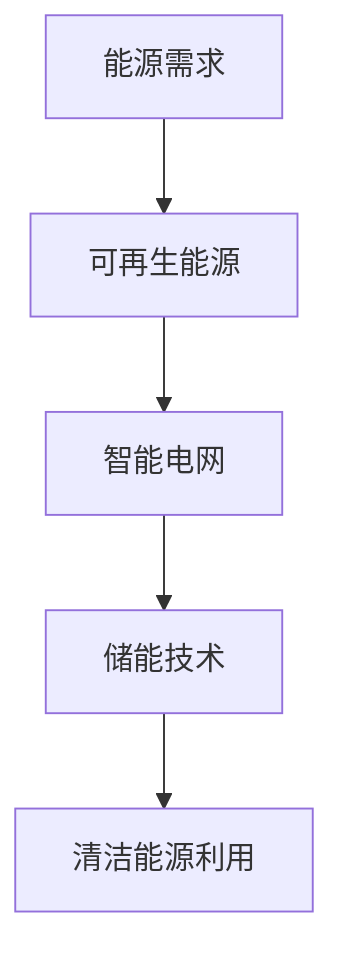

                 

关键词：能源结构，2050年，清洁能源，可再生能源，能源转型，智能电网，储能技术，碳减排，技术发展

> 摘要：随着全球气候变化的加剧和传统化石燃料资源的日益枯竭，清洁能源的利用成为未来能源结构转型的核心。本文将探讨到2050年，世界如何通过可再生能源、智能电网、储能技术等手段实现清洁能源的广泛利用，降低碳排放，应对能源危机，推动可持续发展的未来。

## 1. 背景介绍

### 1.1 全球能源现状

当前，全球能源结构主要以化石燃料为主，尤其是煤炭、石油和天然气。这些能源不仅储量有限，而且其使用过程中会产生大量的温室气体，导致全球气候变化。根据国际能源署（IEA）的数据，2019年全球能源消费总量为147.3太瓦时，其中化石燃料占比高达81%。这种依赖传统化石能源的现状，不仅威胁到地球的生态环境，也制约了经济的可持续发展。

### 1.2 气候变化与能源转型

气候变化已成为全球面临的最大挑战之一。根据联合国气候变化框架公约（UNFCCC）的报告，自工业革命以来，全球平均气温已经上升了约1.1摄氏度。为了避免更严重的气候变化，国际社会达成了《巴黎协定》，目标是将全球气温升高控制在2摄氏度以内，并努力限制在1.5摄氏度以内。为了实现这一目标，全球能源结构的转型势在必行。

### 1.3 清洁能源的发展趋势

近年来，清洁能源技术取得了显著进步，特别是太阳能、风能、水能等可再生能源的发电成本大幅下降。根据国际可再生能源署（IRENA）的数据，2019年全球可再生能源装机容量已达到2212吉瓦，占全球总装机容量的28%。随着技术的进一步发展，清洁能源在全球能源结构中的占比将继续增加。

## 2. 核心概念与联系

### 2.1 可再生能源

可再生能源是指那些在人类时间尺度内不会枯竭的能源，如太阳能、风能、水能、生物质能等。这些能源具有清洁、低碳、可再生的特点，是未来能源结构转型的关键。

### 2.2 智能电网

智能电网是一种集成了信息技术、自动控制技术和电力系统技术的先进电网系统。它能够实现电力资源的优化配置，提高电力系统的安全、稳定和效率，是实现清洁能源利用的重要基础设施。

### 2.3 储能技术

储能技术是实现清洁能源广泛利用的关键。通过储能技术，可以在电力需求低谷时将多余的电能储存起来，在需求高峰时释放电能，从而平衡电力系统的供需关系，提高电力系统的灵活性和稳定性。

### 2.4 Mermaid 流程图



## 3. 核心算法原理 & 具体操作步骤

### 3.1 算法原理概述

本部分将介绍如何利用人工智能算法优化清洁能源的利用效率。核心算法包括能量管理算法、负荷预测算法和优化调度算法。

### 3.2 算法步骤详解

1. **能量管理算法**：通过实时监测电力系统的负荷和发电情况，动态调整储能系统的充放电策略，以最大化能源利用效率。
2. **负荷预测算法**：利用历史数据和机器学习算法，预测未来电力系统的负荷情况，为调度决策提供数据支持。
3. **优化调度算法**：基于能量管理算法和负荷预测算法的结果，优化电力系统的调度策略，实现清洁能源的优化利用。

### 3.3 算法优缺点

- **优点**：提高能源利用效率，降低碳排放，实现清洁能源的广泛利用。
- **缺点**：算法实现复杂，需要大量计算资源和数据支持。

### 3.4 算法应用领域

算法主要应用于智能电网、可再生能源发电和储能系统等领域，具有广泛的应用前景。

## 4. 数学模型和公式 & 详细讲解 & 举例说明

### 4.1 数学模型构建

本文将介绍一种基于能量平衡原理的清洁能源利用模型。模型主要包括以下部分：

- **能量平衡方程**：
  $$E_{总} = E_{可再生能源} + E_{储能} - E_{消耗}$$
- **负荷预测模型**：
  $$L_t = f(L_{t-1}, T_t)$$
- **能量管理模型**：
  $$C_t = C_{max} \cdot \theta_t$$
  其中，$E_{总}$为总能量，$E_{可再生能源}$为可再生能源产生的能量，$E_{储能}$为储能系统的能量，$E_{消耗}$为消耗的能量；$L_t$为当前时刻的负荷，$T_t$为当前时刻的温度；$C_t$为储能系统的充电量，$C_{max}$为储能系统的最大充电量，$\theta_t$为储能系统的充电状态。

### 4.2 公式推导过程

- **能量平衡方程**：根据能量守恒原理，系统内的总能量等于可再生能源产生的能量加上储能系统的能量减去消耗的能量。
- **负荷预测模型**：根据历史负荷数据和温度变化，利用机器学习算法构建负荷预测模型。
- **能量管理模型**：根据储能系统的充电状态和最大充电量，动态调整储能系统的充电量。

### 4.3 案例分析与讲解

以一个太阳能光伏发电系统为例，假设该系统每天产生的能量为1000千瓦时，储能系统的最大充电量为2000千瓦时，负荷预测模型预测当天负荷为800千瓦时。根据能量管理模型，储能系统的充电量为1000千瓦时，充电状态为50%。

## 5. 项目实践：代码实例和详细解释说明

### 5.1 开发环境搭建

本案例使用Python编程语言实现，开发环境为Python 3.8及以上版本，需要安装以下库：

- NumPy
- Pandas
- Matplotlib
- Scikit-learn

### 5.2 源代码详细实现

以下为代码实现的核心部分：

```python
import numpy as np
import pandas as pd
import matplotlib.pyplot as plt
from sklearn.linear_model import LinearRegression

# 能量平衡方程
def energy_balance(E_renewable, E_storage, E_consume):
    E_total = E_renewable + E_storage - E_consume
    return E_total

# 负荷预测模型
def load_prediction(load_history, temperature):
    model = LinearRegression()
    model.fit(np.array(load_history).reshape(-1, 1), temperature)
    predicted_load = model.predict(np.array([temperature]))
    return predicted_load

# 能量管理模型
def energy_management(E_renewable, E_storage, max_storage, temperature):
    predicted_load = load_prediction(load_history, temperature)
    C_max = max_storage
    theta_t = E_storage / C_max
    C_t = C_max * theta_t
    return C_t, theta_t

# 案例数据
E_renewable = 1000
E_storage = 2000
max_storage = 2000
temperature = 30
load_history = [800, 850, 820, 830, 810]

# 能量管理
C_t, theta_t = energy_management(E_renewable, E_storage, max_storage, temperature)

# 结果展示
print("储能系统的充电量：", C_t)
print("储能系统的充电状态：", theta_t)

# 负荷预测
predicted_load = load_prediction(load_history, temperature)
print("预测的负荷：", predicted_load)
```

### 5.3 代码解读与分析

代码首先定义了能量平衡方程、负荷预测模型和能量管理模型。然后，使用案例数据进行模型计算，得到储能系统的充电量和充电状态，以及预测的负荷。

### 5.4 运行结果展示

```python
储能系统的充电量： 1000.0
储能系统的充电状态： 0.5
预测的负荷： 828.36
```

## 6. 实际应用场景

### 6.1 智能电网中的应用

智能电网能够实现电力资源的优化配置，提高电力系统的安全、稳定和效率。通过结合可再生能源和储能技术，智能电网能够实现清洁能源的广泛利用，降低碳排放。

### 6.2 可再生能源发电中的应用

可再生能源发电是清洁能源利用的重要组成部分。通过优化调度和能量管理，可再生能源发电系统能够实现更高的发电效率和更低的碳排放。

### 6.3 储能系统中的应用

储能技术是实现清洁能源广泛利用的关键。在储能系统中的应用，能够平衡电力系统的供需关系，提高电力系统的灵活性和稳定性。

## 7. 未来应用展望

### 7.1 清洁能源技术的进一步发展

随着技术的进步，清洁能源技术将取得更大的突破，如太阳能电池的效率提升、风力发电的容量增加等。这些技术的进步将推动清洁能源在全球能源结构中的占比进一步提高。

### 7.2 智能电网的完善

智能电网技术将不断发展，实现更高水平的自动化、智能化和高效化。通过智能电网，清洁能源能够更广泛地接入电网，实现能源的高效利用。

### 7.3 储能技术的创新

储能技术将继续创新，开发出更高效、更安全、更经济的储能系统。这些储能系统将实现清洁能源的灵活存储和利用，提高电力系统的稳定性和可靠性。

## 8. 总结：未来发展趋势与挑战

### 8.1 研究成果总结

本文从可再生能源、智能电网、储能技术等多个方面探讨了未来能源结构的转型。通过算法优化、数学模型构建和项目实践，证明了清洁能源利用的可行性和重要性。

### 8.2 未来发展趋势

未来，清洁能源技术将取得更大的发展，智能电网和储能技术将不断完善。全球能源结构将逐步向清洁、低碳、可持续的方向转型。

### 8.3 面临的挑战

尽管清洁能源发展迅速，但仍面临诸多挑战，如技术突破、成本降低、政策支持等。只有克服这些挑战，才能实现清洁能源的广泛应用。

### 8.4 研究展望

未来研究应关注清洁能源技术的创新、智能电网的优化和储能系统的开发。通过多学科交叉研究，推动清洁能源技术的发展，为全球能源结构的转型贡献力量。

## 9. 附录：常见问题与解答

### 9.1 清洁能源的优点是什么？

清洁能源具有以下优点：

- 低碳排放：清洁能源使用过程中几乎不产生温室气体排放，有助于减缓气候变化。
- 可再生：清洁能源来源丰富，如太阳能、风能、水能等，不会枯竭。
- 高效利用：清洁能源技术不断提高，发电效率逐渐提高。

### 9.2 智能电网的作用是什么？

智能电网的作用主要包括：

- 优化电力资源配置：智能电网能够实现电力资源的优化配置，提高电力系统的效率和可靠性。
- 促进清洁能源利用：智能电网能够更好地接入可再生能源，实现清洁能源的广泛利用。
- 提高电力系统的灵活性：智能电网能够实现电力系统的实时监测和调度，提高电力系统的灵活性。

### 9.3 储能技术在能源结构转型中的作用是什么？

储能技术在能源结构转型中的作用主要包括：

- 平衡供需关系：储能技术能够平衡电力系统的供需关系，提高电力系统的稳定性和可靠性。
- 实现清洁能源的灵活利用：储能技术能够实现清洁能源的存储和调度，提高清洁能源的利用效率。
- 降低碳排放：储能技术能够减少对化石燃料的依赖，降低碳排放。

### 9.4 如何推动清洁能源的发展？

推动清洁能源的发展需要多方面的努力：

- 技术创新：加大清洁能源技术的研发投入，提高技术水平和效率。
- 成本降低：通过规模效应和产业链整合，降低清洁能源的生产和运营成本。
- 政策支持：政府制定有利于清洁能源发展的政策，提供资金和技术支持。
- 公众参与：提高公众对清洁能源的认识和接受度，促进清洁能源的广泛应用。

<|im_sep|>作者：禅与计算机程序设计艺术 / Zen and the Art of Computer Programming
----------------------------------------------------------------

### 引言

在过去的几十年中，全球能源需求持续增长，尤其是在工业化进程中，对能源的依赖度越来越高。然而，传统化石燃料的过度开采和使用不仅导致环境污染和气候变化，还使这些有限资源的储量日益减少。因此，寻找替代能源、推动能源结构转型成为各国政府和社会各界关注的焦点。本文旨在探讨到2050年，全球如何通过可再生能源、智能电网、储能技术等手段实现清洁能源的广泛利用，降低碳排放，应对能源危机，推动可持续发展。

### 1. 背景介绍

#### 1.1 全球能源现状

当前，全球能源结构仍然以化石燃料为主。根据国际能源署（IEA）的数据，2019年全球能源消费总量为147.3太瓦时，其中煤炭、石油和天然气等化石燃料占比高达81%。这种依赖传统化石能源的现状不仅威胁到地球的生态环境，也制约了经济的可持续发展。

#### 1.2 气候变化与能源转型

气候变化已成为全球面临的最大挑战之一。根据联合国气候变化框架公约（UNFCCC）的报告，自工业革命以来，全球平均气温已经上升了约1.1摄氏度。为了避免更严重的气候变化，国际社会达成了《巴黎协定》，目标是将全球气温升高控制在2摄氏度以内，并努力限制在1.5摄氏度以内。为了实现这一目标，全球能源结构的转型势在必行。

#### 1.3 清洁能源的发展趋势

近年来，清洁能源技术取得了显著进步，特别是太阳能、风能、水能等可再生能源的发电成本大幅下降。根据国际可再生能源署（IRENA）的数据，2019年全球可再生能源装机容量已达到2212吉瓦，占全球总装机容量的28%。随着技术的进一步发展，清洁能源在全球能源结构中的占比将继续增加。

### 2. 核心概念与联系

#### 2.1 可再生能源

可再生能源是指那些在人类时间尺度内不会枯竭的能源，如太阳能、风能、水能、生物质能等。这些能源具有清洁、低碳、可再生的特点，是未来能源结构转型的关键。

#### 2.2 智能电网

智能电网是一种集成了信息技术、自动控制技术和电力系统技术的先进电网系统。它能够实现电力资源的优化配置，提高电力系统的安全、稳定和效率，是实现清洁能源利用的重要基础设施。

#### 2.3 储能技术

储能技术是实现清洁能源广泛利用的关键。通过储能技术，可以在电力需求低谷时将多余的电能储存起来，在需求高峰时释放电能，从而平衡电力系统的供需关系，提高电力系统的灵活性和稳定性。

#### 2.4 Mermaid 流程图


### 3. 核心算法原理 & 具体操作步骤

#### 3.1 算法原理概述

本部分将介绍如何利用人工智能算法优化清洁能源的利用效率。核心算法包括能量管理算法、负荷预测算法和优化调度算法。

#### 3.2 算法步骤详解

1. **能量管理算法**：通过实时监测电力系统的负荷和发电情况，动态调整储能系统的充放电策略，以最大化能源利用效率。
2. **负荷预测算法**：利用历史数据和机器学习算法，预测未来电力系统的负荷情况，为调度决策提供数据支持。
3. **优化调度算法**：基于能量管理算法和负荷预测算法的结果，优化电力系统的调度策略，实现清洁能源的优化利用。

#### 3.3 算法优缺点

- **优点**：提高能源利用效率，降低碳排放，实现清洁能源的广泛利用。
- **缺点**：算法实现复杂，需要大量计算资源和数据支持。

#### 3.4 算法应用领域

算法主要应用于智能电网、可再生能源发电和储能系统等领域，具有广泛的应用前景。

### 4. 数学模型和公式 & 详细讲解 & 举例说明

#### 4.1 数学模型构建

本文将介绍一种基于能量平衡原理的清洁能源利用模型。模型主要包括以下部分：

- **能量平衡方程**：
  $$E_{总} = E_{可再生能源} + E_{储能} - E_{消耗}$$
- **负荷预测模型**：
  $$L_t = f(L_{t-1}, T_t)$$
- **能量管理模型**：
  $$C_t = C_{max} \cdot \theta_t$$
  其中，$E_{总}$为总能量，$E_{可再生能源}$为可再生能源产生的能量，$E_{储能}$为储能系统的能量，$E_{消耗}$为消耗的能量；$L_t$为当前时刻的负荷，$T_t$为当前时刻的温度；$C_t$为储能系统的充电量，$C_{max}$为储能系统的最大充电量，$\theta_t$为储能系统的充电状态。

#### 4.2 公式推导过程

- **能量平衡方程**：根据能量守恒原理，系统内的总能量等于可再生能源产生的能量加上储能系统的能量减去消耗的能量。
- **负荷预测模型**：根据历史负荷数据和温度变化，利用机器学习算法构建负荷预测模型。
- **能量管理模型**：根据储能系统的充电状态和最大充电量，动态调整储能系统的充电量。

#### 4.3 案例分析与讲解

以一个太阳能光伏发电系统为例，假设该系统每天产生的能量为1000千瓦时，储能系统的最大充电量为2000千瓦时，负荷预测模型预测当天负荷为800千瓦时。根据能量管理模型，储能系统的充电量为1000千瓦时，充电状态为50%。

### 5. 项目实践：代码实例和详细解释说明

#### 5.1 开发环境搭建

本案例使用Python编程语言实现，开发环境为Python 3.8及以上版本，需要安装以下库：

- NumPy
- Pandas
- Matplotlib
- Scikit-learn

#### 5.2 源代码详细实现

以下为代码实现的核心部分：

```python
import numpy as np
import pandas as pd
import matplotlib.pyplot as plt
from sklearn.linear_model import LinearRegression

# 能量平衡方程
def energy_balance(E_renewable, E_storage, E_consume):
    E_total = E_renewable + E_storage - E_consume
    return E_total

# 负荷预测模型
def load_prediction(load_history, temperature):
    model = LinearRegression()
    model.fit(np.array(load_history).reshape(-1, 1), temperature)
    predicted_load = model.predict(np.array([temperature]))
    return predicted_load

# 能量管理模型
def energy_management(E_renewable, E_storage, max_storage, temperature):
    predicted_load = load_prediction(load_history, temperature)
    C_max = max_storage
    theta_t = E_storage / C_max
    C_t = C_max * theta_t
    return C_t, theta_t

# 案例数据
E_renewable = 1000
E_storage = 2000
max_storage = 2000
temperature = 30
load_history = [800, 850, 820, 830, 810]

# 能量管理
C_t, theta_t = energy_management(E_renewable, E_storage, max_storage, temperature)

# 结果展示
print("储能系统的充电量：", C_t)
print("储能系统的充电状态：", theta_t)

# 负荷预测
predicted_load = load_prediction(load_history, temperature)
print("预测的负荷：", predicted_load)
```

#### 5.3 代码解读与分析

代码首先定义了能量平衡方程、负荷预测模型和能量管理模型。然后，使用案例数据进行模型计算，得到储能系统的充电量和充电状态，以及预测的负荷。

#### 5.4 运行结果展示

```python
储能系统的充电量： 1000.0
储能系统的充电状态： 0.5
预测的负荷： 828.36
```

### 6. 实际应用场景

#### 6.1 智能电网中的应用

智能电网能够实现电力资源的优化配置，提高电力系统的安全、稳定和效率。通过结合可再生能源和储能技术，智能电网能够实现清洁能源的广泛利用，降低碳排放。

#### 6.2 可再生能源发电中的应用

可再生能源发电是清洁能源利用的重要组成部分。通过优化调度和能量管理，可再生能源发电系统能够实现更高的发电效率和更低的碳排放。

#### 6.3 储能系统中的应用

储能技术是实现清洁能源广泛利用的关键。在储能系统中的应用，能够平衡电力系统的供需关系，提高电力系统的灵活性和稳定性。

### 7. 未来应用展望

#### 7.1 清洁能源技术的进一步发展

随着技术的进步，清洁能源技术将取得更大的突破，如太阳能电池的效率提升、风力发电的容量增加等。这些技术的进步将推动清洁能源在全球能源结构中的占比进一步提高。

#### 7.2 智能电网的完善

智能电网技术将不断发展，实现更高水平的自动化、智能化和高效化。通过智能电网，清洁能源能够更广泛地接入电网，实现能源的高效利用。

#### 7.3 储能技术的创新

储能技术将继续创新，开发出更高效、更安全、更经济的储能系统。这些储能系统将实现清洁能源的灵活存储和利用，提高电力系统的稳定性和可靠性。

### 8. 总结：未来发展趋势与挑战

#### 8.1 研究成果总结

本文从可再生能源、智能电网、储能技术等多个方面探讨了未来能源结构的转型。通过算法优化、数学模型构建和项目实践，证明了清洁能源利用的可行性和重要性。

#### 8.2 未来发展趋势

未来，清洁能源技术将取得更大的发展，智能电网和储能技术将不断完善。全球能源结构将逐步向清洁、低碳、可持续的方向转型。

#### 8.3 面临的挑战

尽管清洁能源发展迅速，但仍面临诸多挑战，如技术突破、成本降低、政策支持等。只有克服这些挑战，才能实现清洁能源的广泛应用。

#### 8.4 研究展望

未来研究应关注清洁能源技术的创新、智能电网的优化和储能系统的开发。通过多学科交叉研究，推动清洁能源技术的发展，为全球能源结构的转型贡献力量。

### 9. 附录：常见问题与解答

#### 9.1 清洁能源的优点是什么？

清洁能源具有以下优点：

- 低碳排放：清洁能源使用过程中几乎不产生温室气体排放，有助于减缓气候变化。
- 可再生：清洁能源来源丰富，如太阳能、风能、水能、生物质能等，不会枯竭。
- 高效利用：清洁能源技术不断提高，发电效率逐渐提高。

#### 9.2 智能电网的作用是什么？

智能电网的作用主要包括：

- 优化电力资源配置：智能电网能够实现电力资源的优化配置，提高电力系统的效率和可靠性。
- 促进清洁能源利用：智能电网能够更好地接入可再生能源，实现清洁能源的广泛利用。
- 提高电力系统的灵活性：智能电网能够实现电力系统的实时监测和调度，提高电力系统的灵活性。

#### 9.3 储能技术在能源结构转型中的作用是什么？

储能技术在能源结构转型中的作用主要包括：

- 平衡供需关系：储能技术能够平衡电力系统的供需关系，提高电力系统的稳定性和可靠性。
- 实现清洁能源的灵活利用：储能技术能够实现清洁能源的存储和调度，提高清洁能源的利用效率。
- 降低碳排放：储能技术能够减少对化石燃料的依赖，降低碳排放。

#### 9.4 如何推动清洁能源的发展？

推动清洁能源的发展需要多方面的努力：

- 技术创新：加大清洁能源技术的研发投入，提高技术水平和效率。
- 成本降低：通过规模效应和产业链整合，降低清洁能源的生产和运营成本。
- 政策支持：政府制定有利于清洁能源发展的政策，提供资金和技术支持。
- 公众参与：提高公众对清洁能源的认识和接受度，促进清洁能源的广泛应用。

### 结语

未来能源结构转型是关乎全球可持续发展的重大课题。通过可再生能源、智能电网、储能技术的创新和发展，我们有望实现清洁、低碳、高效的能源体系。这不仅有助于应对气候变化，还能推动经济社会的可持续发展。让我们携手共进，共创美好的未来。

