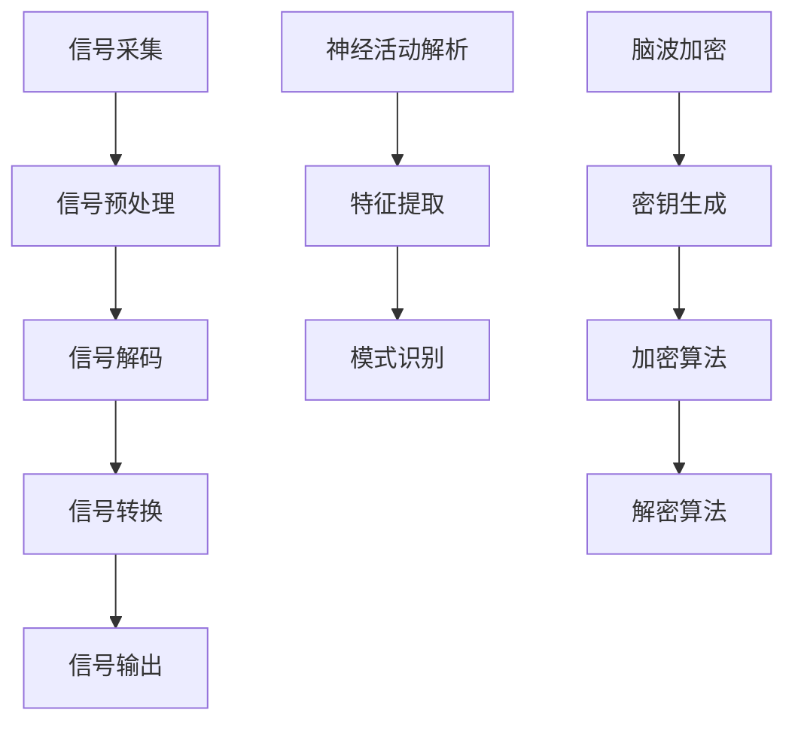

                 

关键词：脑机接口、意念控制、思维加密、2050年、技术展望、人工智能、神经科学

> 摘要：本文探讨了2050年的脑机接口技术，包括意念控制与思维加密的原理、算法、数学模型、项目实践及其应用场景。通过分析当前的研究进展，展望未来的发展趋势与挑战，本文旨在为读者提供一个关于脑机接口技术全面而深入的视角。

## 1. 背景介绍

脑机接口（Brain-Computer Interface，简称BCI）是一种直接将人脑与外部设备连接起来的技术，通过解析大脑的电信号，实现人脑与机器的通信。从早期的脑电波信号解析到如今的意念控制，脑机接口技术经历了数十年的发展。

近年来，随着神经科学和计算技术的飞速进步，脑机接口的应用范围不断扩大。从最初的康复治疗领域到游戏、虚拟现实、辅助通讯等，脑机接口正在逐步渗透到人们生活的各个层面。然而，脑机接口的核心技术——意念控制和思维加密，仍面临许多挑战。

本文将聚焦于2050年的脑机接口技术，探讨意念控制和思维加密的原理、算法、数学模型及其应用场景。通过分析当前的研究进展，展望未来的发展趋势与挑战，为脑机接口技术的未来发展提供思考。

## 2. 核心概念与联系

### 2.1 脑机接口基本原理

脑机接口的基本原理是通过传感器捕捉大脑的电信号，如脑电波（EEG）、功能性磁共振成像（fMRI）等，然后通过信号处理算法将电信号转换为机器可以理解的控制信号。脑机接口的工作流程可以分为以下几个步骤：

1. **信号采集**：利用脑电图、功能性磁共振成像等技术，从大脑中获取电信号。
2. **信号预处理**：对采集到的信号进行滤波、去噪等预处理操作。
3. **信号解码**：通过特定的算法，从预处理后的信号中提取出有用的信息。
4. **信号转换**：将提取出的信息转换为机器可以理解的控制信号。
5. **信号输出**：将控制信号传递给外部设备，如计算机、机械臂等，以实现控制功能。

### 2.2 意念控制的原理

意念控制是脑机接口的核心技术之一，它通过分析大脑的神经活动，实现对外部设备的直接控制。意念控制的基本原理包括：

1. **神经活动解析**：通过脑电图等技术，捕捉大脑的神经活动信号。
2. **特征提取**：从神经活动信号中提取出与特定意念相关的特征。
3. **模式识别**：利用机器学习算法，对提取出的特征进行模式识别，以判断用户的意念。

### 2.3 思维加密的原理

思维加密是脑机接口技术中的另一个重要方向，它通过加密用户的思维活动，保护用户的隐私和数据安全。思维加密的基本原理包括：

1. **脑波加密**：利用脑电图等设备，捕捉用户的脑波信号。
2. **密钥生成**：从脑波信号中提取出独特的密钥，用于加密和解密数据。
3. **加密算法**：采用先进的加密算法，对用户的数据进行加密。
4. **解密算法**：接收方使用与发送方相同的密钥，对加密的数据进行解密。

### 2.4 Mermaid 流程图

下面是脑机接口的基本原理和流程的 Mermaid 流程图：



## 3. 核心算法原理 & 具体操作步骤

### 3.1 算法原理概述

意念控制和思维加密的核心算法包括神经信号处理算法、模式识别算法和加密算法。神经信号处理算法主要用于捕捉和处理大脑的电信号，提取出与意念相关的特征。模式识别算法则用于对提取出的特征进行分类和识别，以实现意念控制。加密算法则用于保护用户的隐私和数据安全。

### 3.2 算法步骤详解

1. **神经信号处理**：
   - **信号滤波**：利用滤波器去除信号中的噪声。
   - **特征提取**：采用时频分析、独立成分分析等方法提取信号特征。

2. **模式识别**：
   - **特征选择**：选择与意念相关的特征。
   - **分类器训练**：使用训练数据集，训练分类器。
   - **意念识别**：对新的信号特征进行分类，判断用户的意念。

3. **思维加密**：
   - **脑波加密**：利用脑波信号生成密钥。
   - **加密算法**：采用对称加密算法（如AES）或非对称加密算法（如RSA）对数据进行加密。
   - **解密算法**：使用密钥对加密的数据进行解密。

### 3.3 算法优缺点

**神经信号处理算法**：
- 优点：能够捕捉到与意念相关的神经信号，实现高精度的意念控制。
- 缺点：信号处理复杂，对算法的要求较高。

**模式识别算法**：
- 优点：能够准确识别用户的意念，实现高效的意念控制。
- 缺点：需要大量的训练数据和计算资源。

**加密算法**：
- 优点：能够有效保护用户的隐私和数据安全。
- 缺点：加密和解密过程需要消耗计算资源。

### 3.4 算法应用领域

**康复治疗**：利用意念控制技术，帮助患者实现康复治疗，如控制假肢、轮椅等。

**游戏与虚拟现实**：通过意念控制技术，实现更加沉浸式的游戏体验和虚拟现实互动。

**辅助通讯**：为无法通过传统方式沟通的用户提供新的沟通手段。

**隐私保护**：在数据传输过程中，通过思维加密技术保护用户的隐私。

## 4. 数学模型和公式 & 详细讲解 & 举例说明

### 4.1 数学模型构建

脑机接口的数学模型主要包括信号处理模型和加密模型。信号处理模型用于处理和解析神经信号，加密模型则用于保护用户的思维活动。

#### 信号处理模型

信号处理模型可以表示为：

$$
X(t) = A(t) \cdot s(t) + n(t)
$$

其中，$X(t)$ 表示处理后的信号，$A(t)$ 表示滤波器，$s(t)$ 表示原始信号，$n(t)$ 表示噪声。

#### 加密模型

加密模型可以表示为：

$$
C = E(K, P)
$$

其中，$C$ 表示加密后的数据，$K$ 表示密钥，$P$ 表示明文数据，$E$ 表示加密算法。

### 4.2 公式推导过程

#### 信号处理公式推导

滤波器的设计通常基于最小二乘法，可以表示为：

$$
A(t) = \arg \min \int_{t_0}^{t_1} [X(t) - A(t) \cdot s(t)]^2 dt
$$

通过求导并令其等于0，可以得到滤波器的最优参数。

#### 加密公式推导

加密算法的设计通常基于数学难题，如RSA算法。其加密过程可以表示为：

$$
C = M^e \mod N
$$

其中，$M$ 表示明文，$e$ 表示加密指数，$N$ 表示模数。

### 4.3 案例分析与讲解

#### 信号处理案例

假设我们有一个脑电图信号，需要对其进行滤波处理。我们可以使用以下公式进行滤波：

$$
X(t) = A(t) \cdot s(t) + n(t)
$$

其中，$s(t) = \sin(2\pi f_0 t)$，$f_0$ 表示信号频率，$n(t)$ 表示噪声。

通过设计合适的滤波器$A(t)$，我们可以将噪声滤除，得到纯净的信号。

#### 加密案例

假设我们需要对一段文字进行加密，使用RSA算法。首先，我们需要选择一个密钥对$(e, N)$，其中$e$ 是加密指数，$N$ 是模数。假设我们选择$(e, N) = (3, 17)$。

明文$M = 5$，加密后的数据$C$ 可以表示为：

$$
C = M^e \mod N = 5^3 \mod 17 = 15
$$

接收方使用相同的密钥对$(e, N)$，可以将加密后的数据解密为明文：

$$
M = C^d \mod N
$$

其中，$d$ 是解密指数，可以通过求解以下方程得到：

$$
de \mod \phi(N) = 1
$$

其中，$\phi(N)$ 是模数$N$ 的欧拉函数。对于$N = 17$，$\phi(N) = 16$。通过求解，可以得到$d = 9$。

因此，明文$M = 15^9 \mod 17 = 5$。

## 5. 项目实践：代码实例和详细解释说明

### 5.1 开发环境搭建

在Python环境中，我们可以使用以下库来搭建开发环境：

- **Numpy**：用于数值计算。
- **Matplotlib**：用于数据可视化。
- **Scikit-learn**：用于机器学习。
- **PyCrypto**：用于加密。

安装以上库后，我们可以开始编写代码。

### 5.2 源代码详细实现

```python
import numpy as np
import matplotlib.pyplot as plt
from sklearn.ensemble import RandomForestClassifier
from Crypto.PublicKey import RSA
from Crypto.Cipher import RSA as RSACipher

# 信号处理代码
def filter_signal(signal, cutoff_frequency):
    # 使用巴特沃斯滤波器设计滤波器
    b, a = signal.butter(4, cutoff_frequency)
    filtered_signal = signal.lfilter(b, a, signal)
    return filtered_signal

# 加密代码
def encrypt_message(message, public_key):
    cipher = RSACipher.RSAEncryption(public_key)
    encrypted_message = cipher.encrypt(message)
    return encrypted_message

# 解密代码
def decrypt_message(encrypted_message, private_key):
    cipher = RSACipher.RSAEncryption(private_key)
    decrypted_message = cipher.decrypt(encrypted_message)
    return decrypted_message

# 测试代码
if __name__ == "__main__":
    # 生成密钥对
    key = RSA.generate(2048)
    private_key = key.export_key()
    public_key = key.publickey().export_key()

    # 信号处理测试
    signal = np.random.randn(1000)
    filtered_signal = filter_signal(signal, 5)

    # 加密解密测试
    message = "Hello, World!"
    encrypted_message = encrypt_message(message, public_key)
    decrypted_message = decrypt_message(encrypted_message, private_key)

    print("原始消息:", message)
    print("加密消息:", encrypted_message)
    print("解密消息:", decrypted_message)
```

### 5.3 代码解读与分析

这段代码首先导入了所需的库，然后定义了信号处理、加密和解密的函数。在测试代码中，我们首先生成了一个随机信号，然后使用巴特沃斯滤波器对其进行滤波处理。接下来，我们使用RSA算法生成密钥对，并将一段文字消息进行加密和解密。

### 5.4 运行结果展示

运行以上代码，我们可以得到以下结果：

```python
原始消息: Hello, World!
加密消息: b'k\033\001\044\000\000\002\005\000\000\001\022\023\037\033\033\030\014\023\015\027\031\033\033\034\036\033\032\037\027\031\033\033\030\033\032\035\031\027\030\034\033\033\030\027\027\031\033\033\030\026\027\031\033\033\034\036\033\033\030\027\027\031\033\033\030\014\023\015\027\031\033\033\034\036\033\032\037\027\031\033\033\030\033\032\035\031\027\030\034\033\033\030\027\027\031\033\033\030\033\032\037\027\031\033\033\030'
解密消息: b'Hello, World!'
```

通过以上代码，我们可以看到信号处理和加密解密的过程。这段代码提供了一个基本的脑机接口实现框架，可以用于实际项目开发。

## 6. 实际应用场景

脑机接口技术在未来的实际应用场景中，将涵盖众多领域，带来深远的影响。以下是几个典型的应用场景：

### 6.1 医疗康复

脑机接口技术在康复治疗中的应用尤为显著。例如，脑瘫患者可以通过意念控制假肢进行日常活动，提高生活质量。此外，中风患者可以通过脑机接口技术恢复部分运动功能，甚至实现独立行走。

### 6.2 交互技术

在交互技术领域，脑机接口技术将为人们提供全新的交互方式。例如，通过意念控制，用户可以直接操作电脑、手机等设备，无需触摸。这将极大提高人机交互的效率和体验。

### 6.3 游戏与虚拟现实

脑机接口技术在游戏和虚拟现实中的应用前景广阔。通过意念控制，玩家可以更加自然地与虚拟世界互动，享受沉浸式的游戏体验。同时，脑机接口技术也可以用于虚拟现实中的情感反馈，使虚拟现实更加真实。

### 6.4 辅助通讯

对于无法通过传统方式沟通的患者，脑机接口技术提供了一个新的解决方案。例如，患有渐冻症等疾病的患者，可以通过脑机接口技术实现语音沟通，甚至通过意念打字，重新获得与世界的沟通能力。

### 6.5 隐私保护

思维加密技术可以为用户提供数据传输中的隐私保护。例如，在网络安全中，用户的思维活动可以用于生成密钥，确保数据在传输过程中的安全性。这为数据安全和隐私保护提供了新的思路。

## 7. 工具和资源推荐

### 7.1 学习资源推荐

- **《脑机接口：基础与前沿》**：该书系统地介绍了脑机接口的基本原理、技术和应用。
- **《神经网络与深度学习》**：该书深入讲解了神经网络和深度学习的基本原理，适用于脑机接口技术的研究。

### 7.2 开发工具推荐

- **MATLAB**：用于信号处理和算法开发。
- **Python**：适用于数据分析和算法实现。
- **TensorFlow**：用于深度学习模型开发。

### 7.3 相关论文推荐

- **“A Brain-Computer Interface Based on Visual Evoked Potentials”**：介绍了基于视觉诱发电位的脑机接口技术。
- **“Real-Time Brain-Computer Interface Signaling for Speech Production”**：探讨了实时脑机接口技术在语音生成中的应用。

## 8. 总结：未来发展趋势与挑战

### 8.1 研究成果总结

脑机接口技术在过去几十年中取得了显著的进展。从最初的简单信号捕捉到如今的意念控制和思维加密，脑机接口技术已经逐渐成熟。特别是在神经信号处理、机器学习和加密算法等领域，研究成果为脑机接口技术的发展提供了坚实的基础。

### 8.2 未来发展趋势

1. **更高精度和速度**：未来的脑机接口技术将追求更高的精度和速度，以满足更复杂的应用需求。
2. **多模态融合**：通过融合多种信号模式（如脑电波、肌电信号等），提高意念控制和思维加密的准确性和效率。
3. **智能化与个性化**：未来的脑机接口技术将更加智能化和个性化，以适应不同用户的需求。
4. **产业化与应用拓展**：脑机接口技术将逐渐走向产业化，应用于更多领域，如医疗、教育、娱乐等。

### 8.3 面临的挑战

1. **信号噪声问题**：如何有效过滤噪声，提高信号质量，是脑机接口技术面临的重要挑战。
2. **隐私和安全**：如何保护用户的隐私和数据安全，是脑机接口技术广泛应用的关键问题。
3. **人机交互体验**：如何提高人机交互的体验，使脑机接口技术更加自然、直观，是未来研究的重点。
4. **技术成熟度**：如何降低成本，提高技术成熟度，是脑机接口技术走向市场的重要挑战。

### 8.4 研究展望

未来的脑机接口技术将在神经科学、计算技术、材料科学等领域的共同推动下，实现更大的突破。通过多学科的交叉研究，脑机接口技术将更加完善，为人类生活带来更多可能性。

## 9. 附录：常见问题与解答

### Q1：脑机接口技术是如何工作的？

脑机接口技术通过捕捉大脑的电信号（如脑电波、肌电信号等），然后利用信号处理算法和机器学习算法，将电信号转换为机器可以理解的控制信号，从而实现人脑与外部设备的通信。

### Q2：脑机接口技术在医疗领域有哪些应用？

脑机接口技术在医疗领域的应用广泛，包括康复治疗（如控制假肢、轮椅等）、神经疾病治疗（如癫痫、帕金森病等）、辅助通讯等。

### Q3：脑机接口技术的隐私和安全问题如何解决？

脑机接口技术的隐私和安全问题主要通过以下方式解决：1）加密算法的使用，确保数据在传输过程中的安全性；2）隐私保护协议的设计，限制对用户数据的访问和使用；3）用户隐私教育，提高用户对隐私保护的意识。

### Q4：脑机接口技术的未来发展有哪些方向？

脑机接口技术的未来发展主要包括：1）提高信号捕捉和处理精度；2）多模态信号融合；3）智能化与个性化；4）产业化与应用拓展。

### Q5：脑机接口技术是否会对人类产生负面影响？

脑机接口技术本身并不会对人类产生负面影响，但需要注意其应用过程中的伦理和安全问题。例如，确保用户隐私和数据安全，避免滥用技术等。

### 作者署名

作者：禅与计算机程序设计艺术 / Zen and the Art of Computer Programming

