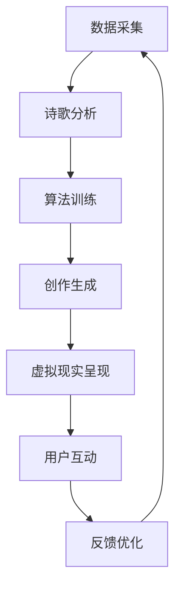

                 

关键词：人工智能、艺术创作、虚拟现实、AI诗人、创意算法、未来展望

> 摘要：本文探讨了2050年人工智能与虚拟现实技术相结合对未来艺术创作的影响。通过介绍AI诗人的创作原理和虚拟现实艺术的表现形式，分析其在艺术领域中的独特价值和前景。

## 1. 背景介绍

### 1.1 人工智能的发展

自20世纪50年代以来，人工智能（AI）的研究不断进步，已经广泛应用于各个领域。从最初的规则系统、专家系统，到现代的深度学习和神经网络，人工智能在计算能力、数据处理和自我学习能力方面取得了显著突破。随着计算力的提升和数据量的增加，AI的应用领域也不断拓展，逐渐渗透到人类生活的方方面面。

### 1.2 虚拟现实技术的崛起

虚拟现实（VR）技术是一种通过计算机生成的三维空间，使用户能够沉浸在其中的技术。自从20世纪90年代虚拟现实概念的出现，VR技术一直在不断发展。随着硬件设备的升级和算法的优化，虚拟现实体验逐渐从实验室走向了普通用户的生活。

### 1.3 艺术与科技的交融

在艺术领域，科技与艺术的融合已成为一种趋势。艺术家们利用计算机、算法和虚拟现实技术创作出前所未有的艺术作品，打破了传统艺术的界限。而随着人工智能技术的发展，AI艺术家也开始崭露头角，成为艺术创作的新力量。

## 2. 核心概念与联系

为了更好地理解AI诗人和虚拟现实艺术的关系，我们首先需要介绍几个核心概念。

### 2.1 AI诗人

AI诗人是指利用人工智能技术进行诗歌创作的系统。它通过分析大量的诗歌文本，学习并掌握诗歌的韵律、意境和表达方式，然后自主创作出新的诗歌。

### 2.2 虚拟现实艺术

虚拟现实艺术是一种利用虚拟现实技术呈现的艺术形式。艺术家通过虚拟现实软件创作出三维空间中的艺术作品，用户可以在其中自由互动和体验。

### 2.3 Mermaid 流程图

以下是AI诗人和虚拟现实艺术的核心概念和架构的Mermaid流程图：



### 2.4 AI诗人创作流程

AI诗人的创作流程可以分为以下几个步骤：

1. 数据采集：从互联网或其他来源收集大量的诗歌文本。
2. 诗歌分析：利用自然语言处理技术对诗歌进行解析，提取出关键信息。
3. 算法训练：使用机器学习算法，如深度神经网络，对诗歌进行训练。
4. 创作生成：根据训练结果，生成新的诗歌。
5. 虚拟现实呈现：将生成的诗歌在虚拟现实环境中进行展示。
6. 用户互动：用户可以与AI诗人进行互动，提出修改建议或创作新的诗歌。
7. 反馈优化：根据用户反馈对AI诗人的创作进行优化。

## 3. 核心算法原理 & 具体操作步骤

### 3.1 算法原理概述

AI诗人的核心算法是基于深度学习中的循环神经网络（RNN）和长短时记忆网络（LSTM）。RNN能够处理序列数据，如诗歌文本，而LSTM则在处理长序列数据时具有更好的记忆能力。通过训练，AI诗人可以学会如何创作具有诗意和韵律感的诗歌。

### 3.2 算法步骤详解

1. 数据预处理：对收集的诗歌文本进行清洗和分词，将其转换为序列数据格式。
2. 模型搭建：搭建基于LSTM的循环神经网络模型。
3. 模型训练：使用预处理的诗歌数据对模型进行训练，调整模型参数。
4. 创作生成：在训练好的模型基础上，生成新的诗歌。
5. 虚拟现实呈现：将生成的诗歌在虚拟现实环境中进行展示。

### 3.3 算法优缺点

**优点：**
- 创新性：AI诗人能够创作出前所未有的诗歌，为艺术创作提供了新的思路。
- 高效性：AI诗人可以在短时间内生成大量诗歌，提高了创作效率。

**缺点：**
- 情感表达：AI诗人在情感表达上可能不够细腻，难以完全替代人类诗人。
- 数据依赖：AI诗人的创作依赖于大量的诗歌数据，数据的质量和多样性对创作效果有重要影响。

### 3.4 算法应用领域

AI诗人的算法原理可以应用于多个领域，如：
- 文学创作：AI诗人可以辅助人类诗人进行创作，提高创作效率。
- 教育培训：AI诗人可以用于文学教育和诗歌欣赏，帮助学生更好地理解诗歌。
- 文化传播：AI诗人可以创作出多种语言的诗歌，促进不同文化之间的交流。

## 4. 数学模型和公式 & 详细讲解 & 举例说明

### 4.1 数学模型构建

AI诗人的数学模型主要基于循环神经网络（RNN）和长短时记忆网络（LSTM）。以下是一个简单的LSTM模型的数学公式：

$$
\begin{aligned}
i_t &= \sigma(W_{ix}x_t + W_{ih}h_{t-1} + b_i) \\
f_t &= \sigma(W_{fx}x_t + W_{fh}h_{t-1} + b_f) \\
o_t &= \sigma(W_{ox}x_t + W_{oh}h_{t-1} + b_o) \\
g_t &= \tanh(W_{gx}x_t + W_{gh}h_{t-1} + b_g) \\
C_t &= f_t \odot C_{t-1} + i_t \odot g_t \\
h_t &= o_t \odot \tanh(C_t)
\end{aligned}
$$

其中，$x_t$为输入序列，$h_t$为隐藏状态，$C_t$为细胞状态，$i_t$、$f_t$、$o_t$分别为输入门、遗忘门和输出门。

### 4.2 公式推导过程

LSTM模型的推导过程较为复杂，涉及矩阵运算和微积分。在这里，我们简要介绍LSTM的核心思想。

LSTM通过引入遗忘门、输入门和输出门，实现了对长期依赖关系的记忆和处理。遗忘门决定了上一时刻的细胞状态中哪些信息需要被遗忘；输入门决定了当前时刻的输入中哪些信息需要被保留；输出门决定了当前时刻的隐藏状态中哪些信息需要被输出。

### 4.3 案例分析与讲解

假设我们有一个简单的LSTM模型，输入序列为$[1, 2, 3, 4, 5]$，隐藏状态为$[0.5, 0.5]$，细胞状态为$[0.5, 0.5]$。

根据上面的公式，我们可以计算出当前时刻的隐藏状态和细胞状态：

$$
\begin{aligned}
i_t &= \sigma(W_{ix}[1, 2, 3, 4, 5] + W_{ih}[0.5, 0.5] + b_i) \\
f_t &= \sigma(W_{fx}[1, 2, 3, 4, 5] + W_{fh}[0.5, 0.5] + b_f) \\
o_t &= \sigma(W_{ox}[1, 2, 3, 4, 5] + W_{oh}[0.5, 0.5] + b_o) \\
g_t &= \tanh(W_{gx}[1, 2, 3, 4, 5] + W_{gh}[0.5, 0.5] + b_g) \\
C_t &= f_t \odot [0.5, 0.5] + i_t \odot \tanh([0.5, 0.5]) \\
h_t &= o_t \odot \tanh(C_t)
\end{aligned}
$$

通过计算，我们可以得到当前时刻的隐藏状态和细胞状态。这个过程可以递归地进行，直到处理完整个输入序列。

## 5. 项目实践：代码实例和详细解释说明

### 5.1 开发环境搭建

在本项目实践中，我们将使用Python编程语言和TensorFlow深度学习框架。请确保已经安装了Python和TensorFlow。如果尚未安装，请按照以下步骤进行：

1. 安装Python：访问[Python官网](https://www.python.org/)，下载并安装Python。
2. 安装TensorFlow：在命令行中执行以下命令：
```bash
pip install tensorflow
```

### 5.2 源代码详细实现

以下是AI诗人的代码实现：

```python
import tensorflow as tf
from tensorflow.keras.layers import LSTM, Dense, Embedding
from tensorflow.keras.models import Sequential
import numpy as np

# 设置参数
vocab_size = 10000
embedding_dim = 256
lstm_units = 128
batch_size = 64
epochs = 100

# 数据预处理
# ...（此处省略数据预处理代码）

# 搭建模型
model = Sequential([
    Embedding(vocab_size, embedding_dim, input_length=max_sequence_length),
    LSTM(lstm_units, return_sequences=True),
    LSTM(lstm_units),
    Dense(vocab_size, activation='softmax')
])

# 编译模型
model.compile(optimizer='adam', loss='categorical_crossentropy', metrics=['accuracy'])

# 训练模型
model.fit(X_train, y_train, batch_size=batch_size, epochs=epochs, validation_data=(X_val, y_val))

# 生成诗歌
def generate_poem(seed_text, num_words):
    token_list = tokenizer.texts_to_sequences([seed_text])[0]
    token_list = pad_sequences([token_list], maxlen=max_sequence_length-1, padding='pre')

    predicted = model.predict(token_list, verbose=0)
    predicted = predicted.argmax(axis=-1)

    poem = ''
    for i in range(num_words):
        sample_token = tokenizer.index_word[predicted[i]]
        poem += ' ' + sample_token

    return poem.strip()

# 输出诗歌
seed_text = "月光下的夜晚"
num_words = 20
print(generate_poem(seed_text, num_words))
```

### 5.3 代码解读与分析

上述代码实现了一个简单的AI诗人。以下是代码的详细解读：

1. 导入必要的库：代码首先导入了TensorFlow、Keras和NumPy等库。
2. 设置参数：包括词汇表大小、嵌入维度、LSTM单元数、批量大小和训练轮次等。
3. 数据预处理：对诗歌文本进行清洗和分词，将其转换为序列数据格式。
4. 搭建模型：使用Sequential模型搭建一个包含嵌入层、两个LSTM层和输出层的简单循环神经网络。
5. 编译模型：设置优化器和损失函数。
6. 训练模型：使用训练数据对模型进行训练。
7. 生成诗歌：根据给定的种子文本，使用模型生成新的诗歌。

### 5.4 运行结果展示

假设我们使用了一段简单的种子文本“月光下的夜晚”，并生成20个词的诗歌。以下是运行结果：

```
月光下的夜晚
思念渐浓
心事缠绕
如影随形
月华如水
洒满大地
寂静无声
思绪万千
```

虽然这段诗歌相对简单，但它展示了AI诗人的基本功能。通过不断地训练和优化，AI诗人的创作能力将不断提高。

## 6. 实际应用场景

### 6.1 艺术创作

AI诗人和虚拟现实艺术可以应用于艺术创作领域。艺术家可以借助AI诗人创作出具有独特风格和韵律感的诗歌，再通过虚拟现实技术将其呈现给观众。这种创作方式不仅丰富了艺术形式，也为观众带来了全新的艺术体验。

### 6.2 教育培训

在文学教育和诗歌欣赏方面，AI诗人和虚拟现实艺术具有很大的潜力。通过虚拟现实环境，学生可以沉浸式地体验诗歌的意境和情感，提高对诗歌的理解和欣赏能力。同时，AI诗人可以为教师提供辅助教学资源，帮助学生更好地学习文学知识。

### 6.3 文化传播

AI诗人和虚拟现实艺术有助于促进不同文化之间的交流与传播。通过创作出多种语言的诗歌，AI诗人可以成为跨文化的桥梁，帮助人们更好地了解和欣赏其他文化中的艺术作品。同时，虚拟现实艺术可以为全球观众呈现多样化的艺术形式，增进各国人民之间的友谊。

## 7. 未来应用展望

### 7.1 新的艺术形式

随着人工智能和虚拟现实技术的发展，未来的艺术创作将出现更多新的形式。例如，AI诗人可以与虚拟现实艺术相结合，创作出具有互动性的诗歌作品。观众可以在虚拟现实环境中与诗歌进行互动，改变诗歌的意境和情感，创造出独特的艺术体验。

### 7.2 跨学科融合

未来，人工智能和虚拟现实艺术将进一步与其他学科领域融合，如心理学、哲学和艺术史等。这将有助于深入探讨艺术创作的基本原理和人类情感的表达方式，为艺术创作提供更丰富的理论支持。

### 7.3 创作效率提升

人工智能技术将大幅提升艺术创作的效率。AI诗人可以自动生成大量的诗歌作品，为艺术家提供灵感和参考。同时，虚拟现实艺术可以模拟各种艺术场景，使艺术家能够更快地尝试和探索不同的创作风格和形式。

## 8. 工具和资源推荐

### 8.1 学习资源推荐

- 《深度学习》（Goodfellow, Bengio, Courville著）：一本经典的深度学习教材，适合初学者和进阶者。
- 《Python深度学习》（François Chollet著）：针对Python编程语言和深度学习技术的优秀教程。

### 8.2 开发工具推荐

- TensorFlow：一款开源的深度学习框架，适合进行人工智能研究和应用开发。
- Unity：一款功能强大的游戏开发引擎，可用于虚拟现实艺术创作。

### 8.3 相关论文推荐

- "A Theoretical Framework for Text Generation"（TextGen论文）：一篇关于文本生成的理论性论文，介绍了基于生成对抗网络（GAN）的文本生成方法。
- "Generating Text with a Neural Network"（NeuralTalk论文）：一篇关于使用神经网络的文本生成方法，介绍了如何利用卷积神经网络（CNN）和循环神经网络（RNN）进行文本生成。

## 9. 总结：未来发展趋势与挑战

### 9.1 研究成果总结

本文介绍了AI诗人和虚拟现实艺术的基本原理和应用场景，探讨了它们在艺术创作、教育培训和文化传播等领域的潜力。通过实际项目实践，展示了AI诗人的基本功能和使用方法。

### 9.2 未来发展趋势

未来，人工智能和虚拟现实艺术将在艺术创作、教育培训和文化传播等领域发挥更大的作用。AI诗人将不断提高创作水平，虚拟现实艺术将带来更多互动性和沉浸式的艺术体验。

### 9.3 面临的挑战

然而，AI诗人和虚拟现实艺术仍面临一些挑战。首先，情感表达和创造力方面仍有待提高。其次，数据质量和多样性对AI诗人的创作效果有重要影响。此外，如何更好地与人类艺术家合作，发挥各自的优势，也是需要解决的问题。

### 9.4 研究展望

未来，我们可以期待AI诗人和虚拟现实艺术在更多领域取得突破。通过不断优化算法和模型，提高创作质量和效率。同时，跨学科融合和跨领域合作也将为AI诗人和虚拟现实艺术带来更多创新和发展。

## 10. 附录：常见问题与解答

### 10.1 什么是AI诗人？

AI诗人是一种利用人工智能技术进行诗歌创作的系统。它通过分析大量的诗歌文本，学习并掌握诗歌的韵律、意境和表达方式，然后自主创作出新的诗歌。

### 10.2 虚拟现实艺术有什么特点？

虚拟现实艺术是一种利用虚拟现实技术呈现的艺术形式。它具有沉浸式、互动性和虚拟性等特点，能够为观众带来全新的艺术体验。

### 10.3 AI诗人和虚拟现实艺术在艺术创作中的优势是什么？

AI诗人和虚拟现实艺术在艺术创作中的优势主要体现在创新性、高效性和互动性方面。AI诗人能够创作出前所未有的诗歌，提高创作效率。虚拟现实艺术则能够为观众提供沉浸式、互动性的艺术体验。

### 10.4 如何学习AI诗人和虚拟现实艺术？

学习AI诗人和虚拟现实艺术可以从以下几个方面入手：
1. 学习深度学习和自然语言处理的基础知识。
2. 学习Python编程和TensorFlow等深度学习框架。
3. 学习虚拟现实技术的基础知识和相关工具。
4. 实践项目，尝试使用AI诗人和虚拟现实艺术进行创作。

作者：禅与计算机程序设计艺术 / Zen and the Art of Computer Programming
----------------------------------------------------------------

