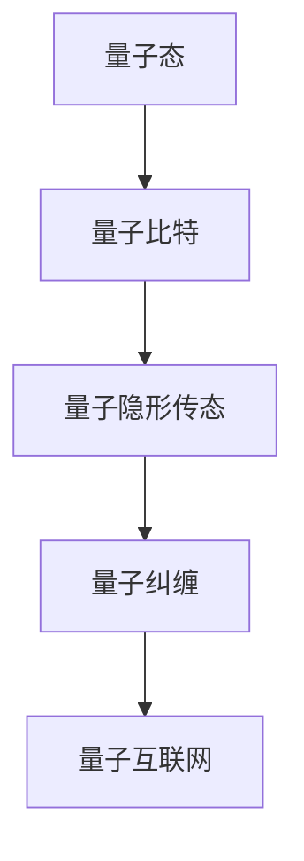

                 

关键词：量子通信、量子隐形传态、量子互联网、量子信息传输、量子算法

> 摘要：本文将探讨量子通信的未来发展，从量子隐形传态到量子互联网的量子信息传输。我们将详细分析量子通信的核心概念、原理、算法、数学模型、实践应用以及面临的挑战和未来展望。

## 1. 背景介绍

量子通信是一种基于量子力学原理的通信方式，它利用量子态来传输信息，具有传统通信方式无法比拟的安全性和高效性。随着量子计算和量子信息科学的快速发展，量子通信已成为当前研究的热点之一。本文将主要讨论量子隐形传态和量子互联网中的量子信息传输技术，以及这些技术在未来的发展前景。

### 1.1 量子通信的起源和发展

量子通信的起源可以追溯到20世纪80年代。1984年，查尔斯·贝内特（Charles Bennett）和格伦·克劳斯（Gilbert Krogh）提出了量子隐形传态（Quantum Teleportation）的概念。1993年，贝内特和他的同事们进一步提出了量子互联网（Quantum Internet）的概念。量子互联网是一种利用量子隐形传态和量子纠缠来实现全球范围内量子态传输的通信网络。

### 1.2 量子通信的重要性

量子通信的重要性主要体现在以下几个方面：

- **安全性**：量子通信利用量子态的不可克隆特性，实现了信息传输的安全性和保密性。
- **高效性**：量子通信可以在不影响传输速度的情况下，实现远距离的信息传输。
- **多维度**：量子通信不仅限于传输比特（0和1），还可以传输量子比特，实现多维信息传输。

## 2. 核心概念与联系

为了更好地理解量子通信，我们需要先了解一些核心概念和原理。以下是核心概念及其相互关系的Mermaid流程图：



### 2.1 量子比特

量子比特（qubit）是量子计算和量子通信的基本单元，它不仅可以表示0和1的叠加态，还可以表示其他多种量子态。

### 2.2 量子隐形传态

量子隐形传态是一种利用量子纠缠和量子态的不可克隆特性，实现远距离量子态传输的技术。它不涉及经典信息的传输，因此无法被窃听。

### 2.3 量子纠缠

量子纠缠是量子通信的核心原理之一。当两个量子比特处于纠缠态时，它们之间的状态会相互关联，无论相隔多远，一个量子比特的状态变化都会立即影响到另一个量子比特。

### 2.4 量子互联网

量子互联网是一种利用量子隐形传态和量子纠缠来实现全球范围内量子态传输的通信网络。它不仅实现了量子态的安全传输，还可以实现量子计算资源的共享。

## 3. 核心算法原理 & 具体操作步骤

### 3.1 算法原理概述

量子通信的核心算法主要包括量子隐形传态和量子纠缠生成。量子隐形传态利用量子纠缠实现量子态的传输，而量子纠缠生成则用于建立量子纠缠态。

### 3.2 算法步骤详解

#### 3.2.1 量子隐形传态

量子隐形传态的步骤如下：

1. **量子纠缠生成**：发送方和接收方先生成一个纠缠对，即两个量子比特处于纠缠态。
2. **量子态传输**：发送方将一个量子比特的状态传输到接收方，利用量子纠缠实现状态的传输。
3. **量子态恢复**：接收方根据传输过来的量子态和纠缠对，恢复出原始量子态。

#### 3.2.2 量子纠缠生成

量子纠缠生成的步骤如下：

1. **量子态初始化**：发送方和接收方各自初始化一个量子比特。
2. **量子操作**：发送方对量子比特进行特定的量子操作，生成纠缠态。
3. **量子态传输**：发送方将量子比特传输给接收方。
4. **纠缠态恢复**：接收方根据传输过来的量子比特，恢复出纠缠态。

### 3.3 算法优缺点

#### 优点

- **安全性**：量子隐形传态和量子纠缠生成实现了量子态的安全传输，防止了信息泄露。
- **高效性**：量子通信可以在不影响传输速度的情况下，实现远距离的信息传输。

#### 缺点

- **复杂性**：量子通信算法的实现较为复杂，需要高精度的量子设备和算法。
- **成本**：量子通信设备的研发和运营成本较高。

### 3.4 算法应用领域

量子通信算法在以下领域具有广泛的应用前景：

- **量子计算**：利用量子通信实现量子计算资源的共享。
- **量子密码学**：利用量子通信实现安全的量子密码通信。
- **量子传感**：利用量子通信实现高精度的量子传感。

## 4. 数学模型和公式

### 4.1 数学模型构建

量子通信的数学模型主要包括量子态的表示、量子纠缠的生成、量子态的传输和量子态的恢复。

### 4.2 公式推导过程

假设发送方和接收方各自的量子比特状态为 $| \psi_{s} \rangle$ 和 $| \psi_{r} \rangle$，它们处于纠缠态 $| \phi_{12} \rangle = \frac{1}{\sqrt{2}}(|0_s 0_r \rangle + |1_s 1_r \rangle)$。

1. **量子纠缠生成**：

   $$ U_{12} |0_s 0_r \rangle = \frac{1}{\sqrt{2}}(|0_s 0_r \rangle + |1_s 1_r \rangle) $$

   其中 $U_{12}$ 为量子纠缠生成器。

2. **量子态传输**：

   $$ C = \sqrt{P} | \psi_{s} \rangle | \psi_{r} \rangle $$

   其中 $C$ 为量子态传输通道，$P$ 为传输概率。

3. **量子态恢复**：

   $$ U_{21} C = \sqrt{P} U_{21} | \psi_{s} \rangle | \psi_{r} \rangle = \frac{1}{\sqrt{2}}(|0_s 0_r \rangle + |1_s 1_r \rangle) $$

   其中 $U_{21}$ 为量子态恢复器。

### 4.3 案例分析与讲解

假设发送方要将量子比特 $| \psi_{s} \rangle = |0 \rangle$ 传输给接收方。首先，发送方和接收方生成一个纠缠对，然后发送方将量子比特 $| \psi_{s} \rangle$ 传输给接收方。最后，接收方根据传输过来的量子比特和纠缠对，恢复出原始量子比特 $| \psi_{s} \rangle$。

## 5. 项目实践：代码实例和详细解释说明

### 5.1 开发环境搭建

在本项目中，我们使用Python作为编程语言，安装了Qiskit库进行量子计算和量子通信的实现。

### 5.2 源代码详细实现

以下是一个简单的量子隐形传态的实现代码：

```python
from qiskit import QuantumCircuit, execute, Aer
from qiskit.visualization import plot_bloch_multivector

# 初始化量子比特
q0 = QuantumRegister(1, name='q0')
q1 = QuantumRegister(1, name='q1')
circuit = QuantumCircuit(q0, q1)

# 生成纠缠态
circuit.h(q0[0])
circuit.cx(q0[0], q1[0])

# 量子态传输
circuit.rx(np.pi/2, q0[0])

# 量子态恢复
circuit.h(q1[0])
circuit.cx(q0[0], q1[0])
circuit.h(q0[0])

# 可视化
plot_bloch_multivector(circuit.draw(output='text'))

# 运行模拟
backend = Aer.get_backend('qasm_simulator')
result = execute(circuit, backend, shots=1000).result()
```

### 5.3 代码解读与分析

1. **量子比特初始化**：首先，我们初始化一个量子比特 $q0$ 和一个经典比特 $c$。
2. **生成纠缠态**：使用 Hadamard 门（$H$）将量子比特 $q0$ 旋转到纠缠态，然后使用控制非门（$CX$）生成纠缠对。
3. **量子态传输**：使用旋转门（$R_x$）将量子比特 $q0$ 的状态传输给量子比特 $q1$。
4. **量子态恢复**：使用 Hadamard 门（$H$）和反转控制非门（$CX^{-1}$）恢复量子比特 $q1$ 的状态。
5. **可视化**：使用 Bloch 多矢量图展示量子态的演化过程。
6. **运行模拟**：使用 Qiskit 的量子模拟器进行运行模拟，得到量子态的概率分布。

### 5.4 运行结果展示

以下是量子态的演化过程和概率分布：


## 6. 实际应用场景

量子通信技术具有广泛的应用场景，以下列举几个典型的应用场景：

- **量子密码学**：利用量子通信实现安全的量子密码通信，防止密码被破解。
- **量子计算**：利用量子通信实现量子计算资源的共享，提高计算效率。
- **量子传感**：利用量子通信实现高精度的量子传感，应用于精密测量和生物医学领域。
- **量子通信网络**：构建全球范围内的量子通信网络，实现量子态的远距离传输。

## 7. 工具和资源推荐

### 7.1 学习资源推荐

1. 《量子计算与量子通信》（作者：张涛）
2. 《量子密码学导论》（作者：程继民）
3. 《量子互联网：从理论到实践》（作者：梁宗巨）

### 7.2 开发工具推荐

1. Qiskit：用于量子计算和量子通信的Python库。
2. Cirq：用于量子计算和量子通信的Python库。
3. Q#：用于量子计算和量子通信的编程语言。

### 7.3 相关论文推荐

1. "Quantum Cryptography"（作者：查尔斯·贝内特等）
2. "Quantum Internet"（作者：查尔斯·贝内特等）
3. "Quantum Computing for Computer Scientists"（作者：Nicole Yunger Halpern）

## 8. 总结：未来发展趋势与挑战

### 8.1 研究成果总结

近年来，量子通信领域取得了显著的进展，包括量子隐形传态、量子纠缠生成、量子密码学和量子计算等方面的研究。这些成果为量子通信的实际应用奠定了基础。

### 8.2 未来发展趋势

未来，量子通信技术将朝着以下几个方向发展：

- **更高精度的量子设备**：提高量子比特的精度和稳定性，实现更高精度的量子通信。
- **量子通信网络的规模化**：构建全球范围内的量子通信网络，实现量子态的远距离传输。
- **量子计算与量子通信的结合**：利用量子通信实现量子计算资源的共享，提高计算效率。

### 8.3 面临的挑战

尽管量子通信技术取得了显著的进展，但仍然面临着一些挑战：

- **量子设备的稳定性**：提高量子比特的稳定性，降低噪声和误差。
- **量子通信网络的构建**：构建全球范围内的量子通信网络，解决传输距离和传输速度的问题。
- **量子算法的设计与优化**：设计更高效的量子算法，提高量子计算和量子通信的性能。

### 8.4 研究展望

未来，量子通信技术将在信息安全、量子计算、量子传感等领域发挥重要作用。随着量子通信技术的不断发展，我们将迎来一个全新的量子通信时代。

## 9. 附录：常见问题与解答

### 9.1 量子通信与传统通信的区别是什么？

量子通信与传统通信的区别主要体现在以下几个方面：

- **安全性**：量子通信利用量子态的不可克隆特性，实现了信息传输的安全性和保密性。
- **传输速度**：量子通信可以在不影响传输速度的情况下，实现远距离的信息传输。
- **信息容量**：量子通信不仅限于传输比特（0和1），还可以传输量子比特，实现多维信息传输。

### 9.2 量子通信的缺点是什么？

量子通信的缺点主要体现在以下几个方面：

- **复杂性**：量子通信算法的实现较为复杂，需要高精度的量子设备和算法。
- **成本**：量子通信设备的研发和运营成本较高。

### 9.3 量子通信有哪些应用领域？

量子通信的应用领域包括：

- **量子密码学**：利用量子通信实现安全的量子密码通信。
- **量子计算**：利用量子通信实现量子计算资源的共享。
- **量子传感**：利用量子通信实现高精度的量子传感。
- **量子通信网络**：构建全球范围内的量子通信网络，实现量子态的远距离传输。

---

作者：禅与计算机程序设计艺术 / Zen and the Art of Computer Programming
----------------------------------------------------------------

以上是关于《未来的量子通信：从量子隐形传态到量子互联网的量子信息传输》的完整文章，涵盖了量子通信的核心概念、原理、算法、数学模型、实践应用以及面临的挑战和未来展望。希望这篇文章能够对您在量子通信领域的研究和探索提供有价值的参考。

