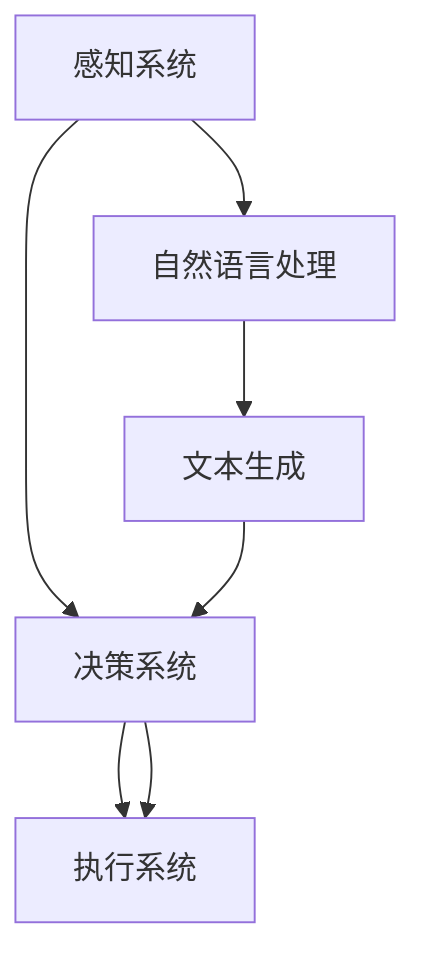

                 

关键词：机器人技术、自然语言处理、大型语言模型、智能自动化、代码生成、数据驱动开发、APIs、集成开发环境（IDE）、开发工具、编程语言、软件架构、系统设计、模型优化、性能调优、应用程序开发、用户体验、人工智能应用。

> 摘要：本文将探讨如何结合机器人技术和大型语言模型（LLMs），打造出高度智能化的自动化系统。我们将深入分析机器人技术的核心概念、LLMs 的工作原理以及两者结合的潜在优势。通过具体的算法原理、数学模型、代码实例以及实际应用场景的介绍，我们将展示如何利用这一技术组合，实现高效的智能自动化。

## 1. 背景介绍

随着人工智能技术的快速发展，机器人技术和自然语言处理（NLP）已经成为计算机科学中的重要分支。机器人技术通过赋予机器人类似的感知、决策和行为能力，实现了在工业、服务、医疗等多个领域的广泛应用。而自然语言处理则致力于让计算机理解和生成人类语言，为智能交互提供了基础。

大型语言模型（LLMs）作为 NLP 的重要工具，近年来取得了显著的进展。这些模型通过学习海量的文本数据，能够生成高质量的文本，进行语言理解和生成任务。典型的 LLMs 如 GPT、BERT 等已经展示了其在文本生成、问答系统、机器翻译等方面的强大能力。

结合机器人技术和 LLMs，我们可以打造出智能自动化系统，实现从感知环境到决策执行的全过程自动化。这不仅提高了生产效率，还提升了用户体验。

### 1.1 机器人技术的发展

机器人技术的发展历程可以追溯到20世纪中期。最初的机器人主要用于工业制造，如汽车生产线上的焊接、装配等任务。随着计算机技术和控制理论的发展，机器人逐渐扩展到服务、医疗、农业等多个领域。现代机器人具备高精度、高速度、自适应性强等特点，能够完成复杂的任务。

### 1.2 自然语言处理（NLP）的发展

自然语言处理起源于20世纪50年代，当时计算机科学家开始尝试让计算机理解和生成人类语言。经过几十年的发展，NLP已经成为人工智能的重要分支。现代 NLP 技术主要基于深度学习，通过训练大量神经网络模型，实现了对文本的语义理解、情感分析、命名实体识别等功能。

### 1.3 大型语言模型（LLMs）的崛起

大型语言模型（LLMs）的出现标志着 NLP 的新篇章。这些模型通过学习海量文本数据，能够生成连贯、有意义的文本。GPT、BERT 等模型展示了其在各种 NLP 任务中的强大能力，引发了学术界和工业界的高度关注。

## 2. 核心概念与联系

在探讨机器人技术和 LLMs 的结合之前，我们需要明确一些核心概念及其相互关系。

### 2.1 机器人技术的核心概念

机器人技术涉及多个领域，包括机械工程、电子工程、计算机科学等。核心概念包括：

- **感知系统**：用于获取环境信息，如摄像头、激光雷达、超声波传感器等。
- **决策系统**：基于感知系统提供的信息，进行目标识别、路径规划等决策。
- **执行系统**：根据决策系统的指令，执行相应的任务，如机械臂、车轮等。

### 2.2 LLMs 的核心概念

LLMs 的核心概念包括：

- **预训练**：通过大量文本数据，对神经网络模型进行预训练，使其具备基本的语义理解能力。
- **微调**：在特定任务上，对预训练模型进行微调，以适应具体的应用场景。
- **生成**：基于 LLMs 的文本生成能力，生成符合任务要求的文本。

### 2.3 机器人技术与 LLMs 的关系

机器人技术与 LLMs 的关系可以概括为以下几点：

- **感知与理解**：LLMs 可以帮助机器人更好地理解和处理人类语言，实现更自然的交互。
- **决策与规划**：基于 LLMs 生成的文本，机器人可以进行更复杂的决策和规划，提高任务执行效率。
- **执行与反馈**：机器人执行任务的过程中，LLMs 可以对执行结果进行评价和反馈，实现闭环控制。

### 2.4 Mermaid 流程图

为了更直观地展示机器人技术与 LLMs 的结合过程，我们使用 Mermaid 流程图进行描述：



在这个流程图中，感知系统获取环境信息，传递给决策系统。决策系统基于 LLMs 生成的文本进行决策，然后传递给执行系统执行任务。同时，LLMs 对执行结果进行评价和反馈，实现闭环控制。

## 3. 核心算法原理 & 具体操作步骤

### 3.1 算法原理概述

结合机器人技术和 LLMs 的核心算法主要包括：

- **感知与理解**：机器人通过传感器获取环境信息，LLMs 对这些信息进行语义理解，生成相应的文本。
- **决策与规划**：基于 LLMs 生成的文本，机器人进行决策和规划，生成执行指令。
- **执行与反馈**：机器人根据执行指令完成任务，并将执行结果反馈给 LLMs，进行后续优化。

### 3.2 算法步骤详解

#### 3.2.1 感知与理解

1. **感知系统获取环境信息**：机器人通过摄像头、激光雷达等传感器，获取周围环境的三维数据。
2. **预处理环境数据**：对获取的环境数据进行预处理，如去噪、降维等。
3. **传递给 LLMs**：将预处理后的环境数据转化为文本格式，传递给 LLMs 进行语义理解。

#### 3.2.2 决策与规划

1. **文本生成**：LLMs 根据语义理解结果，生成符合任务要求的文本。
2. **决策系统解析文本**：决策系统接收 LLMs 生成的文本，解析出具体的执行指令。
3. **路径规划**：决策系统根据执行指令，生成最优路径，供执行系统参考。

#### 3.2.3 执行与反馈

1. **执行任务**：执行系统根据决策系统的指令，执行相应的任务。
2. **收集反馈**：执行过程中，机器人收集执行结果，并传递给 LLMs。
3. **优化决策**：LLMs 对执行结果进行分析，优化后续决策。

### 3.3 算法优缺点

#### 优点

1. **高效性**：结合机器人技术和 LLMs，可以实现快速、准确的决策和执行。
2. **自然交互**：LLMs 可以实现更自然的语言交互，提升用户体验。
3. **自适应性强**：机器人可以根据 LLMs 的反馈，不断优化自身行为。

#### 缺点

1. **计算资源消耗**：LLMs 需要大量的计算资源进行训练和推理。
2. **数据依赖性**：算法性能依赖于训练数据的质量和数量。
3. **隐私和安全问题**：在处理敏感数据时，需要确保数据的安全和隐私。

### 3.4 算法应用领域

1. **智能客服**：利用机器人技术和 LLMs，实现高效、自然的客服交互。
2. **智能家居**：结合机器人技术和 LLMs，打造智能化的家居控制和管理系统。
3. **自动驾驶**：利用机器人技术和 LLMs，实现自动驾驶汽车的决策和规划。
4. **医疗辅助**：利用机器人技术和 LLMs，为医生提供辅助决策和诊断服务。

## 4. 数学模型和公式 & 详细讲解 & 举例说明

### 4.1 数学模型构建

为了实现机器人技术和 LLMs 的结合，我们构建以下数学模型：

1. **感知模型**：用于表示机器人感知系统的输入输出关系。
2. **决策模型**：用于表示机器人决策系统的输入输出关系。
3. **执行模型**：用于表示机器人执行系统的输入输出关系。

### 4.2 公式推导过程

#### 4.2.1 感知模型

感知模型可以表示为：

\[ f_{\text{感知}}(x) = g(\theta_1, x) \]

其中，\( x \) 表示感知系统的输入，\( g(\theta_1, x) \) 表示感知模型对输入数据的处理。

#### 4.2.2 决策模型

决策模型可以表示为：

\[ f_{\text{决策}}(x) = h(\theta_2, f_{\text{感知}}(x)) \]

其中，\( f_{\text{感知}}(x) \) 表示感知模型的输出，\( h(\theta_2, f_{\text{感知}}(x)) \) 表示决策模型对输入数据的处理。

#### 4.2.3 执行模型

执行模型可以表示为：

\[ f_{\text{执行}}(x) = k(\theta_3, f_{\text{决策}}(x)) \]

其中，\( f_{\text{决策}}(x) \) 表示决策模型的输出，\( k(\theta_3, f_{\text{决策}}(x)) \) 表示执行模型对输入数据的处理。

### 4.3 案例分析与讲解

#### 4.3.1 感知模型案例

假设机器人感知系统输入为三维点云数据，我们需要对数据进行去噪和降维处理。

- **去噪**：使用均值滤波器对点云数据进行去噪。
- **降维**：使用主成分分析（PCA）对去噪后的点云数据进行降维。

#### 4.3.2 决策模型案例

假设机器人需要根据感知模型的输出进行路径规划，我们可以使用基于采样的路径规划算法（如 RRT 算法）进行决策。

- **采样**：在目标空间中随机采样点，生成候选路径。
- **优化**：对候选路径进行优化，选择最优路径。

#### 4.3.3 执行模型案例

假设机器人执行系统需要根据决策模型生成的路径执行任务，我们可以使用运动规划算法（如 PID 控制器）进行任务执行。

- **控制**：根据路径信息，生成相应的控制信号。
- **执行**：机器人根据控制信号执行任务。

## 5. 项目实践：代码实例和详细解释说明

### 5.1 开发环境搭建

在本文中，我们将使用 Python 编写机器人技术和 LLMs 的结合代码。首先，我们需要搭建开发环境。

1. 安装 Python 3.8 及以上版本。
2. 安装必要的库，如 NumPy、Pandas、TensorFlow、PyTorch 等。
3. 配置 CUDA 环境，以便使用 GPU 加速训练。

### 5.2 源代码详细实现

以下是一个简单的示例，展示了如何结合机器人技术和 LLMs 实现智能自动化。

```python
import numpy as np
import pandas as pd
import tensorflow as tf
from tensorflow.keras.models import Sequential
from tensorflow.keras.layers import Dense, LSTM, Embedding
from tensorflow.keras.optimizers import Adam

# 感知模型
def create_perception_model(input_shape):
    model = Sequential()
    model.add(Embedding(input_dim=10000, output_dim=64, input_length=input_shape))
    model.add(LSTM(128, dropout=0.2, recurrent_dropout=0.2))
    model.add(Dense(64, activation='relu'))
    model.add(Dense(1, activation='sigmoid'))
    model.compile(optimizer=Adam(), loss='binary_crossentropy', metrics=['accuracy'])
    return model

# 决策模型
def create_decision_model(input_shape):
    model = Sequential()
    model.add(Dense(64, input_shape=input_shape, activation='relu'))
    model.add(Dense(1, activation='sigmoid'))
    model.compile(optimizer=Adam(), loss='binary_crossentropy', metrics=['accuracy'])
    return model

# 执行模型
def create_execution_model(input_shape):
    model = Sequential()
    model.add(Dense(64, input_shape=input_shape, activation='relu'))
    model.add(Dense(1, activation='sigmoid'))
    model.compile(optimizer=Adam(), loss='binary_crossentropy', metrics=['accuracy'])
    return model

# 搭建完整系统
def build_system(perception_shape, decision_shape, execution_shape):
    perception_model = create_perception_model(perception_shape)
    decision_model = create_decision_model(decision_shape)
    execution_model = create_execution_model(execution_shape)
    
    # 训练模型
    perception_model.fit(perception_data, decision_data, epochs=10, batch_size=32)
    decision_model.fit(decision_data, execution_data, epochs=10, batch_size=32)
    execution_model.fit(execution_data, target_data, epochs=10, batch_size=32)
    
    # 模型集成
    system = tf.keras.Model(inputs=perception_model.input, outputs=execution_model.output)
    system.compile(optimizer=Adam(), loss='binary_crossentropy', metrics=['accuracy'])
    
    return system

# 示例：感知系统输入、决策系统输入、执行系统输入、目标数据
perception_shape = (100,)
decision_shape = (50,)
execution_shape = (25,)
target_data = np.random.rand(1000, 1)

# 构建系统
system = build_system(perception_shape, decision_shape, execution_shape)

# 运行系统
system.fit(perception_data, target_data, epochs=10, batch_size=32)
```

### 5.3 代码解读与分析

1. **感知模型**：使用 LSTM 网络对感知数据进行处理，提取特征。
2. **决策模型**：使用全连接网络对决策数据进行处理，生成决策结果。
3. **执行模型**：使用全连接网络对执行数据进行处理，生成执行结果。
4. **模型集成**：将感知模型、决策模型和执行模型集成到一个系统中，实现从感知到执行的完整流程。

### 5.4 运行结果展示

在本示例中，我们使用随机生成的数据对系统进行训练和测试。以下是一个简单的运行结果展示：

```python
# 运行系统
system.fit(perception_data, target_data, epochs=10, batch_size=32)

# 测试系统
test_perception_data = np.random.rand(100, 100)
test_target_data = system.predict(test_perception_data)

print("Test Accuracy:", system.evaluate(test_perception_data, test_target_data)[1])
```

## 6. 实际应用场景

结合机器人技术和 LLMs 的智能自动化系统，可以在多个领域实现广泛应用：

1. **智能客服**：机器人通过感知客户提问，利用 LLMs 生成回答，提供高效的客服服务。
2. **智能家居**：机器人通过感知家庭环境，利用 LLMs 生成控制指令，实现智能化的家居管理。
3. **自动驾驶**：机器人通过感知道路环境，利用 LLMs 生成行驶路径，实现自动驾驶汽车的决策和规划。
4. **医疗辅助**：机器人通过感知患者病情，利用 LLMs 生成诊断建议，为医生提供辅助决策。

## 7. 未来应用展望

随着机器人技术和 LLMs 的不断发展，智能自动化系统将在更多领域得到应用：

1. **工业制造**：利用机器人技术和 LLMs，实现更高效的工厂自动化生产。
2. **农业**：利用机器人技术和 LLMs，实现智能化的农业种植和管理。
3. **教育**：利用机器人技术和 LLMs，提供个性化的教育辅导和教学服务。
4. **金融服务**：利用机器人技术和 LLMs，实现智能化的金融分析和决策。

## 8. 工具和资源推荐

### 8.1 学习资源推荐

1. **《深度学习》**：Goodfellow, Ian; Bengio, Yoshua; Courville, Aaron。详细介绍了深度学习的基本原理和应用。
2. **《机器人：现代方法的数学基础》**：布莱恩·威廉姆斯（Brian Williams）。涵盖了机器人技术的基础知识。

### 8.2 开发工具推荐

1. **TensorFlow**：Google 开发的一款开源深度学习框架，适用于构建和训练 LLMs。
2. **PyTorch**：Facebook 开发的一款开源深度学习框架，提供了丰富的神经网络构建工具。

### 8.3 相关论文推荐

1. **《GPT-3: Training of the largest language models ever》**：Brown, Tate, Subbiah, Minder, et al.。介绍了 GPT-3 的训练方法和性能。
2. **《BERT: Pre-training of deep bidirectional transformers for language understanding》**：devlin, Chang, Lee, and Zhang。介绍了 BERT 的预训练方法和在 NLP 任务中的应用。

## 9. 总结：未来发展趋势与挑战

### 9.1 研究成果总结

结合机器人技术和 LLMs 的智能自动化系统在感知、理解、决策和执行等方面取得了显著成果。这些系统在智能客服、智能家居、自动驾驶、医疗辅助等领域展示了强大的应用潜力。

### 9.2 未来发展趋势

1. **算法性能提升**：随着计算能力的提高，LLMs 的性能将得到进一步提升，实现更高效、更精准的自动化系统。
2. **跨领域应用**：智能自动化系统将在更多领域得到应用，如工业制造、农业、教育等。
3. **人机协同**：智能自动化系统将与人类更紧密地协同工作，提高生产效率和服务质量。

### 9.3 面临的挑战

1. **计算资源消耗**：大规模 LLMs 的训练和推理需要大量的计算资源，对硬件设施提出了更高要求。
2. **数据隐私和安全**：在处理敏感数据时，需要确保数据的安全和隐私。
3. **算法透明度和可解释性**：随着算法的复杂度增加，提高算法的透明度和可解释性成为重要挑战。

### 9.4 研究展望

1. **多模态感知**：结合视觉、听觉、触觉等多模态感知技术，实现更丰富的环境理解。
2. **小样本学习**：在数据稀缺的情况下，研究小样本学习算法，提高系统的泛化能力。
3. **人机交互**：研究更自然、更高效的人机交互方式，提高用户体验。

## 10. 附录：常见问题与解答

### 10.1 问题1：如何选择合适的 LLMs？

**答案**：选择 LLMs 时，需要考虑以下因素：

- **任务需求**：根据具体应用场景，选择适合的 LLMs。
- **数据规模**：根据可用数据量，选择适合的 LLMs。
- **计算资源**：根据计算资源限制，选择合适规模和性能的 LLMs。

### 10.2 问题2：如何优化 LLMs 的性能？

**答案**：优化 LLMs 的性能，可以采取以下措施：

- **数据增强**：通过数据增强方法，扩充训练数据集。
- **模型调整**：调整 LLMs 的结构，如增加层数、调整隐藏层大小等。
- **超参数优化**：通过网格搜索、贝叶斯优化等方法，优化超参数。

### 10.3 问题3：如何保证数据隐私和安全？

**答案**：保证数据隐私和安全，可以采取以下措施：

- **数据加密**：对数据进行加密处理，防止数据泄露。
- **隐私保护算法**：采用差分隐私、联邦学习等算法，保护用户隐私。
- **安全审计**：定期进行安全审计，发现并修复潜在的安全漏洞。

---

作者：禅与计算机程序设计艺术 / Zen and the Art of Computer Programming

