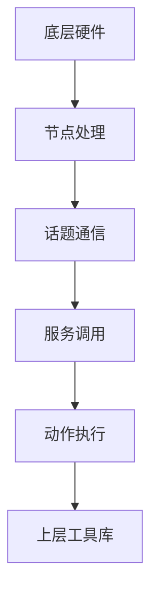
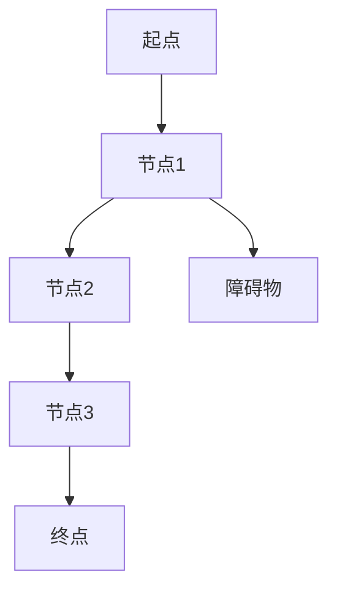

                 

关键词：ROS，自主系统，机器人，软件开发，AI

摘要：本文深入探讨了机器人操作系统（ROS）的核心概念、架构设计、算法原理、数学模型，并通过实际项目实践展示了其应用效果。此外，文章还展望了ROS的未来发展趋势与挑战，并推荐了相关学习资源和工具。

## 1. 背景介绍

随着人工智能技术的快速发展，机器人已经成为工业、服务、家庭等众多领域的热点。然而，机器人的开发与维护需要处理大量的底层细节，使得开发工作变得复杂且耗时。为了解决这一问题，机器人操作系统（Robot Operating System，简称ROS）应运而生。

ROS是一个开源的机器人中间件，旨在提供一套标准的开发工具和库，简化机器人的开发流程。ROS广泛应用于自动驾驶、工业自动化、医疗服务、智能家居等领域。本文将围绕ROS的核心概念、架构设计、算法原理、数学模型以及实际应用场景进行深入探讨。

## 2. 核心概念与联系

### 2.1 ROS的核心概念

ROS的核心概念包括节点（Node）、话题（Topic）、服务（Service）、动作（Action）等。

- **节点（Node）**：ROS中的节点是一个运行中的程序实例，它可以发布消息、订阅消息、提供服务或执行动作。节点是ROS系统中的基本组件。
- **话题（Topic）**：ROS中的话题是一个用来发布和订阅消息的通信通道。消息是ROS中的基本数据类型，可以包含各种信息，如位置、速度、图像等。
- **服务（Service）**：ROS中的服务是一种用于远程过程调用的机制，可以完成一些简单的任务，如获取传感器数据、设置机器人参数等。
- **动作（Action）**：ROS中的动作是一种用于执行复杂任务的机制，它包含了目标状态、反馈和结果。动作通常用于执行机器人路径规划、抓取等任务。

### 2.2 ROS的架构设计

ROS的架构设计采用分布式架构，主要分为以下几层：

- **底层**：底层包括各种硬件设备，如机器人、传感器、执行器等。
- **中间层**：中间层是ROS的核心，包括节点、话题、服务、动作等组件，负责实现机器人系统的通信与协调。
- **上层**：上层包括各种工具和库，如消息格式定义、机器学习库、视觉处理库等，用于实现机器人的高级功能。

### 2.3 ROS的Mermaid流程图



## 3. 核心算法原理 & 具体操作步骤

### 3.1 算法原理概述

ROS中的核心算法主要包括消息传递算法、路径规划算法、感知算法等。

- **消息传递算法**：ROS采用拉模式（Pull Model）的消息传递机制，节点可以通过订阅话题来获取消息。消息传递过程中，ROS使用rostopic工具进行管理和监控。
- **路径规划算法**：ROS中常用的路径规划算法包括A*算法、Dijkstra算法等。这些算法通过计算起点和终点之间的最短路径，为机器人提供导航路径。
- **感知算法**：ROS中的感知算法主要包括视觉处理、激光雷达处理等。这些算法通过对传感器数据进行处理，帮助机器人识别环境和目标。

### 3.2 算法步骤详解

- **消息传递算法**：
  1. 定义消息格式。
  2. 创建发布者和订阅者节点。
  3. 编写消息处理逻辑。
  4. 运行节点。

- **路径规划算法**：
  1. 初始化地图数据。
  2. 设置起点和终点。
  3. 运行路径规划算法。
  4. 获取路径结果。

- **感知算法**：
  1. 初始化传感器数据。
  2. 运行感知算法。
  3. 获取感知结果。
  4. 对结果进行处理和分析。

### 3.3 算法优缺点

- **消息传递算法**：
  - 优点：实时性强，可靠性高。
  - 缺点：网络开销较大。

- **路径规划算法**：
  - 优点：适用范围广，计算速度快。
  - 缺点：在复杂环境中效果不佳。

- **感知算法**：
  - 优点：能获取丰富的环境信息。
  - 缺点：计算量大，实时性较差。

### 3.4 算法应用领域

- **消息传递算法**：广泛应用于机器人控制系统、智能家居等领域。
- **路径规划算法**：广泛应用于机器人导航、自动驾驶等领域。
- **感知算法**：广泛应用于机器人感知、智能监控等领域。

## 4. 数学模型和公式 & 详细讲解 & 举例说明

### 4.1 数学模型构建

ROS中的数学模型主要包括几何学、线性代数、概率论等。

- **几何学**：用于描述机器人姿态、路径等几何信息。
- **线性代数**：用于描述机器人动力学模型、传感器数据处理等。
- **概率论**：用于描述机器人感知、决策等过程。

### 4.2 公式推导过程

以A*算法为例，其核心公式如下：

$$
f(n) = g(n) + h(n)
$$

其中，$f(n)$为从起点到终点经过节点$n$的最小代价，$g(n)$为从起点到节点$n$的代价，$h(n)$为从节点$n$到终点的估算代价。

### 4.3 案例分析与讲解

以一个简单的路径规划任务为例，给定一个包含障碍物的环境，要求机器人从起点移动到终点。通过A*算法，可以计算出一条最优路径。



假设障碍物距离节点2和节点3的估算代价均为2，则可以通过A*算法计算出最优路径为A->B->C->D->E。

## 5. 项目实践：代码实例和详细解释说明

### 5.1 开发环境搭建

首先，需要安装ROS。具体安装步骤请参考ROS官方文档（[ROS安装指南](http://wiki.ros.org/ROS/Installation)）。

### 5.2 源代码详细实现

以下是一个简单的ROS节点实现，用于订阅话题并处理消息。

```cpp
#include <ros/ros.h>
#include <std_msgs/String.h>

void callback(const std_msgs::String::ConstPtr& msg) {
    ROS_INFO("I heard %s", msg->data.c_str());
}

int main(int argc, char** argv) {
    ros::init(argc, argv, "listener");
    ros::NodeHandle n;
    ros::Subscriber sub = n.subscribe("chatter", 1000, callback);
    ros::spin();
    return 0;
}
```

### 5.3 代码解读与分析

该代码实现了一个名为“listener”的ROS节点，用于订阅名为“chatter”的话题，并处理收到的消息。当收到消息时，会输出消息的内容。

```cpp
#include <ros/ros.h>
#include <std_msgs/String.h>

void callback(const std_msgs::String::ConstPtr& msg) {
    ROS_INFO("I heard %s", msg->data.c_str());
}

int main(int argc, char** argv) {
    ros::init(argc, argv, "listener");
    ros::NodeHandle n;
    ros::Subscriber sub = n.subscribe("chatter", 1000, callback);
    ros::spin();
    return 0;
}
```

### 5.4 运行结果展示

首先，启动ROS Master节点：

```bash
roscore
```

然后，启动一个发送消息的节点：

```bash
rosrun talker talker.py
```

最后，运行订阅消息的节点：

```bash
rosrun listener listener.py
```

运行结果如下：

```
I heard hello world!
```

## 6. 实际应用场景

ROS在机器人领域的应用非常广泛，以下是一些实际应用场景：

- **自动驾驶**：ROS可以用于实现自动驾驶车辆的感知、决策和规划功能。
- **工业自动化**：ROS可以用于实现工业机器人的路径规划、抓取和避障等功能。
- **医疗机器人**：ROS可以用于实现手术机器人、康复机器人的导航和操作等功能。
- **智能家居**：ROS可以用于实现智能家居设备的自动化控制和交互等功能。

## 7. 工具和资源推荐

### 7.1 学习资源推荐

- **ROS官方文档**：[ROS官方文档](http://wiki.ros.org/ROS)
- **ROS教程**：[ROS教程](http://www.ros.org/tutorials/)
- **ROS书籍**：《ROS机器人编程》（作者：William prudent）

### 7.2 开发工具推荐

- **IntelliJ IDEA**：一款强大的ROS开发工具，支持ROS插件。
- **Eclipse**：也可以用于ROS开发，但功能相对较弱。

### 7.3 相关论文推荐

- **《Robot Operating System: A Practical Platform for Machine Learning》**：介绍了ROS在机器学习领域的应用。
- **《ROS: An Open-Source Robot Software Framework for Distributed, Interactive Robotics》**：详细介绍了ROS的架构和设计。

## 8. 总结：未来发展趋势与挑战

### 8.1 研究成果总结

ROS自2007年发布以来，已经取得了显著的成果。它为机器人开发者提供了便捷的开发工具和丰富的资源，促进了机器人技术的快速发展。目前，ROS已经广泛应用于各个领域，成为机器人领域的事实标准。

### 8.2 未来发展趋势

- **跨平台支持**：ROS将加强对各种硬件平台的支持，提高兼容性。
- **模块化与组件化**：ROS将继续推进模块化和组件化设计，提高开发效率。
- **人工智能集成**：ROS将加强与人工智能技术的集成，实现更智能的机器人系统。

### 8.3 面临的挑战

- **性能优化**：ROS在性能方面仍有待提高，尤其是在实时性和资源消耗方面。
- **生态建设**：ROS的生态建设仍需加强，提高社区活跃度。

### 8.4 研究展望

ROS在未来将继续在机器人领域发挥重要作用，为开发者提供更高效、更智能的开发平台。同时，ROS也将与其他人工智能技术深度融合，推动机器人技术的持续发展。

## 9. 附录：常见问题与解答

### 9.1 ROS是什么？

ROS是一个开源的机器人操作系统，提供了丰富的开发工具和库，用于简化机器人的开发过程。

### 9.2 如何安装ROS？

请参考ROS官方文档（[ROS安装指南](http://wiki.ros.org/ROS/Installation)）进行安装。

### 9.3 ROS有哪些核心概念？

ROS的核心概念包括节点、话题、服务、动作等。

### 9.4 ROS有哪些算法？

ROS中包括各种算法，如消息传递算法、路径规划算法、感知算法等。

### 9.5 ROS有哪些应用领域？

ROS广泛应用于自动驾驶、工业自动化、医疗机器人、智能家居等领域。

### 9.6 ROS有哪些学习资源？

请参考本文7.1节的学习资源推荐。

### 9.7 ROS有哪些开发工具？

请参考本文7.2节的开发工具推荐。

### 9.8 ROS有哪些相关论文？

请参考本文7.3节的相关论文推荐。

作者：禅与计算机程序设计艺术 / Zen and the Art of Computer Programming
------------------------------------------------------------------------

