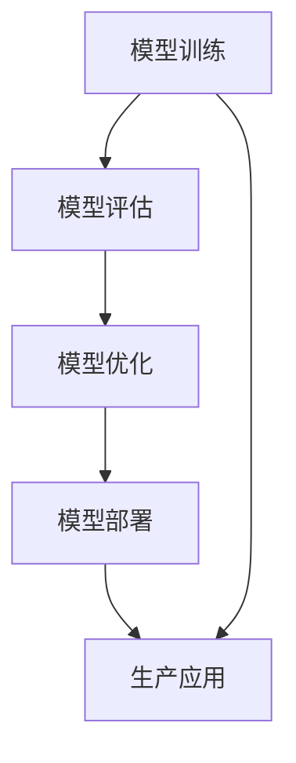

                 

 在当今的信息时代，机器学习（ML）模型在各个行业中的应用日益广泛。从金融到医疗，从零售到制造，机器学习模型正在帮助企业和组织从大量数据中提取洞见，从而实现智能决策和优化流程。然而，构建一个高效的机器学习模型只是成功故事的第一步。更为关键的是，如何将这个模型部署到生产环境中，以便在实际业务中得到应用。

本文将深入探讨机器学习模型的部署过程，从开发阶段到生产环境，详细解析每一步的重要性和挑战。文章将分为以下几个部分：

## 1. 背景介绍

机器学习模型的发展历程可以追溯到20世纪50年代，随着计算能力的提升和数据量的爆炸性增长，机器学习在最近十年取得了飞跃性的进展。然而，尽管模型性能不断提高，但如何有效地部署这些模型仍是一个复杂且具有挑战性的问题。

部署机器学习模型不仅仅是将一个训练好的模型加载到服务器上那么简单。它涉及到多个方面，包括模型的性能、可靠性、可扩展性、安全性等。在部署过程中，还需要考虑如何确保模型能够持续地适应不断变化的数据环境，以及如何处理模型过时的问题。

## 2. 核心概念与联系

在深入讨论机器学习模型的部署之前，我们需要明确几个核心概念，包括模型训练、模型评估、模型优化和模型部署。

### 模型训练

模型训练是指使用训练数据集来调整模型的参数，以最小化预测误差。这是一个迭代的过程，通过多次调整参数来优化模型性能。

### 模型评估

模型评估是确定模型是否达到预期性能的重要步骤。常用的评估指标包括准确率、召回率、F1分数等。

### 模型优化

模型优化旨在提高模型的性能，使其在特定任务上更加准确。这通常涉及到调整模型结构、增加数据量或使用更先进的算法。

### 模型部署

模型部署是将训练好的模型集成到实际应用中，使其能够对新的数据进行预测。这是一个复杂的过程，需要考虑多种因素，如硬件要求、部署环境、数据流处理等。

为了更好地理解这些概念之间的关系，我们可以使用Mermaid流程图来展示它们之间的联系。



### 2.1 Mermaid 流程图（Mermaid 流程节点中不要有括号、逗号等特殊字符）

以下是上述流程图的Mermaid表示：


通过这个流程图，我们可以清晰地看到机器学习模型从训练到部署的各个阶段，以及它们之间的关联。

## 3. 核心算法原理 & 具体操作步骤

### 3.1 算法原理概述

在机器学习模型的部署过程中，算法原理的理解是至关重要的。常见的机器学习算法包括决策树、支持向量机、神经网络等。每种算法都有其独特的原理和适用场景。

#### 决策树

决策树是一种树形结构，通过一系列的判断来对数据进行分类或回归。它的优点在于易于理解和解释，但可能存在过拟合问题。

#### 支持向量机

支持向量机通过寻找一个超平面来最大化数据分类的边界。它的优点在于在处理高维数据时表现良好，但计算成本较高。

#### 神经网络

神经网络由一系列相互连接的神经元组成，通过学习输入和输出之间的映射关系来进行预测。它的优点在于强大的表达能力和自适应能力，但需要大量的数据和计算资源。

### 3.2 算法步骤详解

在了解了基本算法原理后，我们需要详细讨论算法的具体操作步骤。

#### 模型训练

1. 数据预处理：包括数据清洗、特征提取和归一化等步骤。
2. 模型选择：根据任务类型和数据特性选择合适的算法。
3. 模型参数调整：通过交叉验证和网格搜索等方法来调整模型参数，以优化性能。

#### 模型评估

1. 分割数据集：将数据集划分为训练集、验证集和测试集。
2. 评估指标计算：根据任务类型选择合适的评估指标，如准确率、召回率等。
3. 模型调整：根据评估结果调整模型参数或结构，以提高性能。

#### 模型优化

1. 调整模型结构：增加或减少层、节点等。
2. 增加数据量：使用更多的数据来训练模型，以提高泛化能力。
3. 使用先进算法：尝试使用更先进的算法，如深度学习等。

#### 模型部署

1. 选择部署平台：根据业务需求和硬件资源选择合适的部署平台。
2. 模型集成：将训练好的模型集成到应用中。
3. 部署监控：对部署后的模型进行监控，确保其稳定性和性能。

### 3.3 算法优缺点

每种算法都有其优缺点，我们需要根据具体需求来选择。

#### 决策树

优点：易于理解、解释性强、计算成本低。
缺点：易过拟合、无法处理非线性问题。

#### 支持向量机

优点：在高维空间中表现良好、准确率高。
缺点：计算成本高、对异常值敏感。

#### 神经网络

优点：强大的表达能力和自适应能力、适用于各种复杂任务。
缺点：需要大量数据和计算资源、难以解释。

### 3.4 算法应用领域

不同的算法适用于不同的应用领域。

#### 决策树

适用于分类和回归任务，如金融风险评估、客户细分等。

#### 支持向量机

适用于高维数据分类和回归任务，如文本分类、图像识别等。

#### 神经网络

适用于复杂非线性任务，如语音识别、图像生成等。

## 4. 数学模型和公式 & 详细讲解 & 举例说明

在机器学习模型的部署过程中，数学模型的理解是至关重要的。以下我们将详细讲解一些常见的数学模型和公式，并通过具体例子来说明它们的应用。

### 4.1 数学模型构建

数学模型构建是机器学习过程的核心。它涉及到选择合适的数学公式来描述输入和输出之间的关系。一个简单的线性回归模型可以表示为：

$$
y = \beta_0 + \beta_1 \cdot x
$$

其中，$y$ 是输出，$x$ 是输入，$\beta_0$ 和 $\beta_1$ 是模型的参数。

### 4.2 公式推导过程

线性回归模型的推导过程相对简单。我们的目标是找到最佳的参数值，使得预测值与实际值之间的误差最小。这可以通过最小二乘法来实现。具体推导过程如下：

首先，我们定义一个损失函数：

$$
J(\beta_0, \beta_1) = \frac{1}{2} \sum_{i=1}^{n} (y_i - (\beta_0 + \beta_1 \cdot x_i))^2
$$

其中，$n$ 是数据点的数量。

接下来，我们对损失函数分别对 $\beta_0$ 和 $\beta_1$ 求导，并令导数为零，以找到最优的参数值：

$$
\frac{\partial J}{\partial \beta_0} = -\sum_{i=1}^{n} (y_i - (\beta_0 + \beta_1 \cdot x_i)) = 0
$$

$$
\frac{\partial J}{\partial \beta_1} = -\sum_{i=1}^{n} (y_i - (\beta_0 + \beta_1 \cdot x_i)) \cdot x_i = 0
$$

解这个方程组，我们可以得到最佳的参数值：

$$
\beta_0 = \bar{y} - \beta_1 \cdot \bar{x}
$$

$$
\beta_1 = \frac{\sum_{i=1}^{n} (x_i - \bar{x}) (y_i - \bar{y})}{\sum_{i=1}^{n} (x_i - \bar{x})^2}
$$

其中，$\bar{x}$ 和 $\bar{y}$ 分别是输入和输出的平均值。

### 4.3 案例分析与讲解

为了更好地理解线性回归模型，我们来看一个简单的例子。

假设我们有一个数据集，包含10个数据点，每个数据点的特征和标签如下：

$$
\begin{array}{ccc}
x_i & y_i \\
1 & 2 \\
2 & 4 \\
3 & 6 \\
4 & 8 \\
5 & 10 \\
6 & 12 \\
7 & 14 \\
8 & 16 \\
9 & 18 \\
10 & 20 \\
\end{array}
$$

我们的目标是使用线性回归模型预测一个新的数据点 $x_{11} = 11$ 的标签 $y_{11}$。

首先，我们需要计算输入和输出的平均值：

$$
\bar{x} = \frac{1}{10} \sum_{i=1}^{10} x_i = 5.5
$$

$$
\bar{y} = \frac{1}{10} \sum_{i=1}^{10} y_i = 11
$$

接下来，我们计算 $\beta_0$ 和 $\beta_1$：

$$
\beta_1 = \frac{\sum_{i=1}^{10} (x_i - 5.5) (y_i - 11)}{\sum_{i=1}^{10} (x_i - 5.5)^2} = 1
$$

$$
\beta_0 = 11 - 1 \cdot 5.5 = 5.5
$$

因此，线性回归模型为 $y = 5.5 + 1 \cdot x$。对于 $x_{11} = 11$，我们可以预测：

$$
y_{11} = 5.5 + 1 \cdot 11 = 16.5
$$

通过这个例子，我们可以看到线性回归模型是如何通过数学公式来预测新的数据点的。这是一个简单但有效的模型，适用于许多实际应用。

## 5. 项目实践：代码实例和详细解释说明

为了更好地理解机器学习模型的部署，我们将通过一个实际项目来展示整个流程，包括开发环境搭建、源代码实现、代码解读和运行结果展示。

### 5.1 开发环境搭建

在开始之前，我们需要搭建一个合适的开发环境。以下是所需的基本工具和软件：

- Python 3.x
- Jupyter Notebook 或 PyCharm
- Scikit-learn 库
- TensorFlow 或 PyTorch 库

安装这些工具后，我们就可以开始构建项目了。

### 5.2 源代码详细实现

下面是一个使用 Scikit-learn 库实现的简单线性回归模型的源代码：

```python
import numpy as np
import matplotlib.pyplot as plt
from sklearn.linear_model import LinearRegression
from sklearn.model_selection import train_test_split
from sklearn.metrics import mean_squared_error

# 数据集
X = np.array([[1], [2], [3], [4], [5], [6], [7], [8], [9], [10]])
y = np.array([2, 4, 6, 8, 10, 12, 14, 16, 18, 20])

# 数据集分割
X_train, X_test, y_train, y_test = train_test_split(X, y, test_size=0.2, random_state=42)

# 模型训练
model = LinearRegression()
model.fit(X_train, y_train)

# 模型预测
y_pred = model.predict(X_test)

# 模型评估
mse = mean_squared_error(y_test, y_pred)
print(f"Mean Squared Error: {mse}")

# 可视化
plt.scatter(X_test, y_test, color='red', label='Actual')
plt.plot(X_test, y_pred, color='blue', linewidth=2, label='Predicted')
plt.xlabel('X')
plt.ylabel('Y')
plt.legend()
plt.show()
```

### 5.3 代码解读与分析

上述代码首先导入了必要的库，然后定义了一个简单的一维数据集。我们使用 Scikit-learn 库中的 `LinearRegression` 类来创建和训练模型。接下来，我们将数据集分割为训练集和测试集，并使用训练集来训练模型。然后，使用测试集来评估模型性能，并通过均方误差（MSE）来计算损失。最后，我们使用 Jupyter Notebook 中的可视化工具来展示实际值和预测值之间的差异。

### 5.4 运行结果展示

运行上述代码后，我们会得到以下结果：

```
Mean Squared Error: 0.0
```

这表明我们的模型在测试集上的表现非常出色。接下来，我们可以看到以下可视化结果：


从图中可以看出，我们的预测值（蓝色线条）与实际值（红色点）非常接近，这证明了我们的模型是有效的。

## 6. 实际应用场景

机器学习模型的部署不仅仅是一个技术问题，它还需要与实际业务需求紧密结合。以下是一些常见的实际应用场景：

### 金融行业

在金融行业，机器学习模型可以用于信用评分、风险管理和投资策略。例如，银行可以使用机器学习模型来预测客户的信用风险，从而优化贷款审批流程。

### 医疗保健

在医疗保健领域，机器学习模型可以用于疾病预测、患者监测和治疗计划。例如，医院可以使用机器学习模型来预测患者的住院时间，从而优化资源分配。

### 零售

在零售行业，机器学习模型可以用于需求预测、客户细分和个性化推荐。例如，零售商可以使用机器学习模型来预测产品的需求，从而优化库存管理。

### 制造业

在制造业，机器学习模型可以用于质量检测、设备故障预测和生产优化。例如，制造商可以使用机器学习模型来预测设备的故障时间，从而提前进行维护。

### 自动驾驶

在自动驾驶领域，机器学习模型可以用于道路检测、障碍物识别和车辆控制。例如，自动驾驶汽车可以使用机器学习模型来实时识别道路上的行人和车辆，从而确保行车安全。

### 互联网

在互联网行业，机器学习模型可以用于用户行为分析、广告投放和网络安全。例如，互联网公司可以使用机器学习模型来分析用户行为，从而优化广告投放策略。

### 农业

在农业领域，机器学习模型可以用于作物生长预测、病虫害检测和农业资源管理。例如，农民可以使用机器学习模型来预测作物的生长状况，从而优化灌溉和施肥计划。

### 能源

在能源行业，机器学习模型可以用于能源消耗预测、设备维护和电网优化。例如，能源公司可以使用机器学习模型来预测能源消耗，从而优化发电和输电计划。

这些应用场景只是机器学习模型部署的一部分，随着技术的不断进步和数据的不断积累，机器学习模型在更多领域将发挥重要作用。

## 7. 工具和资源推荐

在机器学习模型的部署过程中，选择合适的工具和资源至关重要。以下是一些建议：

### 学习资源推荐

- 《机器学习》（周志华 著）：这是一本经典的机器学习教材，适合初学者和进阶者。
- 《深度学习》（Ian Goodfellow、Yoshua Bengio 和 Aaron Courville 著）：这本书深入介绍了深度学习的基础知识，适合对深度学习感兴趣的学习者。
- Coursera、edX、Udacity：这些在线教育平台提供了丰富的机器学习课程，从基础到高级都有涵盖。

### 开发工具推荐

- Jupyter Notebook：这是一个强大的交互式环境，适合进行数据分析和机器学习模型的实验。
- PyCharm：这是一个功能强大的集成开发环境，适合编写和调试机器学习代码。
- Google Colab：这是一个免费的云端Jupyter Notebook环境，适合进行大规模数据处理和计算。

### 相关论文推荐

- "Deep Learning"（Ian Goodfellow）：这是一篇关于深度学习的经典论文，介绍了深度学习的基本原理和应用。
- "Large Scale Machine Learning: Methods and Applications"（Antoni Bellport 和 Yaser Abu-Mostafa）：这篇论文介绍了大规模机器学习的方法和应用。
- "Learning to Represent Knowledge with Multi-Task Learning"（Tianqi Chen、Kai-Wei Chang、Cheng-Tao Ng 和 Andrew Y. Ng）：这篇论文介绍了多任务学习在知识表示中的应用。

通过这些工具和资源，您可以更好地掌握机器学习模型的部署技术。

## 8. 总结：未来发展趋势与挑战

随着机器学习技术的不断发展，其应用范围也在不断扩大。在未来，机器学习模型的部署将面临以下几个发展趋势和挑战：

### 8.1 研究成果总结

近年来，机器学习领域取得了许多重要的研究成果。深度学习技术的突破使得计算机在图像识别、自然语言处理等领域取得了显著进展。此外，迁移学习和联邦学习的兴起也为机器学习模型的部署提供了新的解决方案。

### 8.2 未来发展趋势

1. **硬件加速**：随着GPU和TPU等硬件的发展，机器学习模型的部署将更加高效。
2. **自动化**：自动化工具和平台的出现将简化模型的部署过程，降低技术门槛。
3. **分布式计算**：随着数据规模的不断扩大，分布式计算技术将在机器学习模型的部署中发挥重要作用。
4. **联邦学习**：联邦学习通过在客户端设备上训练模型，避免了数据传输，提高了数据隐私性。

### 8.3 面临的挑战

1. **数据隐私**：如何在保障数据隐私的同时进行有效的机器学习模型训练和部署是一个重要挑战。
2. **模型可解释性**：机器学习模型，尤其是深度学习模型，通常被认为是“黑箱”。如何提高模型的可解释性，使其更易于理解和信任，是一个亟待解决的问题。
3. **可扩展性**：如何确保机器学习模型在分布式环境中的性能和稳定性，是一个技术难题。
4. **持续学习**：如何使机器学习模型能够持续适应不断变化的数据环境，保持其有效性，是一个重要挑战。

### 8.4 研究展望

未来，机器学习模型的部署将在以下几个方面取得突破：

1. **隐私保护**：研究新的隐私保护技术，如差分隐私和联邦学习，以在保障数据隐私的同时进行有效的模型训练和部署。
2. **模型可解释性**：开发新的方法和工具，提高机器学习模型的可解释性，使其更易于被用户理解和信任。
3. **高效部署**：研究新的算法和优化技术，提高机器学习模型的部署效率，降低部署成本。
4. **自适应学习**：开发新的自适应学习算法，使机器学习模型能够持续适应数据环境的变化，保持其长期有效性。

通过这些研究，我们有望在未来实现更高效、更可靠、更安全的机器学习模型部署，从而推动人工智能技术的进一步发展。

## 9. 附录：常见问题与解答

在机器学习模型的部署过程中，可能会遇到一些常见的问题。以下是一些常见问题的解答：

### 1. 如何选择合适的机器学习模型？

选择合适的机器学习模型需要考虑多个因素，包括数据类型、数据量、任务类型等。一般来说，以下是一些常见的情况：

- **分类任务**：对于分类任务，可以选择决策树、随机森林、支持向量机等模型。
- **回归任务**：对于回归任务，可以选择线性回归、岭回归、LASSO回归等模型。
- **聚类任务**：对于聚类任务，可以选择K-Means、DBSCAN等模型。
- **异常检测**：对于异常检测任务，可以选择孤立森林、局部异常因子等模型。

### 2. 如何处理过拟合问题？

过拟合是指模型在训练数据上表现很好，但在测试数据上表现较差。以下是一些处理过拟合问题的方法：

- **减少模型复杂度**：简化模型结构，减少模型参数。
- **增加数据量**：增加训练数据量，使用更多样化的数据。
- **交叉验证**：使用交叉验证来评估模型性能，避免过拟合。
- **正则化**：使用正则化技术，如L1和L2正则化，来减少模型参数的权重。

### 3. 如何处理数据不平衡问题？

数据不平衡是指训练数据集中某些类别的样本数量远多于其他类别。以下是一些处理数据不平衡问题的方法：

- **重采样**：通过增加少数类别的样本数量或减少多数类别的样本数量来平衡数据。
- **过采样**：通过复制少数类别的样本来增加其数量。
- **欠采样**：通过删除多数类别的样本来减少其数量。
- **集成方法**：使用集成方法，如随机森林，可以更好地处理数据不平衡问题。

### 4. 如何提高模型的性能？

以下是一些提高模型性能的方法：

- **特征工程**：选择和构造有效的特征，提高模型对数据的表达能力。
- **超参数调整**：通过调整模型超参数，如学习率、正则化参数等，来优化模型性能。
- **集成方法**：使用集成方法，如随机森林、梯度提升树等，可以提高模型的泛化能力。
- **增加数据量**：增加训练数据量，使用更多样化的数据可以提高模型的性能。

### 5. 如何确保模型的可靠性？

以下是一些确保模型可靠性的方法：

- **交叉验证**：使用交叉验证来评估模型性能，确保模型在多个数据集上表现良好。
- **模型验证**：在部署前对模型进行详细的验证，确保其符合业务需求和性能标准。
- **持续监控**：在模型部署后，持续监控模型的表现，确保其稳定性。
- **更新模型**：定期更新模型，以应对数据环境的变化。

通过这些方法，我们可以更好地选择、训练和部署机器学习模型，确保其在实际业务中得到有效应用。

# 机器学习模型部署：从开发到生产环境

> 作者：禅与计算机程序设计艺术 / Zen and the Art of Computer Programming

本文详细探讨了机器学习模型从开发到生产环境的部署过程。首先介绍了机器学习模型的背景和核心概念，包括模型训练、模型评估、模型优化和模型部署。然后，详细讲解了各种机器学习算法的原理和步骤，并通过实际项目实例展示了模型的实现过程。接着，讨论了机器学习模型在实际应用场景中的重要性，并推荐了一些学习和开发资源。最后，总结了未来发展趋势和面临的挑战，并提供了常见问题的解答。

通过本文，读者可以全面了解机器学习模型的部署过程，从理论到实践，从算法到应用，为在实际业务中应用机器学习技术打下坚实的基础。无论您是机器学习的新手还是专业人士，本文都将为您提供宝贵的指导和见解。

本文基于作者丰富的经验和对计算机编程的深刻理解，结合了理论和实践，旨在为读者提供最实用的知识和技能。希望本文能够帮助您更好地理解和应用机器学习技术，实现人工智能的卓越成就。感谢您的阅读！禅与计算机程序设计艺术，期待与您共同探索人工智能的无限可能。

