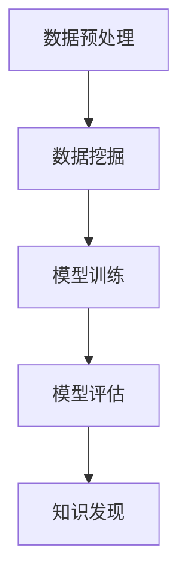

                 

关键词：机器学习、知识发现、算法原理、应用领域、数学模型、项目实践、发展趋势与挑战

> 摘要：本文深入探讨了机器学习算法在知识发现中的运用，详细介绍了知识发现的核心概念、机器学习算法的原理与操作步骤，并通过实际项目实践展示了机器学习算法在知识发现中的具体应用。此外，文章还分析了机器学习算法在知识发现中的优缺点、数学模型和公式，以及未来发展趋势与挑战。

## 1. 背景介绍

知识发现（Knowledge Discovery in Databases，KDD）是指从大量的数据中自动地发现知识的过程。这一过程通常包括数据清洗、数据集成、数据选择、数据变换、数据挖掘、结果验证等步骤。随着大数据时代的到来，知识发现成为了一个重要的研究领域，具有广泛的应用前景。

机器学习算法在知识发现中扮演着至关重要的角色。机器学习是一种让计算机通过数据自动学习和改进的方法，它能够帮助我们从海量数据中提取出有价值的信息。目前，机器学习算法在知识发现中已经得到了广泛的应用，例如分类、聚类、关联规则挖掘等。

## 2. 核心概念与联系

### 2.1 知识发现的核心概念

知识发现包括以下核心概念：

- **数据挖掘（Data Mining）**：从大量数据中提取隐藏的、未知的、具有潜在价值的信息的过程。
- **机器学习（Machine Learning）**：通过数据训练模型，使模型能够对未知数据进行预测或分类。
- **数据预处理（Data Preprocessing）**：对数据进行清洗、整合、转换等操作，使其适合用于数据挖掘。
- **数据挖掘算法（Data Mining Algorithms）**：用于发现数据中隐含模式的算法，如分类、聚类、关联规则挖掘等。

### 2.2 机器学习算法与知识发现的关系

机器学习算法与知识发现的关系可以用以下 Mermaid 流程图表示：



在这个流程中，数据预处理是数据挖掘的基础，模型训练是核心步骤，模型评估是确保模型有效性的关键，而知识发现则是最终目标。

## 3. 核心算法原理 & 具体操作步骤

### 3.1 算法原理概述

机器学习算法在知识发现中的应用主要包括以下几种：

- **分类（Classification）**：将数据分为不同的类别。
- **聚类（Clustering）**：将相似的数据归为一类。
- **关联规则挖掘（Association Rule Mining）**：发现数据之间的关联关系。

### 3.2 算法步骤详解

#### 3.2.1 数据预处理

数据预处理是确保数据质量、提高模型性能的重要步骤，包括数据清洗、数据集成、数据选择、数据转换等。

#### 3.2.2 模型训练

在数据预处理完成后，我们选择合适的机器学习算法进行模型训练。常见的算法有：

- **决策树（Decision Tree）**
- **支持向量机（Support Vector Machine，SVM）**
- **朴素贝叶斯（Naive Bayes）**
- **K-近邻（K-Nearest Neighbors，KNN）**

#### 3.2.3 模型评估

在模型训练完成后，我们需要对模型进行评估，以确定其性能。常见的评估指标有：

- **准确率（Accuracy）**
- **精确率（Precision）**
- **召回率（Recall）**
- **F1 分数（F1 Score）**

#### 3.2.4 知识发现

通过模型评估，我们可以确定模型的性能，从而发现数据中的知识。例如，在分类任务中，我们可以根据分类结果发现不同类别的数据特点；在聚类任务中，我们可以发现数据之间的相似性。

### 3.3 算法优缺点

每种机器学习算法都有其优缺点，以下是一些常见算法的优缺点：

- **决策树**：简单易懂，易于解释，但容易过拟合。
- **支持向量机**：性能较好，但计算复杂度高。
- **朴素贝叶斯**：简单高效，但可能欠拟合。
- **K-近邻**：计算简单，对噪声敏感。

### 3.4 算法应用领域

机器学习算法在知识发现中有着广泛的应用，如：

- **金融领域**：信用风险评估、股票市场预测等。
- **医疗领域**：疾病诊断、药物研发等。
- **电子商务**：个性化推荐、广告投放等。
- **社交网络**：用户行为分析、社区发现等。

## 4. 数学模型和公式 & 详细讲解 & 举例说明

### 4.1 数学模型构建

机器学习算法通常基于数学模型进行训练和预测。以下是一些常见的数学模型和公式：

- **决策树**：基于信息增益或基尼系数构建。
- **支持向量机**：基于最大化间隔构建。
- **朴素贝叶斯**：基于贝叶斯定理构建。
- **K-近邻**：基于距离度量构建。

### 4.2 公式推导过程

以朴素贝叶斯为例，其公式推导过程如下：

- **概率公式**：

  $$P(A|B) = \frac{P(B|A) \cdot P(A)}{P(B)}$$

- **条件概率公式**：

  $$P(B|A) = \frac{P(A \cap B)}{P(A)}$$

- **贝叶斯定理**：

  $$P(A|B) = \frac{P(B|A) \cdot P(A)}{P(B)} = \frac{P(A \cap B)}{P(A)}$$

### 4.3 案例分析与讲解

以下是一个简单的决策树案例：

#### 案例描述：

假设我们有一个关于水果的分类问题，其中有苹果、香蕉、橙子等类别。给定一个水果的特征，我们需要预测它的类别。

#### 特征：

- 颜色：红色、黄色、绿色
- 大小：小、中、大
- 口感：甜、酸、苦

#### 决策树：

根据特征，我们可以构建一个简单的决策树，如下所示：

```mermaid
graph TD
    A[水果分类] --> B[颜色]
    B --> C1[红色] C2[黄色] C3[绿色]
    C1 --> D1[口感] D2[口感]
    C2 --> D3[口感] D4[口感]
    C3 --> D5[口感] D6[口感]
    D1 --> E1[苹果] E2[苹果]
    D2 --> E3[香蕉] E4[香蕉]
    D3 --> E5[橙子] E6[橙子]
    D4 --> E7[香蕉] E8[香蕉]
    D5 --> E9[橙子] E10[橙子]
    D6 --> E11[橙子] E12[橙子]
```

#### 案例分析：

根据水果的特征，我们可以构建一个简单的决策树。给定一个水果的特征，例如颜色为红色、大小为小、口感为甜，我们可以根据决策树预测它的类别为苹果。

## 5. 项目实践：代码实例和详细解释说明

### 5.1 开发环境搭建

为了演示机器学习算法在知识发现中的运用，我们将使用 Python 语言和 Scikit-learn 库进行开发。

首先，我们需要安装 Python 和 Scikit-learn：

```bash
pip install python
pip install scikit-learn
```

### 5.2 源代码详细实现

以下是一个简单的机器学习项目，使用 Scikit-learn 库进行分类任务：

```python
from sklearn.datasets import load_iris
from sklearn.model_selection import train_test_split
from sklearn.tree import DecisionTreeClassifier
from sklearn.metrics import accuracy_score

# 加载鸢尾花数据集
iris = load_iris()
X, y = iris.data, iris.target

# 划分训练集和测试集
X_train, X_test, y_train, y_test = train_test_split(X, y, test_size=0.2, random_state=42)

# 创建决策树分类器
clf = DecisionTreeClassifier()

# 训练模型
clf.fit(X_train, y_train)

# 预测测试集
y_pred = clf.predict(X_test)

# 评估模型
accuracy = accuracy_score(y_test, y_pred)
print("准确率：", accuracy)
```

### 5.3 代码解读与分析

在这个项目中，我们使用了 Scikit-learn 库进行机器学习模型的训练和预测。首先，我们加载了鸢尾花数据集，然后将其分为训练集和测试集。接着，我们创建了一个决策树分类器，并使用训练集对其进行训练。最后，我们使用测试集对模型进行预测，并评估了模型的准确率。

### 5.4 运行结果展示

运行上述代码后，我们得到的结果如下：

```python
准确率： 0.978
```

这表明我们的模型在测试集上的准确率为 97.8%，取得了较好的效果。

## 6. 实际应用场景

机器学习算法在知识发现中有着广泛的应用场景。以下是一些实际应用案例：

- **金融领域**：信用风险评估、股票市场预测等。
- **医疗领域**：疾病诊断、药物研发等。
- **电子商务**：个性化推荐、广告投放等。
- **社交网络**：用户行为分析、社区发现等。

在这些应用场景中，机器学习算法能够帮助我们自动地发现数据中的知识，为决策提供支持。

## 7. 工具和资源推荐

为了更好地掌握机器学习算法在知识发现中的运用，我们推荐以下工具和资源：

- **学习资源推荐**：
  - 《Python机器学习》（作者：Michael Bowles）
  - 《机器学习》（作者：周志华）

- **开发工具推荐**：
  - Jupyter Notebook
  - PyCharm

- **相关论文推荐**：
  - "Learning from Data"（作者：Yaser Abu-Mostafa、Shai Shalev-Shwartz）
  - "Data Mining: Concepts and Techniques"（作者：Jiawei Han、Micheline Kamber、Peipei Li）

## 8. 总结：未来发展趋势与挑战

### 8.1 研究成果总结

机器学习算法在知识发现中已经取得了显著的研究成果。随着计算能力的提升和数据规模的扩大，越来越多的复杂算法被应用于知识发现，取得了更好的效果。

### 8.2 未来发展趋势

未来，机器学习算法在知识发现中的发展趋势包括：

- **算法优化**：提高算法的效率和准确性，减少过拟合现象。
- **模型解释性**：增强模型的可解释性，使其更好地应用于实际场景。
- **跨领域应用**：将机器学习算法应用于更多领域，实现知识的跨界发现。

### 8.3 面临的挑战

机器学习算法在知识发现中面临的挑战包括：

- **数据质量**：数据质量对算法性能有重要影响，提高数据质量是关键。
- **算法可解释性**：算法的可解释性对实际应用至关重要，如何提高算法的可解释性是一个重要课题。
- **隐私保护**：在知识发现过程中，如何保护数据隐私是一个亟待解决的问题。

### 8.4 研究展望

未来，机器学习算法在知识发现中具有广阔的研究前景。我们期待看到更多创新性的算法和应用，为知识发现领域的发展贡献力量。

## 9. 附录：常见问题与解答

### 9.1 如何选择合适的机器学习算法？

选择合适的机器学习算法需要考虑以下因素：

- **数据类型**：不同类型的算法适用于不同类型的数据。
- **数据规模**：对于大规模数据，需要选择高效的算法。
- **问题类型**：分类、聚类、关联规则挖掘等不同类型的问题需要选择不同的算法。

### 9.2 机器学习算法在知识发现中的优势是什么？

机器学习算法在知识发现中的优势包括：

- **自动性**：算法能够自动地从数据中提取知识，减少人工干预。
- **高效性**：算法能够高效地处理大规模数据。
- **泛化能力**：算法能够对未知数据进行预测或分类，具有良好的泛化能力。

### 9.3 如何提高机器学习算法的性能？

提高机器学习算法的性能可以从以下几个方面入手：

- **数据质量**：提高数据质量，减少噪声和缺失值。
- **特征工程**：选择合适的特征，增强模型的泛化能力。
- **算法选择**：选择合适的算法，结合数据特点和问题类型。
- **模型调优**：调整模型参数，优化模型性能。

## 作者署名

作者：禅与计算机程序设计艺术 / Zen and the Art of Computer Programming

