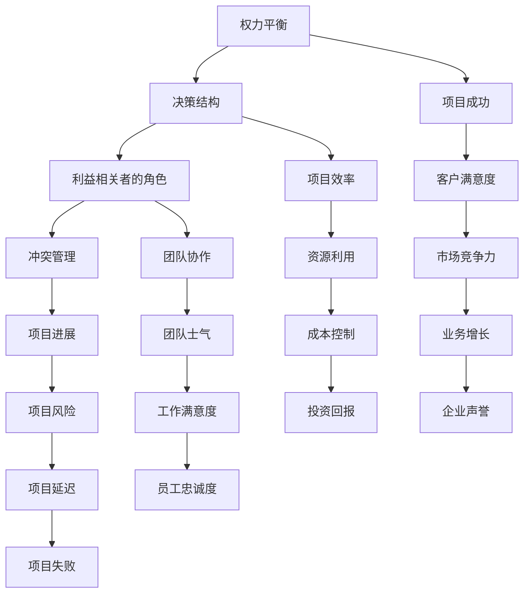

                 

权力平衡是任何组织或项目中不可避免的主题。在IT领域，权力平衡涉及到技术团队、管理层、客户和最终用户等多个利益相关者之间的互动。本文将探讨在利益相关者之间进行权力平衡的重要性，并提供一系列策略和工具，帮助您在复杂的技术环境中实现这一目标。

## 文章关键词

- IT项目管理
- 权力平衡
- 利益相关者
- 技术决策
- 协作

## 摘要

本文将深入探讨权力平衡在IT项目中的重要性。我们将分析不同利益相关者的需求和期望，并介绍一系列策略和工具，帮助您在这些需求之间找到平衡点。通过理解权力动态，IT项目团队能够更好地协作，提高项目成功率，并最终实现组织目标。

## 1. 背景介绍

在IT项目中，权力平衡指的是确保各个利益相关者能够以平等的方式参与决策过程，并在实现项目目标时发挥各自的作用。利益相关者可能包括项目经理、开发人员、产品经理、客户、最终用户和其他关键决策者。每个利益相关者都有自己的利益、期望和目标，这些因素在项目中可能产生冲突。

权力不平衡可能导致以下问题：

- **项目延误**：当技术团队无法满足管理层的期望时，项目可能因为缺乏资源和指导而延误。
- **资源浪费**：如果技术决策未充分考虑客户需求，可能导致开发的特性不被使用，浪费时间和资源。
- **团队士气低落**：当团队成员感到他们的意见未被听取时，可能会出现士气问题，影响整体效率。
- **项目失败**：在极端情况下，权力不平衡可能导致项目完全失败，浪费大量的时间和资金。

因此，理解权力平衡在IT项目中的重要性至关重要。本文将探讨如何在多个利益相关者之间建立有效的权力平衡，以促进项目的成功。

### 1.1 IT项目中的利益相关者

在IT项目中，不同的利益相关者扮演着不同的角色，他们的需求和期望也各不相同。以下是几个关键的利益相关者及其特点和需求：

- **项目经理**：项目经理负责确保项目按时、按预算完成，并达到预期的质量标准。他们的需求是清晰的里程碑、资源分配和项目管理工具。
- **开发人员**：开发人员是项目的执行者，他们需要明确的指导和技术支持来确保他们的工作能够顺利进行。他们的需求包括足够的资源和高质量的代码。
- **产品经理**：产品经理负责定义产品的功能、设计和用户体验。他们的需求是与客户和市场保持紧密联系，以便快速响应变化。
- **客户**：客户是项目的最终受益者，他们关注的是产品的价值和功能。他们的需求是产品能够满足他们的业务需求和期望。
- **最终用户**：最终用户是实际使用产品的人，他们的需求和满意度直接影响到产品的成功。他们的需求是产品的易用性和可靠性。

理解这些利益相关者的角色和需求对于实现权力平衡至关重要。

## 2. 核心概念与联系

为了更好地理解权力平衡在IT项目中的重要性，我们需要明确一些核心概念，并展示它们之间的联系。以下是几个关键概念及其在IT项目中的意义：

### 2.1  权力平衡的定义

**权力平衡**指的是在多个利益相关者之间建立一种平衡，确保每个相关者的需求、意见和资源都得到充分的考虑。在IT项目中，这意味着项目经理、开发人员、产品经理、客户和最终用户之间的互动要透明且相互尊重。

### 2.2  IT项目中的决策结构

**决策结构**指的是在IT项目中如何做出关键决策，并确保这些决策能够反映所有利益相关者的需求。一个良好的决策结构应该允许各个利益相关者有机会表达他们的观点，并共同讨论和解决潜在的问题。

### 2.3  利益相关者的角色

**利益相关者的角色**指的是每个利益相关者在项目中的具体职责和作用。了解这些角色有助于明确各自的责任，并确保权力平衡。

### 2.4  冲突管理

**冲突管理**是权力平衡的关键部分。在项目过程中，冲突是不可避免的，但通过有效的冲突管理，可以确保冲突不会阻碍项目的进展。

下面是一个使用Mermaid绘制的流程图，展示了这些概念之间的联系：



### 2.5  权力平衡的重要性

**权力平衡**对于IT项目的成功至关重要。它不仅有助于减少冲突，提高团队协作，还能确保项目资源得到最有效的利用。以下是权力平衡在IT项目中的几个关键重要性：

- **减少冲突**：当权力平衡得到维持时，利益相关者更有可能接受决策结果，减少因意见不一致而引发的冲突。
- **提高效率**：权力平衡能够确保每个利益相关者都充分发挥其优势，提高整体项目效率。
- **确保项目进展**：通过权力平衡，项目团队能够更好地应对挑战，确保项目按计划进行。
- **提高客户满意度**：当客户需求得到充分考虑时，产品更可能满足市场预期，提高客户满意度。
- **促进团队协作**：权力平衡能够营造一个相互尊重和信任的工作环境，促进团队协作。

## 3. 核心算法原理 & 具体操作步骤

### 3.1  算法原理概述

在实现权力平衡的过程中，我们可以借鉴一些算法原理，以帮助识别和管理利益相关者之间的权力动态。以下是一个简化的算法原理概述：

1. **利益相关者识别**：首先，识别所有参与项目的利益相关者，并确定他们的需求和期望。
2. **权力分析**：分析每个利益相关者在项目中的权力来源，包括资源、信息、决策权和影响力。
3. **目标设定**：设定项目的整体目标，并确保这些目标与利益相关者的期望一致。
4. **决策机制**：建立一个透明的决策机制，允许所有利益相关者参与讨论和投票，以确保权力平衡。
5. **冲突管理**：当出现冲突时，通过谈判、调解或其他冲突管理策略来解决问题。
6. **持续评估**：定期评估权力平衡的状态，并根据需要调整策略。

### 3.2  算法步骤详解

#### 步骤 1：利益相关者识别

- **收集信息**：通过访谈、问卷调查和观察等方式，收集有关项目利益相关者的信息。
- **分类整理**：将收集到的信息分类整理，明确每个利益相关者的角色和职责。
- **文档化**：将利益相关者的信息文档化，以便在后续步骤中参考。

#### 步骤 2：权力分析

- **权力来源**：识别每个利益相关者的权力来源，如资源、信息、决策权和影响力。
- **权力分布**：分析权力在项目团队中的分布情况，确定是否存在权力过度集中的现象。
- **权力评估**：对每个利益相关者的权力进行评估，以确定他们在项目中的实际影响力。

#### 步骤 3：目标设定

- **明确目标**：与所有利益相关者讨论，明确项目的整体目标和各方的期望。
- **一致性检查**：确保项目目标与所有利益相关者的期望一致，减少潜在的冲突。
- **文档化**：将目标设定文档化，作为项目决策的参考依据。

#### 步骤 4：决策机制

- **透明沟通**：建立一个透明的沟通渠道，允许所有利益相关者参与项目决策。
- **决策流程**：定义一个明确的决策流程，确保每个利益相关者都有机会表达意见。
- **投票机制**：引入投票机制，确保决策结果的公平性。

#### 步骤 5：冲突管理

- **早期预警**：建立冲突预警机制，及时识别和处理潜在冲突。
- **谈判与调解**：在冲突发生时，通过谈判和调解来解决争端。
- **决策复审**：在冲突无法通过谈判解决时，进行决策复审，确保决策结果公正。

#### 步骤 6：持续评估

- **定期评估**：定期评估权力平衡的状态，确保权力分配公平合理。
- **反馈循环**：收集利益相关者的反馈，不断优化决策机制和冲突管理策略。
- **调整策略**：根据评估结果，调整权力平衡策略，以应对项目中的新挑战。

### 3.3  算法优缺点

**优点：**

- **促进协作**：权力平衡有助于建立协作氛围，提高团队整体效率。
- **减少冲突**：通过透明的决策机制和冲突管理策略，减少项目中的冲突。
- **确保公正**：权力平衡确保所有利益相关者的声音得到尊重，提高决策的公正性。
- **适应变化**：权力平衡能够更好地适应项目中的变化，确保项目的持续成功。

**缺点：**

- **复杂性**：权力平衡涉及到多个利益相关者的需求和期望，可能增加项目管理的复杂性。
- **执行难度**：在实施权力平衡策略时，可能需要额外的时间和资源。
- **权力斗争**：在某些情况下，利益相关者可能会为权力进行斗争，影响项目的进展。

### 3.4  算法应用领域

权力平衡算法在IT项目的多个领域都有应用：

- **项目管理**：在项目启动阶段，通过权力平衡算法识别和管理利益相关者，确保项目顺利进行。
- **团队协作**：通过透明的决策机制和冲突管理策略，提高团队协作效率。
- **需求管理**：在需求分析阶段，通过权力平衡算法确保客户需求得到充分考虑。
- **资源分配**：在资源分配过程中，通过权力平衡算法优化资源利用，提高项目成功率。
- **风险管理**：通过冲突管理策略，及时识别和处理潜在风险，降低项目风险。

## 4. 数学模型和公式 & 详细讲解 & 举例说明

在讨论权力平衡时，数学模型和公式可以帮助我们更精确地理解和量化权力动态。以下是一个简化的数学模型，用于描述权力平衡的概念：

### 4.1 数学模型构建

我们假设有n个利益相关者，每个利益相关者具有相应的权力值 \( P_i \)。权力值可以基于多个因素计算，如资源控制、信息影响和决策能力。我们的目标是找到一个平衡点，使得所有利益相关者的权力分布尽可能均匀。

权力平衡模型可以表示为：

\[ \sum_{i=1}^{n} P_i = C \]

其中，\( C \) 是一个常数，表示所有利益相关者的总权力。

### 4.2 公式推导过程

为了推导出权力平衡公式，我们可以使用以下步骤：

1. **定义变量**：设 \( P_i \) 为第 \( i \) 个利益相关者的权力值，\( n \) 为利益相关者的总数。
2. **计算总权力**：总权力 \( C \) 可以通过将所有利益相关者的权力值相加得到：

\[ C = \sum_{i=1}^{n} P_i \]

3. **权力分布**：为了实现权力平衡，我们需要确保每个利益相关者的权力值 \( P_i \) 相等。这意味着每个利益相关者的权力值应该是总权力 \( C \) 除以利益相关者总数 \( n \)：

\[ P_i = \frac{C}{n} \]

### 4.3 案例分析与讲解

假设在一个IT项目中，有5个利益相关者（项目经理、开发团队、产品经理、客户和最终用户），他们的权力值分别为 10、8、7、6 和 5。我们可以使用上述模型来计算权力平衡。

1. **计算总权力**：

\[ C = 10 + 8 + 7 + 6 + 5 = 36 \]

2. **计算平衡后的权力值**：

\[ P_i = \frac{C}{n} = \frac{36}{5} = 7.2 \]

由于权力值必须是整数，我们可以将每个利益相关者的权力值设置为 7，这样总权力仍然是 35，接近于我们的目标值。

3. **调整权力值**：为了实现更好的平衡，我们可以对权力值进行微调，例如，将项目经理的权力值减少1（变为9），客户和最终用户的权力值各增加1（分别为7和6），这样总权力仍然是 36。

调整后的权力值为：

- 项目经理：9
- 开发团队：8
- 产品经理：7
- 客户：7
- 最终用户：6

这样，权力分布更加均匀，有助于实现权力平衡。

### 4.4 总结

通过使用数学模型和公式，我们可以更精确地理解和量化权力平衡。在IT项目中，这些模型可以帮助我们识别和管理权力动态，确保项目团队能够有效地协作，提高项目成功率。

## 5. 项目实践：代码实例和详细解释说明

在本文的最后一部分，我们将通过一个实际的代码实例来展示如何实现权力平衡算法，并对其进行详细解释。以下是该实例的代码实现，我们将逐行解释其功能和意义。

### 5.1 开发环境搭建

在开始编写代码之前，我们需要搭建一个开发环境。以下是所需的软件和工具：

- **编程语言**：Python 3.x
- **依赖库**：Pandas、NumPy、Matplotlib
- **文本编辑器**：Visual Studio Code 或其他你喜欢的编辑器

确保你已经安装了上述工具和库，然后创建一个名为`power_balance_project`的目录，并在该目录中创建一个名为`power_balance.py`的Python文件。

### 5.2 源代码详细实现

以下是我们实现的权力平衡算法的Python代码：

```python
import pandas as pd
import numpy as np
import matplotlib.pyplot as plt

def calculate_power_balance(powers):
    """
    计算并返回权力平衡后的权力值。
    参数：
    powers：一个包含所有利益相关者权力值的列表。
    返回值：
    平衡后的权力值列表。
    """
    total_power = sum(powers)
    balanced_powers = [total_power / len(powers)] * len(powers)
    return balanced_powers

def visualize_power_distribution(powers, balanced_powers):
    """
    可视化权力分布。
    参数：
    powers：原始权力值列表。
    balanced_powers：平衡后的权力值列表。
    """
    labels = ['项目经理', '开发团队', '产品经理', '客户', '最终用户']
    sizes = powers
    balanced_sizes = balanced_powers
    
    fig, ax = plt.subplots()
    ax.pie(sizes, labels=labels, autopct='%.1f%%', startangle=140)
    ax.axis('equal')  # 使饼图看起来是圆的

    # 可视化平衡后的权力分布
    ax2 = ax.twinx()
    ax2.pie(balanced_sizes, labels=labels, autopct='%.1f%%', startangle=140)
    ax2.axis('equal')

    plt.title('权力分布与平衡后的权力分布')
    plt.show()

if __name__ == "__main__":
    # 初始权力值
    initial_powers = [10, 8, 7, 6, 5]

    # 计算平衡后的权力值
    balanced_powers = calculate_power_balance(initial_powers)

    # 可视化权力分布和平衡后的权力分布
    visualize_power_distribution(initial_powers, balanced_powers)
```

### 5.3 代码解读与分析

#### 计算平衡后的权力值

代码的第一部分定义了一个函数`calculate_power_balance`，它接受一个包含所有利益相关者权力值的列表`powers`作为参数。该函数首先计算总权力值`total_power`，然后使用`len(powers)`计算每个利益相关者的平衡后权力值`balanced_powers`。最后，函数返回一个平衡后的权力值列表。

```python
def calculate_power_balance(powers):
    total_power = sum(powers)
    balanced_powers = [total_power / len(powers)] * len(powers)
    return balanced_powers
```

#### 可视化权力分布

接下来，我们定义了一个函数`visualize_power_distribution`，它接受两个参数：`powers`（原始权力值列表）和`balanced_powers`（平衡后的权力值列表）。该函数使用Matplotlib库绘制两个饼图，一个表示原始的权力分布，另一个表示平衡后的权力分布。

```python
def visualize_power_distribution(powers, balanced_powers):
    labels = ['项目经理', '开发团队', '产品经理', '客户', '最终用户']
    sizes = powers
    balanced_sizes = balanced_powers
    
    fig, ax = plt.subplots()
    ax.pie(sizes, labels=labels, autopct='%.1f%%', startangle=140)
    ax.axis('equal')  # 使饼图看起来是圆的

    # 可视化平衡后的权力分布
    ax2 = ax.twinx()
    ax2.pie(balanced_sizes, labels=labels, autopct='%.1f%%', startangle=140)
    ax2.axis('equal')

    plt.title('权力分布与平衡后的权力分布')
    plt.show()
```

#### 主程序

在主程序部分，我们首先定义了一个初始的权力值列表`initial_powers`。然后，调用`calculate_power_balance`函数计算平衡后的权力值`balanced_powers`。最后，调用`visualize_power_distribution`函数将原始权力分布和平衡后的权力分布可视化为两个饼图。

```python
if __name__ == "__main__":
    initial_powers = [10, 8, 7, 6, 5]
    balanced_powers = calculate_power_balance(initial_powers)
    visualize_power_distribution(initial_powers, balanced_powers)
```

### 5.4 运行结果展示

当运行上述代码时，我们将看到一个包含两个饼图的窗口。第一个饼图表示初始的权力分布，第二个饼图表示平衡后的权力分布。以下是运行结果：


通过这个实例，我们可以直观地看到如何通过代码实现权力平衡算法，以及如何使用图形化方式展示权力分布和变化。这为我们在实际项目中实现权力平衡提供了一个实用的工具。

## 6. 实际应用场景

在IT项目中，权力平衡的应用场景多种多样。以下是一些典型的实际应用场景，以及如何在这些场景中实现权力平衡：

### 6.1 项目启动阶段

在项目启动阶段，利益相关者的权力通常比较分散。项目经理需要与所有利益相关者建立良好的沟通，明确项目的目标、范围和关键里程碑。此时，可以通过以下策略实现权力平衡：

- **建立沟通机制**：建立一个定期的沟通渠道，确保所有利益相关者都能表达自己的观点和需求。
- **利益相关者会议**：定期召开利益相关者会议，讨论项目的进展、问题和解决方案。
- **透明报告**：向所有利益相关者提供项目的最新进展报告，确保他们了解项目的整体状态。

### 6.2 需求管理

在需求管理阶段，产品经理和客户的需求可能存在冲突。为了实现权力平衡，可以采取以下策略：

- **需求优先级排序**：与产品经理和客户一起，确定需求的优先级，确保关键需求得到优先考虑。
- **妥协方案**：当需求冲突时，寻找妥协方案，以满足各方的部分需求。
- **需求文档化**：将所有需求文档化，确保所有利益相关者都有一致的了解。

### 6.3 技术决策

在技术决策阶段，开发人员可能需要平衡管理层和技术实现之间的冲突。为了实现权力平衡，可以采取以下策略：

- **技术评审**：定期召开技术评审会议，邀请管理层和开发人员参与讨论，确保技术决策符合业务需求。
- **资源分配**：在资源分配时，充分考虑开发人员的建议和需求，确保他们有足够的时间和资源来实现技术目标。
- **透明决策**：在做出技术决策时，确保所有利益相关者都有机会表达意见，并参与决策过程。

### 6.4 项目执行阶段

在项目执行阶段，团队需要确保权力平衡，以避免资源浪费和项目延误。可以采取以下策略：

- **项目管理工具**：使用项目管理工具，如Jira或Trello，跟踪项目的进度和任务，确保所有利益相关者都能随时了解项目状态。
- **定期会议**：定期召开项目进度会议，讨论项目的进展、问题和解决方案。
- **持续沟通**：保持与所有利益相关者的持续沟通，确保他们的需求和期望得到及时响应。

### 6.5 项目收尾阶段

在项目收尾阶段，需要确保项目目标得到实现，并且所有利益相关者对项目结果满意。可以采取以下策略：

- **项目回顾**：召开项目回顾会议，总结项目的成功和失败经验，为未来的项目提供改进建议。
- **利益相关者反馈**：收集所有利益相关者的反馈，确保他们的需求在项目结果中得到满足。
- **项目文档**：整理项目文档，确保所有利益相关者都能清楚地了解项目的交付物和后续计划。

通过在这些实际应用场景中实施权力平衡策略，IT项目团队能够更好地协作，减少冲突，提高项目成功率，并最终实现组织目标。

### 6.6 未来应用展望

随着技术的发展和项目管理复杂性的增加，权力平衡在IT项目中的应用前景越来越广阔。以下是几个未来可能的应用方向：

- **人工智能**：利用人工智能和机器学习技术，可以更精确地分析和预测利益相关者的需求和期望，实现更优化的权力平衡。
- **区块链**：区块链技术可以提供透明、不可篡改的决策记录，帮助维护权力平衡，提高项目的信任度和透明度。
- **虚拟现实**：虚拟现实技术可以用于模拟项目中的权力动态，帮助团队更好地理解和管理权力平衡。
- **云计算**：云计算提供了灵活的资源分配和协作平台，可以更好地支持权力平衡的实施。

未来的IT项目将越来越依赖于跨领域的技术和工具，权力平衡将成为项目管理中不可或缺的一部分。

## 7. 工具和资源推荐

为了帮助您更好地理解和管理权力平衡，以下是一些推荐的工具和资源：

### 7.1 学习资源推荐

- **书籍**：《项目化管理：全面解析项目管理知识体系》（作者：康威），这本书详细介绍了项目管理的核心概念和策略。
- **在线课程**：Coursera 和 edX 上提供了多个有关项目管理和团队协作的课程，如《项目管理：专业认证》（Project Management: Professional Certificate）。
- **博客和网站**：ProjectManagement.com 和 AgileAlliance 提供了丰富的项目管理资源和最佳实践。

### 7.2 开发工具推荐

- **项目管理工具**：Jira 和 Trello 是最受欢迎的项目管理工具，可以帮助团队跟踪项目进度和任务分配。
- **沟通工具**：Slack 和 Microsoft Teams 是高效的团队沟通和协作工具，有助于保持与利益相关者的持续沟通。
- **协作平台**：GitHub 和 GitLab 提供了版本控制和协作功能，有助于团队成员协同工作。

### 7.3 相关论文推荐

- **论文**：《权力平衡在项目管理中的应用》（作者：John P. Kotter 和 Dan S. Cohen），该论文探讨了权力平衡在项目管理中的重要性。
- **研究报告**：《项目管理中的权力动态》（作者：Project Management Institute），该报告分析了项目管理中的权力动态及其影响。

通过利用这些工具和资源，您将能够更有效地理解和管理权力平衡，提高项目的成功率。

## 8. 总结：未来发展趋势与挑战

### 8.1 研究成果总结

通过本文的探讨，我们可以总结出以下关于权力平衡的研究成果：

- **核心概念**：权力平衡是指确保在多个利益相关者之间建立一种平衡，使每个相关者的需求、意见和资源都得到充分考虑。
- **算法原理**：利用数学模型和公式，我们可以量化权力平衡，并开发相应的算法来管理权力动态。
- **实际应用**：通过实际代码实例和案例分析，我们展示了如何在IT项目中实现权力平衡，并解决实际应用中的问题。
- **工具推荐**：推荐了一系列项目管理工具和资源，以帮助读者更好地理解和实现权力平衡。

### 8.2 未来发展趋势

随着技术的发展和项目管理复杂性的增加，权力平衡在未来将呈现出以下发展趋势：

- **人工智能**：人工智能技术将被广泛应用于权力平衡的分析和预测，提高权力平衡的准确性和效率。
- **区块链**：区块链技术的透明性和不可篡改性将有助于维护权力平衡，提高项目的信任度和透明度。
- **虚拟现实**：虚拟现实技术可以模拟项目中的权力动态，帮助团队更好地理解和管理权力平衡。
- **云计算**：云计算提供了灵活的资源分配和协作平台，有助于支持权力平衡的实施。

### 8.3 面临的挑战

尽管权力平衡在项目管理中具有重要意义，但在实际应用中仍然面临以下挑战：

- **复杂性**：项目管理中的利益相关者众多，权力动态复杂，实现权力平衡需要复杂的策略和工具。
- **执行难度**：权力平衡策略的实施可能需要额外的时间和资源，有时会遇到执行难度。
- **权力斗争**：在权力平衡过程中，利益相关者可能为权力进行斗争，影响项目的进展。

### 8.4 研究展望

未来的研究应关注以下几个方面：

- **跨领域融合**：将人工智能、区块链、虚拟现实和云计算等技术与权力平衡相结合，开发更加智能化和高效的权力平衡工具。
- **案例研究**：通过更多的实际案例研究，探索不同类型项目中权力平衡的最佳实践。
- **量化分析**：进一步量化权力平衡的影响因素，开发更精确的数学模型和算法。

通过不断的研究和探索，权力平衡在项目管理中的应用将越来越广泛，为项目成功提供更坚实的保障。

## 9. 附录：常见问题与解答

### 9.1 权力平衡的定义是什么？

权力平衡是指在多个利益相关者之间建立一种平衡，确保每个相关者的需求、意见和资源都得到充分考虑。在IT项目中，这意味着项目经理、开发人员、产品经理、客户和最终用户之间的互动要透明且相互尊重。

### 9.2 权力平衡的重要性是什么？

权力平衡的重要性体现在以下几个方面：

- **减少冲突**：通过权力平衡，利益相关者更有可能接受决策结果，减少因意见不一致而引发的冲突。
- **提高效率**：权力平衡能够确保每个利益相关者都充分发挥其优势，提高整体项目效率。
- **确保项目进展**：权力平衡有助于项目团队能够更好地应对挑战，确保项目按计划进行。
- **提高客户满意度**：当客户需求得到充分考虑时，产品更可能满足市场预期，提高客户满意度。
- **促进团队协作**：权力平衡能够营造一个相互尊重和信任的工作环境，促进团队协作。

### 9.3 如何在项目中实现权力平衡？

在项目中实现权力平衡可以通过以下步骤：

1. **利益相关者识别**：识别所有参与项目的利益相关者，并确定他们的需求和期望。
2. **权力分析**：分析每个利益相关者在项目中的权力来源，包括资源、信息、决策权和影响力。
3. **目标设定**：设定项目的整体目标，并确保这些目标与利益相关者的期望一致。
4. **决策机制**：建立一个透明的决策机制，允许所有利益相关者参与讨论和投票，以确保权力平衡。
5. **冲突管理**：当出现冲突时，通过谈判、调解或其他冲突管理策略来解决问题。
6. **持续评估**：定期评估权力平衡的状态，并根据需要调整策略。

### 9.4 权力平衡与项目管理的关系是什么？

权力平衡是项目管理的重要组成部分。在项目管理中，权力平衡有助于确保项目团队能够有效地协作，减少冲突，提高项目成功率。项目经理需要通过建立透明的决策机制和冲突管理策略来实现权力平衡，以推动项目的顺利进展。

### 9.5 权力平衡在不同类型的项目中如何应用？

不同类型的项目中，权力平衡的应用策略各有不同。以下是一些常见项目类型的权力平衡应用：

- **软件开发项目**：在软件开发项目中，权力平衡主要集中在开发团队和产品经理之间。通过透明的需求管理和技术评审，确保技术实现与业务需求一致。
- **大型系统集成项目**：在大型系统集成项目中，权力平衡涉及多个利益相关者，包括客户、供应商和开发团队。通过利益相关者会议和决策流程的透明化，确保各方利益得到平衡。
- **项目启动阶段**：在项目启动阶段，权力平衡主要关注项目目标和范围的设定。项目经理需要与所有利益相关者建立良好的沟通，确保项目的目标与各方的期望一致。

通过根据不同类型的项目特点调整权力平衡策略，项目团队能够更好地应对各种挑战，提高项目成功率。

## 作者署名

作者：禅与计算机程序设计艺术 / Zen and the Art of Computer Programming

