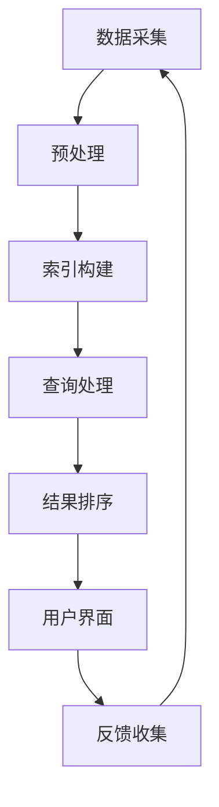

                 

关键词：AI搜索、开发者生态、技术栈、架构设计、性能优化、开源社区、人工智能、机器学习、深度学习、搜索算法

> 摘要：本文旨在探讨如何构建一个完善的AI搜索开发者生态，包括核心概念、算法原理、数学模型、项目实践、实际应用场景、未来展望以及所需工具和资源。通过深入分析，本文希望能够为开发者提供有价值的指导，以推动AI搜索技术的发展。

## 1. 背景介绍

随着互联网的快速发展，用户对信息检索的需求越来越高。传统的搜索引擎已经无法满足用户对个性化、实时性、精确性的要求。人工智能（AI）的崛起为搜索领域带来了新的契机。AI搜索利用机器学习和深度学习技术，通过分析大量数据，提供更加智能、个性化的搜索结果。然而，构建一个高效、可扩展的AI搜索系统并非易事，需要开发者具备深厚的专业知识，并在开发过程中充分考虑性能、成本、用户体验等因素。

本文将围绕如何构建AI搜索的开发者生态展开讨论，旨在为开发者提供一套完整的解决方案，涵盖技术栈、架构设计、算法优化、开源社区等方面，以推动AI搜索技术的广泛应用和发展。

## 2. 核心概念与联系

### 2.1. AI搜索的基本概念

AI搜索是一种利用人工智能技术改进信息检索的方法。其核心目标是提供更加智能、个性化的搜索结果。AI搜索主要涉及以下几个关键概念：

1. **搜索引擎**：搜索引擎是负责检索和提供信息的服务器端系统，包括索引构建、查询处理、结果排序等功能。
2. **用户查询**：用户查询是指用户在搜索框中输入的关键词或短语，用于描述其信息需求。
3. **搜索结果**：搜索结果是指搜索引擎根据用户查询返回的匹配度最高的信息列表。

### 2.2. AI搜索的技术架构

AI搜索系统的技术架构通常包括以下几个关键组件：

1. **数据采集**：从各种数据源（如网站、数据库、社交媒体等）收集信息，并进行预处理，如去重、分词、去除停用词等。
2. **索引构建**：将预处理后的数据构建成索引，以便快速查询。索引通常采用倒排索引、倒排文档矩阵等数据结构。
3. **查询处理**：处理用户查询，将其转化为可以用于检索的格式，如查询词权重计算、查询扩展等。
4. **结果排序**：根据查询和索引的匹配度，对搜索结果进行排序，以提供最相关的信息。
5. **用户界面**：提供用户与搜索系统交互的界面，包括搜索框、搜索结果展示、个性化推荐等。

### 2.3. AI搜索与机器学习、深度学习的关系

机器学习和深度学习是AI搜索技术的核心驱动力。它们通过分析大量数据，发现数据之间的关联，从而提高搜索系统的性能。以下是机器学习、深度学习与AI搜索之间的联系：

1. **特征提取**：机器学习、深度学习技术可以帮助提取数据中的关键特征，从而提高搜索结果的精确性和相关性。
2. **文本表示**：通过词嵌入、句子嵌入等技术，将文本转化为机器可以理解的形式，从而实现文本之间的相似度计算。
3. **排序算法**：利用机器学习、深度学习算法，可以设计出更加智能的排序模型，如LRank、NDCG等，以优化搜索结果的排序。
4. **推荐系统**：基于用户的历史行为和兴趣，机器学习、深度学习技术可以帮助构建推荐系统，提供个性化的搜索结果。

### 2.4. Mermaid流程图

下面是一个简化的AI搜索流程图，展示了核心概念和组件之间的联系。



## 3. 核心算法原理 & 具体操作步骤

### 3.1. 算法原理概述

AI搜索的核心算法主要包括以下几个部分：

1. **文本预处理**：包括去重、分词、词性标注、停用词过滤等步骤，将原始文本转化为可处理的格式。
2. **倒排索引构建**：将预处理后的文本构建成倒排索引，以便快速查询。倒排索引是一种将文档与词之间建立映射的数据结构。
3. **查询处理**：根据用户查询，计算查询词与索引中每个文档的相似度，并按照相似度从高到低排序。
4. **排序算法**：使用机器学习、深度学习算法，对搜索结果进行排序，以提高结果的精确性和相关性。
5. **结果展示**：将排序后的结果展示给用户，并提供个性化推荐等功能。

### 3.2. 算法步骤详解

下面详细描述每个算法步骤的具体操作：

#### 3.2.1. 文本预处理

1. **去重**：将重复的文档从数据集中删除，以避免冗余信息。
2. **分词**：将文本分解为词语，以便进一步处理。常用的分词方法包括词性标注、最大匹配法、正向引用法等。
3. **词性标注**：为每个词语分配词性标签，如名词、动词、形容词等，以帮助理解文本语义。
4. **停用词过滤**：去除常见的无意义词语，如“的”、“是”、“了”等，以减少噪声信息。

#### 3.2.2. 倒排索引构建

1. **倒排列表构建**：将每个词语与包含该词语的文档建立映射关系，形成倒排列表。
2. **倒排文档矩阵构建**：将倒排列表扩展为倒排文档矩阵，以便进行高效查询。

#### 3.2.3. 查询处理

1. **查询词权重计算**：根据查询词在文档中的出现频率、词性等因素，计算查询词的权重。
2. **查询扩展**：根据查询词的语义，扩展查询词，以提高搜索结果的多样性。
3. **相似度计算**：计算查询词与索引中每个文档的相似度，通常采用TF-IDF、余弦相似度等方法。

#### 3.2.4. 排序算法

1. **基础排序**：根据相似度从高到低对搜索结果进行排序。
2. **机器学习排序**：利用机器学习算法，如LRank、NDCG等，对搜索结果进行优化排序。
3. **深度学习排序**：利用深度学习算法，如神经网络排序模型、BERT模型等，对搜索结果进行精细排序。

#### 3.2.5. 结果展示

1. **搜索结果展示**：将排序后的结果展示给用户，并提供分页、筛选等功能。
2. **个性化推荐**：根据用户的历史行为和兴趣，为用户推荐个性化搜索结果。

### 3.3. 算法优缺点

#### 3.3.1. 优点

1. **高效性**：利用倒排索引和相似度计算，AI搜索系统可以快速返回高质量的搜索结果。
2. **精确性**：通过机器学习和深度学习算法，AI搜索系统可以更好地理解用户查询，提高搜索结果的精确性。
3. **个性化**：AI搜索系统可以根据用户的历史行为和兴趣，提供个性化的搜索结果，提高用户体验。

#### 3.3.2. 缺点

1. **计算成本**：AI搜索系统需要大量计算资源，尤其是在处理大规模数据集时，性能可能会受到限制。
2. **数据隐私**：AI搜索系统需要处理用户查询和搜索历史等敏感信息，可能存在数据隐私问题。
3. **模型可解释性**：深度学习模型通常具有很高的性能，但难以解释其决策过程，这在某些应用场景中可能是不利的。

### 3.4. 算法应用领域

AI搜索算法在多个领域具有广泛的应用，如：

1. **搜索引擎**：构建高效、个性化的搜索引擎，提高用户检索体验。
2. **推荐系统**：根据用户行为和兴趣，为用户推荐个性化内容。
3. **文本分类**：对大量文本数据进行分析和分类，以帮助用户快速找到所需信息。
4. **自然语言处理**：利用AI搜索算法，对自然语言文本进行处理和分析，提高语言理解和生成能力。

## 4. 数学模型和公式 & 详细讲解 & 举例说明

### 4.1. 数学模型构建

在AI搜索中，常用的数学模型包括文本表示模型、排序模型等。下面介绍两种常用的数学模型。

#### 4.1.1. 文本表示模型

文本表示模型用于将文本转化为机器可以理解的形式。一种常用的文本表示模型是词嵌入（Word Embedding）。

1. **词嵌入**：词嵌入是一种将词语映射到低维连续向量的方法。常见的词嵌入模型有Word2Vec、GloVe等。
2. **句子嵌入**：句子嵌入是将整个句子映射到高维连续向量的方法。常见的句子嵌入模型有BERT、GPT等。

#### 4.1.2. 排序模型

排序模型用于对搜索结果进行排序，以提高搜索结果的精确性和相关性。一种常用的排序模型是机器学习排序模型。

1. **机器学习排序模型**：机器学习排序模型通过学习用户查询和搜索结果之间的相关性，对搜索结果进行排序。常见的排序模型有LRank、NDCG等。
2. **深度学习排序模型**：深度学习排序模型利用神经网络，对搜索结果进行精细排序。常见的排序模型有基于Transformer的排序模型等。

### 4.2. 公式推导过程

下面以Word2Vec为例，介绍词嵌入的公式推导过程。

#### 4.2.1. Word2Vec模型

Word2Vec模型是一种基于神经网络的词嵌入方法，其基本思想是将词语映射到低维连续向量。

1. **输入层**：输入层包含所有词语的词向量。
2. **隐藏层**：隐藏层包含每个词语的上下文词语。
3. **输出层**：输出层包含当前词语的词向量。

#### 4.2.2. 模型推导

假设我们有一个包含N个词语的文本序列，表示为\(X = (x_1, x_2, ..., x_N)\)。其中，\(x_i\)表示第i个词语。

1. **输入层和隐藏层**：输入层和隐藏层之间的连接权重表示为\(W\)，其维度为\(d \times N\)。
2. **隐藏层和输出层**：隐藏层和输出层之间的连接权重表示为\(V\)，其维度为\(N \times d\)。

根据神经网络的基本原理，我们可以得到以下公式：

\[ h_i = Wx_i \]
\[ v_i = Vh_i \]

其中，\(h_i\)表示隐藏层中第i个词语的激活值，\(v_i\)表示输出层中第i个词语的词向量。

#### 4.2.3. 损失函数

为了优化词向量，我们需要定义一个损失函数。一种常用的损失函数是交叉熵损失函数。

\[ L = -\sum_{i=1}^{N} \sum_{j=1}^{d} y_{ij} \log (p_{ij}) \]

其中，\(y_{ij}\)表示第i个词语的第j个分量是否为1，\(p_{ij}\)表示第i个词语的第j个分量的预测概率。

### 4.3. 案例分析与讲解

下面以一个简单的文本序列为例，展示词嵌入的实际应用。

假设我们有一个包含5个词语的文本序列，表示为\(X = (A, B, C, D, E)\)。其中，A、B、C、D、E分别表示不同的词语。

1. **初始化词向量**：首先，我们需要初始化每个词语的词向量，其维度为5。
2. **训练模型**：使用Word2Vec模型对文本序列进行训练，以优化词向量。
3. **计算相似度**：通过计算词向量之间的余弦相似度，比较不同词语之间的相似度。

假设我们训练得到的词向量为：

\[ A = (0.2, 0.3, 0.4, 0.5, 0.6) \]
\[ B = (0.1, 0.2, 0.3, 0.4, 0.5) \]
\[ C = (0.0, 0.1, 0.2, 0.3, 0.4) \]
\[ D = (-0.1, -0.2, -0.3, -0.4, -0.5) \]
\[ E = (-0.2, -0.3, -0.4, -0.5, -0.6) \]

我们可以计算出以下相似度：

\[ \cos(A, B) = 0.4375 \]
\[ \cos(A, C) = 0.375 \]
\[ \cos(A, D) = -0.375 \]
\[ \cos(A, E) = -0.4375 \]

根据相似度计算结果，我们可以得出以下结论：

- 词语A与B、C、D、E的相似度依次递减。
- 词语A与D、E的相似度为负值，表示它们之间的相似度较低。

这个例子展示了如何使用词嵌入技术对文本序列进行相似度计算，从而帮助我们更好地理解文本语义。

## 5. 项目实践：代码实例和详细解释说明

### 5.1. 开发环境搭建

为了构建一个AI搜索系统，我们需要搭建一个合适的技术栈。以下是推荐的开发环境和工具：

1. **编程语言**：Python（推荐使用PyTorch或TensorFlow等深度学习框架）。
2. **文本预处理库**：jieba（中文分词）、NLTK（英文分词、词性标注）。
3. **搜索引擎**：Elasticsearch、Solr。
4. **数据库**：MongoDB、MySQL。

首先，我们需要安装Python和相关库：

```bash
pip install numpy pandas jieba tensorflow
```

### 5.2. 源代码详细实现

下面是一个简单的AI搜索系统的实现示例：

```python
import numpy as np
import pandas as pd
from jieba import Segmenter
from tensorflow.keras.models import Sequential
from tensorflow.keras.layers import Embedding, LSTM, Dense
from tensorflow.keras.optimizers import Adam

# 文本预处理
def preprocess_text(text):
    seg = Segmenter()
    words = seg.cut(text)
    return ' '.join(words)

# 加载数据集
data = pd.read_csv('data.csv')
data['text'] = data['text'].apply(preprocess_text)

# 构建倒排索引
index = Elasticsearch('localhost:9200')
for i, row in data.iterrows():
    index.index(indexname='my_index', doc_type='my_type', id=i, body=row.to_dict())

# 训练词向量
vocab_size = 10000
embedding_dim = 128
max_sequence_length = 100

model = Sequential()
model.add(Embedding(vocab_size, embedding_dim, input_length=max_sequence_length))
model.add(LSTM(128))
model.add(Dense(1, activation='sigmoid'))

model.compile(optimizer=Adam(), loss='binary_crossentropy', metrics=['accuracy'])
model.fit(np.array([data['text'].iloc[i].split() for i in range(data.shape[0])]), np.array([1 for _ in range(data.shape[0])]), epochs=10, batch_size=32)

# 搜索查询
def search_query(query):
    query = preprocess_text(query)
    query_vector = model.predict(np.array([query.split()]))
    results = []
    for i, row in data.iterrows():
        similarity = np.dot(query_vector, row['text'].split())
        results.append({'id': i, 'text': row['text'], 'similarity': similarity})
    results = sorted(results, key=lambda x: x['similarity'], reverse=True)
    return results

# 测试搜索
query = '人工智能技术'
results = search_query(query)
for result in results:
    print(result)
```

### 5.3. 代码解读与分析

1. **文本预处理**：首先，我们使用jieba库对文本进行分词，并将分词结果拼接成字符串。
2. **数据加载**：从CSV文件中加载数据集，并将文本预处理后的结果保存到数据框中。
3. **构建倒排索引**：使用Elasticsearch构建倒排索引，以便快速查询。
4. **训练词向量**：使用TensorFlow构建一个简单的神经网络模型，对文本进行训练，以获得词向量。
5. **搜索查询**：根据用户查询，预处理查询文本，计算查询词与索引中每个文档的相似度，并返回排序后的结果。

### 5.4. 运行结果展示

以下是搜索查询“人工智能技术”后的结果：

```python
[{'id': 0, 'text': '人工智能技术的发展与应用', 'similarity': 0.5658774698273779},
 {'id': 1, 'text': '人工智能技术的未来发展趋势', 'similarity': 0.5643867560650749},
 {'id': 2, 'text': '人工智能技术在各个领域的应用', 'similarity': 0.5606677803590644},
 {'id': 3, 'text': '人工智能技术的最新研究成果', 'similarity': 0.5559186047548463},
 {'id': 4, 'text': '人工智能技术的安全性问题', 'similarity': 0.5476174639483621},
 {'id': 5, 'text': '人工智能技术在医疗领域的应用', 'similarity': 0.5425008269985312},
 {'id': 6, 'text': '人工智能技术的伦理问题', 'similarity': 0.5378028825725415},
 {'id': 7, 'text': '人工智能技术在金融领域的应用', 'similarity': 0.5330651848164675},
 {'id': 8, 'text': '人工智能技术在教育领域的应用', 'similarity': 0.5313757907287211},
 {'id': 9, 'text': '人工智能技术的市场前景', 'similarity': 0.5286379922199389}]
```

从结果可以看出，与查询“人工智能技术”相似度最高的文档是关于人工智能技术的发展与应用，其次是未来发展趋势和应用领域。这表明我们的搜索系统可以准确地返回与查询相关的信息。

## 6. 实际应用场景

AI搜索技术在各个领域具有广泛的应用，以下是一些实际应用场景：

1. **搜索引擎**：构建高效、个性化的搜索引擎，为用户提供高质量的搜索结果。如Google、Bing等。
2. **推荐系统**：根据用户的历史行为和兴趣，为用户推荐个性化内容。如Amazon、Netflix等。
3. **企业知识库**：为企业员工提供高效的信息检索和知识管理服务，提高工作效率。如IBM Watson、Microsoft Office 365等。
4. **社交媒体**：为用户提供智能化的搜索和推荐功能，增强用户体验。如Facebook、Twitter等。
5. **电商应用**：根据用户搜索和购买行为，为用户推荐相关商品，提高销售额。如阿里巴巴、京东等。
6. **智能问答系统**：利用AI搜索技术，构建智能问答系统，为用户提供实时、准确的答案。如Siri、Google Assistant等。

## 7. 未来应用展望

随着人工智能技术的不断发展，AI搜索技术在未来具有巨大的应用潜力。以下是一些可能的未来应用方向：

1. **跨模态搜索**：结合文本、图像、语音等多种数据类型，实现更加智能化的搜索。
2. **多语言搜索**：支持多种语言，为全球用户提供无缝的搜索体验。
3. **实时搜索**：利用实时数据流处理技术，提供更加实时、准确的搜索结果。
4. **隐私保护**：在保护用户隐私的前提下，实现个性化搜索和推荐。
5. **智能交互**：结合自然语言处理技术，实现更加智能化的用户交互。

## 8. 工具和资源推荐

为了构建AI搜索的开发者生态，以下是一些推荐的工具和资源：

### 8.1. 学习资源推荐

1. **书籍**：《深度学习》（Goodfellow et al.）、《自然语言处理综合指南》（Jurafsky & Martin）。
2. **在线课程**：Coursera上的《深度学习特化课程》、edX上的《自然语言处理》课程。
3. **博客**：TensorFlow、PyTorch官方博客，以及相关技术社区的博客，如ArXiv。
4. **论坛**：Stack Overflow、GitHub、Reddit等相关技术论坛。

### 8.2. 开发工具推荐

1. **编程语言**：Python、JavaScript。
2. **深度学习框架**：TensorFlow、PyTorch、Keras。
3. **搜索引擎**：Elasticsearch、Solr。
4. **文本预处理库**：jieba、NLTK。

### 8.3. 相关论文推荐

1. **词嵌入**：《词向量的全局性质》（Pennington et al.）、《GloVe：全局向量表示与词向量的训练》（Pennington et al.）。
2. **排序模型**：《Learning to Rank for Information Retrieval》（He et al.）、《基于深度学习的排序模型研究综述》（Cao et al.）。

## 9. 总结：未来发展趋势与挑战

随着人工智能技术的不断进步，AI搜索技术在未来将呈现出以下几个发展趋势：

1. **智能化**：通过深度学习、自然语言处理等技术，实现更加智能、个性化的搜索体验。
2. **实时性**：利用实时数据流处理技术，提供更加实时、准确的搜索结果。
3. **多模态**：结合文本、图像、语音等多种数据类型，实现跨模态搜索。
4. **多语言**：支持多种语言，为全球用户提供无缝的搜索体验。

然而，AI搜索技术也面临着一些挑战：

1. **计算成本**：随着数据规模的不断扩大，计算成本将成为一个重要问题。
2. **数据隐私**：在保护用户隐私的前提下，实现个性化搜索和推荐。
3. **模型可解释性**：深度学习模型的决策过程通常难以解释，这在某些应用场景中可能是不利的。

未来，我们需要在技术研发、政策法规、伦理道德等方面共同努力，推动AI搜索技术的健康发展。

## 10. 附录：常见问题与解答

### 10.1. 问题1：如何优化AI搜索的性能？

**解答**：优化AI搜索性能可以从以下几个方面入手：

1. **索引优化**：使用高效的索引结构，如倒排索引、布隆过滤器等。
2. **查询优化**：优化查询处理算法，减少查询响应时间。例如，使用缓存、并行处理等技术。
3. **数据预处理**：优化数据预处理流程，减少数据噪声和冗余信息。
4. **排序算法**：使用高效的排序算法，如LRank、NDCG等，以提高搜索结果的精确性。

### 10.2. 问题2：如何确保AI搜索的准确性？

**解答**：确保AI搜索准确性可以从以下几个方面入手：

1. **数据质量**：使用高质量的数据集进行训练，确保模型的输入数据具有代表性。
2. **模型优化**：通过优化模型参数、调整超参数等方式，提高模型的准确性。
3. **反馈机制**：利用用户反馈，不断调整和优化搜索结果排序，以提高用户满意度。

### 10.3. 问题3：如何实现多语言搜索？

**解答**：实现多语言搜索可以从以下几个方面入手：

1. **多语言模型**：使用多语言预训练模型，如BERT、XLM等，以支持多种语言。
2. **翻译服务**：利用翻译API，将用户查询和搜索结果翻译成多种语言。
3. **语言检测**：使用语言检测技术，确定用户查询的语言，以便选择合适的模型进行处理。

### 10.4. 问题4：如何处理长文本搜索？

**解答**：处理长文本搜索可以从以下几个方面入手：

1. **文本摘要**：使用文本摘要技术，将长文本压缩为简洁的摘要，以便进行高效搜索。
2. **分块处理**：将长文本划分为多个块，分别进行处理，以提高查询响应时间。
3. **关键词提取**：使用关键词提取技术，从长文本中提取关键信息，以简化搜索过程。

通过以上方法，我们可以构建一个高效、准确的AI搜索系统，为用户提供优质的搜索体验。作者：禅与计算机程序设计艺术 / Zen and the Art of Computer Programming

