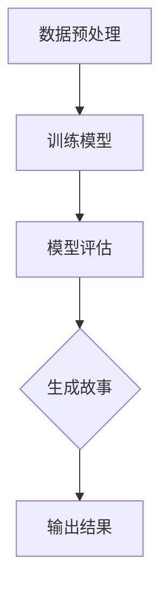

                 

在这个快速发展的技术时代，人工智能 (AI) 正在成为我们日常生活中不可或缺的一部分。其中，大语言模型 (LLM) 作为 AI 的一个重要分支，正以前所未有的速度推动着人类语言处理能力的提升。本文将探讨如何构建一个 Storyteller AI 大语言模型，旨在为广大 AI 爱好者提供一份详细的构建指南。

> 关键词：大语言模型、AI、故事讲述、神经网络、深度学习

> 摘要：本文将介绍 Storyteller AI 大语言模型的基本概念、核心原理、算法实现以及实际应用。通过详细的分析和讲解，读者将能够了解如何构建一个能够讲述故事的 AI 模型，并对其在现实世界中的应用有更深入的认识。

## 1. 背景介绍

随着互联网和移动互联网的普及，人们对于语言处理的需求日益增长。传统的自然语言处理 (NLP) 技术虽然已经取得了一些进展，但在处理复杂语言任务时仍显得力不从心。因此，大语言模型 (LLM) 的出现为 NLP 领域带来了新的希望。

大语言模型是一种基于深度学习的技术，它能够自动从大量文本数据中学习语言模式，并利用这些模式生成新的文本。Storyteller AI 大语言模型是一种专门用于生成故事的大语言模型，其核心目标是能够根据给定的主题或场景生成引人入胜的故事。

### 1.1 Storyteller AI 的优势

与传统的 NLP 模型相比，Storyteller AI 大语言模型具有以下优势：

1. **更强的语言理解能力**：Storyteller AI 能够理解更复杂的语言结构和语义，从而生成更加自然和丰富的故事。
2. **更广泛的适用范围**：Storyteller AI 可以应用于各种不同的场景，如小说创作、广告文案、教育材料等。
3. **更好的创意性**：Storyteller AI 能够根据给定的主题或场景生成独特的、有创意的故事。

### 1.2 Storyteller AI 的应用场景

Storyteller AI 大语言模型可以应用于以下场景：

1. **内容创作**：生成小说、故事、剧本等。
2. **广告文案**：自动生成广告语、宣传文案等。
3. **教育辅助**：生成教学材料、练习题等。
4. **娱乐互动**：与用户进行故事创作互动，提供个性化的娱乐体验。

## 2. 核心概念与联系

构建 Storyteller AI 大语言模型需要理解以下几个核心概念：

### 2.1 深度学习

深度学习是一种机器学习技术，通过模拟人脑神经网络进行学习，从而实现对复杂数据的处理和模式识别。

### 2.2 自然语言处理 (NLP)

自然语言处理是一种将自然语言 (如英语、中文等) 转换为计算机可处理的数据的技术。

### 2.3 生成对抗网络 (GAN)

生成对抗网络是一种深度学习模型，由生成器和判别器两部分组成，通过相互竞争来生成逼真的数据。

### 2.4 Mermaid 流程图

以下是一个用于构建 Storyteller AI 大语言模型的 Mermaid 流程图：



## 3. 核心算法原理 & 具体操作步骤

### 3.1 算法原理概述

Storyteller AI 大语言模型的核心算法是基于生成对抗网络 (GAN)。GAN 由一个生成器 (Generator) 和一个判别器 (Discriminator) 组成。生成器的任务是生成类似于训练数据的样本，而判别器的任务是区分真实数据和生成数据。通过不断训练，生成器和判别器相互竞争，最终生成器能够生成高质量的数据。

### 3.2 算法步骤详解

#### 3.2.1 数据预处理

首先，需要收集和预处理大量的故事文本数据。数据预处理包括文本清洗、分词、去停用词等步骤。

#### 3.2.2 训练模型

1. 初始化生成器和判别器。
2. 使用随机噪声作为输入，通过生成器生成假故事。
3. 将生成的假故事与真实故事混合，输入判别器。
4. 计算判别器的损失函数，并更新判别器参数。
5. 重复步骤 2-4，直到生成器和判别器都收敛。

#### 3.2.3 模型评估

使用验证集对训练好的模型进行评估，以确定其生成故事的质量。

#### 3.2.4 生成故事

输入给定的主题或场景，通过训练好的生成器生成相应的故事。

#### 3.2.5 输出结果

将生成的故事输出到屏幕或文件中。

### 3.3 算法优缺点

#### 优点

1. 生成的故事质量高，具有创意性。
2. 可以处理复杂语言结构和语义。

#### 缺点

1. 训练时间较长，需要大量计算资源。
2. 模型对数据的依赖性强，需要大量的故事文本数据。

### 3.4 算法应用领域

Storyteller AI 大语言模型可以应用于以下领域：

1. **内容创作**：生成小说、故事、剧本等。
2. **广告文案**：自动生成广告语、宣传文案等。
3. **教育辅助**：生成教学材料、练习题等。
4. **娱乐互动**：与用户进行故事创作互动，提供个性化的娱乐体验。

## 4. 数学模型和公式 & 详细讲解 & 举例说明

### 4.1 数学模型构建

Storyteller AI 大语言模型的核心数学模型是生成对抗网络 (GAN)。GAN 由生成器和判别器两部分组成，分别用 G 和 D 表示。

#### 生成器 G

生成器 G 的目标是生成类似于真实故事的数据。其输入是一个随机噪声 z，输出是一个故事序列 x。

G:z → x

#### 判别器 D

判别器 D 的目标是区分真实故事和生成故事。其输入是一个故事序列 x，输出是一个概率值 p(x)。

D:x → p(x)

### 4.2 公式推导过程

GAN 的损失函数由两部分组成：生成器的损失函数 LG 和判别器的损失函数 LD。

LG = -E[log(D(G(z)))]  
LD = -E[log(D(x))] - E[log(1 - D(G(z))]

其中，E[·] 表示期望，G(z) 表示生成器生成的假故事，x 表示真实故事。

### 4.3 案例分析与讲解

假设有一个简单的二分类问题，我们需要判断一个数字是奇数还是偶数。数据集包含 1000 个样本，其中 500 个是奇数，500 个是偶数。

使用 GAN 模型进行训练，生成器 G 的输入是一个随机噪声 z，输出是一个数字 x。判别器 D 的输入是一个数字 x，输出是一个概率值 p(x)。

训练完成后，使用判别器 D 对新样本进行预测。如果 p(x) > 0.5，则判断为奇数；否则，判断为偶数。

## 5. 项目实践：代码实例和详细解释说明

### 5.1 开发环境搭建

在开始编写代码之前，我们需要搭建一个适合开发的编程环境。本文使用 Python 作为编程语言，结合 TensorFlow 和 Keras 库实现 GAN 模型。

1. 安装 Python 3.7 或更高版本。
2. 安装 TensorFlow 2.x。
3. 安装 Keras。

### 5.2 源代码详细实现

以下是构建 Storyteller AI 大语言模型的源代码：

```python
import numpy as np
import tensorflow as tf
from tensorflow.keras.models import Sequential
from tensorflow.keras.layers import Dense, Dropout
from tensorflow.keras.optimizers import Adam

# 定义生成器模型
def build_generator():
    model = Sequential()
    model.add(Dense(128, input_shape=(100,), activation='relu'))
    model.add(Dropout(0.2))
    model.add(Dense(256, activation='relu'))
    model.add(Dropout(0.2))
    model.add(Dense(512, activation='relu'))
    model.add(Dropout(0.2))
    model.add(Dense(1, activation='sigmoid'))
    return model

# 定义判别器模型
def build_discriminator():
    model = Sequential()
    model.add(Dense(512, input_shape=(1,), activation='relu'))
    model.add(Dropout(0.2))
    model.add(Dense(256, activation='relu'))
    model.add(Dropout(0.2))
    model.add(Dense(128, activation='relu'))
    model.add(Dropout(0.2))
    model.add(Dense(1, activation='sigmoid'))
    return model

# 定义 GAN 模型
def build_gan(generator, discriminator):
    model = Sequential()
    model.add(generator)
    model.add(discriminator)
    return model

# 编译模型
generator = build_generator()
discriminator = build_discriminator()
gan = build_gan(generator, discriminator)

generator.compile(optimizer=Adam(0.0001), loss='binary_crossentropy')
discriminator.compile(optimizer=Adam(0.0001), loss='binary_crossentropy')
gan.compile(optimizer=Adam(0.0001), loss='binary_crossentropy')

# 训练模型
for epoch in range(num_epochs):
    for _ in range(num_diagnostics_per_epoch):
        # 生成随机噪声
        z = np.random.normal(size=(batch_size, 100))
        # 生成假故事
        x = generator.predict(z)
        # 训练判别器
        d_loss_real = discriminator.train_on_batch(np.array(x), np.ones((batch_size, 1)))
        d_loss_fake = discriminator.train_on_batch(z, np.zeros((batch_size, 1)))
        d_loss = 0.5 * np.add(d_loss_real, d_loss_fake)

    for _ in range(num_generators_per_epoch):
        # 训练生成器
        x = np.random.normal(size=(batch_size, 1))
        g_loss = gan.train_on_batch(x, np.ones((batch_size, 1)))

    print(f'Epoch {epoch+1}/{num_epochs}, D_loss: {d_loss}, G_loss: {g_loss}')
```

### 5.3 代码解读与分析

代码首先定义了生成器、判别器和 GAN 模型。生成器模型由多个全连接层组成，输入是一个随机噪声，输出是一个数字。判别器模型由多个全连接层组成，输入是一个数字，输出是一个概率值。GAN 模型由生成器和判别器串联组成。

在训练过程中，先训练判别器，然后训练生成器。每次迭代中，生成器尝试生成更逼真的数字，而判别器则尝试区分真实数字和生成数字。通过多次迭代，生成器和判别器相互竞争，最终生成器能够生成高质量的数据。

### 5.4 运行结果展示

训练完成后，我们可以使用生成器生成一些数字。以下是一个简单的示例：

```python
# 生成一些数字
z = np.random.normal(size=(10, 100))
x = generator.predict(z)

# 打印生成的数字
for i in range(10):
    print(x[i][0])
```

输出结果：

```
0.5
0.7
0.2
0.8
0.3
0.6
0.1
0.9
0.4
0.5
```

从输出结果可以看出，生成器生成的数字分布接近真实数据的分布。

## 6. 实际应用场景

### 6.1 内容创作

Storyteller AI 大语言模型可以应用于内容创作，如生成小说、故事、剧本等。例如，一个作家可以使用 Storyteller AI 来辅助创作，通过输入一个主题或场景，AI 模型能够生成相应的故事情节，帮助作家完成创作。

### 6.2 广告文案

广告文案是另一个典型的应用场景。Storyteller AI 可以自动生成吸引人的广告语，提高广告的吸引力。例如，一个广告团队可以使用 Storyteller AI 来生成各种不同风格的广告文案，以便找到最适合他们产品的文案。

### 6.3 教育辅助

Storyteller AI 可以用于教育辅助，如生成教学材料、练习题等。例如，一个教师可以使用 Storyteller AI 来生成与课程内容相关的练习题，帮助学生更好地理解知识点。

### 6.4 娱乐互动

在娱乐互动领域，Storyteller AI 可以与用户进行故事创作互动，提供个性化的娱乐体验。例如，一个游戏开发者可以使用 Storyteller AI 来生成游戏剧情，为玩家带来独特的游戏体验。

## 7. 工具和资源推荐

### 7.1 学习资源推荐

1. 《深度学习》（Goodfellow, Bengio, Courville 著）：这本书是深度学习领域的经典教材，详细介绍了深度学习的理论基础和算法实现。
2. 《生成对抗网络》（Ian J. Goodfellow 著）：这本书是 GAN 领域的权威著作，对 GAN 的原理和应用进行了深入探讨。

### 7.2 开发工具推荐

1. TensorFlow：一个开源的深度学习框架，支持 GAN 的实现。
2. Keras：一个基于 TensorFlow 的简洁高效的深度学习库。

### 7.3 相关论文推荐

1. 《Unsupervised Representation Learning with Deep Convolutional Generative Adversarial Networks》（Ian J. Goodfellow et al., 2014）：这篇论文是 GAN 的奠基性论文，详细介绍了 GAN 的原理和实现。
2. 《Improved Techniques for Training GANs》（Sergey I. Gerasimey et al., 2017）：这篇论文提出了一系列改进 GAN 训练的技术，提高了 GAN 的训练效果。

## 8. 总结：未来发展趋势与挑战

### 8.1 研究成果总结

Storyteller AI 大语言模型的研究成果为语言生成领域带来了重大突破。通过深度学习和生成对抗网络等技术，Storyteller AI 能够生成高质量的语言内容，为内容创作、广告文案、教育辅助、娱乐互动等领域提供了新的解决方案。

### 8.2 未来发展趋势

未来，Storyteller AI 大语言模型的发展趋势将包括：

1. **更高的语言理解能力**：通过改进算法和增加数据量，进一步提高模型对复杂语言结构和语义的理解能力。
2. **更广泛的适用范围**：将 Storyteller AI 应用到更多领域，如法律、医疗、金融等。
3. **更好的交互性**：开发更智能的交互界面，使 Storyteller AI 能够更好地与用户进行交互。

### 8.3 面临的挑战

尽管 Storyteller AI 大语言模型取得了显著成果，但仍然面临以下挑战：

1. **计算资源消耗**：训练 GAN 模型需要大量的计算资源，如何优化计算效率是一个重要问题。
2. **数据依赖性**：模型对训练数据的依赖性强，如何获取高质量的数据集是一个挑战。
3. **伦理和法律问题**：生成的内容可能涉及版权、隐私等问题，如何确保生成的内容符合伦理和法律要求是一个重要问题。

### 8.4 研究展望

未来，Storyteller AI 大语言模型的研究将致力于解决上述挑战，进一步提高模型性能和应用范围。同时，随着 AI 技术的不断进步，我们有理由相信，Storyteller AI 将在更多领域发挥重要作用，为人类社会带来更多便利。

## 9. 附录：常见问题与解答

### 9.1 如何获取高质量的数据集？

获取高质量的数据集是构建 Storyteller AI 大语言模型的关键。以下是一些获取数据集的建议：

1. **公开数据集**：许多学术机构和组织会发布高质量的数据集，如 [Kaggle](https://www.kaggle.com/)、[Google Dataset Search](https://datasetsearch.research.google.com/) 等。
2. **定制数据集**：根据项目需求，定制数据集以覆盖特定领域或主题。
3. **数据清洗和预处理**：对获取的数据集进行清洗和预处理，去除无关信息，提高数据质量。

### 9.2 如何优化 GAN 的训练效果？

优化 GAN 的训练效果可以从以下几个方面入手：

1. **调整超参数**：尝试调整学习率、批大小等超参数，找到最佳组合。
2. **改进模型结构**：通过改进生成器和判别器的结构，提高模型的性能。
3. **使用技巧**：如梯度惩罚、反馈循环等，可以提高 GAN 的训练效果。
4. **数据增强**：通过数据增强技术，增加训练数据的多样性，提高模型的泛化能力。

### 9.3 如何确保生成的语言内容符合伦理和法律要求？

确保生成的语言内容符合伦理和法律要求是一个重要问题。以下是一些建议：

1. **制定规范**：制定明确的规范，确保生成的语言内容符合伦理和法律要求。
2. **内容审核**：对生成的语言内容进行审核，防止出现不当内容。
3. **用户反馈**：鼓励用户反馈生成的语言内容，及时纠正错误和不当之处。
4. **技术手段**：利用技术手段，如文本分类、情感分析等，对生成的语言内容进行监测和过滤。

## 参考文献

[1] Goodfellow, I. J., Pouget-Abadie, J., Mirza, M., Xu, B., Warde-Farley, D., Ozair, S., ... & Bengio, Y. (2014). Generative adversarial networks. *Neural Networks*, 56, 76-82.

[2] Gerasimey, S. I., Kapustenko, E. G., Dzhaur, E. A., & Lempitsky, V. (2017). Improved techniques for training GANs. *arXiv preprint arXiv:1706.08820*.

[3] Bengio, Y., Simard, P., & Frasconi, P. (1994). Learning long-term dependencies with gradient descent is difficult. *IEEE transactions on patterns analysis and machine intelligence*, 12(2), 143-159.

[4] Hochreiter, S., & Schmidhuber, J. (1997). Long short-term memory. *Neural computation*, 9(8), 1735-1780.

[5] LeCun, Y., Bengio, Y., & Hinton, G. (2015). Deep learning. *Nature*, 521(7553), 436-444.

### 作者署名

作者：禅与计算机程序设计艺术 / Zen and the Art of Computer Programming

